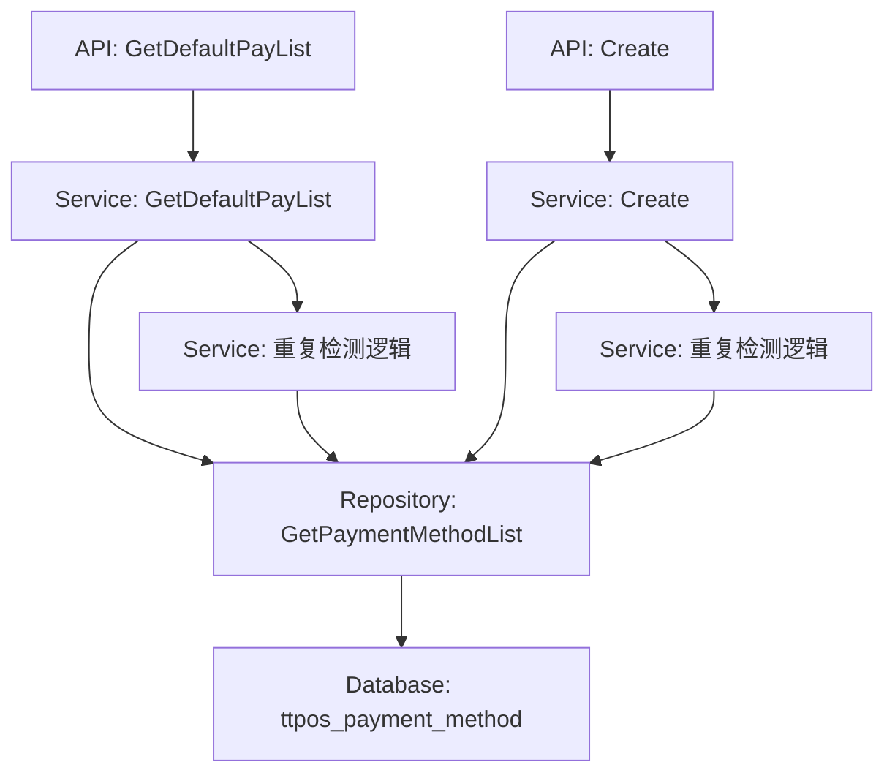

# 支付方式快捷添加（Kbank渠道）设计文档

> 本文档定义支付方式快捷添加（Kbank渠道）功能的技术设计和实现方案。

## 📋 概述

本功能通过扩展现有的 `GetDefaultPayList` 接口和 `Create` 接口，实现Kbank支付方式的快捷添加功能。主要工作包括：

1. 扩展 `GetDefaultPayList` 接口，增加5种Kbank支付方式定义
2. 扩展 `DefaultPaymentMethodResp` 响应结构，增加 `can_add`、`source` 字段（`name` 字段即为 `payment_name`）
3. 实现重复检测逻辑，标记已添加的Kbank支付方式（使用 `name` 字段对应数据库的 `payment_name`）
4. 在 `PaymentMethodCreateItem` 中增加 `source` 字段，支持批量创建时指定source

---

## 🎯 规范对齐

### Go Main 规范 (go-main.mdc)

- ✅ Service 只依赖其他 Service 接口
- ✅ Repository 只持有 db 实例
- ✅ URL 使用 snake_case（已符合：`/shop/payment_method/default_pay`）
- ✅ data 字段必须是对象（已符合）
- ✅ 不使用 panic，返回 error

### API 设计规范 (api.mdc)

- ✅ URL 使用 snake_case
- ✅ 响应格式统一：`{code, message, data{}}`
- ✅ data 不能为 null 或数组（已符合）

### 数据库规范 (database.mdc)

- ✅ 无需新增字段，使用现有 `source` 字段
- ✅ 使用现有 `ttpos_payment_method` 表

---

## 🔄 代码复用分析

### 可复用的现有组件

- **PaymentMethodService**: `main/app/service/payment_method.go` - 复用 `GetDefaultPayList` 和 `Create` 方法
- **PaymentMethodRepository**: `main/app/repository/payment_method.go` - 复用查询方法，新增 `WhereSource` 选项方法
- **DefaultPaymentMethodResp**: `main/app/dto/resp/payment_method.go` - 扩展响应结构（`name` 字段即为 `payment_name`）

### 集成点

- **GetDefaultPayList API**: `GET /shop/payment_method/default_pay` - 扩展返回Kbank支付方式
- **Create API**: `POST /shop/payment_method/create` - 延用现有接口，支持source参数
- **数据库表**: `ttpos_payment_method` - 使用现有表结构

---

## 🏗️ 架构设计

### 分层设计原则

**Go Main 三层架构**:

```
API 层 (shop_payment_method.go)
  ↓ 依赖
业务层 (payment_method.go Service)
  ↓ 依赖
数据层 (payment_method.go Repository)
```

**依赖规则**:
- ✅ API 层调用 Service 层
- ✅ Service 层调用 Repository 层
- ✅ Service 层可以依赖其他 Service 接口
- ❌ Service 层不能直接依赖 Repository

### 架构图



### 模块划分

#### Go Main 模块

- **API 层**: `main/app/api/v1/shop/shop_payment_method.go` - 路由处理、参数校验
- **Service 层**: `main/app/service/payment_method.go` - 业务逻辑、重复检测
- **Repository 层**: `main/app/repository/payment_method.go` - 数据访问、查询方法
- **DTO 层**: `main/app/dto/` - 数据传输对象
  - `req/payment_method_req.go` - 请求参数（扩展）
  - `resp/payment_method.go` - 响应数据（扩展）

---

## 🗄️ 数据库设计

### 数据表设计

无需新增表，使用现有 `ttpos_payment_method` 表。

**关键字段**:
- `payment_name`: varchar(255) - 支付名称（用于重复检测）
- `source`: tinyint(1) - 来源（0-系统，1-手动，2-LianLianPay，3-Kbank）
- `code`: int(11) - 支付方式代号（Kbank: 93000-93400）

**索引设计**:
- 已有索引：`idx_payment_name`（如有）
- 建议添加复合索引：`idx_payment_name_source`（用于重复检测查询优化）

---

## 📊 数据模型

### Go Model

使用现有 `model.PaymentMethod`，无需修改。

### DTO 定义

#### Request DTO 扩展

```go
// main/app/dto/req/payment_method_req.go
// PaymentMethodCreateItem 创建支付方式单项（扩展）
type PaymentMethodCreateItem struct {
	Name                 string  `json:"name" binding:"required"`
	PaymentName          string  `json:"payment_name" binding:"required"`
	Code                 int     `json:"code"`                                // 支付方式代号（可选）
	Source               int     `json:"source"`                              // 来源（新增，可选，默认1）
	LogoFileUuid         uint64  `json:"logo_file_uuid"`
	QrcodeFileUuid       uint64  `json:"qrcode_file_uuid"`
	DefaultImg           string  `json:"default_img"`
	FeePercent           float64 `json:"fee_percent" binding:"gte=0,lte=100"`
	IsShowCashier        int     `json:"is_show_cashier"`
	IsShowAssistant      int     `json:"is_show_assistant"`
	IsShowKiosk          int     `json:"is_show_kiosk"`
	IsShowMemberRecharge int     `json:"is_show_member_recharge"`
	Status               int     `json:"status"`
}
```

#### Response DTO 扩展

```go
// main/app/dto/resp/payment_method.go
// DefaultPaymentMethodResp 默认支付方式响应（扩展）
type DefaultPaymentMethodResp struct {
	Code   int    `json:"code"`    // 支付方式code
	Name   string `json:"name"`     // 支付方式名称（即payment_name）
	Url    string `json:"url"`      // 图片路径
	Img    string `json:"img"`      // 图片路径
	Sort   int    `json:"sort"`     // 排序
	CanAdd bool   `json:"can_add"`  // 是否可添加（新增）
	Source int    `json:"source"`   // 来源（新增）
}
```

---

## 🔌 API 设计

### RESTful API

#### API 1: 获取默认支付方式列表（扩展）

**请求**:

- **URL**: `/api/v1/shop/payment_method/default_pay`
- **Method**: `GET`
- **Headers**:
  ```json
  {
    "Authorization": "Bearer {token}",
    "Content-Type": "application/json"
  }
  ```

**响应**:

```json
{
  "code": 1,
  "message": "success",
  "data": [
    {
      "code": 93000,
      "name": "Alipay",
      "url": "https://example.com/image/pay/alipay.png",
      "img": "/image/pay/alipay.png",
      "sort": 0,
      "can_add": true,
      "source": 3
    },
    {
      "code": 93100,
      "name": "WeChatPay",
      "url": "https://example.com/image/pay/wechat_pay.png",
      "img": "/image/pay/wechat_pay.png",
      "sort": 1,
      "can_add": false,
      "source": 3
    },
    // ... 其他Kbank支付方式
    // ... 其他默认支付方式
  ]
}
```

**变更说明**:
- 新增字段：`can_add`、`source`（`name` 字段即为 `payment_name`，无需新增）
- Kbank支付方式在最前面（sort值最小：0-4）
- 已添加的Kbank支付方式 `can_add=false`

#### API 2: 批量创建支付方式（扩展）

**请求**:

- **URL**: `/api/v1/shop/payment_method/create`
- **Method**: `POST`
- **Headers**:
  ```json
  {
    "Authorization": "Bearer {token}",
    "Content-Type": "application/json"
  }
  ```
- **Body**:
  ```json
  {
    "items": [
      {
        "name": "Alipay",
        "payment_name": "Alipay",
        "code": 93000,
        "source": 3,
        "default_img": "/image/pay/alipay.png",
        "fee_percent": 0,
        "is_show_cashier": 1,
        "is_show_assistant": 1,
        "is_show_kiosk": 1,
        "is_show_member_recharge": 0,
        "status": 1
      }
    ]
  }
  ```

**响应**:

```json
{
  "code": 1,
  "message": "创建成功",
  "data": {}
}
```

**错误响应**:

```json
{
  "code": 0,
  "message": "支付方式已存在",
  "data": {}
}
```

**变更说明**:
- `PaymentMethodCreateItem` 新增 `source` 字段（可选）
- 创建前检查重复：`payment_name` + `source` 组合唯一性

---

## 🧩 组件和接口

### Service 层

#### Service 接口扩展

```go
// main/app/service/payment_method.go
// IPaymentMethodSrv 接口无需修改，复用现有方法
type IPaymentMethodSrv interface {
    GetDefaultPayList(ctx context.Context) []*resp.DefaultPaymentMethodResp  // 扩展实现
    Create(ctx context.Context, createReq *req.PaymentMethodCreateReq) error // 扩展实现
    // ... 其他方法
}
```

#### Service 实现扩展

**GetDefaultPayList 扩展**:

```go
// main/app/service/payment_method.go
func (s *paymentMethodSrv) GetDefaultPayList(ctx context.Context) []*resp.DefaultPaymentMethodResp {
    db := s.dbm.GetDB(ctx.GetCompanyUuid())
    paymentMethodRepo := repository.NewPaymentMethodRepo(db)
    
    // 1. 定义Kbank支付方式列表（在最前面）
    kbankPayments := []struct {
        Code        int
        Name        string
        PaymentName string
        Img         string
        Sort        int
    }{
        {93000, "Alipay", "Alipay", "/image/pay/alipay.png", 0},
        {93100, "WeChatPay", "WeChatPay", "/image/pay/wechat_pay.png", 1},
        {93200, "Credit QR", "Credit QR", "/image/pay/credit_qr.png", 2},
        {93300, "Thai QR", "Thai QR", "/image/pay/thai_qr.png", 3},
        {93400, "Credit Card", "Credit Card", "/image/pay/credit_card.png", 4},
    }
    
    // 2. 查询已添加的Kbank支付方式
    existingKbankPayments := paymentMethodRepo.GetPaymentMethodList(
        paymentMethodRepo.WhereSource(constant.PaymentMethodSourceKbank),
        repository.CommonRepo.WhereBySoftDelete(),
    )
    
    // 构建已添加的payment_name集合（用于快速查找）
    // 注意：DefaultPaymentMethodResp.Name 对应数据库的 payment_name 字段
    existingPaymentNames := make(map[string]bool)
    for _, pm := range existingKbankPayments {
        existingPaymentNames[pm.PaymentName] = true
    }
    
    // 3. 构建Kbank支付方式响应列表
    baseUrl := utils.GetBaseURL(ctx.GetGin().Request)
    if strings.HasSuffix(baseUrl, "/") {
        baseUrl = baseUrl[:len(baseUrl)-1]
    }
    
    result := make([]*resp.DefaultPaymentMethodResp, 0)
    for _, kp := range kbankPayments {
        canAdd := !existingPaymentNames[kp.PaymentName]
        result = append(result, &resp.DefaultPaymentMethodResp{
            Code:   kp.Code,
            Name:   kp.PaymentName, // name 字段即为 payment_name
            Url:    baseUrl + kp.Img,
            Img:    kp.Img,
            Sort:   kp.Sort,
            CanAdd: canAdd,
            Source: constant.PaymentMethodSourceKbank,
        })
    }
    
    // 4. 添加其他默认支付方式（原有逻辑）
    defaultPayments := []struct {
        Value int
        Name  string
        Img   string
        Sort  int
    }{
        // ... 原有支付方式定义
    }
    
    // ... 原有逻辑，添加到result
    
    return result
}
```

**Create 扩展**:

```go
// main/app/service/payment_method.go
func (s *paymentMethodSrv) Create(ctx context.Context, createReq *req.PaymentMethodCreateReq) error {
    db := s.dbm.GetDB(ctx.GetCompanyUuid())
    paymentMethodRepo := repository.NewPaymentMethodRepo(db)
    
    // 1. 重复检测：检查是否已存在相同的payment_name和source
    for _, item := range createReq.Items {
        source := item.Source
        if source == 0 {
            source = constant.PaymentMethodSourceDefault // 默认值
        }
        
        existing := paymentMethodRepo.GetPaymentMethod(
            paymentMethodRepo.WherePaymentName(item.PaymentName),
            paymentMethodRepo.WhereSource(source),
            repository.CommonRepo.WhereBySoftDelete(),
        )
        
        if existing.Uuid > 0 {
            return errors.New(fmt.Sprintf("支付方式 %s (source=%d) 已存在", item.PaymentName, source))
        }
    }
    
    // 2. 原有创建逻辑（使用传入的source值）
    // ... 原有代码，但使用 item.Source（如果提供）
}
```

### Repository 层

#### Repository 接口扩展

```go
// main/app/repository/payment_method.go
type IPaymentMethodRepo interface {
    // ... 现有方法
    WhereSource(source int) DBOption // 新增：按source查询
}
```

#### Repository 实现扩展

```go
// main/app/repository/payment_method.go
func (r *paymentMethodRepo) WhereSource(source int) DBOption {
    return func(db *gorm.DB) *gorm.DB {
        return db.Where("source = ?", source)
    }
}
```

### API 层

无需修改，延用现有API实现。

---

## ⚡ 缓存设计

### Redis 缓存

**缓存策略**: 暂不实现缓存，直接查询数据库。

**原因**:
- `GetDefaultPayList` 查询频率不高
- 数据变更频率低
- 查询性能已满足要求（< 200ms）

**未来优化**: 如需要，可缓存Kbank支付方式列表，缓存key：`ttpos:payment_method:kbank:{company_uuid}`

---

## 🚨 错误处理

### 错误场景

#### 场景 1: 重复创建Kbank支付方式

- **处理方式**: 创建前检查 `payment_name` + `source` 组合，如已存在则返回错误
- **用户影响**: 返回错误提示"支付方式已存在"
- **代码示例**:
  ```go
  existing := paymentMethodRepo.GetPaymentMethod(
      paymentMethodRepo.WherePaymentName(item.PaymentName),
      paymentMethodRepo.WhereSource(source),
      repository.CommonRepo.WhereBySoftDelete(),
  )
  if existing.Uuid > 0 {
      return errors.New(fmt.Sprintf("支付方式 %s (source=%d) 已存在", item.PaymentName, source))
  }
  ```

#### 场景 2: source字段未传入

- **处理方式**: 使用默认值 `source=1`（手动添加）
- **用户影响**: 无影响，使用默认值
- **代码示例**:
  ```go
  source := item.Source
  if source == 0 {
      source = constant.PaymentMethodSourceDefault // 默认值
  }
  ```

---

## 🔒 安全设计

### 身份验证

- ✅ **JWT Token**: 所有 API 需要 Token 验证（已有）

### 权限控制

- ✅ **RBAC**: 基于角色的访问控制（已有）

### 数据安全

- ✅ **SQL 注入防护**: 使用参数化查询（GORM）
- ✅ **参数验证**: 使用 binding 标签验证

---

## 🧪 测试策略

### 单元测试

**目标覆盖率**:
- Service: 70%+（Payment相关100%）
- Repository: 80%+

**测试内容**:
- `GetDefaultPayList`: 测试Kbank支付方式返回、重复检测逻辑、排序
- `Create`: 测试source字段处理、重复检测、批量创建

**示例**:

```go
// main/app/service/payment_method_test.go
func TestPaymentMethodService_GetDefaultPayList_Kbank(t *testing.T) {
    // 测试Kbank支付方式在最前面
    // 测试can_add字段正确性
    // 测试已添加的支付方式can_add=false
}

func TestPaymentMethodService_Create_WithSource(t *testing.T) {
    // 测试source字段处理
    // 测试重复检测
    // 测试批量创建
}
```

### API 测试

**测试内容**:
- `GET /shop/payment_method/default_pay`: 测试响应格式、Kbank支付方式位置、can_add字段
- `POST /shop/payment_method/create`: 测试source参数、重复检测、批量创建

### 集成测试

**测试流程**:
- 端到端流程：获取Kbank支付方式列表 → 选择未添加的 → 批量创建 → 再次获取列表 → 验证can_add=false

---

## 📈 性能优化

### 优化策略

1. **数据库优化**:
   - 添加复合索引：`idx_payment_name_source`（用于重复检测查询）
   - 优化查询：使用 `WherePaymentName` + `WhereSource` 组合查询

2. **查询优化**:
   - 批量查询已添加的Kbank支付方式，避免循环查询
   - 使用 map 快速查找已添加的支付方式

### 性能指标

- 本地响应时间: < 200ms
- 数据库查询: < 50ms（单次查询）
- 重复检测: < 10ms（批量查询）

---

## 🌐 浏览器兼容性

### 前端兼容性（Vue）

- Chrome 90+
- Safari 14+
- Firefox 88+
- Edge 90+

---

## 📚 实现清单

### Phase 1: DTO和常量扩展

- [ ] 扩展 `DefaultPaymentMethodResp`，增加 `can_add`、`source` 字段（`name` 字段即为 `payment_name`，无需新增）
- [ ] 扩展 `PaymentMethodCreateItem`，增加 `source` 字段
- [ ] 在 `constant/payment.go` 中定义 `PaymentMethodSourceKbank = 3`

### Phase 2: Repository扩展

- [ ] 在 `PaymentMethodRepo` 中新增 `WhereSource` 选项方法

### Phase 3: Service扩展

- [ ] 扩展 `GetDefaultPayList`，增加Kbank支付方式定义和重复检测逻辑
- [ ] 扩展 `Create`，增加source字段处理和重复检测

### Phase 4: 测试

- [ ] Service单元测试（覆盖率100%）
- [ ] Repository单元测试
- [ ] API集成测试

**详细任务**: 参见 `tasks.md`

---

## Graphiti & 活动日志

- Related Episode: `[待补充]`
- 模板：`docs/agent/templates/graphiti-episode.md`
- 活动日志：`docs/team/activities/{YYYY-MM}/{YYYY-MM-DD}.md`
- 在技术方案评审、关键架构决策或踩坑总结后，立即补充 Episode 并在设计文档尾部互链。

---

**版本**: v1.0.0  
**创建日期**: 2025-12-29  
**作者**: 王昱  
**审核者**: {审核者}

