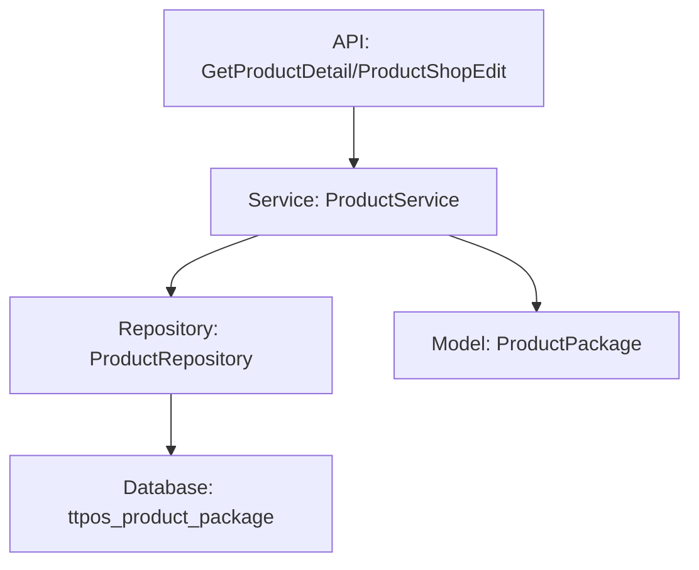

# 商品管理 增加商品详情（新管理端） 设计文档

> 本文档定义商品详情功能的技术设计和实现方案。

## 📋 概述

为商品管理模块提供商品详情字段的后端支持。在 `ttpos_product_package` 表中增加 `detail` 字段（LONGTEXT 类型），支持存储富文本 HTML 内容。商品新增与编辑接口均需支持 `detail` 字段的写入，商品详情查询接口需支持 `detail` 字段的读取，确保向后兼容。

---

## 🎯 规范对齐

### Go Main 规范 (go-main.mdc)

- Service 只依赖其他 Service 接口
- Repository 只持有 db 实例
- URL 使用 snake_case
- data 字段必须是对象
- 不使用 panic，返回 error

### API 设计规范 (api.mdc)

- URL 使用 snake_case
- 响应格式统一：`{code, message, data{}}`
- data 不能为 null 或数组

### 数据库规范 (database.mdc)

- 必需字段完整（id, uuid, create_time, update_time, delete_time）
- 时间字段使用 int
- 字段名使用 snake_case
- 表名使用 ttpos\_ 前缀

---

## 🔄 代码复用分析

### 可复用的现有组件

- **ProductService**: `main/app/service/product.go` - 商品业务逻辑服务
- **ProductRepository**: `main/app/repository/product.go` - 商品数据访问
- **ProductPackage Model**: `main/app/model/product.go` - 商品数据模型
- **ProductDetailResp**: `main/app/dto/resp/product_resp/product.go` - 商品详情响应 DTO
- **ProductShopEditReq**: `main/app/dto/req/product_req.go` - 商品编辑请求 DTO

### 集成点

- **现有 API**: `/shop/product/detail` (GET) - 获取商品详情接口，需要增加 `detail` 字段返回
- **现有 API**: `/shop/product/edit` (POST) - 编辑商品接口，需要增加 `detail` 字段更新支持
- **数据库表**: `ttpos_product_package` - 需要添加 `detail` 字段

---

## 🏗️ 架构设计

### 分层设计原则

**Go Main 三层架构**:

```
API 层 (Controller/API)
  ↓ 依赖
业务层 (Service)
  ↓ 依赖
数据层 (Repository)
```

**依赖规则**:

- ✅ 上层可依赖下层
- ❌ 禁止下层依赖上层
- ❌ 禁止跨层调用
- ❌ Service 不能依赖 Repository
- ✅ Service 可以依赖其他 Service 接口

### 架构图



### 模块划分

#### Go Main 模块

- **API 层**: `main/app/api/v1/shop/shop_product.go` - 路由处理、参数校验
- **Service 层**: `main/app/service/product.go` - 业务逻辑、事务管理
- **Repository 层**: `main/app/repository/product.go` - 数据访问、数据库操作
- **Model 层**: `main/app/model/product.go` - 数据模型（ProductPackage）
- **DTO 层**: `main/app/dto/` - 数据传输对象
  - `req/product_req.go` - 请求参数（ProductShopEditReq）
  - `resp/product_resp/product.go` - 响应数据（ProductDetailResp）

---

## 🗄️ 数据库设计

### 数据表设计

#### 表: ttpos_product_package

**新增字段**:

```sql
ALTER TABLE `ttpos_product_package` 
ADD COLUMN `detail` LONGTEXT NOT NULL COMMENT '商品详情（富文本）' AFTER `describe`;
```

**字段说明**:

| 字段 | 类型 | 说明 | 约束 |
|------|------|------|------|
| detail | LONGTEXT | 商品详情（富文本） | - |

**索引设计**:

- 不需要为 `detail` 字段添加索引（LONGTEXT 类型，内容较大，不适合索引）

**迁移文件**: `admin/database/migrations/{YYYYMMDDHHMMSS}_add_detail_to_ttpos_product_package_table.php`

### 数据库迁移

**迁移脚本**:

```bash
# 创建迁移文件
cd admin
php think migrate:create AddDetailToTtposProductPackageTable

# 执行迁移
php think migrate:run
```

**同步 Go Model**:

在 `main/app/model/product.go` 中的 `ProductPackage` 结构体中添加 `Detail` 字段。

**参考**: `docs/agent/workflows/database-migration.md`

---

## 📊 数据模型

### Go Model

```go
// main/app/model/product.go
type ProductPackage struct {
	BaseModel
	// ... 现有字段 ...
	Describe string `gorm:"default:'';column:describe;comment:'卖点描述'"`
	Detail   string `gorm:"type:longtext;column:detail;comment:'商品详情（富文本）'"` // 新增字段
	
	// ... 其他字段和关联 ...
}
```

### DTO 定义

#### Request DTO

```go
// main/app/dto/req/product_req.go
type ProductShopEditReq struct {
	Uuid   uint64 `json:"uuid" binding:"required"`
	// ... 现有字段 ...
	Detail string `json:"detail"` // 新增字段，可选
}

type ProductShopAddReq struct {
	// ... 现有字段 ...
	Detail string `json:"detail"` // 新增字段，可选
}
```

#### Response DTO

```go
// main/app/dto/resp/product_resp/product.go
type ProductDetailResp struct {
	Uuid   uint64 `json:"uuid"`
	// ... 现有字段 ...
	Detail string `json:"detail"` // 新增字段
}
```

---

## 🔌 API 设计

### RESTful API

#### API 1: 获取商品详情（已有接口，增加字段）

**请求**:

- **URL**: `/api/v1/shop/product/detail`
- **Method**: `GET`
- **Headers**:
  ```json
  {
    "Authorization": "Bearer {token}",
    "Content-Type": "application/json"
  }
  ```
- **Query Parameters**:
  ```json
  {
    "uuid": 123456
  }
  ```

**响应**:

```json
{
  "code": 1,
  "message": "success",
  "data": {
    "uuid": 123456,
    "name": "商品名称",
    "detail": "<p>商品详情内容（HTML格式）</p>",
    "...": "..."
  }
}
```

**错误响应**:

```json
{
  "code": 0,
  "message": "错误信息",
  "data": {}
}
```

#### API 2: 编辑商品（已有接口，增加字段）

**请求**:

- **URL**: `/api/v1/shop/product/edit`
- **Method**: `POST`
- **Headers**:
  ```json
  {
    "Authorization": "Bearer {token}",
    "Content-Type": "application/json"
  }
  ```
- **Body**:
  ```json
  {
    "uuid": 123456,
    "detail": "<p>商品详情内容（HTML格式）</p>",
    "...": "..."
  }
  ```

**响应**:

```json
{
  "code": 1,
  "message": "保存成功",
  "data": {}
}
```

**错误响应**:

```json
{
  "code": 0,
  "message": "错误信息",
  "data": {}
}
```

#### API 3: 新增商品（已有接口，增加字段）

**请求**:

- **URL**: `/api/v1/shop/product/add`
- **Method**: `POST`
- **Headers**:
  ```json
  {
    "Authorization": "Bearer {token}",
    "Content-Type": "application/json"
  }
  ```
- **Body**:
  ```json
  {
    "detail": "<p>商品详情内容（HTML格式）</p>",
    "...": "..."
  }
  ```

**响应**:

```json
{
  "code": 1,
  "message": "保存成功",
  "data": {}
}
```

**错误响应**:

```json
{
  "code": 0,
  "message": "错误信息",
  "data": {}
}
```

---

## 🧩 组件和接口

### Service 层

#### Service 接口（已有，无需修改）

```go
// main/app/service/i_product_srv.go
type IProductSrv interface {
    GetProductDetail(ctx *gin.Context, req req.ProductDetailReq) (*product_resp.ProductDetailResp, error)
    EditProductShop(ctx *gin.Context, req req.ProductShopEditReq) (interface{}, []string, error)
    // ... 其他方法 ...
}
```

#### Service 实现（需要修改）

```go
// main/app/service/product.go
func (s *productSrv) GetProductDetail(ctx *gin.Context, req req.ProductDetailReq) (*product_resp.ProductDetailResp, error) {
    // ... 现有逻辑 ...
    
    // 在返回的 ProductDetailResp 中增加 Detail 字段
    resp := &product_resp.ProductDetailResp{
        // ... 现有字段 ...
        Detail: productPackage.Detail, // 新增
    }
    
    return resp, nil
}

func (s *productSrv) EditProductShop(ctx *gin.Context, req req.ProductShopEditReq) (interface{}, []string, error) {
    // ... 现有逻辑 ...
    
    // 在更新 ProductPackage 时增加 Detail 字段
    if req.Detail != "" {
        productPackage.Detail = req.Detail
    }
    
    // ... 保存逻辑 ...
}

func (s *productSrv) AddProductShop(ctx *gin.Context, req req.ProductShopAddReq) error {
	// ... 现有逻辑 ...

	productPackage := &model.ProductPackage{
		// ... 现有字段赋值 ...
		Detail: req.Detail, // 新增字段
	}

	// 保存逻辑
	// ...
}
```

### Repository 层

#### Repository 接口（已有，无需修改）

```go
// main/app/repository/i_product_repo.go
type IProductRepo interface {
    GetByUuid(uuid uint64, options ...DBOption) (*model.ProductPackage, error)
    Update(productPackage *model.ProductPackage, options ...DBOption) error
    // ... 其他方法 ...
}
```

#### Repository 实现（无需修改，自动支持新字段）

由于使用 GORM，Repository 层无需修改，会自动支持新增的 `Detail` 字段。

### API 层（已有，无需修改）

```go
// main/app/api/v1/shop/shop_product.go
// GetProductDetail 和 ProductShopEdit 接口已存在，无需修改
// 只需要确保 DTO 中包含 Detail 字段即可
```

---

## ⚡ 缓存设计

### Redis 缓存

**缓存策略**:

- 商品详情查询可以考虑缓存，但由于富文本内容可能较大，暂不实现缓存
- 如果后续需要，可以使用 Cache-Aside Pattern

---

## 🚨 错误处理

### 错误场景

#### 场景 1: 商品不存在

- **处理方式**: 返回错误信息 "商品不存在"
- **用户影响**: 前端显示错误提示
- **代码示例**:
  ```go
  productPackage, err := repo.GetByUuid(uuid)
  if err != nil {
      if errors.Is(err, gorm.ErrRecordNotFound) {
          return nil, errors.WithMessage(err, "商品不存在")
      }
      return nil, errors.WithMessage(err, "查询商品失败")
  }
  ```

#### 场景 2: 富文本内容过大

- **处理方式**: 前端限制内容长度，后端不做限制（LONGTEXT 类型支持较大内容）
- **用户影响**: 前端提示内容过长

---

## 🔒 安全设计

### 身份验证

- **JWT Token**: 所有 API 需要 Token 验证（已有）

### 权限控制

- **API 权限**: 每个 API 检查用户权限（已有）

### 数据安全

- **SQL 注入防护**: 使用参数化查询（GORM 自动处理）
- **XSS 防护**: 富文本内容由前端负责过滤和校验，后端仅存储

---

## 🧪 测试策略

### 单元测试

**目标覆盖率**:

- main/app/service: 70%+
- main/app/repository: 80%+

**测试内容**:

- Service 业务逻辑（GetProductDetail, EditProductShop）
- Repository 数据访问（GetByUuid, Update）
- DTO 数据转换

**示例**:

```go
// main/app/service/product_test.go
func TestProductService_GetProductDetail_WithDetail(t *testing.T) {
    // 测试获取商品详情时包含 detail 字段
}

func TestProductService_EditProductShop_UpdateDetail(t *testing.T) {
    // 测试更新商品详情字段
}
```

### API 测试

**测试内容**:

- API 接口调用
- 参数验证
- 响应格式
- 错误处理

### 集成测试

**测试流程**:

- 端到端业务流程（查询 → 更新 → 再次查询）
- 数据库事务
- 向后兼容性测试

---

## 📈 性能优化

### 优化策略

1. **数据库优化**:
   - 不需要为 `detail` 字段添加索引（LONGTEXT 类型）
   - 查询时仅返回必要字段（如果查询量大，可以考虑 SELECT 指定字段）

2. **接口优化**:
   - 富文本内容较大时，不影响其他字段的查询性能
   - 更新时仅更新变更的字段

### 性能指标

- 本地响应时间: < 200ms
- 数据库查询: < 50ms（不含富文本内容传输时间）

---

## 📚 实现清单

### Phase 1: 数据库和模型

- [ ] 创建数据库迁移文件
- [ ] 执行数据库迁移
- [ ] 更新 Go Model（ProductPackage）
- [ ] 验证字段添加成功

### Phase 2: 核心实现

- [ ] 更新 Request DTO（ProductShopEditReq）
- [ ] 更新 Response DTO（ProductDetailResp）
- [ ] 更新 Service 实现（GetProductDetail, EditProductShop）
- [ ] 验证字段读写正确

### Phase 3: 测试和优化

- [ ] 单元测试
- [ ] API 测试
- [ ] 集成测试
- [ ] 向后兼容性测试

**详细任务**: 参见 `tasks.md`

---

## Graphiti & 活动日志

- Related Episode: `[待补充]`
- 模板：`docs/agent/templates/graphiti-episode.md`
- 活动日志：`docs/team/activities/{YYYY-MM}/{YYYY-MM-DD}.md`
- 在技术方案评审、关键架构决策或踩坑总结后，立即补充 Episode 并在设计文档尾部互链。

---

**版本**: v1.0.0  
**创建日期**: 2025-11-25  
**作者**: 开发组  
**审核者**: {审核者}


