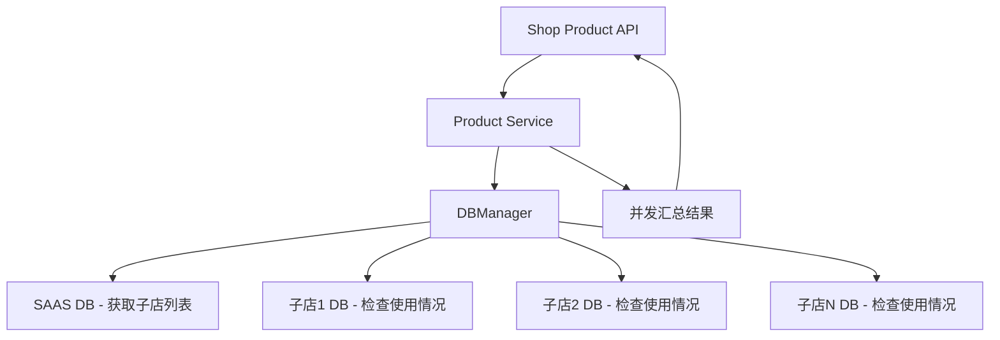

# 总店删除资源时子店使用情况验证 设计文档（后端）

> 本文档定义总店删除规格、属性组、属性、加料、单位、商品时，检查子店使用情况的后端技术设计和实现方案。

## 📋 概述

本功能实现总店删除资源（规格、属性组、属性、加料、单位、商品）时的子店使用情况检查和验证逻辑，通过以下设计：

1. **Repository 层**：提供单个子店使用情况的查询方法
2. **Service 层**：实现跨数据库并发查询、删除前验证逻辑
3. **API 层**：优化删除接口的响应和错误数据

**⚠️ 架构关键**：每个门店有独立数据库，采用以下方案：
- **总店身份检查**：只有总店删除时才执行子店使用情况检查
- 从 SAAS 数据库（`constant.DefaultDB`）获取所有子店列表
- 并发遍历每个子店数据库（goroutine + 信号量限流）
- 使用 `DBManager.GetDB(shopUuid)` 连接子店数据库
- 并发数限制为 20，避免数据库连接耗尽
- **返回所有子店名称**（不限制数量），由前端决定显示策略

**📦 范围说明**：
- ✅ **本 Spec 包含**：Go Main 后端实现
- ❌ **不包含**：Vue 前端（由前端开发者根据 API 响应实现 Toast 提示）
- ❌ **不包含**：ERP 同步（预留接口，由 ERP 集成开发者实现）

---

## 🎯 规范对齐

### Go Main 规范 (go-main.mdc)

本设计严格遵循 Go Main 开发规范：

- ✅ Service 只依赖其他 Service 接口（不直接依赖 Repository）
- ✅ Repository 只持有 db 实例（不持有 DBManager）
- ✅ URL 使用 snake_case（如：`/api/v1/shop/product/delete`）
- ✅ data 字段必须是对象
- ✅ 不使用 panic，返回 error
- ✅ 使用 errors.WithMessage 包装错误

### API 设计规范 (api.mdc)

- ✅ URL 使用 snake_case
- ✅ 响应格式统一：`{code, message, data{}}`
- ✅ data 不能为 null 或数组

### 数据库规范 (database.mdc)

- ✅ 使用索引优化查询
- ✅ 软删除检查（delete_time = 0）
- ✅ 使用 JOIN 减少查询次数

---

## 🔄 代码复用分析

### 可复用的现有组件

- **ProductService**: `main/app/service/product.go` - 商品服务，包含删除方法
- **CompanyRepository**: `main/app/repository/company.go` - 公司数据访问，获取子店列表
- **ProductRepository**: `main/app/repository/product.go` - 商品数据访问
- **DBManager**: `main/app/database/db_manager.go` - 数据库管理器，支持跨数据库连接

### 集成点

- **现有删除 API**: 扩展现有的删除接口，在删除前添加子店使用情况检查
- **API 响应格式**: 返回使用情况数据供前端显示 Toast 提示

---

## 🏗️ 架构设计

### 分层设计原则

**Go Main 三层架构**:

```
API 层 (Controller/API)
  ↓ 依赖
业务层 (Service)
  ↓ 依赖（通过 Service 接口）
数据层 (Repository)
```

**依赖规则**:

- ✅ API 依赖 Service 接口
- ✅ Service 依赖其他 Service 接口
- ❌ Service 不直接依赖 Repository
- ✅ Service 通过 DBManager 获取 Repository 实例

### 架构图



### 模块划分

#### Go Main 模块

- **API 层**: `main/app/api/v1/shop/shop_product.go` - 商品删除 API
- **Service 层**: `main/app/service/product.go` - 商品服务（扩展删除逻辑）
- **Service 层**: `main/app/service/shop.go` - 店铺服务（查询子店）
- **Repository 层**: `main/app/repository/product.go` - 商品数据访问
- **Repository 层**: `main/app/repository/shop.go` - 店铺数据访问
- **DTO 层**: 
  - `main/app/dto/req/shop_product_req.go` - 请求参数
  - `main/app/dto/resp/shop_product_resp.go` - 响应数据

---

## 🗄️ 数据库设计

### 涉及的数据表

本功能不需要新建表，主要使用现有表：

#### 表 1: ttpos_product（商品表）

**相关字段**:
- `id` - 商品 ID
- `uuid` - 商品 UUID
- `company_uuid` - 所属公司 UUID
- `parent_company_uuid` - 总店公司 UUID（子店商品会有值）
- `spec_uuid` - 规格 UUID
- `attribute_uuid` - 属性 UUID
- `addition_uuid` - 加料 UUID
- `unit_uuid` - 单位 UUID
- `delete_time` - 软删除时间

**索引**:
- `idx_parent_company_uuid` - 总店公司索引
- `idx_spec_uuid` - 规格索引
- `idx_attribute_uuid` - 属性索引
- `idx_addition_uuid` - 加料索引
- `idx_unit_uuid` - 单位索引

#### 表 2: ttpos_company（公司表）

**相关字段**:
- `id` - 公司 ID
- `uuid` - 公司 UUID
- `name` - 公司名称
- `parent_uuid` - 父公司 UUID（总店 UUID）
- `delete_time` - 软删除时间

**索引**:
- `idx_parent_uuid` - 父公司索引

#### 表 3: ttpos_package_product（套餐商品关联表）

**相关字段**:
- `id` - ID
- `package_uuid` - 套餐 UUID
- `product_uuid` - 商品 UUID
- `company_uuid` - 所属公司 UUID
- `delete_time` - 软删除时间

**索引**:
- `idx_product_uuid` - 商品索引
- `idx_company_uuid` - 公司索引

### 查询优化

#### 查询 1: 检查规格被哪些子店使用

```sql
SELECT DISTINCT c.uuid, c.name
FROM ttpos_product p
INNER JOIN ttpos_company c ON p.company_uuid = c.uuid
WHERE p.spec_uuid = ? 
  AND p.parent_company_uuid = ? 
  AND p.delete_time = 0 
  AND c.delete_time = 0
ORDER BY c.name
LIMIT 10
```

**优化**:
- 使用 `idx_spec_uuid` 和 `idx_parent_company_uuid` 索引
- INNER JOIN 提高查询效率
- LIMIT 10 限制返回数量

#### 查询 2: 检查商品被哪些子店套餐使用

```sql
SELECT DISTINCT c.uuid, c.name
FROM ttpos_package_product pp
INNER JOIN ttpos_company c ON pp.company_uuid = c.uuid
WHERE pp.product_uuid = ? 
  AND pp.delete_time = 0 
  AND c.delete_time = 0
  AND c.parent_uuid = ?
ORDER BY c.name
LIMIT 10
```

**优化**:
- 使用 `idx_product_uuid` 索引
- INNER JOIN 提高查询效率

---

## 📊 数据模型

### DTO 定义

#### Request DTO（复用现有）

```go
// main/app/dto/req/shop_product_req.go
// 使用现有的删除请求 DTO
type ProductDeleteReq struct {
    Uuid uint64 `json:"uuid" binding:"required"`
}

type FlavorDeleteReq struct {
    Uuid uint64 `json:"uuid" binding:"required"`
}

type AttributeGroupDeleteReq struct {
    Uuid uint64 `json:"uuid" binding:"required"`
}

type AttributeDeleteReq struct {
    Uuid uint64 `json:"uuid" binding:"required"`
}

type SauceDeleteReq struct {
    Uuid uint64 `json:"uuid" binding:"required"`
}

type UnitDeleteReq struct {
    Uuid uint64 `json:"uuid" binding:"required"`
}

// 新增：检查使用情况的响应 DTO
type ResourceUsageResp struct {
    IsUsed       bool     `json:"is_used"`        // 是否被使用
    UsedByShops  []string `json:"used_by_shops"`  // 使用的子店名称列表
    TotalCount   int      `json:"total_count"`    // 总使用子店数量
}
```

---

## 🔌 API 设计

### RESTful API

#### 删除规格 API（修改现有接口）
                found = true
                break
            }
        }
        if !found {
            removedAttrUuids = append(removedAttrUuids, oldAttr.Uuid)
        }
    }
    
    // 3. 批量检查被移除的属性
    if len(removedAttrUuids) > 0 {
        usageMap, _ := api.productSrv.CheckAttributesUsageBatch(c, removedAttrUuids)
        
        // 4. 如果有被使用的，阻止更新
        usedAttrs := []string{}
        for attrUuid, usage := range usageMap {
            if usage.IsUsed {
                attrName := findAttributeName(oldGroup.Attributes, attrUuid)
                usedAttrs = append(usedAttrs, 
                    fmt.Sprintf("%s（%s等%d个子店使用）", 
                        attrName,
                        strings.Join(usage.UsedByShops[:min(2, len(usage.UsedByShops))], "、"),
                        usage.TotalCount))
            }
        }
        
        if len(usedAttrs) > 0 {
            helper.ErrorWithData(c, constant.CodeFail, 
                "无法移除正在使用的属性",
                gin.H{"used_attributes": usedAttrs})
            return
        }
    }
    
    // 5. 执行更新
    // ...
}
```

**响应（移除被使用的属性时）**:

```json
{
  "code": 0,
  "message": "无法移除正在使用的属性",
  "data": {
    "used_attributes": [
      "微辣（子店A、子店B等5个子店使用）",
      "中辣（子店C等2个子店使用）"
    ]
  }
}
```

---

#### API 1: 删除规格（扩展现有接口）

**请求**:

- **URL**: `/api/v1/shop/spec/delete`
- **Method**: `POST`
- **Headers**:
  ```json
  {
    "Authorization": "Bearer {token}",
    "Content-Type": "application/json"
  }
  ```
- **Body**:
  ```json
  {
    "uuid": 123456
  }
  ```

**响应（成功）**:

```json
{
  "code": 1,
  "message": "删除成功",
  "data": {}
}
```

**响应（失败 - 子店正在使用）**:

```json
{
  "code": 0,
  "message": "子店正在使用该规格",
  "data": {
    "is_used": true,
    "used_by_shops": ["子店A", "子店B", "子店C", "子店D", "...所有使用的子店"],
    "total_count": 15
  }
}
```

**说明**：
- `used_by_shops` 包含**所有**使用该资源的子店名称（不限制数量）
- `total_count` 等于 `used_by_shops` 的长度
- 前端根据数量决定显示策略：
  - 当 `total_count <= 10` 时：`删除失败，子店A、子店B、子店C正在使用该规格`
  - 当 `total_count > 10` 时：`删除失败，子店A、子店B、子店C等15个子店正在使用该规格`

#### API 2-6: 其他资源删除

同理，扩展现有的删除接口：
- `/api/v1/shop/attribute_group/delete` - 属性组删除
- `/api/v1/shop/attribute/delete` - 属性删除
- `/api/v1/shop/sauce/delete` - 加料删除
- `/api/v1/shop/unit/delete` - 单位删除
- `/api/v1/shop/product/delete` - 商品删除

---

## 🧩 组件和接口

### Repository 层

#### Repository 接口扩展

```go
// main/app/repository/i_product_repo.go
type IProductRepo interface {
    // ... 现有方法 ...
    
    // 检查规格被哪些子店使用
    CheckFlavorUsageInShop(flavorUuid uint64) (bool, error)
    
    // 检查属性组被哪些子店使用
    CheckAttributeGroupUsageInShop(attributeGroupUuid uint64) (bool, error)
    
    // 检查属性被哪些子店使用
    CheckAttributeUsageInShop(attributeUuid uint64) (bool, error)
    
    // 检查加料被哪些子店使用
    CheckSauceUsageInShop(sauceUuid uint64) (bool, error)
    
    // 检查单位被哪些子店使用
    CheckUnitUsageInShop(unitUuid uint64) (bool, error)
    
    // 检查商品被哪些子店套餐使用
    CheckProductUsageInPackage(productUuid uint64) (bool, error)
}
```

#### Repository 实现（跨数据库版本）

由于每个门店有独立数据库，需要采用**跨数据库查询**方案：

```go
// main/app/repository/product_repo.go

// CheckFlavorUsageInShop 检查指定子店是否使用了该规格
func (r *productRepoImpl) CheckFlavorUsageInShop(flavorUuid uint64) (bool, error) {
    var count int64
    
    err := r.db.Table("ttpos_product_bom pb").
        Joins("INNER JOIN ttpos_product_package p ON pb.product_package_uuid = p.uuid AND p.delete_time = 0").
        Where("pb.product_flavor_uuid = ?", flavorUuid).
        Where("pb.delete_time = 0").
        Count(&count).Error
    
    if err != nil {
        return false, err
    }
    
    return count > 0, nil
}

// CheckAttributeGroupUsageInShop 检查指定子店是否使用了该属性组
func (r *productRepoImpl) CheckAttributeGroupUsageInShop(attributeGroupUuid uint64) (bool, error) {
    var count int64
    
    err := r.db.Table("ttpos_product_package_attribute_group pag").
        Joins("INNER JOIN ttpos_product_package p ON pag.product_package_uuid = p.uuid AND p.delete_time = 0").
        Where("pag.product_attribute_group_uuid = ?", attributeGroupUuid).
        Where("pag.delete_time = 0").
        Count(&count).Error
    
    if err != nil {
        return false, err
    }
    
    return count > 0, nil
}

// CheckAttributeUsageInShop 检查指定子店是否使用了该属性
func (r *productRepoImpl) CheckAttributeUsageInShop(attributeUuid uint64) (bool, error) {
    var count int64
    
    err := r.db.Table("ttpos_product_package_attribute ppa").
        Joins("INNER JOIN ttpos_product_package_attribute_group pag ON ppa.product_package_attribute_group_uuid = pag.uuid AND pag.delete_time = 0").
        Joins("INNER JOIN ttpos_product_package p ON pag.product_package_uuid = p.uuid AND p.delete_time = 0").
        Where("ppa.attribute_uuid = ?", attributeUuid).
        Where("ppa.delete_time = 0").
        Count(&count).Error
    
    if err != nil {
        return false, err
    }
    
    return count > 0, nil
}

// CheckSauceUsageInShop 检查指定子店是否使用了该加料
func (r *productRepoImpl) CheckSauceUsageInShop(sauceUuid uint64) (bool, error) {
    var count int64
    
    err := r.db.Table("ttpos_product_bom pb").
        Joins("INNER JOIN ttpos_product_package p ON pb.product_package_uuid = p.uuid AND p.delete_time = 0").
        Where("pb.product_sauce_uuid = ?", sauceUuid).
        Where("pb.delete_time = 0").
        Count(&count).Error
    
    if err != nil {
        return false, err
    }
    
    return count > 0, nil
}

// CheckUnitUsageInShop 检查指定子店是否使用了该单位
func (r *productRepoImpl) CheckUnitUsageInShop(unitUuid uint64) (bool, error) {
    var count int64
    
    err := r.db.Table("ttpos_product_package p").
        Where("p.unit_uuid = ?", unitUuid).
        Where("p.delete_time = 0").
        Count(&count).Error
    
    if err != nil {
        return false, err
    }
    
    return count > 0, nil
}

// CheckProductUsageInPackage 检查指定子店的套餐是否使用了该商品
func (r *productRepoImpl) CheckProductUsageInPackage(productUuid uint64) (bool, error) {
    var count int64
    
    // 通过 product_package_group_item 表查询套餐商品关联
    err := r.db.Table("ttpos_product_package_group_item pgi").
        Joins("INNER JOIN ttpos_product_package_group pg ON pgi.product_package_group_uuid = pg.uuid AND pg.delete_time = 0").
        Joins("INNER JOIN ttpos_product_package p ON pg.product_package_uuid = p.uuid AND p.delete_time = 0 AND p.product_type = 1"). // product_type=1 表示套餐
        Where("pgi.related_uuid = ?", productUuid). // 套餐包含的商品UUID
        Where("pgi.delete_time = 0").
        Count(&count).Error
    
    if err != nil {
        return false, err
    }
    
    return count > 0, nil
}
```

### Service 层

#### Service 接口扩展

```go
// main/app/service/i_product_srv.go
type IProductSrv interface {
    // ... 现有方法 ...
    
    // ========== 独立查询接口（新增） ==========
    
    // 检查单个属性的子店使用情况（独立接口，不执行删除）
    CheckAttributeUsage(ctx *gin.Context, attributeUuid uint64) (*dto_resp.ResourceUsageResp, error)
    
    // 批量检查多个属性的子店使用情况（用于编辑属性组时）
    CheckAttributesUsageBatch(ctx *gin.Context, attributeUuids []uint64) (map[uint64]*dto_resp.ResourceUsageResp, error)
    
    // ========== 删除前检查接口 ==========
    
    // 检查规格删除前的子店使用情况
    CheckFlavorUsageBeforeDelete(ctx *gin.Context, flavorUuid uint64) (*dto_resp.ResourceUsageResp, error)
    
    // 检查属性组删除前的子店使用情况
    CheckAttributeGroupUsageBeforeDelete(ctx *gin.Context, attributeGroupUuid uint64) (*dto_resp.ResourceUsageResp, error)
    
    // 检查属性删除前的子店使用情况
    CheckAttributeUsageBeforeDelete(ctx *gin.Context, attributeUuid uint64) (*dto_resp.ResourceUsageResp, error)
    
    // 检查加料删除前的子店使用情况
    CheckSauceUsageBeforeDelete(ctx *gin.Context, sauceUuid uint64) (*dto_resp.ResourceUsageResp, error)
    
    // 检查单位删除前的子店使用情况
    CheckUnitUsageBeforeDelete(ctx *gin.Context, unitUuid uint64) (*dto_resp.ResourceUsageResp, error)
    
    // 检查商品删除前的子店使用情况
    CheckProductUsageBeforeDelete(ctx *gin.Context, productUuid uint64) (*dto_resp.ResourceUsageResp, error)
}
```

#### Service 实现（跨数据库版本）

```go
// main/app/service/product_srv.go

// CheckFlavorUsageBeforeDelete 检查规格删除前的子店使用情况（跨数据库版本）
func (s *productSrv) CheckFlavorUsageBeforeDelete(ctx *gin.Context, flavorUuid uint64) (*dto_resp.ResourceUsageResp, error) {
    companyUuid := ctx.GetCompanyUuid()
    companySetting := ctx.GetCompanySetting()
    
    // 0. 检查是否为总店，只有总店才需要检查子店使用情况
    if companySetting.IsSubShop() {
        // 子店删除资源无需检查，直接返回未使用
        return &dto_resp.ResourceUsageResp{
            IsUsed:      false,
            UsedByShops: []string{},
            TotalCount:  0,
        }, nil
    }
    
    // 1. 从 SAAS 数据库获取所有子店列表
    saasDB := s.dbm.GetDB(constant.DefaultDB)
    companyRepo := repository.NewCompanyRepo(saasDB)
    
    childShops, err := companyRepo.GetNoDeleteListByHeadquarterUuid(companyUuid)
    if err != nil {
        logger.Logger.Error("获取子店列表失败", zap.Error(err))
        return nil, errors.WithMessage(err, "获取子店列表失败")
    }
    
    // 2. 并发查询每个子店
    type shopResult struct {
        ShopName string
        IsUsed   bool
    }
    
    results := make([]shopResult, 0)
    mu := sync.Mutex{}
    var wg sync.WaitGroup
    
    // 使用信号量限制并发数
    semaphore := make(chan struct{}, 20) // 最多同时查询20个子店
    
    for _, shop := range childShops {
        // 跳过总店自己
        if shop.Uuid == companyUuid {
            continue
        }
        
        wg.Add(1)
        go func(shopUuid uint64, shopName string) {
            defer wg.Done()
            
            // 限流
            semaphore <- struct{}{}
            defer func() { <-semaphore }()
            
            // 获取子店数据库连接
            shopDB := s.dbm.GetDB(shopUuid)
            if shopDB == nil {
                logger.Logger.Warn("无法连接子店数据库",
                    zap.String("shop", shopName),
                    zap.Uint64("shop_uuid", shopUuid),
                )
                return
            }
            
            // 查询该子店是否使用该规格
            productRepo := repository.NewProductRepo(shopDB)
            isUsed, err := productRepo.CheckFlavorUsageInShop(flavorUuid)
            if err != nil {
                logger.Logger.Warn("查询子店使用情况失败",
                    zap.String("shop", shopName),
                    zap.Error(err),
                )
                return
            }
            
            if isUsed {
                mu.Lock()
                results = append(results, shopResult{
                    ShopName: shopName,
                    IsUsed:   true,
                })
                mu.Unlock()
            }
        }(shop.Uuid, shop.Name)
    }
    
    wg.Wait()
    
    // 3. 按名称排序
    sort.Slice(results, func(i, j int) bool {
        return results[i].ShopName < results[j].ShopName
    })
    
    // 4. 构造响应（返回所有子店名称，不限制数量）
    usedShops := make([]string, 0, len(results))
    for _, result := range results {
        usedShops = append(usedShops, result.ShopName)
    }
    
    resp := &dto_resp.ResourceUsageResp{
        IsUsed:      len(results) > 0,
        UsedByShops: usedShops,        // 所有子店名称
        TotalCount:  len(results),
    }
    
    return resp, nil
}

// ========== 独立查询接口实现（新增） ==========

// CheckAttributeUsage 检查属性的子店使用情况（独立接口，不执行删除）
func (s *productSrv) CheckAttributeUsage(ctx *gin.Context, attributeUuid uint64) (*dto_resp.ResourceUsageResp, error) {
    companySetting := ctx.GetCompanySetting()
    
    // 只有总店可以查询
    if companySetting.IsSubShop() {
        return nil, errors.New("只有总店可以查询子店使用情况")
    }
    
    // 使用与 CheckAttributeUsageBeforeDelete 相同的逻辑
    // 从 SAAS 数据库获取子店列表，并发查询每个子店
    // ... 实现逻辑同 CheckFlavorUsageBeforeDelete，只需替换 CheckAttributeUsageInShop
    
    // 为了代码复用，可以提取公用方法
    return s.checkResourceUsageAcrossShops(ctx, attributeUuid, "attribute")
}

// CheckAttributesUsageBatch 批量检查多个属性的子店使用情况（用于编辑属性组时）
func (s *productSrv) CheckAttributesUsageBatch(ctx *gin.Context, attributeUuids []uint64) (map[uint64]*dto_resp.ResourceUsageResp, error) {
    companySetting := ctx.GetCompanySetting()
    
    // 只有总店可以查询
    if companySetting.IsSubShop() {
        return nil, errors.New("只有总店可以查询子店使用情况")
    }
    
    // 批量检查多个属性
    result := make(map[uint64]*dto_resp.ResourceUsageResp)
    
    for _, attributeUuid := range attributeUuids {
        usage, err := s.CheckAttributeUsage(ctx, attributeUuid)
        if err != nil {
            return nil, err
        }
        result[attributeUuid] = usage
    }
    
    return result, nil
}

// 注意：其他删除前检查方法（CheckAttributeGroupUsageBeforeDelete、CheckAttributeUsageBeforeDelete、
// CheckSauceUsageBeforeDelete、CheckUnitUsageBeforeDelete、CheckProductUsageBeforeDelete）
// 实现类似，只需将 CheckFlavorUsageInShop 替换为对应的检查方法即可。

// 完整实现请参考上面的 CheckFlavorUsageBeforeDelete 模式
```

### API 层

#### 独立查询接口（新增）

```go
// main/app/api/v1/shop/shop_product.go

// CheckAttributeUsage 检查单个属性使用情况（新增独立接口）
func (api *ShopProductAPI) CheckAttributeUsage(c *gin.Context) {
    var req dto_req.AttributeCheckReq
    if err := c.ShouldBindJSON(&req); err != nil {
        helper.ErrorWithDetail(c, constant.CodeInvalidParam, err)
        return
    }
    
    // 调用 Service 检查使用情况
    usage, err := api.productSrv.CheckAttributeUsage(c, req.Uuid)
    if err != nil {
        helper.ErrorWithDetail(c, constant.CodeFail, err)
        return
    }
    
    // 返回查询结果
    helper.Success(c, gin.H{
        "data": gin.H{
            "is_used":       usage.IsUsed,
            "used_by_shops": usage.UsedByShops,
            "total_count":   usage.TotalCount,
        },
    })
}

// CheckAttributesUsageBatch 批量检查多个属性使用情况（用于编辑属性组时）
func (api *ShopProductAPI) CheckAttributesUsageBatch(c *gin.Context) {
    var req dto_req.AttributesBatchCheckReq
    if err := c.ShouldBindJSON(&req); err != nil {
        helper.ErrorWithDetail(c, constant.CodeInvalidParam, err)
        return
    }
    
    // 调用 Service 批量检查使用情况
    usageMap, err := api.productSrv.CheckAttributesUsageBatch(c, req.Uuids)
    if err != nil {
        helper.ErrorWithDetail(c, constant.CodeFail, err)
        return
    }
    
    // 返回批量查询结果
    helper.Success(c, gin.H{
        "data": usageMap,
    })
}
```

#### 编辑属性组时的使用（集成到现有接口）

```go
// UpdateAttributeGroup 更新属性组（修改现有方法）
func (api *ShopProductAPI) UpdateAttributeGroup(c *gin.Context) {
    var req dto_req.AttributeGroupUpdateReq
    if err := c.ShouldBindJSON(&req); err != nil {
        helper.ErrorWithDetail(c, constant.CodeInvalidParam, err)
        return
    }
    
    // 获取原属性组的属性列表
    oldAttributeGroup, err := api.productSrv.GetAttributeGroup(c, req.Uuid)
    if err != nil {
        helper.ErrorWithDetail(c, constant.CodeFail, err)
        return
    }
    
    // 找出被移除的属性
    removedAttributeUuids := findRemovedAttributes(oldAttributeGroup.Attributes, req.AttributeUuids)
    
    // 检查被移除的属性是否被子店使用
    if len(removedAttributeUuids) > 0 {
        usageMap, err := api.productSrv.CheckAttributesUsageBatch(c, removedAttributeUuids)
        if err != nil {
            helper.ErrorWithDetail(c, constant.CodeFail, err)
            return
        }
        
        // 检查是否有被使用的属性
        usedAttributes := []string{}
        for attrUuid, usage := range usageMap {
            if usage.IsUsed {
                attrName := getAttributeName(oldAttributeGroup.Attributes, attrUuid)
    return resp, nil
}

// 注意：其他删除前检查方法（CheckAttributeGroupUsageBeforeDelete、CheckAttributeUsageBeforeDelete、
// CheckSauceUsageBeforeDelete、CheckUnitUsageBeforeDelete、CheckProductUsageBeforeDelete）
// 实现类似，只需将 CheckFlavorUsageInShop 替换为对应的检查方法即可。

// 完整实现请参考上面的 CheckFlavorUsageBeforeDelete 模式
```

---

### API 层

#### 编辑属性组时检查被移除属性（需求 1.10）

```go
// main/app/service/product.go

// EditProductAttributeGroup 编辑商品属性组
func (s *productSrv) EditProductAttributeGroup(ctx context.Context, editReq req.ProductAttributeGroupEditReq) error {
    // ... 获取属性组、验证权限等 ...
    
    // 计算要删除的属性值
    var deletingAttributeUuids []uint64
    for _, attribute := range attributeGroup.ProductAttributes {
        manualTranslatedUuids = append(manualTranslatedUuids, attribute.MultiLanguageNameUuid)
        if !slices.Contains(attributeUuids, attribute.Uuid) {
            deletingAttributeUuids = append(deletingAttributeUuids, attribute.Uuid)
            
            // ========== 总店编辑属性组时，检查被移除的属性是否被子店使用 ==========
            usage, err := s.CheckAttributeUsageBeforeDelete(ctx, attribute.Uuid)
            if err != nil {
                return errors.WithMessage(err, "检查子店使用情况失败")
            }
            if usage.IsUsed {
                return errors.NewWithReplace("编辑失败，%s正在使用属性值%s", []string{
                    strings.Join(usage.UsedByShops, "、"),
                    attribute.MultiLanguageName.GetNameByLang(ctx.GetLanguage()),
                })
            }
        }
    }
    
    // ... 继续执行编辑逻辑（开始事务、更新数据库）...
}
```

**关键点**：
1. **时机**：在计算出 `deletingAttributeUuids` 时，逐个检查被移除的属性
2. **位置**：在循环中，发现属性被移除时立即检查（在事务开始之前）
3. **身份**：`CheckAttributeUsageBeforeDelete` 内部已处理总店/子店判断
4. **错误提示**：包含属性名称和使用子店列表，格式为 `编辑失败，子店A、子店B正在使用属性值【属性名称】`
5. **性能**：遇到第一个被使用的属性就返回错误（快速失败）

---

#### 删除规格 API（集成检查）

**说明**：在删除接口的 Service 层集成子店使用情况检查，**不是在 API 层调用检查方法**。

```go
// main/app/service/product.go

// DeleteProductFlavor 删除商品规格
func (s *productSrv) DeleteProductFlavor(ctx context.Context, deleteReq req.ProductFlavorDeleteReq) error {
    db := s.dbm.GetDB(ctx.GetDbId())
    commonRepo := repository.NewCommonRepo()
    productRepo := repository.NewProductRepo(db)

    // 获取商品规格详情
    productFlavor, err := productRepo.GetProductFlavor(
        productRepo.WhereUuid(deleteReq.Uuid),
        commonRepo.WhereBySoftDelete(),
    )
    if err != nil {
        return errors.WithMessage(errors.New("获取规格详情失败"), err.Error())
    }
    if productFlavor.HeadquarterUuid != 0 {
        return errors.New("无法删除总部商品规格")
    }

    // ========== 总店删除时检查子店使用情况 ==========
    usage, err := s.CheckFlavorUsageBeforeDelete(ctx, deleteReq.Uuid)
    if err != nil {
        return errors.WithMessage(err, "检查子店使用情况失败")
    }
    if usage.IsUsed {
        return errors.NewWithReplace("删除失败，%s正在使用该规格", 
            []string{strings.Join(usage.UsedByShops, "、")})
    }

    // 判断商品规格是否关联了商品
    productBomCount, _ := productRepo.GetProductBomCount(
        commonRepo.WhereByProductFlavorUuid(productFlavor.Uuid),
        commonRepo.WhereBySoftDelete(),
    )
    if productBomCount > 0 {
        return errors.New("该规格已经关联了商品，不可删除")
    }

    // ... 继续执行删除逻辑 ...
}
```

**关键点**：
- 检查在 Service 层的**删除方法内部**执行，不是在 API 层调用独立方法
- 检查在事务开始之前执行
- 所有 6 种资源的删除方法都遵循相同的模式
```

---

## ⚡ 缓存设计

### Redis 缓存策略

考虑到子店列表变化不频繁，可以使用缓存优化性能：

**缓存 Key**: `ttpos:shop:children:{parent_company_uuid}`  
**过期时间**: 5 分钟  
**更新策略**: Cache-Aside Pattern

**实现**（可选）:

```go
// 缓存子店列表
func (s *productSrv) getChildShops(ctx *gin.Context, parentCompanyUuid uint64) ([]*model.Company, error) {
    key := fmt.Sprintf("ttpos:shop:children:%d", parentCompanyUuid)
    
    // 尝试从缓存读取
    cached, err := s.redis.Get(key)
    if err == nil {
        var shops []*model.Company
        json.Unmarshal([]byte(cached), &shops)
        return shops, nil
    }
    
    // 缓存未命中，查询数据库
    shopRepo := repository.NewShopRepo(s.dbm.GetDB(ctx))
    shops, err := shopRepo.GetChildShops(parentCompanyUuid)
    if err != nil {
        return nil, err
    }
    
    // 写入缓存
    data, _ := json.Marshal(shops)
    s.redis.Set(key, string(data), 5*time.Minute)
    
    return shops, nil
}
```

---

## 🚨 错误处理

### 错误场景

#### 场景 1: 数据库查询失败

- **处理方式**: 记录错误日志，返回通用错误提示
- **用户影响**: 提示"系统错误，请稍后重试"
- **代码示例**:
  ```go
  if err != nil {
      logger.Logger.Error("查询规格使用情况失败", zap.Error(err))
      return nil, errors.WithMessage(err, "查询规格使用情况失败")
  }
  ```

#### 场景 2: ERP 同步失败

- **处理方式**: 记录错误日志，不阻塞删除操作
- **用户影响**: 删除成功，后台记录同步失败
- **代码示例**:
  ```go
  go func() {
      err := api.productSrv.SyncDeletedResourceToERP(c, "spec", req.Uuid)
      if err != nil {
          logger.Logger.Error("同步 ERP 失败", zap.Error(err))
      }
  }()
  ```

#### 场景 3: 并发删除

- **处理方式**: 使用事务和锁机制
- **用户影响**: 保证数据一致性
- **代码示例**:
  ```go
  // 使用 UUID 锁
  lock := s.lockSrv.GetLock(fmt.Sprintf("spec:delete:%d", req.Uuid))
  if !lock.TryLock() {
      return errors.New("操作进行中，请稍后重试")
  }
  defer lock.Unlock()
  ```

---

## 🔒 安全设计

### 身份验证

- **JWT Token**: 所有 API 需要 Token 验证
- **总店权限**: 验证当前用户是否为总店管理员

### 权限控制

```go
// 检查是否为总店
if !s.shopSrv.IsParentShop(c) {
    return errors.New("只有总店可以删除同步资源")
}
```

### 数据安全

- **SQL 注入防护**: 使用 GORM 参数化查询
- **输入验证**: 验证 UUID 格式和有效性

---

## 🧪 测试策略

### 单元测试

#### Repository 层测试

```go
// main/app/repository/product_repo_test.go
func TestProductRepo_CheckFlavorUsageInShop(t *testing.T) {
    // 准备测试数据
    // ...
    
    // 测试使用情况
    isUsed, err := repo.CheckFlavorUsageInShop(flavorUuid)
    assert.NoError(t, err)
    assert.True(t, isUsed)
    
    // 测试无使用情况
    isUsed, err = repo.CheckFlavorUsageInShop(unusedFlavorUuid)
    assert.NoError(t, err)
    assert.False(t, isUsed)
}
```

#### Service 层测试

```go
// main/app/service/product_srv_test.go
func TestProductSrv_CheckFlavorUsageBeforeDelete(t *testing.T) {
    // Mock DBManager 和多个数据库连接
    // ...
    
    // 测试被使用的情况（多个子店）
    usage, err := srv.CheckFlavorUsageBeforeDelete(ctx, flavorUuid)
    assert.NoError(t, err)
    assert.True(t, usage.IsUsed)
    assert.Len(t, usage.UsedByShops, 2)
    assert.Equal(t, 2, usage.TotalCount)
    
    // 测试未被使用的情况
    usage, err = srv.CheckFlavorUsageBeforeDelete(ctx, unusedFlavorUuid)
    assert.NoError(t, err)
    assert.False(t, usage.IsUsed)
}
```

### API 测试

```go
// main/app/api/v1/shop/shop_product_test.go
func TestShopProductAPI_DeleteFlavor(t *testing.T) {
    // 测试删除成功
    // 测试删除失败（被使用）- 验证返回的 data 包含 is_used, used_by_shops, total_count
    // 测试参数验证
}
```

### 集成测试

**测试场景**:
- 总店创建规格 → 子店同步 → 子店使用 → 总店尝试删除 → 验证 API 返回使用情况数据
- 总店创建规格 → 子店同步 → 子店取消使用 → 总店删除 → 验证删除成功

---

## 📈 性能优化

### 优化策略

1. **数据库优化**:
   - 使用索引：`idx_spec_uuid`, `idx_attribute_uuid` 等
   - 使用 INNER JOIN 减少查询次数
   - LIMIT 10 限制返回数量

2. **缓存优化**（可选）:
   - 缓存子店列表（5 分钟过期）
   - 缓存使用情况查询结果（短期缓存）

3. **并发控制**:
   - 使用 UUID 锁防止并发删除冲突

4. **异步处理**:
   - ERP 同步异步执行，不阻塞响应

### 性能指标

- 使用情况检查响应时间: < 500ms（100 个子店）
- 数据库查询: < 50ms
- API 响应时间: < 300ms

---

## 📚 实现清单（仅后端）

### Phase 1: Repository 层（0.5 天）

- [ ] 实现 6 个检查方法（CheckFlavorUsageInShop 等）
- [ ] 编写单元测试

### Phase 2: Service 层（1 天）

- [ ] 实现 6 个跨数据库查询方法
- [ ] 并发优化（goroutine + 信号量）
- [ ] 编写单元测试

### Phase 3: API 层（0.5 天）

- [ ] 修改 6 个删除 API（Flavor、AttributeGroup、Attribute、Sauce、Unit、Product）
- [ ] 编写 API 测试

### Phase 4: 测试和优化（0.5 天）

- [ ] 集成测试
- [ ] 性能测试
- [ ] 文档更新

**详细任务**: 参见 `tasks.md`

---

## Graphiti & 活动日志

- Related Episode: `待补充`
- 模板：`docs/agent/templates/graphiti-episode.md`
- 活动日志：`docs/team/activities/{YYYY-MM}/{YYYY-MM-DD}.md`

---

**版本**: v1.0.0  
**创建日期**: 2026-01-04  
**作者**: AI Assistant  
**审核者**: 待指定

