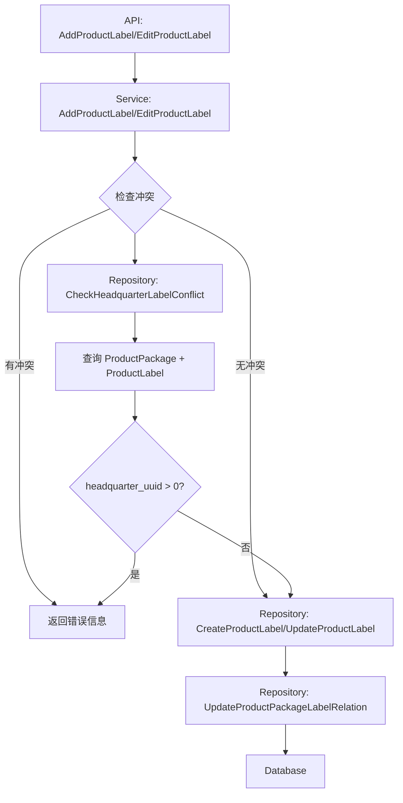

# 新管理端-菜品标签-来源总部数据的商品 设计文档

> 本文档定义 新管理端-菜品标签-来源总部数据的商品 的技术设计和实现方案。

## 📋 概述

在分店管理端创建或编辑商品标签时，系统需要检查关联商品中是否有已关联总部商品标签的商品。如果存在，则提示用户哪些商品已被总部标签关联，无法被当前标签关联。

**核心功能**：
1. 创建商品标签时的冲突检测
2. 编辑商品标签时的冲突检测
3. 友好的错误提示信息

**技术栈**：Go Main 模块（main/app/）

---

## 🎯 规范对齐

### Go Main 规范 (go-main.mdc)

- ✅ Service 只依赖其他 Service 接口（不依赖 Repository）
- ✅ Repository 只持有 db 实例（不持有 DBManager）
- ✅ URL 使用 snake_case（已存在：`/shop/product/label/add`, `/shop/product/label/edit`）
- ✅ data 字段必须是对象（已遵循）
- ✅ 不使用 panic，返回 error（已遵循）
- ✅ 接口以 `I` 开头，实现以 `Impl` 结尾（已遵循）

### API 设计规范 (api.mdc)

- ✅ URL 使用 snake_case
- ✅ 响应格式统一：`{code, message, data{}}`
- ✅ data 不能为 null 或数组（已遵循）

### 数据库规范 (database.mdc)

- ✅ 无需新增表，使用现有表结构
- ✅ 使用现有字段：`ttpos_product_package.product_label_uuid`, `ttpos_product_label.headquarter_uuid`

---

## 🔄 代码复用分析

### 可复用的现有组件

- **ProductLabelService**: `main/app/service/product_label.go` - 商品标签服务，需要扩展冲突检测逻辑
- **ProductLabelRepository**: `main/app/repository/product_label.go` - 商品标签数据访问层，需要新增查询方法
- **ProductRepository**: `main/app/repository/product.go` - 商品数据访问层，用于查询商品信息

### 集成点

- **现有 API**: `/shop/product/label/add` 和 `/shop/product/label/edit` - 需要添加冲突检测逻辑
- **数据库表**: 
  - `ttpos_product_package` - 商品包表（已有 `product_label_uuid` 字段）
  - `ttpos_product_label` - 商品标签表（已有 `headquarter_uuid` 字段）

---

## 🏗️ 架构设计

### 分层设计原则

**Go Main 三层架构**:

```
API 层 (shop_product_label.go)
  ↓ 调用
Service 层 (product_label.go)
  ↓ 调用
Repository 层 (product_label.go, product.go)
  ↓ 查询
Database (MySQL)
```

**依赖规则**:
- ✅ Service 层调用 Repository 层（通过 DBManager 获取 Repository）
- ✅ Service 层不直接依赖其他 Service 接口（本功能不需要）
- ✅ Repository 层只持有 db 实例

### 架构图



### 模块划分

#### Go Main 模块

- **API 层**: `main/app/api/v1/shop/shop_product_label.go` - 已存在，无需修改
- **Service 层**: `main/app/service/product_label.go` - 需要添加冲突检测逻辑
- **Repository 层**: `main/app/repository/product_label.go` - 需要新增查询方法
- **Model 层**: `main/app/model/product_label.go`, `main/app/model/product.go` - 已存在，无需修改
- **DTO 层**: `main/app/dto/req/product_label.go` - 已存在，无需修改

---

## 🗄️ 数据库设计

### 数据表设计

无需新增表，使用现有表结构：

#### 表 1: ttpos_product_package（商品包表）

**关键字段**:
- `product_label_uuid`: 商品标签UUID（关联到 `ttpos_product_label.uuid`）

#### 表 2: ttpos_product_label（商品标签表）

**关键字段**:
- `headquarter_uuid`: 总部UUID，0 表示本店创建，>0 表示从总部同步

**业务规则**:
- 当 `headquarter_uuid > 0` 时，表示该标签来自总部
- 当商品包的 `product_label_uuid` 对应的标签 `headquarter_uuid > 0` 时，表示该商品已被总部标签关联

### 数据库查询逻辑

**冲突检测 SQL**:

```sql
-- 查询商品是否已被总部标签关联
SELECT 
    pp.uuid AS product_package_uuid,
    pp.multi_language_name_uuid,
    pl.uuid AS label_uuid,
    pl.name AS label_name,
    pl.headquarter_uuid
FROM ttpos_product_package pp
INNER JOIN ttpos_product_label pl ON pp.product_label_uuid = pl.uuid
WHERE pp.delete_time = 0
  AND pl.delete_time = 0
  AND pl.headquarter_uuid > 0
  AND pp.uuid IN (?)
```

**索引要求**:
- `ttpos_product_package.product_label_uuid` - 需要索引（已存在）
- `ttpos_product_label.headquarter_uuid` - 需要索引（已存在）

---

## 📊 数据模型

### Go Model

无需新增 Model，使用现有模型：

```go
// main/app/model/product_label.go
type ProductLabel struct {
    BaseModel
    HeadquarterUuid uint64 `gorm:"column:headquarter_uuid;default:0;comment:总部uuid，0表示本店创建，>0表示从总部同步"`
    Name            string `gorm:"default:'';column:name;comment:'标签名称'"`
    // ...
}

// main/app/model/product.go
type ProductPackage struct {
    BaseModel
    ProductLabelUuid uint64 `gorm:"default:0;column:product_label_uuid;comment:'商品标签UUID'"`
    // ...
}
```

### DTO 定义

无需新增 DTO，使用现有 DTO：

```go
// main/app/dto/req/product_label.go
type ProductLabelAddReq struct {
    ProductPackageUuids []uint64 `json:"product_package_uuids"` // 关联商品包UUID列表
    // ...
}

type ProductLabelEditReq struct {
    ProductPackageUuids []uint64 `json:"product_package_uuids"` // 关联商品包UUID列表
    // ...
}
```

---

## 🔌 API 设计

### RESTful API

无需新增 API，扩展现有 API：

#### API 1: 添加商品标签（已存在，需要添加冲突检测）

**请求**:
- **URL**: `/api/v1/shop/product/label/add`
- **Method**: `POST`
- **Body**:
  ```json
  {
    "name": "标签名称",
    "product_package_uuids": [123456, 789012]
  }
  ```

**响应（成功）**:
```json
{
  "code": 1,
  "message": "保存成功",
  "data": {}
}
```

**响应（冲突错误）**:
```json
{
  "code": 0,
  "message": "商品[商品A、商品B]已经被来源总部的标签[标签名称1]关联，无法被当前标签关联",
  "data": {}
}
```

#### API 2: 编辑商品标签（已存在，需要添加冲突检测）

**请求**:
- **URL**: `/api/v1/shop/product/label/edit`
- **Method**: `POST`
- **Body**:
  ```json
  {
    "uuid": 123456,
    "name": "标签名称",
    "product_package_uuids": [123456, 789012]
  }
  ```

**响应（成功）**:
```json
{
  "code": 1,
  "message": "保存成功",
  "data": {}
}
```

**响应（冲突错误）**:
```json
{
  "code": 0,
  "message": "商品[商品A、商品B]已经被来源总部的标签[标签名称1]关联，无法被当前标签关联",
  "data": {}
}
```

---

## 🧩 组件和接口

### Service 层

#### Service 接口（已存在，无需修改）

```go
// main/app/service/product_label.go
type IProductLabelSrv interface {
    AddProductLabel(ctx context.Context, req req.ProductLabelAddReq) error
    EditProductLabel(ctx context.Context, req req.ProductLabelEditReq) error
    // ...
}
```

#### Service 实现（需要扩展）

**新增方法**:

```go
// main/app/service/product_label.go

// checkHeadquarterLabelConflict 检查商品是否已被总部标签关联
// 返回冲突的商品信息（商品名称列表和总部标签名称）
func (s *ProductLabelSrvImpl) checkHeadquarterLabelConflict(
    ctx context.Context,
    productPackageUuids []uint64,
) ([]string, string, error) {
    // 1. 查询商品包及其关联的标签
    // 2. 过滤出 headquarter_uuid > 0 的标签
    // 3. 返回冲突的商品名称列表和标签名称
    // 4. 如果没有冲突，返回 nil, "", nil
}
```

**修改现有方法**:

```go
// AddProductLabel - 在保存前添加冲突检测
func (s *ProductLabelSrvImpl) AddProductLabel(ctx context.Context, req req.ProductLabelAddReq) error {
    // ... 现有验证逻辑 ...
    
    // 新增：检查冲突
    if len(req.ProductPackageUuids) > 0 {
        productNames, labelName, err := s.checkHeadquarterLabelConflict(ctx, req.ProductPackageUuids)
        if err != nil {
            return errors.WithMessage(err, "检查冲突失败")
        }
        if len(productNames) > 0 {
            return errors.New(fmt.Sprintf("商品[%s]已经被来源总部的标签[%s]关联，无法被当前标签关联", 
                strings.Join(productNames, "、"), labelName))
        }
    }
    
    // ... 现有保存逻辑 ...
}

// EditProductLabel - 在保存前添加冲突检测
func (s *ProductLabelSrvImpl) EditProductLabel(ctx context.Context, req req.ProductLabelEditReq) error {
    // ... 现有验证逻辑 ...
    
    // 新增：检查冲突
    if len(req.ProductPackageUuids) > 0 {
        productNames, labelName, err := s.checkHeadquarterLabelConflict(ctx, req.ProductPackageUuids)
        if err != nil {
            return errors.WithMessage(err, "检查冲突失败")
        }
        if len(productNames) > 0 {
            return errors.New(fmt.Sprintf("商品[%s]已经被来源总部的标签[%s]关联，无法被当前标签关联", 
                strings.Join(productNames, "、"), labelName))
        }
    }
    
    // ... 现有保存逻辑 ...
}
```

### Repository 层

#### Repository 接口（需要扩展）

```go
// main/app/repository/product_label.go
type IProductLabelRepo interface {
    // ... 现有方法 ...
    
    // 新增：检查商品是否已被总部标签关联
    CheckHeadquarterLabelConflict(productPackageUuids []uint64) ([]model.ProductPackage, []model.ProductLabel, error)
}
```

#### Repository 实现（需要扩展）

```go
// main/app/repository/product_label.go

// CheckHeadquarterLabelConflict 检查商品是否已被总部标签关联
// 返回冲突的商品包列表和对应的标签列表
func (r *ProductLabelRepoImpl) CheckHeadquarterLabelConflict(
    productPackageUuids []uint64,
) ([]model.ProductPackage, []model.ProductLabel, error) {
    if len(productPackageUuids) == 0 {
        return nil, nil, nil
    }
    
    var packages []model.ProductPackage
    var labels []model.ProductLabel
    
    // 查询商品包及其关联的标签（headquarter_uuid > 0）
    err := r.db.
        Preload("MultiLanguageName").
        Preload("ProductLabel", func(db *gorm.DB) *gorm.DB {
            return db.Where("headquarter_uuid > ?", 0).Where("delete_time = ?", 0)
        }).
        Where("uuid IN ?", productPackageUuids).
        Where("delete_time = ?", 0).
        Where("product_label_uuid > ?", 0).
        Find(&packages).Error
    
    if err != nil {
        return nil, nil, errors.WithMessage(err, "查询商品包失败")
    }
    
    // 提取冲突的商品包（有总部标签关联的）
    conflictPackages := make([]model.ProductPackage, 0)
    labelMap := make(map[uint64]model.ProductLabel)
    
    for _, pkg := range packages {
        if pkg.ProductLabel.Uuid > 0 && pkg.ProductLabel.HeadquarterUuid > 0 {
            conflictPackages = append(conflictPackages, pkg)
            labelMap[pkg.ProductLabel.Uuid] = pkg.ProductLabel
        }
    }
    
    // 转换为标签列表
    for _, label := range labelMap {
        labels = append(labels, label)
    }
    
    return conflictPackages, labels, nil
}
```

### API 层

无需修改，现有 API 会自动返回 Service 层的错误信息。

---

## ⚡ 缓存设计

本功能暂不需要缓存，直接查询数据库。

---

## 🚨 错误处理

### 错误场景

#### 场景 1: 商品已被总部标签关联

- **处理方式**: 在 Service 层检测到冲突后，返回错误信息
- **用户影响**: 用户看到错误提示：`商品[商品A、商品B]已经被来源总部的标签[标签名称1]关联，无法被当前标签关联`
- **代码示例**:
  ```go
  if len(productNames) > 0 {
      return errors.New(fmt.Sprintf("商品[%s]已经被来源总部的标签[%s]关联，无法被当前标签关联", 
          strings.Join(productNames, "、"), labelName))
  }
  ```

#### 场景 2: 数据库查询失败

- **处理方式**: 使用 `errors.WithMessage` 包装错误，记录日志
- **用户影响**: 用户看到通用错误提示
- **代码示例**:
  ```go
  if err != nil {
      logger.Logger.Error("检查冲突失败", zap.Error(err))
      return errors.WithMessage(err, "检查冲突失败")
  }
  ```

---

## 🔒 安全设计

### 身份验证

- ✅ 所有 API 需要 JWT Token 验证（已存在）

### 权限控制

- ✅ 分店管理员只能操作本店的商品标签（已存在）

### 数据安全

- ✅ SQL 注入防护：使用参数化查询（GORM）
- ✅ 数据校验：在 Service 层验证参数

---

## 🧪 测试策略

### 单元测试

**目标覆盖率**:
- Service 层: ≥ 70%
- Repository 层: ≥ 80%

**测试内容**:
1. **Service 层测试**:
   - 创建标签时，关联商品已被总部标签关联 - 应返回错误
   - 创建标签时，关联商品未被总部标签关联 - 应成功创建
   - 编辑标签时，新增商品已被总部标签关联 - 应返回错误
   - 编辑标签时，新增商品未被总部标签关联 - 应成功更新

2. **Repository 层测试**:
   - `CheckHeadquarterLabelConflict` 方法测试
   - 查询结果正确性验证

### API 测试

**测试内容**:
- API 接口调用
- 参数验证
- 响应格式
- 错误处理

### 集成测试

**测试流程**:
- 端到端业务流程
- 数据库事务
- 错误提示信息验证

---

## 📈 性能优化

### 优化策略

1. **数据库优化**:
   - 确保 `ttpos_product_package.product_label_uuid` 有索引
   - 确保 `ttpos_product_label.headquarter_uuid` 有索引
   - 使用 JOIN 查询，避免 N+1 查询问题

2. **查询优化**:
   - 批量查询商品包，避免循环查询
   - 使用 Preload 预加载关联数据

### 性能指标

- 本地响应时间: < 200ms
- 数据库查询: < 50ms（单次冲突检测）

---

## 🌐 浏览器兼容性

不涉及前端，无需考虑浏览器兼容性。

---

## 📚 实现清单

### Phase 1: Repository 层扩展

- [ ] 在 `IProductLabelRepo` 接口中添加 `CheckHeadquarterLabelConflict` 方法
- [ ] 在 `ProductLabelRepoImpl` 中实现 `CheckHeadquarterLabelConflict` 方法
- [ ] 编写 Repository 单元测试

### Phase 2: Service 层扩展

- [ ] 在 `ProductLabelSrvImpl` 中添加 `checkHeadquarterLabelConflict` 私有方法
- [ ] 在 `AddProductLabel` 方法中添加冲突检测
- [ ] 在 `EditProductLabel` 方法中添加冲突检测
- [ ] 编写 Service 单元测试

### Phase 3: 测试和优化

- [ ] 集成测试
- [ ] 性能测试
- [ ] 错误信息国际化（多语言支持）

**详细任务**: 参见 `tasks.md`

---

## Graphiti & 活动日志

- Related Episode: `[待补充]`
- 模板：`docs/agent/templates/graphiti-episode.md`
- 活动日志：`docs/team/activities/{YYYY-MM}/{YYYY-MM-DD}.md`
- 在技术方案评审、关键架构决策或踩坑总结后，立即补充 Episode 并在设计文档尾部互链。

---

**版本**: v1.0.0  
**创建日期**: 2025-12-08  
**作者**: TTPOS Team  
**审核者**: {审核者}

