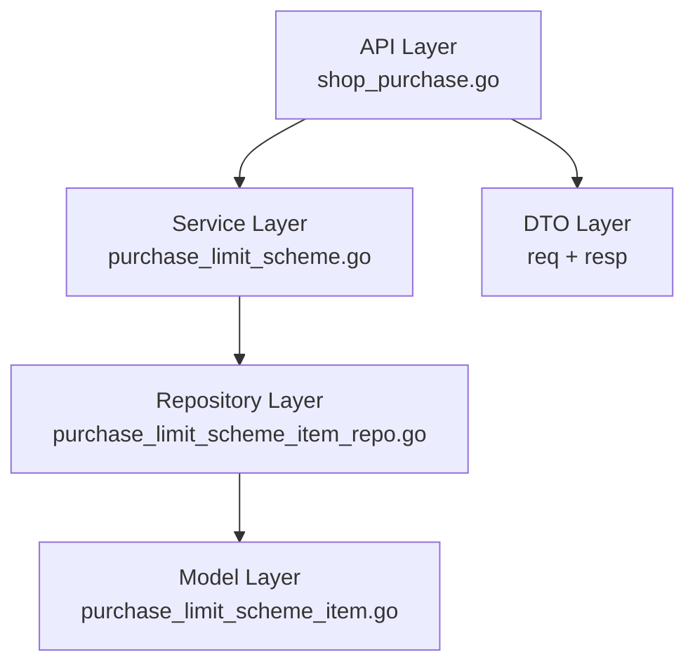

# story-shop-purchase-allow-control 技术设计

## 📋 概述

| 项目 | 内容 |
|------|------|
| Spec ID | story-shop-purchase-allow-control |
| 设计人 | weifashi |
| 设计日期 | 2026-02-03 |
| 总 SP | 2 |

## 🔄 代码复用分析

### 可复用代码

| 文件 | 说明 | 复用方式 |
|------|------|---------|
| `main/app/model/purchase_limit_scheme_item.go` | 限购方案物品模型 | 扩展字段 |
| `main/app/dto/req/purchase_limit_scheme.go` | 请求 DTO | 扩展字段 |
| `main/app/dto/resp/purchase_limit_scheme_resp.go` | 响应 DTO | 扩展字段 |
| `main/app/service/purchase_order/purchase_limit_scheme.go` | 限购方案服务 | 直接复用 |
| `main/app/repository/purchase_limit_scheme_item_repo.go` | 物品 Repository | 直接复用 |
| `main/app/api/v1/shop/shop_purchase.go` | API Handler | 直接复用 |

### 需要修改

| 文件 | 说明 |
|------|------|
| `main/app/model/purchase_limit_scheme_item.go` | 添加 `IsAllowPurchase` 字段 |
| `main/app/dto/req/purchase_limit_scheme.go` | `PurchaseLimitSchemeItemReq` 添加字段 |
| `main/app/dto/resp/purchase_limit_scheme_resp.go` | `PurchaseLimitSchemeItemResp` 添加字段 |
| `admin/database/migrations/` | 新建迁移文件 |
| `admin/database/seeds/shop_01.sql` | 同步更新 |

## 🏗️ 架构设计

### 架构图



### 变更范围

本次变更仅涉及**字段扩展**，不改变现有架构和调用链路：

1. **Model 层**: 添加 `IsAllowPurchase` 字段
2. **DTO 层**: 请求和响应结构体添加对应字段
3. **Service 层**: 无需修改（GORM 自动处理字段映射）
4. **API 层**: 无需修改（自动绑定新字段）

## 🧩 组件和接口

### Model: PurchaseLimitSchemeItem

**位置**: `main/app/model/purchase_limit_scheme_item.go`

**新增字段**:
```go
type PurchaseLimitSchemeItem struct {
    BaseModel
    SchemeUuid      uint64  `gorm:"..." json:"scheme_uuid"`
    MaterialCode    string  `gorm:"..." json:"material_code"`
    UnitCode        string  `gorm:"..." json:"unit_code"`
    QuotaLimit      float64 `gorm:"..." json:"quota_limit"`
    // 新增字段
    IsAllowPurchase string  `gorm:"column:is_allow_purchase;type:varchar(10);not null;default:'yes';comment:'是否允许采购 yes/no'" json:"is_allow_purchase"`
}
```

### DTO Req: PurchaseLimitSchemeItemReq

**位置**: `main/app/dto/req/purchase_limit_scheme.go`

**新增字段**:
```go
type PurchaseLimitSchemeItemReq struct {
    MaterialUuid    uint64  `json:"material_uuid" binding:"required"`
    QuotaLimit      float64 `json:"quota_limit"`
    // 新增字段
    IsAllowPurchase string  `json:"is_allow_purchase"` // yes/no，默认 yes
}
```

### DTO Resp: PurchaseLimitSchemeItemResp

**位置**: `main/app/dto/resp/purchase_limit_scheme_resp.go`

**新增字段**:
```go
type PurchaseLimitSchemeItemResp struct {
    MaterialUuid    uint64  `json:"material_uuid"`
    QuotaLimit      float64 `json:"quota_limit"`
    // 新增字段
    IsAllowPurchase string  `json:"is_allow_purchase"`
}
```

## 📊 数据模型

### 数据库字段

**表**: `ttpos_purchase_limit_scheme_item`

| 字段 | 类型 | 默认值 | 说明 |
|------|------|--------|------|
| is_allow_purchase | VARCHAR(10) | 'yes' | 是否允许采购：yes/no |

### 迁移脚本

```php
// admin/database/migrations/xxx_add_is_allow_purchase_to_purchase_limit_scheme_item.php

$this->table('purchase_limit_scheme_item')
    ->addColumn('is_allow_purchase', 'string', [
        'limit' => 10,
        'default' => 'yes',
        'null' => false,
        'comment' => '是否允许采购 yes/no',
        'after' => 'quota_limit'
    ])
    ->update();
```

## 🔌 API 设计

### 影响的 API

| API | Method | Path | 变更 |
|-----|--------|------|------|
| 创建限购方案 | POST | /api/v1/shop/purchase/limit/scheme/create | items 数组支持 is_allow_purchase |
| 更新限购方案 | POST | /api/v1/shop/purchase/limit/scheme/update | items 数组支持 is_allow_purchase |
| 限购方案详情 | GET | /api/v1/shop/purchase/limit/scheme/detail | 响应 items 包含 is_allow_purchase |

### 请求示例

```json
{
  "locale_name": {"zh-CN": "测试方案"},
  "status": 1,
  "items": [
    {
      "material_uuid": 123456,
      "quota_limit": 10,
      "is_allow_purchase": "yes"
    },
    {
      "material_uuid": 789012,
      "quota_limit": 0,
      "is_allow_purchase": "no"
    }
  ]
}
```

### 响应示例

```json
{
  "code": 1,
  "message": "success",
  "data": {
    "uuid": 123,
    "items": [
      {
        "material_uuid": 123456,
        "quota_limit": 10,
        "is_allow_purchase": "yes"
      }
    ]
  }
}
```

## ⚠️ 风险识别

| 风险 | 影响 | 缓解措施 |
|------|------|---------|
| 现有数据迁移 | 低 | 迁移脚本设置默认值为 "yes"，不影响现有业务 |
| 前端 UI 适配 | 中 | 与前端团队同步需求，协调开发进度 |
| 参数校验 | 低 | 在 Service 层添加 yes/no 值校验 |

## 🧪 测试策略

### 测试范围

1. **Model 字段测试**: 验证字段正确映射到数据库
2. **DTO 绑定测试**: 验证请求参数正确绑定
3. **默认值测试**: 验证未传参数时使用默认值 "yes"
4. **校验测试**: 验证非法值（非 yes/no）返回错误

### 测试命令

```bash
cd main && go test -v ./app/service/purchase_order/... -run PurchaseLimit
cd main && go test -coverprofile=coverage.out ./app/service/purchase_order/...
```

---

**版本**: v1.0.0
**创建日期**: 2026-02-03
