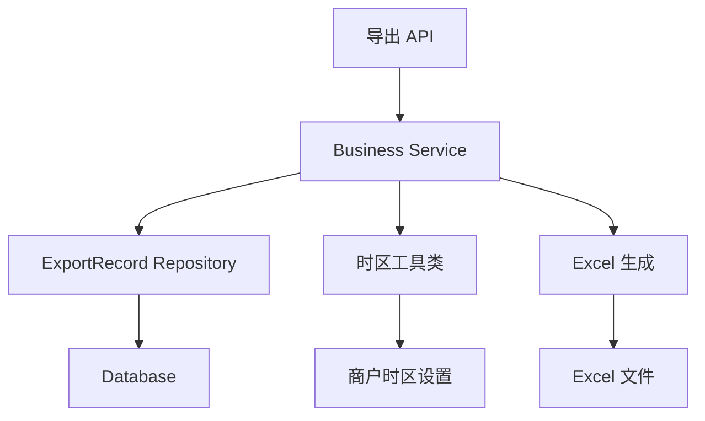

# 优化新管理端导出报表名称 设计文档

> 本文档定义优化新管理端导出报表名称功能的技术设计和实现方案。

## 📋 概述

优化新管理端报表导出功能的文件命名和子表命名规则，提升用户体验和文件管理效率。本功能为后端优化，不涉及新增 API 接口或数据库表结构变更，主要修改现有导出服务的文件命名逻辑和 Excel 子表名称设置。

**核心改进**：
1. 文件名从时间戳格式改为日期格式（`报表名YYYY-MM-DD.xlsx`）
2. 同一天多次导出同名报表时，自动添加序号避免冲突
3. 统一子表名称为 `Sheet1`（用户分析报表除外）

---

## 🎯 规范对齐

### Go Main 规范 (go-main.mdc)

- ✅ Service 只依赖其他 Service 接口（不依赖 Repository）
- ✅ Repository 只持有 db 实例
- ✅ 不使用 panic，返回 error
- ✅ 使用 errors.WithMessage 包装错误
- ✅ 遵循分层架构：Service → Repository → Database

### API 设计规范 (api.mdc)

- ✅ 本功能不涉及新增 API 接口
- ✅ 仅优化现有导出功能的文件命名逻辑

### 数据库规范 (database.mdc)

- ✅ 不涉及数据库表结构变更
- ✅ 仅优化查询逻辑（查询同一天导出记录）
- ✅ 需要添加索引优化查询性能（`export_type`, `company_uuid`, `create_time`）

---

## 🔄 代码复用分析

### 可复用的现有组件

- **ExportRecord Repository**: `main/app/repository/export_record.go` - 已存在，需要扩展查询方法
- **时区工具类**: `main/app/utils` - `utils.SetTimezone()` 用于时区处理
- **MultiLanguageName**: `main/app/model` - 多语言名称结构体，已用于报表名称
- **Excel 生成库**: `github.com/xuri/excelize/v2` - 已使用，需要修改子表名称设置

### 集成点

- **导出服务**: `main/app/service/business.go` - 8 个导出方法需要修改文件名生成逻辑
- **导出记录表**: `ttpos_export_record` - 需要查询同一天导出记录，计算序号
- **Excel 文件生成**: 7 个报表的 Task 方法需要修改子表名称

---

## 🏗️ 架构设计

### 分层设计原则

**Go Main 三层架构**:

```
API 层 (Controller/API)
  ↓ 依赖
业务层 (Service)
  ↓ 依赖
数据层 (Repository)
```

**依赖规则**:
- ✅ Service 层修改文件名生成逻辑
- ✅ Repository 层新增查询同一天导出记录的方法
- ✅ Service 层调用 Repository 方法查询已导出记录

### 架构图



### 模块划分

#### Go Main 模块

- **Service 层**: `main/app/service/business.go` - 修改 8 个导出方法的文件名生成逻辑
- **Repository 层**: `main/app/repository/export_record.go` - 新增查询同一天导出记录的方法
- **Model 层**: `main/app/model/export_record.go` - 已存在，无需修改
- **工具类**: `main/app/utils` - 使用现有时区工具类

---

## 🗄️ 数据库设计

### 数据表设计

**不涉及新增表或字段**，仅优化查询逻辑。

### 索引优化

**需要添加索引**（如不存在）：

```sql
-- 优化查询同一天导出记录的性能
ALTER TABLE `ttpos_export_record` 
ADD INDEX `idx_export_type_status_date` (`export_type`, `status`, `create_time`);
```

**索引说明**:
- `export_type`: 导出类型（1-8），等值查询
- `status`: 导出状态（1=成功），等值查询，通常为1
- `create_time`: 创建时间（用于日期范围查询），范围查询
- 字段顺序说明：等值查询字段在前，范围查询字段在后，符合 MySQL 索引最左前缀原则

**注意**: 由于数据库连接已包含商户隔离，无需额外的 `company_uuid` 字段过滤。

---

## 📊 数据模型

### Go Model

**无需修改**，使用现有的 `ExportRecord` 模型：

```go
// main/app/model/export_record.go
type ExportRecord struct {
    BaseModel
    ExportType   uint8  `gorm:"column:export_type;..."`
    ExportName   string `gorm:"column:export_name;..."`
    // ... 其他字段
}
```

---

## 🔌 API 设计

### RESTful API

**不涉及新增 API 接口**，仅优化现有导出功能的文件命名逻辑。

**现有导出 API**（无需修改）:
- `/api/v1/shop/statistics/export_business_time_period` - 时段营业统计导出
- `/api/v1/shop/statistics/export_business_summary` - 综合运营统计导出
- `/api/v1/shop/statistics/export_business_payment_method` - 营业收款统计导出
- `/api/v1/shop/statistics/export_channel_sales` - 渠道营业统计导出
- `/api/v1/shop/statistics/export_product_sales` - 商品销售统计导出
- `/api/v1/shop/statistics/export_user_analysis` - 用户分析导出
- `/api/v1/shop/statistics/export_kitchen_production_detail` - 后厨菜品出品明细导出
- `/api/v1/shop/statistics/export_kitchen_efficiency_analysis` - 后厨效率分析导出

---

## 🧩 组件和接口

### Service 层

#### 文件名生成工具方法

**新增方法**（在 `business.go` 中）：

```go
// generateExportFileName 生成导出文件名
// 格式: 报表名YYYY-MM-DD.xlsx 或 报表名YYYY-MM-DD（序号）.xlsx
func (s *businessSrv) generateExportFileName(
    ctx context.Context,
    reportName string,      // 报表名称（多语言）
    exportType uint8,        // 导出类型
) (string, error) {
    // 1. 获取商户时区
    timezone := ctx.GetCompanySetting().Timezone
    timezoneUtils := utils.SetTimezone(timezone)
    dateString := timezoneUtils.FormatUnixTime(time.Now().Unix(), "2006-01-02")
    
    // 2. 生成基础文件名
    baseFileName := fmt.Sprintf("%s%s.xlsx", reportName, dateString)
    
    // 3. 查询同一天已导出的同名报表
    db := ctx.GetDB()
    exportRecordRepo := repository.NewExportRecordRepo(db)
    
    // 查询同一天的导出记录（数据库连接已包含商户隔离）
    startTime := timezoneUtils.GetDayStartUnix(time.Now().Unix())
    endTime := timezoneUtils.GetDayEndUnix(time.Now().Unix())
    
    records, err := exportRecordRepo.GetByDateAndType(
        exportType,
        startTime,
        endTime,
    )
    if err != nil {
        return "", errors.WithMessage(err, "查询导出记录失败")
    }
    
    // 4. 计算序号
    suffix := ""
    if len(records) > 0 {
        suffix = fmt.Sprintf("（%d）", len(records))
    }
    
    return fmt.Sprintf("%s%s%s", reportName, dateString, suffix), nil
}
```

#### 修改现有导出方法

**需要修改的 8 个方法**：

1. `ExportBusinessTimePeriod` - 时段营业统计
2. `ExportBusinessSummary` - 综合运营统计
3. `ExportBusinessPaymentMethod` - 营业收款统计
4. `ExportChannelSales` - 渠道营业统计
5. `ExportProductSales` - 商品销售统计
6. `ExportUserAnalysis` - 用户分析
7. `ExportKitchenProductionDetail` - 后厨菜品出品明细
8. `ExportKitchenEfficiencyAnalysis` - 后厨效率分析

**修改示例**（以 `ExportBusinessTimePeriod` 为例）：

```go
// 修改前
fileName := fmt.Sprintf("%s_%d.xlsx", fileNameMul.GetNameByLang(ctx.GetLanguage()), time.Now().Unix())

// 修改后
reportName := fileNameMul.GetNameByLang(ctx.GetLanguage())
fileName, err := s.generateExportFileName(ctx, reportName, model.ExportTypeBusinessData)
if err != nil {
    return errors.WithMessage(err, "生成文件名失败")
}
```

### Repository 层

#### 新增查询方法

**在 `export_record.go` 中新增**：

```go
// IExportRecordRepo 接口新增方法
GetByDateAndType(exportType uint8, startTime, endTime int64) ([]model.ExportRecord, error)

// ExportRecordRepoImpl 实现
// GetByDateAndType 查询指定日期范围内指定类型的导出记录
// 注意：数据库连接已包含商户隔离，无需额外的 company_uuid 过滤
func (r *ExportRecordRepoImpl) GetByDateAndType(
    exportType uint8,
    startTime, endTime int64,
) ([]model.ExportRecord, error) {
    var records []model.ExportRecord
    err := r.db.Model(&model.ExportRecord{}).
        Where("export_type = ?", exportType).
        Where("create_time >= ?", startTime).
        Where("create_time <= ?", endTime).
        Where("status = ?", 1).
        Where("delete_time = ?", 0).
        Find(&records).Error
    // GORM 的 Find 方法在查询为空时会返回空切片 []model.ExportRecord{}，而不是 nil
    return records, err
}
```

**注意**: 由于数据库连接已包含商户隔离（通过 Context 的数据库连接），无需额外的 `company_uuid` 字段过滤。

### Excel 子表名称修改

**需要修改的 7 个 Task 方法**（用户分析除外）：

1. `ExportProductSalesTask` - 商品销售统计
2. `ExportBusinessTimePeriodTask` - 时段营业统计
3. `ExportBusinessSummaryTask` - 综合运营统计
4. `ExportBusinessPaymentMethodTask` - 营业收款统计
5. `ExportChannelSalesTask` - 渠道营业统计
6. `ExportKitchenProductionDetailTask` - 后厨菜品出品明细
7. `ExportKitchenEfficiencyAnalysisTask` - 后厨效率分析

**修改示例**（以 `ExportProductSalesTask` 为例）：

```go
// 修改前
sheetNameMul := model.MultiLanguageName{
    EnName:   "Report",
    ZhName:   "报表",
    // ...
}
sheetName := sheetNameMul.GetNameByLang(ctx.GetLanguage())

// 修改后
sheetName := "Sheet1"
```

---

## ⚡ 缓存设计

**不涉及缓存**，文件名生成逻辑简单，无需缓存。

---

## 🚨 错误处理

### 错误场景

#### 场景 1: 文件名生成失败

- **处理方式**: 记录错误日志，返回友好错误提示
- **用户影响**: 导出失败，提示"生成文件名失败，请稍后重试"
- **代码示例**:
  ```go
  fileName, err := s.generateExportFileName(ctx, reportName, exportType)
  if err != nil {
      logger.Logger.Error("生成导出文件名失败", 
          zap.Error(err),
          zap.Any("export_type", exportType),
          zap.Any("company_uuid", ctx.GetCompanyUuid()),
      )
      return errors.WithMessage(err, "生成文件名失败")
  }
  ```

#### 场景 2: 查询导出记录失败

- **处理方式**: 记录错误日志，降级处理（使用时间戳格式）
- **用户影响**: 文件名可能使用时间戳格式，但不影响导出功能
- **代码示例**:
  ```go
  records, err := exportRecordRepo.GetByDateAndType(...)
  if err != nil {
      logger.Logger.Warn("查询导出记录失败，使用时间戳格式", zap.Error(err))
      // 降级：使用时间戳格式
      fileName = fmt.Sprintf("%s_%d.xlsx", reportName, time.Now().Unix())
  }
  ```

#### 场景 3: 并发导出冲突

- **处理方式**: 使用数据库事务确保文件名唯一性
- **用户影响**: 自动添加序号，避免文件名冲突
- **代码示例**:
  ```go
  // 在事务中查询和创建
  err := db.Transaction(func(tx *gorm.DB) error {
      // 查询同一天导出记录
      records, err := exportRecordRepo.GetByDateAndType(...)
      // 计算序号
      fileName := generateFileNameWithSuffix(...)
      // 创建导出记录
      return exportRecordRepo.Create(...)
  })
  ```

---

## 🔒 安全设计

### 身份验证

- ✅ 所有导出 API 需要 Token 验证（已存在）

### 权限控制

- ✅ 导出功能已有权限控制（已存在）

### 数据安全

- ✅ SQL 注入防护：使用参数化查询（GORM）
- ✅ 文件名安全：文件名仅包含报表名称和日期，无用户输入

---

## 🧪 测试策略

### 单元测试

**目标覆盖率**:
- `generateExportFileName`: 100%
- Repository `GetByDateAndType`: 80%+

**测试内容**:
- 文件名格式正确性（日期格式、序号计算）
- 时区处理正确性（不同时区商户）
- 并发导出场景（序号递增）
- 边界情况（第一天导出、多次导出）

**示例**:

```go
// main/app/service/business_test.go
func TestGenerateExportFileName(t *testing.T) {
    // 测试日期格式
    // 测试序号计算
    // 测试时区处理
    // 测试并发场景
}
```

### API 测试

**测试内容**:
- 导出功能正常（文件名格式正确）
- 多次导出同名报表（序号递增）
- 不同时区商户（日期正确）

### 集成测试

**测试流程**:
- 端到端导出流程
- 并发导出场景
- 时区处理验证

---

## 📈 性能优化

### 优化策略

1. **数据库优化**:
   - 添加索引：`idx_export_type_status_date` (`export_type`, `status`, `create_time`)
   - 优化查询：仅查询同一天的记录，使用索引

2. **查询优化**:
   - 限制查询范围：仅查询当天的记录
   - 使用索引加速查询

### 性能指标

- 文件名生成时间: < 10ms
- 查询导出记录: < 50ms（使用索引）
- 导出功能响应时间: < 200ms（整体）

---

## 🌐 浏览器兼容性

**不涉及前端变更**，无需考虑浏览器兼容性。

---

## 📚 实现清单

### Phase 1: Repository 层扩展

- [ ] 新增 `GetByDateAndType` 方法到 `IExportRecordRepo` 接口
- [ ] 实现 `GetByDateAndType` 方法
- [ ] 添加数据库索引（如不存在）
- [ ] 编写 Repository 单元测试

### Phase 2: Service 层文件名生成

- [ ] 创建 `generateExportFileName` 工具方法
- [ ] 修改 8 个导出方法的文件名生成逻辑
- [ ] 处理并发导出场景（事务控制）
- [ ] 编写 Service 单元测试

### Phase 3: Excel 子表名称修改

- [ ] 修改 7 个 Task 方法的子表名称（用户分析除外）
- [ ] 验证用户分析报表保持原有逻辑

### Phase 4: 测试和优化

- [ ] 单元测试（文件名生成、时区处理）
- [ ] 集成测试（端到端导出流程）
- [ ] 性能测试（查询优化）
- [ ] 并发测试（文件名冲突处理）

**详细任务**: 参见 `tasks.md`

---

## Graphiti & 活动日志

- Related Episode: `[待补充]`
- 模板：`docs/agent/templates/graphiti-episode.md`
- 活动日志：`docs/team/activities/{YYYY-MM}/{YYYY-MM-DD}.md`
- 在技术方案评审、关键架构决策或踩坑总结后，立即补充 Episode 并在设计文档尾部互链。

---

**版本**: v1.0.0  
**创建日期**: 2025-12-01  
**作者**: 王昱  
**审核者**: {审核者}

