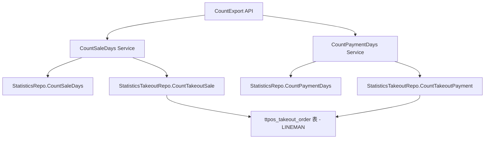

# story-shop-report-lineman-export 技术设计

> 本文档定义统计报表导出增加 LINEMAN 数据的技术设计和实现方案。

## 📋 概述

| 项目       | 内容                           |
| ---------- | ------------------------------ |
| Spec ID    | story-shop-report-lineman-export |
| 设计人     | 王昱                           |
| 设计日期   | 2026-01-26                     |
| 总 SP      | 2                              |

### 设计目标

在现有统计报表导出功能中，为销售统计（按天）和支付数据（按天）两个报表增加 LINEMAN 平台的数据支持。完全参考 Grab 的实现模式，确保 LINEMAN 数据能够正确统计并显示在导出的报表中。

---

## 🎯 规范对齐

### Go Main 规范 (go-main.mdc)

- ✅ Service 只依赖其他 Service 接口
- ✅ Repository 只持有 db 实例
- ✅ URL 使用 snake_case
- ✅ data 字段必须是对象
- ✅ 不使用 panic，返回 error
- ✅ 使用 errors.WithMessage 包装错误

### API 设计规范 (api.mdc)

- ✅ 响应格式统一：`{code, message, data{}}`
- ✅ data 不能为 null 或数组
- ✅ 保持现有 API 接口不变

---

## 🔄 代码复用分析

### 可复用的现有组件

| 文件 | 说明 | 复用方式 |
|------|------|---------|
| `main/app/service/statistics.go` L292-326 | Grab 统计逻辑 | 直接复制扩展为 LINEMAN |
| `main/app/service/statistics.go` L379-430 | Grab 数据累加逻辑 | 直接复制扩展为 LINEMAN |
| `main/app/repository/statistics_takeout.go` | CountTakeoutSale/CountTakeoutPayment | 已支持 platform 参数 |
| `main/app/constant/payment.go` | PaymentMethodCodeLineMan 常量 | 直接使用 |

### 需要新增/修改

| 文件 | 说明 |
|------|------|
| `main/app/service/statistics.go` | 扩展 CountSaleResp 结构体，添加 LINEMAN 字段 |
| `main/app/service/statistics.go` | 扩展 CountSaleDays 方法，集成 LINEMAN 销售数据 |
| `main/app/service/statistics.go` | 扩展 CountPaymentDays 方法，集成 LINEMAN 支付数据 |

---

## 🏗️ 架构设计

### 架构图



### 分层设计原则

**Go Main 三层架构**:

```
API 层 (shop_statistics.go)
  ↓ 依赖
业务层 (statistics.go - CountSaleDays/CountPaymentDays)
  ↓ 依赖
数据层 (statistics.go/statistics_takeout.go - Repository)
```

### 实现策略

参考 Grab 实现（L292-326, L379-430），为 LINEMAN 添加相同的统计逻辑：

1. **检查 LINEMAN 开关**: `shopSetting.IsOpenLineManDelivery()`
2. **查询 LINEMAN 数据**: `takeoutRepo.CountTakeoutSale({Platform: "lineman"})`
3. **计算统计指标**: 订单数、最小/最大/平均订单金额
4. **累加到总统计**: 与 Grab 逻辑相同

---

## 📊 数据模型

### CountSaleResp 扩展（需要添加的字段）

```go
// LINEMAN 平台统计指标（参考 Grab 字段 L122-126）
LinemanOrderNum       int64   `json:"lineman_order_num"`        // LINEMAN 订单数
LinemanMinOrderAmount float64 `json:"lineman_min_order_amount"` // LINEMAN 最小订单金额
LinemanMaxOrderAmount float64 `json:"lineman_max_order_amount"` // LINEMAN 最大订单金额
LinemanAvgOrderAmount float64 `json:"lineman_avg_order_amount"` // LINEMAN 平均订单金额
```

### 现有数据结构（无需修改）

- `CountSaleDaysResp`: 继承 CountSaleResp，自动包含 LINEMAN 字段
- `CountPaymentDaysResp`: PaymentList 结构无需修改
- `CountPaymentRespList`: 复用现有结构

---

## 🔌 API 设计

### RESTful API

**无需新增 API 接口**，现有接口自动包含新增数据：

| 项目     | 内容                        |
| -------- | --------------------------- |
| Method   | GET                         |
| Path     | /api/v1/shop/statistics/export |
| 变更     | 无（响应自动包含 LINEMAN 数据） |

### PHP Admin 调用

PHP Admin 已通过 `storeOverviewByDate` 方法调用 Main 接口（`admin/app/common/model/order/Order.php` L752），无需修改。

---

## ⚠️ 风险识别

| 风险 | 影响 | 缓解措施 |
|------|------|---------|
| LINEMAN 开关判断 | 低 | 参考 Grab 使用 `IsOpenLineManDelivery()` |
| 数据查询性能 | 低 | 复用现有索引和查询方式 |

---

## 🧪 测试策略

### 单元测试

**目标覆盖率**:
- `main/app/service/statistics.go`: 保持现有覆盖率

**测试内容**:
- `CountSaleDays` 方法：测试 LINEMAN 数据正确合并
- `CountPaymentDays` 方法：测试 LINEMAN 数据正确追加
- 测试边界情况（无数据、单条数据、多条数据）

### 集成测试

- 端到端测试：创建 LINEMAN 订单 → 统计导出 → 验证数据
- 数据一致性测试：验证统计结果与订单数据一致

---

## 📈 性能优化

### 优化策略

1. **数据库优化**: 使用现有索引 `ttpos_takeout_order` 表的 `accepted_time` 和 `platform` 索引
2. **查询优化**: 复用现有的 `CountTakeoutSale` 方法，与 Grab 共用查询逻辑

### 性能指标

- 响应时间: 与现有性能保持一致（< 200ms）
- 新增查询: 仅增加一次 `CountTakeoutSale(platform="lineman")` 调用

---

## 📚 实现清单

### Phase 1: 核心实现

1. [x] 分析现有 Grab 实现（L292-326, L379-430）
2. [ ] 扩展 `CountSaleResp` 结构体，添加 LINEMAN 统计字段
3. [ ] 扩展 `CountSaleDays` 方法，集成 LINEMAN 销售数据
4. [ ] 扩展 `CountPaymentDays` 方法，集成 LINEMAN 支付数据

### Phase 2: 测试和验证

5. [ ] 功能验证：导出报表包含 LINEMAN 数据
6. [ ] 数据准确性验证：统计结果与订单数据一致

**详细任务**: 参见 `tasks.md`

---

**版本**: v1.0.0
**创建日期**: 2026-01-26
**作者**: 王昱
