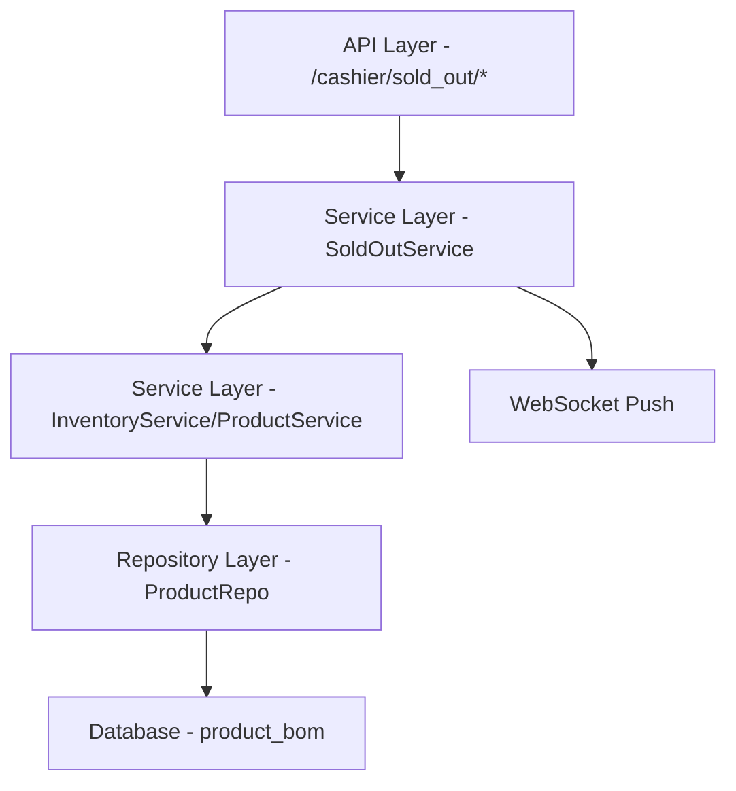

# 收银机沽清商品设置（多终端统一沽清判断） 设计文档

> 本文档定义 收银机沽清商品设置（多终端统一沽清判断） 的技术设计和实现方案。

## 📋 概述

建立统一的沽清判断机制，支持灵活的库存管理策略。在收银机、点餐助手、平板、扫码点餐、会员端、自助点餐机、Grab外卖的下单、送厨、结账环节，统一根据沽清设置进行库存判断。支持通过可售量控制商品售卖，支持负库存场景，优化库存计算逻辑。

---

## 🎯 规范对齐

### Go Main 规范 (go-main.mdc)

设计遵循 Go Main 开发规范：

- Service 只依赖其他 Service 接口（不直接依赖 Repository）
- Repository 只持有 db 实例
- URL 使用 snake_case
- data 字段必须是对象
- 不使用 panic，返回 error
- 使用 errors.WithMessage 包装错误

### API 设计规范 (api.mdc)

API 设计遵循规范：

- URL 使用 snake_case（如：`/cashier/sold_out/settings`）
- 响应格式：`{code, message, data{}}`
- data 不能为 null 或数组

### 数据库规范 (database.mdc)

数据库设计遵循规范：

- 修改现有 product_bom 表，添加必需字段
- 时间字段使用 int 类型，_time 结尾，默认值 0
- 数量字段使用 decimal(22,4)
- 字段名使用 snake_case

---

## 🔄 代码复用分析

### 可复用的现有组件

- **SoldOutService**: `main/app/service/sold_out.go` - 扩展现有沽清服务以支持新字段和逻辑
- **ProductRepo**: `main/app/repository/product_repo.go` - 使用 UpdateProductBomSoldOut 方法更新字段
- **现有 API**: `/cashier/sold_out/add` - 修改现有接口添加新参数
- **WebSocket 推送**: 复用现有 websocket.PushClient 推送沽清变更

### 集成点

- **现有订单服务**: 集成到订单创建、送厨、结账逻辑中，使用沽清设置判断库存
- **数据库表**: 更新 product_bom 表，连接到现有商品库存系统
- **成本卡库存计算**: 需要查询或调用库存服务计算成本卡库存（如存在）

---

## 🏗️ 架构设计

### 分层设计原则

**Go Main 三层架构**:

```
API 层 (Controller/API)
  ↓ 依赖
业务层 (Service)
  ↓ 依赖
数据层 (Repository)
```

**依赖规则**:

- ✅ 上层可依赖下层
- ❌ 禁止下层依赖上层
- ❌ 禁止跨层调用
- ❌ Service 不能依赖 Repository
- ✅ Service 可以依赖其他 Service 接口

### 架构图



### 模块划分

#### Go Main 模块

- **API 层**: `main/app/api/v1/cashier/cashier_sold_out.go` - 路由处理、参数校验
- **Service 层**: `main/app/service/sold_out.go` - 业务逻辑、事务管理
- **Repository 层**: `main/app/repository/product_repo.go` - 数据访问、数据库操作
- **Model 层**: `main/app/model/product.go` - ProductBom 数据模型
- **DTO 层**: `main/app/dto/req/sold_out.go` 和 `main/app/dto/resp/sold_out.go` - 数据传输对象

---

## 🗄️ 数据库设计

### 数据表设计

#### 表 1: product_bom (更新现有表)

```sql
ALTER TABLE `ttpos_product_bom` 
ADD COLUMN `use_bom_card_stock` INT(1) NOT NULL DEFAULT 1 COMMENT '是否使用成本卡库存，默认使用',
ADD COLUMN `has_sellable_quantity` INT(1) NOT NULL DEFAULT 0 COMMENT '是否开启可售量，默认不开启',
ADD COLUMN `sellable_quantity` DECIMAL(22,4) NOT NULL DEFAULT 0.0000 COMMENT '可售数量';

-- 添加索引
ALTER TABLE `ttpos_product_bom` ADD INDEX `idx_use_bom_card_stock` (`use_bom_card_stock`);
ALTER TABLE `ttpos_product_bom` ADD INDEX `idx_has_sellable_quantity` (`has_sellable_quantity`);
```

**字段说明**:

| 字段                  | 类型          | 说明                  | 约束          |
|-----------------------|---------------|-----------------------|---------------|
| use_bom_card_stock   | INT(1)       | 是否使用成本卡库存   | DEFAULT 1    |
| has_sellable_quantity| INT(1)       | 是否开启可售量       | DEFAULT 0    |
| sellable_quantity    | DECIMAL(22,4)| 可售数量             | DEFAULT 0.0000 |

**索引设计**:

- 普通索引: `KEY idx_use_bom_card_stock (use_bom_card_stock)`
- 普通索引: `KEY idx_has_sellable_quantity (has_sellable_quantity)`

**迁移文件**: `admin/database/migrations/{YYYYMMDDHHMMSS}_add_sold_out_fields_to_product_bom_table.php`

### 数据库迁移

**迁移脚本**:

```bash
# 创建迁移文件
cd admin
php think migrate:create AddSoldOutFieldsToProductBomTable

# 执行迁移
php think migrate:run
```

**同步 Go Model**:

更新 `main/app/model/product.go` 中的 ProductBom 结构体添加新字段和 gorm 标签。

**参考**: `docs/agent/workflows/database-migration.md`

---

## 📊 数据模型

### Go Model

更新 `main/app/model/product.go` 中的 ProductBom 结构体:

```go
type ProductBom struct {
    // 现有字段...
    UseBomCardStock     int     `gorm:"column:use_bom_card_stock;type:tinyint(1);default:1;comment:是否使用成本卡库存" json:"use_bom_card_stock"`
    HasSellableQuantity int     `gorm:"column:has_sellable_quantity;type:tinyint(1);default:0;comment:是否开启可售量" json:"has_sellable_quantity"`
    SellableQuantity    float64 `gorm:"column:sellable_quantity;type:decimal(22,4);default:0.0000;comment:可售数量" json:"sellable_quantity"`
    // 现有字段...
}
```

### DTO 定义

#### Request DTO

更新 `main/app/dto/req/sold_out.go`:

```go
type SoldOutItem struct {
    ProductBomUuid      uint64  `json:"product_bom_uuid" binding:"required"`
    IsSoldOut           *bool   `json:"is_sold_out" binding:"required"`
    
    // 新增字段
    UseBomCardStock     *bool   `json:"use_bom_card_stock,omitempty"`
    HasSellableQuantity *bool   `json:"has_sellable_quantity,omitempty"`
    SellableQuantity    *float64 `json:"sellable_quantity,omitempty"`
}

type GetSoldOutSettingsReq struct {
    ProductPackageUuid uint64 `json:"product_package_uuid" binding:"required"`
}
```

#### Response DTO

新增 `main/app/dto/resp/sold_out.go`:

```go
type SoldOutSettingsResp struct {
    Settings []SoldOutSetting `json:"settings"`
}

type SoldOutSetting struct {
    ProductBomUuid      uint64  `json:"product_bom_uuid"`
    UseBomCardStock     bool    `json:"use_bom_card_stock"`
    BomCardStockNum     float64 `json:"bom_card_stock_num"`
    IsSoldOut           bool    `json:"is_sold_out"`
    HasSellableQuantity bool    `json:"has_sellable_quantity"`
    SellableQuantity    float64 `json:"sellable_quantity"`
}
```

---

## 🔌 API 设计

### RESTful API

#### API 1: 获取商品沽清设置信息

**请求**:

- **URL**: `GET /api/v1/cashier/sold_out/settings`
- **Method**: `GET`
- **Headers**:
  ```json
  {
    "Authorization": "Bearer {token}",
    "Content-Type": "application/json"
  }
  ```
- **Query 参数**:
  ```
  product_package_uuid=123
  ```

**响应** (200 OK):

```json
{
  "code": 0,
  "message": "success",
  "data": {
    "settings": [
      {
        "product_bom_uuid": 1,
        "use_bom_card_stock": true,
        "bom_card_stock_num": 10.0000,
        "is_sold_out": false,
        "has_sellable_quantity": true,
        "sellable_quantity": 5.0000
      }
    ]
  }
}
```

**错误响应** (e.g., 400):

```json
{
  "code": 40001,
  "message": "Invalid product_package_uuid",
  "data": {}
}
```

#### API 2: 添加沽清商品（更新）

**请求**:

- **URL**: `POST /api/v1/cashier/sold_out/add`
- **Method**: `POST`
- **Headers**:
  ```json
  {
    "Authorization": "Bearer {token}",
    "Content-Type": "application/json"
  }
  ```
- **Body**:
  ```json
  {
    "sold_out_data": [
      {
        "product_bom_uuid": 123,
        "is_sold_out": true,
        "use_bom_card_stock": true,
        "has_sellable_quantity": true,
        "sellable_quantity": 5.0000
      }
    ]
  }
  ```

**响应** (200 OK):

```json
{
  "code": 0,
  "message": "success",
  "data": {}
}
```

---

## 🧩 组件和接口

### Service 层

#### Service 接口

更新 `main/app/service/sold_out.go` 中的 ISoldOutSrv 接口:

```go
type ISoldOutSrv interface {
    GetSoldOutList(companyUuid uint64, soldOutReq req.SoldOutListReq) (resp.SoldOutPaginationResp, error)
    CancelSoldOut(companyUuid uint64, productBomUuid uint64) error
    CancelAllSoldOut(companyUuid uint64) error
    AddSoldOut(companyUuid uint64, items []req.SoldOutItem) error
    
    // 新增方法
    GetSettings(companyUuid uint64, req *req.GetSoldOutSettingsReq) (*resp.SoldOutSettingsResp, error)
}
```

#### Service 实现

更新 `main/app/service/sold_out.go`:

```go
func (s *soldOutSrv) GetSettings(companyUuid uint64, req *req.GetSoldOutSettingsReq) (*resp.SoldOutSettingsResp, error) {
    productRepo := repository.NewProductRepo(s.dbm.GetDB(companyUuid))
    
    // 查询该商品的所有规格
    boms, _, err := productRepo.GetBomsByProductPackageUuid(req.ProductPackageUuid)
    if err != nil {
        return nil, errors.WithMessage(err, "获取商品规格失败")
    }

    var settings []resp.SoldOutSetting
    for _, bom := range boms {
        stockNum := 0.0
        if bom.UseBomCardStock == 1 {
            // TODO: 调用库存服务计算成本卡库存
            // stockNum, err = inventorySrv.CalculateBomStock(companyUuid, bom.Uuid)
            // 暂时返回 0，后续实现
        }

        settings = append(settings, resp.SoldOutSetting{
            ProductBomUuid:      bom.Uuid,
            UseBomCardStock:     bom.UseBomCardStock == 1,
            BomCardStockNum:     stockNum,
            IsSoldOut:           bom.IsSoldOut == 1,
            HasSellableQuantity: bom.HasSellableQuantity == 1,
            SellableQuantity:    bom.SellableQuantity,
        })
    }

    return &resp.SoldOutSettingsResp{Settings: settings}, nil
}

func (s *soldOutSrv) AddSoldOut(companyUuid uint64, items []req.SoldOutItem) error {
    productRepo := repository.NewProductRepo(s.dbm.GetDB(companyUuid))
    for _, item := range items {
        updateMap := map[string]any{
            "is_sold_out": boolToInt(item.IsSoldOut),
        }
        
        // 更新新字段
        if item.UseBomCardStock != nil {
            updateMap["use_bom_card_stock"] = boolToInt(item.UseBomCardStock)
        }
        if item.HasSellableQuantity != nil {
            updateMap["has_sellable_quantity"] = boolToInt(item.HasSellableQuantity)
        }
        if item.SellableQuantity != nil {
            updateMap["sellable_quantity"] = *item.SellableQuantity
        }
        
        if err := productRepo.UpdateProductBomSoldOut(
            []repository.DBOption{productRepo.WhereBomUuid(item.ProductBomUuid)}, 
            updateMap,
        ); err != nil {
            return errors.WithMessage(err, "沽清商品失败")
        }
        
        // WebSocket 推送
        utils.Go(func() {
            websocket.PushClient(companyUuid, websocket.SourceAll, websocket.SourceAll, websocket.UPDATE_PRODUCT, map[string]interface{}{
                "type":         "update",
                "product_uuid": item.ProductBomUuid,
                "update_time":  time.Now().Unix(),
            })
        })
    }
    return nil
}

func boolToInt(b *bool) int {
    if b == nil {
        return 0
    }
    if *b {
        return 1
    }
    return 0
}
```

### Repository 层

需要在 `main/app/repository/product_repo.go` 中添加或更新方法：

- `GetBomsByProductPackageUuid(productPackageUuid uint64)` - 根据商品包UUID查询所有规格（如不存在需添加）

### API 层

更新 `main/app/api/v1/cashier/cashier_sold_out.go`:

```go
// GetSettings 获取商品沽清设置
func (h *SoldOutHandler) GetSettings(c *gin.Context) {
    var req req.GetSoldOutSettingsReq
    if err := c.ShouldBindQuery(&req); err != nil {
        helper.HandleValidationError(c, err, req, nil)
        return
    }

    respData, err := h.soldOutSrv.GetSettings(helper.GetCompanyUuid(c), &req)
    if err != nil {
        helper.ErrorWithDetail(c, constant.CodeFail, errors.WithMessage(err))
        return
    }

    helper.Success(c, respData)
}
```

在 `RegisterSoldOutHandlers` 中注册路由：

```go
privateApi.GET("/sold_out/settings", wrapper.GetSettings) // 获取商品沽清设置
```

---

## ⚡ 缓存设计

### Redis 缓存

**缓存策略**:

- **Key 命名**: `ttpos:cashier:sold_out:settings:{product_package_uuid}`
- **过期时间**: 5 分钟
- **更新策略**: Cache-Aside Pattern，在更新沽清设置时失效缓存

**示例**:

```go
// 在 GetSettings 中实现缓存
key := fmt.Sprintf("ttpos:cashier:sold_out:settings:%d", req.ProductPackageUuid)
// 查询缓存...
// 写入缓存...
```

---

## 🚨 错误处理

### 错误场景

#### 场景 1: 无效的 product_package_uuid

- **处理方式**: 返回 400 错误码，消息 "Invalid product_package_uuid"
- **用户影响**: 前端显示参数错误提示
- **代码示例**:
  ```go
  if req.ProductPackageUuid == 0 {
      return nil, errors.New("product_package_uuid is required")
  }
  ```

#### 场景 2: 数据库更新失败

- **处理方式**: 回滚事务，返回错误消息
- **用户影响**: 操作失败提示，日志记录错误
- **代码示例**:
  ```go
  if err := productRepo.UpdateProductBomSoldOut(...); err != nil {
      logger.Logger.Error("更新沽清设置失败", zap.Uint64("uuid", uuid), zap.Error(err))
      return errors.WithMessage(err, "更新沽清设置失败")
  }
  ```

---

## 🔒 安全设计

### 身份验证

- **JWT Token**: 所有 API 需要 Token 验证

### 权限控制

- **RBAC**: 仅商户/门店管理员可访问沽清设置 API

### 数据安全

- **SQL 注入防护**: 使用 GORM 参数化查询
- **并发控制**: 使用 UUID 锁在库存扣减时防止超卖

---

## 🧪 测试策略

### 单元测试

**目标覆盖率**:

- main/app/service: 70%+
- main/app/repository: 80%+
- **订单相关模块测试覆盖率 100%**（高风险）

**测试内容**:

- Service 业务逻辑（沽清判断、扣减逻辑）
- Repository 数据访问（新字段更新）
- DTO 数据转换

### API 测试

**测试内容**:

- API 接口调用
- 参数验证（新字段）
- 响应格式
- 错误处理

### 集成测试

**测试流程**:

- 端到端流程：设置沽清 → 下单 → 库存扣减
- 数据库事务
- 缓存一致性

---

## 📈 性能优化

### 优化策略

1. **数据库优化**:
   - 添加索引到新字段
   - 优化库存计算查询

2. **缓存优化**:
   - Redis 缓存沽清设置
   - 缓存预热热门商品

3. **并发控制**:
   - UUID 锁防止并发更新

### 性能指标

- 本地响应时间: < 200ms
- 数据库查询: < 50ms
- 并发能力: 1000+ QPS

---

## 📚 实现清单

### Phase 1: 数据库和模型

- [ ] 创建数据库迁移文件
- [ ] 执行数据库迁移
- [ ] 更新 Go Model

### Phase 2: 核心实现

- [ ] 更新 Repository（如需要）
- [ ] 更新 Service
- [ ] 更新/新增 API
- [ ] 创建/更新 DTO

### Phase 3: 集成和优化

- [ ] 集成到订单/送厨/结账逻辑（Requirement 3）
- [ ] 实现缓存
- [ ] 实现并发控制

### Phase 4: 测试

- [ ] 单元测试
- [ ] API 测试
- [ ] 集成测试

**详细任务**: 参见 `tasks.md`

---

## Graphiti & 活动日志

- Related Episode: `[待补充]`
- 模板：`docs/agent/templates/graphiti-episode.md`
- 活动日志：`docs/team/activities/{YYYY-MM}/{YYYY-MM-DD}.md`

---

**版本**: v1.0.0  
**创建日期**: 2025-12-08  
**作者**: AI Assistant  
**审核者**: 待定

