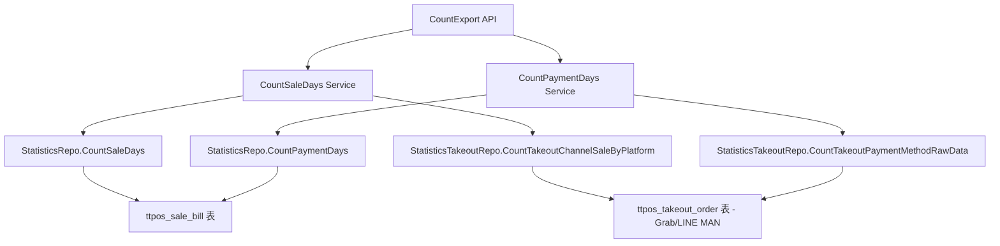

# 旧商家后台-统计报表-导出-加上Grab数据/LINEMAN数据 设计文档

> 本文档定义 旧商家后台统计报表导出增加 Grab 和 LINE MAN 数据 的技术设计和实现方案。

## 📋 概述

在旧商家后台的统计报表导出功能中，为销售统计（按天）和支付数据（按天）两个报表增加 Grab 和 LINE MAN 平台的数据支持。通过扩展 `CountSaleDays` 和 `CountPaymentDays` 方法，集成外卖订单数据，确保这两个平台的数据能够正确统计并显示在导出的报表中，且 Grab 和 LINE MAN 数据排列在最后。

---

## 🎯 规范对齐

### Go Main 规范 (go-main.mdc)

- ✅ Service 只依赖其他 Service 接口
- ✅ Repository 只持有 db 实例
- ✅ URL 使用 snake_case
- ✅ data 字段必须是对象
- ✅ 不使用 panic，返回 error
- ✅ 使用 errors.WithMessage 包装错误

### API 设计规范 (api.mdc)

- ✅ 响应格式统一：`{code, message, data{}}`
- ✅ data 不能为 null 或数组
- ✅ 保持现有 API 接口不变

### 数据库规范 (database.mdc)

- ✅ 复用现有数据表结构
- ✅ 不新增数据库表
- ✅ 使用现有索引优化查询

---

## 🔄 代码复用分析

### 可复用的现有组件

- **StatisticsTakeoutRepo**: `main/app/repository/statistics_takeout.go`
  - `CountTakeoutChannelSaleByPlatform`: 按平台统计外卖渠道销售数据（Grab/LINE MAN）
  - `CountTakeoutPaymentMethodRawData`: 查询外卖订单支付方式原始数据（用于合并统计）

- **StatisticsRepo**: `main/app/repository/statistics.go`
  - `CountSaleDays`: 统计销售天数（需要扩展）
  - `CountPaymentDays`: 统计支付天数（需要扩展）

- **StatisticsSrv**: `main/app/service/statistics.go`
  - `CountSaleDays`: 统计销售天数 Service 方法（需要扩展）
  - `CountPaymentDays`: 统计支付天数 Service 方法（需要扩展）
  - `CountSale`: 参考其集成外卖数据的方式（使用 `CountTakeoutSale` 和 `MergeTakeoutStatistics`）
  - `CountPayment`: 参考其集成外卖支付数据的方式（使用 `CountTakeoutPayment` 并在排序后追加）

### 集成点

- **外卖订单数据**: `ttpos_takeout_order` 表，通过 `platform` 字段区分（"grab" 或 "lineman"）
- **支付方式数据**: `ttpos_payment_method` 表，支付方式名称是 "Grab" 和 "LINE MAN"
- **统计导出**: `CountExport` 方法调用 `CountSaleDays` 和 `CountPaymentDays`，自动包含新增数据

---

## 🏗️ 架构设计

### 分层设计原则

**Go Main 三层架构**:

```
API 层 (shop_statistics.go)
  ↓ 依赖
业务层 (statistics.go - CountSaleDays/CountPaymentDays)
  ↓ 依赖
数据层 (statistics.go/statistics_takeout.go - Repository)
```

### 架构图



### 模块划分

#### Go Main 模块

- **Service 层**: `main/app/service/statistics.go`
  - 扩展 `CountSaleDays` 方法，集成 Grab 和 LINE MAN 销售数据
  - 扩展 `CountPaymentDays` 方法，集成 Grab 和 LINE MAN 支付数据
  - 确保数据排列顺序（Grab 和 LINE MAN 排在最后）

- **Repository 层**: `main/app/repository/statistics.go` 和 `statistics_takeout.go`
  - 复用现有的 `CountTakeoutChannelSaleByPlatform` 方法
  - 复用现有的 `CountTakeoutPaymentMethodRawData` 方法
  - 按天分组处理外卖订单数据

---

## 🗄️ 数据库设计

### 数据表设计

**无需新增数据表**，复用现有表结构：

- `ttpos_takeout_order`: 外卖订单表
  - `platform`: 平台标识（"grab" 或 "lineman"）
  - `accepted_time`: 接单时间（用于按天分组）
  - `order_state`: 订单状态（10,20,30,40,60）
  - `eater_payment`: 实付金额

- `ttpos_payment_method`: 支付方式表
  - `payment_name`: 支付方式名称（"Grab" 或 "LINE MAN"）
  - `code`: 支付方式编码（`constant.PaymentMethodCodeGrab` 或 `constant.PaymentMethodCodeLineMan`）
  - `sort`: 排序字段

### 数据查询优化

- 使用现有索引：`ttpos_takeout_order` 表的 `accepted_time` 和 `platform` 索引
- 按天分组时使用日期函数优化查询性能

---

## 📊 数据模型

### 现有数据结构

#### CountSaleDaysResp

```go
type CountSaleDaysResp struct {
    CountSaleResp
    Day string `json:"day"` // 日期
}
```

#### CountSaleResp（需要扩展）

**需要添加的字段**：

```go
// Grab 平台统计指标
GrabOrderNum        int64   `json:"grab_order_num"`         // Grab 订单数
GrabMinOrderAmount  float64 `json:"grab_min_order_amount"`  // Grab 最小订单金额
GrabMaxOrderAmount  float64 `json:"grab_max_order_amount"` // Grab 最大订单金额
GrabAvgOrderAmount  float64 `json:"grab_avg_order_amount"` // Grab 平均订单金额

// LINE MAN 平台统计指标
LinemanOrderNum        int64   `json:"lineman_order_num"`         // LINE MAN 订单数
LinemanMinOrderAmount  float64 `json:"lineman_min_order_amount"`  // LINE MAN 最小订单金额
LinemanMaxOrderAmount  float64 `json:"lineman_max_order_amount"` // LINE MAN 最大订单金额
LinemanAvgOrderAmount  float64 `json:"lineman_avg_order_amount"` // LINE MAN 平均订单金额
```

#### CountPaymentDaysResp

```go
type CountPaymentDaysResp struct {
    PaymentList []CountPaymentRespList `json:"payment_list"` // 支付方式列表
    Day         string                 `json:"day"`          // 日期
}
```

#### CountPaymentRespList

```go
type CountPaymentRespList struct {
    ID                 uint64  `json:"id"`
    Sort               int     `json:"sort"`
    CreateTime         int64   `json:"create_time"`
    PaymentName        string  `json:"payment_name"`
    PaymentCode        int     `json:"payment_code"`
    ErpnextPayment     string  `json:"erpnext_payment"`
    ErpnextPaymentId   string  `json:"erpnext_payment_id"`
    Source             int     `json:"source"`
    TotalOrderNum      int64   `json:"total_order_num"`
    TotalPaymentAmount float64 `json:"total_payment_amount"`
}
```

**无需新增数据结构**，复用现有模型。

---

## 🔌 API 设计

### RESTful API

**无需新增 API 接口**，现有接口自动包含新增数据：

- **统计导出**: `GET /shop/statistics/export`
  - 调用 `CountExport` 方法
  - 自动调用 `CountSaleDays` 和 `CountPaymentDays`
  - 返回的导出数据自动包含 Grab 和 LINE MAN 数据

---

## 🧩 组件和接口

### Service 层

#### 扩展 CountSaleDays 方法

**文件**: `main/app/service/statistics.go`

**实现思路**:

1. 在现有 `CountSaleDays` 方法中，对每个日期（day）：
   - 调用 `CountTakeoutChannelSaleByPlatform` 获取 Grab 和 LINE MAN 的原始数据
   - 按日期筛选数据（使用 `accepted_time` 字段转换为日期字符串匹配 day）
   - 使用 `calculateChannelSaleFromRawData` 或类似逻辑计算 Grab 和 LINE MAN 的统计指标：
     - 订单数（TotalOrderNum）
     - 最小订单金额（MinOrderAmount）
     - 最大订单金额（MaxOrderAmount）
     - 平均订单金额（AvgOrderAmount = 总金额 / 订单数）
   - 将统计结果填充到 `CountSaleDaysResp` 的新字段中：
     - `GrabOrderNum`, `GrabMinOrderAmount`, `GrabMaxOrderAmount`, `GrabAvgOrderAmount`
     - `LinemanOrderNum`, `LinemanMinOrderAmount`, `LinemanMaxOrderAmount`, `LinemanAvgOrderAmount`

**参考实现**:

```go
// 参考 CountSale 方法中集成外卖数据的方式
takeoutSaleData := repository.NewStatisticsTakeoutRepo(db).CountTakeoutSale(repository.CountTakeoutReq{
    TimeStart:         req.QueryStartTime,
    TimeEnd:           req.QueryEndTime,
    StaffShiftLogUuid: staffShiftLogUuid,
})
statisticsUtilSrv := NewStatisticsUtilSrv()
mergeSaleData := statisticsUtilSrv.MergeTakeoutStatistics(saleData, takeoutSaleData, cancelOrderData)
```

#### 扩展 CountPaymentDays 方法

**文件**: `main/app/service/statistics.go`

**实现思路**:

1. 在现有 `CountPaymentDays` 方法中，对每个日期（day）：
   - 调用 `CountTakeoutPaymentMethodRawData` 获取 Grab 和 LINE MAN 的支付数据
   - 按日期筛选数据（使用 `accepted_time` 字段）
   - 将 Grab 和 LINE MAN 的支付数据追加到 `PaymentList` 中
   - 确保 Grab 和 LINE MAN 数据排列在最后（在排序后追加，参考 `CountPayment` 方法）

**参考实现**:

```go
// 参考 CountPayment 方法中集成外卖支付数据的方式
takeoutPaymentData := repository.NewStatisticsTakeoutRepo(ctx.GetDB()).CountTakeoutPayment(repository.CountTakeoutReq{
    TimeStart:         req.QueryStartTime,
    TimeEnd:           req.QueryEndTime,
    StaffShiftLogUuid: staffShiftLogUuid,
})

// 先按Sort升序排序，再按CreateTime降序排序
sort.SliceStable(list, func(i, j int) bool {
    // ... 排序逻辑
})

// 追加外卖支付方式统计到 PaymentList（在排序之后追加）
for _, takeoutPayment := range takeoutPaymentData {
    list = append(list, CountPaymentRespList{
        // ... 数据映射
    })
}
```

### Repository 层

**无需修改 Repository 层**，复用现有方法：

- `CountTakeoutChannelSaleByPlatform`: 已支持按平台统计（"grab" 或 "lineman"）
- `CountTakeoutPaymentMethodRawData`: 已支持查询外卖支付方式原始数据

---

## ⚡ 缓存设计

**无需新增缓存策略**，复用现有缓存机制。

---

## 🚨 错误处理

### 错误场景

#### 场景 1: Grab 或 LINE MAN 数据查询失败

- **处理方式**: 记录错误日志，但不影响其他数据的统计，返回部分数据
- **用户影响**: 导出数据中可能缺少 Grab 或 LINE MAN 数据
- **代码示例**:
  ```go
  grabData, err := takeoutRepo.CountTakeoutChannelSaleByPlatform(req, "grab")
  if err != nil {
      logger.Logger.Error("查询 Grab 数据失败", zap.Error(err))
      // 继续处理其他数据，不中断流程
  }
  ```

#### 场景 2: 日期分组数据不匹配

- **处理方式**: 使用日期字符串精确匹配，确保数据正确分组
- **用户影响**: 无影响，数据正确分组

---

## 🔒 安全设计

### 身份验证

- ✅ 所有 API 需要 JWT Token 验证（现有机制）

### 权限控制

- ✅ 复用现有权限控制机制

### 数据安全

- ✅ 使用参数化查询，防止 SQL 注入
- ✅ 数据访问权限控制（现有机制）

---

## 🧪 测试策略

### 单元测试

**目标覆盖率**:

- `main/app/service/statistics.go`: 70%+
- `main/app/repository/statistics.go`: 80%+

**测试内容**:

- `CountSaleDays` 方法：测试 Grab 和 LINE MAN 数据正确合并
- `CountPaymentDays` 方法：测试 Grab 和 LINE MAN 数据正确追加
- 测试数据排列顺序（Grab 和 LINE MAN 排在最后）
- 测试日期分组正确性
- 测试边界情况（无数据、单条数据、多条数据）

### API 测试

**测试内容**:

- 导出接口返回数据包含 Grab 和 LINE MAN
- 数据排列顺序正确
- 数据统计准确性

### 集成测试

**测试流程**:

- 端到端测试：创建 Grab/LINE MAN 订单 → 统计导出 → 验证数据
- 多日期测试：测试跨日期数据统计
- 数据一致性测试：验证统计结果与订单数据一致

---

## 📈 性能优化

### 优化策略

1. **数据库优化**:
   - 使用现有索引：`ttpos_takeout_order` 表的 `accepted_time` 和 `platform` 索引
   - 按日期范围查询，避免全表扫描

2. **查询优化**:
   - 复用现有的 `CountTakeoutChannelSaleByPlatform` 方法，已优化查询性能
   - 按天分组时使用日期函数，避免多次查询

3. **内存优化**:
   - 使用流式处理，避免一次性加载大量数据

### 性能指标

- 本地响应时间: < 200ms（与现有性能保持一致）
- 数据库查询: < 50ms（使用现有索引）
- 数据统计准确性: 100%

---

## 🌐 浏览器兼容性

**无需前端修改**，保持现有兼容性。

---

## 📚 实现清单

### Phase 1: 代码分析和准备

- [x] 分析现有 `CountSale` 和 `CountPayment` 方法实现
- [x] 分析现有 `CountSaleDays` 和 `CountPaymentDays` 方法实现
- [x] 确认 Grab 和 LINE MAN 数据来源和查询方式
- [x] 确认数据排列顺序要求

### Phase 2: 核心实现

- [ ] 扩展 `CountSaleResp` 结构，添加 Grab 和 LINE MAN 统计字段
- [ ] 扩展 `CountSaleDays` 方法，集成 Grab 和 LINE MAN 销售数据（包括订单数、最小/最大/平均订单金额）
- [ ] 扩展 `CountPaymentDays` 方法，集成 Grab 和 LINE MAN 支付数据
- [ ] 确保数据排列顺序（Grab 和 LINE MAN 排在最后）

### Phase 3: 测试和优化

- [ ] 单元测试：`CountSaleDays` 和 `CountPaymentDays` 方法
- [ ] 集成测试：端到端导出功能测试
- [ ] 性能测试：确保查询性能不受影响
- [ ] 数据准确性验证：对比订单数据和统计结果

**详细任务**: 参见 `tasks.md`

---

## Graphiti & 活动日志

- Related Episode: `[待补充]`
- 模板：`docs/agent/templates/graphiti-episode.md`
- 活动日志：`docs/team/activities/{YYYY-MM}/{YYYY-MM-DD}.md`
- 在技术方案评审、关键架构决策或踩坑总结后，立即补充 Episode 并在设计文档尾部互链。

---

**版本**: v1.0.0  
**创建日期**: 2026-01-19  
**作者**: 王昱  
**审核者**: 待审核
