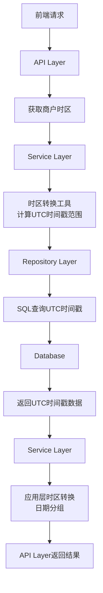

# 统计报表按商户时区查询 设计文档

> 本文档定义统计报表按商户时区查询的技术设计和实现方案。

## 📋 概述

统一所有统计报表、数据查询、导出功能使用商户设置的时区进行计算和查询，而非设备/浏览器时区。同时新增 `query_start_date` 和 `query_end_date` 参数，支持接收日期时间格式 "YYYY-MM-DD HH:mm:ss"，便于前端精确指定查询时间范围。

**核心设计原则**：
- 所有时间计算基于商户时区
- 数据库存储 UTC 时间戳，查询时在应用层转换为商户时区
- **不在数据库查询中使用时区转换**（避免依赖数据库时区设置）
- 在应用层完成时区转换和日期分组
- 新增日期时间参数支持精确时间范围查询

---

## 🎯 规范对齐

### Go Main 规范 (go-main.mdc)

- ✅ Service 只依赖其他 Service 接口
- ✅ Repository 只持有 db 实例
- ✅ URL 使用 snake_case
- ✅ data 字段必须是对象
- ✅ 不使用 panic，返回 error
- ✅ 时区获取：`ctx.GetCompanySetting().Timezone`
- ✅ 时区转换：`utils.SetTimezone(timezone)`

### API 设计规范 (api.mdc)

- ✅ URL 使用 snake_case
- ✅ 响应格式统一：`{code, message, data{}}`
- ✅ data 不能为 null 或数组
- ✅ 新增参数：`query_start_date`、`query_end_date`（格式：`YYYY-MM-DD HH:mm:ss`）

### 数据库规范 (database.mdc)

- ✅ 时间字段使用 int 类型（UTC 时间戳）
- ✅ **时区转换在应用层完成**（不依赖数据库时区设置）
- ✅ 数据库查询使用 UTC 时间戳，应用层转换后处理

---

## 🔄 代码复用分析

### 可复用的现有组件

- **时区工具类**: `main/pkg/utils/time.go` - 已有 `SetTimezone`、`TodayStartEndUnix` 等方法
- **统计请求 DTO**: `main/app/dto/req/statistics.go` - 已有 `BusinessDataCountReq.GetParam` 方法
- **时区获取**: `ctx.GetCompanySetting().Timezone` - 已有获取商户时区的机制
- **Bug 修复方案**: `docs/shared/bugs/active/bug-251226-001-statistics-from-unixtime-timezone-statistics-error/solution.md` - 参考 SQL 时区转换方案

### 需要扩展的组件

- **时区工具类**: 添加 `FormatDateTimeToUnix` 方法，支持解析 "YYYY-MM-DD HH:mm:ss" 格式
- **统计请求 DTO**: 添加 `query_start_date` 和 `query_end_date` 字段，扩展 `GetParam` 方法

---

## 🏗️ 架构设计

### 分层设计原则

**Go Main 三层架构**:

```
API 层 (Controller/API)
  ↓ 获取商户时区
Service 层 (Business Service)
  ↓ 时区转换 + 时间范围计算
Repository 层 (Statistics Repository)
  ↓ SQL 查询使用 UTC 时间戳
Database (MySQL)
  ↓ 返回 UTC 时间戳数据
Service 层 (Business Service)
  ↓ 应用层时区转换和日期分组
API 层 (Controller/API)
```

**依赖规则**:
- ✅ API 层从 Context 获取商户时区
- ✅ Service 层在应用层完成时区转换和日期分组
- ✅ Repository 层只查询 UTC 时间戳，不进行时区转换
- ✅ 时区转换工具类统一处理时区逻辑

### 架构图



---

## 🗄️ 数据库设计

### 时区转换方案

**方案选择**: **在应用层完成时区转换**（不使用数据库时区转换）

**原因**:
- ✅ 不依赖数据库时区设置，避免时区不一致问题
- ✅ 完全控制时区转换逻辑，准确性更高
- ✅ 可以处理复杂的时区规则（夏令时等）
- ✅ 项目已有 `utils.Timezone` 工具类，可以复用

**实现方式**:

1. **时间范围查询**: 在应用层将商户时区的日期时间转换为 UTC 时间戳范围，然后查询数据库
2. **日期分组统计**: 查询出数据后，在应用层将 UTC 时间戳转换为商户时区的日期，然后分组统计

**SQL 查询示例**:

```sql
-- 查询使用 UTC 时间戳（不进行时区转换）
SELECT create_time, total_amount, status
FROM ttpos_sale_order
WHERE delete_time = 0
  AND create_time >= ?  -- UTC 时间戳（应用层计算）
  AND create_time <= ?  -- UTC 时间戳（应用层计算）
ORDER BY create_time ASC;
```

**应用层处理示例**:

```go
// Service 层：查询数据
orders, err := repo.GetOrdersByTimeRange(startTimestamp, endTimestamp)

// Service 层：应用层时区转换和日期分组
timeUtil := utils.SetTimezone(timezone)
dateGroups := make(map[string][]Order)
for _, order := range orders {
    // 将 UTC 时间戳转换为商户时区的日期
    date := timeUtil.FormatUnixTime(order.CreateTime, "2006-01-02")
    dateGroups[date] = append(dateGroups[date], order)
}

// 按日期统计
for date, orders := range dateGroups {
    // 统计该日期的数据
}
```

---

## 📊 数据模型

### DTO 扩展

#### Request DTO 扩展

```go
// main/app/dto/req/statistics.go

// BusinessDataCountReq 营业数据统计请求
type BusinessDataCountReq struct {
    TimeType          int    `form:"time_type" json:"time_type"`                     // 时间类型 (-1 未选择, 1 今天, 2 昨天, 3 本周, 4 本月, 5 营业时间)
    QueryStartTime    int64  `form:"query_start_time" json:"query_start_time"`       // 查询开始时间戳
    QueryEndTime      int64  `form:"query_end_time" json:"query_end_time"`           // 查询结束时间戳
    QueryStartDate    string `form:"query_start_date" json:"query_start_date"`       // 查询开始日期时间（格式：YYYY-MM-DD HH:mm:ss）
    QueryEndDate      string `form:"query_end_date" json:"query_end_date"`           // 查询结束日期时间（格式：YYYY-MM-DD HH:mm:ss）
    // ... 其他字段
}

// GetParam 获取参数（扩展支持日期时间字符串）
func (r *BusinessDataCountReq) GetParam(timezone string, openingHours string) BusinessDataCountReq {
    var (
        queryStartTime int64
        queryEndTime   int64
    )
    
    // 优先处理日期时间字符串参数
    if r.QueryStartDate != "" && r.QueryEndDate != "" {
        timeUtil := utils.SetTimezone(timezone)
        startTime, err := timeUtil.FormatDateTimeToUnix(r.QueryStartDate)
        if err == nil {
            queryStartTime = startTime
        }
        endTime, err := timeUtil.FormatDateTimeToUnix(r.QueryEndDate)
        if err == nil {
            queryEndTime = endTime
        }
    }
    
    // 其次处理时间戳参数
    if queryStartTime == 0 && queryEndTime == 0 {
        if r.QueryStartTime > 0 && r.QueryEndTime > 0 {
            queryStartTime = int64(r.QueryStartTime)
            queryEndTime = int64(r.QueryEndTime)
        }
    }
    
    // 最后处理时间类型
    if queryStartTime == 0 && queryEndTime == 0 && r.TimeType > 0 && r.TimeType < 6 {
        switch r.TimeType {
        case 1: // 今天
            queryStartTime, queryEndTime = utils.SetTimezone(timezone).TodayStartEndUnix()
        case 2: // 昨天
            queryStartTime, queryEndTime = utils.SetTimezone(timezone).YesterdayStartEndUnix()
        case 3: // 本周
            queryStartTime, queryEndTime = utils.SetTimezone(timezone).WeekStartEndUnix()
        case 4: // 本月
            queryStartTime, queryEndTime = utils.SetTimezone(timezone).MonthStartEndUnix()
        case 5: // 营业时间
            queryStartTime, queryEndTime = utils.SetTimezone(timezone).OpeningHoursStartEndUnix(openingHours)
        }
    }
    
    return BusinessDataCountReq{
        TimeType:       r.TimeType,
        QueryStartTime: queryStartTime,
        QueryEndTime:   queryEndTime,
        // ... 其他字段
    }
}
```

### 时区工具类扩展

```go
// main/pkg/utils/time.go

// FormatDateTimeToUnix 将日期时间字符串转换为时间戳（支持商户时区）
// timeStr: 日期时间字符串，格式为 "YYYY-MM-DD HH:mm:ss"
// 返回：时间戳（Unix 时间戳，10位）
func (t Timezone) FormatDateTimeToUnix(timeStr string) (int64, error) {
    loc, err := time.LoadLocation(string(t))
    if err != nil {
        return 0, err
    }
    
    // 支持两种格式：YYYY-MM-DD 和 YYYY-MM-DD HH:mm:ss
    var layout string
    if len(timeStr) == 10 {
        layout = "2006-01-02"
    } else if len(timeStr) == 19 {
        layout = "2006-01-02 15:04:05"
    } else {
        return 0, errors.New("日期时间格式错误，应为 YYYY-MM-DD 或 YYYY-MM-DD HH:mm:ss")
    }
    
    tm, err := time.ParseInLocation(layout, timeStr, loc)
    if err != nil {
        return 0, err
    }
    
    return tm.Unix(), nil
}

// FormatDateTimeToTime 将日期时间字符串转换为 time.Time 对象（使用商户时区）
func (t Timezone) FormatDateTimeToTime(timeStr string) (time.Time, error) {
    loc, err := time.LoadLocation(string(t))
    if err != nil {
        return time.Time{}, err
    }
    
    var layout string
    if len(timeStr) == 10 {
        layout = "2006-01-02"
    } else if len(timeStr) == 19 {
        layout = "2006-01-02 15:04:05"
    } else {
        return time.Time{}, errors.New("日期时间格式错误，应为 YYYY-MM-DD 或 YYYY-MM-DD HH:mm:ss")
    }
    
    return time.ParseInLocation(layout, timeStr, loc)
}
```

---

## 🔌 API 设计

### RESTful API

#### API 1: 统计营业数据（示例）

**请求**:

- **URL**: `/api/v1/shop/statistics/business`
- **Method**: `GET`
- **Headers**:
  ```json
  {
    "Authorization": "Bearer {token}",
    "Content-Type": "application/json"
  }
  ```
- **Query Parameters**:
  ```json
  {
    "time_type": 1,                              // 可选：时间类型 (1=今天, 2=昨天, 3=本周, 4=本月, 5=营业时间)
    "query_start_time": 1739283862,              // 可选：查询开始时间戳
    "query_end_time": 1739369999,                 // 可选：查询结束时间戳
    "query_start_date": "2025-12-30 00:00:00",   // 可选：查询开始日期时间（格式：YYYY-MM-DD HH:mm:ss）
    "query_end_date": "2025-12-30 23:59:59",     // 可选：查询结束日期时间（格式：YYYY-MM-DD HH:mm:ss）
    "category_type": 1,                          // 可选：分类类型
    "duty_no": "D001",                           // 可选：班次编号
    "staff_uuid": 123456                         // 可选：操作员UUID
  }
  ```

**参数优先级**:
1. `query_start_date` + `query_end_date`（最高优先级）
2. `query_start_time` + `query_end_time`
3. `time_type`（最低优先级）

**响应**:

```json
{
  "code": 1,
  "message": "success",
  "data": {
    "total_amount": 12345.67,
    "total_count": 100,
    "payment_methods": [...],
    "timezone": "Asia/Bangkok",
    "timezone_offset": "+07:00"
  }
}
```

**时区处理流程**:
1. API 层从 `ctx.GetCompanySetting().Timezone` 获取商户时区
2. 调用 `req.GetParam(timezone, openingHours)` 转换时间范围（商户时区 → UTC 时间戳）
3. Service 层传递 UTC 时间戳范围到 Repository
4. Repository 层使用 UTC 时间戳查询数据库
5. Service 层将查询结果中的 UTC 时间戳转换为商户时区，进行日期分组和统计

---

## 🧩 组件和接口

### Service 层

#### Service 接口（无需修改）

```go
// main/app/service/i_business_service.go
type IBusinessSrv interface {
    CountBusiness(ctx context.Context, req req.BusinessDataCountReq) (*resp.BusinessDataAll, error)
    CountPaymentMethod(ctx context.Context, req req.BusinessDataCountReq) (*resp.BusinessDataPaymentMethod, error)
    // ... 其他方法
}
```

#### Service 实现（应用层时区转换）

```go
// main/app/service/business_service.go
func (s *businessSrv) CountBusiness(ctx context.Context, req req.BusinessDataCountReq) (*resp.BusinessDataAll, error) {
    // 获取商户时区
    timezone := ctx.GetCompanySetting().Timezone
    openingHours := s.getOpeningHours(ctx)
    
    // 转换时间范围（商户时区 → UTC 时间戳）
    req = req.GetParam(timezone, openingHours)
    
    // 调用 Repository，查询 UTC 时间戳数据
    data, err := s.statisticsRepo.CountBusiness(ctx, req)
    if err != nil {
        return nil, err
    }
    
    // 应用层时区转换（如需要日期分组）
    // 将 UTC 时间戳转换为商户时区的日期，进行分组统计
    timeUtil := utils.SetTimezone(timezone)
    // ... 时区转换和分组逻辑
    
    return data, nil
}
```

### Repository 层

#### Repository 接口（不传递时区参数）

```go
// main/app/repository/i_statistics_repo.go
type IStatisticsRepo interface {
    // Repository 层只接收 UTC 时间戳，不处理时区
    CountBusiness(ctx context.Context, req req.BusinessDataCountReq) (*resp.BusinessDataAll, error)
    CountBusinessSummary(ctx context.Context, req req.StatisticsSummaryReq) (*resp.StatisticsSummary, error)
    CountBusinessPaymentMethod(ctx context.Context, req req.StatisticsPaymentMethodReq) (*resp.StatisticsPaymentMethod, error)
    // 查询原始数据（UTC 时间戳）
    GetOrdersByTimeRange(startTime, endTime int64) ([]*model.SaleOrder, error)
    // ... 其他方法
}
```

#### Repository 实现（使用 UTC 时间戳查询）

```go
// main/app/repository/statistics_repo.go
func (r *statisticsRepoImpl) CountBusinessSummary(ctx context.Context, req req.StatisticsSummaryReq) (*resp.StatisticsSummary, error) {
    // SQL 查询使用 UTC 时间戳（不进行时区转换）
    query := `
        SELECT 
            create_time,
            total_amount,
            status
        FROM ttpos_sale_order
        WHERE delete_time = 0
            AND create_time >= ?
            AND create_time <= ?
        ORDER BY create_time ASC
    `
    
    var orders []struct {
        CreateTime  int64   `gorm:"column:create_time"`
        TotalAmount float64 `gorm:"column:total_amount"`
        Status      int     `gorm:"column:status"`
    }
    
    err := r.db.Raw(query, req.QueryStartTime, req.QueryEndTime).Scan(&orders).Error
    if err != nil {
        return nil, errors.WithMessage(err, "查询失败")
    }
    
    // 返回原始数据，时区转换在 Service 层完成
    return &resp.StatisticsSummary{
        Orders: orders,
    }, nil
}

// Service 层处理时区转换和日期分组
func (s *businessSrv) CountBusinessSummary(ctx context.Context, req req.StatisticsSummaryReq) (*resp.StatisticsSummary, error) {
    // 获取商户时区
    timezone := ctx.GetCompanySetting().Timezone
    
    // 转换时间范围（商户时区 → UTC 时间戳）
    req = req.GetParam(timezone, openingHours)
    
    // 查询数据（UTC 时间戳）
    summary, err := s.statisticsRepo.CountBusinessSummary(ctx, req)
    if err != nil {
        return nil, err
    }
    
    // 应用层时区转换和日期分组
    timeUtil := utils.SetTimezone(timezone)
    dateGroups := make(map[string]*DateStats)
    
    for _, order := range summary.Orders {
        // 将 UTC 时间戳转换为商户时区的日期
        date := timeUtil.FormatUnixTime(order.CreateTime, "2006-01-02")
        
        if dateGroups[date] == nil {
            dateGroups[date] = &DateStats{
                Date:   date,
                Count:  0,
                Amount: 0,
            }
        }
        
        dateGroups[date].Count++
        dateGroups[date].Amount += order.TotalAmount
    }
    
    // 构建响应数据
    var results []DateStats
    for _, stats := range dateGroups {
        results = append(results, *stats)
    }
    
    // 按日期排序
    sort.Slice(results, func(i, j int) bool {
        return results[i].Date < results[j].Date
    })
    
    return &resp.StatisticsSummary{
        DateStats: results,
    }, nil
}
```

---

## ⚡ 缓存设计

### Redis 缓存策略

**缓存 Key**: `ttpos:statistics:{company_uuid}:{type}:{time_range}`

**缓存时间**: 5 分钟（统计数据实时性要求较高）

**缓存更新**: Cache-Aside Pattern

**示例**:
```go
key := fmt.Sprintf("ttpos:statistics:%d:business:%d-%d", companyUuid, queryStartTime, queryEndTime)
```

---

## 🚨 错误处理

### 错误场景

#### 场景 1: 日期时间格式错误

- **处理方式**: 返回参数错误，提示正确的格式
- **用户影响**: 前端显示错误提示
- **代码示例**:
  ```go
  if err != nil {
      return nil, errors.WithMessage(err, "日期时间格式错误，应为 YYYY-MM-DD HH:mm:ss")
  }
  ```

#### 场景 2: 时区数据异常

- **处理方式**: 使用默认时区（Asia/Shanghai）或返回错误
- **用户影响**: 使用默认时区继续查询，或显示错误提示
- **代码示例**:
  ```go
  timezone := ctx.GetCompanySetting().Timezone
  if timezone == "" {
      timezone = "Asia/Shanghai" // 默认时区
  }
  ```

#### 场景 3: SQL 查询时区转换失败

- **处理方式**: 记录错误日志，返回错误响应
- **用户影响**: 显示错误提示，建议联系技术支持

---

## 🔒 安全设计

### 身份验证

- ✅ 所有 API 需要 JWT Token 验证
- ✅ 从 Context 获取商户信息，确保数据隔离

### 参数验证

- ✅ 日期时间格式验证（正则表达式）
- ✅ 时间范围验证（开始时间 < 结束时间）
- ✅ 时区名称验证（白名单验证）

---

## 🧪 测试策略

### 单元测试

**目标覆盖率**:
- Service 层: ≥ 70%
- Repository 层: ≥ 80%
- 时区工具类: 100%

**测试内容**:
- 时区转换工具函数
- 日期时间字符串解析
- SQL 时区转换查询
- 时间范围计算

### API 测试

**测试场景**:
- 使用 `query_start_date` 和 `query_end_date` 参数
- 使用 `query_start_time` 和 `query_end_time` 参数
- 使用 `time_type` 参数
- 跨时区场景测试（UTC+7, UTC+8, UTC+9）

### 集成测试

**测试流程**:
- 端到端时区转换流程
- 多时区商户数据查询
- SQL 查询时区转换准确性

---

## 📈 性能优化

### 优化策略

1. **数据库优化**:
   - 确保时间字段有索引
   - SQL 查询使用 UTC 时间戳（不进行时区转换，性能更好）

2. **应用层优化**:
   - 时区转换在内存中完成，性能开销小
   - 对于大数据量，考虑分批处理
   - 使用 map 进行日期分组，提高效率

3. **缓存优化**:
   - Redis 缓存统计结果（5 分钟）
   - 缓存键包含时区和时间范围

4. **查询优化**:
   - 避免全表扫描
   - 使用索引优化时间范围查询

### 性能指标

- 本地响应时间: < 200ms
- 数据库查询: < 50ms（使用索引，UTC 时间戳查询）
- 应用层时区转换开销: < 10ms（内存操作）

---

## 📚 实现清单

### Phase 1: 时区工具类扩展

- [ ] 添加 `FormatDateTimeToUnix` 方法
- [ ] 添加 `FormatDateTimeToTime` 方法
- [ ] 添加 `TimezoneToMySQLOffset` 函数
- [ ] 编写单元测试

### Phase 2: DTO 扩展

- [ ] 扩展 `BusinessDataCountReq` 添加 `query_start_date` 和 `query_end_date` 字段
- [ ] 扩展 `GetParam` 方法支持日期时间字符串
- [ ] 扩展其他统计请求 DTO（如 `StatisticsSummaryReq`、`StatisticsPaymentMethodReq` 等）

### Phase 3: Repository 层查询优化

- [ ] 修改 Repository 接口移除时区参数（只接收 UTC 时间戳）
- [ ] 修改 SQL 查询使用 UTC 时间戳（移除 `FROM_UNIXTIME` 和 `CONVERT_TZ`）
- [ ] 查询返回原始数据（UTC 时间戳），时区转换在 Service 层完成

### Phase 4: Service 层时区转换和日期分组

- [ ] 修改 Service 实现：在应用层完成时区转换
- [ ] 实现日期分组逻辑（将 UTC 时间戳转换为商户时区日期）
- [ ] 统一时区获取和转换逻辑

### Phase 5: API 层参数处理

- [ ] 修改所有统计接口支持新参数
- [ ] 参数验证和错误处理

### Phase 6: 测试和优化

- [ ] 单元测试
- [ ] API 测试
- [ ] 集成测试
- [ ] 性能优化

**详细任务**: 参见 `tasks.md`

---

## Graphiti & 活动日志

- Related Episode: `[待补充]`
- 模板：`docs/agent/templates/graphiti-episode.md`
- 活动日志：`docs/team/activities/{YYYY-MM}/{YYYY-MM-DD}.md`
- 在技术方案评审、关键架构决策或踩坑总结后，立即补充 Episode 并在设计文档尾部互链。

---

**版本**: v1.0.0  
**创建日期**: 2025-12-30  
**作者**: 王昱  
**审核者**: {审核者}

