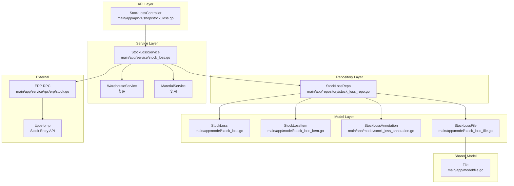
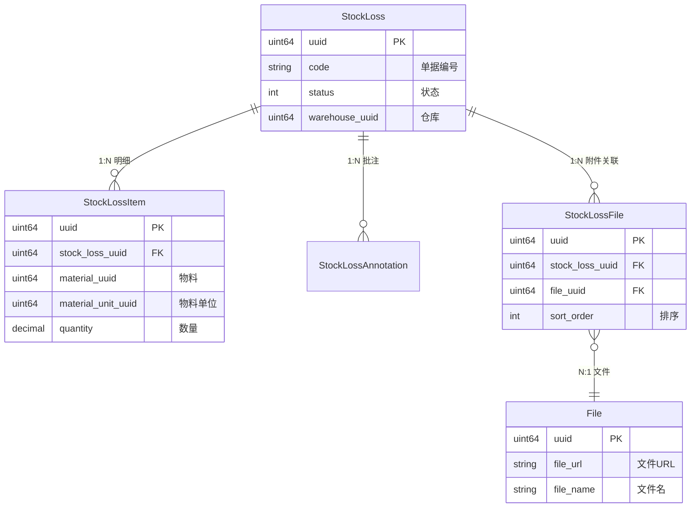
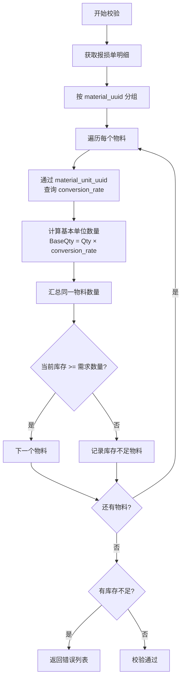
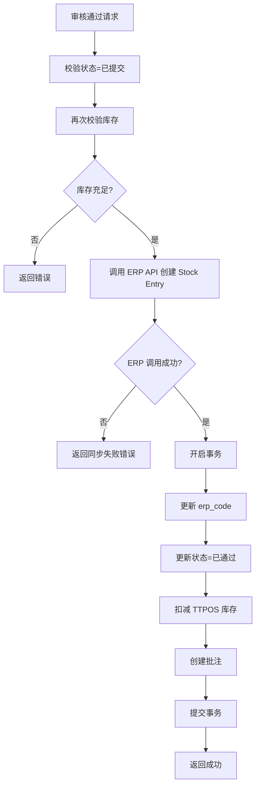

# story-shop-stock-loss 技术设计

## 概述

| 项目 | 内容 |
|------|------|
| Spec ID | story-shop-stock-loss |
| 设计人 | 曾振华 |
| 设计日期 | 2026-02-02 |
| 总 SP | 5 |

## 代码复用分析

### 可复用代码

| 文件 | 说明 | 复用方式 |
|------|------|---------|
| `main/app/service/rpc/erp/stock.go` | ERP Stock gRPC 客户端 | 扩展新方法 |
| `main/app/service/warehouse.go` | 仓库服务（仓库列表、出入库明细） | 直接调用 |
| `main/app/service/material.go` | 物品服务（物品列表、单位换算） | 直接调用 |
| `main/app/repository/stock_reconciliation_repo.go` | 库存盘点仓库（参考模式） | 参考 |
| `main/app/model/transfer_order_file.go` | 调拨单附件关联（附件模式参考） | 参考 |
| `main/app/model/file.go` | 统一文件表 | 直接关联 |

### 需要新建

| 文件 | 说明 |
|------|------|
| `main/app/model/stock_loss.go` | 报损单主表模型 |
| `main/app/model/stock_loss_item.go` | 报损单明细模型 |
| `main/app/model/stock_loss_annotation.go` | 报损单批注模型 |
| `main/app/model/stock_loss_file.go` | 报损单附件关联模型 |
| `main/app/repository/stock_loss_repo.go` | 报损单仓库层 |
| `main/app/service/stock_loss.go` | 报损单服务层 |
| `main/app/api/v1/shop/stock_loss.go` | 报损单 API 控制器 |
| `main/app/dto/req/stock_loss_req.go` | 请求 DTO |
| `main/app/dto/resp/stock_loss_resp.go` | 响应 DTO |
| `admin/database/migrations/xxx_create_stock_loss_tables.php` | 数据库迁移 |

## 架构设计

### 架构图



### 分层说明

- **API Layer**: `main/app/api/v1/shop/stock_loss.go` - HTTP Handler，参数校验
- **Service Layer**: `main/app/service/stock_loss.go` - 业务逻辑，状态流转，ERP 同步
- **Repository Layer**: `main/app/repository/stock_loss_repo.go` - 数据访问，事务处理
- **Model Layer**: `main/app/model/stock_loss*.go` - 数据模型
- **DTO Layer**: `main/app/dto/req/`, `main/app/dto/resp/` - 请求/响应对象

## 组件和接口

### Service: StockLossService

**位置**: `main/app/service/stock_loss.go`

**接口定义**:

```go
type IStockLossSrv interface {
    // CRUD
    Create(ctx context.Context, req req.CreateStockLossReq) (*resp.StockLossDetailResp, error)
    Update(ctx context.Context, req req.UpdateStockLossReq) (*resp.StockLossDetailResp, error)
    Delete(ctx context.Context, req req.DeleteStockLossReq) error
    GetDetail(ctx context.Context, req req.GetStockLossReq) (*resp.StockLossDetailResp, error)
    GetList(ctx context.Context, req req.StockLossListReq) (*resp.StockLossListResp, error)

    // 流程操作
    Submit(ctx context.Context, req req.SubmitStockLossReq) error
    Approve(ctx context.Context, req req.ApproveStockLossReq) error
    Reject(ctx context.Context, req req.RejectStockLossReq) error
    Resubmit(ctx context.Context, req req.ResubmitStockLossReq) error

    // 批注
    GetAnnotations(ctx context.Context, req req.GetStockLossAnnotationsReq) (*resp.StockLossAnnotationsResp, error)
}
```

**依赖注入**:

```go
func NewStockLossSrv(
    dbm *database.DBManager,
    warehouseSrv IWarehouseSrv,
    materialSrv IMaterialSrv,
    erpSrv erp.IErpSrv,
) IStockLossSrv
```

### Repository: StockLossRepo

**位置**: `main/app/repository/stock_loss_repo.go`

**接口定义**:

```go
type IStockLossRepo interface {
    Create(stockLoss *model.StockLoss) error
    Update(stockLoss *model.StockLoss) error
    Delete(uuid uint64) error
    GetByUuid(uuid uint64) (*model.StockLoss, error)
    GetList(opts ...StockLossOption) ([]*model.StockLoss, int64, error)

    // 明细操作
    CreateItems(items []*model.StockLossItem) error
    DeleteItemsByStockLossUuid(stockLossUuid uint64) error
    GetItemsByStockLossUuid(stockLossUuid uint64) ([]*model.StockLossItem, error)

    // 批注操作
    CreateAnnotation(annotation *model.StockLossAnnotation) error
    GetAnnotationsByStockLossUuid(stockLossUuid uint64) ([]*model.StockLossAnnotation, error)

    // 附件操作
    CreateFiles(files []*model.StockLossFile) error
    DeleteFilesByStockLossUuid(stockLossUuid uint64) error
    GetFilesByStockLossUuid(stockLossUuid uint64) ([]*model.StockLossFile, error)
}
```

## 数据模型

### Model: StockLoss

**位置**: `main/app/model/stock_loss.go`

```go
type StockLoss struct {
    ID            uint64 `gorm:"primaryKey"`
    Uuid          uint64 `gorm:"uniqueIndex"`
    Code          string `gorm:"size:50;index"`           // 单据编号 SL202504030915120001
    ErpCode       string `gorm:"size:50"`                 // ERP 单据编号
    LossType      int    `gorm:"default:1"`               // 报损类型 1:损坏 2:报废 3:过期
    WarehouseUuid uint64 `gorm:"index"`                   // 报损仓库 UUID
    Reason        string `gorm:"type:text"`               // 报损原因
    Status        int    `gorm:"default:0;index"`         // 状态 0:已保存 1:已提交 2:已通过 3:已驳回
    SubmitTime    int    `gorm:"default:0"`               // 提交时间
    ApproveTime   int    `gorm:"default:0"`               // 审核通过时间
    RejectTime    int    `gorm:"default:0"`               // 驳回时间
    SubmitterUuid uint64 `gorm:"default:0"`               // 提交人 UUID
    ApproverUuid  uint64 `gorm:"default:0"`               // 审核人 UUID
    CreateTime    int    `gorm:"autoCreateTime"`
    UpdateTime    int    `gorm:"autoUpdateTime"`
    DeleteTime    int    `gorm:"default:0;index"`
}

func (StockLoss) TableName() string {
    return "ttpos_stock_loss"
}
```

### Model: StockLossItem

**位置**: `main/app/model/stock_loss_item.go`

```go
type StockLossItem struct {
    ID               uint64          `gorm:"primaryKey"`
    Uuid             uint64          `gorm:"uniqueIndex"`
    StockLossUuid    uint64          `gorm:"index"`               // 报损单 UUID
    MaterialUuid     uint64          `gorm:"index"`               // 物料 UUID
    MaterialName     string          `gorm:"type:text"`           // 物料名称
    MaterialUnitUuid uint64          `gorm:"index"`               // 物料单位 UUID
    MaterialUnitName string          `gorm:"type:text"`           // 物料单位名称
    Quantity         decimal.Decimal `gorm:"type:decimal(14,4)"`  // 报损数量
    CreateTime       int             `gorm:"autoCreateTime"`
    UpdateTime       int             `gorm:"autoUpdateTime"`
    DeleteTime       int             `gorm:"default:0"`
}

func (StockLossItem) TableName() string {
    return "ttpos_stock_loss_item"
}
```

### Model: StockLossAnnotation

**位置**: `main/app/model/stock_loss_annotation.go`

```go
type StockLossAnnotation struct {
    ID            uint64 `gorm:"primaryKey"`
    Uuid          uint64 `gorm:"uniqueIndex"`
    StockLossUuid uint64 `gorm:"index"`        // 报损单 UUID
    Action        string `gorm:"size:20"`      // 操作类型: submit/resubmit/approve/reject
    Content       string `gorm:"type:text"`    // 批注内容
    OperatorUuid  uint64 `gorm:"default:0"`    // 操作人 UUID
    OperatorName  string `gorm:"size:100"`     // 操作人姓名
    CreateTime    int    `gorm:"autoCreateTime"`
    UpdateTime    int    `gorm:"autoUpdateTime"`
    DeleteTime    int    `gorm:"default:0"`
}

func (StockLossAnnotation) TableName() string {
    return "ttpos_stock_loss_annotation"
}
```

### Model: StockLossFile

**位置**: `main/app/model/stock_loss_file.go`

```go
// StockLossFile 报损单附件关联表 ttpos_stock_loss_file
type StockLossFile struct {
    BaseModel
    StockLossUuid uint64 `gorm:"column:stock_loss_uuid;index"` // 报损单 UUID
    FileUuid      uint64 `gorm:"column:file_uuid;index"`       // 文件 UUID
    SortOrder     int    `gorm:"column:sort_order"`            // 排序顺序

    // 关联关系
    StockLoss *StockLoss `gorm:"foreignKey:StockLossUuid;references:Uuid"`
    File      *File      `gorm:"foreignKey:FileUuid;references:Uuid"`
}

func (StockLossFile) TableName() string {
    return "ttpos_stock_loss_file"
}
```

### 数据模型关系图



## API 设计

### 报损单列表

| 项目 | 内容 |
|------|------|
| Method | GET |
| Path | `/api/v1/shop/stock_loss/list` |
| 请求 | `req.StockLossListReq` |
| 响应 | `resp.StockLossListResp` |

### 报损单详情

| 项目 | 内容 |
|------|------|
| Method | GET |
| Path | `/api/v1/shop/stock_loss/detail` |
| 请求 | `req.GetStockLossReq` |
| 响应 | `resp.StockLossDetailResp` |

### 创建报损单

| 项目 | 内容 |
|------|------|
| Method | POST |
| Path | `/api/v1/shop/stock_loss/create` |
| 请求 | `req.CreateStockLossReq` |
| 响应 | `resp.StockLossDetailResp` |

### 更新报损单

| 项目 | 内容 |
|------|------|
| Method | POST |
| Path | `/api/v1/shop/stock_loss/update` |
| 请求 | `req.UpdateStockLossReq` |
| 响应 | `resp.StockLossDetailResp` |

### 删除报损单

| 项目 | 内容 |
|------|------|
| Method | POST |
| Path | `/api/v1/shop/stock_loss/delete` |
| 请求 | `req.DeleteStockLossReq` |
| 响应 | `common.Response` |

### 提交报损单

| 项目 | 内容 |
|------|------|
| Method | POST |
| Path | `/api/v1/shop/stock_loss/submit` |
| 请求 | `req.SubmitStockLossReq` |
| 响应 | `common.Response` |

### 审核通过

| 项目 | 内容 |
|------|------|
| Method | POST |
| Path | `/api/v1/shop/stock_loss/approve` |
| 请求 | `req.ApproveStockLossReq` |
| 响应 | `common.Response` |

### 驳回

| 项目 | 内容 |
|------|------|
| Method | POST |
| Path | `/api/v1/shop/stock_loss/reject` |
| 请求 | `req.RejectStockLossReq` |
| 响应 | `common.Response` |

### 重新提交

| 项目 | 内容 |
|------|------|
| Method | POST |
| Path | `/api/v1/shop/stock_loss/resubmit` |
| 请求 | `req.ResubmitStockLossReq` |
| 响应 | `common.Response` |

### 获取批注列表

| 项目 | 内容 |
|------|------|
| Method | GET |
| Path | `/api/v1/shop/stock_loss/annotations` |
| 请求 | `req.GetStockLossAnnotationsReq` |
| 响应 | `resp.StockLossAnnotationsResp` |

## 核心流程

### 库存校验流程

**单位换算说明**：
- 物料单位存储在 `ttpos_material_unit` 表
- `conversion_rate` 表示该单位与基准单位的换算比例
- `is_default=1` 表示基准单位



### 审核通过流程

**策略**：先 ERP 后库存（ERP 成功后再扣减本地库存，简化回滚逻辑）



**优点**：
- ERP 调用失败时无需回滚库存（尚未扣减）
- 流程更简单，减少回滚复杂度

**风险**：
- ERP 成功但 TTPOS 事务失败时，ERP 已创建单据
- 缓解：记录日志，支持人工介入或补偿机制

## ERP 同步设计

### 新增 RPC 方法

**位置**: `main/app/service/rpc/erp/stock.go`

```go
// CreateStockEntry 创建 Stock Entry 单据（Material Issue 类型）
func (s *erpSrv) CreateStockEntry(ctx cc.Context, companySetting model.CompanySetting, req *stock.CreateStockEntryReq) (*stock.CreateStockEntryResp, error)
```

### BMP 侧接口（需确认或新增）

**位置**: `ttpos-bmp/app/ttpos-erp/api/stock/stock.proto`

需要确认 BMP 侧是否已有 Stock Entry 创建接口，若无需新增：

```protobuf
message CreateStockEntryReq {
    string stock_entry_type = 1;  // "Material Issue"
    string company_abbr = 2;
    string branch = 3;
    string posting_date = 4;
    string posting_time = 5;
    repeated StockEntryItem items = 6;
}

message StockEntryItem {
    string item_code = 1;
    string s_warehouse = 2;
    double qty = 3;
    string uom = 4;
}

message CreateStockEntryResp {
    string name = 1;  // ERP 单据编号
}
```

## 风险识别

| 风险 | 影响 | 缓解措施 |
|------|------|---------|
| ERP 成功但 TTPOS 事务失败 | 中 | ERP 已创建单据但 TTPOS 未更新；记录日志，支持人工介入或补偿 |
| ERP 调用失败 | 低 | 直接返回错误提示，无需回滚（库存尚未扣减） |
| 审核期间库存被消耗 | 中 | 审核通过时再次校验库存，使用数据库事务 |
| BMP Stock Entry 接口不存在 | 中 | 需先确认 BMP 接口，若无需优先实现 |
| 单位换算精度丢失 | 低 | 使用 decimal 类型，保留 4 位小数 |

## 测试策略

**目标覆盖率**:
- main/app/service/stock_loss.go: 80%+
- main/app/repository/stock_loss_repo.go: 70%+

**关键测试场景**:

1. **状态流转测试**
   - 草稿 → 提交 → 通过
   - 草稿 → 提交 → 驳回 → 重新提交 → 通过

2. **库存校验测试**
   - 单物品单单位
   - 单物品多单位（需汇总）
   - 多物品混合
   - 库存不足场景

3. **ERP 同步测试**
   - 同步成功
   - 同步失败回滚
   - Mock ERP 接口

**测试命令**:

```bash
cd main && go test -coverprofile=coverage.out ./app/service/stock_loss*.go
cd main && go tool cover -html=coverage.out
```

---

**版本**: v1.0.0
**创建日期**: 2026-02-02
