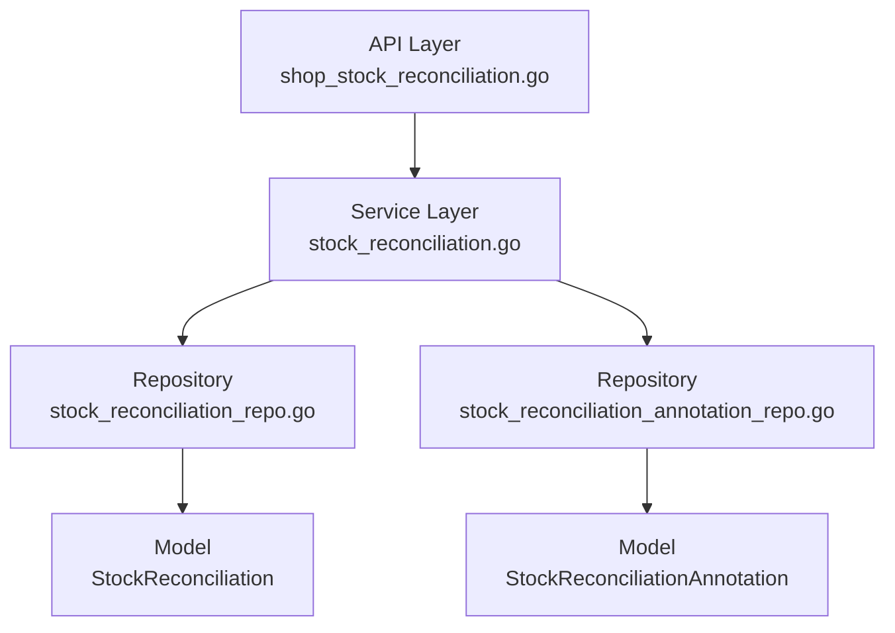

# story-shop-stocktake-review-annotation 技术设计

## 📋 概述

| 项目 | 内容 |
|------|------|
| Spec ID | story-shop-stocktake-review-annotation |
| 设计人 | xiezhihuan |
| 设计日期 | 2026-01-27 |
| 总 SP | 5 |

---

## 🔄 代码复用分析

### 可复用代码

| 文件 | 说明 | 复用方式 |
|------|------|---------|
| `main/app/service/stock_reconciliation.go` | 盘点单服务 | 扩展，添加批注相关方法 |
| `main/app/repository/stock_reconciliation_repo.go` | 盘点单仓库 | 扩展，添加状态更新方法 |
| `main/app/api/v1/shop/shop_stock_reconciliation.go` | 盘点单 API | 扩展，修改审核接口、新增接口 |
| `main/app/dto/req/stock_reconciliation.go` | 请求 DTO | 扩展，修改审核请求结构 |

### 需要新建

| 文件 | 说明 |
|------|------|
| `main/app/model/stock_reconciliation_annotation.go` | 批注模型 |
| `main/app/repository/stock_reconciliation_annotation_repo.go` | 批注仓库 |
| `main/app/dto/resp/stock_reconciliation_annotation.go` | 批注响应 DTO |
| `main/app/constant/stock_reconciliation_annotation.go` | 批注类型常量 |
| `admin/database/migrations/xxx_create_stock_reconciliation_annotation.php` | 数据库迁移 |

---

## 🏗️ 架构设计

### 架构图



### 分层说明

- **API Layer**: `main/app/api/v1/shop/shop_stock_reconciliation.go`
  - 修改 `ApproveStockReconciliation` 和 `RejectStockReconciliation`
  - 新增 `ResubmitStockReconciliation` 和 `GetAnnotationList`
- **Service Layer**: `main/app/service/stock_reconciliation.go`
  - 扩展审核方法，增加批注保存逻辑
  - 新增重新提交方法和批注查询方法
- **Repository Layer**:
  - `stock_reconciliation_repo.go` - 状态更新
  - `stock_reconciliation_annotation_repo.go` - 批注 CRUD（新建）
- **Model Layer**:
  - `stock_reconciliation_annotation.go` - 批注模型（新建）

---

## 🧩 组件和接口

### Service: StockReconciliationSrv（扩展）

**位置**: `main/app/service/stock_reconciliation.go`

**新增接口方法**:

```go
type IStockReconciliationSrv interface {
    // 现有方法...

    // 新增/修改方法
    ApproveStockReconciliation(ctx context.Context, req req.StockReconciliationApproveReq) ([]resp.DisabledMaterialsItem, error)  // 修改：支持批注
    RejectStockReconciliation(ctx context.Context, req req.StockReconciliationRejectReq) error  // 修改：支持批注
    ResubmitStockReconciliation(ctx context.Context, req req.StockReconciliationResubmitReq) error  // 新增
    GetAnnotationList(ctx context.Context, req req.StockReconciliationAnnotationListReq) (*resp.StockReconciliationAnnotationListResp, error)  // 新增
}
```

### Repository: StockReconciliationAnnotationRepo（新建）

**位置**: `main/app/repository/stock_reconciliation_annotation_repo.go`

```go
type IStockReconciliationAnnotationRepo interface {
    Create(annotation *model.StockReconciliationAnnotation) error
    GetListByStockReconciliationUuid(stockReconciliationUuid uint64) ([]*model.StockReconciliationAnnotation, error)
}
```

---

## 📊 数据模型

### Model: StockReconciliation（扩展）

**位置**: `main/app/model/stock_reconciliation.go`

**新增字段**:

| 字段 | 类型 | 说明 |
|------|------|------|
| CreatorStaffUuid | uint64 | 发起人员工UUID，创建盘点单时记录 |
| SubmitterStaffUuid | uint64 | 提交人员工UUID，提交盘点单时记录 |

### Model: StockReconciliationAnnotation（新建）

**位置**: `main/app/model/stock_reconciliation_annotation.go`

```go
type StockReconciliationAnnotation struct {
    ID                       uint64 `gorm:"primaryKey"`
    Uuid                     uint64 `gorm:"uniqueIndex"`
    StockReconciliationUuid  uint64 `gorm:"index"`
    AnnotationType           int    // 1=重新发起, 2=驳回, 3=通过
    Content                  string `gorm:"type:text"`
    CreateTime               int    `gorm:"autoCreateTime"`
    UpdateTime               int    `gorm:"autoUpdateTime"`
    DeleteTime               int    `gorm:"default:0"`
}

func (StockReconciliationAnnotation) TableName() string {
    return "ttpos_stock_reconciliation_annotation"
}
```

### Constant: 批注类型

**位置**: `main/app/constant/stock_reconciliation_annotation.go`

```go
const (
    StockReconciliationAnnotationTypeResubmit = 1  // 重新发起
    StockReconciliationAnnotationTypeReject   = 2  // 驳回
    StockReconciliationAnnotationTypeApprove  = 3  // 通过
)

var StockReconciliationAnnotationTypeNameMap = map[int]string{
    StockReconciliationAnnotationTypeResubmit: "重新发起",
    StockReconciliationAnnotationTypeReject:   "驳回",
    StockReconciliationAnnotationTypeApprove:  "通过",
}
```

---

## 🔌 API 设计

### 1. 审核通过（修改）

| 项目 | 内容 |
|------|------|
| Method | POST |
| Path | `/shop/stock_reconciliation/approve` |
| 请求 | `req.StockReconciliationApproveReq` |
| 变更 | 增加 `annotation` 字段 |

### 2. 驳回（修改）

| 项目 | 内容 |
|------|------|
| Method | POST |
| Path | `/shop/stock_reconciliation/reject` |
| 请求 | `req.StockReconciliationRejectReq` |
| 变更 | 增加 `annotation` 字段 |

### 3. 重新提交（复用保存接口）

| 项目 | 内容 |
|------|------|
| Method | POST |
| Path | `/shop/stock_reconciliation/save` |
| 请求 | `req.StockReconciliationSaveReq`（设置 `is_resubmit=true`）|
| 响应 | `{"code": 1, "message": "success", "data": {"uuid": xxx}}` |
| 说明 | 复用 SaveStockReconciliation 方法，支持修改盘点单信息后重新提交 |

**重新提交验证逻辑**:
1. 验证盘点单状态为"已驳回"
2. 验证当前用户为盘点单发起人（CreatorStaffUuid）
3. 更新盘点单信息后提交到 ERP

### 4. 盘点单详情（修改）

| 项目 | 内容 |
|------|------|
| Method | GET |
| Path | `/shop/stock_reconciliation/detail` |
| 请求 | `req.StockReconciliationDetailReq` |
| 响应 | `resp.StockReconciliationDetailResp` |
| 变更 | 响应新增 `annotations` 字段，包含批注列表（按创建时间倒序）|

**响应新增字段**:
```go
type StockReconciliationDetailResp struct {
    // ... 现有字段
    Annotations []*StockReconciliationAnnotationInfo `json:"annotations"` // 批注列表
}
```

---

## ⚠️ 风险识别

| 风险 | 影响 | 缓解措施 |
|------|------|---------|
| 状态机变更影响现有流程 | 中 | 仅扩展驳回状态的后续流转，不修改现有正向流程 |
| 批注表后续需扩展 | 低 | 表结构预留扩展性，字段命名通用 |

---

## 🧪 测试策略

**目标覆盖率**:
- main/app/service: 80%+
- main/app/repository: 70%+

**测试命令**:
```bash
cd main && go test -coverprofile=coverage.out ./app/service/...
cd main && go tool cover -html=coverage.out
```

**关键测试场景**:
1. 驳回后重新提交，状态变更为待审核
2. 批注记录正确保存（三种类型）
3. 批注历史按时间倒序返回
4. 空批注内容也保存记录

---

**版本**: v1.0.0
