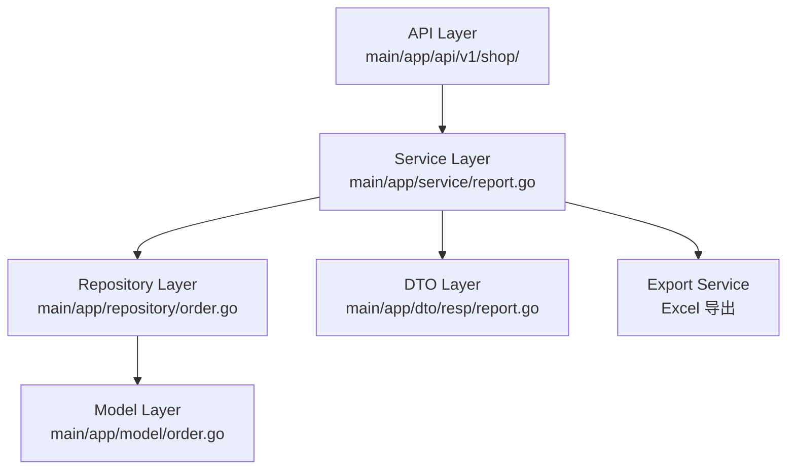

# story-shop-store-summary-fields 技术设计

## 📋 概述

| 项目 | 内容 |
|------|------|
| Spec ID | story-shop-store-summary-fields |
| 设计人 | 王昱 |
| 设计日期 | 2026-02-03 |
| 总 SP | 3 |

## 🔄 代码复用分析

### 可复用代码

| 文件 | 说明 | 复用方式 |
|------|------|---------|
| `main/app/service/report.go` | 现有报表服务 | 扩展 |
| `main/app/repository/order.go` | 订单数据访问 | 直接调用 |
| `main/app/dto/resp/report.go` | 报表响应对象 | 扩展字段 |
| 现有支付统计逻辑 | payment_method 分组统计 | 复用查询逻辑 |

### 需要修改

| 文件 | 说明 |
|------|------|
| `main/app/service/report.go` | 新增现金统计计算逻辑 |
| `main/app/dto/resp/report.go` | 新增现金统计字段、调整字段顺序 |
| 导出功能相关文件 | 同步调整导出字段 |

## 🏗️ 架构设计

### 架构图



### 分层说明

- **API Layer**: `main/app/api/v1/shop/report.go` - 门店汇总统计 HTTP Handler
- **Service Layer**: `main/app/service/report.go` - 报表业务逻辑（扩展现金统计）
- **Repository Layer**: `main/app/repository/order.go` - 订单数据查询
- **DTO Layer**: `main/app/dto/resp/report.go` - 响应对象（字段调整）

### 变更范围

```
main/app/
├── dto/resp/
│   └── report.go          # 修改：新增现金统计字段、字段重命名
├── service/
│   └── report.go          # 修改：新增现金统计计算逻辑
└── api/v1/shop/
    └── report.go          # 可能修改：导出功能字段同步
```

## 🧩 组件和接口

### Service: ReportSrv（扩展）

**位置**: `main/app/service/report.go`

**新增/修改方法**:
```go
// 门店汇总统计（扩展现金统计）
func (s *ReportSrv) GetStoreSummary(ctx context.Context, req req.StoreSummaryReq) (*resp.StoreSummaryResp, error) {
    // 1. 获取基础统计数据
    // 2. 新增：计算现金统计（CashTC, CashAmount, CashAC）
    // 3. 格式化店铺名称（编号 + 名称）
    // 4. 按新字段顺序组装响应
}

// 新增：计算现金统计
func (s *ReportSrv) calculateCashStats(orders []model.Order) (cashTC int, cashAmount decimal.Decimal, cashAC decimal.Decimal) {
    // COUNT(payment_method='Cash')
    // SUM(amount WHERE payment_method='Cash')
    // cashAC = cashAmount / cashTC (保留2位小数，除零返回0.00)
}

// 新增：格式化店铺名称
func (s *ReportSrv) formatStoreName(storeCode, storeName string) string {
    // 有编号: "{编号} {名称}"
    // 无编号: "{名称}"
}

// 新增：店铺排序
func (s *ReportSrv) sortStores(stores []StoreData) []StoreData {
    // 1. 无编号优先
    // 2. 数字(0-9)优先
    // 3. 字母(a-z)其次
}
```

## 📊 数据模型

### 响应对象调整: StoreSummaryItem

**位置**: `main/app/dto/resp/report.go`

```go
type StoreSummaryItem struct {
    // 字段顺序调整 + 重命名
    BusinessDate      string          `json:"business_date"`       // 营业日
    StoreName         string          `json:"store_name"`          // 店铺名称（原 shop_name）
    TotalRevenue      decimal.Decimal `json:"total_revenue"`       // 总营业额（原 order_amount）
    ActualAmount      decimal.Decimal `json:"actual_amount"`       // 实收金额（原 paid_amount）
    TC                int             `json:"tc"`                  // TC（原 order_count）
    AC                decimal.Decimal `json:"ac"`                  // AC（原 order_avg）

    // 新增字段
    CashTC            int             `json:"cash_tc"`             // 现金TC
    CashAmount        decimal.Decimal `json:"cash_amount"`         // 现金金额
    CashAC            decimal.Decimal `json:"cash_ac"`             // 现金AC

    // 保留字段
    DinerCount        int             `json:"diner_count"`         // 用餐人数
    TableCount        int             `json:"table_count"`         // 消费桌数
    AvgCustomerPrice  decimal.Decimal `json:"avg_customer_price"`  // 平均客单价
    OrderAvgPerPerson decimal.Decimal `json:"order_avg_per_person"`// 订单金额人均
    OrderAvgPerOrder  decimal.Decimal `json:"order_avg_per_order"` // 订单金额单均
    PaidAvgPerOrder   decimal.Decimal `json:"paid_avg_per_order"`  // 实付金额单均
    DineInAmount      decimal.Decimal `json:"dine_in_amount"`      // 点餐订单金额
    TableAmount       decimal.Decimal `json:"table_amount"`        // 桌台订单金额
    TakeoutAmount     decimal.Decimal `json:"takeout_amount"`      // 外送订单金额
}
```

### 字段映射表

| 原 JSON Key | 新 JSON Key | 原中文名 | 新中文名 |
|-------------|-------------|----------|----------|
| shop_name | store_name | 门店名称 | 店铺名称 |
| order_amount | total_revenue | 订单金额 | 总营业额 |
| paid_amount | actual_amount | 实付金额 | 实收金额 |
| order_count | tc | 订单数量（单） | TC |
| order_avg | ac | 订单金额单均 | AC |
| - | cash_tc | - | 现金TC |
| - | cash_amount | - | 现金金额 |
| - | cash_ac | - | 现金AC |

## 🔌 API 设计

### 门店汇总统计（修改现有）

| 项目 | 内容 |
|------|------|
| Method | GET |
| Path | /api/v1/shop/report/store_summary |
| 变更类型 | 响应字段调整 |

**响应变更**:
- 字段重命名（见映射表）
- 新增字段：cash_tc, cash_amount, cash_ac
- 字段顺序调整
- store_name 格式：`{编号} {名称}` 或 `{名称}`

### 导出接口（修改现有）

| 项目 | 内容 |
|------|------|
| Method | GET |
| Path | /api/v1/shop/report/store_summary/export |
| 变更类型 | 导出字段同步调整 |

**导出变更**:
- Excel 表头名称同步修改
- 新增现金统计列
- 字段顺序与页面一致

## ⚠️ 风险识别

| 风险 | 影响 | 缓解措施 |
|------|------|---------|
| API 字段重命名影响前端 | 中 | 与前端同步修改，灰度发布 |
| 现金判定逻辑不一致 | 中 | 确认 payment_method='Cash' 定义 |
| 历史导出数据字段名不一致 | 低 | 发布说明注明变更对照表 |

## 🧪 测试策略

**目标覆盖率**:
- main/app/service/report.go: 80%+

**测试重点**:
1. 现金统计计算正确性（有现金订单、无现金订单、除零场景）
2. 店铺名称格式化（有编号、无编号）
3. 店铺排序规则验证
4. 导出字段与页面一致性

**测试命令**:
```bash
cd main && go test -coverprofile=coverage.out ./app/service/...
cd main && go tool cover -html=coverage.out
```

---

**版本**: v1.0.0
**创建日期**: 2026-02-03
