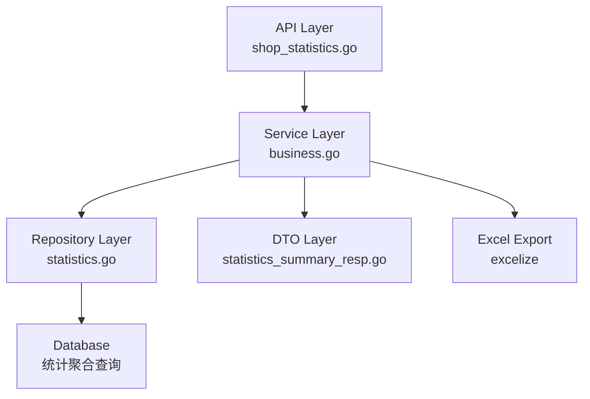

# story-shop-store-summary-metrics-enhancement 技术设计

## 📋 概述

| 项目 | 内容 |
|------|------|
| Spec ID | story-shop-store-summary-metrics-enhancement |
| 设计人 | 王昱 |
| 设计日期 | 2026-02-09 |
| 总 SP | 5 |

---

## 🔄 代码复用分析

### 可复用代码

| 文件 | 说明 | 复用方式 |
|------|------|---------|
| `main/app/service/business.go` | BusinessSrv 服务 | 扩展 CountCompanyBusinessSummary 方法 |
| `main/app/repository/statistics.go` | 统计数据仓库 | 直接调用现有聚合查询方法 |
| `main/app/dto/resp/statistics_summary_resp.go` | 响应结构体 | 扩展增加 Average 字段 |
| `main/app/service/business.go:5663+` | Excel 导出方法 | 扩展增加平均值行 |

### 需要新建

| 文件 | 说明 |
|------|------|
| 无需新建文件 | 全部在现有文件中扩展 |

### 需要修改

| 文件 | 修改内容 |
|------|---------|
| `main/app/dto/resp/statistics_summary_resp.go` | 新增 Average 结构体，扩展三个 Resp 类型 |
| `main/app/service/business.go` | 修改 CountCompanyBusinessSummary 等方法返回平均值 |
| `main/app/service/business.go` | 修改 export 方法在 Excel 末尾增加平均值行 |

---

## 🏗️ 架构设计

### 架构图



### 分层说明

- **API Layer**: `main/app/api/v1/shop/shop_statistics.go` - 无需修改，复用现有端点
- **Service Layer**: `main/app/service/business.go` - 扩展平均值计算和导出逻辑
- **Repository Layer**: `main/app/repository/statistics.go` - 无需修改，复用现有查询
- **DTO Layer**: `main/app/dto/resp/statistics_summary_resp.go` - 扩展响应结构体

### 设计决策

1. **平均值计算位置**: 在 Service 层完成，基于 Repository 返回的全量数据计算
2. **平均退款额字段**: 在每条 RefundSummaryItem 中新增字段，而非单独返回
3. **导出平均值行**: 在现有 export 方法中追加逻辑，保持单一职责

---

## 🧩 组件和接口

### Service: BusinessSrv (扩展)

**位置**: `main/app/service/business.go`

**修改方法**:

```go
// CountCompanyBusinessSummary - 扩展返回平均值
// 修改返回类型，在 Resp 中增加 Average 字段
func (s *BusinessSrv) CountCompanyBusinessSummary(ctx context.Context, req req.StatisticsCompanySummaryReq) (interface{}, error)

// countCompanyRefundSummary - 扩展计算平均退款额
// 在每条 RefundSummaryItem 中填充 AvgRefundAmount 字段
func (s *BusinessSrv) countCompanyRefundSummary(ctx context.Context, ...) (*resp.CompanyRefundSummaryResp, error)

// exportBusinessSummaryToExcel - 扩展增加平均值行
func (s *BusinessSrv) exportBusinessSummaryToExcel(file *excelize.File, sheetName string, items []resp.CompanyBusinessSummaryItem, average *resp.CompanyBusinessAverage, lang string) error

// exportRefundSummaryToExcel - 扩展增加平均值行和平均退款额列
func (s *BusinessSrv) exportRefundSummaryToExcel(file *excelize.File, sheetName string, items []resp.CompanyRefundSummaryItem, average *resp.CompanyRefundAverage, lang string) error

// exportPaymentMethodSummaryToExcel - 扩展增加平均值行
func (s *BusinessSrv) exportPaymentMethodSummaryToExcel(file *excelize.File, sheetName string, items []resp.CompanyPaymentMethodSummaryItem, average *resp.CompanyPaymentMethodAverage, lang string) error
```

---

## 📊 数据模型

### 新增结构体: Average 系列

**位置**: `main/app/dto/resp/statistics_summary_resp.go`

```go
// CompanyBusinessAverage 营业数据平均值
type CompanyBusinessAverage struct {
    OrderAmount        float64 `json:"order_amount"`         // 平均订单金额
    PayAmount          float64 `json:"pay_amount"`           // 平均实付金额
    OrderNum           float64 `json:"order_num"`            // 平均订单数量
    CashTC             float64 `json:"cash_tc"`              // 平均现金TC
    CashAmount         float64 `json:"cash_amount"`          // 平均现金金额
    CashAC             float64 `json:"cash_ac"`              // 平均现金AC
    InStoreAmount      float64 `json:"in_store_amount"`      // 平均到店业绩（新增）
    InStoreOrderNum    float64 `json:"in_store_order_num"`   // 平均到店订单数（新增）
    DeliveryAmount     float64 `json:"delivery_amount"`      // 平均外卖业绩（新增）
    DeliveryOrderNum   float64 `json:"delivery_order_num"`   // 平均外卖订单数（新增）
    MealNum            float64 `json:"meal_num"`             // 平均用餐人数
    DeskNum            float64 `json:"desk_num"`             // 平均消费桌数
    AvgCustomerPrice   float64 `json:"avg_customer_price"`   // 平均客单价的平均值
    OrderAmountMealAvg float64 `json:"order_amount_meal_avg"`// 平均人均
    OrderAmountAvg     float64 `json:"order_amount_avg"`     // 平均单均
    PayAmountAvg       float64 `json:"pay_amount_avg"`       // 平均实付单均
    InstantOrderAmount float64 `json:"instant_order_amount"` // 平均点餐订单金额
    DeskOrderAmount    float64 `json:"desk_order_amount"`    // 平均桌台订单金额
    TakeoutOrderAmount float64 `json:"takeout_order_amount"` // 平均外送订单金额
}

// CompanyRefundAverage 退款金额平均值
type CompanyRefundAverage struct {
    RefundAmount        float64 `json:"refund_amount"`         // 平均退款金额
    RefundNum           float64 `json:"refund_num"`            // 平均退款笔数
    RefundRate          float64 `json:"refund_rate"`           // 平均退款率
    AvgRefundAmount     float64 `json:"avg_refund_amount"`     // 平均退款额的平均值
    PartialRefundAmount float64 `json:"partial_refund_amount"` // 平均部分退款金额
    PartialRefundNum    float64 `json:"partial_refund_num"`    // 平均部分退款笔数
    FullRefundAmount    float64 `json:"full_refund_amount"`    // 平均整单退款金额
    FullRefundNum       float64 `json:"full_refund_num"`       // 平均整单退款笔数
}

// CompanyPaymentMethodAverage 支付方式平均值
type CompanyPaymentMethodAverage struct {
    PaymentAmount float64 `json:"payment_amount"` // 平均支付金额
    PaymentNum    float64 `json:"payment_num"`    // 平均支付笔数
    PaymentRatio  float64 `json:"payment_ratio"`  // 平均支付占比
}
```

### 扩展结构体: BusinessSummaryItem（新增业绩分类字段）

```go
// CompanyBusinessSummaryItem 扩展（位于"现金AC"列后）
type CompanyBusinessSummaryItem struct {
    // ... 现有字段（至 CashAC）
    InStoreAmount    float64 `json:"in_store_amount"`     // 新增: 到店业绩 = 堂食+外带订单金额 - 退款金额 - 反结账金额
    InStoreOrderNum  int64   `json:"in_store_order_num"`  // 新增: 到店订单数 = 堂食+外带订单数 - 整单退订单数（部分退纳入统计）
    DeliveryAmount   float64 `json:"delivery_amount"`     // 新增: 外卖业绩 = 外送+第三方外卖订单金额（不含已取消订单）
    DeliveryOrderNum int64   `json:"delivery_order_num"`  // 新增: 外卖订单数 = 外送+第三方外卖订单数（不含已取消订单）
    // ... 后续字段（MealNum 等）
}
```

### 扩展结构体: RefundSummaryItem

```go
// CompanyRefundSummaryItem 扩展
type CompanyRefundSummaryItem struct {
    // ... 现有字段
    AvgRefundAmount float64 `json:"avg_refund_amount"` // 新增: 平均退款额 = 退款金额/退款单数
}
```

### 扩展结构体: Resp 系列

```go
// CompanyBusinessSummaryResp 扩展
type CompanyBusinessSummaryResp struct {
    dto.PageResp
    List    []CompanyBusinessSummaryItem `json:"list"`
    Average *CompanyBusinessAverage      `json:"average"` // 新增: 平均值统计
}

// CompanyRefundSummaryResp 扩展
type CompanyRefundSummaryResp struct {
    dto.PageResp
    List    []CompanyRefundSummaryItem `json:"list"`
    Average *CompanyRefundAverage      `json:"average"` // 新增: 平均值统计
}

// CompanyPaymentMethodSummaryResp 扩展
type CompanyPaymentMethodSummaryResp struct {
    dto.PageResp
    List    []CompanyPaymentMethodSummaryItem `json:"list"`
    Average *CompanyPaymentMethodAverage      `json:"average"` // 新增: 平均值统计
}
```

---

## 🔌 API 设计

### 现有接口扩展

| 项目 | 内容 |
|------|------|
| Method | GET |
| Path | /shop/statistics/company/business/summary |
| 请求 | req.StatisticsCompanySummaryReq (无变更) |
| 响应 | resp.CompanyBusinessSummaryResp / CompanyRefundSummaryResp / CompanyPaymentMethodSummaryResp (扩展 Average 字段) |

### 响应示例

```json
{
  "code": 1,
  "message": "success",
  "data": {
    "page": 1,
    "page_size": 20,
    "total": 100,
    "list": [
      {
        "date": "2026-02-09",
        "company_name": "门店A",
        "refund_amount": 1000.00,
        "refund_num": 10,
        "refund_rate": 5.0,
        "avg_refund_amount": 100.00,
        "partial_refund_amount": 600.00,
        "partial_refund_num": 6,
        "full_refund_amount": 400.00,
        "full_refund_num": 4
      }
    ],
    "average": {
      "refund_amount": 850.50,
      "refund_num": 8.5,
      "refund_rate": 4.2,
      "avg_refund_amount": 95.50,
      "partial_refund_amount": 510.30,
      "partial_refund_num": 5.1,
      "full_refund_amount": 340.20,
      "full_refund_num": 3.4
    }
  }
}
```

---

## 📝 平均值计算规则

### 计算公式

```
平均值 = 该列数值总和 / 该列个数
```

### 关键规则

1. **基于筛选全量数据**: 平均值基于当前筛选条件下的全部数据计算，非当页数据
2. **平均退款额**: 每条记录的 `avg_refund_amount = refund_amount / refund_num`（除数为0时返回0）
3. **精度**: 保留2位小数，与现有金额字段一致
4. **空数据处理**: 筛选结果为空时，Average 对象各字段返回 0

### 计算时机

- 在 Service 层获取全量数据后计算
- 分页返回的 List 是当页数据，Average 是全量数据的平均值

---

## 📤 导出功能扩展

### Excel 格式调整

| Sheet | 修改内容 |
|-------|---------|
| 明细表 | 最后一行追加"平均值"记录 |
| 汇总表 | 最后一行追加"平均值"记录 |

### 营业数据表新增列

| 列名 | 英文 | 位置 | 计算公式 |
|------|------|------|----------|
| 到店业绩 | In-store Amount | 在"现金AC"后面 | DeskOrderAmountEffective + InstantOrderAmountEffective（原始金额 - 退款金额） |
| 到店订单数 | In-store Orders | 在"到店业绩"后面 | 堂食订单数 + 外带订单数 - 整单退订单数（基于 return_type=1 判断，部分退纳入统计） |
| 外卖业绩 | Delivery Amount | 在"到店订单数"后面 | 外送订单金额 + 第三方外卖订单金额（不含已取消订单） |
| 外卖订单数 | Delivery Orders | 在"外卖业绩"后面 | 外送订单数 + 第三方外卖订单数（不含已取消订单） |

### 退款表新增列

| 列名 | 英文 | 位置 |
|------|------|------|
| 平均退款额 | Average Refund Amount | 在"退款率"后面 |

### 多语言支持

需要为以下文案添加多语言翻译:
- "平均值" / "Average"
- "平均退款额" / "Average Refund Amount"
- "到店业绩" / "In-store Amount"
- "到店订单数" / "In-store Orders"
- "外卖业绩" / "Delivery Amount"
- "外卖订单数" / "Delivery Orders"

---

## ⚠️ 风险识别

| 风险 | 影响 | 缓解措施 |
|------|------|---------|
| 大数据量计算性能 | 中 | 复用现有 Repository 聚合查询，在内存中计算平均值 |
| 平均值精度问题 | 低 | 使用 decimal 库处理浮点数，统一保留2位小数 |
| 导出文件格式变化 | 低 | 平均值行使用特殊样式区分（如粗体或背景色） |

---

## 🧪 测试策略

### 目标覆盖率

- main/app/service: 80%+
- 现有测试文件: `main/app/service/business_summary_test.go`

### 测试用例

1. **平均值计算测试**
   - 正常数据计算平均值
   - 空数据返回0
   - 除数为0时返回0

2. **平均退款额测试**
   - 退款单数 > 0 时正确计算
   - 退款单数 = 0 时返回0

3. **导出测试**
   - Excel 最后一行包含平均值
   - 退款表包含平均退款额列

### 测试命令

```bash
cd main && go test -coverprofile=coverage.out ./app/service/...
cd main && go tool cover -html=coverage.out
```

---

**版本**: v1.1.0
**创建日期**: 2026-02-09
**更新日志**:
- v1.1.0 (2026-02-09): 新增业绩分类字段设计（到店业绩、到店订单数、外卖业绩、外卖订单数）
