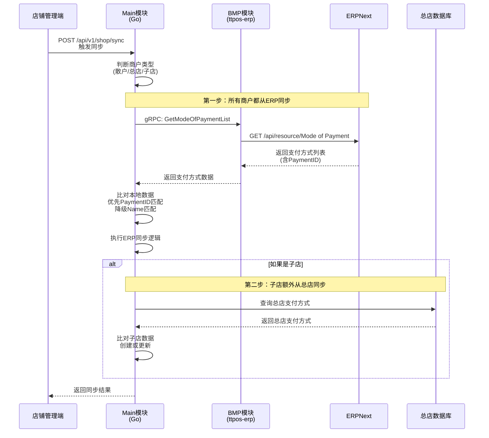
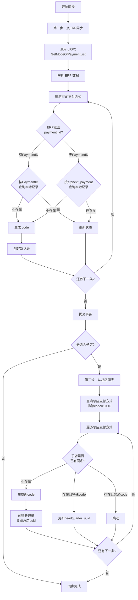

# 设计文档：散户/总店同步 ERP 支付方式

**创建时间**: 2025-12-22  
**设计层级**: story  
**关联需求**: `requirements.md`  
**涉及模块**: main (Go)  

---

## 一、技术架构

### 1.1 系统交互流程



### 1.2 模块依赖关系

```
main/app/service/payment_method.go (支付方式服务)
    ↓ 调用
main/app/service/rpc/erp/selling.go (ERP 销售模块 RPC)
    ↓ gRPC
ttpos-bmp/app/ttpos-erp/internal/logic/selling/selling.go
    ↓ ERPNext API
ERPNext Mode of Payment (支付方式主数据)
```

---

## 二、数据库设计

### 2.1 表结构分析

**表名**: `ttpos_payment_method`

**核心字段**（现有字段，无需修改）：

| 字段名 | 类型 | 说明 | 默认值 | 备注 |
|-------|------|------|--------|------|
| `id` | bigint(20) unsigned | 主键 | AUTO_INCREMENT | |
| `uuid` | bigint(20) unsigned | UUID | 生成 | 业务主键 |
| `name` | varchar(255) | 中文名称 | NOT NULL | 商户可修改 |
| `code` | int(11) | 支付方式代号 | 0 | **需自动生成** |
| `payment_name` | varchar(255) | 支付名称 | NOT NULL | ERP 名称 |
| `source` | tinyint(1) | 来源 | 0 | 0=系统 1=手动 2=连连支付 |
| `logo_file_uuid` | bigint(20) unsigned | 图标文件ID | 0 | 使用默认图标 |
| `qrcode_file_uuid` | bigint(20) unsigned | 二维码图片ID | 0 | |
| `fee_percent` | decimal(5,4) | 手续费率 | 0.0000 | |
| `is_show_cashier` | tinyint(1) | 收银机显示 | 0 | **首次=1** |
| `is_show_assistant` | tinyint(1) | 点餐助手显示 | 0 | **首次=1** |
| `is_show_kiosk` | tinyint(1) | 自助机显示 | 0 | 首次=0 |
| `is_show_member_recharge` | tinyint(1) | 充值显示 | 0 | **首次=1** |
| `status` | tinyint(1) | 状态 | 0 | **从ERP同步** |
| `sort` | int(11) | 排序 | 0 | |
| `default_img` | varchar(255) | 默认图片 | '' | 使用系统默认 |
| `erpnext_payment_id` | varchar(255) | ERP支付方式ID | '' | **优先关联字段** |
| `headquarter_uuid` | bigint(20) unsigned | 总部ID | 0 | 散户/总店=0 |

### 2.2 数据示例

**ERP 中的支付方式**（Mode of Payment）：
```json
{
  "name": "Credit Card",
  "enabled": 1,
  "payment_id": "PAY-2024-001"
}
```

**同步后 TTPOS 数据**：
```sql
INSERT INTO ttpos_payment_method (
  name, code, payment_name, source,
  logo_file_uuid, fee_percent,
  is_show_cashier, is_show_assistant, is_show_member_recharge,
  status, default_img, erpnext_payment_id, headquarter_uuid
) VALUES (
  'Credit Card', 20000, 'Credit Card', 1,
  0, 0.0000,
  1, 1, 1,
  1, '/image/pay/ja_pay.png', 'PAY-2024-001', 0
);
```

---

## 三、核心实现

### 3.1 同步流程图



### 3.2 代码结构

#### 3.2.1 新增 RPC 调用方法

**文件**: `main/app/service/rpc/erp/selling.go`

```go
// GetModeOfPaymentList 获取 ERP 支付方式列表
func (s *erpSrv) GetModeOfPaymentList(ctx context.Context, companyAbbr, branch string) ([]*selling.ModeOfPayment, error) {
	client, conn, err := NewErpSellingClient()
	if err != nil {
		return nil, errors.WithMessage(err, "创建 ERP Selling 客户端失败")
	}
	defer conn.Close()

	// 从 context 获取 site_code
	siteCode := ctx.GetCompanySetting().ErpnextSiteCode

	req := &selling.GetModeOfPaymentListReq{
		CompanyAbbr: companyAbbr,
		Branch:      branch,
	}

	result, err := client.GetModeOfPaymentList(WithSiteCode(context.Background(), siteCode), req)
	if err != nil {
		return nil, errors.WithMessage(err, "调用 ERP GetModeOfPaymentList 失败")
	}

	if result.GetCode() != "0" || result.Data == nil {
		logger.Logger.Error("GetModeOfPaymentList 失败", 
			zap.String("code", result.GetCode()), 
			zap.String("message", result.GetMessage()))
		return nil, errors.New("获取 ERP 支付方式失败: " + result.GetMessage())
	}

	response := &selling.GetModeOfPaymentListResp{}
	if err := result.Data.UnmarshalTo(response); err != nil {
		return nil, errors.WithMessage(err, "解析 ERP 响应失败")
	}

	return response.ModeOfPaymentList, nil
}
```

#### 3.2.2 实现同步逻辑

**文件**: `main/app/service/payment_method.go` (修改 SyncPaymentMethod 方法)

```go
// SyncPaymentMethod 同步支付方式
// 1. 所有商户类型（散户、总店、子店）都先从 ERP 同步支付方式
// 2. 如果是子店且 syncHeadquarterData=true，额外再从总店同步支付方式
// @param syncHeadquarterData 是否同步总部数据（仅对子店有效）
func (s *paymentMethodSrv) SyncPaymentMethod(ctx context.Context, syncHeadquarterData bool) error {
	companySetting := ctx.GetCompanySetting()

	// 第一步：所有商户都从 ERP 同步支付方式
	if err := s.syncFromERP(ctx); err != nil {
		return errors.WithMessage(err, "从 ERP 同步支付方式失败")
	}

	// 第二步：如果是子店且需要同步总部数据，额外从总店同步支付方式
	if companySetting.IsSubShop() && syncHeadquarterData {
		if err := s.syncFromHeadquarter(ctx); err != nil {
			return errors.WithMessage(err, "子店从总店同步支付方式失败")
		}
	}

	return nil
}

// 在 sync.go 中的调用

// 1. 普通同步（syncTasks）
{constant.SyncTaskTypePaymentMethod, constant.SyncTaskTypeNames[constant.SyncTaskTypePaymentMethod], 
	s.paymentMethodSrv.SyncPaymentMethod}, // 直接使用方法引用

// 2. 细粒度同步（executeGranularSync）
// 注意：细粒度同步中，支付方式同步始终执行（不受 paymentDataChecked 控制）
// paymentDataChecked 仅控制是否同步总店数据
taskItem := &model.SyncTaskItem{
	SyncTaskUuid: syncTask.Uuid,
	TaskType:     constant.SyncTaskTypePaymentMethod,
	TaskName:     constant.SyncTaskTypeNames[constant.SyncTaskTypePaymentMethod],
	Status:       constant.SyncTaskItemStatusRunning,
	StartTime:    time.Now().Unix(),
}

syncTaskItemRepo.Create(taskItem)

logger.Logger.Info("开始同步", zap.String("taskName", taskItem.TaskName))
// 细粒度同步：paymentDataChecked=true 表示用户勾选了支付数据，需要同步总部支付方式
err := s.paymentMethodSrv.SyncPaymentMethod(ctx, paymentDataChecked)
endTime := time.Now().Unix()

if err != nil {
	failCount++
	logger.Logger.Error("同步失败", zap.String("taskName", taskItem.TaskName), zap.Error(err))
	syncTaskItemRepo.Update(taskItem.Uuid, map[string]any{
		"status":        constant.SyncTaskItemStatusFailed,
		"error_message": err.Error(),
		"end_time":      endTime,
	})
} else {
	successCount++
	logger.Logger.Info("同步成功", zap.String("taskName", taskItem.TaskName))
	syncTaskItemRepo.Update(taskItem.Uuid, map[string]any{
		"status":   constant.SyncTaskItemStatusSuccess,
		"end_time": endTime,
	})
}
```

// syncFromERP 从 ERP 同步支付方式
func (s *paymentMethodSrv) syncFromERP(ctx context.Context) error {
	companySetting := ctx.GetCompanySetting()
	db := s.dbm.GetDB(companySetting.CompanyUuid)

	// 1. 获取 ERP 支付方式列表
	erpPayments, err := s.erpSrv.GetModeOfPaymentList(
		ctx,
		companySetting.ErpnextCompanyAbbr,
		companySetting.ErpnextBranch,
	)
	if err != nil {
		return errors.WithMessage(err, "获取 ERP 支付方式列表失败")
	}

	// 2. 开启事务
	tx := db.Begin()
	defer func() {
		if r := recover(); r != nil {
			tx.Rollback()
		}
	}()

	// 3. 遍历 ERP 支付方式
	for _, erpPayment := range erpPayments {
		// 4. 检查是否已存在（优先使用 PaymentID 匹配）
		var existPayment model.PaymentMethod
		var err error
		
		if erpPayment.PaymentId != "" {
			// 优先使用 PaymentID 匹配
			err = tx.Where("erpnext_payment_id = ? AND delete_time = 0", erpPayment.PaymentId).
				First(&existPayment).Error
		} else {
			// 降级使用 erpnext_payment 匹配
			err = tx.Where("erpnext_payment = ? AND delete_time = 0", erpPayment.Name).
				First(&existPayment).Error
		}

		if err == gorm.ErrRecordNotFound {
			// 首次同步：创建新记录
			if err := s.createPaymentFromERP(tx, erpPayment, companySetting.CompanyUuid); err != nil {
				tx.Rollback()
				return errors.WithMessage(err, "创建支付方式失败")
			}
		} else if err != nil {
			tx.Rollback()
			return errors.WithMessage(err, "查询支付方式失败")
		} else {
			// 后续同步：仅更新状态
			status := 0
			if erpPayment.Enabled {
				status = 1
			}
			if err := tx.Model(&model.PaymentMethod{}).
				Where("uuid = ?", existPayment.Uuid).
				Update("status", status).Error; err != nil {
				tx.Rollback()
				return errors.WithMessage(err, "更新支付方式状态失败")
			}
			logger.Logger.Info("更新支付方式状态", 
				zap.String("name", erpPayment.Name),
				zap.Int("status", status))
		}
	}

	// 5. 提交事务
	if err := tx.Commit().Error; err != nil {
		return errors.WithMessage(err, "提交事务失败")
	}

	logger.Logger.Info("从 ERP 同步支付方式完成", 
		zap.Int("total", len(erpPayments)),
		zap.Uint64("company_uuid", companySetting.CompanyUuid))

	return nil
}

// createPaymentFromERP 从 ERP 数据创建支付方式
func (s *paymentMethodSrv) createPaymentFromERP(
	tx *gorm.DB, 
	erpPayment *selling.ModeOfPayment,
	companyUuid uint64,
) error {
	// 1. 生成 code（从 20000 开始）
	code, err := s.generatePaymentCode(tx)
	if err != nil {
		return errors.WithMessage(err, "生成 code 失败")
	}

	// 2. 确定状态
	status := 0
	if erpPayment.Enabled {
		status = 1
	}

	// 3. 创建支付方式
	newPayment := model.PaymentMethod{
		Name:                   erpPayment.Name,
		Code:                   code,
		PaymentName:            erpPayment.Name,
		Source:                 model.PaymentSourceDefault, // 1=手动添加
		LogoFileUuid:           0,                         // 使用默认图标
		QrcodeFileUuid:         0,
		FeePercent:             0.0000,
		IsShowCashier:          1, // 收银机显示
		IsShowAssistant:        1, // 点餐助手显示
		IsShowKiosk:            0, // 自助机不显示
		IsShowMemberRecharge:   1, // 充值显示
		Status:                 status,
		Sort:                   0,
		DefaultImg:             "/image/pay/ja_pay.png", // 使用默认图标
		ErpnextPaymentId:       erpPayment.PaymentId,    // 保存 ERP PaymentID
		HeadquarterUuid:        0,                       // 散户/总店/子店=0
	}
	newPayment.Uuid = utils.GenerateUuid()
	newPayment.SetCreate()

	if err := tx.Create(&newPayment).Error; err != nil {
		return errors.WithMessage(err, "插入支付方式失败")
	}

	logger.Logger.Info("创建支付方式成功", 
		zap.String("name", erpPayment.Name),
		zap.String("payment_id", erpPayment.PaymentId),
		zap.Int("code", code),
		zap.Uint64("uuid", newPayment.Uuid))

	return nil
}

// generatePaymentCode 生成下一个可用的 code
func (s *paymentMethodSrv) generatePaymentCode(tx *gorm.DB) (int, error) {
	var maxCode int
	err := tx.Model(&model.PaymentMethod{}).
		Select("COALESCE(MAX(code), 49999)").
		Where("delete_time = 0").
		Scan(&maxCode).Error
	
	if err != nil {
		return 0, err
	}

	// 从 20000 开始，避免与系统保留 code 冲突
	nextCode := maxCode + 1
	if nextCode < 20000 {
		nextCode = 20000
	}

	return nextCode, nil
}

// syncFromHeadquarter 子店从总店同步支付方式
func (s *paymentMethodSrv) syncFromHeadquarter(ctx context.Context) error {
	companySetting := ctx.GetCompanySetting()
	headquarterDB := s.dbm.GetDB(companySetting.HeadquarterUuid)
	subShopDB := s.dbm.GetDB(companySetting.CompanyUuid)
	headquarterUuid := companySetting.HeadquarterUuid

	logger.Logger.Info("开始从总店同步支付方式",
		zap.Uint64("sub_shop_uuid", companySetting.CompanyUuid),
		zap.Uint64("headquarter_uuid", headquarterUuid))

	// 查询总部支付方式（排除 code=40 和 code=10）
	var hqPayments []model.PaymentMethod
	err := headquarterDB.Where("delete_time = 0 AND headquarter_uuid = 0").
		Where("code NOT IN (?)", []int{model.PaymentMethodCash, model.PaymentMethodBalance}).
		Find(&hqPayments).Error
	if err != nil {
		return errors.WithMessage(err, "查询总部支付方式失败")
	}

	// 特殊code列表（不跳过，只更新headquarter_uuid）
	specialCodes := map[int]bool{
		model.PaymentCodeLianlianWechat:      true, // 90111
		model.PaymentCodeLianlianAli:         true, // 90222
		model.PaymentCodeLianlianQrPromptPay: true, // 90333
	}

	var createdCount, updatedCount, skippedCount int
	for _, hqPayment := range hqPayments {
		// 检查分店是否已有同名支付方式（payment_name）
		var existPayment model.PaymentMethod
		err := subShopDB.Where("payment_name = ? and source = ? AND delete_time = 0", hqPayment.PaymentName, model.PaymentSourceDefault).
			First(&existPayment).Error

		if err == nil {
			// 分店已有同名支付方式
			if specialCodes[existPayment.Code] {
				// 特殊code：只更新 headquarter_uuid
				err = subShopDB.Model(&model.PaymentMethod{}).Where("id = ?", existPayment.ID).Update("headquarter_uuid", headquarterUuid).Error
				if err != nil {
					logger.Logger.Error("更新支付方式headquarter_uuid失败",
						zap.String("name", hqPayment.PaymentName),
						zap.Int("code", existPayment.Code),
						zap.Error(err))
				} else {
					logger.Logger.Info("更新支付方式headquarter_uuid",
						zap.String("name", hqPayment.PaymentName),
						zap.Int("code", existPayment.Code))
					updatedCount++
				}
			} else {
				// 普通code：跳过
				logger.Logger.Info("支付方式已存在，跳过同步",
					zap.String("name", hqPayment.PaymentName),
					zap.Int("code", existPayment.Code))
				skippedCount++
			}
			continue
		}

		// 分店不存在，创建新支付方式
		newCode := s.generatePaymentCode(subShopDB)

		newPayment := model.PaymentMethod{
			HeadquarterUuid: headquarterUuid,
			PaymentName:     hqPayment.PaymentName,
			Name:            hqPayment.Name,
			Code:            newCode,                    // 生成新code
			Source:          model.PaymentSourceDefault, // 1-手动添加
			LogoFileUuid:    0,                          // 固定为0
			Sort:            hqPayment.Sort,             // 排序
			Status:          hqPayment.Status,           // 同步状态
		}

		err = subShopDB.Create(&newPayment).Error
		if err != nil {
			logger.Logger.Error("创建支付方式失败",
				zap.String("name", hqPayment.PaymentName),
				zap.Error(err))
			continue
		}

		logger.Logger.Info("从总店创建新支付方式",
			zap.String("name", hqPayment.PaymentName),
			zap.Int("code", newCode))
		createdCount++
	}

	logger.Logger.Info("从总店同步支付方式完成",
		zap.Int("total", len(hqPayments)),
		zap.Int("created", createdCount),
		zap.Int("updated", updatedCount),
		zap.Int("skipped", skippedCount))

	return nil
}
```

---

## 四、错误处理

### 4.1 异常场景处理

| 场景 | 处理策略 | 日志级别 |
|-----|---------|---------|
| ERP 服务不可用 | 返回错误，不影响其他功能 | Error |
| ERP 返回数据为空 | 视为正常，记录日志 | Info |
| ERP 未返回 PaymentID | 降级使用 erpnext_payment 匹配 | Info |
| Code 生成冲突 | 重试 3 次，仍失败则返回错误 | Error |
| 事务提交失败 | 回滚，返回错误 | Error |
| 部分数据异常 | 跳过该条，继续处理其他 | Warn |

### 4.2 日志记录

```go
// 成功日志
logger.Logger.Info("从 ERP 同步支付方式完成", 
	zap.Int("total", len(erpPayments)),
	zap.Uint64("company_uuid", companySetting.CompanyUuid))

// 错误日志
logger.Logger.Error("获取 ERP 支付方式失败", 
	zap.String("company_abbr", companySetting.ErpnextCompanyAbbr),
	zap.Error(err))

// 跳过日志
logger.Logger.Warn("ERP 未返回 PaymentID，使用 Name 匹配", 
	zap.String("name", erpPayment.Name))
```

---

## 五、性能优化

### 5.1 批量处理

- 单次最多同步 100 条
- 使用事务保证原子性
- 避免 N+1 查询问题

### 5.2 缓存策略

- 不缓存支付方式数据（数据量小且不频繁变更）
- ERP 调用失败后不重试（避免雪崩）

---

## 六、测试要点

### 6.1 单元测试

**测试文件**: `main/app/service/payment_method_test.go`

```go
func TestSyncPaymentMethodFromERP(t *testing.T) {
	// 测试首次同步
	t.Run("首次同步-创建新记录", func(t *testing.T) {
		// Mock ERP 返回数据
		// 验证创建的支付方式字段正确
	})

	// 测试后续同步
	t.Run("后续同步-仅更新状态", func(t *testing.T) {
		// Mock 已存在的支付方式
		// 验证仅更新 status 字段
	})

	// 测试 code 生成
	t.Run("Code生成-从20000开始", func(t *testing.T) {
		// 验证生成的 code >= 20000
	})

	// 测试 PaymentID 优先匹配
	t.Run("优先使用PaymentID匹配", func(t *testing.T) {
		// Mock ERP 返回 PaymentID
		// 验证使用 erpnext_payment_id 匹配
	})

	// 测试 erpnext_payment 降级匹配
	t.Run("降级使用erpnext_payment匹配", func(t *testing.T) {
		// Mock ERP 未返回 PaymentID
		// 验证使用 erpnext_payment 匹配
	})
}
```

### 6.2 集成测试

**测试场景**：

1. **散户同步**
   - 验证从 ERP 获取数据
   - 验证创建支付方式成功

2. **总店同步**
   - 验证从 ERP 获取数据
   - 验证创建支付方式成功

3. **子店同步**
   - 验证从 ERP 获取数据
   - 验证创建支付方式成功

4. **ERP 服务异常**
   - 模拟 ERP 不可用
   - 验证错误处理

5. **PaymentID 匹配**
   - ERP 返回 PaymentID
   - 验证使用 erpnext_payment_id 匹配

6. **erpnext_payment 降级匹配**
   - ERP 未返回 PaymentID
   - 验证使用 erpnext_payment 匹配

### 6.3 手动测试

**测试步骤**：

1. 在 ERP 中创建新支付方式 "Test Payment"，并设置 PaymentID = "PAY-TEST-001"
2. 在 TTPOS 中触发同步（调用 `/api/v1/shop/sync`）
3. 验证数据库中生成新记录
4. 验证字段值符合预期（`is_show_cashier=1`, `fee_percent=0`, `erpnext_payment_id='PAY-TEST-001'` 等）
5. 在 ERP 中禁用该支付方式
6. 再次触发同步
7. 验证 TTPOS 中 `status=0`
8. 验证其他字段未被修改
9. 测试无 PaymentID 的情况：在 ERP 中创建 "Test Payment 2" 但不设置 PaymentID
10. 验证使用 name 字段进行匹配

---

## 七、部署注意事项

### 7.1 数据库迁移

**无需执行**，使用现有表结构。

### 7.2 配置检查

确保商户配置了 ERP 集成：
- `erpnext_site_code` 不为空
- `erpnext_company_abbr` 不为空
- `erpnext_branch` 不为空

### 7.3 回滚方案

如需回滚，删除 `erpnext_payment_id` 字段非空的记录：

```sql
DELETE FROM ttpos_payment_method 
WHERE erpnext_payment_id != '' 
AND code >= 20000;
```

---

## 八、监控指标

### 8.1 关键指标

- ERP 调用成功率（>99%）
- 同步耗时（<5s）
- 创建支付方式数量
- 更新支付方式数量

### 8.2 告警规则

- ERP 调用失败率 >1% 时告警
- 同步耗时 >10s 时告警
- Code 生成冲突时告警

---

## 九、相关资源

### 9.1 参考文档

- ERPNext Mode of Payment API: https://frappeframework.com/docs
- gRPC Protobuf: `ttpos-bmp/app/ttpos-erp/manifest/protobuf/selling/selling.proto`

### 9.2 代码位置

- `main/app/service/payment_method.go` - 支付方式服务
- `main/app/service/rpc/erp/selling.go` - ERP RPC 调用
- `main/app/model/payment_order.go` - PaymentMethod 模型
- `ttpos-bmp/app/ttpos-erp/internal/logic/selling/selling.go` - ERP 业务逻辑

---

**设计审核人**：待审核  
**最后更新**：2025-12-22
