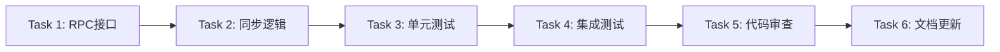

# 任务清单：散户/总店同步 ERP 支付方式

**创建时间**: 2025-12-22  
**预估工作量**: 5 Story Points  
**优先级**: 中  

---

## 任务分解

### Task 1: 新增 ERP RPC 调用接口 ✅

**预估时间**: 1h  
**文件**: `main/app/service/rpc/erp/selling.go`

**任务内容**：
- [ ] 新增 `GetModeOfPaymentList` 方法
- [ ] 处理 gRPC 调用和错误处理
- [ ] 解析 ERP 响应数据
- [ ] 添加日志记录

**验收标准**：
- ✅ 能够成功调用 `ttpos-bmp` 的 `GetModeOfPaymentList` 接口
- ✅ 错误处理完善（连接失败、超时、返回错误码）
- ✅ 日志记录清晰（包含请求参数和响应）

**代码片段**：
```go
// GetModeOfPaymentList 获取 ERP 支付方式列表
func (s *erpSrv) GetModeOfPaymentList(ctx context.Context, companyAbbr, branch string) ([]*selling.ModeOfPayment, error) {
	// 实现见 design.md
}
```

---

### Task 2: 实现从 ERP 同步支付方式的核心逻辑 🔥

**预估时间**: 3h  
**文件**: `main/app/service/payment_method.go`

**任务内容**：
- [ ] 修改 `SyncPaymentMethod` 方法，增加商户类型判断
- [ ] 实现 `syncFromERP` 方法（散户/总店从 ERP 同步）
- [ ] 实现 `createPaymentFromERP` 方法（首次同步逻辑）
- [ ] 实现 `generatePaymentCode` 方法（自动生成 code）
- [ ] 实现 `isReservedPaymentName` 方法（过滤保留名称）
- [ ] 保留原有 `syncFromHeadquarter` 方法（子店从总店同步）

**验收标准**：
- ✅ 散户/总店能从 ERP 同步支付方式
- ✅ 首次同步时正确创建新记录（字段符合需求）
- ✅ 后续同步时仅更新 `status` 字段
- ✅ Code 自动生成且不重复（从 20000 开始）
- ✅ 跳过系统保留的支付方式（Cash, Balance 等）
- ✅ 使用事务保证原子性
- ✅ 子店仍走原有逻辑（从总店同步）

**关键代码位置**：
```go
// 文件：main/app/service/payment_method.go

// 修改此方法（第 744 行）
func (s *paymentMethodSrv) SyncPaymentMethod(ctx context.Context) error {
	companySetting := ctx.GetCompanySetting()
	
	// 新增：散户/总店从 ERP 同步
	if companySetting.IsHeadquarter() || companySetting.IsTtposSite() {
		return s.syncFromERP(ctx)
	}
	
	// 原有：子店从总店同步
	return s.syncFromHeadquarter(ctx)
}

// 新增方法
func (s *paymentMethodSrv) syncFromERP(ctx context.Context) error { ... }
func (s *paymentMethodSrv) createPaymentFromERP(tx *gorm.DB, erpPayment *selling.ModeOfPayment, companyUuid uint64) error { ... }
func (s *paymentMethodSrv) generatePaymentCode(tx *gorm.DB) (int, error) { ... }
func (s *paymentMethodSrv) isReservedPaymentName(name string) bool { ... }

// 重构原有代码为独立方法（保持逻辑不变）
func (s *paymentMethodSrv) syncFromHeadquarter(ctx context.Context) error {
	// 原 SyncPaymentMethod 第 754-828 行代码移到这里
}
```

**依赖服务**：
- `s.erpSrv.GetModeOfPaymentList()` - Task 1 的成果

---

### Task 3: 单元测试 🧪

**预估时间**: 2h  
**文件**: `main/app/service/payment_method_test.go`

**任务内容**：
- [ ] 测试首次同步（创建新记录）
- [ ] 测试后续同步（仅更新状态）
- [ ] 测试 Code 生成逻辑
- [ ] 测试保留名称过滤
- [ ] 测试事务回滚
- [ ] 测试 ERP 服务异常情况

**验收标准**：
- ✅ 测试覆盖率 >80%
- ✅ 所有测试用例通过
- ✅ Mock ERP 服务调用

**测试用例**：
```go
func TestSyncPaymentMethodFromERP(t *testing.T) {
	t.Run("首次同步-创建新记录", func(t *testing.T) { ... })
	t.Run("后续同步-仅更新状态", func(t *testing.T) { ... })
	t.Run("Code生成-从20000开始", func(t *testing.T) { ... })
	t.Run("跳过系统保留支付方式", func(t *testing.T) { ... })
	t.Run("ERP服务异常-返回错误", func(t *testing.T) { ... })
	t.Run("事务失败-正确回滚", func(t *testing.T) { ... })
}
```

---

### Task 4: 集成测试与验证 🔍

**预估时间**: 1.5h  
**环境**: 开发环境 + ERP 测试站点

**任务内容**：
- [ ] 在 ERP 中创建测试支付方式
- [ ] 触发 TTPOS 同步接口
- [ ] 验证数据库记录正确
- [ ] 修改 ERP 支付方式状态
- [ ] 再次同步验证状态更新
- [ ] 测试子店同步是否受影响

**验收标准**：
- ✅ 散户能成功从 ERP 同步
- ✅ 总店能成功从 ERP 同步
- ✅ 首次同步字段值正确
  - `is_show_cashier=1`
  - `is_show_assistant=1`
  - `is_show_kiosk=0`
  - `is_show_member_recharge=1`
  - `fee_percent=0.0000`
  - `erpnext_payment=ERP名称`
- ✅ 后续同步仅更新 `status`
- ✅ Code 唯一且不重复
- ✅ 子店同步逻辑不受影响

**测试数据**：
```sql
-- 验证首次同步
SELECT * FROM ttpos_payment_method 
WHERE erpnext_payment = 'Test Payment'
AND code >= 20000;

-- 验证状态同步
SELECT uuid, name, status, erpnext_payment 
FROM ttpos_payment_method 
WHERE erpnext_payment != '';
```

---

### Task 5: 代码审查与优化 📝

**预估时间**: 0.5h

**任务内容**：
- [ ] 代码格式化（`gofmt`）
- [ ] 静态检查（`golangci-lint`）
- [ ] 代码审查（Peer Review）
- [ ] 性能优化（如有必要）
- [ ] 日志补充完善

**验收标准**：
- ✅ 通过所有代码检查
- ✅ 无明显性能问题
- ✅ 日志清晰易追踪

---

### Task 6: 文档更新 📚

**预估时间**: 0.5h

**任务内容**：
- [ ] 更新 API 文档（如有新增接口）
- [ ] 更新 troubleshooting 文档
- [ ] 补充常见问题（FAQ）

**验收标准**：
- ✅ 文档清晰完整
- ✅ 包含错误处理说明

**文档位置**：
- `docs/shared/troubleshooting/payment-method-sync.md`（如需创建）

---

## 任务依赖关系



---

## 风险与注意事项

### 🔴 高风险

1. **ERP 服务依赖**
   - 风险：ERP 服务不稳定导致同步失败
   - 缓解：增加超时和重试机制，友好错误提示

2. **Code 冲突**
   - 风险：并发同步导致 Code 重复
   - 缓解：使用数据库事务和唯一索引

### 🟡 中风险

1. **子店同步影响**
   - 风险：修改 `SyncPaymentMethod` 影响子店逻辑
   - 缓解：保留原有子店同步逻辑，充分测试

2. **数据量大**
   - 风险：ERP 支付方式过多导致同步慢
   - 缓解：限制单次最多 100 条

### 🟢 低风险

1. **字段映射错误**
   - 风险：ERP 字段与 TTPOS 字段映射错误
   - 缓解：详细测试和代码审查

---

## 测试检查清单

### 功能测试
- [ ] 散户首次同步成功
- [ ] 散户后续同步仅更新状态
- [ ] 总店首次同步成功
- [ ] 总店后续同步仅更新状态
- [ ] 子店仍从总店同步（不受影响）
- [ ] 跳过系统保留支付方式（Cash, Balance 等）
- [ ] Code 自动生成且唯一（>=20000）
- [ ] erpnext_payment 字段正确关联

### 字段验证
- [ ] `name` = ERP 名称
- [ ] `payment_name` = ERP 名称
- [ ] `code` >= 20000 且唯一
- [ ] `source` = 0（系统默认）
- [ ] `logo_file_uuid` = 0
- [ ] `fee_percent` = 0.0000
- [ ] `is_show_cashier` = 1（首次）
- [ ] `is_show_assistant` = 1（首次）
- [ ] `is_show_kiosk` = 0（首次）
- [ ] `is_show_member_recharge` = 1（首次）
- [ ] `status` = ERP.enabled（0/1）
- [ ] `erpnext_payment` = ERP 名称
- [ ] `headquarter_uuid` = 0

### 异常测试
- [ ] ERP 服务不可用时返回友好错误
- [ ] ERP 返回空数据时不报错
- [ ] 事务失败时正确回滚
- [ ] 部分数据异常时跳过并记录日志

### 性能测试
- [ ] 同步 10 条支付方式耗时 <2s
- [ ] 同步 100 条支付方式耗时 <5s
- [ ] 并发同步不产生 Code 冲突

---

## 完成标准

### 功能完成
- ✅ 所有任务完成并通过验收
- ✅ 单元测试覆盖率 >80%
- ✅ 集成测试全部通过

### 代码质量
- ✅ 通过代码审查
- ✅ 无 lint 错误
- ✅ 日志清晰完整

### 文档完整
- ✅ 需求、设计、任务文档齐全
- ✅ 代码注释清晰
- ✅ Troubleshooting 文档更新

### 部署验证
- ✅ 在测试环境验证成功
- ✅ 数据迁移（无需执行）
- ✅ 回滚方案清晰

---

## 开发顺序建议

**Day 1**:
1. Task 1: RPC 接口（1h）
2. Task 2: 同步逻辑（3h）

**Day 2**:
1. Task 3: 单元测试（2h）
2. Task 4: 集成测试（1.5h）
3. Task 5: 代码审查（0.5h）
4. Task 6: 文档更新（0.5h）

**总计**: 约 8.5 小时（约 1 个工作日）

---

**创建人**: AI Assistant  
**审核人**: 待审核  
**开始日期**: 待定  
**预计完成**: 待定
