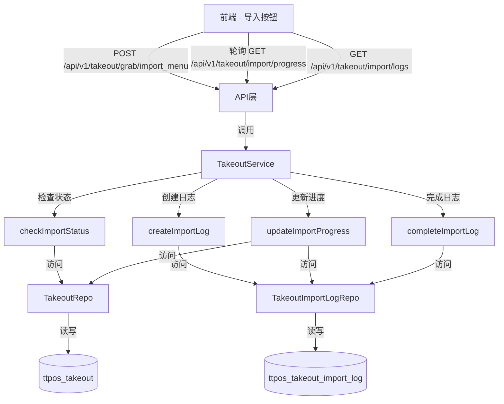
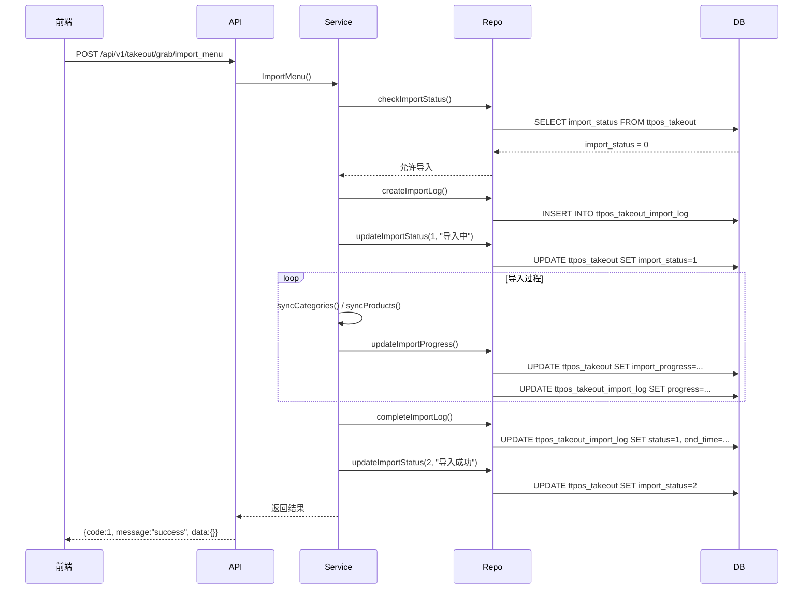
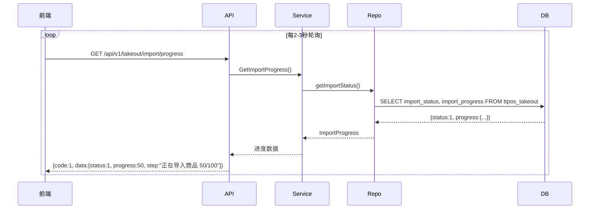

# 外卖菜单导入进度条显示 设计文档

> 本文档定义 外卖菜单导入进度条显示功能的技术设计和实现方案。

## 📋 概述

本设计旨在为外卖菜单导入功能添加实时进度反馈机制,通过数据库状态管理、历史日志记录、后端进度更新、前端轮询展示等措施,让用户能够实时了解导入进度,避免重复操作,提升用户体验。

**核心功能**:
1. 导入状态管理(防止并发导入)
2. 导入进度实时更新(当前步骤、百分比、预估时间)
3. 导入历史日志记录(完整的导入历史追溯)
4. 前端进度展示(进度对话框 + 历史日志列表)

---

## 🎯 规范对齐

### Go Main 规范 (go-main.mdc)

本设计严格遵循 Go Main 开发规范:

- ✅ **分层设计**: API → Service → Repository 三层架构
- ✅ **依赖管理**: Service 只依赖其他 Service 接口,不直接依赖 Repository
- ✅ **接口命名**: 接口以 `I` 开头,实现以小写字母开头
- ✅ **Repository 约束**: 只持有 `db *gorm.DB`,不持有 DBManager
- ✅ **错误处理**: 不使用 panic,返回 error,使用 `errors.WithMessage` 包装
- ✅ **URL 命名**: 使用 snake_case(如 `/api/v1/takeout/import/progress`)

### API 设计规范 (api.mdc)

- ✅ **响应格式**: `{code, message, data{}}`
- ✅ **data 字段**: 必须是对象,不能是 null 或数组
- ✅ **分页信息**: 放在 meta 中
- ✅ **错误处理**: 统一错误码和错误信息
- ✅ **国际化**: 支持 10 种语言

### 数据库规范 (database.mdc)

- ✅ **必需字段**: id, uuid, create_time, update_time, delete_time
- ✅ **时间字段**: 使用 int 类型,\_time 结尾,默认值 0
- ✅ **UUID 字段**: 使用 bigint unsigned
- ✅ **表名**: 使用 ttpos\_ 前缀
- ✅ **字段名**: 使用 snake_case
- ✅ **软删除**: 使用 delete_time 标记

### Vue 规范 (vue.mdc)

- ✅ **框架**: Vue 3 + TypeScript + Vite
- ✅ **组件库**: Element Plus
- ✅ **API**: Composition API
- ✅ **命名**: PascalCase(组件), camelCase(变量和方法)

---

## 🔄 代码复用分析

### 可复用的现有组件

1. **TakeoutService**: `main/app/service/takeout.go`
   - 复用: 现有的 `ImportMenu` 方法框架
   - 扩展: 添加状态检查、进度更新、日志记录逻辑

2. **Takeout Model**: `main/app/modules/takeout/domain/model/takeout.go`
   - 扩展: 添加进度相关字段

3. **Repository 基类**: `main/app/repository/common_repo.go`
   - 复用: DBOption 选项模式

4. **Element Plus 组件**:
   - 复用: `ElProgress` 进度条组件
   - 复用: `ElTimeline` 时间线组件
   - 复用: `ElDialog` 对话框组件

### 集成点

1. **数据库扩展**
   - 扩展 `ttpos_takeout` 表: 添加 5 个进度相关字段
   - 新建 `ttpos_takeout_import_log` 表: 记录历史日志

2. **Service 层扩展**
   - 修改 `TakeoutService.ImportMenu` 方法
   - 新增进度管理方法
   - 新增日志记录方法

3. **API 层新增**
   - `GET /api/v1/takeout/import/progress` - 查询当前进度
   - `GET /api/v1/takeout/import/logs` - 查询历史日志

4. **前端页面**
   - 新增: 进度对话框组件
   - 新增: 历史日志列表页面

---

## 🏗️ 架构设计

### 分层设计原则

**Go Main 三层架构**:

```
API 层 (shop_takeout.go)
  ↓ 调用
Service 层 (takeout_srv.go)
  ↓ 依赖
Repository 层 (takeout_repo.go, takeout_import_log_repo.go)
  ↓ 访问
Database (ttpos_takeout, ttpos_takeout_import_log)
```

**依赖规则**:

- ✅ API 层调用 Service 层接口
- ✅ Service 层依赖其他 Service 接口
- ✅ Service 层通过 Repository 访问数据库
- ❌ Service 层不能直接依赖 Repository(通过 DBManager 获取)
- ❌ 禁止跨层调用

### 架构图



### 时序图 - 导入流程



### 时序图 - 进度查询



### 模块划分

#### Go Main 模块

- **API 层**: `main/app/api/shop/takeout.go`
  - 路由处理、参数校验
  - 新增: `GetImportProgress`, `GetImportLogs`

- **Service 层**: `main/app/service/takeout.go`
  - 业务逻辑、事务管理
  - 扩展: `ImportMenu`, 新增进度管理方法

- **Repository 层**:
  - `main/app/repository/takeout_repo.go` - ttpos_takeout 表操作
  - `main/app/repository/takeout_import_log_repo.go` - ttpos_takeout_import_log 表操作(新增)

- **Model 层**:
  - `main/app/modules/takeout/domain/model/takeout.go` - 扩展字段
  - `main/app/model/takeout_import_log.go` - 新增模型

- **DTO 层**:
  - `main/app/dto/resp/takeout_resp.go` - 新增进度和日志响应 DTO

#### Vue 前端模块

- **Components**: `admin/views/shop/components/takeout/`
  - `ImportProgressDialog.vue` - 进度对话框组件(新增)
  - `ImportLogList.vue` - 日志列表组件(新增)

- **Pages**: `admin/views/shop/pages/takeout/`
  - `import.vue` - 导入页面(修改)
  - `logs.vue` - 日志列表页面(新增)

- **API**: `admin/views/shop/api/takeout.ts`
  - 新增: `getImportProgress`, `getImportLogs`

---

## 🗄️ 数据库设计

### 数据表设计

#### 表 1: ttpos_takeout (扩展)

**新增字段**:

```sql
ALTER TABLE `ttpos_takeout`
ADD COLUMN `import_status` tinyint NOT NULL DEFAULT 0 COMMENT '导入状态(0-未导入 1-导入中 2-导入成功 3-导入失败)' AFTER `menu`,
ADD COLUMN `import_progress` json COMMENT '导入进度(JSON格式)' AFTER `import_status`,
ADD COLUMN `import_start_time` int NOT NULL DEFAULT 0 COMMENT '导入开始时间' AFTER `import_progress`,
ADD COLUMN `import_end_time` int NOT NULL DEFAULT 0 COMMENT '导入结束时间' AFTER `import_start_time`,
ADD COLUMN `import_error` text COMMENT '导入错误信息' AFTER `import_end_time`,
ADD INDEX `idx_import_status` (`import_status`);
```

**字段说明**:
| 字段 | 类型 | 说明 | 约束 |
|------|------|------|------|
| import_status | tinyint | 导入状态 | 0-未导入, 1-导入中, 2-成功, 3-失败 |

```

**迁移文件**: `admin/database/migrations/{YYYYMMDDHHMMSS}_add_import_status_to_ttpos_takeout.php`

#### 表 2: ttpos_takeout_import_log (新建)

```sql
CREATE TABLE IF NOT EXISTS `ttpos_takeout_import_log` (
    `id` bigint unsigned NOT NULL AUTO_INCREMENT COMMENT '主键ID',
    `uuid` bigint unsigned NOT NULL DEFAULT 0 COMMENT '唯一标识',
    `platform` varchar(50) NOT NULL DEFAULT '' COMMENT '外卖平台(grab/lineman等)',
    `import_type` tinyint NOT NULL DEFAULT 0 COMMENT '导入类型(1-TTPOS推送到平台 2-平台推送到TTPOS)',
    `import_direction` varchar(200) NOT NULL DEFAULT '' COMMENT '导入方向描述',
    `status` tinyint NOT NULL DEFAULT 0 COMMENT '导入状态(0-进行中 1-成功 2-失败)',
    `progress` int NOT NULL DEFAULT 0 COMMENT '进度百分比(0-100)',
    `success_count` int NOT NULL DEFAULT 0 COMMENT '成功数量',
    `failure_count` int NOT NULL DEFAULT 0 COMMENT '失败数量',
    `total_count` int NOT NULL DEFAULT 0 COMMENT '总数量',
    `error_message` text COMMENT '错误信息',
    `start_time` int NOT NULL DEFAULT 0 COMMENT '开始时间',
    `end_time` int NOT NULL DEFAULT 0 COMMENT '结束时间',
    `duration` int NOT NULL DEFAULT 0 COMMENT '耗时(秒)',
    `create_time` int NOT NULL DEFAULT 0 COMMENT '创建时间',
    `update_time` int NOT NULL DEFAULT 0 COMMENT '更新时间',
    `delete_time` int NOT NULL DEFAULT 0 COMMENT '删除时间',
    PRIMARY KEY (`id`),
    UNIQUE KEY `uk_uuid` (`uuid`),
    KEY `idx_platform` (`platform`),
    KEY `idx_import_type` (`import_type`),
    KEY `idx_status` (`status`),
    KEY `idx_create_time` (`create_time`),
    KEY `idx_delete_time` (`delete_time`)
) ENGINE=InnoDB DEFAULT CHARSET=utf8mb4 COMMENT='外卖导入日志表';
```

**字段说明**:
| 字段 | 类型 | 说明 | 约束 |
|------|------|------|------|
| id | bigint unsigned | 主键 ID | AUTO_INCREMENT |
| uuid | bigint unsigned | 唯一标识 | DEFAULT 0, UNIQUE |
| platform | varchar(50) | 外卖平台 | grab/lineman等 |
| import_type | tinyint | 导入类型 | 1-推送到平台, 2-从平台导入 |
| import_direction | varchar(200) | 导入方向描述 | 用于UI展示 |
| status | tinyint | 导入状态 | 0-进行中, 1-成功, 2-失败 |
| progress | int | 进度百分比 | 0-100 |
| success_count | int | 成功数量 | 导入成功的商品数量 |
| failure_count | int | 失败数量 | 导入失败的商品数量 |
| total_count | int | 总数量 | 总商品数量 |
| error_message | text | 错误信息 | 失败时记录错误详情 |
| start_time | int | 开始时间 | Unix 时间戳 |
| end_time | int | 结束时间 | Unix 时间戳 |
| duration | int | 耗时 | 单位:秒 |
| create_time | int | 创建时间 | DEFAULT 0 |
| update_time | int | 更新时间 | DEFAULT 0 |
| delete_time | int | 删除时间 | DEFAULT 0, 软删除标记 |

**索引设计**:

- 主键索引: `PRIMARY KEY (id)`
- 唯一索引: `UNIQUE KEY uk_uuid (uuid)`
- 普通索引: `KEY idx_platform (platform)` - 按平台筛选
- 普通索引: `KEY idx_import_type (import_type)` - 按导入类型筛选
- 普通索引: `KEY idx_status (status)` - 按状态筛选
- 普通索引: `KEY idx_create_time (create_time)` - 按时间排序
- 普通索引: `KEY idx_delete_time (delete_time)` - 软删除查询

**迁移文件**: `admin/database/migrations/{YYYYMMDDHHMMSS}_create_ttpos_takeout_import_log_table.php`

---

## 📊 数据模型

### Go Model

#### Takeout Model (扩展)

```go
// main/app/modules/takeout/domain/model/takeout.go
package model

import "ttpos-server-go/app/model"

type Takeout struct {
    model.BaseModel
    Uuid        uint64      `gorm:"column:uuid;type:bigint(20);default:0;comment:唯一标识;NOT NULL" json:"uuid"`
    Platform    string      `gorm:"column:platform;type:varchar(50);comment:外卖平台(grab/lineman等);NOT NULL" json:"platform"`
    Enabled     bool        `gorm:"column:enabled;type:tinyint(1);default:1;comment:是否开启(1:开启 0:关闭);NOT NULL" json:"enabled"`
    IsBound     bool        `gorm:"column:is_bound;type:tinyint(1);default:0;comment:是否已经绑定平台(1:已绑定 0:未绑定);NOT NULL" json:"is_bound"`
    Skip        bool        `gorm:"column:skip;type:tinyint(1);default:0;comment:是否跳过绑定(1:跳过 0:不跳过);NOT NULL" json:"skip"`
    BindingLink string      `gorm:"column:binding_link;type:varchar(500);default:'';comment:平台绑定链接(缓存用);NOT NULL" json:"binding_link"`
    Menu        interface{} `gorm:"column:menu;type:json;comment:平台菜单数据(JSON格式)" json:"menu"`
    
    // 新增进度相关字段
    ImportStatus      int         `gorm:"column:import_status;type:tinyint(1);default:0;comment:导入状态(0-未导入 1-导入中 2-导入成功 3-导入失败);NOT NULL" json:"import_status"`
    ImportProgress    interface{} `gorm:"column:import_progress;type:json;comment:导入进度(JSON格式)" json:"import_progress"`
    ImportStartTime   int64       `gorm:"column:import_start_time;type:int;default:0;comment:导入开始时间;NOT NULL" json:"import_start_time"`
    ImportEndTime     int64       `gorm:"column:import_end_time;type:int;default:0;comment:导入结束时间;NOT NULL" json:"import_end_time"`
    ImportError       string      `gorm:"column:import_error;type:text;comment:导入错误信息" json:"import_error"`
}
```

#### TakeoutImportLog Model (新增)

```go
// main/app/model/takeout_import_log.go
package model

type TakeoutImportLog struct {
    BaseModel
    Uuid            uint64 `gorm:"column:uuid;type:bigint unsigned;default:0;uniqueIndex;comment:唯一标识" json:"uuid"`
    Platform        string `gorm:"column:platform;type:varchar(50);default:'';index:idx_platform;comment:外卖平台" json:"platform"`
    ImportType      int    `gorm:"column:import_type;type:tinyint;default:0;index:idx_import_type;comment:导入类型(1-推送到平台 2-从平台导入)" json:"import_type"`
    ImportDirection string `gorm:"column:import_direction;type:varchar(200);default:'';comment:导入方向描述" json:"import_direction"`
    Status          int    `gorm:"column:status;type:tinyint;default:0;index:idx_status;comment:导入状态(0-进行中 1-成功 2-失败)" json:"status"`
    Progress        int    `gorm:"column:progress;type:int;default:0;comment:进度百分比(0-100)" json:"progress"`
    SuccessCount    int    `gorm:"column:success_count;type:int;default:0;comment:成功数量" json:"success_count"`
    FailureCount    int    `gorm:"column:failure_count;type:int;default:0;comment:失败数量" json:"failure_count"`
    TotalCount      int    `gorm:"column:total_count;type:int;default:0;comment:总数量" json:"total_count"`
    ErrorMessage    string `gorm:"column:error_message;type:text;comment:错误信息" json:"error_message"`
    StartTime       int64  `gorm:"column:start_time;type:int;default:0;comment:开始时间" json:"start_time"`
    EndTime         int64  `gorm:"column:end_time;type:int;default:0;comment:结束时间" json:"end_time"`
    Duration        int    `gorm:"column:duration;type:int;default:0;comment:耗时(秒)" json:"duration"`
}

func (*TakeoutImportLog) TableName() string {
    return "ttpos_takeout_import_log"
}
```

### DTO 定义

#### Request DTO

```go
// main/app/dto/req/takeout_req.go (扩展)

// GetImportProgressReq 获取导入进度请求
type GetImportProgressReq struct {
    Platform string `json:"platform" binding:"required"` // grab/lineman
}

// GetImportLogsReq 获取导入日志列表请求
type GetImportLogsReq struct {
    Platform     string `json:"platform"`                               // 平台筛选(可选)
    ImportType   int    `json:"import_type"`                            // 导入类型筛选(可选)
    Status       int    `json:"status"`                                 // 状态筛选(可选)
    PageNo       int    `json:"page_no" binding:"required,min=1"`       // 页码
    PageSize     int    `json:"page_size" binding:"required,min=1,max=100"` // 每页数量
}
```

#### Response DTO

```go
// main/app/dto/resp/takeout_resp.go (扩展)

// ImportProgressResp 导入进度响应
type ImportProgressResp struct {
    Status         int                    `json:"status"`          // 导入状态 0-未导入 1-导入中 2-成功 3-失败
    Progress       int                    `json:"progress"`        // 进度百分比 0-100
    CurrentStep    string                 `json:"current_step"`    // 当前步骤: sync_categories | sync_products
    StepName       string                 `json:"step_name"`       // 步骤名称(多语言)
    CurrentCount   int                    `json:"current_count"`   // 当前已处理数量
    TotalCount     int                    `json:"total_count"`     // 总数量
    StartTime      int64                  `json:"start_time"`      // 开始时间
    EstimatedTime  int                    `json:"estimated_time"`  // 预估剩余时间(秒)
    ErrorMessage   string                 `json:"error_message"`   // 错误信息(如果失败)
}

// ImportLogResp 导入日志响应
type ImportLogResp struct {
    Uuid            uint64 `json:"uuid"`             // 日志UUID
    Platform        string `json:"platform"`         // 外卖平台
    ImportType      int    `json:"import_type"`      // 导入类型
    ImportDirection string `json:"import_direction"` // 导入方向描述
    Status          int    `json:"status"`           // 导入状态
    Progress        int    `json:"progress"`         // 进度百分比
    SuccessCount    int    `json:"success_count"`    // 成功数量
    FailureCount    int    `json:"failure_count"`    // 失败数量
    TotalCount      int    `json:"total_count"`      // 总数量
    ErrorMessage    string `json:"error_message"`    // 错误信息
    StartTime       int64  `json:"start_time"`       // 开始时间
    EndTime         int64  `json:"end_time"`         // 结束时间
    Duration        int    `json:"duration"`         // 耗时(秒)
    CreateTime      int64  `json:"create_time"`      // 创建时间
}

// ImportLogListResp 导入日志列表响应
type ImportLogListResp struct {
    List []*ImportLogResp `json:"list"` // 日志列表
    Meta *PageMeta        `json:"meta"` // 分页信息
}

type PageMeta struct {
    PageNo   int   `json:"page_no"`   // 当前页码
    PageSize int   `json:"page_size"` // 每页数量
    Total    int64 `json:"total"`     // 总记录数
}
```

---

## 🔌 API 设计

### RESTful API

#### API 1: 获取导入进度

**请求**:

- **URL**: `/api/v1/takeout/import/progress`
- **Method**: `GET`
- **Headers**:
  ```json
  {
    "Authorization": "Bearer {token}",
    "Content-Type": "application/json"
  }
  ```
- **Query Parameters**:
  ```
  platform=grab
  ```

**响应**:

```json
{
  "code": 1,
  "message": "success",
  "data": {
    "status": 1,
    "progress": 50,
    "current_step": "sync_products",
    "step_name": "正在导入商品",
    "current_count": 50,
    "total_count": 100,
    "start_time": 1702713600,
    "estimated_time": 120,
    "error_message": ""
  }
}
```

**错误响应**:

```json
{
  "code": 0,
  "message": "未找到导入记录",
  "data": {}
}
```

#### API 2: 获取导入日志列表

**请求**:

- **URL**: `/api/v1/takeout/import/logs`
- **Method**: `GET`
- **Headers**:
  ```json
  {
    "Authorization": "Bearer {token}",
    "Content-Type": "application/json"
  }
  ```
- **Query Parameters**:
  ```
  platform=grab (可选)
  import_type=2 (可选)
  status=1 (可选)
  page_no=1
  page_size=20
  ```

**响应**:

```json
{
  "code": 1,
  "message": "success",
  "data": {
    "list": [
      {
        "uuid": 123456789,
        "platform": "grab",
        "import_type": 2,
        "import_direction": "从Grab推送商品数据到TTPOS",
        "status": 1,
        "progress": 100,
        "success_count": 50,
        "failure_count": 0,
        "total_count": 50,
        "error_message": "",
        "start_time": 1702713600,
        "end_time": 1702713720,
        "duration": 120,
        "create_time": 1702713600
      }
    ],
    "meta": {
      "page_no": 1,
      "page_size": 20,
      "total": 1
    }
  }
}
```

---

## 🧩 组件和接口

### Service 层

#### Service 接口扩展

```go
// main/app/service/i_takeout_srv.go (扩展)
type ITakeoutSrv interface {
    // 现有方法...
    ImportMenuToTTPOS(ctx context.Context) (*resp.GrabMenuImportResp, error)
    ImportMenu(ctx context.Context, platform string, req req.TakeoutMenuImportReq) (*resp.GrabMenuImportResp, error)
    
    // 新增方法
    // 获取导入进度
    GetImportProgress(ctx context.Context, platform string) (*resp.ImportProgressResp, error)
    // 获取导入日志列表
    GetImportLogs(ctx context.Context, req *req.GetImportLogsReq) (*resp.ImportLogListResp, error)
}
```

#### Service 实现(核心方法)

```go
// main/app/service/takeout_srv.go (扩展)

// checkImportStatus 检查导入状态
func (s *takeoutSrv) checkImportStatus(ctx context.Context, platform string) error {
    takeoutRepo := repository.NewTakeoutRepo(s.dbm.GetDB(ctx))
    
    takeout, err := takeoutRepo.GetByPlatform(platform)
    if err != nil {
        return errors.WithMessage(err, "获取外卖配置失败")
    }
    
    // 检查是否正在导入
    if takeout.ImportStatus == 1 { // 1-导入中
        // 检查是否超时(超过30分钟视为超时)
        if time.Now().Unix() - takeout.ImportStartTime > 1800 {
            // 超时,重置状态
            if err := s.updateImportStatus(ctx, platform, 3, nil); err != nil {
                logger.Logger.Error("重置超时导入状态失败", zap.Error(err))
            }
            return errors.New("上次导入任务超时,已自动重置,请重新尝试")
        }
        return errors.New("导入正在进行中,请稍后再试")
    }
    
    return nil
}

// createImportLog 创建导入日志
func (s *takeoutSrv) createImportLog(ctx context.Context, platform string, importType int, direction string) (uint64, error) {
    logRepo := repository.NewTakeoutImportLogRepo(s.dbm.GetDB(ctx))
    
    log := &model.TakeoutImportLog{
        Uuid:            pkg_uuid.GenerateUuid(),
        Platform:        platform,
        ImportType:      importType,
        ImportDirection: direction,
        Status:          0, // 0-进行中
        Progress:        0,
        StartTime:       time.Now().Unix(),
        CreateTime:      time.Now().Unix(),
        UpdateTime:      time.Now().Unix(),
    }
    
    if err := logRepo.Create(log); err != nil {
        return 0, errors.WithMessage(err, "创建导入日志失败")
    }
    
    return log.Uuid, nil
}

// updateImportProgress 更新导入进度
func (s *takeoutSrv) updateImportProgress(ctx context.Context, platform string, logUuid uint64, progress *ImportProgress) error {
    takeoutRepo := repository.NewTakeoutRepo(s.dbm.GetDB(ctx))
    logRepo := repository.NewTakeoutImportLogRepo(s.dbm.GetDB(ctx))
    
    // 计算预估剩余时间
    estimatedTime := 0
    if progress.Percentage > 0 {
        elapsedTime := time.Now().Unix() - progress.StartTime
        estimatedTime = int((elapsedTime * 100 / int64(progress.Percentage)) - elapsedTime)
    }
    
    // 更新 ttpos_takeout 表
    progressData := map[string]interface{}{
        "current_step":    progress.CurrentStep,
        "step_name":       progress.StepName,
        "current_count":   progress.CurrentCount,
        "total_count":     progress.TotalCount,
        "percentage":      progress.Percentage,
        "start_time":      progress.StartTime,
        "estimated_time":  estimatedTime,
    }
    
    if err := takeoutRepo.UpdateProgress(platform, progressData); err != nil {
        logger.Logger.Error("更新导入进度失败", zap.Error(err))
        // 不阻塞主流程
    }
    
    // 更新 ttpos_takeout_import_log 表
    if err := logRepo.UpdateProgress(logUuid, progress.Percentage, progress.CurrentCount, progress.TotalCount); err != nil {
        logger.Logger.Error("更新导入日志进度失败", zap.Error(err))
        // 不阻塞主流程
    }
    
    return nil
}

// completeImportLog 完成导入日志
func (s *takeoutSrv) completeImportLog(ctx context.Context, logUuid uint64, status int, result *ImportResult) error {
    logRepo := repository.NewTakeoutImportLogRepo(s.dbm.GetDB(ctx))
    
    log, err := logRepo.GetByUuid(logUuid)
    if err != nil {
        return errors.WithMessage(err, "获取导入日志失败")
    }
    
    endTime := time.Now().Unix()
    duration := int(endTime - log.StartTime)
    
    updates := map[string]interface{}{
        "status":        status,
        "progress":      100,
        "success_count": result.SuccessCount,
        "failure_count": result.FailureCount,
        "total_count":   result.TotalCount,
        "end_time":      endTime,
        "duration":      duration,
        "update_time":   endTime,
    }
    
    if status == 2 && result.ErrorMessage != "" { // 2-失败
        updates["error_message"] = result.ErrorMessage
    }
    
    if err := logRepo.Update(logUuid, updates); err != nil {
        return errors.WithMessage(err, "更新导入日志失败")
    }
    
    return nil
}

// GetImportProgress 获取导入进度
func (s *takeoutSrv) GetImportProgress(ctx context.Context, platform string) (*resp.ImportProgressResp, error) {
    takeoutRepo := repository.NewTakeoutRepo(s.dbm.GetDB(ctx))
    
    takeout, err := takeoutRepo.GetByPlatform(platform)
    if err != nil {
        return nil, errors.WithMessage(err, "获取外卖配置失败")
    }
    
    result := &resp.ImportProgressResp{
        Status:       takeout.ImportStatus,
        ErrorMessage: takeout.ImportError,
    }
    
    // 解析进度 JSON
    if takeout.ImportProgress != nil {
        if progressMap, ok := takeout.ImportProgress.(map[string]interface{}); ok {
            if currentStep, ok := progressMap["current_step"].(string); ok {
                result.CurrentStep = currentStep
            }
            if stepName, ok := progressMap["step_name"].(string); ok {
                result.StepName = stepName
            }
            if currentCount, ok := progressMap["current_count"].(float64); ok {
                result.CurrentCount = int(currentCount)
            }
            if totalCount, ok := progressMap["total_count"].(float64); ok {
                result.TotalCount = int(totalCount)
            }
            if percentage, ok := progressMap["percentage"].(float64); ok {
                result.Progress = int(percentage)
            }
            if estimatedTime, ok := progressMap["estimated_time"].(float64); ok {
                result.EstimatedTime = int(estimatedTime)
            }
        }
    }
    
    result.StartTime = takeout.ImportStartTime
    
    return result, nil
}

// GetImportLogs 获取导入日志列表
func (s *takeoutSrv) GetImportLogs(ctx context.Context, req *req.GetImportLogsReq) (*resp.ImportLogListResp, error) {
    logRepo := repository.NewTakeoutImportLogRepo(s.dbm.GetDB(ctx))
    
    // 构建查询选项
    options := []repository.DBOption{
        logRepo.OrderByCreateTime("DESC"),
        logRepo.Paginate(req.PageNo, req.PageSize),
    }
    
    if req.Platform != "" {
        options = append(options, logRepo.WherePlatform(req.Platform))
    }
    if req.ImportType > 0 {
        options = append(options, logRepo.WhereImportType(req.ImportType))
    }
    if req.Status > 0 {
        options = append(options, logRepo.WhereStatus(req.Status))
    }
    
    // 查询列表和总数
    list, total, err := logRepo.GetList(options...)
    if err != nil {
        return nil, errors.WithMessage(err, "获取导入日志列表失败")
    }
    
    // 转换为响应 DTO
    respList := make([]*resp.ImportLogResp, 0, len(list))
    for _, log := range list {
        respList = append(respList, &resp.ImportLogResp{
            Uuid:            log.Uuid,
            Platform:        log.Platform,
            ImportType:      log.ImportType,
            ImportDirection: log.ImportDirection,
            Status:          log.Status,
            Progress:        log.Progress,
            SuccessCount:    log.SuccessCount,
            FailureCount:    log.FailureCount,
            TotalCount:      log.TotalCount,
            ErrorMessage:    log.ErrorMessage,
            StartTime:       log.StartTime,
            EndTime:         log.EndTime,
            Duration:        log.Duration,
            CreateTime:      log.CreateTime,
        })
    }
    
    return &resp.ImportLogListResp{
        List: respList,
        Meta: &resp.PageMeta{
            PageNo:   req.PageNo,
            PageSize: req.PageSize,
            Total:    total,
        },
    }, nil
}
```

#### ImportMenu 方法改造

```go
// ImportMenu 导入菜单(改造)
func (s *takeoutSrv) ImportMenu(ctx context.Context, platform string, reqs req.TakeoutMenuImportReq) (*resp.GrabMenuImportResp, error) {
    // 1. 检查导入状态
    if err := s.checkImportStatus(ctx, platform); err != nil {
        return nil, err
    }
    
    // 2. 创建导入日志
    logUuid, err := s.createImportLog(ctx, platform, 2, fmt.Sprintf("从%s推送商品数据到TTPOS", platform))
    if err != nil {
        return nil, err
    }
    
    // 3. 设置导入中状态
    if err := s.updateImportStatus(ctx, platform, 1, nil); err != nil {
        return nil, err
    }
    
    // 延迟处理:确保状态正确更新
    defer func() {
        if r := recover(); r != nil {
            s.updateImportStatus(ctx, platform, 3, nil)
            s.completeImportLog(ctx, logUuid, 2, &ImportResult{ErrorMessage: fmt.Sprintf("%v", r)})
            panic(r)
        }
    }()
    
    // 4. 获取导入菜单
    takeoutMenu, err := s.takeoutAppSrv.GetImportMenu(ctx, request.ImportMenuRequest{
        Platform: platform,
        MenuData: reqs.MenuData,
    })
    if err != nil {
        s.updateImportStatus(ctx, platform, 3, err)
        s.completeImportLog(ctx, logUuid, 2, &ImportResult{ErrorMessage: err.Error()})
        return nil, err
    }
    
    var successCount int
    var failureCount int
    
    // 5. 事务中执行导入
    err = ctx.GetDB().Transaction(func(tx *gorm.DB) error {
        copyCtx := ctx.Copy()
        copyCtx.SetDB(tx)
        
        // 5.1 提取分类并创建或更新
        startTime := time.Now().Unix()
        categoryMap, err := s.syncCategories(copyCtx, platform, takeoutMenu.Categories, func(current, total int) {
            // 更新进度回调
            progress := &ImportProgress{
                CurrentStep:  "sync_categories",
                StepName:     "正在同步分类",
                CurrentCount: current,
                TotalCount:   total,
                Percentage:   (current * 50) / total, // 分类占50%
                StartTime:    startTime,
            }
            s.updateImportProgress(copyCtx, platform, logUuid, progress)
        })
        if err != nil {
            return err
        }
        
        // 5.2 同步商品规格
        productFlavorUuid, err := s.syncProductFlavor(copyCtx, platform)
        if err != nil {
            return err
        }
        
        // 5.3 同步商品单位
        unitUuid, err := s.syncProductUnit(copyCtx, platform)
        if err != nil {
            return err
        }
        
        // 5.4 导入商品
        success, failure, err := s.syncProducts(
            copyCtx,
            platform,
            takeoutMenu.Categories,
            categoryMap,
            productFlavorUuid,
            unitUuid,
            func(current, total int) {
                // 更新进度回调
                progress := &ImportProgress{
                    CurrentStep:  "sync_products",
                    StepName:     "正在导入商品",
                    CurrentCount: current,
                    TotalCount:   total,
                    Percentage:   50 + (current * 50) / total, // 商品占50%
                    StartTime:    startTime,
                }
                s.updateImportProgress(copyCtx, platform, logUuid, progress)
            },
        )
        if err != nil {
            return err
        }
        
        successCount = success
        failureCount = failure
        
        return nil
    })
    
    // 6. 处理导入结果
    if err != nil {
        logger.Logger.Error("导入菜单失败", zap.Error(err))
        s.updateImportStatus(ctx, platform, 3, err)
        s.completeImportLog(ctx, logUuid, 2, &ImportResult{
            SuccessCount: successCount,
            FailureCount: failureCount,
            TotalCount:   successCount + failureCount,
            ErrorMessage: err.Error(),
        })
        return nil, err
    }
    
    // 7. 导入成功
    s.updateImportStatus(ctx, platform, 2, nil)
    s.completeImportLog(ctx, logUuid, 1, &ImportResult{
        SuccessCount: successCount,
        FailureCount: failureCount,
        TotalCount:   successCount + failureCount,
    })
    
    return &resp.GrabMenuImportResp{
        SuccessCount: successCount,
        FailureCount: failureCount,
    }, nil
}
```

### Repository 层

#### TakeoutImportLogRepo 接口(新增)

```go
// main/app/repository/i_takeout_import_log_repo.go
package repository

import "ttpos-server-go/app/model"

type ITakeoutImportLogRepo interface {
    Create(log *model.TakeoutImportLog) error
    Update(uuid uint64, updates map[string]interface{}) error
    UpdateProgress(uuid uint64, progress int, currentCount int, totalCount int) error
    GetByUuid(uuid uint64, options ...DBOption) (*model.TakeoutImportLog, error)
    GetList(options ...DBOption) ([]*model.TakeoutImportLog, int64, error)
    Delete(uuid uint64) error
    
    // 选项方法
    WhereUuid(uuid uint64) DBOption
    WherePlatform(platform string) DBOption
    WhereImportType(importType int) DBOption
    WhereStatus(status int) DBOption
    OrderByCreateTime(order string) DBOption
    Paginate(pageNo int, pageSize int) DBOption
}
```

#### TakeoutImportLogRepo 实现(新增)

```go
// main/app/repository/takeout_import_log_repo.go
package repository

import (
    "ttpos-server-go/app/model"
    "gorm.io/gorm"
)

type TakeoutImportLogRepoImpl struct {
    db *gorm.DB
}

func NewTakeoutImportLogRepo(db *gorm.DB) ITakeoutImportLogRepo {
    return &TakeoutImportLogRepoImpl{db: db}
}

func (r *TakeoutImportLogRepoImpl) Create(log *model.TakeoutImportLog) error {
    return r.db.Create(log).Error
}

func (r *TakeoutImportLogRepoImpl) Update(uuid uint64, updates map[string]interface{}) error {
    return r.db.Model(&model.TakeoutImportLog{}).
        Where("uuid = ? AND delete_time = ?", uuid, 0).
        Updates(updates).Error
}

func (r *TakeoutImportLogRepoImpl) UpdateProgress(uuid uint64, progress int, currentCount int, totalCount int) error {
    updates := map[string]interface{}{
        "progress":      progress,
        "total_count":   totalCount,
        "update_time":   time.Now().Unix(),
    }
    return r.Update(uuid, updates)
}

func (r *TakeoutImportLogRepoImpl) GetByUuid(uuid uint64, options ...DBOption) (*model.TakeoutImportLog, error) {
    var log model.TakeoutImportLog
    db := r.db.Where("delete_time = ?", 0)
    
    for _, option := range options {
        db = option(db)
    }
    
    if err := db.Where("uuid = ?", uuid).First(&log).Error; err != nil {
        return nil, err
    }
    return &log, nil
}

func (r *TakeoutImportLogRepoImpl) GetList(options ...DBOption) ([]*model.TakeoutImportLog, int64, error) {
    var list []*model.TakeoutImportLog
    var total int64
    
    db := r.db.Where("delete_time = ?", 0)
    
    for _, option := range options {
        db = option(db)
    }
    
    if err := db.Model(&model.TakeoutImportLog{}).Count(&total).Error; err != nil {
        return nil, 0, err
    }
    
    if err := db.Find(&list).Error; err != nil {
        return nil, 0, err
    }
    
    return list, total, nil
}

func (r *TakeoutImportLogRepoImpl) Delete(uuid uint64) error {
    return r.db.Model(&model.TakeoutImportLog{}).
        Where("uuid = ?", uuid).
        Update("delete_time", time.Now().Unix()).Error
}

// 选项方法
func (r *TakeoutImportLogRepoImpl) WhereUuid(uuid uint64) DBOption {
    return func(db *gorm.DB) *gorm.DB {
        return db.Where("uuid = ?", uuid)
    }
}

func (r *TakeoutImportLogRepoImpl) WherePlatform(platform string) DBOption {
    return func(db *gorm.DB) *gorm.DB {
        return db.Where("platform = ?", platform)
    }
}

func (r *TakeoutImportLogRepoImpl) WhereImportType(importType int) DBOption {
    return func(db *gorm.DB) *gorm.DB {
        return db.Where("import_type = ?", importType)
    }
}

func (r *TakeoutImportLogRepoImpl) WhereStatus(status int) DBOption {
    return func(db *gorm.DB) *gorm.DB {
        return db.Where("status = ?", status)
    }
}

func (r *TakeoutImportLogRepoImpl) OrderByCreateTime(order string) DBOption {
    return func(db *gorm.DB) *gorm.DB {
        return db.Order("create_time " + order)
    }
}

func (r *TakeoutImportLogRepoImpl) Paginate(pageNo int, pageSize int) DBOption {
    return func(db *gorm.DB) *gorm.DB {
        offset := (pageNo - 1) * pageSize
        return db.Offset(offset).Limit(pageSize)
    }
}
```

### API 层

```go
// main/app/api/shop/takeout.go (扩展)

// GetImportProgress 获取导入进度
// GET /api/v1/takeout/import/progress
func (api *ShopTakeoutAPI) GetImportProgress(c *gin.Context) {
    var req dto_req.GetImportProgressReq
    if err := c.ShouldBindQuery(&req); err != nil {
        helper.ErrorWithDetail(c, constant.CodeInvalidParam, err)
        return
    }
    
    resp, err := api.takeoutSrv.GetImportProgress(c, req.Platform)
    if err != nil {
        helper.ErrorWithDetail(c, constant.CodeFail, err)
        return
    }
    
    helper.Success(c, gin.H{
        "data": resp,
    })
}

// GetImportLogs 获取导入日志列表
// GET /api/v1/takeout/import/logs
func (api *ShopTakeoutAPI) GetImportLogs(c *gin.Context) {
    var req dto_req.GetImportLogsReq
    if err := c.ShouldBindQuery(&req); err != nil {
        helper.ErrorWithDetail(c, constant.CodeInvalidParam, err)
        return
    }
    
    resp, err := api.takeoutSrv.GetImportLogs(c, &req)
    if err != nil {
        helper.ErrorWithDetail(c, constant.CodeFail, err)
        return
    }
    
    helper.Success(c, gin.H{
        "data": resp,
    })
}
```

### 路由注册

```go
// main/router/router.go (扩展)

// Takeout 外卖路由
takeoutGroup := v1.Group("/takeout")
{
    // 现有路由...
    
    // 新增路由
    takeoutGroup.GET("/import/progress", shopTakeoutAPI.GetImportProgress)    // 获取导入进度
    takeoutGroup.GET("/import/logs", shopTakeoutAPI.GetImportLogs)            // 获取导入日志列表
}
```

---

## 🌐 前端设计

### Vue 组件

#### 1. 进度对话框组件

```vue
<!-- admin/views/shop/components/takeout/ImportProgressDialog.vue -->
<template>
  <el-dialog
    v-model="visible"
    title="导入菜单"
    width="500px"
    :close-on-click-modal="false"
    :close-on-press-escape="false"
    :show-close="false"
  >
    <div class="import-progress">
      <!-- 进度条 -->
      <el-progress
        :percentage="progress.progress"
        :status="getProgressStatus()"
        :stroke-width="20"
      />
      
      <!-- 步骤描述 -->
      <div class="step-info">
        <p class="step-name">{{ progress.step_name }}</p>
        <p class="step-detail">已完成: {{ progress.current_count }} / {{ progress.total_count }}</p>
      </div>
      
      <!-- 预估时间 -->
      <div v-if="progress.estimated_time > 0" class="estimated-time">
        <span>预计剩余时间: {{ formatTime(progress.estimated_time) }}</span>
      </div>
      
      <!-- 错误信息 -->
      <div v-if="progress.status === 3" class="error-message">
        <el-alert type="error" :closable="false">
          {{ progress.error_message }}
        </el-alert>
      </div>
      
      <!-- 成功信息 -->
      <div v-if="progress.status === 2" class="success-message">
        <el-alert type="success" :closable="false">
          导入成功！成功: {{ resultSuccessCount }}, 失败: {{ resultFailureCount }}
        </el-alert>
      </div>
    </div>
    
    <template #footer>
      <el-button v-if="progress.status === 2 || progress.status === 3" @click="handleClose">
        关闭
      </el-button>
    </template>
  </el-dialog>
</template>

<script setup lang="ts">
import { ref, computed, watch } from 'vue'
import { getImportProgress } from '@/api/takeout'
import type { ImportProgressResp } from '@/types/takeout'

interface Props {
  modelValue: boolean
  platform: string
}

const props = defineProps<Props>()
const emit = defineEmits(['update:modelValue', 'complete'])

const visible = computed({
  get: () => props.modelValue,
  set: (val) => emit('update:modelValue', val)
})

const progress = ref<ImportProgressResp>({
  status: 0,
  progress: 0,
  current_step: '',
  step_name: '准备中...',
  current_count: 0,
  total_count: 0,
  start_time: 0,
  estimated_time: 0,
  error_message: ''
})

const resultSuccessCount = ref(0)
const resultFailureCount = ref(0)

let pollingTimer: ReturnType<typeof setInterval> | null = null

// 开始轮询
const startPolling = () => {
  stopPolling()
  pollingTimer = setInterval(async () => {
    try {
      const res = await getImportProgress({ platform: props.platform })
      progress.value = res.data
      
      // 如果完成或失败,停止轮询
      if (progress.value.status === 2 || progress.value.status === 3) {
        stopPolling()
        emit('complete', progress.value)
      }
    } catch (error) {
      console.error('获取进度失败:', error)
      // 发生错误也停止轮询
      stopPolling()
    }
  }, 2500) // 每2.5秒轮询一次
}

// 停止轮询
const stopPolling = () => {
  if (pollingTimer) {
    clearInterval(pollingTimer)
    pollingTimer = null
  }
}

// 格式化时间
const formatTime = (seconds: number): string => {
  if (seconds < 60) {
    return `${seconds}秒`
  }
  const minutes = Math.floor(seconds / 60)
  const secs = seconds % 60
  return `${minutes}分${secs}秒`
}

// 获取进度条状态
const getProgressStatus = () => {
  if (progress.value.status === 2) return 'success'
  if (progress.value.status === 3) return 'exception'
  return undefined
}

// 关闭对话框
const handleClose = () => {
  stopPolling()
  visible.value = false
}

// 监听对话框显示
watch(visible, (val) => {
  if (val) {
    startPolling()
  } else {
    stopPolling()
  }
})

// 组件卸载时停止轮询
onUnmounted(() => {
  stopPolling()
})
</script>

<style scoped lang="scss">
.import-progress {
  padding: 20px 0;
  
  .step-info {
    margin-top: 20px;
    text-align: center;
    
    .step-name {
      font-size: 16px;
      font-weight: bold;
      margin-bottom: 8px;
    }
    
    .step-detail {
      font-size: 14px;
      color: #909399;
    }
  }
  
  .estimated-time {
    margin-top: 16px;
    text-align: center;
    font-size: 14px;
    color: #606266;
  }
  
  .error-message,
  .success-message {
    margin-top: 20px;
  }
}
</style>
```

#### 2. 日志列表组件

```vue
<!-- admin/views/shop/components/takeout/ImportLogList.vue -->
<template>
  <div class="import-log-list">
    <el-card>
      <!-- 筛选器 -->
      <div class="filter-bar">
        <el-select v-model="filters.status" placeholder="全部状态" clearable @change="handleFilter">
          <el-option label="进行中" :value="0" />
          <el-option label="成功" :value="1" />
          <el-option label="失败" :value="2" />
        </el-select>
        
        <el-button type="primary" @click="handleRefresh">刷新</el-button>
      </div>
      
      <!-- 日志列表 -->
      <el-timeline class="log-timeline">
        <el-timeline-item
          v-for="log in logs"
          :key="log.uuid"
          :timestamp="formatTimestamp(log.create_time)"
          placement="top"
          :color="getStatusColor(log.status)"
        >
          <div class="log-item">
            <div class="log-header">
              <span class="log-direction">{{ log.import_direction }}</span>
              <el-tag :type="getStatusTagType(log.status)">
                {{ getStatusText(log.status) }}
              </el-tag>
            </div>
            
            <div v-if="log.status === 0" class="log-progress">
              <el-progress :percentage="log.progress" :stroke-width="8" />
            </div>
            
            <div v-if="log.status === 1" class="log-result">
              <span>成功: {{ log.success_count }}</span>
              <span>失败: {{ log.failure_count }}</span>
              <span>耗时: {{ log.duration }}秒</span>
            </div>
            
            <div v-if="log.status === 2" class="log-error">
              <el-alert type="error" :closable="false" :title="log.error_message" />
            </div>
          </div>
        </el-timeline-item>
      </el-timeline>
      
      <!-- 分页 -->
      <el-pagination
        v-model:current-page="pagination.pageNo"
        v-model:page-size="pagination.pageSize"
        :total="pagination.total"
        :page-sizes="[10, 20, 50]"
        layout="total, sizes, prev, pager, next, jumper"
        @size-change="handleSizeChange"
        @current-change="handlePageChange"
      />
    </el-card>
  </div>
</template>

<script setup lang="ts">
import { ref, onMounted } from 'vue'
import { getImportLogs } from '@/api/takeout'
import type { ImportLogResp } from '@/types/takeout'
import { formatDate } from '@/utils/date'

interface Props {
  platform?: string
}

const props = defineProps<Props>()

const logs = ref<ImportLogResp[]>([])
const filters = ref({
  status: undefined as number | undefined
})
const pagination = ref({
  pageNo: 1,
  pageSize: 20,
  total: 0
})

// 加载日志列表
const loadLogs = async () => {
  try {
    const res = await getImportLogs({
      platform: props.platform,
      status: filters.value.status,
      page_no: pagination.value.pageNo,
      page_size: pagination.value.pageSize
    })
    logs.value = res.data.list
    pagination.value.total = res.data.meta.total
  } catch (error) {
    console.error('加载日志失败:', error)
  }
}

// 格式化时间戳
const formatTimestamp = (timestamp: number): string => {
  return formatDate(new Date(timestamp * 1000), 'YYYY-MM-DD HH:mm:ss')
}

// 获取状态颜色
const getStatusColor = (status: number): string => {
  switch (status) {
    case 0: return '#409eff' // 进行中 - 蓝色
    case 1: return '#67c23a' // 成功 - 绿色
    case 2: return '#f56c6c' // 失败 - 红色
    default: return '#909399'
  }
}

// 获取状态标签类型
const getStatusTagType = (status: number): string => {
  switch (status) {
    case 0: return 'primary'
    case 1: return 'success'
    case 2: return 'danger'
    default: return 'info'
  }
}

// 获取状态文本
const getStatusText = (status: number): string => {
  switch (status) {
    case 0: return '进行中'
    case 1: return '成功'
    case 2: return '失败'
    default: return '未知'
  }
}

// 筛选
const handleFilter = () => {
  pagination.value.pageNo = 1
  loadLogs()
}

// 刷新
const handleRefresh = () => {
  loadLogs()
}

// 分页大小改变
const handleSizeChange = () => {
  pagination.value.pageNo = 1
  loadLogs()
}

// 页码改变
const handlePageChange = () => {
  loadLogs()
}

onMounted(() => {
  loadLogs()
})
</script>

<style scoped lang="scss">
.import-log-list {
  .filter-bar {
    display: flex;
    gap: 12px;
    margin-bottom: 20px;
  }
  
  .log-timeline {
    margin: 20px 0;
    
    .log-item {
      .log-header {
        display: flex;
        justify-content: space-between;
        align-items: center;
        margin-bottom: 12px;
        
        .log-direction {
          font-size: 16px;
          font-weight: bold;
        }
      }
      
      .log-progress {
        margin: 12px 0;
      }
      
      .log-result {
        display: flex;
        gap: 16px;
        font-size: 14px;
        color: #606266;
      }
      
      .log-error {
        margin-top: 12px;
      }
    }
  }
}
</style>
```

### API 封装

```typescript
// admin/views/shop/api/takeout.ts (扩展)

import request from '@/utils/request'

// 获取导入进度
export const getImportProgress = (params: { platform: string }) => {
  return request.get('/api/v1/takeout/import/progress', { params })
}

// 获取导入日志列表
export const getImportLogs = (params: {
  platform?: string
  import_type?: number
  status?: number
  page_no: number
  page_size: number
}) => {
  return request.get('/api/v1/takeout/import/logs', { params })
}
```

### 类型定义

```typescript
// admin/views/shop/types/takeout.ts (扩展)

// 导入进度响应
export interface ImportProgressResp {
  status: number           // 导入状态
  progress: number         // 进度百分比
  current_step: string     // 当前步骤
  step_name: string        // 步骤名称
  current_count: number    // 当前已处理数量
  total_count: number      // 总数量
  start_time: number       // 开始时间
  estimated_time: number   // 预估剩余时间
  error_message: string    // 错误信息
}

// 导入日志响应
export interface ImportLogResp {
  uuid: number            // 日志UUID
  platform: string        // 外卖平台
  import_type: number     // 导入类型
  import_direction: string // 导入方向描述
  status: number          // 导入状态
  progress: number        // 进度百分比
  success_count: number   // 成功数量
  failure_count: number   // 失败数量
  total_count: number     // 总数量
  error_message: string   // 错误信息
  start_time: number      // 开始时间
  end_time: number        // 结束时间
  duration: number        // 耗时
  create_time: number     // 创建时间
}
```

---

## 🚨 错误处理

### 错误场景

#### 场景 1: 导入正在进行中时重复点击

- **处理方式**: 检查 `import_status`,如果为 1(导入中)则拒绝
- **用户影响**: 显示提示"导入正在进行中,请稍后再试"
- **代码示例**:
  ```go
  if takeout.ImportStatus == 1 {
      return errors.New("导入正在进行中,请稍后再试")
  }
  ```

#### 场景 2: 导入超时未完成

- **处理方式**: 检查导入开始时间,超过30分钟自动重置为失败状态
- **用户影响**: 显示提示"上次导入任务超时,已自动重置,请重新尝试"
- **代码示例**:
  ```go
  if time.Now().Unix() - takeout.ImportStartTime > 1800 {
      s.updateImportStatus(ctx, platform, 3, nil)
      return errors.New("上次导入任务超时,已自动重置,请重新尝试")
  }
  ```

#### 场景 3: 进度更新失败

- **处理方式**: 记录错误日志,不阻塞主导入流程
- **用户影响**: 进度可能不准确,但不影响导入
- **代码示例**:
  ```go
  if err := takeoutRepo.UpdateProgress(platform, progressData); err != nil {
      logger.Logger.Error("更新导入进度失败", zap.Error(err))
      // 不阻塞主流程
  }
  ```

#### 场景 4: 前端轮询接口失败

- **处理方式**: 停止轮询,显示错误提示
- **用户影响**: 用户需要刷新页面重新查看进度
- **代码示例**:
  ```typescript
  try {
      const res = await getImportProgress({ platform })
      progress.value = res.data
  } catch (error) {
      console.error('获取进度失败:', error)
      stopPolling()
      ElMessage.error('获取进度失败,请刷新页面重试')
  }
  ```

---

## 🔒 安全设计

### 身份验证

- **JWT Token**: 所有 API 需要 Token 验证
- **权限检查**: 验证用户是否有外卖管理权限

### 数据安全

- **SQL 注入防护**: 使用 GORM 参数化查询
- **XSS 防护**: 前端输入校验和输出转义
- **并发控制**: 使用数据库行锁防止并发导入

---

## 🧪 测试策略

### 单元测试

**目标覆盖率**:

- main/app/service: 70%+
- main/app/repository: 80%+

**测试内容**:

- `checkImportStatus` 方法测试(正常、导入中、超时)
- `createImportLog` 方法测试
- `updateImportProgress` 方法测试
- `completeImportLog` 方法测试
- `GetImportProgress` 方法测试
- `GetImportLogs` 方法测试(分页、筛选)

### API 测试

**测试内容**:

- 进度查询接口: 正常场景、未找到记录
- 日志查询接口: 正常场景、分页、筛选

### 集成测试

**测试流程**:

- 完整的导入流程(从开始到完成)
- 进度实时更新
- 日志记录完整性
- 并发导入控制

---

## 📈 性能优化

### 优化策略

1. **进度更新优化**:
   - 批量更新(每处理10个商品更新一次)
   - 不阻塞主导入流程

2. **数据库优化**:
   - 添加索引(`idx_platform`, `idx_import_type`, `idx_status`, `idx_create_time`)
   - 分页查询日志列表

3. **前端优化**:
   - 合理的轮询间隔(2.5秒)
   - 导入完成后立即停止轮询
   - 使用 Element Plus 进度条组件(性能好)

4. **缓存优化**:
   - 进度查询接口可以考虑短时缓存(1-2秒)

### 性能指标

- 进度查询接口响应时间: < 200ms
- 日志查询接口响应时间: < 200ms
- 进度更新操作: < 50ms
- 前端轮询间隔: 2.5秒

---

## 📚 实现清单

### Phase 1: 数据库设计和迁移 (0.5天)

- [ ] 创建迁移文件: 扩展 ttpos_takeout 表
- [ ] 创建迁移文件: 新建 ttpos_takeout_import_log 表
- [ ] 执行数据库迁移
- [ ] 更新 Go Model: Takeout, TakeoutImportLog

### Phase 2: 后端核心实现 (2天)

- [ ] 创建 TakeoutImportLogRepo 接口和实现
- [ ] 扩展 TakeoutService: checkImportStatus, createImportLog, updateImportProgress, completeImportLog
- [ ] 改造 ImportMenu 方法: 集成进度更新和日志记录
- [ ] 实现 GetImportProgress 方法
- [ ] 实现 GetImportLogs 方法
- [ ] 创建 DTO: ImportProgressResp, ImportLogResp, ImportLogListResp

### Phase 3: 后端 API 接口 (0.5天)

- [ ] 实现 GetImportProgress API
- [ ] 实现 GetImportLogs API
- [ ] 注册路由
- [ ] API 测试

### Phase 4: 前端进度对话框 (0.5天)

- [ ] 创建 ImportProgressDialog 组件
- [ ] 实现轮询逻辑
- [ ] 实现进度条展示
- [ ] 集成到导入页面

### Phase 5: 前端日志列表 (0.5天)

- [ ] 创建 ImportLogList 组件
- [ ] 实现列表展示和分页
- [ ] 实现筛选功能
- [ ] 创建日志列表页面

### Phase 6: 测试与联调 (0.5天)

- [ ] 单元测试
- [ ] API 测试
- [ ] 集成测试
- [ ] 前后端联调
- [ ] 浏览器兼容性测试

**详细任务**: 参见 `tasks.md`

---

## Graphiti & 活动日志

- Related Episode: `[待补充]`
- 模板：`docs/agent/templates/graphiti-episode.md`
- 活动日志：`docs/team/activities/weifashi/2025-12/2025-12-16.md`

---

**版本**: v1.0.0  
**创建日期**: 2025-12-16  
**作者**: weifashi  
**审核者**: 待技术评审

