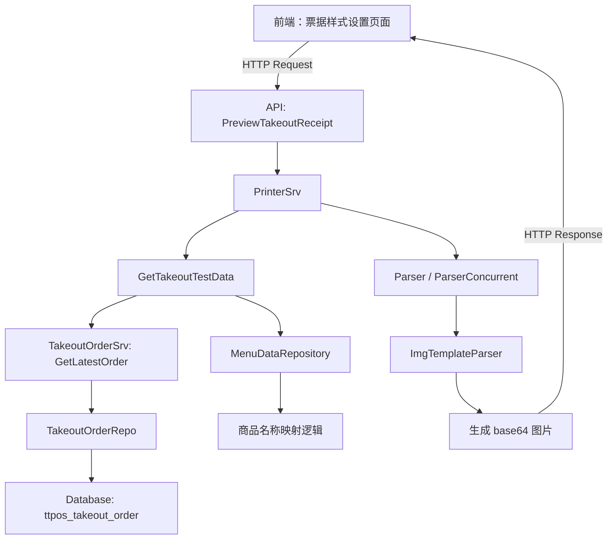

# 新管理端外卖票据预览功能 设计文档

> 本文档定义新管理端外卖票据预览功能的技术设计和实现方案。

## 📋 概述

本功能为新管理端（桌面端）的票据样式设置页面新增外卖订单票据预览功能。系统将复用现有的打印模块基础设施（`main/app/printer/` 和 `main/app/service/printer.go`），在票据样式设置页面中增加"外卖顾客联"和"外卖商家联"两个预览入口。

**核心设计思路**：
- 复用现有的 `PrinterSrv.Parser()` 和 `GetTestData()` 方法
- 扩展打印模板类型，支持外卖商家联和顾客联
- 利用现有的商品名称映射逻辑区分店内商品名和平台商品名
- 前端调用现有的票据预览 API，后端根据模板类型返回不同的预览数据

---

## 🎯 规范对齐

### Go Main 规范 (go-main.mdc)

本设计严格遵循 Go Main 开发规范：

- ✅ Service 只依赖其他 Service 接口（`IPrinterSrv`, `ITakeoutOrderSrv`）
- ✅ Repository 只持有 db 实例
- ✅ URL 使用 snake_case（`/api/v1/shop/printer_template/preview_takeout_receipt`）
- ✅ data 字段必须是对象
- ✅ 不使用 panic，返回 error
- ✅ 使用 `errors.WithMessage` 包装错误

### 打印模块规范 (go-printer.mdc)

本设计遵循打印模块开发规范：

- ✅ 复用现有的打印模板解析器（`pkg.ImgTemplateParser`）
- ✅ 复用现有的测试数据生成逻辑（`GetTestData()`）
- ✅ 使用并发安全的解析器（`ParserConcurrent()`）
- ✅ 返回 base64 编码的图片数据

### API 设计规范 (api.mdc)

- ✅ URL 使用 snake_case
- ✅ 响应格式统一：`{code, message, data{}}`
- ✅ data 不能为 null 或数组
- ✅ 使用 `helper.Success()` 返回响应

---

## 🔄 代码复用分析

### 可复用的现有组件

1. **PrinterSrv**: `main/app/service/printer.go`
   - `Parser()` - 模板解析器，将模板 JSON 和测试数据转换为 base64 图片
   - `ParserConcurrent()` - 并发安全的模板解析器
   - `GetTestData()` - 获取测试数据（根据模板名称）
   - `GetTemplateJSONStr()` - 获取模板 JSON 字符串
   - `GetPrintTemplateDetail()` - 获取打印模板详情（包含预览功能）

2. **TakeoutOrderSrv**: `main/app/service/takeout/takeout_order.go`
   - `GetOrderForPrint()` - 获取外卖订单打印数据（待实现）
   - 商品名称映射逻辑参考：`main/app/modules/takeout/domain/service/takeout_order_service.go`

3. **MenuDataRepository**: `main/app/modules/takeout/infrastructure/persistence/menu_data_repository_impl.go`
   - `GetProductNamesByUuids()` - 批量获取店内商品名称
   - `GetMenuNamesByPlatformItemIds()` - 批量获取平台商品名称

4. **打印模板**: `main/app/printer/pkg/template/`
   - `statement_order_tmp.json` - 外卖订单模板（参考）
   - `invoice_tmp.json` - 发票模板（参考）
   - `statement_pre_tmp.json` - 预结单模板（参考）

### 集成点

- **现有 API**: 复用 `/api/v1/shop/printer_template/detail` 的预览逻辑，扩展支持外卖票据类型
- **数据库表**: 
  - `ttpos_printer_template` - 打印模板表（扩展支持外卖商家联/顾客联类型）
  - `ttpos_takeout_order` - 外卖订单表（作为测试数据源）
  - `ttpos_product_package_takeout` - 外卖商品表（商品名称映射）
- **微服务**: 不涉及微服务调用

---

## 🏗️ 架构设计

### 分层设计原则

**Go Main 三层架构**:

```
API 层 (shop/shop_print.go)
  ↓ 依赖
业务层 (service/printer.go)
  ↓ 依赖
业务层 (service/takeout/takeout_order.go)
  ↓ 依赖
数据层 (repository/*_repo.go)
```

**依赖规则**:

- ✅ API 层依赖 Service 层
- ✅ PrinterSrv 依赖 TakeoutOrderSrv 接口（获取外卖订单数据）
- ❌ 禁止 Service 层直接依赖 Repository
- ✅ Service 通过 DBManager 获取 db，传递给 Repository

### 架构图



### 核心流程

#### 流程 1: 预览外卖顾客联

```
1. 前端请求预览外卖顾客联
   POST /api/v1/shop/printer_template/preview_takeout_receipt
   Body: {
     "template_type": "takeout_customer_receipt"
   }

2. API 层调用 PrinterSrv.PreviewTakeoutReceipt()

3. PrinterSrv 获取外卖订单测试数据
   - 查询最近 1 条外卖订单
   - 如果没有订单，使用预设的示例数据
   - 商品名称使用平台商品名（GetMenuNamesByPlatformItemIds）

4. PrinterSrv 加载外卖顾客联模板 JSON
   - 模板名称: "takeout_customer_receipt"
   - 模板路径: main/app/printer/pkg/template/takeout_customer_receipt_tmp.json

5. PrinterSrv 调用 ParserConcurrent() 解析模板
   - 输入: 模板 JSON + 测试数据
   - 输出: base64 编码的图片数据

6. 返回预览数据给前端
```

#### 流程 2: 预览外卖商家联

```
1. 前端请求预览外卖商家联
   POST /api/v1/shop/printer_template/preview_takeout_receipt
   Body: {
     "template_type": "takeout_merchant_receipt"
   }

2-3. 同上（获取测试数据）
   - 商品名称使用店内商品名（GetProductNamesByUuids）

4. PrinterSrv 加载外卖商家联模板 JSON
   - 模板名称: "takeout_merchant_receipt"
   - 模板路径: main/app/printer/pkg/template/takeout_merchant_receipt_tmp.json

5-6. 同上（解析并返回）
```

### 模块划分

#### Go Main 模块

- **API 层**: `main/app/api/v1/shop/shop_print.go`
  - 新增方法: `PreviewTakeoutReceipt()` - 预览外卖票据
  
- **Service 层**: `main/app/service/printer.go`
  - 新增方法: `PreviewTakeoutReceipt()` - 预览外卖票据
  - 新增方法: `GetTakeoutTestData()` - 获取外卖订单测试数据
  - 扩展方法: `GetTestData()` - 支持外卖票据类型
  
- **Service 层**: `main/app/service/takeout/takeout_order.go`
  - 新增方法: `GetLatestOrderForPreview()` - 获取最近的外卖订单（用于预览）
  
- **Repository 层**: 复用现有 Repository
  - `TakeoutOrderRepo` - 查询外卖订单
  - `MenuDataRepository` - 商品名称映射
  
- **DTO 层**: `main/app/dto/req/printer_req.go`, `main/app/dto/resp/printer_resp.go`
  - Request: `PreviewTakeoutReceiptReq`
  - Response: `PreviewTakeoutReceiptResp`

#### 打印模板文件

- **外卖顾客联模板**: `main/app/printer/pkg/template/takeout_customer_receipt_tmp.json`
- **外卖商家联模板**: `main/app/printer/pkg/template/takeout_merchant_receipt_tmp.json`
- **测试数据**: `main/app/printer/pkg/template/takeout_receipt_data.json`

#### Vue 前端模块

- **API 封装**: `admin/views/shop/src/api/printer.ts`
  - 新增方法: `previewTakeoutReceipt()`
  
- **页面**: `admin/views/shop/src/views/settings/printer/index.vue`
  - 新增预览入口：外卖顾客联、外卖商家联
  
- **组件**: `admin/views/shop/src/components/printer/TakeoutReceiptPreview.vue`（可选）
  - 预览弹窗组件

---

## 🗄️ 数据库设计

### 无需新增表

本功能主要涉及查询现有数据，不需要新增表或字段。

### 涉及的现有表

#### 表 1: ttpos_takeout_order（外卖订单表）

**用途**: 作为预览数据源，查询最近的外卖订单

**关键字段**:
- `uuid` - 订单唯一标识
- `shop_id` - 店铺 ID
- `platform` - 外卖平台（Grab, LINE_MAN）
- `short_order_number` - 订单号
- `order_state` - 订单状态
- `create_time` - 创建时间

**查询索引**: `idx_shop_id_create_time` (shop_id, create_time)

#### 表 2: ttpos_takeout_order_item（外卖订单商品表）

**用途**: 获取订单商品列表

**关键字段**:
- `takeout_order_uuid` - 外卖订单 UUID
- `item_name` - 商品名称（JSON，多语言）
- `platform_item_id` - 平台商品 ID
- `ttpos_product_package_uuid` - 店内商品套餐 UUID
- `is_mapped` - 是否已映射到店内商品（0: 未映射, 1: 已映射）
- `quantity` - 数量
- `price` - 价格

#### 表 3: ttpos_product_package_takeout（外卖商品映射表）

**用途**: 获取店内商品名称和外卖平台商品名称的映射关系

**关键字段**:
- `uuid` - 唯一标识
- `product_package_uuid` - 店内商品 UUID
- `multi_language_name_uuid` - 多语言名称 UUID（外卖平台商品名）

---

## 📊 数据模型

### DTO 定义

#### Request DTO

```go
// main/app/dto/req/printer_req.go

// PreviewTakeoutReceiptReq 预览外卖票据请求
type PreviewTakeoutReceiptReq struct {
	TemplateType string `json:"template_type" binding:"required"` // 模板类型: takeout_customer_receipt, takeout_merchant_receipt
}
```

#### Response DTO

```go
// main/app/dto/resp/printer_resp.go

// PreviewTakeoutReceiptResp 预览外卖票据响应
type PreviewTakeoutReceiptResp struct {
	ImageUrl     string `json:"image_url"`     // base64 编码的图片数据
	TemplateType string `json:"template_type"` // 模板类型
	IsExampleData bool  `json:"is_example_data"` // 是否使用示例数据
}
```

### 测试数据结构

```go
// 外卖票据测试数据
type TakeoutReceiptData struct {
	// 店铺信息
	ShopName    string `json:"shop_name"`
	ShopAddress string `json:"shop_address"`
	ShopPhone   string `json:"shop_phone"`
	
	// 订单信息
	Platform          string `json:"platform"`           // 外卖平台
	ShortOrderNumber  string `json:"short_order_number"` // 订单号
	OrderState        string `json:"order_state"`        // 订单状态
	OrderTime         int64  `json:"order_time"`         // 下单时间
	
	// 金额信息
	CurrencySymbol    string  `json:"currency_symbol"`    // 货币符号
	Subtotal          float64 `json:"subtotal"`           // 小计
	DeliveryFee       float64 `json:"delivery_fee"`       // 配送费
	EaterPayment      float64 `json:"eater_payment"`      // 顾客实付
	
	// 商品列表
	Items []TakeoutReceiptItem `json:"items"`
}

type TakeoutReceiptItem struct {
	Name      string   `json:"name"`      // 商品名称（根据票据类型使用店内名或平台名）
	Quantity  int      `json:"quantity"`  // 数量
	Price     float64  `json:"price"`     // 单价
	Subtotal  float64  `json:"subtotal"`  // 小计
	Modifiers []string `json:"modifiers"` // 修饰符列表
}
```

---

## 🔌 API 设计

### RESTful API

#### API 1: 预览外卖票据

**请求**:

- **URL**: `/api/v1/shop/printer_template/preview_takeout_receipt`
- **Method**: `POST`
- **Headers**:
  ```json
  {
    "Authorization": "Bearer {token}",
    "Content-Type": "application/json"
  }
  ```
- **Body**:
  ```json
  {
    "template_type": "takeout_customer_receipt"
  }
  ```
  
**参数说明**:
- `template_type`: 票据类型
  - `takeout_customer_receipt` - 外卖顾客联
  - `takeout_merchant_receipt` - 外卖商家联

**响应**:

```json
{
  "code": 1,
  "message": "success",
  "data": {
    "image_url": "data:image/png;base64,iVBORw0KGgoAAAANSUhEUgAA...",
    "template_type": "takeout_customer_receipt",
    "is_example_data": false
  }
}
```

**错误响应**:

```json
{
  "code": 0,
  "message": "不支持的模板类型",
  "data": {}
}
```

**权限要求**: 商户管理员权限 + 票据样式设置权限

---

## 🧩 组件和接口

### Service 层

#### PrinterSrv 扩展

```go
// main/app/service/printer.go

// PreviewTakeoutReceipt 预览外卖票据
func (s *printerSrv) PreviewTakeoutReceipt(ctx context.Context, req req.PreviewTakeoutReceiptReq) (*resp.PreviewTakeoutReceiptResp, error) {
	// 1. 验证模板类型
	if req.TemplateType != "takeout_customer_receipt" && req.TemplateType != "takeout_merchant_receipt" {
		return nil, errors.New("不支持的模板类型")
	}
	
	// 2. 获取外卖订单测试数据
	testData, isExampleData, err := s.GetTakeoutTestData(ctx, req.TemplateType)
	if err != nil {
		return nil, errors.WithMessage(errors.New("获取测试数据失败"), err.Error())
	}
	
	// 3. 获取模板 JSON
	templateJSONStr, err := s.GetTemplateJSONStr(ctx, req.TemplateType)
	if err != nil {
		return nil, errors.WithMessage(errors.New("获取模板失败"), err.Error())
	}
	
	// 4. 解析模板（使用并发安全的解析器）
	uniqueID := pkg_uuid.GenerateUuid()
	imageUrl, err := s.ParserConcurrent(ctx, templateJSONStr, testData, uniqueID)
	if err != nil {
		return nil, errors.WithMessage(errors.New("解析模板失败"), err.Error())
	}
	
	// 5. 返回预览数据
	return &resp.PreviewTakeoutReceiptResp{
		ImageUrl:      imageUrl,
		TemplateType:  req.TemplateType,
		IsExampleData: isExampleData,
	}, nil
}

// GetTakeoutTestData 获取外卖订单测试数据
func (s *printerSrv) GetTakeoutTestData(ctx context.Context, templateType string) (map[string]interface{}, bool, error) {
	// 1. 尝试获取最近的外卖订单
	takeoutOrderSrv := service_takeout.NewTakeoutOrderSrv(s.dbm)
	order, err := takeoutOrderSrv.GetLatestOrderForPreview(ctx)
	
	if err != nil || order == nil {
		// 2. 没有订单数据，使用示例数据
		exampleData := s.getExampleTakeoutData(ctx, templateType)
		return exampleData, true, nil
	}
	
	// 3. 有订单数据，转换为测试数据格式
	testData := s.convertOrderToTestData(ctx, order, templateType)
	return testData, false, nil
}

// getExampleTakeoutData 获取示例外卖订单数据
func (s *printerSrv) getExampleTakeoutData(ctx context.Context, templateType string) map[string]interface{} {
	// 从模板文件读取示例数据
	// main/app/printer/pkg/template/takeout_receipt_data.json
	
	// 根据模板类型调整商品名称
	// takeout_customer_receipt: 使用平台商品名
	// takeout_merchant_receipt: 使用店内商品名
	
	return exampleData
}

// convertOrderToTestData 将外卖订单转换为测试数据格式
func (s *printerSrv) convertOrderToTestData(ctx context.Context, order *model.TakeoutOrder, templateType string) map[string]interface{} {
	// 1. 提取订单基本信息
	// 2. 根据模板类型处理商品名称
	//    - takeout_customer_receipt: 使用 platform_item_name（平台商品名）
	//    - takeout_merchant_receipt: 使用 ttpos_product_name（店内商品名）
	// 3. 构建测试数据格式
	
	return testData
}
```

#### TakeoutOrderSrv 扩展

```go
// main/app/service/takeout/takeout_order.go

// GetLatestOrderForPreview 获取最近的外卖订单（用于预览）
func (s *takeoutSrv) GetLatestOrderForPreview(ctx context.Context) (*model.TakeoutOrder, error) {
	db := s.dbm.GetDB(ctx.GetDbId())
	orderRepo := repository.NewTakeoutOrderRepo(db)
	
	// 查询最近 1 条外卖订单（按创建时间倒序）
	orders, _, err := orderRepo.GetList(
		orderRepo.WhereShopId(ctx.GetShopId()),
		repository.CommonRepo.WhereBySoftDelete(),
		orderRepo.WithOrderItems(), // 预加载订单商品
		repository.CommonRepo.OrderByCreateTime("DESC"),
		repository.CommonRepo.Limit(1),
	)
	
	if err != nil {
		return nil, errors.WithMessage(errors.New("查询外卖订单失败"), err.Error())
	}
	
	if len(orders) == 0 {
		return nil, nil // 没有订单数据
	}
	
	return orders[0], nil
}
```

### API 层

```go
// main/app/api/v1/shop/shop_print.go

// PreviewTakeoutReceipt 预览外卖票据
func (api *ShopPrintAPI) PreviewTakeoutReceipt(c *gin.Context) {
	var req dto_req.PreviewTakeoutReceiptReq
	if err := c.ShouldBindJSON(&req); err != nil {
		helper.ErrorWithDetail(c, constant.CodeInvalidParam, err)
		return
	}
	
	// 调用 Service
	printerSrv := service.NewPrinterSrv(api.dbm, api.cache)
	resp, err := printerSrv.PreviewTakeoutReceipt(c, req)
	if err != nil {
		helper.ErrorWithDetail(c, constant.CodeFail, err)
		return
	}
	
	helper.Success(c, gin.H{
		"data": resp,
	})
}
```

---

## ⚡ 缓存设计

### Redis 缓存

**缓存策略**:

- **Key 命名**: `ttpos:printer:takeout_example_data:{template_type}`
- **过期时间**: 1 小时
- **更新策略**: Cache-Aside Pattern

**示例**:

```go
// 缓存示例数据
key := fmt.Sprintf("ttpos:printer:takeout_example_data:%s", templateType)
cached, err := redis.Get(key)
if err == nil {
	// 缓存命中
	return cached, true, nil
}

// 缓存未命中，读取文件并缓存
exampleData := readExampleDataFromFile(templateType)
redis.Set(key, exampleData, 1*time.Hour)
return exampleData, true, nil
```

---

## 🚨 错误处理

### 错误场景

#### 场景 1: 不支持的模板类型

- **处理方式**: 返回错误提示"不支持的模板类型"
- **用户影响**: 前端显示错误提示
- **代码示例**:
  ```go
  if req.TemplateType != "takeout_customer_receipt" && req.TemplateType != "takeout_merchant_receipt" {
      return nil, errors.New("不支持的模板类型")
  }
  ```

#### 场景 2: 模板文件不存在

- **处理方式**: 返回错误提示"模板文件不存在"
- **用户影响**: 前端显示错误提示"预览功能暂不可用"
- **代码示例**:
  ```go
  if _, err := os.Stat(templatePath); os.IsNotExist(err) {
      logger.Logger.Error("模板文件不存在", zap.String("path", templatePath))
      return nil, errors.New("模板文件不存在")
  }
  ```

#### 场景 3: 查询外卖订单失败

- **处理方式**: 降级使用示例数据
- **用户影响**: 预览使用示例数据，并标注"示例数据"
- **代码示例**:
  ```go
  order, err := takeoutOrderSrv.GetLatestOrderForPreview(ctx)
  if err != nil || order == nil {
      // 降级使用示例数据
      logger.Logger.Warn("查询外卖订单失败，使用示例数据", zap.Error(err))
      exampleData := s.getExampleTakeoutData(ctx, templateType)
      return exampleData, true, nil
  }
  ```

---

## 🔒 安全设计

### 身份验证

- **JWT Token**: 所有 API 需要 Token 验证
- **权限检查**: 前端和后端都需要检查用户是否有票据样式设置权限

### 权限控制

- **RBAC**: 基于角色的访问控制
- **API 权限**: 检查用户是否有"printer_template:view"权限

### 数据安全

- **SQL 注入防护**: 使用 GORM 参数化查询
- **XSS 防护**: 前端对预览数据进行编码

---

## 🧪 测试策略

### 单元测试

**目标覆盖率**:

- Service 层: 70%+
- Repository 层: 80%+

**测试内容**:

- `PrinterSrv.PreviewTakeoutReceipt()` - 预览外卖票据
- `PrinterSrv.GetTakeoutTestData()` - 获取测试数据（真实订单和示例数据）
- `TakeoutOrderSrv.GetLatestOrderForPreview()` - 查询最近订单

**示例**:

```go
// main/app/service/printer_test.go
func TestPrinterService_PreviewTakeoutReceipt(t *testing.T) {
	// 测试预览外卖顾客联
	// 测试预览外卖商家联
	// 测试不支持的模板类型
	// 测试没有订单数据时使用示例数据
}
```

### API 测试

**测试内容**:

- API 接口调用
- 参数验证（template_type 必填）
- 响应格式（data 必须是对象）
- 错误处理

### 集成测试

**测试流程**:

- 端到端业务流程（前端请求 → 后端处理 → 返回预览数据）
- 数据库查询（查询外卖订单）
- 模板解析（解析模板 JSON 生成图片）

---

## 📈 性能优化

### 优化策略

1. **数据库优化**:

   - 使用索引查询最近订单：`idx_shop_id_create_time`
   - 限制查询数量：`LIMIT 1`
   - 预加载订单商品：`WithOrderItems()`

2. **缓存优化**:

   - Redis 缓存示例数据（1 小时过期）
   - 商品名称映射缓存（复用现有缓存逻辑）

3. **并发控制**:

   - 使用 `ParserConcurrent()` 并发安全的解析器
   - 避免并发冲突（使用唯一的临时文件名）

4. **接口优化**:
   - 异步处理模板解析（如果性能瓶颈）

### 性能指标

- 本地响应时间: < 500ms（包含模板解析时间）
- 数据库查询: < 50ms
- 缓存命中率: > 80%（示例数据）

---

## 🌐 浏览器兼容性

### 前端兼容性（Vue）

- Chrome 90+
- Safari 14+
- Firefox 88+
- Edge 90+

### 图片格式

- 预览图片格式：PNG (base64 编码)
- 浏览器支持：所有现代浏览器

---

## 📚 实现清单

### Phase 1: 后端 API 开发（1-2 天）

- [ ] 创建 Request/Response DTO
- [ ] 实现 `PrinterSrv.PreviewTakeoutReceipt()`
- [ ] 实现 `PrinterSrv.GetTakeoutTestData()`
- [ ] 实现 `TakeoutOrderSrv.GetLatestOrderForPreview()`
- [ ] 创建外卖票据模板 JSON 文件
- [ ] 创建示例数据 JSON 文件
- [ ] 实现 API 接口 `PreviewTakeoutReceipt()`
- [ ] 注册 API 路由
- [ ] 权限检查

### Phase 2: 前端开发（1-2 天）

- [ ] 封装 API 调用 `previewTakeoutReceipt()`
- [ ] 票据样式设置页面新增预览入口
- [ ] 实现预览弹窗组件
- [ ] 前端权限控制
- [ ] 示例数据标注

### Phase 3: 测试和优化（1 天）

- [ ] 单元测试
- [ ] API 测试
- [ ] 集成测试
- [ ] 性能测试
- [ ] 浏览器兼容性测试

**详细任务**: 参见 `tasks.md`

---

## Graphiti & 活动日志

- Related Episode: `[待补充]`
- 模板：`docs/agent/templates/graphiti-episode.md`
- 活动日志：`docs/team/activities/weifashi/2025-12/2025-12-26.md`

---

**版本**: v1.0.0  
**创建日期**: 2025-12-26  
**作者**: weifashi  
**审核者**: 待指定

