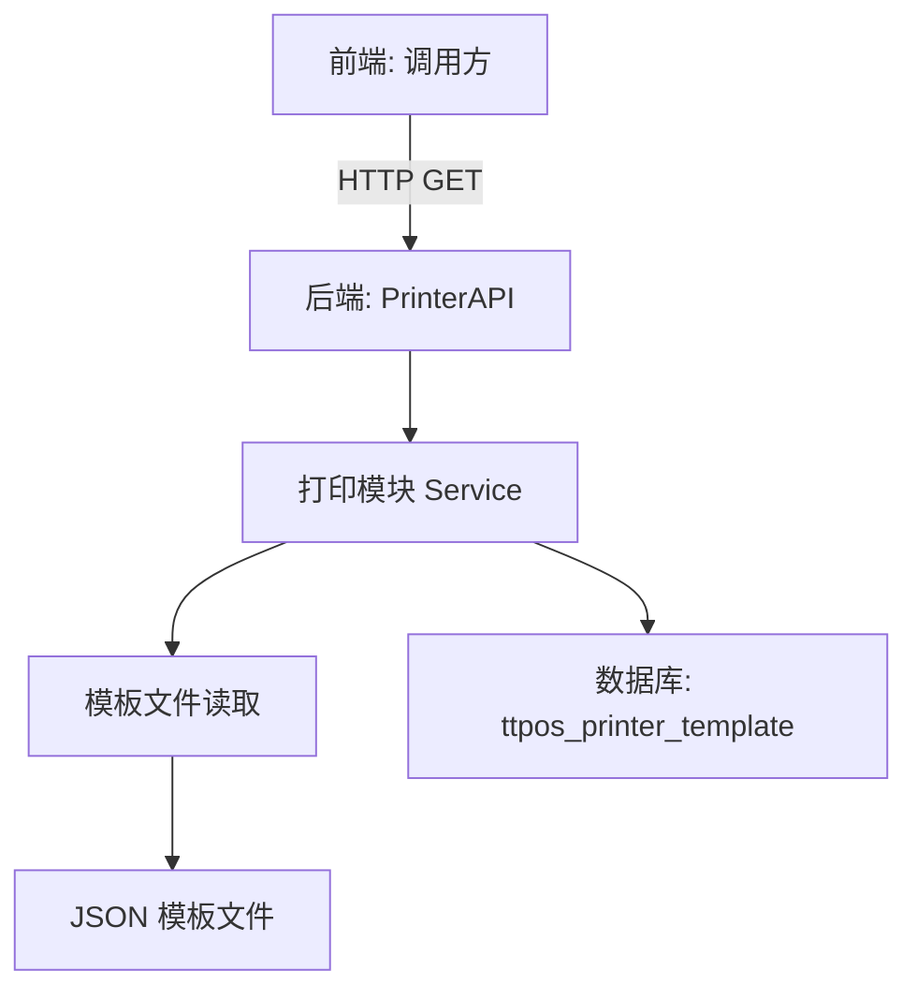

# 新管理端（桌面）查看外卖退单联 设计文档

> 本文档定义新管理端外卖退单联预览功能的技术设计和实现方案。

## 📋 概述

本功能在新管理端（桌面端）的餐厅设置-票据样式设置页面中，新增"外卖退单联"预览功能。采用前后端分离架构，前端使用 Vue 3 展示预览界面（只读），后端使用 Go (main/) 提供票据模板数据读取接口。

**技术栈**：
- **后端**: Go 1.23+ + Gin（Main 模块）
- **数据源**: MySQL `ttpos_printer_template` 表（ID=14）

**复用策略**：
- 复用打印模块的模板数据结构
- 参考外卖商家联/顾客联的 API 实现方式

**说明**：
本需求仅实现后端 API，前端集成由前端团队另行处理

---

## 🎯 规范对齐

### Go Main 规范 (go-main.mdc)

本功能遵循 Go Main 开发规范：

- ✅ 遵循 Controller → Service → Repository 分层
- ✅ Service 可依赖其他 Service 接口（如需要）
- ✅ Repository 只持有 db 实例
- ✅ URL 使用 snake_case: `/api/v1/printer/template/preview/takeout_refund_receipt`
- ✅ data 字段必须是对象
- ✅ 不使用 panic，返回 error

### 打印模块规范 (go-printer.mdc)

本功能属于打印模块扩展：

- ✅ 票据模板数据位于 `main/app/modules/printer/pkg/template/`
- ✅ 遵循现有票据预览接口设计
- ✅ 支持多语言国际化

### API 设计规范 (api.mdc)

API 设计遵循规范：

- ✅ URL 使用 snake_case
- ✅ 响应格式统一: `{code, message, data{}}`
- ✅ data 不能为 null 或数组

### Vue 规范 (vue.mdc)

前端开发遵循规范：

- ✅ 使用 Vue 3 + TypeScript + Composition API
- ✅ 使用 Element Plus 组件库
- ✅ 组件命名使用 PascalCase
- ✅ 文件命名使用 kebab-case

---

## 🔄 代码复用分析

### 可复用的现有组件

#### 后端模块

1. **打印模块服务**: `main/app/modules/printer/`
   - 复用票据模板读取逻辑
   - 复用打印数据结构定义

2. **票据模板数据**: `main/app/modules/printer/pkg/template/`
   - 参考 `takeout_merchant_receipt_config.json` - 外卖商家联配置
   - 参考 `takeout_merchant_receipt_data.json` - 外卖商家联示例数据
   - 参考 `takeout_merchant_receipt_tmp.json` - 外卖商家联模板

3. **数据库表**: `ttpos_printer_template`
   - 使用现有表，ID=14 对应外卖退单联
   - 参考迁移: `admin/database/migrations/20251226190000_add_takeout_receipt_templates.php`

#### 前端模块

1. **票据预览组件**: `admin/views/shop/components/printer/`（推测路径）
   - 复用外卖商家联/顾客联的预览组件
   - 复用票据渲染逻辑

2. **API 封装**: `admin/views/shop/api/printer.ts`（推测路径）
   - 复用现有票据 API 封装模式

### 集成点

- **现有 API**: 可能已有票据模板预览接口，需要扩展支持退单联类型
- **数据库表**: 使用现有 `ttpos_printer_template` 表，ID=14
- **前端路由**: 在票据样式设置页面新增入口

---

## 🏗️ 架构设计

### 分层设计原则

**后端架构**:

```
Go Main 后端 (main/)
  ↓ 读取数据
MySQL 数据库 (ttpos_printer_template)
  ↓ 读取模板文件
Template Files (JSON)
```

**API 层架构**:

```
API 层 (API/Controller)
  ↓ 调用
打印模块 Service
  ↓ 读取
Template Files (JSON)
```

### 架构图



### 模块划分

#### Go Main 模块

由于功能简单（只读预览），**可能不需要新增文件**，复用现有打印模块接口：

- **API 层**: `main/app/api/v1/printer/printer_api.go`
  - 扩展现有 API，添加退单联预览接口（或复用通用预览接口）
  
- **Service 层**: `main/app/modules/printer/service/`
  - 复用现有打印服务，读取模板数据

- **模板数据**: `main/app/modules/printer/pkg/template/`
  - 使用现有模板文件（外卖商家联模板可作为参考）

#### 前端集成（不在本需求范围内）

前端部分由前端团队另行处理，本需求仅提供后端 API 接口

---

## 🗄️ 数据库设计

### 使用现有数据表

**表名**: `ttpos_printer_template`

本功能**不需要创建新表**，使用现有表中的数据：

- **ID=14**: 外卖退单联模板记录（已通过迁移文件创建）
- **参考迁移**: `admin/database/migrations/20251226190000_add_takeout_receipt_templates.php`

**表结构（参考）**:

```sql
CREATE TABLE IF NOT EXISTS `ttpos_printer_template` (
    `id` bigint unsigned NOT NULL AUTO_INCREMENT COMMENT '主键ID',
    `uuid` bigint unsigned NOT NULL DEFAULT 0 COMMENT '唯一标识',
    `name` varchar(255) NOT NULL DEFAULT '' COMMENT '模板名称',
    `template` tinyint NOT NULL DEFAULT 1 COMMENT '模板类型',
    `is_show_sku` tinyint NOT NULL DEFAULT 1 COMMENT '是否显示SKU',
    `tmp_uuid` bigint unsigned NOT NULL DEFAULT 0 COMMENT '模板UUID',
    `tmp_data` text COMMENT '模板数据',
    `create_time` int NOT NULL DEFAULT 0 COMMENT '创建时间',
    `update_time` int NOT NULL DEFAULT 0 COMMENT '更新时间',
    `delete_time` int NOT NULL DEFAULT 0 COMMENT '删除时间',
    PRIMARY KEY (`id`),
    UNIQUE KEY `uk_uuid` (`uuid`),
    KEY `idx_template` (`template`)
) ENGINE=InnoDB DEFAULT CHARSET=utf8mb4 COMMENT='打印机模板表';
```

**外卖退单联记录**:

```sql
-- ID=14 的记录（已存在）
INSERT INTO `ttpos_printer_template` VALUES (
    14,      -- id
    14,      -- uuid  
    '外卖退单联',  -- name
    1,       -- template
    1,       -- is_show_sku
    0,       -- tmp_uuid
    '',      -- tmp_data
    NOW(),   -- create_time
    NOW(),   -- update_time
    0        -- delete_time
);
```

---

## 📊 数据模型

### Go Model（使用现有）

使用现有 Model:

```go
// main/app/model/printer_template.go（假设已存在）
type PrinterTemplate struct {
    Id         uint64 `gorm:"column:id;primaryKey" json:"id"`
    Uuid       uint64 `gorm:"column:uuid;uniqueIndex" json:"uuid"`
    Name       string `gorm:"column:name" json:"name"`
    Template   int    `gorm:"column:template" json:"template"`
    IsShowSku  int    `gorm:"column:is_show_sku" json:"is_show_sku"`
    TmpUuid    uint64 `gorm:"column:tmp_uuid" json:"tmp_uuid"`
    TmpData    string `gorm:"column:tmp_data" json:"tmp_data"`
    CreateTime int64  `gorm:"column:create_time" json:"create_time"`
    UpdateTime int64  `gorm:"column:update_time" json:"update_time"`
    DeleteTime int64  `gorm:"column:delete_time;index" json:"delete_time"`
}

func (*PrinterTemplate) TableName() string {
    return "ttpos_printer_template"
}
```

### DTO 定义（如需要）

#### Response DTO（可能需要新增）

```go
// main/app/dto/resp/printer_template_resp.go
type TakeoutRefundReceiptPreviewResp struct {
    TemplateConfig interface{} `json:"template_config"` // 模板配置（从 JSON 文件读取）
    SampleData     interface{} `json:"sample_data"`     // 示例数据（从 JSON 文件读取）
}
```

---

## 🔌 API 设计

### RESTful API

#### API: 获取外卖退单联预览数据

**请求**:

- **URL**: `/api/v1/printer/template/preview/takeout_refund_receipt` 或 `/api/v1/printer/template/preview?type=takeout_refund_receipt`
- **Method**: `GET`
- **Headers**:
  ```json
  {
    "Authorization": "Bearer {token}",
    "Content-Type": "application/json"
  }
  ```
- **Query Parameters**:
  - `type`: `takeout_refund_receipt` （如使用通用接口）

**响应**:

```json
{
  "code": 1,
  "message": "success",
  "data": {
    "template_config": {
      "metadata": {
        "name": "外卖退单联"
      },
      "rows": [
        // 模板配置数据（参考 takeout_merchant_receipt_config.json）
      ]
    },
    "sample_data": {
      "brand_name": "TTPOS",
      "store": {
        "name": "店铺名称",
        "address": "商家地址"
        // ...更多示例数据（参考 takeout_merchant_receipt_data.json）
      },
      "order": {
        "order_no": "202401025565053",
        // ...订单数据
      }
    }
  }
}
```

**错误响应**:

```json
{
  "code": 0,
  "message": "模板数据不存在",
  "data": {}
}
```

---

## 🧩 组件和接口

### 后端实现

#### 方案 1: 扩展现有接口（推荐）

如果已有通用票据预览接口，扩展支持退单联类型：

```go
// main/app/api/v1/printer/printer_api.go（假设已存在）

// 获取票据预览数据
// GET /api/v1/printer/template/preview
func (api *PrinterAPI) GetTemplatePreview(c *gin.Context) {
    templateType := c.Query("type") // takeout_refund_receipt
    
    // 根据类型读取对应的模板配置和示例数据
    templateConfig, err := api.printerSrv.GetTemplateConfig(templateType)
    if err != nil {
        helper.ErrorWithDetail(c, constant.CodeFail, err)
        return
    }
    
    sampleData, err := api.printerSrv.GetSampleData(templateType)
    if err != nil {
        helper.ErrorWithDetail(c, constant.CodeFail, err)
        return
    }
    
    helper.Success(c, gin.H{
        "data": gin.H{
            "template_config": templateConfig,
            "sample_data":     sampleData,
        },
    })
}
```

#### 方案 2: 新增专用接口

如果需要独立接口：

```go
// main/app/api/v1/printer/printer_api.go

// 获取外卖退单联预览数据
// GET /api/v1/printer/template/preview/takeout_refund_receipt
func (api *PrinterAPI) GetTakeoutRefundReceiptPreview(c *gin.Context) {
    // 读取模板配置
    configPath := "main/app/modules/printer/pkg/template/takeout_merchant_receipt_config.json"
    templateConfig, err := readJSONFile(configPath)
    if err != nil {
        helper.ErrorWithDetail(c, constant.CodeFail, err)
        return
    }
    
    // 读取示例数据
    dataPath := "main/app/modules/printer/pkg/template/takeout_merchant_receipt_data.json"
    sampleData, err := readJSONFile(dataPath)
    if err != nil {
        helper.ErrorWithDetail(c, constant.CodeFail, err)
        return
    }
    
    helper.Success(c, gin.H{
        "data": gin.H{
            "template_config": templateConfig,
            "sample_data":     sampleData,
        },
    })
}

// 读取 JSON 文件
func readJSONFile(filePath string) (interface{}, error) {
    data, err := os.ReadFile(filePath)
    if err != nil {
        return nil, errors.WithMessage(err, "读取文件失败")
    }
    
    var result interface{}
    if err := json.Unmarshal(data, &result); err != nil {
        return nil, errors.WithMessage(err, "解析JSON失败")
    }
    
    return result, nil
}
```

### 前端实现

#### API 封装

```typescript
// admin/views/shop/api/printer.ts

import request from '@/utils/request'

/**
 * 获取外卖退单联预览数据
 */
export function getTakeoutRefundReceiptPreview() {
  return request({
    url: '/api/v1/printer/template/preview/takeout_refund_receipt',
    method: 'get'
  })
}

// 或使用通用接口
export function getTemplatePreview(type: string) {
  return request({
    url: '/api/v1/printer/template/preview',
    method: 'get',
    params: { type }
  })
}
```

#### 页面组件

```vue
<!-- admin/views/shop/pages/settings/printer-templates.vue -->
<template>
  <div class="printer-templates">
    <!-- 外卖商家联 -->
    <el-card class="template-card" @click="handlePreview('merchant')">
      <div class="template-title">外卖商家联</div>
    </el-card>
    
    <!-- 外卖顾客联 -->
    <el-card class="template-card" @click="handlePreview('customer')">
      <div class="template-title">外卖顾客联</div>
    </el-card>
    
    <!-- 新增：外卖退单联 -->
    <el-card class="template-card" @click="handlePreview('refund')">
      <div class="template-title">外卖退单联</div>
    </el-card>
  </div>
  
  <!-- 预览弹窗 -->
  <el-dialog
    v-model="previewVisible"
    :title="previewTitle"
    width="800px"
    :close-on-click-modal="false"
  >
    <receipt-preview
      v-if="previewVisible"
      :template-config="templateConfig"
      :sample-data="sampleData"
    />
  </el-dialog>
</template>

<script setup lang="ts">
import { ref } from 'vue'
import { ElMessage } from 'element-plus'
import { getTakeoutRefundReceiptPreview } from '@/api/printer'
import ReceiptPreview from '@/components/printer/receipt-preview.vue'

const previewVisible = ref(false)
const previewTitle = ref('')
const templateConfig = ref<any>(null)
const sampleData = ref<any>(null)

const handlePreview = async (type: string) => {
  try {
    if (type === 'refund') {
      previewTitle.value = '外卖退单联预览'
      
      // 调用 API 获取数据
      const res = await getTakeoutRefundReceiptPreview()
      templateConfig.value = res.data.template_config
      sampleData.value = res.data.sample_data
      
      previewVisible.value = true
    } else {
      // 处理其他类型的预览
      // ...
    }
  } catch (error) {
    ElMessage.error('加载预览失败')
    console.error(error)
  }
}
</script>

<style scoped lang="scss">
.printer-templates {
  display: grid;
  grid-template-columns: repeat(auto-fill, minmax(200px, 1fr));
  gap: 16px;
  
  .template-card {
    cursor: pointer;
    transition: all 0.3s;
    
    &:hover {
      transform: translateY(-4px);
      box-shadow: 0 4px 12px rgba(0, 0, 0, 0.1);
    }
    
    .template-title {
      font-size: 16px;
      font-weight: 500;
      text-align: center;
      padding: 20px 0;
    }
  }
}
</style>
```

#### 预览组件（复用）

```vue
<!-- admin/views/shop/components/printer/receipt-preview.vue -->
<template>
  <div class="receipt-preview">
    <div class="preview-content">
      <!-- 票据渲染逻辑 -->
      <!-- 根据 templateConfig 和 sampleData 渲染票据内容 -->
      <div v-for="(row, index) in templateConfig.rows" :key="index">
        <!-- 渲染每一行 -->
      </div>
    </div>
  </div>
</template>

<script setup lang="ts">
import { defineProps } from 'vue'

defineProps({
  templateConfig: {
    type: Object,
    required: true
  },
  sampleData: {
    type: Object,
    required: true
  }
})
</script>

<style scoped lang="scss">
.receipt-preview {
  background: #f5f5f5;
  padding: 20px;
  
  .preview-content {
    background: white;
    max-width: 600px;
    margin: 0 auto;
    padding: 20px;
    font-family: monospace;
  }
}
</style>
```

---

## ⚡ 缓存设计

### 不需要缓存

由于：
1. 预览数据是静态的（从 JSON 文件读取）
2. 访问频率不高（仅在设置页面查看时触发）
3. 数据量小（JSON 文件几十 KB）

**结论**: 暂不实施缓存策略

---

## 🚨 错误处理

### 错误场景

#### 场景 1: 模板数据不存在

- **处理方式**: 检查数据库记录（ID=14）是否存在
- **用户影响**: 显示错误提示"模板数据不存在，请联系管理员"
- **代码示例**:
  ```go
  template, err := repo.GetByID(14)
  if err != nil {
      logger.Logger.Error("获取外卖退单联模板失败", zap.Error(err))
      return nil, errors.WithMessage(err, "模板数据不存在")
  }
  ```

#### 场景 2: JSON 文件读取失败

- **处理方式**: 捕获文件读取错误，返回友好提示
- **用户影响**: 显示"预览数据加载失败"
- **代码示例**:
  ```go
  data, err := os.ReadFile(filePath)
  if err != nil {
      logger.Logger.Error("读取模板文件失败", zap.Error(err), zap.String("path", filePath))
      return nil, errors.WithMessage(err, "预览数据加载失败")
  }
  ```

#### 场景 3: 前端渲染异常

- **处理方式**: Try-catch 捕获渲染错误
- **用户影响**: 显示"预览渲染失败，请刷新重试"

---

## 🔒 安全设计

### 身份验证

- **JWT Token**: 所有 API 需要 Token 验证
- **权限要求**: 商户管理员权限

### 权限控制

- **RBAC**: 基于角色的访问控制
- **API 权限**: 仅商户管理员可访问票据设置页面

### 数据安全

- **只读预览**: 不提供编辑功能，数据安全风险低
- **静态数据**: 示例数据不包含真实用户信息

---

## 🧪 测试策略

### 单元测试

**目标覆盖率**:

- 后端 Service: 70%+（如新增）
- 后端 Repository: 80%+（如新增）

**测试内容**:

- 模板数据读取逻辑
- JSON 文件解析
- 错误处理

**示例**:

```go
// main/app/modules/printer/service/template_service_test.go
func TestGetTakeoutRefundReceiptPreview(t *testing.T) {
    // 测试正常场景
    // 测试文件不存在场景
    // 测试 JSON 解析失败场景
}
```

### API 测试

**测试内容**:

- API 接口调用成功
- 参数验证（如有）
- 响应格式正确
- 错误处理正确

### 集成测试

**测试流程**:

1. 前端点击"外卖退单联"入口
2. 调用后端 API
3. 加载模板配置和示例数据
4. 渲染预览界面
5. 验证显示内容正确

### 手动测试

**测试场景**:

1. 不同浏览器（Chrome, Safari, Firefox, Edge）
2. 不同分辨率（1920x1080, 1366x768, 1024x768）
3. 网络异常场景（慢速网络）

---

## 📈 性能优化

### 优化策略

1. **文件读取优化**:
   - JSON 文件较小（< 50KB），直接读取即可
   - 如需优化，可考虑启动时预加载到内存

2. **前端渲染优化**:
   - 使用虚拟滚动（如票据内容过长）
   - 懒加载预览组件

3. **接口响应优化**:
   - 单次请求返回所有数据（配置 + 示例数据）
   - 避免多次往返

### 性能指标

- API 响应时间: < 500ms
- 前端渲染时间: < 200ms
- 总加载时间: < 1s

---

## 🌐 浏览器兼容性

### 前端兼容性（Vue）

- Chrome 90+
- Safari 14+
- Firefox 88+
- Edge 90+

### 响应式设计

- 桌面端: 1920x1080（主要）
- 平板端: 1024x768（可选）

---

## 📚 实现清单

### Phase 1: 后端实现

- [ ] 1.1 确认现有 API 接口（是否需要新增）
- [ ] 1.2 实现/扩展票据预览接口
- [ ] 1.3 编写 API 测试

### Phase 2: 前端实现

- [ ] 2.1 在票据设置页面新增"外卖退单联"入口
- [ ] 2.2 实现 API 调用封装
- [ ] 2.3 实现/复用预览组件
- [ ] 2.4 测试预览功能

### Phase 3: 集成测试

- [ ] 3.1 前后端联调测试
- [ ] 3.2 多浏览器兼容性测试
- [ ] 3.3 多分辨率测试

### Phase 4: 文档更新

- [ ] 4.1 更新 API 文档（如新增接口）
- [ ] 4.2 更新用户指南（可选）

**详细任务**: 参见 `tasks.md`

---

## Graphiti & 活动日志

- Related Episode: `[待补充]`
- 模板：`docs/agent/templates/graphiti-episode.md`
- 活动日志：`docs/team/activities/weifashi/2026-01/2026-01-04.md`
- 在技术方案评审、关键架构决策或踩坑总结后，立即补充 Episode 并在设计文档尾部互链。

---

**版本**: v1.0.0  
**创建日期**: 2026-01-04  
**作者**: weifashi  
**审核者**: 待分配

