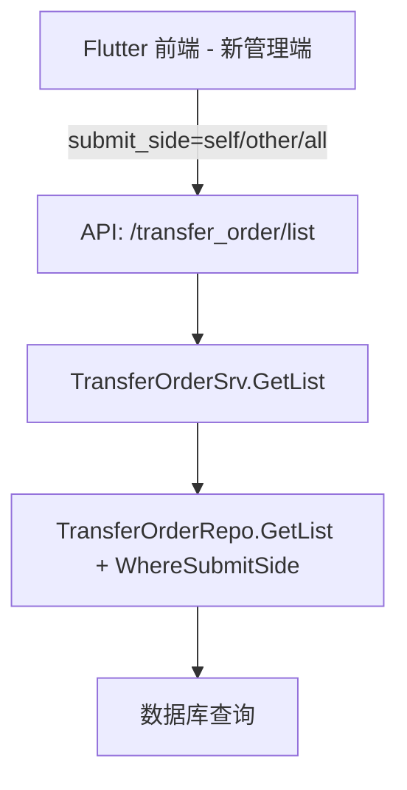

# 调拨单-本店提交与其他门店提交分开管理 设计文档

> 本文档定义调拨单提交方筛选的技术设计和实现方案。

## 📋 概述

在新管理端（Flutter）调拨单列表页增加"提交方"筛选按钮组（全部/本店提交/他店提交），通过在后端 API 新增查询参数 `submit_side` 实现按调出方/调入方门店区分查询，前端在 ttpos-flutter 仓库中实现筛选交互与状态保持。

**核心交付物**：

- 后端（本仓库）：在现有调拨单查询接口增加 `submit_side` 参数支持，无需新增表结构
- 前端（ttpos-flutter 仓库）：在新管理端列表页新增筛选按钮组，实现状态持久化与交互反馈（前端实现不在本 Spec 范围）

---

## 🎯 规范对齐

### Go Main 规范 (go-main.mdc)

- Service 只依赖其他 Service 接口，不直接调用 Repository
- Repository 只持有 db 实例，不持有 DBManager
- URL 使用 snake_case：查询参数 `submit_side`
- data 字段必须是对象，不能是 null 或数组
- 不使用 panic，返回 error

### API 设计规范 (api.mdc)

- URL：`GET /api/v1/transfer_order/list?submit_side=all|self|other`
- 响应格式：`{code: 1, message: "success", data: {list: [...], meta: {...}}}`
- data 为对象，分页信息在 meta 中

### 数据库规范 (database.mdc)

- 复用现有表 `ttpos_transfer_order`（假设字段：`from_store_id`, `to_store_id`）
- 不新增字段，确保 `from_store_id`, `to_store_id` 有索引

### Flutter 前端规范

- 前端实现在 `ttpos-flutter` 仓库中，不在本仓库范围
- 后端需提供标准 RESTful API，确保 Flutter 端可正常调用
- API 响应格式遵循项目统一规范

---

## 🔄 代码复用分析

### 可复用的现有组件

- **调拨单 Service**: `main/app/service/transfer_order_srv.go` - 现有查询逻辑可扩展
- **调拨单 Repository**: `main/app/repository/transfer_order_repo.go` - 新增选项方法 `WhereSubmitSide`
- **调拨单 API**: `main/app/api/transfer_order_api.go` - 现有列表接口增加参数解析
- **前端实现**: 在 `ttpos-flutter` 仓库中，不在本 Spec 范围

**关键字段说明**：
- `company_uuid`: 调拨单提交方（发起门店）
- `sender_company_uuid`: 发货门店UUID
- `receiver_company_uuid`: 收货门店UUID

### 集成点

- **现有 API**: `/api/v1/transfer_order/list` - 新增查询参数
- **数据库表**: `ttpos_transfer_order` - 使用现有字段 `from_store_id`, `to_store_id`
- **Flutter 前端**: 在 `ttpos-flutter` 仓库中实现调用（不在本 Spec 范围）

---

## 🏗️ 架构设计

### 分层设计原则

**Go Main 三层架构**:

```
API 层 (TransferOrderAPI)
  ↓ 解析 submit_side 参数
业务层 (TransferOrderSrv)
  ↓ 根据 submit_side 组装查询条件
数据层 (TransferOrderRepo)
  ↓ 使用选项模式执行查询
```

**依赖规则**:

- ✅ API 层调用 Service 接口
- ✅ Service 持有 DBManager，通过 `GetDB()` 获取 db 后创建 Repository
- ✅ Repository 只持有 db 实例
- ❌ Service 不直接依赖 Repository

### 架构图



### 模块划分

#### Go Main 模块

- **API 层**: `main/app/api/transfer_order_api.go` - 解析 `submit_side` 参数
- **Service 层**: `main/app/service/transfer_order_srv.go` - 组装查询条件
- **Repository 层**: `main/app/repository/transfer_order_repo.go` - 新增 `WhereSubmitSide` 选项方法
- **DTO 层**: `main/app/dto/req/transfer_order_req.go` - 新增 `SubmitSide` 字段

#### Flutter 前端模块（ttpos-flutter 仓库，不在本 Spec 范围）

- **说明**: 前端实现在 `ttpos-flutter` 仓库的新管理端模块中
- **后端职责**: 提供标准 API，确保 Flutter 端可正常调用
- **前后端协作**: 需与前端开发确认 API 参数与响应格式

---

## 🗄️ 数据库设计

### 数据表设计

#### 复用现有表: ttpos_transfer_order

**关键字段**:

| 字段 | 类型 | 说明 | 约束 |
|------|------|------|------|
| id | bigint unsigned | 主键 ID | AUTO_INCREMENT |
| uuid | bigint unsigned | 唯一标识 | DEFAULT 0, UNIQUE |
| company_uuid | bigint unsigned | 调拨单提交方（发起门店） | DEFAULT 0 |
| sender_company_uuid | bigint unsigned | 发货门店 UUID | DEFAULT 0 |
| receiver_company_uuid | bigint unsigned | 收货门店 UUID | DEFAULT 0 |
| status | tinyint | 调拨单状态 | DEFAULT 0 |
| create_time | int | 创建时间 | DEFAULT 0 |
| update_time | int | 更新时间 | DEFAULT 0 |
| delete_time | int | 删除时间 | DEFAULT 0 |

**字段说明**：
- `company_uuid`: **提交方门店**，代表由哪个门店提交/发起这张调拨单
- `sender_company_uuid`: 发货门店，可能与 company_uuid 相同（调出单）或不同（调入单）
- `receiver_company_uuid`: 收货门店

**索引设计**（需确认）:

- 主键索引: `PRIMARY KEY (id)`
- 唯一索引: `UNIQUE KEY uk_uuid (uuid)`
- 普通索引: `KEY idx_company_uuid (company_uuid)` - **用于提交方筛选**
- 普通索引: `KEY idx_sender_company_uuid (sender_company_uuid)`
- 普通索引: `KEY idx_receiver_company_uuid (receiver_company_uuid)`
- 软删除索引: `KEY idx_delete_time (delete_time)`

**迁移文件**: 无需新建，仅需确认索引是否存在

---

## 📊 数据模型

### Go Model（现有）

```go
// main/app/model/transfer_order.go
type TransferOrder struct {
    Id                  uint64 `gorm:"column:id;primaryKey" json:"id"`
    Uuid                uint64 `gorm:"column:uuid;uniqueIndex" json:"uuid"`
    CompanyUuid         uint64 `gorm:"column:company_uuid" json:"company_uuid"`          // 提交方门店
    SenderCompanyUuid   uint64 `gorm:"column:sender_company_uuid" json:"sender_company_uuid"`   // 发货门店
    ReceiverCompanyUuid uint64 `gorm:"column:receiver_company_uuid" json:"receiver_company_uuid"` // 收货门店
    Status              int    `gorm:"column:status" json:"status"`
    CreateTime          int64  `gorm:"column:create_time" json:"create_time"`
    UpdateTime          int64  `gorm:"column:update_time" json:"update_time"`
    DeleteTime          int64  `gorm:"column:delete_time;index" json:"delete_time"`
    // ... 其他字段
}

func (*TransferOrder) TableName() string {
    return "ttpos_transfer_order"
}
```

### DTO 定义

#### Request DTO（新增字段）

```go
// main/app/dto/req/transfer_order_req.go
type TransferOrderListReq struct {
    PageNo     int    `json:"page_no" binding:"required"`
    PageSize   int    `json:"page_size" binding:"required"`
    SubmitSide string `json:"submit_side"` // "all"|"self"|"other", 默认 "all"
    Status     int    `json:"status"`      // 现有筛选条件
    StartTime  int64  `json:"start_time"`  // 现有日期筛选
    EndTime    int64  `json:"end_time"`
    // ... 其他现有筛选条件
}
```

#### Response DTO（沿用现有）

```go
// main/app/dto/resp/transfer_order_resp.go
type TransferOrderResp struct {
    Uuid        uint64 `json:"uuid"`
    FromStoreId uint64 `json:"from_store_id"`
    ToStoreId   uint64 `json:"to_store_id"`
    Status      int    `json:"status"`
    // ... 其他字段
}

type TransferOrderListResp struct {
    List []*TransferOrderResp `json:"list"`
    Meta *PageMeta            `json:"meta"`
}

type PageMeta struct {
    PageNo   int   `json:"page_no"`
    PageSize int   `json:"page_size"`
    Total    int64 `json:"total"`
}
```

---

## 🔌 API 设计

### RESTful API

#### API: 调拨单列表查询（扩展现有接口）

**请求**:

- **URL**: `/api/v1/transfer_order/list`
- **Method**: `GET` 或 `POST`
- **Headers**:
  ```json
  {
    "Authorization": "Bearer {token}",
    "Content-Type": "application/json"
  }
  ```
- **Body** (POST) / **Query** (GET):
  ```json
  {
    "page_no": 1,
    "page_size": 20,
    "submit_side": "all",  // 新增: "all"|"self"|"other", 默认 "all"
    "status": 0,
    "start_time": 0,
    "end_time": 0
  }
  ```

**响应**:

```json
{
  "code": 1,
  "message": "success",
  "data": {
    "list": [
      {
        "uuid": 123456,
        "from_store_id": 1,
        "to_store_id": 2,
        "status": 1
      }
    ],
    "meta": {
      "page_no": 1,
      "page_size": 20,
      "total": 100
    }
  }
}
```

**错误响应**:

```json
{
  "code": 0,
  "message": "submit_side 参数值非法，仅支持 all/self/other",
  "data": {}
}
```

**参数说明**:

- `submit_side`:
  - `all`（默认）: 返回与本店相关的所有调拨单（已在基础查询中处理）
  - `self`: 仅返回本店提交的调拨单（`company_uuid = current_company_uuid`）
  - `other`: 仅返回其他门店提交的调拨单（`company_uuid != current_company_uuid`）

---

## 🧩 组件和接口

### Repository 层

#### Repository 接口（新增方法）

```go
// main/app/repository/i_transfer_order_repo.go
type ITransferOrderRepo interface {
    // ... 现有方法
    GetList(options ...DBOption) ([]*model.TransferOrder, int64, error)

    // 新增选项方法
    WhereSubmitSide(currentStoreId uint64, submitSide string) DBOption
}
```

#### Repository 实现（新增选项方法）

```go
// main/app/repository/transfer_order_repo.go
func (r *TransferOrderRepoImpl) WhereSubmitSide(currentCompanyUuid uint64, submitSide string) DBOption {
    return func(db *gorm.DB) *gorm.DB {
        if currentCompanyUuid == 0 {
            return db
        }
        switch submitSide {
        case "self":
            // 仅本店提交（company_uuid 为本店）
            return db.Where("company_uuid = ?", currentCompanyUuid)
        case "other":
            // 仅其他门店提交（company_uuid 不是本店）
            return db.Where("company_uuid != ?", currentCompanyUuid)
        case "all":
            fallthrough
        default:
            // 全部：不添加额外筛选（已在基础查询中处理）
            return db
        }
    }
}
```

### Service 层

#### Service 接口（沿用现有）

```go
// main/app/service/i_transfer_order_srv.go
type ITransferOrderSrv interface {
    GetList(ctx *gin.Context, req *dto_req.TransferOrderListReq) (*dto_resp.TransferOrderListResp, error)
    // ... 其他方法
}
```

#### Service 实现（修改 GetList）

```go
// main/app/service/transfer_order_srv.go
func (s *transferOrderSrv) GetList(ctx *gin.Context, req *dto_req.TransferOrderListReq) (*dto_resp.TransferOrderListResp, error) {
    // 获取当前门店 ID
    currentCompanyUuid := ctx.GetCompanyUuid()

    // 参数校验
    submitSide := req.SubmitSide
    if submitSide == "" {
        submitSide = "all" // 默认值
    }
    if submitSide != "all" && submitSide != "self" && submitSide != "other" {
        return nil, errors.New("submit_side 参数值非法，仅支持 all/self/other")
    }

    // 获取 Repository
    repo := repository.NewTransferOrderRepo(s.dbm.GetDB(ctx))

    // 组装查询选项
    options := []repository.DBOption{
        repo.WhereSubmitSide(currentCompanyUuid, submitSide),
    }

    // 添加其他筛选条件
    if req.Status > 0 {
        options = append(options, repo.WhereStatus(req.Status))
    }
    if req.StartTime > 0 && req.EndTime > 0 {
        options = append(options, repo.WhereCreateTime(req.StartTime, req.EndTime))
    }

    // 分页
    options = append(options, func(db *gorm.DB) *gorm.DB {
        offset := (req.PageNo - 1) * req.PageSize
        return db.Offset(offset).Limit(req.PageSize)
    })

    // 执行查询
    list, total, err := repo.GetList(options...)
    if err != nil {
        logger.Logger.Error("查询调拨单列表失败", zap.Error(err))
        return nil, errors.WithMessage(err, "查询失败")
    }

    // 组装响应
    respList := make([]*dto_resp.TransferOrderResp, 0, len(list))
    for _, item := range list {
        respList = append(respList, &dto_resp.TransferOrderResp{
            Uuid:        item.Uuid,
            FromStoreId: item.FromStoreId,
            ToStoreId:   item.ToStoreId,
            Status:      item.Status,
            // ... 其他字段
        })
    }

    return &dto_resp.TransferOrderListResp{
        List: respList,
        Meta: &dto_resp.PageMeta{
            PageNo:   req.PageNo,
            PageSize: req.PageSize,
            Total:    total,
        },
    }, nil
}
```

### API 层

```go
// main/app/api/transfer_order_api.go
func (api *TransferOrderAPI) List(c *gin.Context) {
    var req dto_req.TransferOrderListReq
    if err := c.ShouldBindJSON(&req); err != nil {
        helper.ErrorWithDetail(c, constant.CodeInvalidParam, err)
        return
    }

    resp, err := api.transferOrderSrv.GetList(c, &req)
    if err != nil {
        helper.ErrorWithDetail(c, constant.CodeFail, err)
        return
    }

    helper.Success(c, gin.H{
        "data": resp,
    })
}
```

---

## ⚡ 缓存设计

### Redis 缓存（暂不实施）

**评估**：调拨单列表查询实时性要求较高，筛选条件组合较多，暂不实施缓存。若后续性能测试发现瓶颈，可考虑：

- **缓存 Key**: `ttpos:transfer_order:list:{store_id}:{submit_side}:{status}:{page_no}`
- **过期时间**: 1 分钟
- **更新策略**: 调拨单状态变更时主动清理相关缓存

---

## 🚨 错误处理

### 错误场景

#### 场景 1: submit_side 参数值非法

- **处理方式**: 参数校验失败，返回 400 错误
- **用户影响**: 前端显示"参数错误"
- **代码示例**:
  ```go
  if submitSide != "all" && submitSide != "self" && submitSide != "other" {
      return nil, errors.New("submit_side 参数值非法，仅支持 all/self/other")
  }
  ```

#### 场景 2: 数据库查询失败

- **处理方式**: 日志记录错误，返回 500 错误
- **用户影响**: 前端显示"查询失败，请稍后重试"
- **代码示例**:
  ```go
  if err != nil {
      logger.Logger.Error("查询调拨单列表失败", zap.Error(err))
      return nil, errors.WithMessage(err, "查询失败")
  }
  ```

---

## 🔒 安全设计

### 身份验证

- **JWT Token**: 所有 API 需要 Token 验证
- **门店隔离**: 查询条件中使用 `currentStoreId`，防止跨店查询

### 权限控制

- **RBAC**: 基于角色的访问控制，调拨单查询需要对应权限
- **API 权限**: 检查用户是否有调拨单查看权限

### 数据安全

- **SQL 注入防护**: 使用 GORM 参数化查询
- **参数校验**: `submit_side` 仅允许枚举值

---

## 🧪 测试策略

### 单元测试

**目标覆盖率**:

- Repository: 80%+（新增 `WhereSubmitSide` 方法）
- Service: 70%+（修改 `GetList` 方法）

**测试内容**:

- `WhereSubmitSide` 三种值（all/self/other）的 SQL 生成正确性
- Service 层参数校验与组装逻辑
- 与其他筛选条件组合的正确性

**示例**:

```go
// main/app/repository/transfer_order_repo_test.go
func TestTransferOrderRepo_WhereSubmitSide(t *testing.T) {
    // 测试 self: 仅本店提交
    // 测试 other: 仅其他门店提交
    // 测试 all: 全部相关
}
```

### API 测试

**测试内容**:

- `submit_side` 三种值的返回结果正确性
- `submit_side` 非法值返回 400 错误
- 与 `status`、`start_time` 等条件组合测试
- 分页与空数据场景

### 集成测试

**测试流程**:

- 前后端联调：筛选按钮切换 → API 调用 → 列表刷新
- 状态保持：刷新页面后筛选状态恢复
- 空数据提示：筛选无结果时显示空状态

---

## 📈 性能优化

### 优化策略

1. **数据库优化**:

   - 确认 `company_uuid` 索引存在（用于提交方筛选）
   - 监控慢查询，必要时补充复合索引

2. **查询优化**:

   - 使用分页避免一次性返回大量数据
   - 避免 `SELECT *`，仅查询必要字段

3. **前端优化**:
   - 筛选条件防抖，避免频繁请求
   - 加载状态提示，避免重复点击

### 性能指标

- 本地响应时间: < 200ms
- 数据库查询: < 50ms
- 分页每页最多 100 条

---

## 🌐 浏览器兼容性

### 前端兼容性（Flutter）

- 前端兼容性由 `ttpos-flutter` 仓库负责
- 后端 API 需确保标准 RESTful 规范，支持跨平台调用

---

## 📚 实现清单

### Phase 1: 后端实现

- [ ] 在 `TransferOrderListReq` 增加 `SubmitSide` 字段
- [ ] 在 `ITransferOrderRepo` 增加 `WhereSubmitSide` 方法
- [ ] 实现 `WhereSubmitSide` 选项方法
- [ ] 修改 `TransferOrderSrv.GetList` 支持 `submit_side` 参数
- [ ] 编写单元测试

### Phase 2: 前端实现（ttpos-flutter 仓库）

- [ ] 前端实现在 `ttpos-flutter` 仓库中进行，不在本 Spec 范围
- [ ] 后端提供 API 文档，与前端开发确认接口对接

### Phase 3: 集成测试

- [ ] 前后端联调测试
- [ ] 三种筛选值与其他条件组合测试
- [ ] 性能测试与优化

### Phase 4: 文档更新

- [ ] 更新 API 文档
- [ ] 更新 CHANGELOG.md

**详细任务**: 参见 `tasks.md`

---

## Graphiti & 活动日志

- Related Episode: `[待补充]`
- 模板：`docs/agent/templates/graphiti-episode.md`
- 活动日志：`docs/team/activities/{YYYY-MM}/{YYYY-MM-DD}.md`

---

**版本**: v1.0.0  
**创建日期**: 2025-12-05  
**作者**: weifashi  
**审核者**: 待指定

