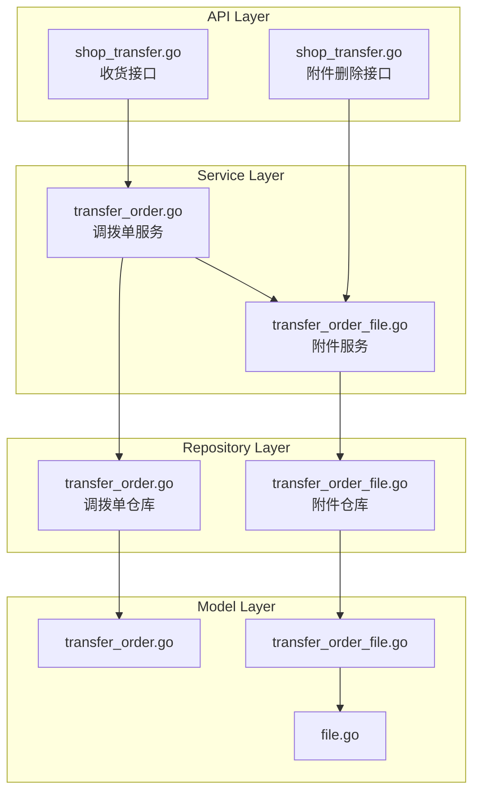

# story-shop-transfer-receive-attachment 技术设计

## 📋 概述

| 项目 | 内容 |
|------|------|
| **Spec ID** | story-shop-transfer-receive-attachment |
| **设计人** | xiezhihuan |
| **设计日期** | 2026-01-28 |
| **总 SP** | 5 |

## 🔄 代码复用分析

### 可复用代码（直接调用）

| 文件 | 说明 | 复用方式 |
|------|------|---------|
| `service/upload_file.go` | `UploadDocument()` 文件上传 | 直接调用 |
| `model/file.go` | File 模型及 `GetUrl()` 方法 | 直接关联 |
| `dto/resp/purchase_receipt.go` | `ReceiptFileInfo` 附件响应结构 | 参考/复用 |

### 可参考代码（复制改名）

| 采购收货文件 | 调拨单对应文件 | 改动点 |
|-------------|---------------|--------|
| `model/purchase_receipt_file.go` | `model/transfer_order_file.go` | 外键改为 `transfer_order_uuid` |
| `repository/purchase_receipt_file.go` | `repository/transfer_order_file.go` | 方法名替换 `ReceiptOrder` → `TransferOrder` |
| `service/purchase_receipt_file.go` | `service/transfer_order_file.go` | 服务名替换，状态常量改为调拨单状态 |

### 需要新建

| 文件 | 说明 |
|------|------|
| `model/transfer_order_file.go` | 调拨单附件关联模型 |
| `repository/transfer_order_file.go` | 调拨单附件数据访问层 |
| `service/transfer_order_file.go` | 调拨单附件服务层 |
| `admin/database/migrations/xxx_create_transfer_order_file.php` | 数据库迁移文件 |

### 需要修改

| 文件 | 修改内容 |
|------|---------|
| `api/v1/shop/shop_transfer.go` | 收货接口增加 FileUuids 参数 |
| `dto/req/transfer_order.go` | 请求 DTO 增加 FileUuids 字段 |
| `dto/resp/transfer_order.go` | 响应 DTO 增加 Files 字段 |
| `service/transfer_order/transfer_order.go` | 集成附件保存逻辑 |
| `admin/database/seeds/shop_01.sql` | 同步新建表结构 |

---

## 🏗️ 架构设计

### 架构图



### 分层说明

| 层级 | 位置 | 职责 |
|------|------|------|
| **API Layer** | `main/app/api/v1/shop/shop_transfer.go` | HTTP Handler，参数校验 |
| **Service Layer** | `main/app/service/transfer_order_file.go` | 附件业务逻辑 |
| **Repository Layer** | `main/app/repository/transfer_order_file.go` | 数据访问 |
| **Model Layer** | `main/app/model/transfer_order_file.go` | 数据模型 |
| **DTO Layer** | `main/app/dto/req/`, `main/app/dto/resp/` | 请求/响应对象 |

---

## 🧩 组件和接口

### Service: TransferOrderFileSrv

**位置**: `main/app/service/transfer_order_file.go`

**接口定义**:
```go
type ITransferOrderFileSrv interface {
    // SaveTransferOrderFiles 保存调拨单附件关联
    SaveTransferOrderFiles(ctx context.Context, transferOrderUuid uint64, fileUuids []uint64) error

    // GetTransferOrderFiles 查询调拨单附件列表
    GetTransferOrderFiles(ctx context.Context, transferOrderUuid uint64) ([]resp.TransferOrderFileInfo, error)

    // DeleteTransferOrderFile 删除调拨单附件
    DeleteTransferOrderFile(ctx context.Context, fileUuid uint64, transferOrderUuid uint64) error

    // DeleteAllTransferOrderFiles 删除调拨单的所有附件
    DeleteAllTransferOrderFiles(ctx context.Context, transferOrderUuid uint64) error

    // ValidateFileLimit 验证附件数量限制（最多10个）
    ValidateFileLimit(ctx context.Context, transferOrderUuid uint64, newFileCount int) error

    // ValidateTransferOrderStatus 验证调拨单状态（待收货状态才能编辑）
    ValidateTransferOrderStatus(ctx context.Context, transferOrderUuid uint64) error
}
```

### Repository: TransferOrderFileRepo

**位置**: `main/app/repository/transfer_order_file.go`

**接口定义**:
```go
type ITransferOrderFileRepo interface {
    // Create 创建附件关联
    Create(file *model.TransferOrderFile) error

    // BatchCreate 批量创建附件关联
    BatchCreate(files []model.TransferOrderFile) error

    // GetByTransferOrderUuid 根据调拨单UUID查询附件
    GetByTransferOrderUuid(transferOrderUuid uint64) ([]model.TransferOrderFile, error)

    // GetByTransferOrderUuidWithFiles 根据调拨单UUID查询附件（预加载文件信息）
    GetByTransferOrderUuidWithFiles(transferOrderUuid uint64) ([]model.TransferOrderFile, error)

    // DeleteByTransferOrderUuid 删除调拨单的所有附件
    DeleteByTransferOrderUuid(transferOrderUuid uint64) error

    // DeleteByFileUuidAndTransferOrderUuid 删除指定文件的关联
    DeleteByFileUuidAndTransferOrderUuid(fileUuid uint64, transferOrderUuid uint64) error

    // CountByTransferOrderUuid 统计调拨单附件数量
    CountByTransferOrderUuid(transferOrderUuid uint64) (int64, error)
}
```

---

## 📊 数据模型

### Model: TransferOrderFile

**位置**: `main/app/model/transfer_order_file.go`

```go
// TransferOrderFile 调拨单附件表 ttpos_transfer_order_file
type TransferOrderFile struct {
    BaseModel
    TransferOrderUuid uint64 `gorm:"column:transfer_order_uuid;type:bigint(20) unsigned;not null;default:0;comment:调拨单UUID;index:idx_transfer_order_uuid" json:"transfer_order_uuid"`
    FileUuid          uint64 `gorm:"column:file_uuid;type:bigint(20) unsigned;not null;default:0;comment:文件UUID;index:idx_file_uuid" json:"file_uuid"`
    SortOrder         int    `gorm:"column:sort_order;type:int(11);not null;default:0;comment:排序顺序" json:"sort_order"`

    // 关联关系
    TransferOrder *TransferOrder `gorm:"foreignKey:TransferOrderUuid;references:Uuid" json:"transfer_order,omitempty"`
    File          *File          `gorm:"foreignKey:FileUuid;references:Uuid" json:"file,omitempty"`
}

func (TransferOrderFile) TableName() string {
    return "ttpos_transfer_order_file"
}
```

### DTO: TransferOrderFileInfo

**位置**: `main/app/dto/resp/transfer_order.go`

```go
// TransferOrderFileInfo 调拨单附件信息
type TransferOrderFileInfo struct {
    FileUuid   uint64 `json:"file_uuid"`   // 文件UUID
    FileName   string `json:"file_name"`   // 文件名
    FileSize   int64  `json:"file_size"`   // 文件大小
    FileType   string `json:"file_type"`   // 文件类型
    Extension  string `json:"extension"`   // 扩展名
    FilePath   string `json:"file_path"`   // 访问URL
    SortOrder  int    `json:"sort_order"`  // 排序
    CreateTime int    `json:"create_time"` // 创建时间
}
```

### 数据库表设计

**表名**: `ttpos_transfer_order_file`

| 字段 | 类型 | 说明 |
|------|------|------|
| id | BIGINT UNSIGNED | 主键 |
| uuid | BIGINT UNSIGNED | 唯一标识 |
| transfer_order_uuid | BIGINT UNSIGNED | 调拨单UUID（索引） |
| file_uuid | BIGINT UNSIGNED | 文件UUID（索引） |
| sort_order | INT | 排序顺序 |
| create_time | INT | 创建时间 |
| update_time | INT | 更新时间 |
| delete_time | INT | 删除时间（软删除） |

---

## 🔌 API 设计

### 1. 修改：确认收货接口

| 项目 | 内容 |
|------|------|
| Method | POST |
| Path | `/api/v1/shop/transfer/confirm_receive` |
| 变更 | 请求增加 `file_uuids` 字段 |

**请求变更**:
```go
type TransferOrderConfirmReceiveReq struct {
    // ... 现有字段
    FileUuids []uint64 `json:"file_uuids"` // 附件UUID列表（必填）
}
```

**业务规则**:
- 确认收货时 `file_uuids` 必填，为空返回错误："请上传相关附件后确定收货"

### 2. 修改：保存收货接口

| 项目 | 内容 |
|------|------|
| Method | POST |
| Path | `/api/v1/shop/transfer/save_receive` |
| 变更 | 请求增加 `file_uuids` 字段 |

**请求变更**:
```go
type TransferOrderSaveReceiveReq struct {
    // ... 现有字段
    FileUuids []uint64 `json:"file_uuids"` // 附件UUID列表（可选）
}
```

**业务规则**:
- 保存时 `file_uuids` 可选，允许无附件保存

### 3. 新增：删除附件接口

| 项目 | 内容 |
|------|------|
| Method | DELETE |
| Path | `/api/v1/shop/transfer/file` |
| 请求 | `req.DeleteTransferOrderFileReq` |
| 响应 | 标准响应 |

**请求**:
```go
type DeleteTransferOrderFileReq struct {
    TransferOrderUuid uint64 `json:"transfer_order_uuid" binding:"required"` // 调拨单UUID
    FileUuid          uint64 `json:"file_uuid" binding:"required"`           // 文件UUID
}
```

**业务规则**:
- 仅待收货状态（Status=3）可删除附件

### 4. 修改：调拨单详情响应

**响应变更**:
```go
type TransferOrderDetailResp struct {
    // ... 现有字段
    Files []TransferOrderFileInfo `json:"files"` // 附件列表
}
```

---

## 🔐 状态控制

### 调拨单状态常量

| 常量 | 值 | 说明 | 附件操作 |
|------|------|------|---------|
| `TransferOrderStatusDraft` | 0 | 待提交 | - |
| `TransferOrderStatusPending` | 1 | 待审核 | - |
| `TransferOrderStatusRejected` | 2 | 已驳回 | - |
| `TransferOrderStatusReceiving` | 3 | 待收货 | 可上传/删除/预览/下载 |
| `TransferOrderStatusCompleted` | 4 | 已完成 | 仅预览/下载 |

### 状态校验逻辑

```go
func (s *transferOrderFileSrv) ValidateTransferOrderStatus(ctx context.Context, transferOrderUuid uint64) error {
    db := ctx.GetDB()
    repo := repository.NewTransferOrderRepo(db)

    order, err := repo.GetByUuid(transferOrderUuid)
    if err != nil {
        return errors.WithMessage(err, "调拨单不存在")
    }

    // 仅待收货状态可以编辑附件
    if order.Status != constant.TransferOrderStatusReceiving {
        return errors.New("仅待收货状态的调拨单可以修改附件")
    }

    return nil
}
```

---

## ⚠️ 风险识别

| 风险 | 影响 | 缓解措施 |
|------|------|---------|
| 附件保存失败影响收货流程 | 中 | 附件保存放在事务外，失败仅记录日志不影响主流程 |
| 旧版本 App 无附件字段 | 低 | 后端兼容空数组，前端版本检测提示升级 |
| 并发上传导致超出限制 | 低 | 在数据库层做数量校验，使用事务保证一致性 |

---

## 🧪 测试策略

### 目标覆盖率

| 层级 | 覆盖率目标 |
|------|-----------|
| `service/transfer_order_file.go` | ≥ 80% |
| `repository/transfer_order_file.go` | ≥ 70% |

### 测试用例

| 场景 | 输入 | 期望结果 |
|------|------|---------|
| 正常保存附件 | 有效 fileUuids | 保存成功 |
| 超出数量限制 | 11个 fileUuids | 返回"最多支持10个附件" |
| 非待收货状态删除 | 已完成订单 | 返回"仅待收货状态可修改附件" |
| 确认收货无附件 | 空 fileUuids | 返回"请上传相关附件后确定收货" |

### 测试命令

```bash
cd main && go test -coverprofile=coverage.out ./app/service/transfer_order_file*.go
cd main && go tool cover -html=coverage.out
```

---

**版本**: v1.0.0
**设计日期**: 2026-01-28
