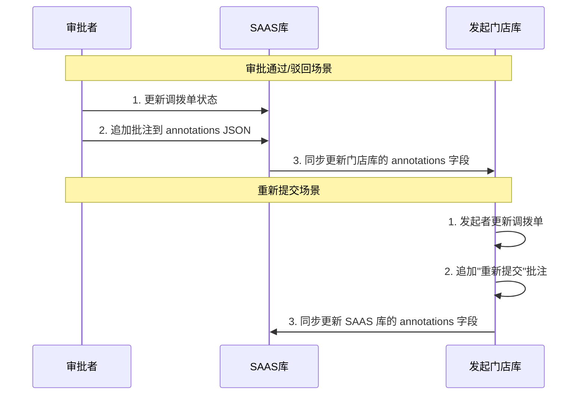

# story-shop-transfer-resubmit-annotation 技术设计

## 📋 概述

| 项目 | 内容 |
|------|------|
| Spec ID | story-shop-transfer-resubmit-annotation |
| 设计人 | xiezhihuan |
| 设计日期 | 2026-01-27 |
| 总 SP | 5 |

---

## 🔄 代码复用分析

### 可复用代码

| 文件 | 说明 | 复用方式 |
|------|------|---------|
| `main/app/constant/stock_reconciliation_annotation.go` | 盘点单批注常量 | 参考常量定义 |
| `main/app/service/transfer_order/transfer_order.go` | 调拨单服务 | 扩展 approve/reject 方法 |
| `main/app/api/v1/shop/shop_transfer.go` | 调拨单 API | 扩展新接口 |

### 需要新建/修改

| 文件 | 说明 |
|------|------|
| `main/app/constant/transfer_order_annotation.go` | 调拨单批注常量（操作类型定义） |
| `main/app/dto/resp/transfer_order_annotation.go` | 批注响应 DTO（TransferOrderAnnotationItem） |
| `main/app/model/transfer_order.go` | **修改**：新增 `annotations` JSON 字段 |

### ~~已废弃~~（不再使用独立批注表）

| 文件 | 说明 |
|------|------|
| ~~`main/app/model/transfer_order_annotation.go`~~ | ~~调拨单批注模型~~ |
| ~~`main/app/repository/transfer_order_annotation_repo.go`~~ | ~~调拨单批注仓库~~ |

> **架构变更说明**：由于调拨单同时存在于 SAAS 库和门店库，审批者从 SAAS 库查询调拨单信息，独立批注表方案无法满足跨库可见性需求。改为在调拨单主表中使用 JSON 字段存储批注列表。

---

## 🏗️ 架构设计

### 数据存储架构

```
┌─────────────────────────────────────────────────────────────────────┐
│                        调拨单数据分布                                 │
├─────────────────────────────────────────────────────────────────────┤
│                                                                     │
│   ┌─────────────────┐              ┌─────────────────┐              │
│   │   SAAS 主库      │              │   门店库         │              │
│   │   (saas_db)     │              │   (shop_xxx)    │              │
│   ├─────────────────┤              ├─────────────────┤              │
│   │ transfer_order  │◄────同步────►│ transfer_order  │              │
│   │ ├─ ...          │              │ ├─ ...          │              │
│   │ └─ annotations  │   (JSON)     │ └─ annotations  │              │
│   │    (JSON TEXT)  │              │    (JSON TEXT)  │              │
│   └─────────────────┘              └─────────────────┘              │
│          ▲                                  ▲                       │
│          │                                  │                       │
│   审批者查询/更新                      发起者查询/更新                │
│                                                                     │
└─────────────────────────────────────────────────────────────────────┘
```

### 批注同步流程



### 分层说明

- **API Layer**: `main/app/api/v1/shop/shop_transfer.go` - 新增 resubmit 接口
- **Service Layer**: `main/app/service/transfer_order/` - 扩展调拨单服务，处理批注 JSON 更新和跨库同步
- **Repository Layer**: `main/app/repository/` - TransferOrderRepo（无需独立批注仓库）
- **Model Layer**: `main/app/model/transfer_order.go` - 新增 `Annotations` JSON 字段
- **DTO Layer**: `main/app/dto/req/`, `main/app/dto/resp/` - 批注相关 DTO

---

## 🧩 组件和接口

### Constant: TransferOrderAnnotationType

**位置**: `main/app/constant/transfer_order_annotation.go`

```go
const (
    // TransferOrderAnnotationTypeResubmit 批注类型-重新提交
    TransferOrderAnnotationTypeResubmit = 1
    // TransferOrderAnnotationTypeShopApprove 批注类型-门店通过
    TransferOrderAnnotationTypeShopApprove = 2
    // TransferOrderAnnotationTypeShopReject 批注类型-门店驳回
    TransferOrderAnnotationTypeShopReject = 3
    // TransferOrderAnnotationTypeParentApprove 批注类型-上级门店通过
    TransferOrderAnnotationTypeParentApprove = 4
    // TransferOrderAnnotationTypeParentReject 批注类型-上级门店驳回
    TransferOrderAnnotationTypeParentReject = 5
    // TransferOrderAnnotationTypeShipperApprove 批注类型-发货门店通过（调入）
    TransferOrderAnnotationTypeShipperApprove = 6
    // TransferOrderAnnotationTypeShipperReject 批注类型-发货门店驳回（调入）
    TransferOrderAnnotationTypeShipperReject = 7
    // TransferOrderAnnotationTypeReceiverApprove 批注类型-收货门店通过（调出）
    TransferOrderAnnotationTypeReceiverApprove = 8
    // TransferOrderAnnotationTypeReceiverReject 批注类型-收货门店驳回（调出）
    TransferOrderAnnotationTypeReceiverReject = 9
)

// TransferOrderAnnotationTypeLocaleNameMap 批注类型多语言名称映射
var TransferOrderAnnotationTypeLocaleNameMap = map[int]dto.LocaleResponse{
    TransferOrderAnnotationTypeResubmit:        {ZH: "重新提交", EN: "Resubmit", TH: "ส่งใหม่"},
    TransferOrderAnnotationTypeShopApprove:     {ZH: "门店通过", EN: "Store Approved", TH: "ร้านค้าอนุมัติ"},
    TransferOrderAnnotationTypeShopReject:      {ZH: "门店驳回", EN: "Store Rejected", TH: "ร้านค้าปฏิเสธ"},
    TransferOrderAnnotationTypeParentApprove:   {ZH: "上级门店通过", EN: "Parent Store Approved", TH: "ร้านค้าระดับบนอนุมัติ"},
    TransferOrderAnnotationTypeParentReject:    {ZH: "上级门店驳回", EN: "Parent Store Rejected", TH: "ร้านค้าระดับบนปฏิเสธ"},
    TransferOrderAnnotationTypeShipperApprove:  {ZH: "发货门店通过", EN: "Shipper Approved", TH: "ร้านค้าผู้ส่งอนุมัติ"},
    TransferOrderAnnotationTypeShipperReject:   {ZH: "发货门店驳回", EN: "Shipper Rejected", TH: "ร้านค้าผู้ส่งปฏิเสธ"},
    TransferOrderAnnotationTypeReceiverApprove: {ZH: "收货门店通过", EN: "Receiver Approved", TH: "ร้านค้าผู้รับอนุมัติ"},
    TransferOrderAnnotationTypeReceiverReject:  {ZH: "收货门店驳回", EN: "Receiver Rejected", TH: "ร้านค้าผู้รับปฏิเสธ"},
}
```

### Model: TransferOrder 扩展

**位置**: `main/app/model/transfer_order.go`

**新增字段**:
```go
// TransferOrder 调拨单主表 ttpos_transfer_order
type TransferOrder struct {
    // ... 现有字段 ...

    // 批注列表（JSON 格式存储）
    Annotations string `gorm:"column:annotations;type:text;comment:批注列表JSON" json:"annotations"`
}

// TransferOrderAnnotationJSON 批注 JSON 结构（用于序列化/反序列化）
type TransferOrderAnnotationJSON struct {
    AnnotationType int    `json:"annotation_type"` // 批注类型
    Content        string `json:"content"`         // 批注内容
    CreateTime     int64  `json:"create_time"`     // 创建时间
}
```

**JSON 存储格式**:
```json
[
    {"annotation_type": 3, "content": "门店审核通过", "create_time": 1706356800},
    {"annotation_type": 1, "content": "修改了物品数量后重新提交", "create_time": 1706356900}
]
```

### Helper: 批注操作辅助方法

**位置**: `main/app/service/transfer_order/helper.go`

```go
// AppendAnnotation 追加批注到调拨单
func (h *transferOrderHelper) AppendAnnotation(
    transferOrder *model.TransferOrder,
    annotationType int,
    content string,
) error

// GetAnnotationList 从调拨单获取批注列表
func (h *transferOrderHelper) GetAnnotationList(
    transferOrder *model.TransferOrder,
) ([]model.TransferOrderAnnotationJSON, error)

// SyncAnnotationsToStore 同步批注到门店库
func (h *transferOrderHelper) SyncAnnotationsToStore(
    ctx context.Context,
    transferOrderUuid uint64,
    annotations string,
) error
```

### Service: ITransferOrderSrv 扩展

**位置**: `main/app/service/transfer_order/transfer_order.go`

```go
// 扩展现有方法
UpdateTransferOrder(ctx *context.Context, req req.TransferOrderUpdateReq) error
    // req 新增 IsSubmit、IsConfirm 字段和 isResubmit 私有字段（带 getter/setter）
    // 当 isResubmit=true 且状态为已驳回时，执行重新提交逻辑
GetTransferOrderDetail(ctx, req) (*resp, error)  // resp 新增 AnnotationList、LatestAnnotation 字段
ApproveTransferOrder(ctx *context.Context, req req.TransferOrderApproveReq) error  // req 新增 Annotation 字段
RejectTransferOrder(ctx *context.Context, req req.TransferOrderRejectReq) error    // req 新增 Annotation 字段
```

**注意**: 重新提交功能通过扩展 `UpdateTransferOrder` 实现，而非独立方法。API Handler `/shop/transfer/order/resubmit` 内部调用 `UpdateTransferOrder` 并设置 `SetIsResubmit(true)`。

---

## 📊 数据模型

### 表变更: ttpos_transfer_order

**新增字段**:

| 字段 | 类型 | 说明 |
|------|------|------|
| annotations | TEXT | 批注列表 JSON |

### 数据库迁移

**位置**: `admin/database/migrations/{timestamp}_add_annotations_to_transfer_order.php`

```php
<?php
const TARGET = 'all';  // 同时应用到 SAAS 库和所有门店库

use think\migration\Migrator;

class AddAnnotationsToTransferOrder extends Migrator
{
    public function change()
    {
        $table = $this->table('transfer_order');

        if (!$table->hasColumn('annotations')) {
            $table->addColumn('annotations', 'text', [
                'null' => true,
                'after' => 'remark',
                'comment' => '批注列表JSON'
            ])->update();
        }
    }
}
```

### 批注 JSON 结构

```json
[
    {
        "annotation_type": 2,
        "content": "同意调拨申请",
        "create_time": 1706356800
    },
    {
        "annotation_type": 1,
        "content": "修改数量后重新提交",
        "create_time": 1706356900
    }
]
```

**说明**: 批注按时间正序存储（追加到数组末尾），展示时按时间倒序排列。

---

## 📋 业务规则

### 重新提交审核规则

```
调拨单审核流程示例（3级审核）：
门店审核 → 上级门店审核 → 发货/收货门店审核

驳回场景：
┌─────────────────────────────────────────────────────────┐
│ 场景1: 第1轮门店审核驳回                                  │
│   → 重新提交 → 回到第1轮门店审核                          │
├─────────────────────────────────────────────────────────┤
│ 场景2: 第2轮上级门店审核驳回                              │
│   → 重新提交 → 回到第1轮门店审核（不是第2轮）              │
├─────────────────────────────────────────────────────────┤
│ 场景3: 第3轮发货/收货门店审核驳回                         │
│   → 重新提交 → 回到第1轮门店审核（不是第3轮）              │
└─────────────────────────────────────────────────────────┘
```

**核心规则**: 无论在哪个审核节点被驳回，重新提交后都**回到最初的第一轮门店审核**，需要重新走完整个审核流程。

### 技术实现

#### 重新提交时需要重置的状态
1. **调拨单主状态**: `status` 从 `TransferOrderStatusRejected(2)` 改为 `TransferOrderStatusPending(1)`
2. **审批节点状态**: 重置所有审批节点（sender/sender_parent/receiver/receiver_parent）的状态为初始状态
3. **追加批注**: 在 `annotations` JSON 中追加"重新提交"批注记录

#### 批注跨库同步规则

| 操作场景 | 操作库 | 同步目标库 | 说明 |
|---------|-------|-----------|------|
| 重新提交 | 门店库 | SAAS 库 | 发起者在门店库操作，需同步到 SAAS 库 |
| 审批通过 | SAAS 库 | 门店库 | 审批者在 SAAS 库操作，需同步到发起门店库 |
| 审批驳回 | SAAS 库 | 门店库 | 审批者在 SAAS 库操作，需同步到发起门店库 |

#### 同步实现方式

```go
// 审批者操作后同步到门店库
func syncAnnotationsToStoreDB(ctx context.Context, transferOrder *model.TransferOrder) error {
    // 1. 获取发起门店的数据库连接
    storeDB := getStoreDB(transferOrder.CompanyUuid)

    // 2. 更新门店库中的调拨单 annotations 字段
    return storeDB.Model(&model.TransferOrder{}).
        Where("uuid = ?", transferOrder.Uuid).
        Update("annotations", transferOrder.Annotations).Error
}

// 发起者重新提交后同步到 SAAS 库
func syncAnnotationsToSaasDB(ctx context.Context, transferOrder *model.TransferOrder) error {
    // 1. 获取 SAAS 主库连接
    saasDB := getSaasDB()

    // 2. 更新 SAAS 库中的调拨单 annotations 字段
    return saasDB.Model(&model.TransferOrder{}).
        Where("uuid = ?", transferOrder.Uuid).
        Update("annotations", transferOrder.Annotations).Error
}
```

---

## 🔌 API 设计

### POST /shop/transfer/order/resubmit

| 项目 | 内容 |
|------|------|
| Method | POST |
| Path | /shop/transfer/order/resubmit |
| 请求 | req.TransferOrderUpdateReq（内部设置 isResubmit=true） |
| 响应 | dto.Response{} |

**请求参数**:
```go
type TransferOrderUpdateReq struct {
    Uuid                uint64                       `json:"uuid" binding:"required"`
    OrderTime           int64                        `json:"order_time"`
    SenderCompanyUuid   uint64                       `json:"sender_company_uuid"`
    ReceiverCompanyUuid uint64                       `json:"receiver_company_uuid"`
    OutWarehouseErpCode string                       `json:"out_warehouse_erp_code"`
    InWarehouseErpCode  string                       `json:"in_warehouse_erp_code"`
    Remark              string                       `json:"remark"`
    Items               []TransferOrderItemCreateReq `json:"items"`
    isResubmit          bool                         // 内部标记（Handler 设置）
}

// getter/setter 方法
func (r *TransferOrderUpdateReq) GetIsResubmit() bool
func (r *TransferOrderUpdateReq) SetIsResubmit(isResubmit bool)
```

**业务逻辑**:
1. Handler 调用 `req.SetIsResubmit(true)` 标记为重新提交场景
2. Service 验证单据状态为"已驳回"
3. 验证操作人为原发起人
4. 更新单据内容
5. 创建"重新提交"批注记录
6. **重置审核流程**：无论在哪个审核节点被驳回，重新提交后都回到第一轮门店审核
7. 更新单据状态为"待审核"（第一轮）

---

### GET /shop/transfer/order/detail（扩展）

| 项目 | 内容 |
|------|------|
| Method | GET |
| Path | /shop/transfer/order/detail |
| 请求 | req.TransferOrderDetailReq |
| 响应 | resp.TransferOrderDetailResp（扩展） |

**响应参数扩展**:
```go
type TransferOrderDetailResp struct {
    // ... 现有字段
    AnnotationList    []TransferOrderAnnotationItem `json:"annotation_list"`    // 批注列表（按时间倒序）
    LatestAnnotation  string                        `json:"latest_annotation"`  // 最新批注摘要（最多8字符）
}

type TransferOrderAnnotationItem struct {
    Uuid                 uint64             `json:"uuid"`
    AnnotationType       int                `json:"annotation_type"`
    LocaleAnnotationName dto.LocaleResponse `json:"locale_annotation_name"` // 操作类型名称（多语言）
    Content              string             `json:"content"`
    CreateTime           int64              `json:"create_time"`
}
```

**多语言响应示例**:
```json
{
    "uuid": 123456,
    "annotation_type": 2,
    "locale_annotation_name": {
        "zh": "门店通过",
        "en": "Store Approved",
        "th": "ร้านค้าอนุมัติ"
    },
    "content": "审核通过，同意调拨",
    "create_time": 1706356800
}
```

---

### POST /shop/transfer/order/approve（扩展）

**请求参数扩展**:
```go
type TransferOrderApproveReq struct {
    Uuid       uint64 `json:"uuid" binding:"required"`
    Annotation string `json:"annotation"` // 新增：批注内容（非必填）
}
```

---

### POST /shop/transfer/order/reject（扩展）

**请求参数扩展**:
```go
type TransferOrderRejectReq struct {
    Uuid       uint64 `json:"uuid" binding:"required"`
    Annotation string `json:"annotation"` // 新增：批注内容（非必填）
}
```

---

## ⚠️ 风险识别

| 风险 | 影响 | 缓解措施 |
|------|------|---------|
| 跨库数据同步一致性 | 高 | 使用事务保证，同步失败时记录日志并重试 |
| JSON 字段查询性能 | 低 | 批注列表通常较小，且只在详情接口使用 |
| 多审核节点操作类型复杂 | 中 | 使用常量映射表，明确定义每种操作类型 |
| 需要区分调入/调出场景 | 低 | 在 Service 层根据调拨类型自动选择正确的操作类型 |
| approve/reject 接口变更需要前端配合 | 低 | 新增字段为非必填，向后兼容 |

---

## 🧪 测试策略

**目标覆盖率**:
- main/app/service/transfer_order: 80%+

**测试场景**:
1. 重新提交审核 - 状态验证、权限验证、批注追加、SAAS 库同步
2. 批注列表查询 - 从 JSON 解析、按时间倒序、摘要截取
3. 审批通过+批注 - 批注追加、门店库同步
4. 审批驳回+批注 - 批注追加、门店库同步
5. 多次驳回重提 - 完整时间线展示、JSON 累积正确
6. 跨库同步失败 - 错误处理、日志记录

**测试命令**:
```bash
cd main && go test -coverprofile=coverage.out ./app/service/transfer_order/...
cd main && go tool cover -html=coverage.out
```

---

**版本**: v2.0.0
**创建日期**: 2026-01-27
**更新日期**: 2026-01-27

### 变更记录

| 版本 | 日期 | 变更内容 |
|------|------|----------|
| v2.0.0 | 2026-01-27 | **架构重构**：废弃独立批注表，改用调拨单主表 JSON 字段存储批注，支持跨库（SAAS/门店）同步 |
| v1.1.0 | 2026-01-27 | 1. 批注类型名称改为多语言（LocaleAnnotationName）<br>2. 重新提交通过扩展 UpdateTransferOrder 实现 |
| v1.0.0 | 2026-01-27 | 初始版本 |
