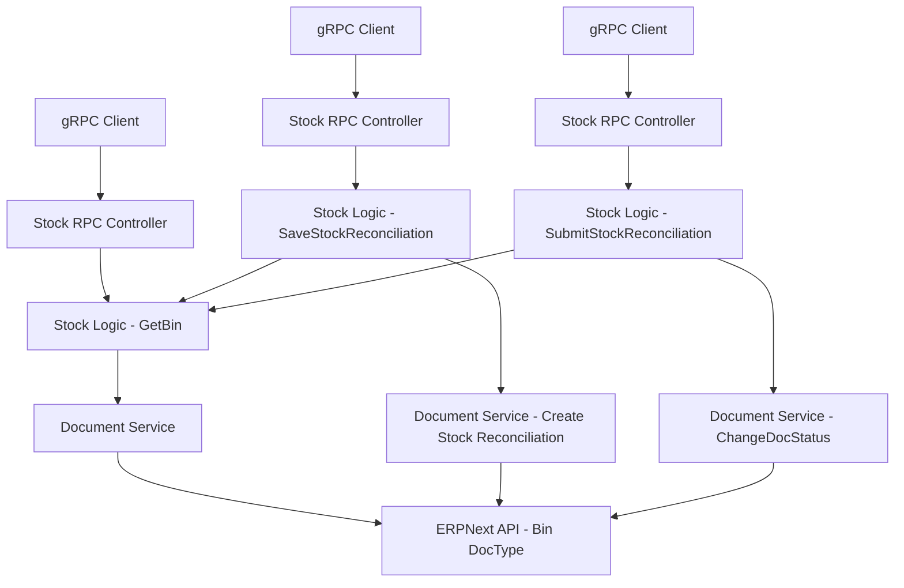

# 优化库存盘点估值率逻辑 设计文档

> 本文档定义 优化库存盘点估值率逻辑 的技术设计和实现方案。

## 📋 概述

本需求旨在优化 ttpos-erp 模块中的库存盘点估值率逻辑，解决当前强制赋值估值率为 1 导致覆盖 ERPNext 真实估值率的问题。核心改进包括：

1. **新增 Bin 查询服务**：实现 gRPC 服务查询 ERPNext Bin 表，获取物品在指定仓库的真实估值率
2. **优化盘点保存逻辑**：移除强制赋值，改为从 Bin 表读取真实估值率
3. **增加提交验证**：在盘点提交时验证估值率有效性，若为空则阻止提交

本需求仅涉及 ttpos-bmp 项目中的 ttpos-erp 后端模块，不涉及数据库表结构变更和前端改动。

---

## 🎯 规范对齐

### Go BMP 规范 (go-bmp.mdc)

本设计严格遵循 Go BMP 开发规范：

- **项目结构**: 遵循 GoFrame 2.x 标准目录结构
- **Controller 分层**: RPC Controller 处理 gRPC 请求，调用 Logic 层
- **Logic 层**: 实现业务逻辑，依赖 Service 接口
- **Service 层**: 封装第三方调用（ERPNext Document API）
- **Protobuf 规范**: 使用 proto3 语法，遵循命名规范
- **禁止修改**: dao/entity/do/ 目录（自动生成）
- **错误处理**: 不使用 panic，返回 error
- **日志记录**: 使用 g.Log() 记录关键操作

### API 设计规范 (api.mdc)

- **gRPC 接口**: 遵循 Protobuf 规范
- **错误码**: 使用 gRPC Status Code
- **响应消息**: 包含详细的错误信息
- **参数验证**: 使用 Protobuf 验证

### 数据库规范 (database.mdc)

- **不涉及数据库变更**: 本需求通过 ERPNext Document API 查询 Bin 表，无需本地表
- **数据来源**: 所有估值率数据来自 ERPNext Bin 表

---

## 🔄 代码复用分析

### 可复用的现有组件

#### ERPNext Document Service

- **路径**: `ttpos-bmp/app/ttpos-erp/internal/service/document.go`
- **用途**: 封装 ERPNext Document API 调用
- **复用方式**: 
  - 使用 `service.Document().List()` 查询 Bin 表数据
  - 使用 `service.Document().Get()` 获取单条 Bin 记录
- **参数示例**:
  ```go
  resp, err := service.Document().List(ctx, &erp.ErpReq{
      DocType: "Bin",
  }, &erp.RequestParams{
      Fields: g.ArrayStr{"item_code", "warehouse", "actual_qty", "valuation_rate"},
      Filters: [][]string{
          {"item_code", "=", itemCode},
          {"warehouse", "=", warehouse},
      },
  })
  ```

#### Stock Reconciliation Logic

- **路径**: `ttpos-bmp/app/ttpos-erp/internal/logic/stock/stock_reconciliation.go`
- **用途**: 现有盘点保存和提交逻辑
- **扩展方式**:
  - 在 `SaveStockReconciliation` 方法中集成 Bin 查询
  - 在 `SubmitStockReconciliation` 方法中添加估值率验证

#### Company Service

- **路径**: `ttpos-bmp/app/ttpos-erp/internal/service/company.go`
- **用途**: 获取公司信息
- **复用方式**: 
  - `service.Company().GetCompanyWithAbbr(ctx, companyAbbr)` 获取公司全称

### 集成点

#### Stock gRPC Service

- **现有 Protobuf**: `ttpos-bmp/app/ttpos-erp/manifest/protobuf/stock/stock.proto`
- **扩展方式**: 在 stock.proto 中新增 GetBin 相关消息定义
- **Controller**: `ttpos-bmp/app/ttpos-erp/internal/controller/rpc/stock/stock.go`
- **Logic**: `ttpos-bmp/app/ttpos-erp/internal/logic/stock/stock.go`

#### ERPNext Bin 表

- **DocType**: `Bin`
- **关键字段**:
  - `item_code`: 物品代码
  - `warehouse`: 仓库名称
  - `actual_qty`: 实际库存数量
  - `valuation_rate`: 估值率
  - `stock_value`: 库存价值
- **查询逻辑**: 按 `item_code` 和 `warehouse` 过滤

---

## 🏗️ 架构设计

### 分层设计原则

**Go BMP 三层架构**:

```
gRPC Controller (RPC)
  ↓ 调用
Logic 层 (Business Logic)
  ↓ 依赖
Service 层 (Third-party Integration)
  ↓ 调用
ERPNext API (External System)
```

**依赖规则**:

- ✅ Controller 只调用 Logic 层
- ✅ Logic 层依赖 Service 接口
- ✅ Service 层封装第三方调用
- ❌ Logic 层不能直接调用第三方 API
- ❌ 禁止跨层调用

### 架构图



### 模块划分

#### ttpos-erp 模块 (ttpos-bmp)

- **Protobuf 定义**: `ttpos-bmp/app/ttpos-erp/manifest/protobuf/stock/stock.proto`
  - 新增 `GetBinReq` 和 `GetBinResp` 消息
  
- **API 生成**: `ttpos-bmp/app/ttpos-erp/api/stock/stock.pb.go`
  - 自动生成 gRPC 接口代码（禁止手动修改）
  
- **RPC Controller**: `ttpos-bmp/app/ttpos-erp/internal/controller/rpc/stock/stock.go`
  - 新增 `GetBin` gRPC 方法
  
- **Logic 层**: `ttpos-bmp/app/ttpos-erp/internal/logic/stock/`
  - `stock_bin.go`: 新建文件，实现 `GetBin` 方法（Bin 表查询）
  - `stock_reconciliation.go`: 修改 `SaveStockReconciliation` 和 `SubmitStockReconciliation` 方法
  
- **Service 层**: `ttpos-bmp/app/ttpos-erp/internal/service/document.go`
  - 复用现有 Document Service
  
- **Model DTO**: `ttpos-bmp/app/ttpos-erp/internal/model/dto/erp/`
  - 新增 `Bin` DTO（如需要）

---

## 🗄️ 数据库设计

### 无数据库变更

本需求不涉及数据库表结构变更，所有数据查询通过 ERPNext Document API 完成。

### ERPNext Bin 表结构（参考）

虽然不在本地创建表，但需要了解 ERPNext Bin 表结构：

```json
{
  "name": "Bin",
  "fields": [
    {"fieldname": "item_code", "fieldtype": "Link", "options": "Item"},
    {"fieldname": "warehouse", "fieldtype": "Link", "options": "Warehouse"},
    {"fieldname": "actual_qty", "fieldtype": "Float"},
    {"fieldname": "valuation_rate", "fieldtype": "Currency"},
    {"fieldname": "stock_value", "fieldtype": "Currency"},
    {"fieldname": "reserved_qty", "fieldtype": "Float"},
    {"fieldname": "projected_qty", "fieldtype": "Float"}
  ]
}
```

**参考**: https://github.com/frappe/erpnext/blob/develop/erpnext/stock/doctype/bin/bin.json

---

## 📊 数据模型

### Protobuf 定义

#### GetBinReq

```protobuf
message GetBinReq {
  string item_code = 1;      // 物品代码（必填）
  string warehouse = 2;      // 仓库名称（必填）
  string company_abbr = 3;   // 公司简称（必填）
}
```

#### GetBinResp

```protobuf
message GetBinResp {
  int32 code = 1;            // 响应码（1=成功，0=失败）
  string message = 2;        // 响应消息
  BinData data = 3;          // Bin 数据
}

message BinData {
  string item_code = 1;      // 物品代码
  string warehouse = 2;      // 仓库名称
  double actual_qty = 3;     // 实际库存数量
  double valuation_rate = 4; // 估值率
  double stock_value = 5;    // 库存价值
}
```

### Go DTO（如需要）

```go
// ttpos-bmp/app/ttpos-erp/internal/model/dto/erp/bin.go
type Bin struct {
    ItemCode       string  `json:"item_code"`
    Warehouse      string  `json:"warehouse"`
    ActualQty      float64 `json:"actual_qty"`
    ValuationRate  float64 `json:"valuation_rate"`
    StockValue     float64 `json:"stock_value"`
}
```

---

## 🔌 API 设计

### gRPC API

#### API 1: GetBin - 查询 Bin 记录

**Protobuf 定义**:

```protobuf
// ttpos-bmp/app/ttpos-erp/manifest/protobuf/stock/stock.proto

service Stock {
  // 现有方法...
  
  // 查询物品在指定仓库的 Bin 记录
  rpc GetBin (GetBinReq) returns (GetBinResp);
}

message GetBinReq {
  string item_code = 1;      // 物品代码
  string warehouse = 2;      // 仓库名称
  string company_abbr = 3;   // 公司简称
}

message GetBinResp {
  int32 code = 1;
  string message = 2;
  BinData data = 3;
}

message BinData {
  string item_code = 1;
  string warehouse = 2;
  double actual_qty = 3;
  double valuation_rate = 4;
  double stock_value = 5;
}
```

**请求示例**:

```json
{
  "item_code": "ITEM-001",
  "warehouse": "Main Store",
  "company_abbr": "TT"
}
```

**响应示例（成功）**:

```json
{
  "code": 1,
  "message": "success",
  "data": {
    "item_code": "ITEM-001",
    "warehouse": "Main Store",
    "actual_qty": 100.0,
    "valuation_rate": 50.5,
    "stock_value": 5050.0
  }
}
```

**响应示例（无数据）**:

```json
{
  "code": 1,
  "message": "success",
  "data": {
    "item_code": "ITEM-001",
    "warehouse": "Main Store",
    "actual_qty": 0.0,
    "valuation_rate": 0.0,
    "stock_value": 0.0
  }
}
```

**响应示例（错误）**:

```json
{
  "code": 0,
  "message": "查询 Bin 记录失败: ERPNext API 调用失败",
  "data": {}
}
```

#### API 2: SaveStockReconciliation - 保存盘点单（已有，需修改）

**现有逻辑**:
- 当 `item.ValuationRate` 为 0 时，强制赋值为 1

**新逻辑**:
1. 当 `item.ValuationRate` 为 0 时，调用 `GetBin` 查询真实估值率
2. 若查询到估值率 > 0，使用该值
3. 若查询到估值率 = 0 或无记录，使用保底值 1（保持兼容性）
4. 记录日志：估值率来源（Bin 查询或保底值）

#### API 3: SubmitStockReconciliation - 提交盘点单（已有，需修改）

**现有逻辑**:
- 直接提交盘点单到 ERPNext

**新逻辑**:
1. 提交前查询盘点单详情
2. 遍历盘点物品，检查估值率是否为 0 或 1
3. 若存在无效估值率，返回错误并阻止提交
4. 错误提示格式：`"物品 [物品代码] 在仓库 [仓库名] 的估值率为空，无法提交盘点单。请先通过采购入库建立库存。"`
5. 若验证通过，正常提交盘点单

---

## 🧩 组件和接口

### RPC Controller 层

#### Stock Controller

```go
// ttpos-bmp/app/ttpos-erp/internal/controller/rpc/stock/stock.go

type Controller struct {
    stock.UnimplementedStockServer
}

// GetBin 查询 Bin 记录
func (c *Controller) GetBin(ctx context.Context, req *stock.GetBinReq) (*stock.GetBinResp, error) {
    // 参数验证
    if req.ItemCode == "" || req.Warehouse == "" || req.CompanyAbbr == "" {
        return &stock.GetBinResp{
            Code:    0,
            Message: "参数错误：item_code, warehouse, company_abbr 为必填项",
            Data:    &stock.BinData{},
        }, nil
    }

    // 调用 Logic 层
    bin, err := service.Stock().GetBin(ctx, req)
    if err != nil {
        g.Log().Error(ctx, "GetBin 失败", err)
        return &stock.GetBinResp{
            Code:    0,
            Message: fmt.Sprintf("查询 Bin 记录失败: %v", err),
            Data:    &stock.BinData{},
        }, nil
    }

    return bin, nil
}

// SaveStockReconciliation 保存盘点单（已有，需修改）
// SubmitStockReconciliation 提交盘点单（已有，需修改）
```

### Logic 层

#### Stock Logic - GetBin

```go
// ttpos-bmp/app/ttpos-erp/internal/logic/stock/stock_bin.go

// GetBin 查询物品在指定仓库的 Bin 记录
func (s *sStock) GetBin(ctx context.Context, req *stock.GetBinReq) (*stock.GetBinResp, error) {
    // 获取公司信息
    company, err := service.Company().GetCompanyWithAbbr(ctx, req.CompanyAbbr)
    if err != nil {
        return nil, gerror.Wrapf(err, "获取公司信息失败")
    }

    // 查询 Bin 表
    resp, err := service.Document().List(ctx, &erp.ErpReq{
        DocType: "Bin",
    }, &erp.RequestParams{
        Fields: g.ArrayStr{
            "item_code", "warehouse", "actual_qty", "valuation_rate", "stock_value",
        },
        Filters: [][]string{
            {"item_code", "=", req.ItemCode},
            {"warehouse", "=", req.Warehouse},
        },
        Limit: 1,
    })

    if err != nil {
        g.Log().Warningf(ctx, "查询 Bin 记录失败: item_code=%s, warehouse=%s, error=%v", 
            req.ItemCode, req.Warehouse, err)
        return nil, gerror.Wrapf(err, "查询 Bin 记录失败")
    }

    // 解析响应
    j := resp
    dataArray := j.GetJsons("data")
    
    // 构建响应
    binData := &stock.BinData{
        ItemCode:  req.ItemCode,
        Warehouse: req.Warehouse,
    }

    if len(dataArray) > 0 {
        data := dataArray[0]
        binData.ActualQty = data.Get("actual_qty").Float64()
        binData.ValuationRate = data.Get("valuation_rate").Float64()
        binData.StockValue = data.Get("stock_value").Float64()
    }

    g.Log().Infof(ctx, "查询 Bin 成功: item_code=%s, warehouse=%s, valuation_rate=%.2f", 
        req.ItemCode, req.Warehouse, binData.ValuationRate)

    return &stock.GetBinResp{
        Code:    1,
        Message: "success",
        Data:    binData,
    }, nil
}
```

#### Stock Logic - SaveStockReconciliation 修改

```go
// ttpos-bmp/app/ttpos-erp/internal/logic/stock/stock_reconciliation.go

func (s *sStock) SaveStockReconciliation(ctx context.Context, req *stock.SaveStockReconciliationReq) (*stock.SaveStockReconciliationResp, error) {
    // ... 现有代码 ...

    // 构建明细项目
    itemList := make([]erp.StockReconciliationItem, 0)
    for _, item := range req.Items {
        // ... 现有库存检查逻辑 ...

        itemData := erp.StockReconciliationItem{
            ItemCode: item.ItemCode,
            ItemName: item.ItemName,
            Qty:      item.Qty,
            DocType:  erp.DocTypeStockReconciliationItem,
        }

        // 设置仓库
        if len(item.Warehouse) > 0 {
            itemData.Warehouse = item.Warehouse
        } else if len(warehouseName) > 0 {
            itemData.Warehouse = warehouseName
        }

        // ===== 新增：从 Bin 表查询估值率 =====
        if item.ValuationRate > 0 {
            // 用户提供了估值率，直接使用
            itemData.ValuationRate = item.ValuationRate
            g.Log().Infof(ctx, "使用用户提供的估值率: item_code=%s, valuation_rate=%.2f", 
                item.ItemCode, item.ValuationRate)
        } else {
            // 估值率为 0，从 Bin 表查询
            binResp, err := s.GetBin(ctx, &stock.GetBinReq{
                ItemCode:    item.ItemCode,
                Warehouse:   itemData.Warehouse,
                CompanyAbbr: req.CompanyAbbr,
            })

            if err == nil && binResp.Code == 1 && binResp.Data.ValuationRate > 0 {
                // 使用 Bin 表中的估值率
                itemData.ValuationRate = binResp.Data.ValuationRate
                g.Log().Infof(ctx, "从 Bin 表获取估值率: item_code=%s, warehouse=%s, valuation_rate=%.2f", 
                    item.ItemCode, itemData.Warehouse, binResp.Data.ValuationRate)
            } else {
                // Bin 表中没有估值率，使用保底值 1
                itemData.ValuationRate = consts.DefaultValuationRate
                g.Log().Warningf(ctx, "Bin 表中无估值率，使用保底值 1: item_code=%s, warehouse=%s", 
                    item.ItemCode, itemData.Warehouse)
            }
        }
        // ===== 修改结束 =====

        itemList = append(itemList, itemData)
    }
    data.Items = itemList

    // ... 现有创建盘点单逻辑 ...
}
```

#### Stock Logic - SubmitStockReconciliation 修改

```go
// ttpos-bmp/app/ttpos-erp/internal/logic/stock/stock_reconciliation.go

func (s *sStock) SubmitStockReconciliation(ctx context.Context, req *stock.SubmitStockReconciliationReq) (*stock.SubmitStockReconciliationResp, error) {
    // 参数验证
    if len(req.StockReconciliationName) == 0 {
        return nil, gerror.New("库存盘点单号不能为空")
    }
    if req.StockReconciliationName == consts.DefaultStockReconciliationName {
        return &stock.SubmitStockReconciliationResp{
            Message: "库存盘点使用默认单据号提交成功",
        }, nil
    }

    // ===== 新增：提交前验证估值率 =====
    // 查询盘点单详情
    resp, err := service.Document().Get(ctx, &erp.ErpReq{
        DocType: erp.DocTypeStockReconciliation,
        Name:    req.StockReconciliationName,
    }, nil)
    if err != nil {
        return nil, gerror.Wrapf(err, "查询盘点单详情失败")
    }

    // 验证估值率
    j := resp
    itemsArray := j.GetJsons("data.items")
    invalidItems := make([]string, 0)
    
    for _, itemData := range itemsArray {
        itemCode := itemData.Get("item_code").String()
        warehouse := itemData.Get("warehouse").String()
        valuationRate := itemData.Get("valuation_rate").Float64()

        // 检查估值率是否为 0 或 1（保底值）
        if valuationRate == 0 || valuationRate == 1 {
            invalidItems = append(invalidItems, 
                fmt.Sprintf("物品 [%s] 在仓库 [%s] 的估值率为空（%.2f）", 
                    itemCode, warehouse, valuationRate))
        }
    }

    if len(invalidItems) > 0 {
        errMsg := fmt.Sprintf("盘点单中有物品估值率为空，无法提交。请先通过采购入库建立库存。\n详情：\n%s", 
            strings.Join(invalidItems, "\n"))
        g.Log().Warning(ctx, errMsg)
        return nil, gerror.New(errMsg)
    }

    g.Log().Infof(ctx, "估值率验证通过，提交盘点单: %s", req.StockReconciliationName)
    // ===== 验证结束 =====

    // 提交库存盘点单据
    _, err = service.Document().ChangeDocStatus(ctx, erp.DocTypeStockReconciliation, req.StockReconciliationName, erp.DocstatusSubmitted)
    if err != nil {
        return nil, gerror.Wrapf(err, "提交库存盘点单据失败")
    }

    return &stock.SubmitStockReconciliationResp{
        Message: "库存盘点单据提交成功",
    }, nil
}
```

---

## ⚡ 缓存设计

### Redis 缓存（可选优化）

考虑到 Bin 数据查询频繁，可以实现短期缓存：

**缓存策略**:

- **Key 命名**: `ttpos:erp:bin:{item_code}:{warehouse}`
- **过期时间**: 5 分钟（避免数据不一致）
- **更新策略**: Cache-Aside Pattern（先查缓存，未命中再查 ERPNext）

**示例**:

```go
func (s *sStock) GetBin(ctx context.Context, req *stock.GetBinReq) (*stock.GetBinResp, error) {
    // 尝试从缓存读取
    cacheKey := fmt.Sprintf("ttpos:erp:bin:%s:%s", req.ItemCode, req.Warehouse)
    cached, err := redis.Get(ctx, cacheKey)
    if err == nil && cached != "" {
        var binData stock.BinData
        if err := json.Unmarshal([]byte(cached), &binData); err == nil {
            g.Log().Infof(ctx, "从缓存读取 Bin 数据: %s", cacheKey)
            return &stock.GetBinResp{
                Code:    1,
                Message: "success",
                Data:    &binData,
            }, nil
        }
    }

    // 缓存未命中，查询 ERPNext
    // ... 查询逻辑 ...

    // 写入缓存
    if binData != nil {
        if data, err := json.Marshal(binData); err == nil {
            redis.Set(ctx, cacheKey, string(data), 5*time.Minute)
        }
    }

    return resp, nil
}
```

**注意**: 本次需求暂不实现缓存，留作后续优化。

---

## 🚨 错误处理

### 场景 1: ERPNext API 调用失败

- **处理方式**: 返回明确错误信息，记录警告日志
- **用户影响**: 
  - 保存盘点时：使用保底估值率 1，记录警告
  - 查询 Bin 时：返回估值率为 0
- **代码示例**:
  ```go
  if err != nil {
      g.Log().Warningf(ctx, "查询 Bin 失败: item_code=%s, warehouse=%s, error=%v", 
          itemCode, warehouse, err)
      // 使用保底估值率
      itemData.ValuationRate = consts.DefaultValuationRate
  }
  ```

### 场景 2: Bin 表中无记录

- **处理方式**: 返回估值率为 0 的空数据
- **用户影响**: 
  - 保存盘点时：使用保底估值率 1
  - 提交盘点时：验证失败，阻止提交
- **代码示例**:
  ```go
  if len(dataArray) == 0 {
      g.Log().Warningf(ctx, "Bin 表中无记录: item_code=%s, warehouse=%s", 
          itemCode, warehouse)
      return &stock.BinData{
          ItemCode:      itemCode,
          Warehouse:     warehouse,
          ValuationRate: 0,
      }
  }
  ```

### 场景 3: 盘点提交时估值率为空

- **处理方式**: 阻止提交，返回详细错误信息
- **用户影响**: 提示用户先通过采购入库建立库存
- **代码示例**:
  ```go
  if valuationRate == 0 || valuationRate == 1 {
      errMsg := fmt.Sprintf("物品 [%s] 在仓库 [%s] 的估值率为空，无法提交盘点单。请先通过采购入库建立库存。", 
          itemCode, warehouse)
      return nil, gerror.New(errMsg)
  }
  ```

---

## 🔒 安全设计

### 身份验证

- **gRPC Token**: 所有 gRPC 接口需要 Token 验证（框架层实现）
- **公司权限**: 验证用户对指定公司的访问权限

### 权限控制

- **RBAC**: 基于角色的访问控制（框架层实现）
- **API 权限**: 确保用户有盘点和库存查询权限

### 数据安全

- **参数验证**: 防止 SQL 注入（使用参数化查询）
- **敏感数据**: 估值率数据仅对有权限的用户可见
- **日志脱敏**: 日志中不记录敏感信息

---

## 🧪 测试策略

### 单元测试

**目标覆盖率**:

- Logic 层: 70%+
- Service 层: 80%+
- **Stock 相关模块: 100%**（高风险）

**测试内容**:

#### GetBin 方法测试

```go
// ttpos-bmp/app/ttpos-erp/internal/logic/stock/stock_test.go

func TestGetBin_Success(t *testing.T) {
    // 测试成功查询 Bin 记录
}

func TestGetBin_NoRecord(t *testing.T) {
    // 测试 Bin 表中无记录
}

func TestGetBin_ERPNextError(t *testing.T) {
    // 测试 ERPNext API 调用失败
}
```

#### SaveStockReconciliation 修改测试

```go
func TestSaveStockReconciliation_WithBinValuationRate(t *testing.T) {
    // 测试从 Bin 表获取估值率
}

func TestSaveStockReconciliation_WithDefaultValuationRate(t *testing.T) {
    // 测试使用保底估值率 1
}
```

#### SubmitStockReconciliation 修改测试

```go
func TestSubmitStockReconciliation_ValidValuationRate(t *testing.T) {
    // 测试估值率有效时正常提交
}

func TestSubmitStockReconciliation_InvalidValuationRate(t *testing.T) {
    // 测试估值率为 0 或 1 时阻止提交
}
```

### 集成测试

**测试流程**:

1. **端到端盘点流程**:
   - 调用 GetBin 查询估值率
   - 调用 SaveStockReconciliation 保存盘点单
   - 调用 SubmitStockReconciliation 提交盘点单

2. **异常场景**:
   - ERPNext 服务不可用
   - Bin 表中无记录
   - 估值率为空时提交盘点

### API 测试

**测试工具**: grpcurl 或 Postman

**测试案例**:

```bash
# 测试 GetBin
grpcurl -plaintext -d '{
  "item_code": "ITEM-001",
  "warehouse": "Main Store",
  "company_abbr": "TT"
}' localhost:50051 stock.Stock/GetBin

# 测试 SaveStockReconciliation（已有）
# 测试 SubmitStockReconciliation（已有）
```

---

## 📈 性能优化

### 优化策略

1. **Bin 查询优化**:
   - 使用 Filters 精确查询，避免全表扫描
   - 限制返回字段（只查询必要字段）
   - 设置 Limit=1，减少数据传输

2. **缓存优化**（后续迭代）:
   - Redis 缓存 Bin 数据（5 分钟）
   - 缓存预热（热点数据）
   - 缓存穿透防护

3. **并发控制**:
   - ERPNext API 调用失败时重试 1 次
   - 设置合理的超时时间（5 秒）

4. **批量查询**（后续优化）:
   - 支持批量查询多个物品的 Bin 数据
   - 减少 API 调用次数

### 性能指标

- **Bin 查询响应时间**: < 500ms（依赖 ERPNext 性能）
- **盘点保存响应时间**: < 2秒（含 Bin 查询）
- **盘点提交响应时间**: < 1秒（含估值率验证）

---

## 📚 实现清单

### Phase 1: Protobuf 定义和代码生成

- [ ] 1.1 在 stock.proto 中新增 GetBinReq 和 GetBinResp 消息
- [ ] 1.2 执行 `make dao` 生成 gRPC 代码
- [ ] 1.3 验证生成的代码无误

### Phase 2: 核心实现

- [ ] 2.1 创建 stock_bin.go 文件并实现 GetBin 方法
- [ ] 2.2 在 Stock RPC Controller 中实现 GetBin 接口
- [ ] 2.3 修改 SaveStockReconciliation 方法（集成 GetBin 查询）
- [ ] 2.4 修改 SubmitStockReconciliation 方法（增加估值率验证）

### Phase 3: 测试

- [ ] 3.1 编写 GetBin 单元测试
- [ ] 3.2 编写 SaveStockReconciliation 修改测试
- [ ] 3.3 编写 SubmitStockReconciliation 修改测试
- [ ] 3.4 执行集成测试（端到端流程）

### Phase 4: 优化和文档

- [ ] 4.1 代码格式化和静态检查
- [ ] 4.2 性能测试和优化
- [ ] 4.3 更新 API 文档
- [ ] 4.4 更新 CHANGELOG.md

**详细任务**: 参见 `tasks.md`

---

## Graphiti & 活动日志

- Related Episode: `[待补充]`
- 模板：`docs/agent/templates/graphiti-episode.md`
- 活动日志：`docs/team/activities/{YYYY-MM}/{YYYY-MM-DD}.md`
- 在技术方案评审、关键架构决策或踩坑总结后，立即补充 Episode 并在设计文档尾部互链。

---

**版本**: v1.0.0  
**创建日期**: 2025-12-23  
**作者**: rikugun  
**审核者**: {审核者}

