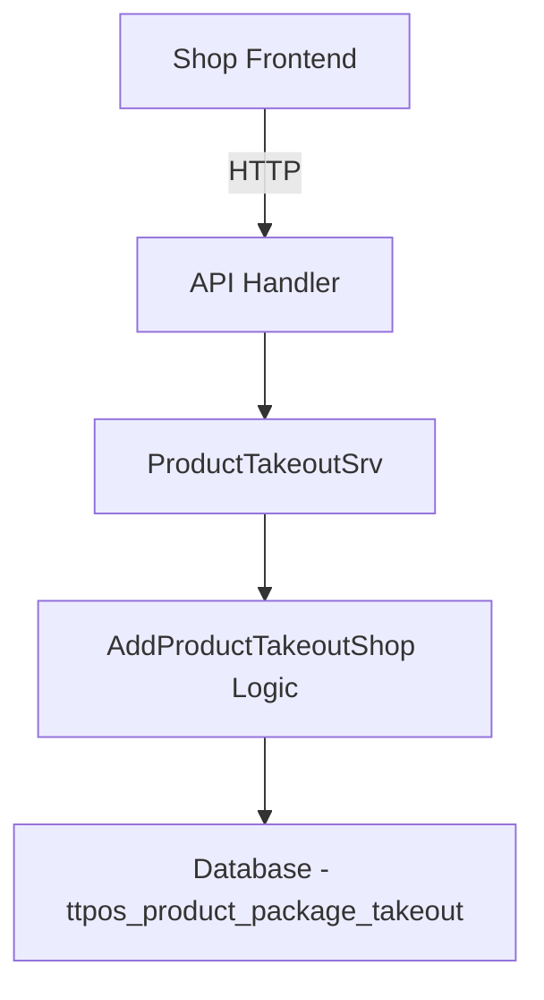
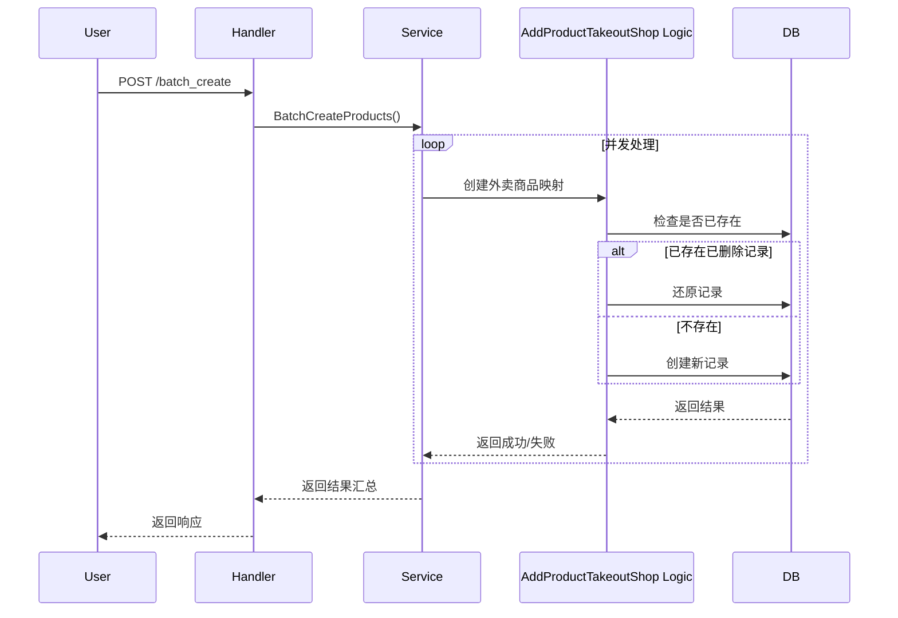

# 批量创建外卖商品 设计文档

> 本文档定义批量创建外卖商品功能的技术设计和实现方案。

## 📋 概述

本功能为商家端提供批量操作外卖商品的能力,包括批量创建、上架、下架、删除商品到外卖平台(Grab、LINE MAN等)。通过并发处理机制提高批量操作效率,确保系统稳定性和用户体验。

核心特性:
- 支持多个外卖平台(Grab、LINE MAN)
- 并发处理,提高批量操作效率
- 限流控制,防止外卖平台API限流
- 失败重试机制,提高成功率
- 直接返回操作结果

---

## 🎯 规范对齐

### Go Main 规范 (go-main.mdc)

本设计严格遵循 Go Main 开发规范:

- ✅ Service 只依赖其他 Service 接口,不依赖 Repository
- ✅ Repository 只持有 db 实例,不持有 DBManager
- ✅ URL 使用 snake_case: `/shop/takeout/products/batch_create`
- ✅ data 字段必须是对象,不能为 null
- ✅ 不使用 panic,所有错误通过 error 返回
- ✅ 使用 DBManager 的 GetDB() 获取数据库连接
- ✅ 接口以 `I` 开头,实现以 `Srv` 结尾

### API 设计规范 (api.mdc)

API 设计遵循规范:

- ✅ URL 使用 snake_case
- ✅ 响应格式统一: `{code, message, data{}}`
- ✅ data 不能为 null 或数组
- ✅ 分页信息放在 meta 中(如需要)
- ✅ 错误码统一管理

### 数据库规范 (database.mdc)

数据库设计遵循规范:

- ✅ 必需字段: id, uuid, create_time, update_time, delete_time
- ✅ 时间字段使用 int 类型,_time 结尾,默认值 0
- ✅ 表名使用 ttpos_ 前缀
- ✅ 字段名使用 snake_case
- ✅ 软删除: delete_time != 0

---

## 🔄 代码复用分析

### 可复用的现有组件

1. **ProductTakeoutSrv**: `main/app/service/product_takeout.go`
   - 复用 AddProductTakeoutShop 的核心逻辑
   - 复用外卖商品映射创建逻辑
   - 扩展批量操作方法

2. **TakeoutApp Service**: `main/app/modules/takeout/application/takeout_app_service.go`
   - 批量上架/下架时复用 Grab API 集成
   - 复用菜单转换逻辑

3. **ProductPackageTakeout Model**: `main/app/model/product_package_takeout.go`
   - 复用外卖商品映射表结构
   - 复用查询方法

### 集成点

- **现有路由**: 扩展 `main/app/api/v1/shop/shop_product.go`,添加批量操作路由
- **数据库表**: 使用现有 `ttpos_product_package_takeout` 表
- **外卖商品创建**: 复用 `/product/takeout/add` 接口的逻辑

---

## 🏗️ 架构设计

### 分层设计原则

**Go Main 三层架构**:

```
API 层 (Handler)
  ↓ 依赖
Service 层 (Business Logic + Batch Processing)
  ↓ 依赖
Repository 层 (Data Access)
```

**依赖规则**:

- ✅ Handler 依赖 Service 接口
- ✅ Service 依赖其他 Service 接口
- ✅ Service 持有 DBManager,通过 GetDB() 访问数据库
- ❌ Service 不直接依赖 Repository
- ✅ Service 调用其他 Service 接口完成业务逻辑

### 架构图



### 批量处理流程



### 模块划分

#### Go Main 模块

**新增文件**:
- `main/app/dto/req/takeout_batch_req.go` - 批量操作请求DTO
- `main/app/dto/resp/takeout_batch_resp.go` - 批量操作响应DTO

**扩展文件**:
- `main/app/service/product_takeout.go` - 扩展批量操作方法
- `main/app/api/v1/shop/shop_product.go` - 添加批量操作路由

**复用文件**:
- `main/app/model/product_package_takeout.go` - 外卖商品映射模型
- `main/app/service/product_takeout.go` - AddProductTakeoutShop 逻辑

---

## 🗄️ 数据库设计

### 数据表设计

本功能使用现有表,不需要新增数据表:
- `ttpos_product_package_takeout`: 外卖商品映射表
- `ttpos_product_package`: 商品包主表

### 数据流

1. **查询商品**: 查询 `ttpos_product_package` 表
2. **创建映射**: 使用 `/product/takeout/add` 的逻辑创建外卖商品映射
3. **更新数据**: 在 `ttpos_product_package_takeout` 表中创建或还原记录
4. **返回结果**: 返回成功/失败统计信息

---

## 🎨 接口设计

### 1. 批量创建商品

**请求**:
```
POST /shop/takeout/products/batch_create
Content-Type: application/json

{
  "platform": "grab",
  "product_uuids": [123456, 234567, 345678]
}
```

**响应**:
```json
{
  "code": 200,
  "message": "success",
  "data": {
    "total": 3,
    "success": 2,
    "failed": 1,
    "failed_products": [
      {
        "product_uuid": "345678",
        "product_name": "商品C",
        "error": "平台限流"
      }
    ]
  }
}
```

### 2. 批量上架商品

**请求**:
```
POST /shop/takeout/products/batch_online
Content-Type: application/json

{
  "platform": "lineman",
  "product_uuids": [123456, 234567]
}
```

**响应**: 同上

### 3. 批量下架商品

**请求**:
```
POST /shop/takeout/products/batch_offline
Content-Type: application/json

{
  "platform": "grab",
  "product_uuids": [123456, 234567]
}
```

**响应**: 同上

### 4. 批量删除商品

**请求**:
```
POST /shop/takeout/products/batch_delete
Content-Type: application/json

{
  "platform": "grab",
  "product_uuids": [123456, 234567]
}
```

**响应**: 同上

---

## 🔧 核心实现

### Service 层实现

#### 批量创建商品流程

```go
func (s *productTakeoutSrv) BatchCreateProducts(
    ctx context.Context, 
    req req.TakeoutBatchCreateReq,
) (*resp.TakeoutBatchResp, error) {
    // 1. 参数校验
    if err := s.validateBatchRequest(req); err != nil {
        return nil, err
    }

    // 2. 查询商品列表
    products, err := s.getProductsByUuids(ctx, req.ProductUuids)
    if err != nil {
        return nil, err
    }

    // 3. 并发处理
    result := s.processBatchCreate(ctx, products, req.Platform)

    // 4. 返回结果
    return &resp.TakeoutBatchResp{
        Total:          result.Total,
        Success:        result.Success,
        Failed:         result.Failed,
        FailedProducts: result.FailedProducts,
    }, nil
}
```

#### 并发处理逻辑

```go
func (s *productTakeoutSrv) processBatchCreate(
    ctx context.Context,
    products []*model.Product,
    platform string,
) *BatchResult {
    result := &BatchResult{
        Total: len(products),
    }
    
    // 限流器
    limiter := time.NewTicker(100 * time.Millisecond) // 每秒10个
    defer limiter.Stop()

    // 使用 WaitGroup 等待所有 Goroutine 完成
    var wg sync.WaitGroup
    var mu sync.Mutex
    
    for _, productUuid := range productUuids {
        wg.Add(1)
        go func(uuid uint64) {
            defer wg.Done()
            <-limiter.C // 限流

            // 调用 AddProductTakeoutShop 逻辑
            addReq := req.ProductTakeoutShopAddReq{
                ProductPackageUuid: uuid,
                TakeoutType:        platform,
            }
            _, err := s.AddProductTakeoutShop(ctx, addReq)
            if err != nil {
                // 重试3次
                err = s.retryCreateProduct(ctx, uuid, platform, 3)
            }

            mu.Lock()
            if err != nil {
                result.Failed++
                result.FailedProducts = append(result.FailedProducts, FailedProduct{
                    ProductUuid: uuid,
                    ProductName: getProductName(uuid),
                    Error:       err.Error(),
                })
            } else {
                result.Success++
            }
            mu.Unlock()
        }(productUuid)
    }

    wg.Wait()
    return result
}
```

### 限流控制

```go
type RateLimiter struct {
    ticker *time.Ticker
}

func NewRateLimiter(requestsPerSecond int) *RateLimiter {
    interval := time.Second / time.Duration(requestsPerSecond)
    return &RateLimiter{
        ticker: time.NewTicker(interval),
    }
}

func (rl *RateLimiter) Wait() {
    <-rl.ticker.C
}
```

### 失败重试机制

```go
func (s *productTakeoutSrv) retryCreateProduct(
    ctx context.Context,
    productUuid uint64,
    platform string,
    maxRetries int,
) error {
    var err error
    for i := 0; i < maxRetries; i++ {
        addReq := req.ProductTakeoutShopAddReq{
            ProductPackageUuid: productUuid,
            TakeoutType:        platform,
        }
        _, err = s.AddProductTakeoutShop(ctx, addReq)
        if err == nil {
            return nil
        }
        
        // 指数退避
        time.Sleep(time.Duration(i+1) * time.Second)
    }
    return err
}
```

---

## 🔐 安全设计

### 1. 权限控制

- 所有接口使用 `middleware.Auth` 验证身份
- 通过 `ctx.GetCompanyUuid()` 获取当前登录商家
- 只能操作当前商家的商品

### 2. 数据隔离

- 查询商品时过滤 `company_uuid`
- 查询任务时过滤 `company_uuid`
- 防止跨商家数据访问

### 3. 参数校验

- 商品UUID列表最多100个
- 平台参数必须是 grab/lineman
- 使用 binding 标签验证参数

### 4. SQL 注入防护

- 使用 GORM 参数化查询
- 不拼接 SQL 字符串

---

## 📊 性能优化

### 1. 并发处理

- 使用 Goroutine 并发推送商品
- 使用 sync.WaitGroup 等待所有任务完成
- 使用 sync.Mutex 保护共享数据

### 2. 限流控制

- 使用 Ticker 控制请求频率
- 每秒不超过10个外卖平台API请求

### 3. 批量查询优化

- 使用 `WHERE uuid IN (...)` 批量查询商品
- 避免 N+1 查询问题

---

## 🧪 测试策略

### 单元测试

- Service 层方法测试
- 限流器测试
- 重试机制测试
- 并发处理测试
- 覆盖率 ≥ 70%

### 集成测试

- 端到端批量操作流程测试
- 外卖平台API集成测试

```go
logger.Info("批量创建任务开始",
    zap.Uint64("task_uuid", task.Uuid),
    zap.String("platform", task.Platform),
    zap.Int("total", task.Total))

logger.Error("推送商品失败",
    zap.Uint64("product_uuid", product.Uuid),
    zap.String("platform", platform),
    zap.Error(err))
```

### 监控指标

- 批量操作成功率
- 平均执行时间
- 失败商品比例
- 外卖平台API响应时间

### 告警策略

- 操作失败率 > 20% 告警
- 外卖平台API超时告警

---

## 🚀 发布计划

### Phase 1: 核心功能 (SP 1.5-2)

- 批量创建接口实现
- 并发处理机制
- 限流和重试

### Phase 2: 扩展功能 (SP 0.5-1)

- 批量上架接口
- 批量下架接口
- 批量删除接口

---

## 📚 参考资料

### 核心规范

- `.cursor/rules/go-main.mdc` - Go Main 核心约束
- `.cursor/rules/api.mdc` - API 设计规范
- `.cursor/rules/database.mdc` - 数据库开发规范

### 相关代码

- `main/app/service/product_takeout.go` - 外卖商品服务
- `main/app/modules/takeout/application/takeout_app_service.go` - 外卖平台API
- `main/app/api/v1/shop/shop_takeout.go` - 外卖路由

---

**版本**: v1.0.0  
**创建日期**: 2025-12-18  
**作者**: weifashi  
**审核者**: 待定

