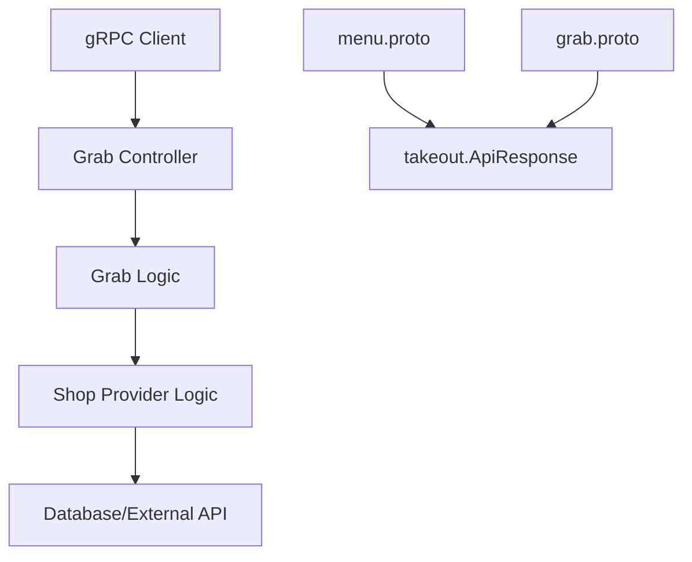

# grab-api-response-wrapper 设计文档

> 本文档定义 将 Grab 服务 API 响应格式统一为 takeout.ApiResponse 的技术设计和实现方案。

## 📋 概述

修改 `ttpos-bmp/app/ttpos-takeout/manifest/protobuf/grab/grab.proto` 中的 `CreateSelfServeJourney` 和 `GetShopProviderCfg` 方法，将返回值从自定义响应消息改为使用统一的 `takeout.ApiResponse` 包装器，确保 API 响应格式的一致性。

---

## 🎯 规范对齐

### Go BMP 规范 (go-bmp.mdc)

[说明设计如何遵循 Go BMP 微服务规范]

- 禁止修改 dao/entity/do/ 目录（自动生成）
- gRPC 服务必须注册到 Nacos
- 遵循 GoFrame 项目结构

### Protobuf 规范 (proto-rules.mdc)

[说明 Protobuf 设计如何遵循规范]

- 服务名以 `Service` 结尾
- 方法名使用大驼峰命名法
- 消息名以 `Req` 或 `Resp` 结尾
- 字段名使用 snake_case

### API 设计规范 (api.mdc)

[说明 API 设计如何遵循规范]

- data 字段必须是对象，不能是 null 或数组
- 响应格式：`{code, message, data{}}`
- 错误信息统一处理

---

## 🔄 代码复用分析

[分析将复用、扩展或集成的现有代码]

### 可复用的现有组件

- **takeout.ApiResponse**: `ttpos-bmp/app/ttpos-takeout/api/takeout/takeout_grpc.pb.go` - 统一的 API 响应格式
- **menu.MenuService**: `ttpos-bmp/app/ttpos-takeout/manifest/protobuf/menu/menu.proto` - 参考实现方式
- **grab.Grab 服务**: `ttpos-bmp/app/ttpos-takeout/internal/logic/grab/` - 现有业务逻辑

### 集成点

- **Protobuf 定义**: 修改现有 protobuf 文件
- **服务实现**: 适配新的响应格式
- **代码生成**: 重新生成 gRPC 代码

---

## 🏗️ 架构设计

[描述整体架构和使用的设计模式]

### 分层设计原则

**Go BMP 微服务架构**:

```
Protobuf 层 (API 定义)
  ↓ 定义
Logic 层 (业务逻辑)
  ↓ 调用
Controller 层 (gRPC 接口)
```

**依赖规则**:

- ✅ Logic 层实现业务逻辑
- ✅ Controller 层调用 Logic 层
- ✅ Protobuf 层定义接口契约

### 架构图



### 模块划分

#### Go BMP 模块

- **Protobuf 层**: `ttpos-bmp/app/ttpos-takeout/manifest/protobuf/grab/grab.proto` - 修改接口定义
- **Controller 层**: `ttpos-bmp/app/ttpos-takeout/internal/controller/rpc/grab_controller.go` - 适配响应格式
- **Logic 层**: `ttpos-bmp/app/ttpos-takeout/internal/logic/grab/` - 业务逻辑调整

---

## 🗄️ 数据库设计

### 数据表设计

[无数据库变更，无需设计新表]

### 数据库迁移

[无数据库变更，无需迁移]

---

## 🔌 API 设计

### gRPC API

#### API 1: CreateSelfServeJourney

**请求**:

```protobuf
message CreateSelfServeJourneyReq {
  string provider_name = 1; // 外卖渠道，如 grab、lineman
  string shop_uuid = 2;     // 门店 UUID
  string request_id = 3;     // 追踪 ID，可选
}
```

**响应** (修改前):

```protobuf
message CreateSelfServeJourneyResp {
  string provider_name = 1;   // 外卖渠道，如 grab、lineman
  string self_serve_url = 2;  // 自助点餐链接
  string request_id = 3;      // 追踪 ID
}
```

**响应** (修改后):

```json
{
  "code": 1,
  "message": "success",
  "data": {
    "provider_name": "grab",
    "self_serve_url": "https://...",
    "request_id": "req_123"
  }
}
```

#### API 2: GetShopProviderCfg

**请求**:

```protobuf
message GetShopProviderCfgReq {
  uint64 shop_uuid = 1;       // 门店 UUID
  string provider_name = 2;   // 第三方名称（可选，默认 grab）
}
```

**响应** (修改前):

```protobuf
message GetShopProviderCfgResp {
  uint64 shop_uuid = 1;             // 门店 UUID
  string provider_name = 2;         // 第三方名称
  string provider_merchant_id = 3;  // 第三方商户 ID
  string provider_shop_status = 4;  // 门店集成状态 (INACTIVE/ACTIVE/SYNCING/FAILED)
  int64  updated_at = 5;            // 更新时间（Unix 秒）
}
```

**响应** (修改后):

```json
{
  "code": 1,
  "message": "success",
  "data": {
    "shop_uuid": 123456,
    "provider_name": "grab",
    "provider_merchant_id": "MER_001",
    "provider_shop_status": "ACTIVE",
    "updated_at": 1704067200
  }
}
```

---

## 🧩 组件和接口

### Controller 层

#### Grab Controller 修改

```go
// ttpos-bmp/app/ttpos-takeout/internal/controller/rpc/grab_controller.go
type GrabController struct {
    grabLogic *logic.GrabLogic
}

func (c *GrabController) CreateSelfServeJourney(ctx context.Context, req *grab.CreateSelfServeJourneyReq) (*takeout.ApiResponse, error) {
    // 调用业务逻辑
    result, err := c.grabLogic.CreateSelfServeJourney(ctx, req)
    if err != nil {
        return takeout.ApiError(err.Error()), nil
    }

    // 返回统一格式响应
    return takeout.ApiSuccessWithData("创建自助激活链接成功", result), nil
}

func (c *GrabController) GetShopProviderCfg(ctx context.Context, req *grab.GetShopProviderCfgReq) (*takeout.ApiResponse, error) {
    // 调用业务逻辑
    result, err := c.grabLogic.GetShopProviderCfg(ctx, req)
    if err != nil {
        return takeout.ApiError(err.Error()), nil
    }

    // 返回统一格式响应
    return takeout.ApiSuccessWithData("获取门店配置成功", result), nil
}
```

### Logic 层

#### Grab Logic 修改

```go
// ttpos-bmp/app/ttpos-takeout/internal/logic/grab/grab.go
type GrabLogic struct{}

func (l *GrabLogic) CreateSelfServeJourney(ctx context.Context, req *grab.CreateSelfServeJourneyReq) (*grab.CreateSelfServeJourneyResp, error) {
    // 现有业务逻辑保持不变
    // 返回业务数据结构体
}

func (l *GrabLogic) GetShopProviderCfg(ctx context.Context, req *grab.GetShopProviderCfgReq) (*grab.GetShopProviderCfgResp, error) {
    // 现有业务逻辑保持不变
    // 返回业务数据结构体
}
```

---

## ⚡ 缓存设计

[无需缓存设计，API 调用频率不高]

---

## 🚨 错误处理

### 错误场景

#### 场景 1: 参数验证失败

- **处理方式**: 返回统一的 ApiResponse 错误格式
- **用户影响**: 客户端收到结构化的错误信息
- **代码示例**:
  ```go
  if err := validateParams(req); err != nil {
      return takeout.ApiError("参数验证失败: " + err.Error()), nil
  }
  ```

#### 场景 2: 业务逻辑错误

- **处理方式**: 捕获业务异常，返回错误响应
- **用户影响**: 客户端收到明确的错误信息
- **代码示例**:
  ```go
  result, err := l.grabLogic.GetShopProviderCfg(ctx, req)
  if err != nil {
      return takeout.ApiError("获取门店配置失败: " + err.Error()), nil
  }
  ```

---

## 🔒 安全设计

### 身份验证

- **gRPC 认证**: 通过 gRPC 拦截器验证请求身份
- **权限控制**: 检查用户是否有访问对应门店的权限

### 数据安全

- **输入验证**: 验证所有输入参数
- **敏感信息**: 不暴露敏感的商户配置信息

---

## 🧪 测试策略

### 单元测试

**目标覆盖率**:

- ttpos-bmp/app/ttpos-takeout/internal/logic/grab: 70%+
- ttpos-bmp/app/ttpos-takeout/internal/controller/rpc: 80%+

**测试内容**:

- Controller 响应格式转换
- Logic 业务逻辑正确性
- 错误处理和异常场景

### API 测试

**测试内容**:

- gRPC 接口调用
- 响应格式验证
- 参数验证
- 错误响应格式

---

## 📈 性能优化

### 优化策略

1. **响应格式统一**: 减少客户端适配成本
2. **错误处理标准化**: 提升调试效率
3. **向后兼容性**: 确保现有客户端能正常工作

### 性能指标

- **响应时间**: < 200ms
- **错误率**: < 1%
- **可用性**: 99.9%

---

## 🌐 浏览器兼容性

[无前端变更，无需浏览器兼容性要求]

---

## 📚 实现清单

### Phase 1: 接口定义修改

- [ ] 修改 protobuf 文件中的方法定义
- [ ] 重新生成 gRPC Go 代码
- [ ] 验证代码编译通过

### Phase 2: 代码实现更新

- [ ] 修改 Controller 层适配新响应格式
- [ ] 更新 Logic 层返回数据结构
- [ ] 验证业务逻辑正确性

### Phase 3: 测试验证

- [ ] 编写单元测试
- [ ] 执行集成测试
- [ ] 验证向后兼容性

**详细任务**: 参见 `tasks.md`

---

## Graphiti & 活动日志

- Related Episode: `[待补充]`
- 模板：`docs/agent/templates/graphiti-episode.md`
- 活动日志：`docs/team/activities/{YYYY-MM}/{YYYY-MM-DD}.md`
- 在技术方案评审、关键架构决策或踩坑总结后，立即补充 Episode 并在设计文档尾部互链。

---

**版本**: v1.0.0
**创建日期**: 2025-12-15
**作者**: rikugun
**审核者**:
