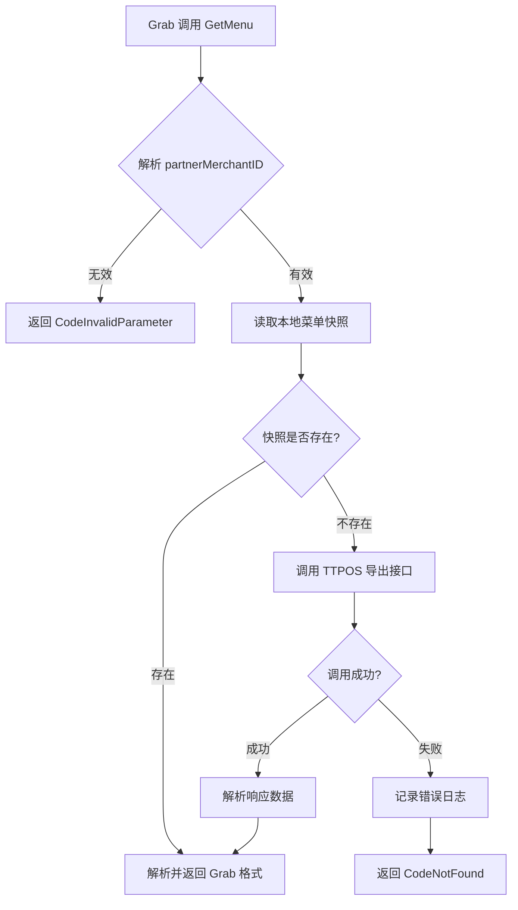

# Grab 菜单获取回退 TTPOS 导出接口 设计文档

> 本文档定义 Grab 菜单获取回退 TTPOS 导出接口功能的技术设计和实现方案。

## 📋 概述

当商家绑定 Grab 外卖平台时选择"跳过导出菜单"，`HandleGetMenu` 接口需要支持回退调用 TTPOS 主模块的 `/api/v1/takeout/menu/export` 接口实时获取菜单数据。本功能在 BMP 微服务的 `ttpos-takeout` 模块中实现，通过 HTTP 调用 main 模块获取菜单。

---

## 🎯 规范对齐

### Go BMP 规范 (go-bmp.mdc)

- ✅ 使用 GoFrame 2.x 框架
- ✅ 使用 `g.Client()` 发起 HTTP 请求
- ✅ 使用 `gerror` 包装所有错误
- ✅ 遵循 GoFrame 项目结构（logic 层实现业务逻辑）
- ❌ 不修改 dao/entity/do/ 目录（自动生成）

### API 设计规范 (api.mdc)

- ✅ 响应格式保持 Grab SDK `GetMenuNewResponse` 结构不变
- ✅ 无需新增 API 接口，仅修改现有 `HandleGetMenu` 逻辑

---

## 🔄 代码复用分析

### 可复用的现有组件

| 组件 | 路径 | 复用方式 |
|------|------|----------|
| **getCallBackAuth** | `ttpos-bmp/app/ttpos-takeout/internal/logic/skootar/skootar.go` | 直接参考 MD5 加密逻辑 |
| **GetTtposMenu** | `ttpos-bmp/app/ttpos-takeout/internal/service/channel_menu.go` | 已有本地快照读取方法 |
| **HandleGetMenu** | `ttpos-bmp/app/ttpos-takeout/internal/logic/grab_menu/grab_menu.go` | 在此方法中添加回退逻辑 |

### 集成点

- **BMP → Main**: HTTP 调用 `/api/v1/takeout/menu/export`
- **认证机制**: 使用 `MD5(shopUUID + callbackSecret)` 生成 `X-TTPOS-SECRET` 头

---

## 🏗️ 架构设计

### 分层设计原则

```
HandleGetMenu (现有接口)
    ↓
service.ChannelMenu().GetTtposMenu() (本地快照读取)
    ↓ 快照为空时
fetchMenuFromTTpos() (新增方法，调用 TTPOS 接口)
    ↓
main 模块 /api/v1/takeout/menu/export
```

### 流程图



### 模块划分

#### Go BMP 模块（ttpos-takeout）

- **Logic 层**: `ttpos-bmp/app/ttpos-takeout/internal/logic/grab_menu/grab_menu.go`
  - 修改 `HandleGetMenu` 方法
  - 新增 `fetchMenuFromTTpos` 方法
  - 新增 `getTtposAuth` 方法

---

## 🗄️ 数据库设计

**无需新增表或字段**

现有表 `takeout_channel_menu_snapshot` 的 `ttpos_menu_data` 字段已满足需求。

---

## 📊 数据模型

### TTPOS 导出接口响应结构

```go
// TTPOS /api/v1/takeout/menu/export 响应结构
type TtposMenuExportResp struct {
    Code    int    `json:"code"`
    Message string `json:"message"`
    Data    struct {
        Platform string      `json:"platform"`
        MenuData interface{} `json:"menuData"` // Grab 格式菜单数据
    } `json:"data"`
}
```

---

## 🔌 API 设计

### 现有接口修改

#### HandleGetMenu（Partner Endpoint）

**无需修改接口定义**，仅修改内部逻辑：

1. 优先从本地快照读取
2. 本地为空时回退调用 TTPOS 接口
3. 返回格式保持 `grabfood.GetMenuNewResponse` 不变

### 新增内部方法

#### fetchMenuFromTTpos

**功能**: 调用 TTPOS 主模块获取菜单数据

**签名**:
```go
func (s *sGrabMenu) fetchMenuFromTTpos(ctx context.Context, shopUUID uint64) (string, error)
```

**请求**:
- **URL**: `{ttposEndpoint}/api/v1/takeout/menu/export`
- **Method**: `POST`
- **Headers**:
  ```json
  {
    "Content-Type": "application/json",
    "X-TTPOS-SECRET": "{MD5(shopUUID + callbackSecret)}"
  }
  ```
- **Body**:
  ```json
  {
    "platform": "grab",
    "companyUuid": 123456789
  }
  ```

**响应**:
```json
{
  "code": 200,
  "message": "success",
  "data": {
    "platform": "grab",
    "menuData": { ... }
  }
}
```

#### getTtposAuth

**功能**: 生成 TTPOS 认证头

**签名**:
```go
func (s *sGrabMenu) getTtposAuth(shopUUID uint64) (string, error)
```

**逻辑**:
```go
// 参考 skootar.go getCallBackAuth
auth := gmd5.EncryptString(fmt.Sprintf("%d%s", shopUUID, callbackSecret))
```

---

## 🧩 组件和接口

### Logic 层实现

#### HandleGetMenu 修改

```go
// ttpos-bmp/app/ttpos-takeout/internal/logic/grab_menu/grab_menu.go

func (s *sGrabMenu) HandleGetMenu(ctx context.Context, partnerMerchantID string) (*grabfood.GetMenuNewResponse, error) {
    g.Log().Infof(ctx, "[Grab] Received GetMenu request: partnerMerchantID=%s", partnerMerchantID)

    // 1. 解析 partnerMerchantID -> shopUUID
    shopUUID := g.NewVar(partnerMerchantID).Uint64()
    if shopUUID == 0 {
        g.Log().Errorf(ctx, "[Grab] Invalid partnerMerchantID format: %s", partnerMerchantID)
        return nil, gerror.NewCode(gcode.CodeInvalidParameter, "invalid partnerMerchantID format")
    }

    // 2. 优先从本地快照读取
    menuJSON, err := service.ChannelMenu().GetTtposMenu(ctx, shopUUID, string(consts.ProviderGrab))
    if err != nil {
        g.Log().Errorf(ctx, "[Grab] Failed to get channel menu: shopUUID=%d, error: %v", shopUUID, err)
        return nil, gerror.Wrap(err, "failed to get channel menu")
    }

    // 3. 如果本地快照为空，回退调用 TTPOS 导出接口
    if menuJSON == "" {
        g.Log().Infof(ctx, "[Grab] Local menu snapshot not found, fallback to TTPOS export API: shopUUID=%d", shopUUID)
        menuJSON, err = s.fetchMenuFromTTpos(ctx, shopUUID)
        if err != nil {
            g.Log().Errorf(ctx, "[Grab] Failed to fetch menu from TTPOS: shopUUID=%d, error=%v", shopUUID, err)
            return nil, gerror.NewCode(gcode.CodeNotFound, "menu not found")
        }
    }

    // 4. 仍然为空，返回菜单未找到错误
    if menuJSON == "" {
        g.Log().Warningf(ctx, "[Grab] Menu not found: shopUUID=%d", shopUUID)
        return nil, gerror.NewCode(gcode.CodeNotFound, "menu not found")
    }

    // 5. 解析 JSON 为 PushGrabMenuDTO
    var pushDTO grabDto.PushGrabMenuDTO
    if err := json.Unmarshal([]byte(menuJSON), &pushDTO); err != nil {
        g.Log().Errorf(ctx, "[Grab] Failed to unmarshal menu JSON: error: %v", err)
        return nil, gerror.Wrap(err, "failed to parse menu data")
    }

    // 6. 构建 SDK 响应
    resp := &grabfood.GetMenuNewResponse{
        MerchantID:        &pushDTO.MerchantID,
        PartnerMerchantID: &pushDTO.PartnerMerchantID,
        Currency:          pushDTO.Currency,
        SellingTimes:      pushDTO.SellingTimes,
        Categories:        pushDTO.Categories,
    }

    g.Log().Infof(ctx, "[Grab] GetMenu success: merchantID=%v, partnerMerchantID=%v, categories=%d",
        resp.MerchantID, resp.PartnerMerchantID, len(resp.Categories))

    return resp, nil
}
```

#### fetchMenuFromTTpos 实现

```go
// fetchMenuFromTTpos 从 TTPOS 主模块获取菜单数据
func (s *sGrabMenu) fetchMenuFromTTpos(ctx context.Context, shopUUID uint64) (string, error) {
    // 1. 获取 TTPOS endpoint 配置
    ttposEndpoint := g.Cfg().MustGet(ctx, "app.ttposEndpoint").String()
    if ttposEndpoint == "" {
        return "", gerror.NewCode(gcode.CodeMissingConfiguration, "TTPOS endpoint not configured")
    }

    // 2. 构建请求 URL
    url := fmt.Sprintf("%s/api/v1/takeout/menu/export", ttposEndpoint)

    // 3. 构建请求体
    reqBody := g.Map{
        "platform":    "grab",
        "companyUuid": shopUUID,
    }

    // 4. 生成认证头
    auth, err := s.getTtposAuth(shopUUID)
    if err != nil {
        return "", gerror.Wrap(err, "failed to generate TTPOS auth header")
    }

    // 5. 发起 HTTP 请求（设置 10s 超时）
    client := g.Client().Timeout(10 * time.Second)
    resp, err := client.
        SetHeader("X-TTPOS-SECRET", auth).
        ContentJson().
        Post(ctx, url, reqBody)
    if err != nil {
        return "", gerror.Wrap(err, "failed to call TTPOS export API")
    }
    defer resp.Close()

    // 6. 检查 HTTP 状态码
    if !resp.IsSuccess() {
        return "", gerror.Newf("TTPOS export API returned status %d: %s", resp.StatusCode, resp.ReadAllString())
    }

    // 7. 解析响应
    var result struct {
        Code    int    `json:"code"`
        Message string `json:"message"`
        Data    struct {
            Platform string          `json:"platform"`
            MenuData json.RawMessage `json:"menuData"`
        } `json:"data"`
    }
    if err := resp.UnmarshalJSON(&result); err != nil {
        return "", gerror.Wrap(err, "failed to parse TTPOS export API response")
    }

    // 8. 检查业务状态码
    if result.Code != 200 && result.Code != 1 {
        return "", gerror.Newf("TTPOS export API error: code=%d, message=%s", result.Code, result.Message)
    }

    // 9. 返回菜单数据 JSON
    return string(result.Data.MenuData), nil
}

// getTtposAuth 生成 TTPOS 认证头
func (s *sGrabMenu) getTtposAuth(shopUUID uint64) (string, error) {
    callbackSecret := g.Cfg().MustGet(gctx.GetInitCtx(), "app.callbackSecret").String()
    auth, err := gmd5.EncryptString(fmt.Sprintf("%d%s", shopUUID, callbackSecret))
    if err != nil {
        return "", err
    }
    return auth, nil
}
```

---

## ⚡ 配置设计

### 新增配置项

```yaml
# ttpos-bmp/app/ttpos-takeout/manifest/config/config.tpl.yaml
app:
  ttposEndpoint: $TTPOS_MAIN_ENDPOINT  # 新增：TTPOS 主模块地址
  callbackSecret: $JWT_SECRET          # 已有：用于生成认证头
```

---

## 🚨 错误处理

### 错误场景

| 场景 | 错误类型 | 处理方式 |
|------|----------|----------|
| partnerMerchantID 无效 | `gcode.CodeInvalidParameter` | 返回参数错误 |
| 配置缺失 | `gcode.CodeMissingConfiguration` | 返回配置错误 |
| TTPOS 接口调用失败 | `gerror.Wrap` | 记录日志，返回 menu not found |
| TTPOS 接口返回非 200 | `gerror.Newf` | 记录日志，返回 menu not found |
| 菜单解析失败 | `gerror.Wrap` | 返回解析错误 |
| 菜单不存在 | `gcode.CodeNotFound` | 返回 menu not found |

---

## 🔒 安全设计

### 认证机制

- **Header**: `X-TTPOS-SECRET`
- **算法**: MD5
- **生成规则**: `MD5(shopUUID + callbackSecret)`
- **日志安全**: secret 不记录到日志

---

## 🧪 测试策略

### 单元测试

**测试文件**: `ttpos-bmp/app/ttpos-takeout/internal/logic/grab_menu/grab_menu_test.go`

**测试场景**:
1. 本地快照存在 → 直接返回
2. 本地快照为空 → 调用 TTPOS 接口成功
3. TTPOS 接口超时 → 返回错误
4. TTPOS 接口返回非 200 → 返回错误
5. partnerMerchantID 无效 → 返回参数错误

### Mock 设计

```go
// Mock TTPOS HTTP 响应
func mockTtposExportAPI(t *testing.T) *httptest.Server {
    return httptest.NewServer(http.HandlerFunc(func(w http.ResponseWriter, r *http.Request) {
        // 验证请求头
        assert.NotEmpty(t, r.Header.Get("X-TTPOS-SECRET"))
        
        // 返回模拟响应
        json.NewEncoder(w).Encode(map[string]interface{}{
            "code": 200,
            "data": map[string]interface{}{
                "platform": "grab",
                "menuData": map[string]interface{}{...},
            },
        })
    }))
}
```

---

## 📈 性能优化

### 优化策略

1. **超时控制**: TTPOS 接口调用超时设置为 10s
2. **本地优先**: 优先读取本地快照，减少外部调用
3. **可选缓存**: 从 TTPOS 获取后可选择保存到本地快照（Phase 2）

### 性能指标

- TTPOS 接口调用超时: 10s
- 本地快照读取: < 50ms
- 总响应时间: < 200ms（本地快照命中）/ < 10s（回退调用）

---

## 📚 实现清单

### Phase 1: 核心实现

- [ ] 修改 `HandleGetMenu` 方法，添加回退逻辑
- [ ] 实现 `fetchMenuFromTTpos` 方法
- [ ] 实现 `getTtposAuth` 方法
- [ ] 添加 `app.ttposEndpoint` 配置项

### Phase 2: 测试

- [ ] 编写单元测试
- [ ] Mock TTPOS 接口进行集成测试
- [ ] 测试各错误场景

### Phase 3: 文档

- [ ] 更新配置文档，说明 `app.ttposEndpoint` 配置项

**详细任务**: 参见 `tasks.md`

---

## Graphiti & 活动日志

- Related Episode: `[待补充]`
- 模板：`docs/agent/templates/graphiti-episode.md`
- 活动日志：`docs/team/activities/2025-12/2025-12-18.md`

---

**版本**: v1.0.0  
**创建日期**: 2025-12-18  
**作者**: rikugun  
**审核者**: 待定

