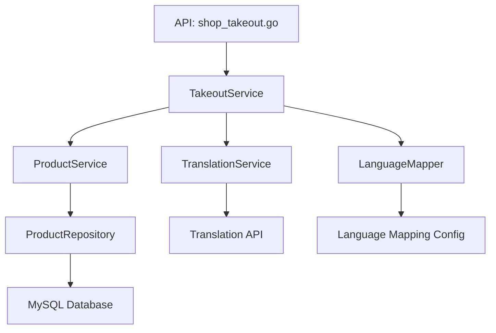
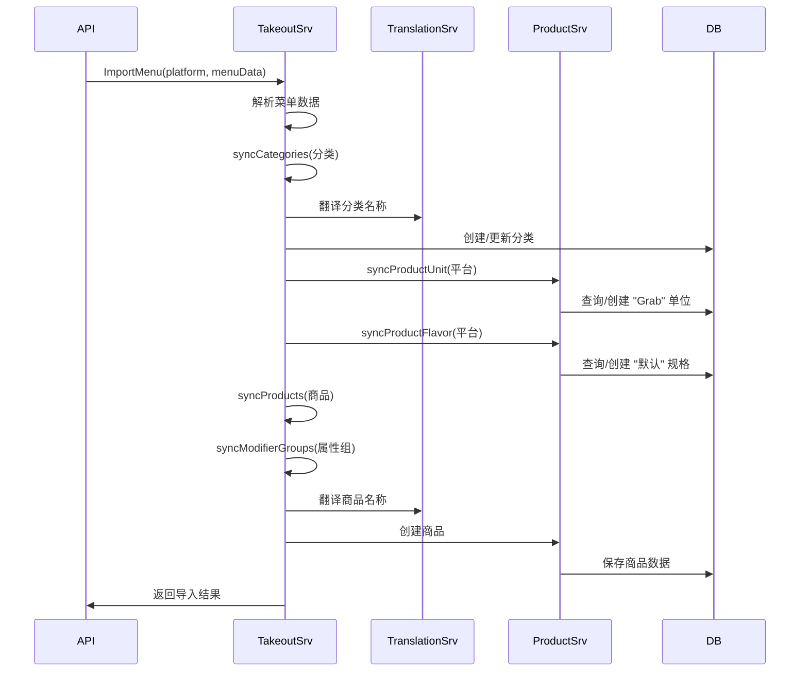
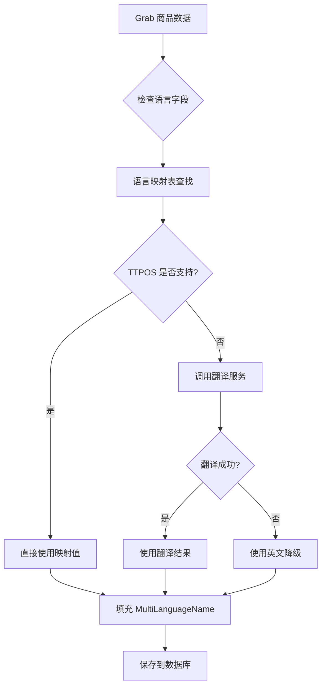

# Grab 外卖导入商品优化 设计文档

> 本文档定义 Grab 外卖导入商品优化功能的技术设计和实现方案。

## 📋 概述

本设计旨在优化 TTPOS 与 Grab 外卖平台的商品导入功能,通过完善语言映射与翻译、统一价格处理规则、优化商品属性映射、简化外卖开关逻辑等措施,提升商户接入效率,降低使用门槛。

**核心改进**:
1. 多语言映射与翻译服务集成
2. 外卖开关逻辑解耦
3. Grab 配置流程优化
4. 价格处理规则统一(移除汇率换算)
5. 商品属性映射优化(单位、税率、规格、属性组)

---

## 🎯 规范对齐

### Go Main 规范 (go-main.mdc)

本设计严格遵循 Go Main 开发规范:

- ✅ **分层设计**: API → Service → Repository 三层架构
- ✅ **依赖管理**: Service 只依赖其他 Service 接口,不直接依赖 Repository
- ✅ **接口命名**: 接口以 `I` 开头,实现以小写字母开头
- ✅ **Repository 约束**: 只持有 `db *gorm.DB`,不持有 DBManager
- ✅ **错误处理**: 不使用 panic,返回 error,使用 `errors.WithMessage` 包装
- ✅ **URL 命名**: 使用 snake_case(如 `/api/v1/takeout/grab/import_menu`)

### API 设计规范 (api.mdc)

- ✅ **响应格式**: `{code, message, data{}}`
- ✅ **data 字段**: 必须是对象,不能是 null 或数组
- ✅ **分页信息**: 放在 meta 中
- ✅ **错误处理**: 统一错误码和错误信息
- ✅ **国际化**: 支持 10 种语言

### 数据库规范 (database.mdc)

- ✅ **必需字段**: id, uuid, create_time, update_time, delete_time
- ✅ **时间字段**: 使用 int 类型,\_time 结尾,默认值 0
- ✅ **UUID 字段**: 使用 bigint unsigned
- ✅ **表名**: 使用 ttpos\_ 前缀
- ✅ **字段名**: 使用 snake_case
- ✅ **软删除**: 使用 delete_time 标记

---

## 🔄 代码复用分析

### 可复用的现有组件

1. **TakeoutService**: `main/app/service/takeout.go`
   - 复用: 现有的商品导入流程框架
   - 扩展: 添加语言映射、价格处理、属性映射逻辑

2. **ProductService**: `main/app/service/product.go`
   - 复用: 单位、税率、规格、属性组的创建和管理方法
   - 使用: `AddProductUnit`, `AddProductFlavor`, `AddProductAttributeGroup`

3. **语言处理模块**: `main/pkg/language/language.go`
   - 复用: `MapToLocaleResponse` 方法
   - 扩展: 添加翻译服务集成

4. **商品 Repository**: `main/app/repository/product_repo.go`
   - 复用: 单位、税率、规格、属性组的查询方法

5. **外卖菜单领域对象**: `main/app/modules/takeout/domain/menu/valueobject/`
   - 复用: Category, MenuItem, Modifier, ModifierGroup 对象

### 集成点

1. **翻译服务集成**
   - 新增: `main/pkg/translation/` 翻译服务封装
   - 集成: 第三方翻译 API (Google Translate / Microsoft Translator)
   
2. **语言映射配置**
   - 新增: `main/config/language_mapping.go` 语言映射表
   
3. **前端配置页面**
   - 修改: `admin/views/shop/pages/takeout/` 外卖配置页面
   - 新增: Grab 配置跳转链接组件

4. **数据库表扩展**
   - 修改: `ttpos_product_unit` 添加 source, source_id 字段
   - 修改: `ttpos_tax` 添加 source, source_id 字段
   - 修改: `ttpos_product_flavor` 添加 source, source_id 字段

---

## 🏗️ 架构设计

### 分层设计原则

**Go Main 三层架构**:

```
API 层 (shop_takeout.go)
  ↓ 调用
Service 层 (takeout.go)
  ↓ 依赖
Service 层 (product.go, translation.go)
  ↓ 调用
Repository 层 (product_repo.go)
  ↓ 访问
Database (MySQL)
```

**依赖规则**:

- ✅ TakeoutService 依赖 ProductService 接口
- ✅ TakeoutService 依赖 TranslationService 接口
- ❌ TakeoutService 不直接依赖 ProductRepository
- ✅ Service 层通过 DBManager 管理事务
- ✅ Repository 层只持有 db 实例

### 架构图



### 核心流程

#### 1. 商品导入流程



#### 2. 语言映射与翻译流程



### 模块划分

#### Go Main 模块

- **API 层**: `main/app/api/v1/shop/shop_takeout.go`
  - ImportMenu API (已存在,需扩展)
  
- **Service 层**: 
  - `main/app/service/takeout.go` - 外卖服务(扩展)
  - `main/app/service/product.go` - 商品服务(复用)
  - `main/pkg/translation/translation.go` - 翻译服务(新增)
  
- **Config 层**:
  - `main/config/language_mapping.go` - 语言映射配置(新增)
  
- **Repository 层**: 
  - `main/app/repository/product_repo.go` - 商品仓库(复用)
  
- **Model 层**: 
  - `main/app/model/product_unit.go` - 单位模型(扩展字段)
  - `main/app/model/tax.go` - 税率模型(扩展字段)
  - `main/app/model/product_flavor.go` - 规格模型(扩展字段)

#### Vue 前端模块

- **Pages**: 
  - `admin/views/shop/pages/takeout/config.vue` - 外卖配置页面(修改)
  - `admin/views/shop/pages/takeout/grab-setup.vue` - Grab 配置页面(新增)
  
- **Components**: 
  - `admin/views/shop/components/takeout/GrabLinkButton.vue` - 跳转按钮(新增)
  
- **API**: 
  - `admin/views/shop/api/takeout.ts` - 外卖 API 封装(扩展)

---

## 🗄️ 数据库设计

### 数据表扩展

#### 扩展 1: ttpos_product_unit (单位表)

**新增字段**:

```sql
ALTER TABLE `ttpos_product_unit` 
ADD COLUMN `source` varchar(50) NOT NULL DEFAULT '' COMMENT '来源平台(grab/foodpanda等)' AFTER `name`,
ADD COLUMN `source_id` varchar(100) NOT NULL DEFAULT '' COMMENT '来源平台ID' AFTER `source`,
ADD INDEX `idx_source` (`source`, `source_id`);
```

**迁移文件**: `admin/database/migrations/20251211_add_source_to_product_unit.php`

#### 扩展 2: ttpos_tax (税率表)

**新增字段**:

```sql
ALTER TABLE `ttpos_tax` 
ADD COLUMN `source` varchar(50) NOT NULL DEFAULT '' COMMENT '来源平台(grab/foodpanda等)' AFTER `tax_name`,
ADD COLUMN `source_id` varchar(100) NOT NULL DEFAULT '' COMMENT '来源平台ID' AFTER `source`,
ADD INDEX `idx_source` (`source`, `source_id`);
```

**迁移文件**: `admin/database/migrations/20251211_add_source_to_tax.php`

#### 扩展 3: ttpos_product_flavor (规格表)

**新增字段**:

```sql
ALTER TABLE `ttpos_product_flavor` 
ADD COLUMN `source` varchar(50) NOT NULL DEFAULT '' COMMENT '来源平台(grab/foodpanda等)' AFTER `name`,
ADD COLUMN `source_id` varchar(100) NOT NULL DEFAULT '' COMMENT '来源平台ID' AFTER `source`,
ADD INDEX `idx_source` (`source`, `source_id`);
```

**迁移文件**: `admin/database/migrations/20251211_add_source_to_product_flavor.php`

### 数据库迁移

**迁移脚本**:

```bash
# 创建迁移文件
cd admin
php think migrate:create AddSourceToProductUnit
php think migrate:create AddSourceToTax
php think migrate:create AddSourceToProductFlavor

# 执行迁移
php think migrate:run
```

**同步 Go Model**:

在 `main/app/model/` 中更新对应的 Go 结构体,添加 Source 和 SourceId 字段。

---

## 📊 数据模型

### Go Model 扩展

#### ProductUnit Model

```go
// main/app/model/product_unit.go
type ProductUnit struct {
    Id                    uint64 `gorm:"column:id;primaryKey" json:"id"`
    Uuid                  uint64 `gorm:"column:uuid;uniqueIndex" json:"uuid"`
    CompanyUuid           uint64 `gorm:"column:company_uuid;index" json:"company_uuid"`
    MultiLanguageNameUuid uint64 `gorm:"column:multi_language_name_uuid" json:"multi_language_name_uuid"`
    Name                  string `gorm:"column:name" json:"name"`
    Source                string `gorm:"column:source" json:"source"`        // 新增
    SourceId              string `gorm:"column:source_id" json:"source_id"`  // 新增
    CreateTime            int64  `gorm:"column:create_time" json:"create_time"`
    UpdateTime            int64  `gorm:"column:update_time" json:"update_time"`
    DeleteTime            int64  `gorm:"column:delete_time;index" json:"delete_time"`
}
```

#### Tax Model

```go
// main/app/model/tax.go (新增字段)
type Tax struct {
    // ... 现有字段 ...
    Source     string `gorm:"column:source" json:"source"`        // 新增
    SourceId   string `gorm:"column:source_id" json:"source_id"`  // 新增
    // ... 现有字段 ...
}
```

#### ProductFlavor Model

```go
// main/app/model/product_flavor.go (新增字段)
type ProductFlavor struct {
    // ... 现有字段 ...
    Source     string `gorm:"column:source" json:"source"`        // 新增
    SourceId   string `gorm:"column:source_id" json:"source_id"`  // 新增
    // ... 现有字段 ...
}
```

---

## 🔌 新增组件设计

### 1. 翻译服务 (TranslationService)

#### 接口定义

```go
// main/pkg/translation/i_translation.go
package translation

type ITranslationService interface {
    // Translate 翻译文本
    // text: 原始文本
    // sourceLang: 源语言代码 (如: "en")
    // targetLang: 目标语言代码 (如: "zh")
    // 返回: 翻译后的文本, 错误
    Translate(text, sourceLang, targetLang string) (string, error)
    
    // BatchTranslate 批量翻译
    // texts: 原始文本列表
    // sourceLang: 源语言代码
    // targetLang: 目标语言代码
    // 返回: 翻译后的文本列表, 错误
    BatchTranslate(texts []string, sourceLang, targetLang string) ([]string, error)
}
```

#### 实现

```go
// main/pkg/translation/translation.go
package translation

import (
    "context"
    "fmt"
    "time"
    
    "ttpos-server-go/pkg/cache"
)

type translationService struct {
    cache   cache.Cache
    apiKey  string
    timeout time.Duration
}

func NewTranslationService(cache cache.Cache, apiKey string) ITranslationService {
    return &translationService{
        cache:   cache,
        apiKey:  apiKey,
        timeout: 5 * time.Second,
    }
}

func (s *translationService) Translate(text, sourceLang, targetLang string) (string, error) {
    // 1. 检查缓存
    cacheKey := fmt.Sprintf("translation:%s:%s:%s", sourceLang, targetLang, text)
    if cached, err := s.cache.Get(cacheKey); err == nil {
        return cached.(string), nil
    }
    
    // 2. 调用翻译 API (示例:Google Translate API)
    ctx, cancel := context.WithTimeout(context.Background(), s.timeout)
    defer cancel()
    
    translated, err := s.callTranslationAPI(ctx, text, sourceLang, targetLang)
    if err != nil {
        // 翻译失败,返回原始文本
        return text, err
    }
    
    // 3. 写入缓存(1小时)
    _ = s.cache.Set(cacheKey, translated, time.Hour)
    
    return translated, nil
}

func (s *translationService) callTranslationAPI(ctx context.Context, text, sourceLang, targetLang string) (string, error) {
    // TODO: 实现具体的翻译 API 调用
    // 可选: Google Cloud Translation API, Microsoft Translator API
    return text, fmt.Errorf("translation API not implemented")
}
```

### 2. 语言映射器 (LanguageMapper)

```go
// main/config/language_mapping.go
package config

// LanguageMapping Grab 语言代码到 TTPOS 语言代码的映射
var LanguageMapping = map[string]string{
    "en-US": "en",
    "en-GB": "en",
    "zh-CN": "zh",
    "zh-TW": "zhtw",
    "th-TH": "th",
    "ja-JP": "ja",
    "ko-KR": "ko",
    "ms-MY": "my",
    "tr-TR": "tr",
    "sv-SE": "sv",
}

// MapGrabLanguageToTTPOS 将 Grab 语言代码映射到 TTPOS 语言代码
func MapGrabLanguageToTTPOS(grabLang string) string {
    if ttposLang, ok := LanguageMapping[grabLang]; ok {
        return ttposLang
    }
    // 默认返回英文
    return "en"
}

// SupportedTTPOSLanguages TTPOS 支持的语言列表
var SupportedTTPOSLanguages = []string{
    "en", "zh", "th", "ja", "ko", "my", "tr", "sv", "zhtw",
}

// IsSupportedLanguage 检查 TTPOS 是否支持该语言
func IsSupportedLanguage(lang string) bool {
    for _, supported := range SupportedTTPOSLanguages {
        if supported == lang {
            return true
        }
    }
    return false
}
```

### 3. 扩展 TakeoutService

#### 添加语言处理方法

```go
// main/app/service/takeout.go

// translateMultiLanguageName 翻译多语言名称
func (s *takeoutSrv) translateMultiLanguageName(
    ctx context.Context,
    nameTranslation map[string]string,
) (*dto.LocaleResponse, error) {
    locale := &dto.LocaleResponse{}
    
    // 1. 从 Grab 数据中提取已有语言
    for grabLang, text := range nameTranslation {
        ttposLang := config.MapGrabLanguageToTTPOS(grabLang)
        s.setLocaleField(locale, ttposLang, text)
    }
    
    // 2. 确保英文存在(作为降级语言)
    if locale.EN == "" {
        // 使用第一个非空值作为英文
        for _, text := range nameTranslation {
            if text != "" {
                locale.EN = text
                break
            }
        }
    }
    
    // 3. 对缺失的语言进行翻译
    if s.translationSrv != nil {
        s.fillMissingLanguages(ctx, locale)
    }
    
    return locale, nil
}

// setLocaleField 设置 LocaleResponse 的字段
func (s *takeoutSrv) setLocaleField(locale *dto.LocaleResponse, lang, text string) {
    switch lang {
    case "en":
        locale.EN = text
    case "zh":
        locale.ZH = text
    case "th":
        locale.TH = text
    case "ja":
        locale.JA = text
    case "ko":
        locale.KO = text
    case "my":
        locale.MY = text
    case "tr":
        locale.TR = text
    case "sv":
        locale.SV = text
    case "zhtw":
        locale.ZHTW = text
    }
}

// fillMissingLanguages 填充缺失的语言(通过翻译)
func (s *takeoutSrv) fillMissingLanguages(ctx context.Context, locale *dto.LocaleResponse) {
    sourceLang := "en"
    sourceText := locale.EN
    
    if sourceText == "" {
        return
    }
    
    // 翻译缺失的语言
    if locale.ZH == "" {
        if translated, err := s.translationSrv.Translate(sourceText, sourceLang, "zh"); err == nil {
            locale.ZH = translated
        }
    }
    if locale.TH == "" {
        if translated, err := s.translationSrv.Translate(sourceText, sourceLang, "th"); err == nil {
            locale.TH = translated
        }
    }
    // ... 其他语言同理
}
```

#### 修改单位/税率/规格创建方法

```go
// syncProductUnit 同步商品单位(支持 source 字段)
func (s *takeoutSrv) syncProductUnit(ctx context.Context, platform string) (uint64, error) {
    db := ctx.GetDB()
    
    // 查询是否已存在该平台的标准单位
    var existingUnit model.ProductUnit
    err := db.Where("source = ? AND source_id = ? AND delete_time = 0", platform, "standard").
        First(&existingUnit).Error
    
    if err == nil {
        return existingUnit.Uuid, nil
    }
    
    if err != gorm.ErrRecordNotFound {
        return 0, errors.WithMessage(err, "查询商品单位失败")
    }
    
    // 单位不存在,创建新单位
    err = s.productSrv.AddProductUnit(ctx, req.ProductUnitAddReq{
        LocaleName: dto.LocaleResponse{
            EN:   platform,
            ZH:   platform,
            TH:   platform,
            JA:   platform,
            KO:   platform,
            MY:   platform,
            TR:   platform,
            SV:   platform,
            ZHTW: platform,
        },
        Source:   platform,    // 新增
        SourceId: "standard",  // 新增
    })
    if err != nil {
        return 0, errors.WithMessage(err, "创建商品单位失败")
    }
    
    // 重新查询获取 UUID
    err = db.Where("source = ? AND source_id = ? AND delete_time = 0", platform, "standard").
        First(&existingUnit).Error
    if err != nil {
        return 0, errors.WithMessage(err, "获取商品单位UUID失败")
    }
    
    return existingUnit.Uuid, nil
}
```

---

## ⚡ 缓存设计

### Redis 缓存

**缓存策略**:

1. **翻译结果缓存**:
   - Key: `translation:{sourceLang}:{targetLang}:{text}`
   - 过期时间: 1 小时
   - 更新策略: Cache-Aside Pattern

2. **单位查询缓存**:
   - Key: `product:unit:{source}:{source_id}`
   - 过期时间: 1 小时

3. **税率查询缓存**:
   - Key: `product:tax:{source}:{source_id}`
   - 过期时间: 1 小时

4. **规格查询缓存**:
   - Key: `product:flavor:{source}:{source_id}`
   - 过期时间: 1 小时

---

## 🚨 错误处理

### 错误场景

#### 场景 1: 翻译服务失败

- **处理方式**: 使用降级策略,返回英文或原始文本
- **用户影响**: 部分语言可能显示为英文
- **代码示例**:
  ```go
  translated, err := s.translationSrv.Translate(text, "en", "zh")
  if err != nil {
      logger.Logger.Warn("翻译失败,使用英文降级", zap.Error(err))
      translated = text  // 使用原始文本
  }
  ```

#### 场景 2: 商品导入部分失败

- **处理方式**: 记录失败原因,继续处理其他商品
- **用户影响**: 显示成功和失败数量统计
- **代码示例**:
  ```go
  for _, item := range items {
      if err := s.createProduct(ctx, item); err != nil {
          logger.Logger.Error("商品导入失败", 
              zap.String("item_id", item.ID),
              zap.Error(err))
          failureCount++
          continue
      }
      successCount++
  }
  ```

#### 场景 3: 数据库事务失败

- **处理方式**: 回滚事务,返回错误
- **用户影响**: 提示导入失败,需重试
- **代码示例**:
  ```go
  err := ctx.GetDB().Transaction(func(tx *gorm.DB) error {
      // ... 导入逻辑 ...
      if err != nil {
          return err  // 自动回滚
      }
      return nil
  })
  ```

---

## 🔒 安全设计

### 身份验证

- **JWT Token**: 所有 API 需要 Token 验证
- **商户权限**: 验证商户是否有权限导入商品

### 数据安全

- **Grab API Key**: 加密存储在配置中
- **Translation API Key**: 加密存储,不暴露给前端
- **SQL 注入防护**: 使用 GORM 参数化查询

---

## 🧪 测试策略

### 单元测试

**目标覆盖率**:
- TakeoutService: 70%+
- TranslationService: 80%+
- LanguageMapper: 100%

**测试内容**:
- 语言映射逻辑
- 翻译降级策略
- 价格处理(不换算)
- 属性组选择范围映射

### API 测试

**测试内容**:
- 商品导入接口
- 参数验证
- 响应格式
- 错误处理

### 集成测试

**测试流程**:
- 完整的商品导入流程
- 翻译服务集成
- 数据库事务
- 缓存一致性

---

## 📈 性能优化

### 优化策略

1. **翻译缓存**: Redis 缓存翻译结果(1小时)
2. **批量翻译**: 使用 BatchTranslate 减少 API 调用
3. **异步处理**: 翻译操作可异步执行
4. **数据库索引**: 在 source, source_id 字段上添加索引

### 性能指标

- 单商品导入: < 500ms
- 批量导入 100 个商品: < 10s
- 翻译服务响应: < 5s
- 缓存命中率: > 80%

---

## 📚 实现清单

### Phase 1: 数据库和基础设施

- [ ] 创建数据库迁移文件(添加 source 字段)
- [ ] 执行数据库迁移
- [ ] 更新 Go Model(添加 Source, SourceId 字段)
- [ ] 创建语言映射配置

### Phase 2: 翻译服务

- [ ] 实现 TranslationService 接口
- [ ] 集成第三方翻译 API
- [ ] 实现翻译缓存
- [ ] 实现翻译降级策略
- [ ] 编写单元测试

### Phase 3: 外卖导入优化

- [ ] 扩展 syncProductUnit(添加 source 支持)
- [ ] 扩展 syncProductFlavor(添加 source 支持)
- [ ] 实现 translateMultiLanguageName 方法
- [ ] 移除价格汇率换算逻辑
- [ ] 优化属性组选择范围映射
- [ ] 编写单元测试

### Phase 4: 前端配置优化

- [ ] 修改外卖配置页面(移除强关联)
- [ ] 创建 Grab 配置跳转组件
- [ ] 添加配置状态显示
- [ ] 前后端联调

### Phase 5: 测试和优化

- [ ] 集成测试
- [ ] 性能测试
- [ ] 文档更新

**详细任务**: 参见 `tasks.md`

---

## Graphiti & 活动日志

- Related Episode: `[待补充]`
- 模板: `docs/agent/templates/graphiti-episode.md`
- 活动日志: `docs/team/activities/weifashi/2025-12/2025-12-11.md`
- 在技术方案评审、关键架构决策或踩坑总结后,立即补充 Episode 并在设计文档尾部互链。

---

**版本**: v1.0.0  
**创建日期**: 2025-12-11  
**作者**: weifashi  
**审核者**: 待审核

