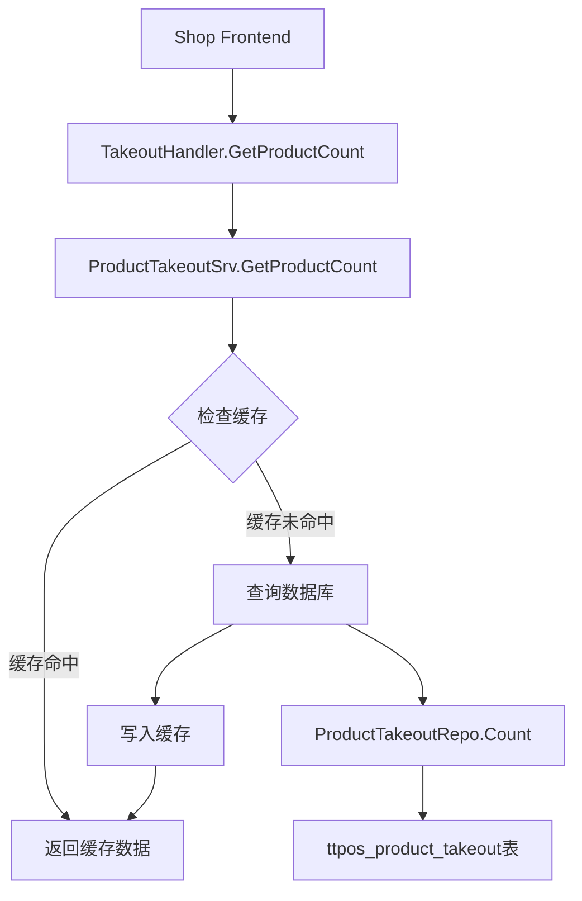

# 外卖商品统计接口 设计文档

> 本文档定义外卖商品统计接口的技术设计和实现方案。

## 📋 概述

本功能为商家端提供外卖商品统计接口,支持查询指定平台或所有平台的商品总数。通过传递`platform`参数灵活控制查询范围,使用Redis缓存提升性能。

该功能基于现有的外卖模块(`main/app/modules/takeout/`)和商品外卖服务(`main/app/service/product_takeout.go`)进行扩展,复用现有的路由结构和服务层。

---

## 🎯 规范对齐

### Go Main 规范 (go-main.mdc)

本设计严格遵循 Go Main 开发规范:

- ✅ Service 只依赖其他 Service 接口(不直接依赖 Repository)
- ✅ Handler 层负责参数校验和响应封装
- ✅ Service 层负责业务逻辑和缓存管理
- ✅ URL 使用 snake_case: `/shop/takeout/products/count`
- ✅ data 字段必须是对象: `{total: number}`
- ✅ 不使用 panic,所有错误返回 error
- ✅ 使用 `helper.Success` 和 `helper.ErrorWithDetail` 封装响应

### API 设计规范 (api.mdc)

API 设计遵循统一规范:

- ✅ URL 使用 snake_case 命名
- ✅ 响应格式统一: `{code, message, data{}}`
- ✅ data 不能为 null,空数据返回 `{}`
- ✅ 使用 Query 参数传递筛选条件
- ✅ Swagger 注释完整

### 数据库规范 (database.mdc)

本功能复用现有表,不需要新增表:

- ✅ 使用 `ttpos_product_takeout` 表
- ✅ 查询条件: `delete_time = 0`
- ✅ 使用现有索引: `idx_takeout_platform_company`

---

## 🔄 代码复用分析

### 可复用的现有组件

1. **TakeoutHandler**: `main/app/api/v1/shop/shop_takeout.go`
   - 已有外卖相关路由的 Handler
   - 在此Handler中新增统计接口方法

2. **ProductTakeoutSrv**: `main/app/service/product_takeout.go`
   - 外卖商品服务,包含商品查询逻辑
   - 新增 `GetProductCount` 方法

3. **Cache**: `ttpos-server-go/pkg/cache`
   - Redis缓存工具
   - 用于缓存统计数据

4. **Helper**: `ttpos-server-go/app/api/helper`
   - 响应封装工具
   - 使用 `Success` 和 `ErrorWithDetail`

### 集成点

- **路由集成**: 在 `RegisterTakeoutHandlers` 中添加新路由
- **服务集成**: 在 `TakeoutHandler` 中注入 `ProductTakeoutSrv`
- **数据库表**: 复用 `ttpos_product_takeout` 表

---

## 🏗️ 架构设计

### 分层设计原则

**Go Main 三层架构**:

```
Handler 层 (shop_takeout.go)
  ↓ 调用
Service 层 (product_takeout.go)
  ↓ 使用
DBManager (获取 db 实例传给 Repository)
  ↓
Repository 层 (在 Service 内部创建)
```

**依赖规则**:

- ✅ Handler 依赖 Service 接口
- ✅ Service 持有 DBManager
- ✅ Service 内部创建 Repository 并传递 db 实例
- ✅ Service 依赖 Cache 进行缓存管理
- ❌ Handler 不能直接访问数据库
- ❌ Service 不能持有 Repository 实例

### 架构图



### 模块划分

#### Handler 层
- **文件**: `main/app/api/v1/shop/shop_takeout.go`
- **职责**: 
  - 接收HTTP请求
  - 参数校验
  - 调用 Service
  - 响应封装

#### Service 层
- **文件**: `main/app/service/product_takeout.go`
- **职责**:
  - 业务逻辑处理
  - 缓存管理(读取/写入/清除)
  - 创建 Repository 实例
  - 数据统计

#### Repository 层
- **文件**: `main/app/service/product_takeout.go` (内部创建)
- **职责**:
  - 数据库查询
  - 条件拼装

---

## 🗄️ 数据库设计

### 复用现有表

#### 表: ttpos_product_takeout

本功能使用现有的外卖商品映射表,不需要修改表结构。

**相关字段**:

| 字段 | 类型 | 说明 | 索引 |
|------|------|------|------|
| id | bigint unsigned | 主键 ID | PRIMARY KEY |
| uuid | bigint unsigned | 唯一标识 | UNIQUE |
| company_uuid | bigint unsigned | 商家UUID | idx_takeout_platform_company |
| takeout_platform | varchar(50) | 外卖平台 | idx_takeout_platform_company |
| product_uuid | bigint unsigned | 商品UUID | |
| delete_time | int | 删除时间 | 软删除标记 |

**使用的索引**:

- `idx_takeout_platform_company (takeout_platform, company_uuid)` - 用于按平台和商家查询

**查询条件**:

```sql
-- 查询指定平台
SELECT COUNT(*) FROM ttpos_product_takeout
WHERE takeout_platform = 'grab'
  AND company_uuid = {current_company}
  AND delete_time = 0;

-- 查询所有平台
SELECT COUNT(*) FROM ttpos_product_takeout
WHERE company_uuid = {current_company}
  AND delete_time = 0;
```

---

## 📊 数据模型

### 使用现有 Model

```go
// main/app/model/product_takeout.go (已存在)
type ProductTakeout struct {
    Id              uint64 `gorm:"column:id;primaryKey" json:"id"`
    Uuid            uint64 `gorm:"column:uuid;uniqueIndex" json:"uuid"`
    CompanyUuid     uint64 `gorm:"column:company_uuid" json:"company_uuid"`
    TakeoutPlatform string `gorm:"column:takeout_platform" json:"takeout_platform"`
    ProductUuid     uint64 `gorm:"column:product_uuid" json:"product_uuid"`
    DeleteTime      int64  `gorm:"column:delete_time" json:"delete_time"`
    // ... 其他字段
}
```

### 请求参数定义

```go
// Query 参数 (通过 c.Query 获取)
type GetProductCountParams struct {
    Platform     string `form:"platform"`      // 可选: grab/lineman/空
    ForceRefresh int    `form:"force_refresh"` // 可选: 1=强制刷新
}
```

### 响应数据定义

```go
// 统计响应
type ProductCountResponse struct {
    Total int64 `json:"total"` // 商品总数
}
```

---

## 🔌 API 设计

### API: 获取外卖商品统计

**请求**:

- **URL**: `GET /shop/takeout/products/count`
- **Method**: `GET`
- **Headers**:
  ```json
  {
    "Authorization": "Bearer {token}",
    "Content-Type": "application/json"
  }
  ```
- **Query Parameters**:
  | 参数 | 类型 | 必填 | 说明 | 示例 |
  |------|------|------|------|------|
  | platform | string | 否 | 外卖平台(grab/lineman),不传则统计所有平台 | `grab` |
  | force_refresh | int | 否 | 强制刷新缓存(1=是,0=否),默认0 | `1` |

**请求示例**:

```bash
# 查询Grab平台商品数
GET /shop/takeout/products/count?platform=grab

# 查询所有平台商品数
GET /shop/takeout/products/count

# 强制刷新缓存
GET /shop/takeout/products/count?platform=grab&force_refresh=1
```

**成功响应**:

```json
{
  "code": 1,
  "message": "success",
  "data": {
    "total": 150
  }
}
```

**错误响应**:

```json
{
  "code": 0,
  "message": "查询商品统计失败",
  "data": {}
}
```

---

## 🧩 组件和接口

### Handler 层

```go
// main/app/api/v1/shop/shop_takeout.go

// GetProductCount 获取外卖商品统计
// @Summary 获取外卖商品统计
// @Description 获取指定平台或所有平台的外卖商品总数
// @Tags 商家端.外卖管理
// @Accept json
// @Produce json
// @Security JwtToken
// @Param platform query string false "外卖平台(grab/lineman等,不传则统计所有平台)"
// @Param force_refresh query int false "强制刷新缓存(1=是,0=否)"
// @Success 200 {object} response.ProductCountResponse "成功"
// @Router /shop/takeout/products/count [get]
func (h *TakeoutHandler) GetProductCount(c *gin.Context) {
    // 获取参数
    platform := c.Query("platform")
    forceRefresh := c.Query("force_refresh") == "1"

    ctx := helper.GetContext(c)
    companyUuid := ctx.GetCompanyUuid()

    // 调用Service
    total, err := h.productTakeoutSrv.GetProductCount(ctx, companyUuid, platform, forceRefresh)
    if err != nil {
        helper.ErrorWithDetail(c, constant.CodeFail, errors.WithMessage(err, "查询商品统计失败"))
        return
    }

    // 返回响应
    helper.Success(c, gin.H{
        "total": total,
    })
}
```

### Service 层

```go
// main/app/service/product_takeout.go

// IProductTakeoutSrv 接口添加方法
type IProductTakeoutSrv interface {
    // ... 现有方法
    
    // GetProductCount 获取商品统计
    GetProductCount(ctx context.Context, companyUuid uint64, platform string, forceRefresh bool) (int64, error)
}

// productTakeoutSrv 实现
type productTakeoutSrv struct {
    dbm   *database.DBManager
    cache cache.Cache
    // ... 其他依赖
}

func (s *productTakeoutSrv) GetProductCount(
    ctx context.Context,
    companyUuid uint64,
    platform string,
    forceRefresh bool,
) (int64, error) {
    // 1. 构造缓存 Key
    cacheKey := s.buildCountCacheKey(companyUuid, platform)

    // 2. 检查缓存(如果不是强制刷新)
    if !forceRefresh {
        if cached, err := s.cache.Get(cacheKey); err == nil {
            if count, ok := cached.(int64); ok {
                logger.Logger.Debug("缓存命中", zap.String("key", cacheKey), zap.Int64("count", count))
                return count, nil
            }
        }
    }

    // 3. 查询数据库
    db := s.dbm.GetDB(ctx)
    repo := repository.NewProductTakeoutRepo(db)

    // 4. 构造查询条件
    var count int64
    query := db.Model(&model.ProductTakeout{}).
        Where("company_uuid = ?", companyUuid).
        Where("delete_time = ?", 0)

    // 5. 如果指定了平台,添加平台过滤
    if platform != "" {
        query = query.Where("takeout_platform = ?", platform)
    }

    // 6. 执行统计
    if err := query.Count(&count).Error; err != nil {
        logger.Logger.Error("查询商品统计失败",
            zap.Uint64("company_uuid", companyUuid),
            zap.String("platform", platform),
            zap.Error(err))
        return 0, errors.WithMessage(err, "查询商品统计失败")
    }

    // 7. 写入缓存(5分钟)
    if err := s.cache.Set(cacheKey, count, 5*time.Minute); err != nil {
        logger.Logger.Warn("写入缓存失败", zap.String("key", cacheKey), zap.Error(err))
        // 缓存失败不影响结果返回
    }

    logger.Logger.Debug("查询商品统计成功",
        zap.Uint64("company_uuid", companyUuid),
        zap.String("platform", platform),
        zap.Int64("count", count))

    return count, nil
}

// buildCountCacheKey 构造缓存Key
func (s *productTakeoutSrv) buildCountCacheKey(companyUuid uint64, platform string) string {
    if platform == "" {
        return fmt.Sprintf("takeout:products:count:%d:all", companyUuid)
    }
    return fmt.Sprintf("takeout:products:count:%d:%s", companyUuid, platform)
}

// ClearProductCountCache 清除商品统计缓存(商品导入/删除时调用)
func (s *productTakeoutSrv) ClearProductCountCache(ctx context.Context, companyUuid uint64, platform string) {
    // 清除指定平台缓存
    if platform != "" {
        key := s.buildCountCacheKey(companyUuid, platform)
        s.cache.Del(key)
    }
    
    // 清除所有平台缓存
    allKey := s.buildCountCacheKey(companyUuid, "")
    s.cache.Del(allKey)
}
```

### 路由注册

```go
// main/app/api/v1/shop/shop_takeout.go

// RegisterTakeoutHandlers 注册外卖路由
func RegisterTakeoutHandlers(router gin.IRouter, dbm *database.DBManager, cache cache.Cache) {
    // ... 现有初始化代码 ...
    
    productTakeoutSrv := service.NewProductTakeoutSrv(dbm, cache, ...)
    takeoutHandler := NewTakeoutHandler(dbm, cache, productTakeoutSrv, ...)

    // 需要认证
    privateApi := router.Group("", middleware.Auth(authSrv, dbm))
    {
        // ... 现有路由 ...
        
        // 外卖商品统计
        privateApi.GET("/takeout/products/count", takeoutHandler.GetProductCount)
    }
}
```

---

## ⚡ 缓存设计

### Redis 缓存策略

**缓存Key命名**:

```
takeout:products:count:{company_uuid}:{platform}
takeout:products:count:{company_uuid}:all
```

**示例**:
- `takeout:products:count:123456:grab` - 公司123456的Grab商品数
- `takeout:products:count:123456:all` - 公司123456的所有平台商品数

**缓存参数**:

- **过期时间**: 5分钟
- **更新策略**: Cache-Aside Pattern
  1. 查询时先读缓存
  2. 缓存未命中则查数据库
  3. 查询结果写入缓存
  4. 商品导入/删除时主动清除缓存

**缓存失效场景**:

1. **自然过期**: 5分钟后自动失效
2. **主动清除**: 
   - 商品导入完成后
   - 商品删除后
   - 强制刷新参数(`force_refresh=1`)

**代码实现**:

```go
// 读取缓存
cached, err := cache.Get(key)
if err == nil && !forceRefresh {
    return cached.(int64), nil
}

// 查询数据库
count := queryDatabase()

// 写入缓存
cache.Set(key, count, 5*time.Minute)

// 清除缓存(在导入/删除商品时调用)
func clearCache(companyUuid uint64, platform string) {
    cache.Del(fmt.Sprintf("takeout:products:count:%d:%s", companyUuid, platform))
    cache.Del(fmt.Sprintf("takeout:products:count:%d:all", companyUuid))
}
```

---

## 🚨 错误处理

### 错误场景

#### 场景 1: 数据库查询失败

- **处理方式**: 记录错误日志,返回错误信息
- **用户影响**: 看到"查询商品统计失败"提示
- **代码示例**:
  ```go
  if err := query.Count(&count).Error; err != nil {
      logger.Logger.Error("查询商品统计失败", zap.Error(err))
      return 0, errors.WithMessage(err, "查询商品统计失败")
  }
  ```

#### 场景 2: 缓存写入失败

- **处理方式**: 记录警告日志,但不影响结果返回
- **用户影响**: 无(下次查询会重新从数据库查)
- **代码示例**:
  ```go
  if err := cache.Set(key, count, 5*time.Minute); err != nil {
      logger.Logger.Warn("写入缓存失败", zap.Error(err))
      // 不返回错误,继续返回查询结果
  }
  ```

#### 场景 3: 缓存读取失败

- **处理方式**: 忽略缓存错误,直接查询数据库
- **用户影响**: 无(响应时间可能稍长)
- **代码示例**:
  ```go
  if cached, err := cache.Get(key); err == nil {
      return cached.(int64), nil
  }
  // 继续查询数据库
  ```

---

## 🔒 安全设计

### 身份验证

- **JWT Token**: 使用现有的 `middleware.Auth` 中间件
- **Token 验证**: 每个请求必须携带有效Token

### 权限控制

- **数据隔离**: 只能查询当前登录商家的数据
- **公司UUID**: 从 Context 中获取,不依赖前端传参

### 参数安全

- **SQL 注入防护**: 使用 GORM 参数化查询
- **参数校验**: platform 参数支持空值或特定平台名

---

## 🧪 测试策略

### 单元测试

**测试内容**:

- Service 层 `GetProductCount` 方法
- 缓存读写逻辑
- 参数处理逻辑

**示例**:

```go
// main/app/service/product_takeout_test.go
func TestProductTakeoutSrv_GetProductCount(t *testing.T) {
    // 测试查询Grab平台
    t.Run("查询Grab平台商品数", func(t *testing.T) {
        // ... 测试实现
    })
    
    // 测试查询所有平台
    t.Run("查询所有平台商品数", func(t *testing.T) {
        // ... 测试实现
    })
    
    // 测试缓存命中
    t.Run("缓存命中", func(t *testing.T) {
        // ... 测试实现
    })
    
    // 测试强制刷新
    t.Run("强制刷新缓存", func(t *testing.T) {
        // ... 测试实现
    })
}
```

### API 测试

**测试内容**:

- API 接口调用
- 参数验证(platform、force_refresh)
- 响应格式
- 错误处理

**测试用例**:

```bash
# 测试1: 查询Grab平台
curl -H "Authorization: Bearer {token}" \
     "http://localhost/shop/takeout/products/count?platform=grab"

# 测试2: 查询所有平台
curl -H "Authorization: Bearer {token}" \
     "http://localhost/shop/takeout/products/count"

# 测试3: 强制刷新缓存
curl -H "Authorization: Bearer {token}" \
     "http://localhost/shop/takeout/products/count?platform=grab&force_refresh=1"

# 测试4: 未授权访问
curl "http://localhost/shop/takeout/products/count"
```

### 集成测试

**测试流程**:

1. 导入商品 → 查询统计 → 验证数量正确
2. 删除商品 → 查询统计 → 验证数量减少
3. 查询缓存 → 等待5分钟 → 验证缓存过期
4. 强制刷新 → 验证缓存被清除

---

## 📈 性能优化

### 优化策略

1. **缓存优化**:
   - Redis 缓存统计结果,5分钟有效期
   - 支持强制刷新参数
   - 商品导入/删除时主动清除缓存

2. **数据库优化**:
   - 使用现有索引 `idx_takeout_platform_company`
   - 只查询必要字段(COUNT)
   - 避免全表扫描

3. **查询优化**:
   - 使用 `COUNT(*)` 直接统计
   - 不加载完整记录
   - 条件过滤在数据库层完成

### 性能指标

- **首次查询**: < 50ms (数据库查询 + 写缓存)
- **缓存命中**: < 5ms (仅读缓存)
- **缓存命中率**: > 90% (预期)
- **并发能力**: 2000+ QPS (Redis 性能)

---

## 📚 实现清单

### Phase 1: Service 层实现

- [ ] 在 `IProductTakeoutSrv` 接口添加 `GetProductCount` 方法
- [ ] 实现 `GetProductCount` 方法
- [ ] 实现缓存Key构造方法 `buildCountCacheKey`
- [ ] 实现缓存清除方法 `ClearProductCountCache`
- [ ] 在商品导入/删除逻辑中调用缓存清除

### Phase 2: Handler 层实现

- [ ] 在 `TakeoutHandler` 添加 `GetProductCount` 方法
- [ ] 实现参数获取和校验
- [ ] 实现 Service 调用
- [ ] 实现响应封装
- [ ] 添加 Swagger 注释

### Phase 3: 路由注册

- [ ] 在 `RegisterTakeoutHandlers` 中注册路由
- [ ] 确保 Auth 中间件生效
- [ ] 测试路由可访问性

### Phase 4: 测试

- [ ] 编写 Service 层单元测试
- [ ] 编写 API 测试用例
- [ ] 执行集成测试
- [ ] 性能测试(缓存命中率、响应时间)

**详细任务**: 参见 `tasks.md`

---

## Graphiti & 活动日志

- Related Episode: `[待补充]`
- 模板:`docs/agent/templates/graphiti-episode.md`
- 活动日志:`docs/team/activities/2025-12/2025-12-18.md`
- 在技术方案评审、关键架构决策或踩坑总结后,立即补充 Episode 并在设计文档尾部互链。

---

**版本**: v1.0.0  
**创建日期**: 2025-12-18  
**作者**: weifashi  
**审核者**: 待定

