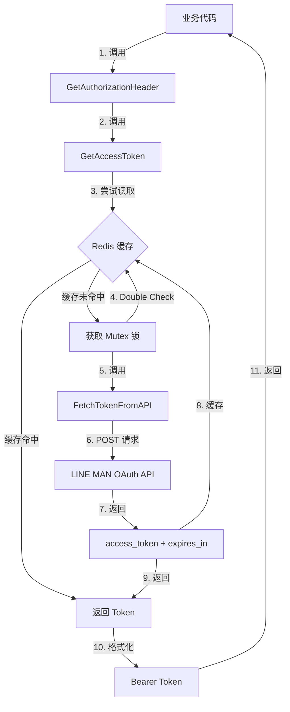

# LINE MAN OAuth Access Token 缓存功能 设计文档

> 本文档定义 LINE MAN OAuth Access Token 缓存功能的技术设计和实现方案。

## 📋 概述

实现 LINE MAN OAuth Access Token 的自动获取与 Redis 缓存机制，参考 Grab 平台的成熟实现。本功能为纯 Logic 层实现，不涉及数据库表、HTTP API 或前端界面，主要用于系统内部调用 LINE MAN API 时的认证。

**核心组件**：
- `FetchTokenFromAPI()` - OAuth Token 获取
- `GetAccessToken()` - Token 缓存管理（Redis + 双重检查锁）
- `GetAuthorizationHeader()` - Authorization Header 生成

**技术栈**：
- Go 1.23+ + GoFrame 2.x
- Redis 6.0+ (Token 缓存)
- LINE MAN OAuth API

---

## 🎯 规范对齐

### Go BMP 规范 (go-rules.mdc)

**遵循规范**：

- ✅ 使用 GoFrame 2.x 框架
- ✅ 所有方法包含中文注释
- ✅ 使用 `g.Redis()` 访问 Redis
- ✅ 使用 `g.Client()` 发送 HTTP 请求
- ✅ 使用 `g.Log()` 记录日志
- ✅ 使用 `gerror` 包处理错误
- ✅ 不修改 dao/entity/do/ 目录（本功能无需修改）

**架构模式**：

```
业务代码
  ↓ 调用
LinemanToken Logic 层
  ├─→ FetchTokenFromAPI() → LINE MAN OAuth API
  ├─→ GetAccessToken() → Redis 缓存
  └─→ GetAuthorizationHeader() → 返回 Bearer Token
```

---

## 🔄 代码复用分析

### 参考实现

#### Grab OAuth Token 实现（完整参考）

**文件**: `ttpos-bmp/app/ttpos-takeout/internal/logic/grab/grab.go`

**可复用的核心逻辑**：

1. **Redis 缓存策略** (L151-L193)
   ```go
   func (s *sGrab) getAccessToken(ctx context.Context) (string, error) {
       // 1. 尝试从 Redis 读取
       cachedToken, err := g.Redis().Get(ctx, redisKey)
       if err == nil && !cachedToken.IsEmpty() {
           return cachedToken.String(), nil
       }
   
       // 2. 获取锁（避免并发）
       s.tokenLock.Lock()
       defer s.tokenLock.Unlock()
   
       // 3. Double Check Redis
       cachedToken, err = g.Redis().Get(ctx, redisKey)
       if err == nil && !cachedToken.IsEmpty() {
           return cachedToken.String(), nil
       }
   
       // 4. 从 API 获取
       token, expiresIn, err := s.fetchTokenFromSDK(ctx)
       if err != nil {
           return "", err
       }
   
       // 5. 写入 Redis
       ttl := expiresIn - TokenExpireBuffer
       if ttl > 0 {
           g.Redis().SetEX(ctx, redisKey, token, int64(ttl))
       }
   
       return token, nil
   }
   ```

2. **Authorization Header 生成** (L195-L202)
   ```go
   func (s *sGrab) getAuthorizationHeader(ctx context.Context) (string, error) {
       token, err := s.getAccessToken(ctx)
       if err != nil {
           return "", err
       }
       return "Bearer " + token, nil
   }
   ```

**复用策略**：
- 直接复制 Redis 缓存逻辑（双重检查锁）
- 复制 Authorization Header 生成模式
- 复制日志记录格式和级别
- 调整为 LINE MAN OAuth API 调用

#### Grab Token 服务（参考配置管理）

**文件**: `ttpos-bmp/app/ttpos-takeout/internal/logic/grab_token/grab_token.go`

**可复用的配置管理**：

```go
// 配置懒加载
func (s *sGrabToken) getConfigLoader() *PartnerConfigLoader {
    if s.cfgLoader == nil {
        s.cfgLoader = &PartnerConfigLoader{}
    }
    return s.cfgLoader
}

// 密钥懒加载
func (s *sGrabToken) getSecretKey(ctx context.Context) string {
    if s.secretKey == "" {
        cfg := MustConfig(ctx)
        s.secretKey = cfg.SecretKey
    }
    return s.secretKey
}
```

### 集成点

#### 现有 Lineman Token 服务

**文件**: `ttpos-bmp/app/ttpos-takeout/internal/logic/lineman_token/lineman_token.go`

**已有基础**：
- ✅ Service 结构体定义（`sLinemanToken`）
- ✅ 配置加载器（`PartnerConfigLoader`）
- ✅ JWT Token 生成与验证（Partner Token）

**扩展方式**：
- 在现有 `sLinemanToken` 结构体中添加 `tokenLock sync.Mutex` 字段
- 新增 `FetchTokenFromAPI()`、`GetAccessToken()`、`GetAuthorizationHeader()` 三个方法
- 复用现有的 `getConfigLoader()` 和 `MustConf()` 方法

---

## 🏗️ 架构设计

### 整体架构



### 模块划分

#### Logic 层（核心实现）

**文件**: `ttpos-bmp/app/ttpos-takeout/internal/logic/lineman_token/lineman_token.go`

**结构体设计**：

```go
type sLinemanToken struct {
    cfgLoader *PartnerConfigLoader  // 配置加载器（已有）
    secretKey string                // JWT 密钥（已有）
    expiresIn int                   // Token 有效期（已有）
    tokenLock sync.Mutex            // ✨ 新增：互斥锁（用于双重检查锁）
}
```

**新增方法**：

```go
// FetchTokenFromAPI 从 LINE MAN OAuth 服务器获取新 Token
func (s *sLinemanToken) FetchTokenFromAPI(ctx context.Context) (token string, expiresIn int, err error)

// GetAccessToken 获取或刷新 Access Token (使用 Redis 缓存)
func (s *sLinemanToken) GetAccessToken(ctx context.Context) (string, error)

// GetAuthorizationHeader 获取 Authorization 请求头
func (s *sLinemanToken) GetAuthorizationHeader(ctx context.Context) (string, error)
```

### 关键设计模式

#### 1. 双重检查锁（Double-Check Lock）

**目的**: 避免并发场景下重复请求 OAuth API

**实现**：

```go
func (s *sLinemanToken) GetAccessToken(ctx context.Context) (string, error) {
    conf := s.getConfigLoader().MustConf()
    redisKey := RedisKeyTokenPrefix + conf.ClientID

    // 第一次检查（无锁）
    cachedToken, err := g.Redis().Get(ctx, redisKey)
    if err == nil && !cachedToken.IsEmpty() {
        g.Log().Debugf(ctx, "[LINE MAN] OAuth Token 缓存命中: %s", redisKey)
        return cachedToken.String(), nil
    }

    // 获取锁
    s.tokenLock.Lock()
    defer s.tokenLock.Unlock()

    // 第二次检查（持锁）
    cachedToken, err = g.Redis().Get(ctx, redisKey)
    if err == nil && !cachedToken.IsEmpty() {
        return cachedToken.String(), nil
    }

    // 从 API 获取
    g.Log().Infof(ctx, "[LINE MAN] OAuth Token 缓存未命中，从远程获取")
    token, expiresIn, err := s.FetchTokenFromAPI(ctx)
    if err != nil {
        return "", err
    }

    // 写入 Redis 缓存
    ttl := expiresIn - TokenExpireBuffer
    if ttl > 0 {
        if err := g.Redis().SetEX(ctx, redisKey, token, int64(ttl)); err != nil {
            g.Log().Warningf(ctx, "[LINE MAN] Token 缓存到 Redis 失败: %v", err)
        } else {
            g.Log().Infof(ctx, "[LINE MAN] OAuth Token 已缓存到 Redis: key=%s, ttl=%ds", redisKey, ttl)
        }
    }

    return token, nil
}
```

#### 2. 缓存失败降级（Cache-Aside Pattern）

**策略**: Redis 写入失败不影响业务流程

```go
// Redis 写入失败仅记录日志
if err := g.Redis().SetEX(ctx, redisKey, token, int64(ttl)); err != nil {
    g.Log().Warningf(ctx, "[LINE MAN] Token 缓存到 Redis 失败: %v", err)
    // ✅ 不返回错误，继续返回 Token
}
```

---

## 📊 数据模型

### 配置模型（已有，需扩展）

**文件**: `ttpos-bmp/app/ttpos-takeout/internal/model/conf/provider.go`

**当前定义**（已实现）：

```go
type Lineman struct {
    ClientID     string        `json:"clientId"`     // OAuth Client ID
    ClientSecret string        `json:"clientSecret"` // OAuth Client Secret
    SecretKey    string        `json:"secretKey"`    // JWT 签名密钥
    Endpoint     string        `json:"endpoint"`     // ✅ v2.13.1 新增
    Environment  string        `json:"environment"`  // production 或 staging
    Timeout      time.Duration `json:"timeout"`      // API 超时时间
}
```

### OAuth 响应模型（新增）

**文件**: `ttpos-bmp/app/ttpos-takeout/internal/model/dto/lineman/oauth.go` (新建)

```go
package lineman

// LinemanOAuthTokenResp LINE MAN OAuth Token 响应
type LinemanOAuthTokenResp struct {
    AccessToken string `json:"access_token"` // 访问令牌
    ExpiresIn   int    `json:"expires_in"`   // 有效期（秒）
    TokenType   string `json:"token_type"`   // 令牌类型（通常为 Bearer）
}
```

---

## 🔌 API 设计

### LINE MAN OAuth API

#### API: 获取 Access Token

**请求**:

- **URL**: `{LINEMAN_PLATFORM_ENDPOINT}/oauth/token`
- **Method**: `POST`
- **Headers**:
  ```json
  {
    "Content-Type": "application/json"
  }
  ```
- **Body**:
  ```json
  {
    "grant_type": "client_credentials",
    "client_id": "{LINEMAN_PLATFORM_CLIENT_ID}",
    "client_secret": "{LINEMAN_PLATFORM_CLIENT_SECRET}",
    "scope": "partner_api"
  }
  ```

**成功响应**:

```json
{
  "access_token": "eyJhbGc...",
  "expires_in": 3600,
  "token_type": "Bearer"
}
```

**错误响应**:

```json
{
  "error": "invalid_client",
  "error_description": "Client authentication failed"
}
```

### 内部接口（Logic 层）

#### 接口 1: FetchTokenFromAPI

```go
// FetchTokenFromAPI 从 LINE MAN OAuth 服务器获取新 Token
// 参数：
//   - ctx: 上下文
// 返回：
//   - token: Access Token
//   - expiresIn: Token 有效期（秒）
//   - err: 错误信息
func (s *sLinemanToken) FetchTokenFromAPI(ctx context.Context) (token string, expiresIn int, err error)
```

#### 接口 2: GetAccessToken

```go
// GetAccessToken 获取或刷新 Access Token (使用 Redis 缓存)
// 优先从 Redis 读取，缓存未命中时调用 FetchTokenFromAPI()
// 使用双重检查锁避免并发重复请求
// 参数：
//   - ctx: 上下文
// 返回：
//   - token: Access Token
//   - err: 错误信息
func (s *sLinemanToken) GetAccessToken(ctx context.Context) (string, error)
```

#### 接口 3: GetAuthorizationHeader

```go
// GetAuthorizationHeader 获取 Authorization 请求头
// 返回格式：Bearer {token}
// 参数：
//   - ctx: 上下文
// 返回：
//   - header: 格式化的 Authorization 头
//   - err: 错误信息
func (s *sLinemanToken) GetAuthorizationHeader(ctx context.Context) (string, error)
```

---

## ⚡ 缓存设计

### Redis 缓存策略

**Key 命名规范**:

```
格式: lineman:oauth:token:{client_id}
示例: lineman:oauth:token:LM_PROD_CLIENT_123
```

**TTL 计算**:

```go
ttl := expiresIn - TokenExpireBuffer  // expiresIn - 60 秒
```

**缓存写入**:

```go
g.Redis().SetEX(ctx, redisKey, token, int64(ttl))
```

**缓存读取**:

```go
cachedToken, err := g.Redis().Get(ctx, redisKey)
if err == nil && !cachedToken.IsEmpty() {
    return cachedToken.String(), nil
}
```

**缓存更新策略**: Cache-Aside Pattern

1. 读取时：先查 Redis，未命中则调用 API 并写入缓存
2. 更新时：无需手动更新，Token 过期后自动重新获取
3. 失效时：Redis TTL 自动过期

---

## 🚨 错误处理

### 错误场景

#### 场景 1: OAuth API 请求失败

- **处理方式**: 返回包含详细错误信息的 `gerror`
- **用户影响**: 后续 LINE MAN API 调用失败
- **代码示例**:
  ```go
  if err != nil {
      g.Log().Errorf(ctx, "[LINE MAN] OAuth 请求失败: %v", err)
      return "", 0, gerror.Wrap(err, "LINE MAN OAuth 请求失败")
  }
  ```

#### 场景 2: OAuth 响应缺少必需字段

- **处理方式**: 返回明确的错误信息
- **用户影响**: Token 获取失败
- **代码示例**:
  ```go
  if result.AccessToken == "" || result.ExpiresIn == 0 {
      return "", 0, gerror.New("LINE MAN OAuth 响应缺少必需字段")
  }
  ```

#### 场景 3: Redis 缓存失败

- **处理方式**: 记录警告日志，不阻塞业务
- **用户影响**: 无（降级到直接调用 API）
- **代码示例**:
  ```go
  if err := g.Redis().SetEX(ctx, redisKey, token, int64(ttl)); err != nil {
      g.Log().Warningf(ctx, "[LINE MAN] Token 缓存到 Redis 失败: %v", err)
      // 不返回错误，继续返回 Token
  }
  ```

#### 场景 4: 并发场景下的竞态条件

- **处理方式**: 使用双重检查锁（DCL）机制
- **用户影响**: 无（只有一个请求调用 API）
- **代码示例**: 见"架构设计 → 双重检查锁"章节

---

## 🔒 安全设计

### 敏感信息保护

- ✅ `client_secret` 不记录到日志
- ✅ Token 存储在 Redis，设置合理的 TTL
- ✅ 配置通过环境变量注入，不硬编码
- ✅ 使用 HTTPS 调用 LINE MAN OAuth API

### 日志安全

```go
// ❌ 禁止：记录敏感信息
g.Log().Infof(ctx, "client_secret: %s", conf.ClientSecret)

// ✅ 正确：脱敏或不记录
g.Log().Infof(ctx, "使用 client_id: %s 请求 OAuth Token", conf.ClientID)
```

---

## 🧪 测试策略

### 单元测试

**目标覆盖率**: ≥ 80%

**测试文件**: `ttpos-bmp/app/ttpos-takeout/internal/logic/lineman_token/lineman_token_test.go`

**测试场景**:

1. **OAuth API 调用成功**
   ```go
   func TestLinemanToken_FetchTokenFromAPI_Success(t *testing.T) {
       // Mock HTTP 响应
       // 验证返回的 token 和 expires_in
   }
   ```

2. **OAuth API 调用失败**
   ```go
   func TestLinemanToken_FetchTokenFromAPI_NetworkError(t *testing.T) {
       // Mock 网络错误
       // 验证错误处理
   }
   ```

3. **Redis 缓存命中**
   ```go
   func TestLinemanToken_GetAccessToken_CacheHit(t *testing.T) {
       // Mock Redis 返回缓存的 Token
       // 验证不调用 OAuth API
   }
   ```

4. **Redis 缓存未命中**
   ```go
   func TestLinemanToken_GetAccessToken_CacheMiss(t *testing.T) {
       // Mock Redis 返回空
       // 验证调用 OAuth API 并写入缓存
   }
   ```

5. **并发安全测试**
   ```go
   func TestLinemanToken_GetAccessToken_Concurrent(t *testing.T) {
       // 并发调用 GetAccessToken()
       // 验证只调用一次 OAuth API
   }
   ```

6. **Redis 故障降级**
   ```go
   func TestLinemanToken_GetAccessToken_RedisFail(t *testing.T) {
       // Mock Redis 故障
       // 验证业务不受影响，直接返回 Token
   }
   ```

### 集成测试

**测试内容**:
- 实际调用 LINE MAN OAuth API（使用 staging 环境）
- 验证 Token 有效性
- 验证缓存过期和自动刷新

---

## 📈 性能优化

### 优化策略

1. **Redis 缓存优化**:
   - 缓存命中率目标：> 90%
   - 合理的 TTL 设置（`expires_in - 60`）
   - 缓存失败不阻塞业务

2. **并发控制**:
   - 使用 `sync.Mutex` 实现双重检查锁
   - 避免并发场景下的重复请求
   - 锁的粒度最小化（仅在缓存未命中时持锁）

3. **接口响应时间**:
   - 缓存命中：< 10ms
   - API 调用：< 500ms
   - 使用 context timeout 控制超时

### 性能指标

| 指标 | 目标值 | 监控方式 |
|------|--------|----------|
| Redis 缓存命中率 | > 90% | 日志统计 |
| 缓存命中响应时间 | < 10ms | 性能测试 |
| API 调用响应时间 | < 500ms | 性能测试 |
| 并发 Token 重复请求率 | 0% | 并发测试 |

---

## 📚 实现清单

### Phase 1: 配置和基础结构 ✅ 已完成

- [x] 添加 endpoint 配置到 `config.tpl.yaml`
- [x] 更新 `Lineman` 结构体（添加 `Endpoint` 字段）
- [x] 创建配置文档（`lineman-env-example.md`, `CHANGELOG-v2.13.1.md`）

### Phase 2: 核心功能实现

- [ ] 创建 OAuth 响应 DTO（`internal/model/dto/lineman/oauth.go`）
- [ ] 在 `sLinemanToken` 结构体中添加 `tokenLock sync.Mutex`
- [ ] 实现 `FetchTokenFromAPI()` 方法
- [ ] 实现 `GetAccessToken()` 方法（Redis 缓存 + DCL）
- [ ] 实现 `GetAuthorizationHeader()` 方法
- [ ] 更新 Service 接口定义

### Phase 3: 测试和文档

- [ ] 编写单元测试（覆盖率 ≥ 80%）
- [ ] 编写并发安全测试
- [ ] 编写集成测试（与 LINE MAN API）
- [ ] 更新代码注释（中文）
- [ ] 更新 design.md（本文档）

**详细任务**: 参见 `tasks.md`

---

## Graphiti & 活动日志

- Related Episode: `[待补充 - 实现完成后记录经验]`
- 模板：`docs/agent/templates/graphiti-episode.md`
- 活动日志：`docs/team/activities/rikugun/2026-01/2026-01-07.md`
- 在实现完成后，将 Token 缓存策略和双重检查锁的实践经验记录到 Graphiti

---

**版本**: v1.0.0  
**创建日期**: 2026-01-07  
**作者**: rikugun  
**审核者**: 待指定

