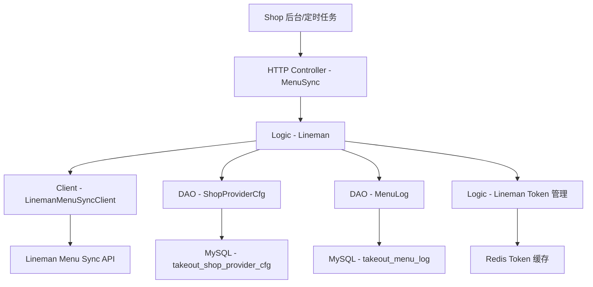

# Lineman Menu Sync V2 技术设计文档

> 本文档定义 Lineman Menu Sync V2 的技术设计和实现方案。

## 📋 概述

实现 TTPOS 与泰国外卖平台 Lineman 的菜单数据同步功能，将 TTPOS 的菜单数据（分类、商品、规格、属性、价格等）通过 Lineman Menu Sync V2 API 自动同步到 Lineman 平台。

**核心目标**：
- 复用现有的 `lineman_token` Token 管理逻辑，重构到统一的 `lineman` 包
- 复用现有的数据库表（`takeout_shop_provider_cfg`, `takeout_menu_log`）
- 实现 TTPOS → Lineman 的数据映射转换
- 实现可靠的 API 调用和错误处理

**技术栈**：
- **框架**: GoFrame 2.x
- **HTTP Client**: GoFrame g.Client()
- **数据库**: MySQL 8.0+（复用现有表）
- **缓存**: Redis 6.0+（Token 缓存）
- **模块**: ttpos-bmp/app/ttpos-takeout

---

## 🎯 规范对齐

### Go BMP 规范 (go-bmp.mdc)

本设计严格遵循 GoFrame 微服务规范：

**核心约束**：
- ✅ 使用 GoFrame 2.x 框架
- ✅ 禁止修改 `dao/entity/do/` 目录（自动生成）
- ✅ Logic 层实现业务逻辑，依赖 DAO 层
- ✅ Client 层封装第三方 API 调用
- ✅ gRPC 服务注册到 Nacos（如需要）
- ✅ 遵循 GoFrame 项目结构和命名规范

**依赖规则**：
```
HTTP/RPC Controller
  ↓ 调用
Logic 层（业务逻辑）
  ↓ 使用
Client 层（API封装） + DAO 层（数据访问）
```

### API 设计规范 (api.mdc)

- ✅ RESTful API 使用标准响应格式
- ✅ gRPC 使用 Protobuf 定义（如需要）
- ✅ 第三方 API 使用 HTTP Client 封装

### 数据库规范 (database.mdc)

- ✅ 复用现有表，无需创建新表
- ✅ 时间字段使用 int 类型（Unix 时间戳）
- ✅ 使用 DAO 层访问数据（GoFrame 自动生成）

---

## 🔄 代码复用分析

### 可复用的现有组件

1. **Token 管理逻辑**（需重构）
   - 路径: `ttpos-bmp/app/ttpos-takeout/internal/logic/lineman_token/`
   - 文件:
     - `lineman_token.go` - OAuth Token 获取、缓存、刷新
     - `config.go` - 配置加载和管理
     - `partner_config_loader.go` - Partner 配置加载器
   - 重构到: `internal/logic/lineman/`

2. **数据库表**（已存在，直接复用）
   - `takeout_shop_provider_cfg` - 门店第三方集成配置
   - `takeout_menu_log` - 菜单同步记录表

3. **DAO 层**（已存在，直接复用）
   - `internal/dao/shop_provider_cfg.go`
   - `internal/dao/menu_log.go`
   - `internal/model/entity/shop_provider_cfg.go`
   - `internal/model/entity/menu_log.go`

### 重构策略

**Step 1: 迁移文件**
```bash
# 将 lineman_token/ 下的文件移动到 lineman/
mv internal/logic/lineman_token/lineman_token.go → internal/logic/lineman/token.go
mv internal/logic/lineman_token/config.go → internal/logic/lineman/token_config.go
mv internal/logic/lineman_token/partner_config_loader.go → internal/logic/lineman/partner_config_loader.go
```

**Step 2: 更新包名和服务注册**
```go
// 所有迁移文件
- package lineman_token
+ package lineman

// internal/logic/lineman/token.go
func init() {
-   service.RegisterLinemanToken(New())
+   service.RegisterLineman(New())
}
```

**Step 3: 更新服务接口**
```go
// internal/service/lineman.go（新建或更新）
type ILineman interface {
    // Token 管理（原 lineman_token 的方法）
    GenerateToken(ctx context.Context, clientID, clientSecret string) (string, int, error)
    ParseToken(ctx context.Context, tokenStr string) (*lineman.LinemanTokenClaims, error)
    GetAccessToken(ctx context.Context) (string, error)
    GetAuthorizationHeader(ctx context.Context) (string, error)
    GetPartnerConfig(ctx context.Context, code string) (*conf.LinemanPartner, error)
    GetPartnerConfigByClientID(ctx context.Context, clientID string) (*conf.LinemanPartner, error)
    FetchTokenFromAPI(ctx context.Context) (string, int, error)
    
    // 菜单同步（新增的方法）
    SyncMenu(ctx context.Context, shopUUID uint64, partnerId, storeId string) error
    BuildMenuPayload(ctx context.Context, shopUUID uint64) (*dto.MenuSyncRequest, error)
}
```

---

## 🏗️ 架构设计

### 整体架构图



### 分层设计原则

**GoFrame BMP 三层架构**:

```
HTTP/RPC Controller 层
  ↓ 调用
Logic 层（业务逻辑）
  ↓ 依赖
Client 层（API封装） + DAO 层（数据访问）
```

**依赖规则**:
- ✅ Controller 依赖 Logic
- ✅ Logic 依赖 Client 和 DAO
- ✅ Logic 内部可以相互依赖（同包内直接调用，如 Token 管理）
- ❌ 禁止下层依赖上层
- ❌ 禁止修改 DAO/Entity/DO（自动生成）

### 模块划分

#### 代码结构（最终状态）

```
ttpos-bmp/app/ttpos-takeout/
├── internal/
│   ├── controller/
│   │   └── http/
│   │       └── lineman_menu_sync.go      # 【新增】HTTP 接口
│   │
│   ├── logic/
│   │   └── lineman/                      # 【重构】统一 Lineman 逻辑
│   │       ├── token.go                  # 【迁移】OAuth Token 管理
│   │       ├── token_config.go           # 【迁移】配置加载
│   │       ├── partner_config_loader.go  # 【迁移】Partner 配置加载器
│   │       ├── menu_sync.go              # 【新增】菜单同步业务逻辑
│   │       └── data_mapper.go            # 【新增】数据映射转换
│   │
│   ├── client/
│   │   └── lineman/                      # 【新增】API Client
│   │       ├── menu_sync_client.go       # Menu Sync API Client
│   │       └── retry.go                  # 重试策略
│   │
│   ├── dao/                              # 【复用】数据访问（自动生成）
│   │   ├── shop_provider_cfg.go          # ✅ 已存在
│   │   └── menu_log.go                   # ✅ 已存在
│   │
│   ├── model/
│   │   ├── entity/                       # 【复用】数据实体（自动生成）
│   │   │   ├── shop_provider_cfg.go      # ✅ 已存在
│   │   │   └── menu_log.go               # ✅ 已存在
│   │   ├── do/                           # 【复用】数据对象（自动生成）
│   │   │   ├── shop_provider_cfg.go
│   │   │   └── menu_log.go
│   │   └── dto/                          # 【新增】数据传输对象
│   │       └── lineman/
│   │           ├── menu_sync_request.go  # 菜单同步请求
│   │           ├── menu_sync_response.go # 菜单同步响应
│   │           └── menu_data.go          # 菜单数据结构
│   │
│   └── service/
│       └── lineman.go                    # 【更新】Lineman 服务接口
│
└── manifest/
    └── config/
        └── config.yaml                   # Lineman 配置
```

---

## 🗄️ 数据库设计

### 复用现有表

**无需创建新表**，直接使用现有的两张表：

#### 表 1: takeout_shop_provider_cfg（门店配置）

```sql
-- 已存在的表结构
CREATE TABLE IF NOT EXISTS `takeout_shop_provider_cfg` (
    `id` BIGINT UNSIGNED NOT NULL AUTO_INCREMENT COMMENT '主键ID',
    `uuid` BIGINT UNSIGNED NOT NULL DEFAULT 0 COMMENT '唯一标识',
    `shop_uuid` BIGINT UNSIGNED NOT NULL DEFAULT 0 COMMENT '门店UUID',
    `provider_name` VARCHAR(32) NOT NULL DEFAULT 'grab' COMMENT '第三方名称，如 grab, lineman',
    `provider_merchant_id` VARCHAR(128) NOT NULL DEFAULT '' COMMENT '第三方商户ID（partnerId_storeId）',
    `provider_shop_status` ENUM('INACTIVE','ACTIVE','SYNCING','FAILED') NOT NULL DEFAULT 'INACTIVE' COMMENT '门店集成状态',
    `created_at` INT NOT NULL DEFAULT 0 COMMENT '创建时间',
    `updated_at` INT NOT NULL DEFAULT 0 COMMENT '更新时间',
    `deleted_at` INT NOT NULL DEFAULT 0 COMMENT '删除时间',
    PRIMARY KEY (`id`),
    UNIQUE KEY `uk_shop_provider` (`shop_uuid`, `provider_name`),
    KEY `idx_provider_name` (`provider_name`)
) ENGINE=InnoDB DEFAULT CHARSET=utf8mb4 COMMENT='门店第三方集成配置';
```

**Lineman 使用方式**：
- `provider_name` = `'lineman'`
- `provider_merchant_id` = `'{partnerId}_{storeId}'` 或 JSON 格式
- `provider_shop_status`:
  - `INACTIVE`: 未启用
  - `ACTIVE`: 已启用，可同步
  - `SYNCING`: 同步中
  - `FAILED`: 同步失败

**查询示例**：
```go
// 获取 Lineman 配置
cfg, err := dao.ShopProviderCfg.Ctx(ctx).Where(
    dao.ShopProviderCfg.Columns().ShopUuid, shopUUID,
).Where(
    dao.ShopProviderCfg.Columns().ProviderName, "lineman",
).One()
```

#### 表 2: takeout_menu_log（菜单同步日志）

```sql
-- 已存在的表结构
CREATE TABLE IF NOT EXISTS `takeout_menu_log` (
    `id` bigint(20) NOT NULL AUTO_INCREMENT COMMENT '主键',
    `uuid` varchar(100) NOT NULL COMMENT '唯一ID',
    `merchant_id` varchar(100) NOT NULL COMMENT '商户ID（partnerId_storeId）',
    `provider_name` varchar(50) NOT NULL COMMENT '渠道: grab, lineman',
    `sync_type` varchar(50) DEFAULT 'FULL' COMMENT '同步类型: FULL, PARTIAL, NOTIFY',
    `request_id` varchar(100) DEFAULT NULL COMMENT '请求ID (来自第三方平台)',
    `status` varchar(20) DEFAULT NULL COMMENT '同步状态: QUEUED, SUCCESS, FAIL, PROCESSING',
    `menu_snapshot` json DEFAULT NULL COMMENT '菜单快照(JSON)',
    `error_code` varchar(50) DEFAULT NULL COMMENT '错误代码',
    `error_msg` text DEFAULT NULL COMMENT '错误信息',
    `created_at` int NOT NULL DEFAULT 0 COMMENT '创建时间',
    `updated_at` int NOT NULL DEFAULT 0 COMMENT '更新时间',
    PRIMARY KEY (`id`),
    UNIQUE KEY `uk_uuid` (`uuid`),
    KEY `idx_merchant` (`merchant_id`, `provider_name`),
    KEY `idx_status` (`status`),
    KEY `idx_created_at` (`created_at`)
) ENGINE=InnoDB DEFAULT CHARSET=utf8mb4 COMMENT='菜单同步记录表';
```

**Lineman 使用方式**：
- `provider_name` = `'lineman'`
- `merchant_id` = `'{partnerId}_{storeId}'`
- `sync_type` = `'FULL'` / `'PARTIAL'`
- `request_id` = Lineman API 返回的 `menuSyncRequestId`
- `status`:
  - `QUEUED`: 等待同步
  - `PROCESSING`: 同步中
  - `SUCCESS`: 成功
  - `FAIL`: 失败
- `menu_snapshot`: 菜单数据 JSON 快照（用于调试和追溯）

**插入示例**：
```go
// 记录同步日志
logUUID := gconv.String(grand.N(1, 999999999))
_, err := dao.MenuLog.Ctx(ctx).Data(do.MenuLog{
    Uuid:         logUUID,
    MerchantId:   fmt.Sprintf("%s_%s", partnerId, storeId),
    ProviderName: "lineman",
    SyncType:     "FULL",
    RequestId:    resp.MenuSyncRequestId,
    Status:       "SUCCESS",
    MenuSnapshot: menuJSON,
    CreatedAt:    gtime.Now().Unix(),
    UpdatedAt:    gtime.Now().Unix(),
}).Insert()
```

---

## 📊 数据模型

### DTO 定义

#### Request DTO

```go
// internal/model/dto/lineman/menu_sync_request.go

// MenuSyncRequest Lineman 菜单同步请求
type MenuSyncRequest struct {
    MenuGroups []*MenuGroup `json:"menuGroups"`
}

// MenuGroup 菜单分类
type MenuGroup struct {
    ID              string      `json:"id"`              // 分类ID（TTPOS-CAT-{id}）
    Name            NameTrans   `json:"name"`            // 分类名称（多语言）
    UseSellingTime  bool        `json:"useSellingTime"`  // 是否使用时段销售（固定false）
    MenuItems       []*MenuItem `json:"menuItems"`       // 商品列表
}

// MenuItem 菜单商品
type MenuItem struct {
    ID                        string                  `json:"id"`                        // 商品ID
    Name                      NameTrans               `json:"name"`                      // 商品名称
    Description               DescTrans               `json:"description"`               // 商品描述
    Price                     float64                 `json:"price"`                     // 价格（分）
    PhotoUrl                  string                  `json:"photoUrl,omitempty"`        // 图片URL
    MenuStatus                string                  `json:"menuStatus"`                // 状态
    SalesChannelsAvailability *ChannelsAvailability   `json:"salesChannelsAvailability"` // 渠道可用性
    Properties                []*Property             `json:"properties,omitempty"`      // 规格/属性
}

// Property 属性组（规格/加料/属性）
type Property struct {
    ID     string      `json:"id"`     // 属性组ID
    Name   NameTrans   `json:"name"`   // 属性组名称
    Min    int         `json:"min"`    // 最小选择数
    Max    int         `json:"max,omitempty"` // 最大选择数
    Type   string      `json:"type"`   // 类型：1=单选 2=复选
    Values []*PropValue `json:"values"` // 属性值列表
}

// PropValue 属性值
type PropValue struct {
    ID     string    `json:"id"`     // 属性值ID
    Name   NameTrans `json:"name"`   // 属性值名称
    Price  float64   `json:"price"`  // 价格（分）
    Status int       `json:"status"` // 状态：1=可用 2=售罄 3=暂停
}

// NameTrans 名称翻译
type NameTrans struct {
    Thai    string `json:"thai"`    // 泰语
    English string `json:"english"` // 英语
}

// DescTrans 描述翻译
type DescTrans struct {
    Thai    string `json:"thai"`
    English string `json:"english"`
}

// ChannelsAvailability 渠道可用性
type ChannelsAvailability struct {
    Delivery bool `json:"delivery"` // 配送（固定true）
    Pickup   bool `json:"pickup"`   // 自提（固定true）
}
```

#### Response DTO

```go
// internal/model/dto/lineman/menu_sync_response.go

// MenuSyncResponse Lineman 菜单同步响应
type MenuSyncResponse struct {
    Status            string `json:"status"`            // "ok" / "error"
    Code              string `json:"code"`              // "SUCCESS" / 错误码
    Message           string `json:"message,omitempty"` // 错误消息
    MenuSyncRequestId string `json:"menuSyncRequestId,omitempty"` // 请求ID
}
```

---

## 🔌 API 设计

### 第三方 API - Lineman Menu Sync V2

#### API: 同步菜单

**请求**:

- **URL**: `PUT {endpoint}/v2/partners/{partnerId}/stores/{storeId}/menus`
- **Method**: `PUT`
- **Headers**:
  ```json
  {
    "Authorization": "Bearer {access_token}",
    "Content-Type": "application/json"
  }
  ```
- **Path Parameters**:
  - `partnerId`: Partner ID
  - `storeId`: Store ID
- **Body**: 参见 `MenuSyncRequest` 结构

**响应**:

成功：
```json
{
  "status": "ok",
  "code": "SUCCESS",
  "menuSyncRequestId": "unique-request-id"
}
```

失败：
```json
{
  "status": "error",
  "code": "ERROR_CODE",
  "message": "Error description"
}
```

### 内部 HTTP API（可选）

如需在 Shop 后台手动触发同步，可添加 HTTP 接口：

```go
// POST /api/v1/takeout/lineman/menu_sync
// 手动触发菜单同步
```

---

## 🧩 组件和接口

### Logic 层

#### Logic 接口和实现

```go
// internal/logic/lineman/lineman.go

type sLineman struct {
    // Token 管理（从 lineman_token 迁移过来）
    cfgLoader *PartnerConfigLoader
    secretKey string
    expiresIn int
    tokenLock sync.Mutex
}

func init() {
    service.RegisterLineman(New())
}

func New() *sLineman {
    return &sLineman{
        expiresIn: 3600,
    }
}

// ============================================================================
// Token 管理方法（从 lineman_token 迁移）
// ============================================================================

func (s *sLineman) GenerateToken(ctx context.Context, clientID, clientSecret string) (string, int, error)
func (s *sLineman) ParseToken(ctx context.Context, tokenStr string) (*lineman.LinemanTokenClaims, error)
func (s *sLineman) GetAccessToken(ctx context.Context) (string, error)
func (s *sLineman) GetAuthorizationHeader(ctx context.Context) (string, error)
func (s *sLineman) FetchTokenFromAPI(ctx context.Context) (string, int, error)
func (s *sLineman) GetPartnerConfig(ctx context.Context, code string) (*conf.LinemanPartner, error)
func (s *sLineman) GetPartnerConfigByClientID(ctx context.Context, clientID string) (*conf.LinemanPartner, error)

// ============================================================================
// 菜单同步方法（新增）
// ============================================================================

// SyncMenu 同步菜单到 Lineman
func (s *sLineman) SyncMenu(ctx context.Context, shopUUID uint64, partnerId, storeId string) error {
    // 1. 获取 Authorization Header（复用同包内的 Token 管理）
    authHeader, err := s.GetAuthorizationHeader(ctx)
    if err != nil {
        return gerror.Wrap(err, "获取 Authorization Header 失败")
    }

    // 2. 构建菜单数据
    menuPayload, err := s.BuildMenuPayload(ctx, shopUUID)
    if err != nil {
        return gerror.Wrap(err, "构建菜单数据失败")
    }

    // 3. 调用 Client 发送请求
    client := NewMenuSyncClient()
    resp, err := client.SyncMenu(ctx, partnerId, storeId, authHeader, menuPayload)
    if err != nil {
        // 记录失败日志
        s.recordMenuLog(ctx, partnerId, storeId, "FULL", "FAIL", "", menuPayload, err.Error())
        return gerror.Wrap(err, "调用 Lineman API 失败")
    }

    // 4. 记录成功日志
    s.recordMenuLog(ctx, partnerId, storeId, "FULL", "SUCCESS", resp.MenuSyncRequestId, menuPayload, "")
    
    // 5. 更新 provider_shop_status
    s.updateProviderStatus(ctx, shopUUID, "ACTIVE")

    return nil
}

// BuildMenuPayload 构建菜单数据
func (s *sLineman) BuildMenuPayload(ctx context.Context, shopUUID uint64) (*dto.MenuSyncRequest, error) {
    // 使用 data_mapper.go 中的逻辑构建数据
    mapper := NewDataMapper(ctx)
    return mapper.BuildMenuPayload(shopUUID)
}

// recordMenuLog 记录同步日志
func (s *sLineman) recordMenuLog(ctx context.Context, partnerId, storeId, syncType, status, requestId string, menu interface{}, errMsg string) error {
    // 使用 DAO 插入日志
    // ...
}

// updateProviderStatus 更新门店集成状态
func (s *sLineman) updateProviderStatus(ctx context.Context, shopUUID uint64, status string) error {
    // 更新 takeout_shop_provider_cfg 表
    // ...
}
```

#### Data Mapper

```go
// internal/logic/lineman/data_mapper.go

type DataMapper struct {
    ctx context.Context
}

func NewDataMapper(ctx context.Context) *DataMapper {
    return &DataMapper{ctx: ctx}
}

// BuildMenuPayload 构建完整的菜单数据
func (m *DataMapper) BuildMenuPayload(shopUUID uint64) (*dto.MenuSyncRequest, error) {
    // 1. 查询 TTPOS 菜单数据（分类、商品、规格等）
    categories, err := m.fetchCategories(shopUUID)
    if err != nil {
        return nil, err
    }

    // 2. 转换为 Lineman 格式
    menuGroups := make([]*dto.MenuGroup, 0, len(categories))
    for _, cat := range categories {
        menuGroup, err := m.mapCategory(cat)
        if err != nil {
            g.Log().Warningf(m.ctx, "映射分类失败: %v", err)
            continue
        }
        menuGroups = append(menuGroups, menuGroup)
    }

    return &dto.MenuSyncRequest{
        MenuGroups: menuGroups,
    }, nil
}

// mapCategory 映射分类
func (m *DataMapper) mapCategory(cat *entity.Category) (*dto.MenuGroup, error) {
    menuGroup := &dto.MenuGroup{
        ID:             fmt.Sprintf("TTPOS-CAT-%d", cat.Id),
        Name:           m.buildNameTranslation(cat.Name, cat.NameTH, cat.NameEN),
        UseSellingTime: false, // TTPOS 不支持时段销售
        MenuItems:      make([]*dto.MenuItem, 0),
    }

    // 映射商品
    items, err := m.fetchItems(cat.Id)
    if err != nil {
        return nil, err
    }

    for _, item := range items {
        menuItem, err := m.mapItem(item)
        if err != nil {
            g.Log().Warningf(m.ctx, "映射商品失败: %v", err)
            continue
        }
        menuGroup.MenuItems = append(menuGroup.MenuItems, menuItem)
    }

    return menuGroup, nil
}

// mapItem 映射商品
func (m *DataMapper) mapItem(item *entity.Item) (*dto.MenuItem, error) {
    menuItem := &dto.MenuItem{
        ID:          fmt.Sprintf("TTPOS-ITEM-%d", item.Id),
        Name:        m.buildNameTranslation(item.Name, item.NameTH, item.NameEN),
        Description: m.buildDescTranslation(item.Desc, item.DescTH, item.DescEN),
        Price:       item.Price * 100, // 元 → 分
        PhotoUrl:    m.getFirstPhoto(item.Photos),
        MenuStatus:  m.mapStatus(item.Status),
        SalesChannelsAvailability: &dto.ChannelsAvailability{
            Delivery: true,
            Pickup:   true,
        },
        Properties: make([]*dto.Property, 0),
    }

    // 映射规格/属性
    properties, err := m.fetchProperties(item.Id)
    if err != nil {
        return nil, err
    }

    for _, prop := range properties {
        property, err := m.mapProperty(prop)
        if err != nil {
            g.Log().Warningf(m.ctx, "映射属性失败: %v", err)
            continue
        }
        menuItem.Properties = append(menuItem.Properties, property)
    }

    return menuItem, nil
}

// buildNameTranslation 构建名称翻译
func (m *DataMapper) buildNameTranslation(nameCN, nameTH, nameEN string) dto.NameTrans {
    // 优先使用翻译，否则使用中文降级
    if nameTH != "" && nameEN != "" {
        return dto.NameTrans{
            Thai:    nameTH,
            English: nameEN,
        }
    }
    return dto.NameTrans{
        Thai:    nameCN,
        English: nameCN,
    }
}

// buildDescTranslation 构建描述翻译
func (m *DataMapper) buildDescTranslation(descCN, descTH, descEN string) dto.DescTrans {
    if descTH != "" && descEN != "" {
        return dto.DescTrans{
            Thai:    descTH,
            English: descEN,
        }
    }
    return dto.DescTrans{
        Thai:    descCN,
        English: descCN,
    }
}

// mapStatus 映射商品状态
func (m *DataMapper) mapStatus(status int) string {
    switch status {
    case 1:
        return "AVAILABLE"
    case 2:
        return "SOLD_OUT_TODAY"
    case 3:
        return "SUSPENDED"
    default:
        return "AVAILABLE"
    }
}

// fetchCategories, fetchItems, fetchProperties 等方法...
```

### Client 层

```go
// internal/client/lineman/menu_sync_client.go

type MenuSyncClient struct {
    endpoint string
    timeout  time.Duration
}

func NewMenuSyncClient() *MenuSyncClient {
    cfg := MustConfig(context.Background())
    return &MenuSyncClient{
        endpoint: cfg.Endpoint,
        timeout:  cfg.Timeout,
    }
}

// SyncMenu 同步菜单到 Lineman
func (c *MenuSyncClient) SyncMenu(
    ctx context.Context,
    partnerId, storeId string,
    authHeader string,
    menuData *dto.MenuSyncRequest,
) (*dto.MenuSyncResponse, error) {
    // 1. 构造 URL
    url := fmt.Sprintf("%s/v2/partners/%s/stores/%s/menus", c.endpoint, partnerId, storeId)

    // 2. 发送 PUT 请求
    client := g.Client().SetTimeout(c.timeout)
    resp, err := client.
        SetHeader("Authorization", authHeader).
        SetHeader("Content-Type", "application/json").
        ContentJson().
        Put(ctx, url, menuData)
    
    if err != nil {
        return nil, gerror.Wrapf(err, "[Lineman] 请求失败")
    }
    defer resp.Close()

    // 3. 解析响应
    respBytes := resp.ReadAll()
    g.Log().Debugf(ctx, "[Lineman] 响应: status=%d, body=%s", resp.StatusCode, string(respBytes))

    if resp.StatusCode != 200 {
        return nil, gerror.Newf("[Lineman] API 返回错误: status=%d", resp.StatusCode)
    }

    // 4. 解析 JSON 响应
    var syncResp dto.MenuSyncResponse
    if err := gjson.Unmarshal(respBytes, &syncResp); err != nil {
        return nil, gerror.Wrapf(err, "[Lineman] 响应解析失败")
    }

    // 5. 检查业务状态
    if syncResp.Status != "ok" {
        return nil, gerror.Newf("[Lineman] 同步失败: code=%s, msg=%s", syncResp.Code, syncResp.Message)
    }

    return &syncResp, nil
}
```

#### 重试策略

```go
// internal/client/lineman/retry.go

const (
    maxRetries     = 3
    retryDelay     = 2 * time.Second
    retryBackoff   = 2.0
)

// WithRetry 带重试的请求执行
func WithRetry(ctx context.Context, fn func() error) error {
    var lastErr error
    delay := retryDelay

    for i := 0; i < maxRetries; i++ {
        err := fn()
        if err == nil {
            return nil
        }

        lastErr = err
        g.Log().Warningf(ctx, "[Lineman] 请求失败（第 %d/%d 次），%s 后重试: %v", i+1, maxRetries, delay, err)

        if i < maxRetries-1 {
            time.Sleep(delay)
            delay = time.Duration(float64(delay) * retryBackoff)
        }
    }

    return gerror.Wrapf(lastErr, "重试 %d 次后仍然失败", maxRetries)
}
```

### Controller 层（可选）

如需 HTTP 接口手动触发同步：

```go
// internal/controller/http/lineman_menu_sync.go

type cLinemanMenuSync struct{}

var LinemanMenuSync = cLinemanMenuSync{}

// SyncMenu 手动触发菜单同步
// POST /api/v1/takeout/lineman/menu_sync
func (c *cLinemanMenuSync) SyncMenu(ctx context.Context, req *v1.LinemanMenuSyncReq) (res *v1.LinemanMenuSyncRes, err error) {
    err = service.Lineman().SyncMenu(ctx, req.ShopUuid, req.PartnerId, req.StoreId)
    if err != nil {
        return nil, err
    }

    return &v1.LinemanMenuSyncRes{
        Success: true,
        Message: "菜单同步成功",
    }, nil
}
```

---

## ⚡ 缓存设计

### Redis 缓存

**Token 缓存**（已实现）：
- **Key**: `lineman:oauth:token:{clientId}`
- **TTL**: `expires_in - 60` 秒
- **策略**: Cache-Aside Pattern + 双重检查锁
- **实现**: 已在 `logic/lineman/token.go` 中实现

**菜单数据缓存**（可选优化）：
- **Key**: `lineman:menu:{shopUUID}`
- **TTL**: 5 分钟
- **策略**: 菜单变更时清除缓存

---

## 🚨 错误处理

### 错误场景

#### 场景 1: Lineman API 返回错误

- **处理方式**: 记录详细错误日志，写入 `menu_log` 表
- **用户影响**: Shop 后台显示同步失败原因
- **代码示例**:
  ```go
  if resp.StatusCode != 200 {
      errMsg := fmt.Sprintf("API 返回错误: status=%d", resp.StatusCode)
      s.recordMenuLog(ctx, partnerId, storeId, "FULL", "FAIL", "", menuPayload, errMsg)
      return gerror.New(errMsg)
  }
  ```

#### 场景 2: Token 获取失败

- **处理方式**: 复用现有的 Token 管理逻辑，自动重试
- **用户影响**: 同步暂时失败，等待 Token 刷新后重试
- **代码示例**:
  ```go
  authHeader, err := s.GetAuthorizationHeader(ctx)
  if err != nil {
      return gerror.Wrap(err, "Token 获取失败")
  }
  ```

#### 场景 3: 数据映射失败

- **处理方式**: 记录警告日志，跳过有问题的数据，继续处理其他数据
- **用户影响**: 部分商品未同步，日志中有警告信息
- **代码示例**:
  ```go
  for _, item := range items {
      menuItem, err := m.mapItem(item)
      if err != nil {
          g.Log().Warningf(m.ctx, "映射商品失败: itemId=%d, err=%v", item.Id, err)
          continue // 跳过，继续处理其他商品
      }
      menuGroup.MenuItems = append(menuGroup.MenuItems, menuItem)
  }
  ```

#### 场景 4: 网络超时

- **处理方式**: 执行重试策略（最多 3 次，指数退避）
- **用户影响**: 同步时间延长，最终成功或失败
- **代码示例**:
  ```go
  err := WithRetry(ctx, func() error {
      return client.SyncMenu(ctx, partnerId, storeId, authHeader, menuPayload)
  })
  ```

---

## 🔒 安全设计

### Access Token 管理

- **加密存储**: Token 缓存在 Redis 中，使用 GoFrame 的加密机制
- **自动刷新**: Token 过期前自动刷新，无需手动管理
- **双重检查锁**: 避免并发获取 Token 导致的重复请求

### 数据安全

- **敏感信息**: Partner ID / Store ID 存储在数据库中，加密传输
- **API 调用**: 使用 HTTPS 协议
- **SQL 注入防护**: 使用 GoFrame DAO 层，参数化查询

---

## 🧪 测试策略

### 单元测试

**目标覆盖率**:
- `logic/lineman`: 70%+
- `client/lineman`: 80%+

**测试内容**:
- Data Mapper 数据转换逻辑
- Client API 调用逻辑
- 错误处理和重试机制

**示例**:
```go
// internal/logic/lineman/data_mapper_test.go
func TestDataMapper_BuildNameTranslation(t *testing.T) {
    mapper := NewDataMapper(context.Background())
    
    // 测试有翻译的情况
    trans := mapper.buildNameTranslation("中文", "ภาษาไทย", "English")
    assert.Equal(t, "ภาษาไทย", trans.Thai)
    assert.Equal(t, "English", trans.English)
    
    // 测试无翻译的情况（降级）
    trans = mapper.buildNameTranslation("中文", "", "")
    assert.Equal(t, "中文", trans.Thai)
    assert.Equal(t, "中文", trans.English)
}
```

### API 测试

**测试内容**:
- Mock Lineman API 响应
- 测试正常场景和异常场景
- 测试重试机制

### 集成测试

**测试流程**:
- 完整的菜单同步流程
- Token 获取和刷新
- 日志记录和状态更新

---

## 📈 性能优化

### 优化策略

1. **数据库优化**:
   - 使用索引查询（已有索引）
   - 批量查询商品和属性数据

2. **缓存优化**:
   - Token 使用 Redis 缓存（已实现）
   - 菜单数据可选缓存（5 分钟）

3. **并发控制**:
   - 避免同一门店并发同步
   - 使用 Redis 分布式锁

4. **接口优化**:
   - 异步同步（后台任务）
   - 增量同步（仅同步变更部分，可选）

### 性能指标

- 本地响应时间: < 200ms（不含 Lineman API 调用）
- Lineman API 调用: < 5s（100 个商品）
- Token 获取: < 100ms（Redis 缓存命中）

---

## 📚 实现清单

### Phase 1: 代码重构（0.5 天）

- [ ] 迁移 `lineman_token` 到 `lineman` 包
- [ ] 更新包名和服务注册
- [ ] 更新所有引用

### Phase 2: 数据映射与 Client 封装（1 天）

- [ ] 实现 Data Mapper
- [ ] 实现 Menu Sync Client
- [ ] 实现重试机制

### Phase 3: 同步流程与日志记录（1 天）

- [ ] 实现菜单同步业务逻辑
- [ ] 集成日志记录
- [ ] 集成配置管理

### Phase 4: 测试与联调（1 天）

- [ ] 单元测试
- [ ] 集成测试
- [ ] 与 Lineman 环境联调

**详细任务**: 参见 `tasks.md`

---

## Graphiti & 活动日志

- Related Episode: `[待补充]`
- 模板：`docs/agent/templates/graphiti-episode.md`
- 活动日志：`docs/team/activities/rikugun/2026-01/2026-01-08.md`
- 在技术方案评审、关键架构决策或踩坑总结后，立即补充 Episode 并在设计文档尾部互链。

---

**版本**: v1.0.0  
**创建日期**: 2026-01-08  
**作者**: rikugun  
**审核者**: 待审核
