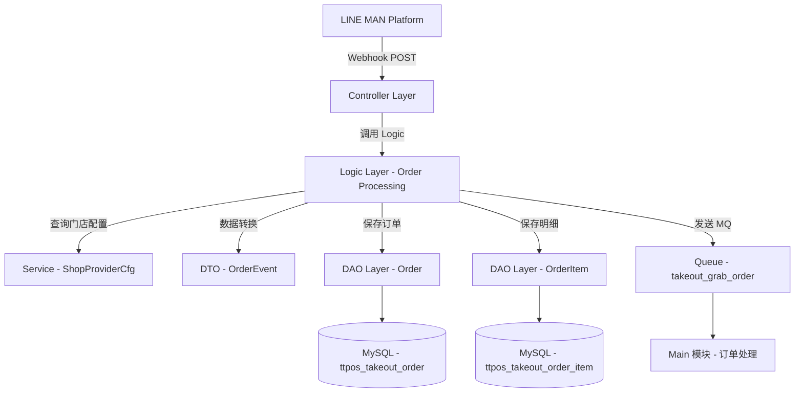

# LINE MAN PlaceOrder 订单接收功能 设计文档

> 本文档定义 LINE MAN PlaceOrder 订单接收功能的技术设计和实现方案。

## 📋 概述

实现 LINE MAN 的 PlaceOrder Webhook 接口，接收并处理 LINE MAN 平台推送的订单数据。本功能将订单数据转换为 TTPOS 统一订单模型，保存到数据库，并通过消息队列通知 Main 模块进行后续处理。

**技术栈**: Go (GoFrame 2.x) + MySQL + RabbitMQ/RocketMQ

**核心特点**:
- 复用现有的 Grab 订单处理架构
- 使用统一的订单数据模型（ttpos_takeout_order）
- 通过 provider_name 字段区分订单来源
- 复用 takeout_grab_order MQ topic

---

## 🎯 规范对齐

### Go BMP 规范 (go-bmp.mdc)

本设计严格遵循 GoFrame 微服务开发规范：

- ✅ **Controller → Logic → DAO 分层架构**
- ✅ **禁止修改 dao/entity/do/ 目录**（自动生成）
- ✅ **Logic 层专注业务逻辑**，不包含 HTTP 响应处理
- ✅ **DAO 层使用 GoFrame ORM**，参数化查询防止 SQL 注入
- ✅ **使用 g.Log() 记录日志**，遵循 GoFrame 日志规范
- ✅ **错误返回使用 gerror.Wrap**，提供上下文信息

### API 设计规范 (api.mdc)

虽然这是 Webhook 接口，但仍遵循 API 规范：

- ✅ **URL 路径**: `/partners/:partnerId/stores/:storeId/orders`（LINE MAN 规范）
- ✅ **响应格式**: LINE MAN 标准格式 `{status, code, message}`
- ✅ **成功响应**: HTTP 200
- ✅ **错误响应**: HTTP 400/404/409/500

### 数据库规范 (database.mdc)

- ✅ **复用现有表**: `ttpos_takeout_order` 和 `ttpos_takeout_order_item`
- ✅ **必需字段完整**: uuid, provider_name, provider_order_id, raw_data
- ✅ **金额字段**: decimal(20,8)
- ✅ **时间字段**: 使用 timestamp 或 int（Unix 时间戳）
- ✅ **raw_data 字段**: 存储完整的原始请求 JSON

---

## 🔄 代码复用分析

### 可复用的现有组件

1. **Grab 订单处理逻辑**
   - 文件: `ttpos-bmp/app/ttpos-takeout/internal/logic/grab/grab_order.go`
   - 复用内容: 订单保存逻辑、事务处理、MQ 发送
   - 修改点: 字段映射关系（LINE MAN → TTPOS）

2. **订单数据表**
   - 表: `ttpos_takeout_order` 和 `ttpos_takeout_order_item`
   - 复用内容: 表结构、索引、字段定义
   - 修改点: provider_name 设置为 "lineman"

3. **消息队列事件**
   - 文件: `ttpos-bmp/app/ttpos-takeout/internal/model/dto/grab/event.go`
   - 复用内容: `OrderEvent` 结构体
   - 修改点: ProviderName 字段设置为 "lineman"

4. **DAO 层**
   - 文件: `ttpos-bmp/app/ttpos-takeout/internal/dao/`
   - 复用内容: 完全复用，无需修改（自动生成）

### 集成点

1. **现有 Webhook Controller 架构**
   - Controller 层代码已生成: `internal/controller/lineman/lineman_v1_place_order.go`
   - 只需实现业务逻辑调用

2. **门店配置服务**
   - 服务: `ShopProviderCfg` 服务
   - 用途: 查询 storeId → shop_uuid 的映射关系

3. **消息队列**
   - Topic: `takeout_grab_order`（复用 Grab 的 topic）
   - 用途: 通知 Main 模块处理订单

---

## 🏗️ 架构设计

### 分层设计原则

**GoFrame 三层架构**:

```
Controller 层 (HTTP 接口)
  ↓ 依赖
Logic 层 (业务逻辑)
  ↓ 依赖
DAO 层 (数据访问)
  ↓
Database (MySQL)
```

**数据流向**:

```
LINE MAN Platform
  ↓ POST /partners/:partnerId/stores/:storeId/orders
Controller (lineman_v1_place_order.go)
  ↓ 调用 Logic 层
Logic (lineman_order.go)
  ↓ 数据转换
DTO (LINE MAN → TTPOS)
  ↓ 保存数据库（事务）
DAO (Order + OrderItem)
  ↓ 发送 MQ 事件
Queue (takeout_grab_order)
  ↓
Main 模块
```

### 架构图



### 模块划分

#### Go BMP 模块

- **HTTP Controller**: `ttpos-bmp/app/ttpos-takeout/internal/controller/lineman/lineman_v1_place_order.go`
  - 接收 LINE MAN Webhook 请求
  - 参数验证（GoFrame 自动验证）
  - 调用 Logic 层处理
  - 返回 LINE MAN 标准响应

- **Logic 层**: `ttpos-bmp/app/ttpos-takeout/internal/logic/lineman/lineman_order.go`（新建）
  - 订单数据转换（LINE MAN → TTPOS）
  - 查询门店配置（storeId → shop_uuid）
  - 事务保存订单主表和明细表
  - 发送 MQ 事件
  - 错误处理和日志记录

- **DAO 层**: `ttpos-bmp/app/ttpos-takeout/internal/dao/order.go`（复用）
  - 订单数据访问（自动生成 ❌ 禁止修改）
  - 使用 GoFrame ORM

- **Model 层**: `ttpos-bmp/app/ttpos-takeout/internal/model/`
  - `entity/order.go` - 订单实体（自动生成 ❌ 禁止修改）
  - `do/order.go` - 订单数据对象（自动生成 ❌ 禁止修改）
  - `dto/grab/event.go` - OrderEvent 事件定义（复用）

---

## 🗄️ 数据库设计

### 数据表设计

本功能**复用现有表**，无需创建新表。

#### 表 1: ttpos_takeout_order（订单主表）

**表结构**: 已存在，无需修改

**关键字段**:
- `uuid`: 订单 UUID（系统生成）
- `provider_name`: 渠道名称（设置为 **"lineman"**）
- `provider_order_id`: LINE MAN 订单 ID（`orderId`）
- `provider_merchant_id`: LINE MAN 门店 ID（`storeId`）
- `shop_uuid`: TTPOS 门店 UUID（需查询映射）
- `short_order_number`: 短订单号（`orderShortCode`）
- `total_amount`: 订单总金额（`restaurantRevenue`）
- `order_time`: 订单时间（`orderAcceptedTime`）
- `order_type`: 订单类型（DELIVERY → DeliveryByProvider, PICKUP → SelfPickup）
- `order_status`: 订单状态（固定为 "ACCEPTED"）
- `raw_data`: 原始请求 JSON（完整保存）

#### 表 2: ttpos_takeout_order_item（订单明细表）

**表结构**: 已存在，无需修改

**关键字段**:
- `order_uuid`: 订单 UUID（关联主表）
- `provider_item_id`: LINE MAN 商品 ID（`items[].id`）
- `quantity`: 商品数量（`items[].quantity`）
- `price`: 商品单价（`items[].unitPrice`）
- `modifiers`: 商品选项（`items[].properties` 序列化为 JSON）
- `note`: 商品备注（`items[].memo`）

### 字段映射关系

> **参考文档**: [Lineman API定义及TTPOS 映射](https://docs.google.com/spreadsheets/d/1CKRl7tRLtp6dCAcXQqWhPvS_0M378-vdKpucR6ZtNbg/edit?gid=182890165#gid=182890165)

#### 订单主表映射

| LINE MAN 字段 | TTPOS 字段 | 对应 Grab 字段 | 转换逻辑 |
|--------------|-----------|--------------|---------|
| orderId | provider_order_id | orderID | 直接映射 |
| orderShortCode | short_order_number | shortOrderNumber | 直接映射 |
| storeId | provider_merchant_id | partnerMerchantID | 直接映射 |
| storeId | shop_uuid | partnerMerchantID | 查询 ShopProviderCfg 服务 |
| restaurantRevenue | total_amount | price.eaterPayment | 直接映射（用户实付金额） |
| orderAcceptedTime | order_time | orderTime | ISO 8601 → Unix 时间戳 |
| customerType | order_type | - | DELIVERY → DeliveryByProvider<br/>PICKUP → SelfPickup |
| memberId | - | - | 序列化到 raw_data |
| additionalItems | note | - | 序列化为 JSON 字符串 |
| - | provider_name | - | 固定值 "lineman" |
| - | order_status | - | 固定值 "ACCEPTED" |
| 完整请求 | raw_data | - | JSON 序列化 |

#### 订单明细映射

| LINE MAN 字段 | TTPOS 字段 | 对应 Grab 字段 | 转换逻辑 |
|--------------|-----------|--------------|---------|
| items[].id | provider_item_id | items[].id | 直接映射 |
| items[].quantity | quantity | items[].quantity | 直接映射 |
| items[].unitPrice | price | items[].price | 直接映射（已含选项费用和折扣） |
| items[].memo | note | - | 直接映射 |
| items[].properties | modifiers | items[].modifiers | 序列化为 JSON |
| items[].promotionId | - | - | 可选字段，记录到 raw_data |
| items[].discount | - | - | 可选字段，记录到 raw_data |

---

## 📊 数据模型

### DTO 定义

#### LINE MAN PlaceOrder Request

**定义文件**: `ttpos-bmp/app/ttpos-takeout/api/lineman/v1/order.go`（已存在）

**核心结构**:

```go
type PlaceOrderReq struct {
    g.Meta            `path:"/partners/:partnerId/stores/:storeId/orders" method:"post"`
    PartnerId         string                `json:"partnerId"`
    StoreId           string                `json:"storeId"`
    OrderId           string                `json:"orderId"`
    OrderShortCode    string                `json:"orderShortCode"`
    RestaurantRevenue float64               `json:"restaurantRevenue"`
    OrderAcceptedTime string                `json:"orderAcceptedTime"`
    Items             []OrderItem           `json:"items"`
    AdditionalItems   []OrderAdditionalItem `json:"additionalItems"`
    MemberId          string                `json:"memberId"`
    CustomerType      string                `json:"customerType"` // DELIVERY/PICKUP
}

type OrderItem struct {
    Id          string              `json:"id"`
    Quantity    int                 `json:"quantity"`
    UnitPrice   float64             `json:"unitPrice"`
    Memo        string              `json:"memo"`
    PromotionId string              `json:"promotionId"`
    Discount    float64             `json:"discount"`
    Properties  []OrderItemProperty `json:"properties"`
}

type OrderItemProperty struct {
    Id     string                   `json:"id"`
    Values []OrderItemPropertyValue `json:"values"`
}

type OrderItemPropertyValue struct {
    Id    string  `json:"id"`
    Price float64 `json:"price"`
}
```

#### LINE MAN PlaceOrder Response

```go
type PlaceOrderRes struct {
    g.Meta `mime:"application/json"`
    LinemanCommonResData
}

type LinemanCommonResData struct {
    Status  string `json:"status"`  // "ok" / "fail"
    Code    string `json:"code"`
    Message string `json:"message"`
}
```

#### Order Event（复用）

**定义文件**: `ttpos-bmp/app/ttpos-takeout/internal/model/dto/grab/event.go`

```go
type OrderEvent struct {
    Action       string `json:"action,omitempty"`     // "create"
    ProviderName string `json:"providerName"`         // "lineman"
    ShopUUID     string `json:"shopUuid"`
    OrderUUID    string `json:"orderUuid"`
    OrderID      string `json:"orderId,omitempty"`
    MerchantID   string `json:"merchantId,omitempty"`
    Status       string `json:"status,omitempty"`     // "ACCEPTED"
    Timestamp    int64  `json:"timestamp,omitempty"`
    Message      string `json:"message,omitempty"`
}
```

---

## 🔌 API 设计

### Webhook API

#### API: PlaceOrder (订单创建)

**请求**:

- **URL**: `POST /partners/:partnerId/stores/:storeId/orders`
- **Headers**:
  ```json
  {
    "Content-Type": "application/json",
    "Authorization": "Bearer {access_token}"
  }
  ```
- **Body**: 参见上文 `PlaceOrderReq` 结构

**成功响应** (HTTP 200):

```json
{
  "status": "ok",
  "code": "200",
  "message": "Order received successfully"
}
```

**错误响应** (HTTP 400):

```json
{
  "status": "fail",
  "code": "400",
  "message": "参数验证失败: orderId is required"
}
```

**错误响应** (HTTP 404):

```json
{
  "status": "fail",
  "code": "404",
  "message": "Invalid partner ID and/or store ID"
}
```

**错误响应** (HTTP 409):

```json
{
  "status": "fail",
  "code": "409",
  "message": "An order with the same Order ID has already been successfully submitted to the store"
}
```

**错误响应** (HTTP 500):

```json
{
  "status": "fail",
  "code": "500",
  "message": "Internal server error"
}
```

---

## 🧩 组件和接口

### Logic 层

#### Logic 接口（新建）

**文件**: `ttpos-bmp/app/ttpos-takeout/internal/logic/lineman/lineman_order.go`

**核心方法**:

```go
package lineman

import (
    "context"
    "github.com/gogf/gf/v2/database/gdb"
    "github.com/gogf/gf/v2/encoding/gjson"
    "github.com/gogf/gf/v2/errors/gerror"
    "github.com/gogf/gf/v2/frame/g"
    "github.com/gogf/gf/v2/os/gtime"
    "github.com/gogf/gf/v2/util/guid"
    
    v1 "ttpos-bmp/app/ttpos-takeout/api/lineman/v1"
    "ttpos-bmp/app/ttpos-takeout/internal/consts"
    "ttpos-bmp/app/ttpos-takeout/internal/dao"
    "ttpos-bmp/app/ttpos-takeout/internal/model/do"
    "ttpos-bmp/app/ttpos-takeout/internal/model/dto/grab"
    "ttpos-bmp/app/ttpos-takeout/internal/service"
    "ttpos-bmp/internal/pkg/queue"
)

const (
    TopicLinemanOrder = "takeout_grab_order" // 复用 Grab 的 topic
    ProviderNameLineman = "lineman"
)

type sLinemanOrder struct{}

// HandlePlaceOrder 处理 LINE MAN 订单创建 Webhook
func (s *sLinemanOrder) HandlePlaceOrder(ctx context.Context, req *v1.PlaceOrderReq) error {
    // 1. 保存订单
    orderUUID, err := s.saveOrder(ctx, req)
    if err != nil {
        g.Log().Errorf(ctx, "保存订单失败: %v", err)
        return gerror.Wrap(err, "保存订单失败")
    }
    
    // 2. 发送 MQ 消息
    event := &grab.OrderEvent{
        Action:       "create",
        ProviderName: ProviderNameLineman,
        ShopUUID:     req.StoreId, // 或查询到的 shop_uuid
        OrderUUID:    orderUUID,
        OrderID:      req.OrderId,
        MerchantID:   req.StoreId,
        Status:       "ACCEPTED",
        Timestamp:    gtime.Now().Unix(),
    }
    if err := queue.PushWithContext(ctx, TopicLinemanOrder, event); err != nil {
        // MQ 发送失败只记录日志，不影响主流程
        g.Log().Warningf(ctx, "发送订单 MQ 事件失败 %s: %v", orderUUID, err)
    }
    
    g.Log().Infof(ctx, "成功处理 LINE MAN 订单: %s (UUID: %s)", req.OrderId, orderUUID)
    return nil
}

// saveOrder 保存订单到数据库
func (s *sLinemanOrder) saveOrder(ctx context.Context, req *v1.PlaceOrderReq) (string, error) {
    orderUUID := guid.S()
    
    // 查询 shop_uuid（通过 storeId 查询门店配置）
    shopUuid := req.StoreId // 默认使用 storeId
    cfg, err := service.ShopProviderCfg().GetShopProviderCfgByMerchantID(ctx, req.StoreId, ProviderNameLineman)
    if err != nil {
        g.Log().Warningf(ctx, "查询门店配置失败: storeId=%s, error=%v", req.StoreId, err)
    } else if cfg != nil {
        shopUuid = strconv.FormatUint(cfg.ShopUuid, 10)
    }
    
    // 转换订单类型
    orderType := "DeliveryByProvider" // 默认外送
    if req.CustomerType == "PICKUP" {
        orderType = "SelfPickup"
    }
    
    // 解析订单时间
    orderTime, _ := gtime.StrToTime(req.OrderAcceptedTime)
    
    // 序列化原始数据
    rawData, _ := gjson.EncodeString(req)
    
    // 序列化 additionalItems
    additionalItemsJSON, _ := gjson.EncodeString(req.AdditionalItems)
    
    // 开启事务
    err = dao.Order.Transaction(ctx, func(ctx context.Context, tx gdb.TX) error {
        // 1. 插入订单主表
        orderDo := &do.Order{
            Uuid:               orderUUID,
            ShopUuid:           shopUuid,
            ProviderName:       ProviderNameLineman,
            ProviderOrderId:    req.OrderId,
            ProviderMerchantId: req.StoreId,
            ShortOrderNumber:   req.OrderShortCode,
            OrderType:          orderType,
            OrderTime:          orderTime,
            OrderStatus:        "ACCEPTED",
            TotalAmount:        req.RestaurantRevenue,
            Note:               additionalItemsJSON, // 附加项序列化
            RawData:            rawData,
        }
        
        _, err := dao.Order.Ctx(ctx).Data(orderDo).Insert()
        if err != nil {
            return gerror.Wrap(err, "插入订单失败")
        }
        
        // 2. 插入订单明细
        for _, item := range req.Items {
            // 序列化 properties
            propertiesJSON, _ := gjson.EncodeString(item.Properties)
            
            itemDo := &do.OrderItem{
                OrderUuid:      orderUUID,
                ProviderItemId: item.Id,
                Quantity:       item.Quantity,
                Price:          item.UnitPrice,
                TotalPrice:     item.UnitPrice * float64(item.Quantity),
                Modifiers:      propertiesJSON, // properties 序列化为 modifiers
                Note:           item.Memo,
            }
            
            _, err := dao.OrderItem.Ctx(ctx).Data(itemDo).Insert()
            if err != nil {
                return gerror.Wrap(err, "插入订单明细失败")
            }
        }
        
        return nil
    })
    
    if err != nil {
        return "", err
    }
    
    return orderUUID, nil
}
```

### Controller 层

**文件**: `ttpos-bmp/app/ttpos-takeout/internal/controller/lineman/lineman_v1_place_order.go`（已存在）

**实现**:

```go
package lineman

import (
    "context"
    
    "github.com/gogf/gf/v2/errors/gcode"
    "github.com/gogf/gf/v2/errors/gerror"
    
    "ttpos-bmp/app/ttpos-takeout/api/lineman/v1"
    "ttpos-bmp/app/ttpos-takeout/internal/service"
)

func (c *ControllerV1) PlaceOrder(ctx context.Context, req *v1.PlaceOrderReq) (res *v1.PlaceOrderRes, err error) {
    // 调用 Logic 层处理订单
    err = service.LinemanOrder().HandlePlaceOrder(ctx, req)
    if err != nil {
        return &v1.PlaceOrderRes{
            LinemanCommonResData: v1.LinemanCommonResData{
                Status:  "fail",
                Code:    "500",
                Message: err.Error(),
            },
        }, nil // 返回 nil error，让 GoFrame 返回 HTTP 200
    }
    
    // 返回成功响应
    return &v1.PlaceOrderRes{
        LinemanCommonResData: v1.LinemanCommonResData{
            Status:  "ok",
            Code:    "200",
            Message: "Order received successfully",
        },
    }, nil
}
```

### Service 注册

**文件**: `ttpos-bmp/app/ttpos-takeout/internal/service/lineman_order.go`（新建）

```go
package service

import (
    "context"
    v1 "ttpos-bmp/app/ttpos-takeout/api/lineman/v1"
)

type ILinemanOrder interface {
    HandlePlaceOrder(ctx context.Context, req *v1.PlaceOrderReq) error
}

var localLinemanOrder ILinemanOrder

func LinemanOrder() ILinemanOrder {
    if localLinemanOrder == nil {
        panic("implement not found for interface ILinemanOrder, forgot register?")
    }
    return localLinemanOrder
}

func RegisterLinemanOrder(i ILinemanOrder) {
    localLinemanOrder = i
}
```

---

## 🚨 错误处理

### 错误场景

#### 场景 1: 参数验证失败

- **触发条件**: orderId、items 等必填字段缺失或格式错误
- **处理方式**: GoFrame 自动验证，返回 HTTP 400
- **用户影响**: LINE MAN 收到参数错误响应
- **代码示例**:
  ```go
  // GoFrame 自动验证，无需手动处理
  // 如果验证失败，自动返回 HTTP 400
  ```

#### 场景 2: 门店配置不存在

- **触发条件**: storeId 在系统中未配置
- **处理方式**: 记录警告日志，使用 storeId 作为 shop_uuid
- **用户影响**: 订单正常保存，但可能需要后续手动关联门店
- **代码示例**:
  ```go
  cfg, err := service.ShopProviderCfg().GetShopProviderCfgByMerchantID(ctx, req.StoreId, ProviderNameLineman)
  if err != nil {
      g.Log().Warningf(ctx, "查询门店配置失败: storeId=%s, error=%v", req.StoreId, err)
      // 使用 storeId 作为 fallback
      shopUuid = req.StoreId
  }
  ```

#### 场景 3: 数据库保存失败

- **触发条件**: 数据库连接异常、唯一索引冲突等
- **处理方式**: 事务回滚，返回 HTTP 500
- **用户影响**: LINE MAN 收到服务器错误响应，会重试
- **代码示例**:
  ```go
  err = dao.Order.Transaction(ctx, func(ctx context.Context, tx gdb.TX) error {
      // ... 数据库操作
      if err != nil {
          return gerror.Wrap(err, "插入订单失败") // 触发事务回滚
      }
      return nil
  })
  if err != nil {
      g.Log().Errorf(ctx, "数据库保存失败: %v", err)
      return "", err
  }
  ```

#### 场景 4: 订单 ID 已存在（HTTP 409）

- **触发条件**: 相同 orderId 的订单已存在（重复推送）
- **处理方式**: 检查 provider_order_id 唯一性，返回 HTTP 409
- **用户影响**: LINE MAN 知道订单已处理，不会重复创建
- **代码示例**:
  ```go
  // 在插入前检查订单是否存在
  existingOrder, _ := dao.Order.Ctx(ctx).
      Where(dao.Order.Columns().ProviderName, ProviderNameLineman).
      Where(dao.Order.Columns().ProviderOrderId, req.OrderId).
      One()
  if !existingOrder.IsEmpty() {
      return "", gerror.NewCode(gcode.CodeNotSupported, "Order ID already exists")
  }
  ```

#### 场景 5: MQ 发送失败

- **触发条件**: RabbitMQ/RocketMQ 连接异常
- **处理方式**: 记录警告日志，不影响订单保存
- **用户影响**: 订单已入库，Main 模块暂时不知道，需要人工介入或重试机制
- **代码示例**:
  ```go
  if err := queue.PushWithContext(ctx, TopicLinemanOrder, event); err != nil {
      // MQ 发送失败只记录日志，不影响主流程（订单已入库）
      g.Log().Warningf(ctx, "发送订单 MQ 事件失败 %s: %v", orderUUID, err)
  }
  ```

---

## 🔒 安全设计

### 身份验证

- **OAuth Token 验证**: 需要实现 LINE MAN OAuth Token 中间件（参考 v2.13.1 实现）
- **Header 验证**: 检查 `Authorization: Bearer {access_token}`
- **Token 有效性**: 验证 Token 未过期

### 权限控制

- **partnerId 和 storeId 验证**: 确保 Token 对应的商户有权限访问指定门店
- **订单来源验证**: 只接受 LINE MAN 平台的订单推送

### 数据安全

- **SQL 注入防护**: 使用 GoFrame ORM 参数化查询
- **原始数据保存**: raw_data 字段完整保存，用于问题排查
- **敏感数据**: memberId、additionalItems 等不包含敏感信息，无需脱敏

---

## 🧪 测试策略

### 单元测试

**文件**: `ttpos-bmp/app/ttpos-takeout/internal/logic/lineman/lineman_order_test.go`

**测试内容**:

1. **订单数据转换测试**
   - 测试 LINE MAN → TTPOS 字段映射
   - 测试 properties → modifiers JSON 序列化
   - 测试 customerType → orderType 转换
   - 测试时间格式转换（ISO 8601 → Unix）

2. **订单保存测试**
   - 测试订单主表保存
   - 测试订单明细保存
   - 测试事务回滚
   - 测试订单 ID 去重（HTTP 409）

3. **错误处理测试**
   - 测试参数验证失败
   - 测试数据库保存失败
   - 测试 MQ 发送失败（不影响主流程）

### API 测试

**工具**: Postman / curl

**测试内容**:

1. **正常场景**
   - 发送完整的 PlaceOrder 请求
   - 验证 HTTP 200 响应
   - 验证订单入库
   - 验证 MQ 事件发送

2. **异常场景**
   - 测试参数缺失（HTTP 400）
   - 测试订单 ID 重复（HTTP 409）
   - 测试门店 ID 不存在（HTTP 404）
   - 测试服务器错误（HTTP 500）

### 集成测试

**测试流程**:

1. LINE MAN 平台 → BMP Webhook → 订单入库 → MQ 发送 → Main 模块接收

**测试内容**:

- 端到端订单创建流程
- 订单数据完整性验证
- MQ 事件消费验证
- 订单状态同步验证

---

## 📈 性能优化

### 优化策略

1. **数据库优化**:
   - 使用现有索引（provider_name + provider_order_id）
   - 事务执行时间 < 200ms
   - 避免 N+1 查询

2. **并发控制**:
   - LINE MAN 可能并发推送订单
   - 使用数据库唯一索引防止重复（provider_name + provider_order_id）
   - 无需额外的分布式锁

3. **接口优化**:
   - Webhook 响应时间 < 500ms
   - MQ 发送异步处理（不阻塞主流程）

### 性能指标

- Webhook 响应时间: < 500ms
- 数据库事务: < 200ms
- MQ 发送: < 100ms（异步，失败不影响）
- 并发能力: 支持 100+ QPS

---

## 📚 实现清单

### Phase 1: Logic 层实现

- [ ] 创建 `lineman_order.go` 文件
- [ ] 实现 `HandlePlaceOrder` 方法
- [ ] 实现 `saveOrder` 方法（数据转换 + 事务保存）
- [ ] 实现订单 ID 去重逻辑（HTTP 409）

### Phase 2: Controller 和 Service 实现

- [ ] 完成 Controller 业务逻辑调用
- [ ] 注册 LinemanOrder Service 接口
- [ ] 实现 LINE MAN 标准响应格式

### Phase 3: 测试

- [ ] 单元测试（数据转换、订单保存）
- [ ] API 测试（Postman / curl）
- [ ] 集成测试（Webhook + MQ + Main 模块）

### Phase 4: 文档和部署

- [ ] 更新 API 文档
- [ ] 更新 CHANGELOG.md
- [ ] 部署到测试环境
- [ ] 与 LINE MAN 平台联调

**详细任务**: 参见 `tasks.md`

---

## Graphiti & 活动日志

- Related Episode: `[待补充]`
- 模板：`docs/agent/templates/graphiti-episode.md`
- 活动日志：`docs/team/activities/rikugun/2026-01/2026-01-12.md`
- 在技术方案评审、关键架构决策或踩坑总结后，立即补充 Episode 并在设计文档尾部互链。

---

**版本**: v1.0.0  
**创建日期**: 2026-01-12  
**作者**: rikugun  
**审核者**: 待审核
