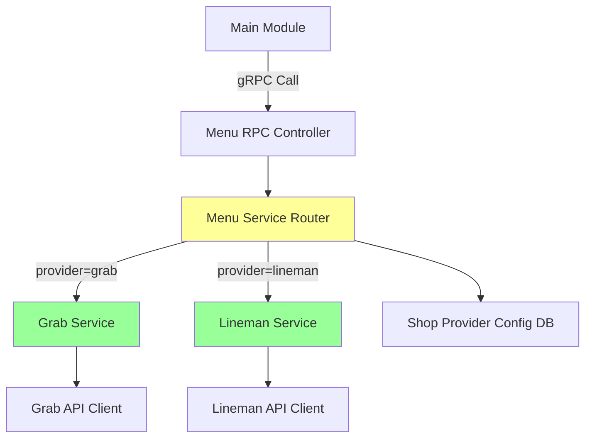
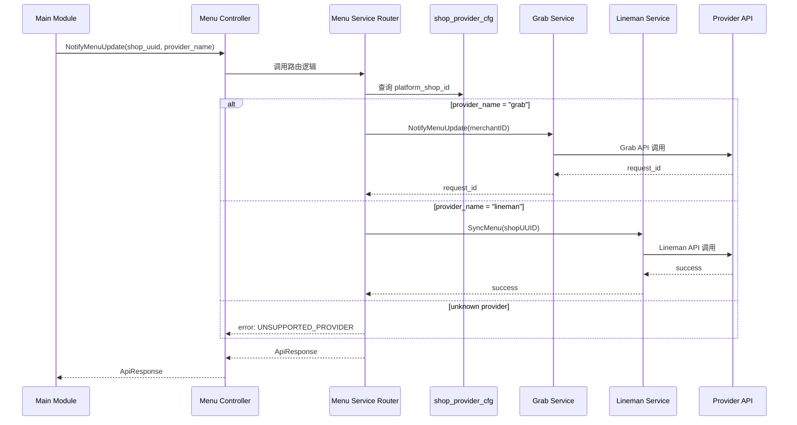

# 外卖菜单更新通知服务 设计文档

> 本文档定义外卖菜单更新通知服务的技术设计和实现方案。

## 📋 概述

本功能为外卖业务提供统一的菜单更新通知接口，支持多平台（Grab、Lineman）菜单同步。通过在 `menu.proto` 中新增 `NotifyMenuUpdate` RPC 方法，实现一个统一的路由层，根据 `provider_name` 自动分发到对应平台的服务实现。

**核心价值**：
- 降低系统耦合度：调用方无需知道各平台的具体实现细节
- 提升扩展性：新增平台只需添加新的 case 分支
- 统一接口规范：所有平台使用相同的调用方式

---

## 🎯 规范对齐

### Go BMP 规范 (go-bmp.mdc)

本功能涉及 GoFrame 微服务开发，严格遵循以下规范：

- ✅ 使用 GoFrame 2.x 框架
- ✅ Protobuf 定义在 `manifest/protobuf/` 目录
- ✅ RPC Controller 在 `internal/controller/rpc/` 目录
- ✅ Service 层在 `internal/service/` 目录
- ✅ gRPC 服务注册到 Nacos
- ❌ 禁止修改 `dao/entity/do/` 目录（自动生成）

### Protobuf 规范 (proto-rules.mdc)

- ✅ 使用 `proto3` 语法
- ✅ package 命名：`menu`
- ✅ go_package：`ttpos-bmp/app/ttpos-takeout/api/menu`
- ✅ 字段命名：snake_case
- ✅ 响应统一使用 `takeout.ApiResponse`
- ✅ 添加详细的注释说明

### API 设计规范 (api.mdc)

- ✅ Protobuf 字段使用 snake_case
- ✅ 响应格式统一使用 `takeout.ApiResponse`
- ✅ 错误码遵循标准定义（400: 参数错误，500: 服务错误）
- ✅ 支持请求追踪（request_id）

---

## 🔄 代码复用分析

### 可复用的现有组件

- **Grab Service**: `ttpos-bmp/app/ttpos-takeout/internal/service/grab.go`
  - 接口方法：`NotifyMenuUpdate(ctx context.Context, merchantID string) (string, error)`
  - 功能：通知 Grab 平台菜单更新，返回 request_id
  
- **Lineman Service**: `ttpos-bmp/app/ttpos-takeout/internal/service/lineman.go`
  - 接口方法：`SyncMenu(ctx context.Context, shopUUID uint64) error`
  - 功能：同步菜单到 Lineman 平台

- **ApiResponse**: `ttpos-bmp/app/ttpos-takeout/api/takeout_api.proto`
  - 统一响应格式，包含 code、message、data

- **现有 MenuService**: `ttpos-bmp/app/ttpos-takeout/manifest/protobuf/menu/menu.proto`
  - 已有菜单相关的 RPC 方法（GetMenuSnapshot, SaveMenuSnapshot, UpdateMenuItem 等）

### 集成点

- **Menu Service 扩展**: 在已有的 `MenuService` 中新增 `NotifyMenuUpdate` 方法
- **Service 层集成**: 新建 Menu Service 调用已有的 Grab 和 Lineman Service
- **路由逻辑**: 根据 provider_name 路由到对应的服务实现

### 接口签名适配

**关键差异**：
- Grab Service: `NotifyMenuUpdate(ctx, merchantID string)` - 使用 merchantID (string)
- Lineman Service: `SyncMenu(ctx, shopUUID uint64)` - 使用 shopUUID (uint64)

**适配方案**：
1. 统一接口参数使用 `shop_uuid` (string，便于扩展)
2. 路由层根据 provider 查询 shop_provider_cfg 表获取对应的 platform_shop_id
3. Grab: 使用 platform_shop_id (merchantID)
4. Lineman: 将 shop_uuid string 转换为 uint64

---

## 🏗️ 架构设计

### 分层设计原则

**Go BMP 四层架构**:

```
RPC Controller 层
  ↓ 调用
Service 层 (Menu Service)
  ↓ 路由
Service 层 (Grab/Lineman Service)
  ↓ 调用
Logic 层 (业务逻辑)
```

**依赖规则**:

- ✅ Controller 调用 Service
- ✅ Service 可以调用其他 Service
- ✅ Service 协调 Logic 层
- ❌ Controller 不直接调用 Logic

### 架构图



### 时序图



### 模块划分

#### Go BMP 模块

- **Protobuf 定义**: `ttpos-bmp/app/ttpos-takeout/manifest/protobuf/menu/menu.proto`
  - 新增 `NotifyMenuUpdateReq` 消息
  - 新增 `NotifyMenuUpdate` RPC 方法
  
- **RPC Controller**: `ttpos-bmp/app/ttpos-takeout/internal/controller/rpc/menu/menu_v1_notify_menu_update.go`
  - 处理 gRPC 请求
  - 参数校验
  - 调用 Service 层
  
- **Service 层**: `ttpos-bmp/app/ttpos-takeout/internal/service/menu.go`
  - 新增 Menu Service 实现
  - 路由逻辑（根据 provider_name 分发）
  - 查询 shop_provider_cfg 表
  - 错误处理和响应包装

---

## 🗄️ 数据库设计

### 依赖现有表

本功能不需要新建数据库表，复用已有的 `ttpos_shop_provider_cfg` 表。

#### 表结构参考

```sql
CREATE TABLE IF NOT EXISTS `ttpos_shop_provider_cfg` (
    `id` bigint unsigned NOT NULL AUTO_INCREMENT COMMENT '主键ID',
    `uuid` bigint unsigned NOT NULL DEFAULT 0 COMMENT '唯一标识',
    `shop_uuid` bigint unsigned NOT NULL DEFAULT 0 COMMENT '店铺UUID',
    `provider_name` varchar(50) NOT NULL DEFAULT '' COMMENT '平台名称: grab, lineman',
    `platform_shop_id` varchar(255) NOT NULL DEFAULT '' COMMENT '平台侧店铺ID',
    `config_json` text COMMENT '配置JSON',
    `status` tinyint NOT NULL DEFAULT 1 COMMENT '状态: 1激活, 0停用',
    `create_time` int NOT NULL DEFAULT 0 COMMENT '创建时间',
    `update_time` int NOT NULL DEFAULT 0 COMMENT '更新时间',
    `delete_time` int NOT NULL DEFAULT 0 COMMENT '删除时间',
    PRIMARY KEY (`id`),
    UNIQUE KEY `uk_uuid` (`uuid`),
    KEY `idx_shop_provider` (`shop_uuid`, `provider_name`)
) ENGINE=InnoDB DEFAULT CHARSET=utf8mb4 COMMENT='店铺第三方平台配置表';
```

**使用说明**：
- 通过 `shop_uuid` + `provider_name` 查询对应平台配置
- 获取 `platform_shop_id` 用于调用平台 API
- 检查 `status` 确保平台已激活

---

## 📊 数据模型

### Protobuf 定义

#### NotifyMenuUpdateReq

```protobuf
// 通知菜单更新请求
message NotifyMenuUpdateReq {
  string shop_uuid = 1;      // 店铺 UUID (必填)
  string provider_name = 2;  // 平台名称: grab, lineman (必填)
  string request_id = 3;     // 请求 ID (可选，用于追踪)
}
```

**字段说明**：
| 字段 | 类型 | 必填 | 说明 |
|------|------|------|------|
| shop_uuid | string | 是 | 店铺唯一标识 |
| provider_name | string | 是 | 平台名称（grab/lineman） |
| request_id | string | 否 | 请求追踪ID，用于日志关联 |

#### 响应格式

使用标准的 `takeout.ApiResponse`：

```protobuf
message ApiResponse {
  int32 code = 1;        // 响应码: 0=成功, 非0=失败
  string message = 2;    // 响应消息
  google.protobuf.Any data = 3;  // 响应数据
}
```

**成功响应示例**：
```json
{
  "code": 0,
  "message": "Menu update notified successfully",
  "data": {
    "sync_status": "QUEUED",
    "request_id": "req-1234567890"
  }
}
```

**错误响应示例**：
```json
{
  "code": 400,
  "message": "Unsupported provider: unknown",
  "data": {}
}
```

---

## 🔌 API 设计

### gRPC API

#### Protobuf 定义

```protobuf
// ttpos-bmp/app/ttpos-takeout/manifest/protobuf/menu/menu.proto
syntax = "proto3";
package menu;
import "takeout_api.proto";
option go_package = "ttpos-bmp/app/ttpos-takeout/api/menu";

// 通知菜单更新请求
message NotifyMenuUpdateReq {
  string shop_uuid = 1;      // 店铺 UUID (必填)
  string provider_name = 2;  // 平台名称: grab, lineman (必填)
  string request_id = 3;     // 请求 ID (可选，用于追踪)
}

// 外卖菜单服务
service MenuService {
    // ... 已有方法 ...
    
    // 通知菜单更新（统一入口）
    // 根据 provider_name 路由到对应平台的菜单同步服务
    rpc NotifyMenuUpdate (NotifyMenuUpdateReq) returns (takeout.ApiResponse) {}
}
```

#### 调用示例

**Go 客户端调用**：

```go
// Main 模块调用示例
import (
    "context"
    "ttpos-bmp/app/ttpos-takeout/api/menu"
)

// 通知 Grab 平台菜单更新
req := &menu.NotifyMenuUpdateReq{
    ShopUuid:     "123456",
    ProviderName: "grab",
    RequestId:    "req-" + uuid.New().String(),
}

resp, err := menuClient.NotifyMenuUpdate(context.Background(), req)
if err != nil {
    // 处理错误
    log.Errorf("Failed to notify menu update: %v", err)
    return err
}

if resp.Code != 0 {
    // 业务错误
    log.Errorf("Menu update failed: %s", resp.Message)
    return errors.New(resp.Message)
}

// 成功
log.Infof("Menu update notified successfully: %+v", resp.Data)
```

---

## 🧩 组件和接口

### Service 层

#### Menu Service 新增方法

```go
// ttpos-bmp/app/ttpos-takeout/internal/service/menu.go
package service

import (
    "context"
    "ttpos-bmp/app/ttpos-takeout/api/menu"
    "ttpos-bmp/app/ttpos-takeout/api/takeout"
)

type IMenu interface {
    // NotifyMenuUpdate 通知菜单更新（统一路由入口）
    // 根据 provider_name 路由到对应平台的服务
    NotifyMenuUpdate(ctx context.Context, req *menu.NotifyMenuUpdateReq) (*takeout.ApiResponse, error)
}
```

#### Menu Service 实现

```go
// ttpos-bmp/app/ttpos-takeout/internal/service/menu.go
package service

import (
    "context"
    "fmt"
    "strconv"
    
    "github.com/gogf/gf/v2/errors/gerror"
    "github.com/gogf/gf/v2/frame/g"
    
    "ttpos-bmp/app/ttpos-takeout/api/menu"
    "ttpos-bmp/app/ttpos-takeout/api/takeout"
    "ttpos-bmp/app/ttpos-takeout/internal/logic/shop_provider_cfg"
)

type sMenu struct{}

func NewMenu() IMenu {
    return &sMenu{}
}

func (s *sMenu) NotifyMenuUpdate(ctx context.Context, req *menu.NotifyMenuUpdateReq) (*takeout.ApiResponse, error) {
    // 1. 参数校验
    if req.ShopUuid == "" {
        return common.RespError(gerror.New("shop_uuid is required")), nil
    }
    if req.ProviderName == "" {
        return common.RespError(gerror.New("provider_name is required")), nil
    }

    // 2. 查询店铺平台配置
    shopUUID, err := strconv.ParseUint(req.ShopUuid, 10, 64)
    if err != nil {
        return common.RespError(gerror.Wrap(err, "invalid shop_uuid format")), nil
    }

    cfg, err := shop_provider_cfg.GetShopProviderCfg(ctx, shopUUID, req.ProviderName)
    if err != nil {
        return common.RespError(gerror.Wrapf(err, "failed to get shop provider config for shop=%s provider=%s", req.ShopUuid, req.ProviderName)), nil
    }

    if cfg.Status != 1 {
        return common.RespError(gerror.Newf("provider %s is not active for shop %s", req.ProviderName, req.ShopUuid)), nil
    }

    // 3. 记录日志
    g.Log().Infof(ctx, "[MenuService] NotifyMenuUpdate: shop_uuid=%s, provider=%s, request_id=%s, platform_shop_id=%s",
        req.ShopUuid, req.ProviderName, req.RequestId, cfg.PlatformShopId)

    // 4. 根据 provider_name 路由到对应服务
    switch req.ProviderName {
    case "grab":
        return s.notifyGrabMenuUpdate(ctx, cfg.PlatformShopId, req.RequestId)
    
    case "lineman":
        return s.notifyLinemanMenuUpdate(ctx, shopUUID, req.RequestId)
    
    default:
        errMsg := fmt.Sprintf("Unsupported provider: %s, supported: grab, lineman", req.ProviderName)
        g.Log().Warningf(ctx, "[MenuService] %s", errMsg)
        return common.RespError(gerror.New(errMsg)), nil
    }
}

// notifyGrabMenuUpdate 通知 Grab 菜单更新
func (s *sMenu) notifyGrabMenuUpdate(ctx context.Context, merchantID string, requestID string) (*takeout.ApiResponse, error) {
    // 调用 Grab Service
    grabRequestID, err := Grab().NotifyMenuUpdate(ctx, merchantID)
    if err != nil {
        return common.RespError(gerror.Wrap(err, "failed to notify Grab menu update")), nil
    }

    // 返回成功响应
    return common.RespSuccess(g.Map{
        "sync_status": "QUEUED",
        "request_id":  grabRequestID,
        "provider":    "grab",
    }), nil
}

// notifyLinemanMenuUpdate 通知 Lineman 菜单更新
func (s *sMenu) notifyLinemanMenuUpdate(ctx context.Context, shopUUID uint64, requestID string) (*takeout.ApiResponse, error) {
    // 调用 Lineman Service
    err := Lineman().SyncMenu(ctx, shopUUID)
    if err != nil {
        return common.RespError(gerror.Wrap(err, "failed to notify Lineman menu update")), nil
    }

    // 返回成功响应
    return common.RespSuccess(g.Map{
        "sync_status": "SUCCESS",
        "request_id":  requestID,
        "provider":    "lineman",
    }), nil
}
```

### RPC Controller 层

```go
// ttpos-bmp/app/ttpos-takeout/internal/controller/rpc/menu/menu_v1_notify_menu_update.go
package menu

import (
    "context"
    
    "ttpos-bmp/app/ttpos-takeout/api/menu"
    "ttpos-bmp/app/ttpos-takeout/api/takeout"
    "ttpos-bmp/app/ttpos-takeout/internal/service"
)

// MenuController Menu RPC 控制器
type MenuController struct {
    menu.UnimplementedMenuServiceServer
}

// NewMenuController 创建 Menu 控制器
func NewMenuController() *MenuController {
    return &MenuController{}
}

// NotifyMenuUpdate 通知菜单更新（统一入口）
func (c *MenuController) NotifyMenuUpdate(ctx context.Context, req *menu.NotifyMenuUpdateReq) (*takeout.ApiResponse, error) {
    return service.Menu().NotifyMenuUpdate(ctx, req)
}
```

### 服务注册

```go
// ttpos-bmp/app/ttpos-takeout/internal/boot/rpc.go
package boot

import (
    "ttpos-bmp/app/ttpos-takeout/api/menu"
    menuController "ttpos-bmp/app/ttpos-takeout/internal/controller/rpc/menu"
    // ... 其他导入
)

func InitRPC(s *grpc.Server) {
    // ... 其他服务注册
    
    // 注册 Menu Service
    menu.RegisterMenuServiceServer(s, menuController.NewMenuController())
}
```

---

## 🚨 错误处理

### 错误场景

#### 场景 1: 参数校验失败

- **处理方式**: 返回 400 错误，提示缺少必填参数
- **用户影响**: 调用方收到明确的参数错误提示
- **代码示例**:
  ```go
  if req.ShopUuid == "" {
      return common.RespError(gerror.New("shop_uuid is required")), nil
  }
  ```

#### 场景 2: 未知平台

- **处理方式**: 返回 400 错误，列出支持的平台列表
- **用户影响**: 调用方知道传入了不支持的平台
- **代码示例**:
  ```go
  default:
      errMsg := fmt.Sprintf("Unsupported provider: %s, supported: grab, lineman", req.ProviderName)
      return common.RespError(gerror.New(errMsg)), nil
  ```

#### 场景 3: 店铺平台未激活

- **处理方式**: 返回 400 错误，提示平台未激活
- **用户影响**: 调用方知道需要先激活该平台
- **代码示例**:
  ```go
  if cfg.Status != 1 {
      return common.RespError(gerror.Newf("provider %s is not active for shop %s", req.ProviderName, req.ShopUuid)), nil
  }
  ```

#### 场景 4: 平台服务调用失败

- **处理方式**: 返回 500 错误，包含具体的错误信息
- **用户影响**: 调用方知道平台侧发生了错误
- **代码示例**:
  ```go
  grabRequestID, err := Grab().NotifyMenuUpdate(ctx, merchantID)
  if err != nil {
      return common.RespError(gerror.Wrap(err, "failed to notify Grab menu update")), nil
  }
  ```

---

## 🔒 安全设计

### 身份验证

- **gRPC 认证**: 通过 Nacos 注册中心进行服务发现和认证
- **内部调用**: Main 模块通过服务发现调用 BMP 服务

### 参数校验

- **必填参数**: shop_uuid 和 provider_name 必须非空
- **格式校验**: shop_uuid 必须是有效的数字字符串
- **白名单校验**: provider_name 只允许 "grab" 或 "lineman"

### 数据安全

- **敏感数据**: platform_shop_id 和 config_json 从数据库查询，不暴露在接口中
- **日志脱敏**: 记录日志时不输出敏感配置信息

---

## 🧪 测试策略

### 单元测试

**目标覆盖率**: 70%+

**测试内容**:

1. **参数校验测试**
   - 测试 shop_uuid 为空
   - 测试 provider_name 为空
   - 测试 shop_uuid 格式错误

2. **路由逻辑测试**
   - 测试 provider_name = "grab"
   - 测试 provider_name = "lineman"
   - 测试 provider_name = "unknown"

3. **错误处理测试**
   - 测试店铺配置不存在
   - 测试平台未激活
   - 测试 Grab Service 调用失败
   - 测试 Lineman Service 调用失败

**示例**:

```go
// ttpos-bmp/app/ttpos-takeout/internal/service/menu_test.go
package service

import (
    "context"
    "testing"
    
    "github.com/stretchr/testify/assert"
    "ttpos-bmp/app/ttpos-takeout/api/menu"
)

func TestNotifyMenuUpdate_Grab(t *testing.T) {
    ctx := context.Background()
    req := &menu.NotifyMenuUpdateReq{
        ShopUuid:     "123456",
        ProviderName: "grab",
        RequestId:    "test-req-id",
    }
    
    resp, err := Menu().NotifyMenuUpdate(ctx, req)
    
    assert.NoError(t, err)
    assert.Equal(t, int32(0), resp.Code)
}

func TestNotifyMenuUpdate_InvalidProvider(t *testing.T) {
    ctx := context.Background()
    req := &menu.NotifyMenuUpdateReq{
        ShopUuid:     "123456",
        ProviderName: "unknown",
    }
    
    resp, err := Menu().NotifyMenuUpdate(ctx, req)
    
    assert.NoError(t, err)
    assert.NotEqual(t, int32(0), resp.Code)
    assert.Contains(t, resp.Message, "Unsupported provider")
}
```

### 集成测试

**测试流程**:

1. **Main → BMP gRPC 调用测试**
   - 模拟 Main 模块调用 Menu Service
   - 验证 gRPC 通信正常
   - 验证响应格式正确

2. **端到端流程测试**
   - 配置测试店铺的 Grab 和 Lineman 平台
   - 调用 NotifyMenuUpdate
   - 验证菜单同步成功

### 性能测试

**性能指标**:

- 路由层响应时间: < 10ms
- 端到端响应时间: < 200ms（不含平台 API 调用时间）
- 并发能力: 支持 100+ QPS

---

## 📈 性能优化

### 优化策略

1. **缓存优化**:
   - 缓存 shop_provider_cfg 配置（5 分钟过期）
   - 减少数据库查询次数

2. **异步处理**:
   - 菜单同步操作异步执行
   - 立即返回响应，不等待平台 API 调用完成

3. **并发控制**:
   - 同一店铺的菜单更新请求加锁
   - 防止重复提交

4. **日志优化**:
   - 使用结构化日志
   - 避免过度日志输出

---

## 📚 实现清单

### Phase 1: Protobuf 定义

- [ ] 修改 `menu.proto`，新增 `NotifyMenuUpdateReq` 消息
- [ ] 新增 `NotifyMenuUpdate` RPC 方法
- [ ] 生成 Protobuf 代码（`make proto`）
- [ ] 验证编译通过

### Phase 2: Service 层实现

- [ ] 创建 Menu Service 接口定义
- [ ] 实现 Menu Service 路由逻辑
- [ ] 实现 Grab 平台路由
- [ ] 实现 Lineman 平台路由
- [ ] 实现错误处理

### Phase 3: Controller 层实现

- [ ] 创建 Menu RPC Controller
- [ ] 实现 NotifyMenuUpdate 方法
- [ ] 注册服务到 gRPC Server

### Phase 4: 测试

- [ ] 编写单元测试
- [ ] 编写集成测试
- [ ] 性能测试

**详细任务**: 参见 `tasks.md`

---

## Graphiti & 活动日志

- Related Episode: `[待补充]`
- 模板：`docs/agent/templates/graphiti-episode.md`
- 活动日志：`docs/team/activities/rikugun/2026-01/2026-01-12.md`
- 在技术方案评审、关键架构决策或踩坑总结后，立即补充 Episode 并在设计文档尾部互链。

---

**版本**: v1.0.0  
**创建日期**: 2026-01-12  
**作者**: rikugun  
**审核者**: 待审核
