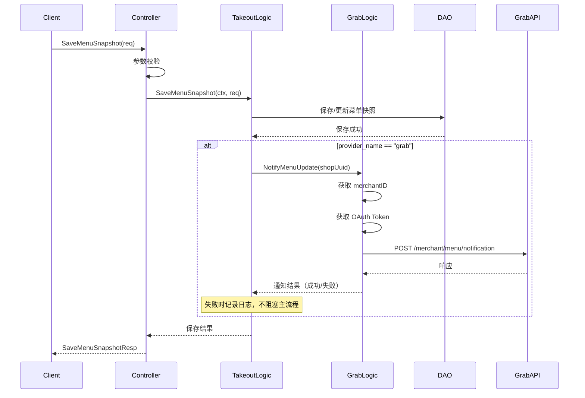

# SaveMenuSnapshot 菜单快照保存 设计文档

> 本文档定义 SaveMenuSnapshot 菜单快照保存功能的技术设计和实现方案。

## 📋 概述

在 `TakeoutService` 中新增 `SaveMenuSnapshot` gRPC 方法，用于保存外部渠道推送的菜单快照数据。当渠道为 Grab 时，保存成功后自动调用 Grab Update Menu Notification API 通知菜单更新。

---

## 🎯 规范对齐

### Go BMP 规范 (go-bmp.mdc)

- 禁止修改 dao/entity/do/ 目录（自动生成）
- gRPC 服务注册到 Nacos
- 遵循 GoFrame 项目结构
- 分层设计: Controller → Logic → DAO

### Protobuf 规范 (proto-rules.mdc)

- 使用 proto3 语法
- 字段使用 snake_case 命名
- 复用现有 `ResponseInfo` 响应结构

---

## 🔄 代码复用分析

### 可复用的现有组件

| 组件 | 路径 | 用途 |
|------|------|------|
| **TakeoutService** | `ttpos-takeout/manifest/protobuf/takeout/takeout.proto` | 现有 gRPC 服务定义 |
| **ResponseInfo** | `takeout.proto` | 通用响应结构 |
| **channel_menu_snapshot DAO** | `ttpos-takeout/internal/dao/` | 菜单快照数据访问 |
| **Grab OAuth 认证** | `ttpos-takeout/internal/logic/grab/grab.go` | Grab API 认证 |
| **Grab SDK Wrapper** | `ttpos-takeout/internal/logic/grab/grab.go` | Grab API 调用封装 |

### 集成点

- **GetMenuSnapshot**: 现有查询方法，SaveMenuSnapshot 与其配套
- **channel_menu_snapshot 表**: 菜单快照存储，复用现有表结构
- **Grab Update Menu Notification API**: 外部 API 依赖

---

## 🏗️ 架构设计

### 分层设计

```
gRPC Request
     ↓
Controller (ttpos-takeout/internal/controller/rpc/takeout/)
     ↓
Logic (ttpos-takeout/internal/logic/takeout/)
     ↓
DAO (ttpos-takeout/internal/dao/) - 自动生成，不修改
     ↓
Database (channel_menu_snapshot 表)
```

### 业务流程图



### 模块划分

```
ttpos-bmp/app/ttpos-takeout/
├── manifest/protobuf/takeout/
│   └── takeout.proto              # 新增 SaveMenuSnapshot RPC
├── api/takeout/
│   ├── takeout.pb.go              # 自动生成
│   └── takeout_grpc.pb.go         # 自动生成
├── internal/
│   ├── controller/rpc/takeout/
│   │   └── takeout.go             # 新增 SaveMenuSnapshot 处理
│   ├── logic/
│   │   ├── takeout/
│   │   │   └── takeout.go         # 新增 SaveMenuSnapshot 业务逻辑
│   │   └── grab/
│   │       └── grab.go            # 新增 NotifyMenuUpdate 方法
│   └── service/
│       └── takeout.go             # 新增 SaveMenuSnapshot 接口定义
```

---

## 🗄️ 数据库设计

### 复用现有表

使用现有 `channel_menu_snapshot` 表，无需新建表。

**关键字段**:

| 字段 | 类型 | 说明 |
|------|------|------|
| provider_name | varchar | 渠道名称: grab, lineman |
| shop_uuid | varchar | 店铺 UUID |
| content | text | 菜单数据 JSON |
| request_id | varchar | 请求 ID |
| updated_at | int | 更新时间戳 |

---

## 📊 数据模型

### Proto 定义

```protobuf
// 新增到 takeout.proto

message SaveMenuSnapshotReq {
  string provider_name = 1; // 渠道名称: grab,lineman
  string shop_uuid = 2;     // 店铺 UUID
  string menu_data = 3;     // 菜单数据 JSON 字符串
  string request_id = 4;    // 请求 ID
}

message SaveMenuSnapshotResp {
  ResponseInfo responseInfo = 1;
}

// 在 TakeoutService 中新增:
rpc SaveMenuSnapshot (SaveMenuSnapshotReq) returns (SaveMenuSnapshotResp) {}
```

### DTO 定义（Logic 层）

```go
// internal/model/dto/takeout/save_menu_snapshot.go

type SaveMenuSnapshotInput struct {
    ProviderName string
    ShopUuid     string
    MenuData     string
    RequestId    string
}

type SaveMenuSnapshotOutput struct {
    Success bool
    Message string
}
```

---

## 🔌 API 设计

### gRPC API

#### SaveMenuSnapshot

**请求**:

```protobuf
message SaveMenuSnapshotReq {
  string provider_name = 1; // 必填，渠道名称
  string shop_uuid = 2;     // 必填，店铺 UUID
  string menu_data = 3;     // 必填，菜单 JSON
  string request_id = 4;    // 可选，请求 ID
}
```

**响应**:

```protobuf
message SaveMenuSnapshotResp {
  ResponseInfo responseInfo = 1; // code: "0" 成功, 其他失败
}
```

**错误码**:

| code | message | 说明 |
|------|---------|------|
| 0 | success | 成功 |
| 1001 | provider_name is required | 缺少渠道名称 |
| 1002 | shop_uuid is required | 缺少店铺 UUID |
| 1003 | menu_data is required | 缺少菜单数据 |
| 5001 | save menu snapshot failed | 保存失败 |

---

## 🧩 组件和接口

### Service 接口

```go
// internal/service/takeout.go

type ITakeout interface {
    // 现有方法...
    GetMenuSnapshot(ctx context.Context, req *takeout.GetMenuSnapshotReq) (*takeout.GetMenuSnapshotResp, error)
    
    // 新增方法
    SaveMenuSnapshot(ctx context.Context, req *takeout.SaveMenuSnapshotReq) (*takeout.SaveMenuSnapshotResp, error)
}
```

### Logic 层实现

```go
// internal/logic/takeout/takeout.go

func (s *sTakeout) SaveMenuSnapshot(ctx context.Context, req *takeout.SaveMenuSnapshotReq) (*takeout.SaveMenuSnapshotResp, error) {
    // 1. 参数校验
    if req.ProviderName == "" {
        return errorResp("1001", "provider_name is required"), nil
    }
    if req.ShopUuid == "" {
        return errorResp("1002", "shop_uuid is required"), nil
    }
    if req.MenuData == "" {
        return errorResp("1003", "menu_data is required"), nil
    }
    
    // 2. 保存菜单快照
    err := s.saveOrUpdateSnapshot(ctx, req)
    if err != nil {
        g.Log().Errorf(ctx, "save menu snapshot failed: %v", err)
        return errorResp("5001", "save menu snapshot failed"), nil
    }
    
    // 3. 如果是 Grab 渠道，异步通知菜单更新
    if req.ProviderName == "grab" {
        go s.notifyGrabMenuUpdate(ctx, req.ShopUuid)
    }
    
    return &takeout.SaveMenuSnapshotResp{
        ResponseInfo: &takeout.ResponseInfo{Code: "0", Message: "success"},
    }, nil
}

func (s *sTakeout) notifyGrabMenuUpdate(ctx context.Context, shopUuid string) {
    // 调用 Grab Logic 通知菜单更新
    err := grab.NotifyMenuUpdate(ctx, shopUuid)
    if err != nil {
        g.Log().Errorf(ctx, "notify grab menu update failed: shop_uuid=%s, err=%v", shopUuid, err)
        // 不阻塞主流程，仅记录日志
    }
}
```

### Grab Logic 扩展

```go
// internal/logic/grab/grab.go

// NotifyMenuUpdate 通知 Grab 菜单已更新
func NotifyMenuUpdate(ctx context.Context, shopUuid string) error {
    // 1. 获取 Grab merchantID
    merchantID, err := getMerchantIDByShopUuid(ctx, shopUuid)
    if err != nil {
        return fmt.Errorf("get merchantID failed: %w", err)
    }
    
    // 2. 获取 OAuth Token
    token, err := getAccessToken(ctx, shopUuid)
    if err != nil {
        return fmt.Errorf("get access token failed: %w", err)
    }
    
    // 3. 调用 Grab API
    resp, err := callUpdateMenuNotification(ctx, token, merchantID)
    if err != nil {
        return fmt.Errorf("call grab api failed: %w", err)
    }
    
    // 4. 处理响应（409 是分布式锁冲突，视为正常）
    if resp.StatusCode == 409 {
        g.Log().Infof(ctx, "grab menu notification locked, merchantID=%s", merchantID)
        return nil
    }
    
    if resp.StatusCode != 200 {
        return fmt.Errorf("grab api error: status=%d", resp.StatusCode)
    }
    
    g.Log().Infof(ctx, "grab menu notification success, merchantID=%s", merchantID)
    return nil
}
```

---

## 🚨 错误处理

### 场景 1: 参数校验失败

- **处理方式**: 返回明确的错误码和消息
- **用户影响**: 调用方收到参数错误响应
- **代码示例**:
  ```go
  if req.ProviderName == "" {
      return &takeout.SaveMenuSnapshotResp{
          ResponseInfo: &takeout.ResponseInfo{Code: "1001", Message: "provider_name is required"},
      }, nil
  }
  ```

### 场景 2: 数据库保存失败

- **处理方式**: 记录错误日志，返回保存失败响应
- **用户影响**: 调用方收到保存失败响应

### 场景 3: Grab API 调用失败

- **处理方式**: 记录错误日志，**不影响主流程**
- **用户影响**: 主流程返回成功，Grab 通知异步重试或忽略
- **代码示例**:
  ```go
  go func() {
      err := grab.NotifyMenuUpdate(ctx, shopUuid)
      if err != nil {
          g.Log().Errorf(ctx, "notify grab menu update failed: %v", err)
          // 不返回错误，不阻塞主流程
      }
  }()
  ```

### 场景 4: Grab API 返回 409 (分布式锁)

- **处理方式**: 视为正常，记录 Info 日志
- **用户影响**: 无影响，120 秒内的重复通知被 Grab 自动去重

---

## 🔒 安全设计

### 身份验证

- gRPC 服务内部调用，通过 Nacos 服务发现
- Grab API 使用 OAuth 2.0 Bearer Token

### 数据安全

- Grab client_id/client_secret 从环境变量读取
- menu_data 作为 JSON 字符串存储，不解析敏感内容

---

## 🧪 测试策略

### 单元测试

**目标覆盖率**: Logic 层 ≥ 70%

**测试用例**:

1. 参数校验测试
   - provider_name 为空
   - shop_uuid 为空
   - menu_data 为空

2. 保存逻辑测试
   - 新建快照
   - 更新已存在快照

3. Grab 通知测试
   - Mock Grab API 成功响应
   - Mock Grab API 失败响应
   - Mock Grab API 409 响应

### 集成测试

**测试流程**:

1. 调用 SaveMenuSnapshot 保存菜单
2. 调用 GetMenuSnapshot 验证保存成功
3. 验证 Grab API 被正确调用（Mock）

---

## 📈 性能优化

### 优化策略

1. **异步通知**: Grab API 调用使用 goroutine 异步执行
2. **超时控制**: Grab API 调用设置合理超时（10s）
3. **日志优化**: 使用结构化日志，方便排查问题

### 性能指标

- gRPC 响应时间: < 200ms（不含 Grab API）
- 整体响应时间: < 500ms（含异步 Grab API）

---

## 📚 实现清单

### Phase 1: Proto 定义和代码生成

- [ ] 修改 takeout.proto，添加 SaveMenuSnapshot
- [ ] 执行 make dao 生成代码

### Phase 2: 业务逻辑实现

- [ ] 更新 Service 接口定义
- [ ] 实现 Logic 层 SaveMenuSnapshot 方法
- [ ] 实现 Controller 层处理
- [ ] 实现 Grab NotifyMenuUpdate 方法

### Phase 3: 测试

- [ ] 编写单元测试
- [ ] 集成测试验证

**详细任务**: 参见 `tasks.md`

---

**版本**: v1.0.0  
**创建日期**: 2025-12-11  
**作者**: rikugun  
**审核者**: -
