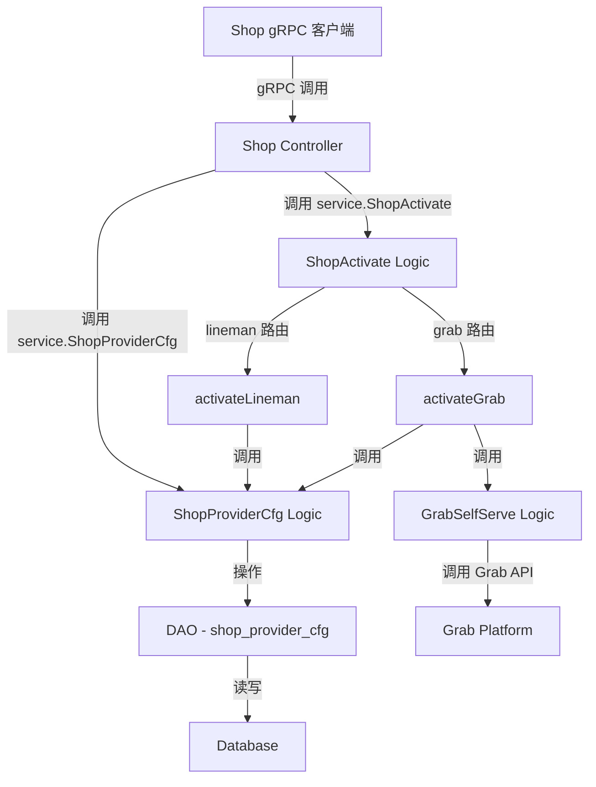

# 门店多渠道激活服务 设计文档

> 本文档定义门店多渠道激活服务的技术设计和实现方案。

## 📋 概述

门店多渠道激活服务提供统一的 gRPC 接口，支持商户管理员通过 Shop 服务激活和查询门店在不同外卖渠道（LINE MAN、Grab）的配置状态。该服务位于 ttpos-bmp 微服务架构中的 ttpos-takeout 模块，通过 gRPC 协议对外提供服务，复用现有的门店配置管理（ShopProviderCfg）和 Grab 自助激活（GrabSelfServe）逻辑。

**架构定位**：
- **模块**: ttpos-bmp/app/ttpos-takeout
- **协议**: gRPC
- **技术栈**: Go + GoFrame 2.x
- **服务注册**: Nacos
- **数据库**: 复用现有 `shop_provider_cfg` 表

---

## 🎯 规范对齐

### Go BMP 规范 (go-rules.mdc)

本设计严格遵循 GoFrame 开发规范：

- **目录结构**: 遵循 GoFrame 推荐的 app/ 目录结构
- **自动生成文件**: 禁止修改 dao/entity/do/service 目录（框架生成）
- **服务注册**: 所有 gRPC 服务注册到 internal/service，并初始化
- **代码生成**: 使用 `gf gen pb` 和 `gf gen service` 生成代码
- **分层设计**: Controller → Logic → DAO 三层架构
- **日志记录**: 使用 `g.Log()` 记录日志，日志描述使用中文

### Protobuf 规范 (proto-rules.mdc)

Protobuf 定义遵循规范：

- **文件命名**: 使用 snake_case（shop.proto）
- **消息命名**: 请求以 `Req` 结尾，响应以 `Resp` 结尾
- **字段命名**: 使用 snake_case
- **服务命名**: 以 `Service` 结尾（Shop）
- **方法命名**: 使用大驼峰命名法（ActivateShop, GetShopProviderCfg）
- **注释**: 所有服务和消息添加详细的中文注释

### ttpos-takeout 子模块规范 (go-ttpos-takeout)

遵循 ttpos-takeout 特定规则：

- **Controller 层**: 返回 `takeout.ApiResponse` 统一响应格式
- **Logic 层**: 返回具体业务数据类型，不返回 `ApiResponse`
- **Service 复用**: 尽量复用已有逻辑，避免重复实现
- **gRPC 响应**: 对外提供的 gRPC 服务响应参数应通过 `takeout.ApiResponse` 包装

### API 设计规范 (api.mdc)

- **协议**: 使用 gRPC 协议
- **响应格式**: 统一使用 `takeout.ApiResponse` 包装
- **错误处理**: 使用 `gerror` 包进行错误处理
- **参数验证**: 在 Controller 层进行基础参数验证

### 数据库规范 (database.mdc)

- **复用现有表**: 使用 `shop_provider_cfg` 表，不需要创建新表
- **字段规范**: 时间字段使用 int 类型，金额字段使用 decimal(20,8)
- **软删除**: 使用 `delete_time` 字段（默认 0）

---

## 🔄 代码复用分析

### 可复用的现有组件

- **ShopProviderCfg Logic**: `ttpos-bmp/app/ttpos-takeout/internal/logic/shop_provider_cfg/shop_provider_cfg.go` - 门店第三方配置管理
  - 复用方法: `UpsertShopProviderCfg`, `GetShopProviderCfg`, `GetShopProviderCfgByMerchantID`
  - 新增方法: `GetShopProviderCfgForRPC`（支持查询单个或所有渠道）

- **GrabSelfServe Logic**: `ttpos-bmp/app/ttpos-takeout/internal/logic/grab_self_serve/grab_self_serve.go` - Grab 自助激活链接服务
  - 复用方法: `CreateSelfServeJourney`
  - 用途: Grab 渠道激活时调用

- **常量定义**: `ttpos-bmp/app/ttpos-takeout/internal/consts/consts.go`
  - 现有: `ProviderGrab`, `ProviderSkootar`
  - 新增: `ProviderLineman`

### 集成点

- **Protobuf 定义**: 在 `manifest/protobuf/shop/shop.proto` 中定义新服务
- **gRPC Controller**: 在 `internal/controller/rpc/shop/` 中实现 Controller
- **Logic 层**: 在 `internal/logic/shop_activate/` 中实现多渠道路由逻辑
- **Service 注册**: 在 `internal/service/` 中注册服务接口（自动生成）
- **数据库表**: 复用 `shop_provider_cfg` 表，无需迁移

---

## 🏗️ 架构设计

### 分层设计原则

**GoFrame 三层架构**:

```
RPC Controller 层 (internal/controller/rpc/)
  ↓ 调用
Logic 层 (internal/logic/)
  ↓ 调用
DAO 层 (internal/dao/)  [自动生成，禁止修改]
  ↓ 操作
Database (shop_provider_cfg 表)
```

**依赖规则**:

- ✅ Controller 调用 service（Logic 的接口）
- ✅ Logic 调用 DAO
- ✅ Logic 可以调用其他 Logic 的 service 接口
- ❌ 禁止跨层调用
- ❌ 禁止修改自动生成的代码（dao/entity/do/service）

### 架构图



### 模块划分

#### ttpos-takeout 模块结构

```
ttpos-bmp/app/ttpos-takeout/
├── api/                           # gRPC API 定义（自动生成）
│   ├── shop/                      # Shop 服务 API
│   │   ├── shop.pb.go             # Protobuf 生成的 Go 代码
│   │   └── shop_grpc.pb.go        # gRPC 服务代码
│   └── takeout/                   # 通用消息定义
│       └── takeout_api.pb.go      # ApiResponse 定义
├── internal/
│   ├── controller/
│   │   └── rpc/
│   │       └── shop/              # Shop gRPC Controller
│   │           └── shop.go        # ✅ 新增：实现 ActivateShop, GetShopProviderCfg
│   ├── logic/
│   │   ├── shop_activate/         # ✅ 新增：门店激活 Logic
│   │   │   └── shop_activate.go   # 多渠道路由逻辑
│   │   ├── shop_provider_cfg/     # 现有：门店配置管理 Logic
│   │   │   └── shop_provider_cfg.go  # ✅ 扩展：新增 GetShopProviderCfgForRPC
│   │   └── grab_self_serve/       # 现有：Grab 自助激活 Logic
│   ├── dao/                       # DAO 层（自动生成 ❌ 禁止修改）
│   ├── model/
│   │   ├── entity/                # 数据实体（自动生成 ❌ 禁止修改）
│   │   ├── do/                    # 数据对象（自动生成 ❌ 禁止修改）
│   │   └── dto/                   # 数据传输对象（手动编写）
│   ├── service/                   # Service 接口（自动生成 ❌ 禁止修改）
│   └── consts/
│       └── consts.go              # ✅ 扩展：新增 ProviderLineman
└── manifest/
    └── protobuf/
        ├── shop/
        │   └── shop.proto         # ✅ 新增：Shop 服务定义
        └── takeout/
            └── takeout_api.proto  # 现有：ApiResponse 定义
```

---

## 🗄️ 数据库设计

### 数据表设计

#### 表: shop_provider_cfg（复用现有表）

**说明**: 该表已存在，无需创建迁移文件。用于存储门店在各个外卖渠道的配置信息。

**表结构**:

```sql
CREATE TABLE IF NOT EXISTS `shop_provider_cfg` (
    `id` bigint unsigned NOT NULL AUTO_INCREMENT COMMENT '主键ID',
    `uuid` bigint unsigned NOT NULL DEFAULT 0 COMMENT '唯一标识',
    `shop_uuid` bigint unsigned NOT NULL DEFAULT 0 COMMENT '门店UUID',
    `provider_name` varchar(50) NOT NULL DEFAULT '' COMMENT '第三方名称（lineman、grab）',
    `provider_merchant_id` varchar(255) NOT NULL DEFAULT '' COMMENT '第三方商户ID',
    `provider_shop_status` varchar(50) NOT NULL DEFAULT 'INACTIVE' COMMENT '门店集成状态（INACTIVE/ACTIVE/SYNCING/FAILED）',
    `created_at` int NOT NULL DEFAULT 0 COMMENT '创建时间',
    `updated_at` int NOT NULL DEFAULT 0 COMMENT '更新时间',
    `deleted_at` int NOT NULL DEFAULT 0 COMMENT '删除时间',
    PRIMARY KEY (`id`),
    UNIQUE KEY `uk_uuid` (`uuid`),
    UNIQUE KEY `uk_shop_provider` (`shop_uuid`, `provider_name`, `deleted_at`),
    KEY `idx_shop_uuid` (`shop_uuid`),
    KEY `idx_provider_name` (`provider_name`)
) ENGINE=InnoDB DEFAULT CHARSET=utf8mb4 COMMENT='门店第三方配置表';
```

**字段说明**:
| 字段 | 类型 | 说明 | 约束 |
|------|------|------|------|
| id | bigint unsigned | 主键 ID | AUTO_INCREMENT |
| uuid | bigint unsigned | 唯一标识 | DEFAULT 0, UNIQUE |
| shop_uuid | bigint unsigned | 门店 UUID | DEFAULT 0, INDEX |
| provider_name | varchar(50) | 第三方名称 | lineman, grab |
| provider_merchant_id | varchar(255) | 第三方商户 ID | Grab 返回 |
| provider_shop_status | varchar(50) | 集成状态 | INACTIVE/ACTIVE/SYNCING/FAILED |
| created_at | int | 创建时间 | DEFAULT 0 |
| updated_at | int | 更新时间 | DEFAULT 0 |
| deleted_at | int | 删除时间 | DEFAULT 0（软删除） |

**索引设计**:

- 主键索引: `PRIMARY KEY (id)`
- 唯一索引: `UNIQUE KEY uk_uuid (uuid)`
- 联合唯一索引: `UNIQUE KEY uk_shop_provider (shop_uuid, provider_name, deleted_at)` - 确保同一门店在同一渠道只有一条有效记录
- 普通索引: `KEY idx_shop_uuid (shop_uuid)` - 按门店查询
- 普通索引: `KEY idx_provider_name (provider_name)` - 按渠道查询

### 数据库迁移

**无需迁移**: 该表已存在，无需创建新的迁移脚本。

---

## 📊 数据模型

### GoFrame Entity（自动生成，禁止修改）

```go
// internal/model/entity/shop_provider_cfg.go（自动生成）
type ShopProviderCfg struct {
    Id                 uint64 `gorm:"column:id;primaryKey"`
    Uuid               uint64 `gorm:"column:uuid;uniqueIndex"`
    ShopUuid           uint64 `gorm:"column:shop_uuid;index"`
    ProviderName       string `gorm:"column:provider_name;index"`
    ProviderMerchantId string `gorm:"column:provider_merchant_id"`
    ProviderShopStatus string `gorm:"column:provider_shop_status"`
    CreatedAt          int    `gorm:"column:created_at"`
    UpdatedAt          int    `gorm:"column:updated_at"`
    DeletedAt          int    `gorm:"column:deleted_at;index"`
}
```

### Protobuf 消息定义

#### Shop 服务定义

```protobuf
// manifest/protobuf/shop/shop.proto
syntax = "proto3";

package shop;

import "takeout_api.proto";

option go_package = "ttpos-bmp/app/ttpos-takeout/api/shop";

// Shop 服务接口定义
// 提供门店管理相关的 gRPC 服务方法
service Shop {
  // 激活门店外卖渠道
  // 参数：provider_name（外卖渠道）、shop_uuid（门店UUID）、request_id（追踪ID，可选）
  // 返回：统一的 ApiResponse 格式，包含激活结果（shop_uuid、provider_name、updated_at，Grab渠道额外返回激活链接）
  rpc ActivateShop (ActivateShopReq) returns (takeout.ApiResponse);

  // 查询门店第三方配置
  // 参数：shop_uuid（门店UUID）、provider_name（第三方名称，可选）
  // 返回：统一的 ApiResponse 格式，包含渠道配置列表
  //       - provider_name 为空时：返回所有支持渠道（lineman、grab）的配置
  //       - provider_name 不为空时：仅返回指定渠道的配置
  rpc GetShopProviderCfg (GetShopProviderCfgReq) returns (takeout.ApiResponse);
}

message ActivateShopReq {
  string provider_name = 1; // 外卖渠道：lineman、grab
  string shop_uuid = 2;     // 门店 UUID
  string request_id = 3;    // 追踪 ID，可选
}

message ActivateShopResp {
  uint64 shop_uuid = 1;       // 门店 UUID
  string provider_name = 2;   // 外卖渠道名称
  string self_serve_url = 3;  // 自助激活链接（仅 grab 渠道返回）
  string request_id = 4;      // 追踪 ID
  int64  updated_at = 5;      // 更新时间（Unix 秒）
}

message GetShopProviderCfgReq {
  uint64 shop_uuid = 1;       // 门店 UUID
  string provider_name = 2;   // 第三方名称（可选，为空时返回所有渠道配置）
}

message ShopProviderCfgItem {
  string provider_name = 1;         // 第三方名称（lineman、grab）
  string provider_merchant_id = 2;  // 第三方商户 ID
  string provider_shop_status = 3;  // 门店集成状态 (INACTIVE/ACTIVE/SYNCING/FAILED)
  int64  updated_at = 4;            // 更新时间（Unix 秒）
}

message GetShopProviderCfgResp {
  uint64 shop_uuid = 1;                         // 门店 UUID
  repeated ShopProviderCfgItem providers = 2;   // 渠道配置列表（单个或多个）
}
```

**生成代码**:

```bash
cd ttpos-bmp/app/ttpos-takeout
gf gen pb
gf gen service
```

---

## 🔌 API 设计

### gRPC API

#### API 1: ActivateShop - 激活门店外卖渠道

**服务定义**:

```protobuf
rpc ActivateShop (ActivateShopReq) returns (takeout.ApiResponse);
```

**请求参数**:

- `provider_name` (string, required): 外卖渠道名称（lineman、grab）
- `shop_uuid` (string, required): 门店 UUID
- `request_id` (string, optional): 追踪 ID

**响应格式**:

```json
{
  "code": "200",
  "message": "success",
  "data": {
    "@type": "type.googleapis.com/shop.ActivateShopResp",
    "shop_uuid": "123456",
    "provider_name": "grab",
    "self_serve_url": "https://grab.com/activate/...",
    "request_id": "req-12345",
    "updated_at": 1704614400
  }
}
```

**错误响应**:

```json
{
  "code": "400",
  "message": "shop_uuid 不能为空",
  "data": null
}
```

**业务逻辑**:

1. **Lineman 渠道**: 直接创建 `shop_provider_cfg` 记录，状态为 `INACTIVE`
2. **Grab 渠道**: 调用 `GrabSelfServe().CreateSelfServeJourney`，创建自助激活链接，状态为 `SYNCING`

#### API 2: GetShopProviderCfg - 查询门店第三方配置

**服务定义**:

```protobuf
rpc GetShopProviderCfg (GetShopProviderCfgReq) returns (takeout.ApiResponse);
```

**请求参数**:

- `shop_uuid` (uint64, required): 门店 UUID
- `provider_name` (string, optional): 第三方名称（为空时返回所有渠道）

**响应格式（查询所有渠道）**:

```json
{
  "code": "200",
  "message": "success",
  "data": {
    "@type": "type.googleapis.com/shop.GetShopProviderCfgResp",
    "shop_uuid": "123456",
    "providers": [
      {
        "provider_name": "lineman",
        "provider_merchant_id": "",
        "provider_shop_status": "INACTIVE",
        "updated_at": 0
      },
      {
        "provider_name": "grab",
        "provider_merchant_id": "GRAB-12345",
        "provider_shop_status": "ACTIVE",
        "updated_at": 1704614400
      }
    ]
  }
}
```

**响应格式（查询单个渠道）**:

```json
{
  "code": "200",
  "message": "success",
  "data": {
    "@type": "type.googleapis.com/shop.GetShopProviderCfgResp",
    "shop_uuid": "123456",
    "providers": [
      {
        "provider_name": "grab",
        "provider_merchant_id": "GRAB-12345",
        "provider_shop_status": "ACTIVE",
        "updated_at": 1704614400
      }
    ]
  }
}
```

---

## 🧩 组件和接口

### Logic 层

#### ShopActivate Logic（新增）

```go
// internal/logic/shop_activate/shop_activate.go

type sShopActivate struct{}

func init() {
    service.RegisterShopActivate(New())
}

func New() *sShopActivate {
    return &sShopActivate{}
}

// ActivateShop 激活门店外卖渠道（多渠道路由）
func (s *sShopActivate) ActivateShop(ctx context.Context, req *shop.ActivateShopReq) (*shop.ActivateShopResp, error) {
    // 参数校验
    if req.ProviderName == "" {
        return nil, gerror.NewCode(gcode.CodeInvalidParameter, "provider_name 不能为空")
    }
    if req.ShopUuid == "" {
        return nil, gerror.NewCode(gcode.CodeInvalidParameter, "shop_uuid 不能为空")
    }

    shopUUID := g.NewVar(req.ShopUuid).Uint64()
    if shopUUID == 0 {
        return nil, gerror.NewCode(gcode.CodeInvalidParameter, "shop_uuid 格式无效")
    }

    // 渠道路由
    switch req.ProviderName {
    case string(consts.ProviderLineman):
        return s.activateLineman(ctx, shopUUID, req.RequestId)
    case string(consts.ProviderGrab):
        return s.activateGrab(ctx, req)
    default:
        return nil, gerror.NewCodef(gcode.CodeInvalidParameter, "不支持的渠道: %s", req.ProviderName)
    }
}

// activateLineman LINE MAN 渠道激活（直接创建配置）
func (s *sShopActivate) activateLineman(ctx context.Context, shopUUID uint64, requestID string) (*shop.ActivateShopResp, error) {
    // 创建配置记录（状态 INACTIVE）
    err := service.ShopProviderCfg().UpsertShopProviderCfg(ctx, shopUUID, string(consts.ProviderLineman), "", consts.ProviderShopStatusInactive)
    if err != nil {
        return nil, err
    }

    // 查询配置返回
    cfg, err := service.ShopProviderCfg().GetShopProviderCfg(ctx, shopUUID, string(consts.ProviderLineman))
    if err != nil {
        return nil, err
    }

    return &shop.ActivateShopResp{
        ShopUuid:     cfg.ShopUuid,
        ProviderName: cfg.ProviderName,
        RequestId:    requestID,
        UpdatedAt:    int64(cfg.UpdatedAt),
    }, nil
}

// activateGrab Grab 渠道激活（调用自助激活服务）
func (s *sShopActivate) activateGrab(ctx context.Context, req *shop.ActivateShopReq) (*shop.ActivateShopResp, error) {
    // 调用 Grab 自助激活服务
    grabReq := &grab.CreateSelfServeJourneyReq{
        ProviderName: req.ProviderName,
        ShopUuid:     req.ShopUuid,
        RequestId:    req.RequestId,
    }
    grabResp, err := service.GrabSelfServe().CreateSelfServeJourney(ctx, grabReq)
    if err != nil {
        return nil, err
    }

    // 查询配置
    shopUUID := g.NewVar(req.ShopUuid).Uint64()
    cfg, err := service.ShopProviderCfg().GetShopProviderCfg(ctx, shopUUID, string(consts.ProviderGrab))
    if err != nil {
        return nil, err
    }

    return &shop.ActivateShopResp{
        ShopUuid:     cfg.ShopUuid,
        ProviderName: cfg.ProviderName,
        SelfServeUrl: grabResp.SelfServeUrl,
        RequestId:    grabResp.RequestId,
        UpdatedAt:    int64(cfg.UpdatedAt),
    }, nil
}
```

#### ShopProviderCfg Logic（扩展）

```go
// internal/logic/shop_provider_cfg/shop_provider_cfg.go（扩展方法）

// GetShopProviderCfgForRPC 查询门店渠道配置（gRPC 接口）
// 支持两种模式：
// 1. providerName 非空：返回指定渠道的配置
// 2. providerName 为空：返回所有支持渠道的配置列表
func (s *sShopProviderCfg) GetShopProviderCfgForRPC(ctx context.Context, shopUUID uint64, providerName string) (*shop.GetShopProviderCfgResp, error) {
    // 参数校验
    if shopUUID == 0 {
        return nil, gerror.NewCode(gcode.CodeInvalidParameter, "shop_uuid 不能为 0")
    }

    var cfgItems []*shop.ShopProviderCfgItem

    // 如果指定了 provider_name，只查询该渠道
    if providerName != "" {
        cfg, err := s.GetShopProviderCfg(ctx, shopUUID, providerName)
        if err != nil {
            return nil, err
        }

        // 如果配置不存在，返回默认 INACTIVE 状态
        if cfg == nil {
            cfgItems = append(cfgItems, &shop.ShopProviderCfgItem{
                ProviderName:       providerName,
                ProviderMerchantId: "",
                ProviderShopStatus: string(consts.ProviderShopStatusInactive),
                UpdatedAt:          0,
            })
        } else {
            cfgItems = append(cfgItems, &shop.ShopProviderCfgItem{
                ProviderName:       cfg.ProviderName,
                ProviderMerchantId: cfg.ProviderMerchantId,
                ProviderShopStatus: cfg.ProviderShopStatus,
                UpdatedAt:          int64(cfg.UpdatedAt),
            })
        }
    } else {
        // 未指定 provider_name，查询所有支持的渠道
        providers := []consts.ProviderName{
            consts.ProviderLineman,
            consts.ProviderGrab,
        }

        for _, pName := range providers {
            cfg, err := s.GetShopProviderCfg(ctx, shopUUID, string(pName))
            if err != nil {
                g.Log().Warningf(ctx, "[ShopProviderCfg] 查询渠道配置失败: shop_uuid=%d, provider=%s, error=%v",
                    shopUUID, pName, err)
                continue
            }

            // 如果配置不存在，返回默认 INACTIVE 状态
            if cfg == nil {
                cfgItems = append(cfgItems, &shop.ShopProviderCfgItem{
                    ProviderName:       string(pName),
                    ProviderMerchantId: "",
                    ProviderShopStatus: string(consts.ProviderShopStatusInactive),
                    UpdatedAt:          0,
                })
            } else {
                cfgItems = append(cfgItems, &shop.ShopProviderCfgItem{
                    ProviderName:       cfg.ProviderName,
                    ProviderMerchantId: cfg.ProviderMerchantId,
                    ProviderShopStatus: cfg.ProviderShopStatus,
                    UpdatedAt:          int64(cfg.UpdatedAt),
                })
            }
        }
    }

    return &shop.GetShopProviderCfgResp{
        ShopUuid:  shopUUID,
        Providers: cfgItems,
    }, nil
}
```

### Controller 层

#### Shop RPC Controller

```go
// internal/controller/rpc/shop/shop.go

type Controller struct {
    shop.UnimplementedShopServer
}

func Register(s *grpc.Server) {
    shop.RegisterShopServer(s, &Controller{})
}

// ActivateShop 激活门店外卖渠道
func (c *Controller) ActivateShop(ctx context.Context, req *shop.ActivateShopReq) (*takeout.ApiResponse, error) {
    res, err := service.ShopActivate().ActivateShop(ctx, req)
    if err != nil {
        return &takeout.ApiResponse{
            Code:    string(consts.CodeServiceError),
            Message: err.Error(),
        }, nil
    }

    dataAny, err := anypb.New(res)
    if err != nil {
        return &takeout.ApiResponse{
            Code:    string(consts.CodeSerializeError),
            Message: consts.MsgSerializeFailed,
        }, nil
    }

    return &takeout.ApiResponse{
        Code:    string(consts.CodeSuccess),
        Message: consts.MsgSuccess,
        Data:    dataAny,
    }, nil
}

// GetShopProviderCfg 查询门店第三方配置
func (c *Controller) GetShopProviderCfg(ctx context.Context, req *shop.GetShopProviderCfgReq) (*takeout.ApiResponse, error) {
    // 查询门店渠道配置（支持查询单个或所有渠道）
    res, err := service.ShopProviderCfg().GetShopProviderCfgForRPC(ctx, req.ShopUuid, req.ProviderName)
    if err != nil {
        return &takeout.ApiResponse{
            Code:    string(consts.CodeServiceError),
            Message: err.Error(),
        }, nil
    }

    dataAny, err := anypb.New(res)
    if err != nil {
        return &takeout.ApiResponse{
            Code:    string(consts.CodeSerializeError),
            Message: consts.MsgSerializeFailed,
        }, nil
    }

    return &takeout.ApiResponse{
        Code:    string(consts.CodeSuccess),
        Message: consts.MsgSuccess,
        Data:    dataAny,
    }, nil
}
```

---

## 🚨 错误处理

### 错误场景

#### 场景 1: 参数错误

- **处理方式**: 在 Controller 层验证参数，返回 400 错误
- **用户影响**: 看到参数错误提示信息
- **代码示例**:
  ```go
  if req.ShopUuid == "" {
      return &takeout.ApiResponse{
          Code:    "400",
          Message: "shop_uuid 不能为空",
      }, nil
  }
  ```

#### 场景 2: 不支持的渠道

- **处理方式**: 在渠道路由时检查，返回 400 错误
- **用户影响**: 看到"不支持的渠道: xxx"提示
- **代码示例**:
  ```go
  default:
      return nil, gerror.NewCodef(gcode.CodeInvalidParameter, "不支持的渠道: %s", req.ProviderName)
  ```

#### 场景 3: Grab API 调用失败

- **处理方式**: 捕获 Grab API 错误，记录日志，返回 500 错误
- **用户影响**: 看到"Grab API 调用失败"提示
- **代码示例**:
  ```go
  grabResp, err := service.GrabSelfServe().CreateSelfServeJourney(ctx, grabReq)
  if err != nil {
      g.Log().Errorf(ctx, "[ShopActivate] Grab API 调用失败: %v", err)
      return nil, err
  }
  ```

#### 场景 4: 数据库操作失败

- **处理方式**: 记录详细错误日志，返回 500 错误
- **用户影响**: 看到"操作失败"通用提示
- **代码示例**:
  ```go
  err := service.ShopProviderCfg().UpsertShopProviderCfg(ctx, shopUUID, providerName, merchantID, status)
  if err != nil {
      g.Log().Errorf(ctx, "[ShopProviderCfg] 更新失败: shop_uuid=%d, error=%v", shopUUID, err)
      return nil, gerror.Wrap(err, "更新门店第三方配置失败")
  }
  ```

---

## 🔒 安全设计

### 身份验证

- **gRPC Token**: 所有 gRPC 接口需要 Token 验证（由 gRPC 中间件处理）
- **服务间认证**: 使用 `X-TTPOS-SECRET` 头进行服务间认证

### 权限控制

- **RBAC**: 基于角色的访问控制（商户管理员权限）
- **API 权限**: gRPC 接口检查用户权限

### 数据安全

- **参数校验**: 严格验证 shop_uuid、provider_name 参数
- **SQL 注入防护**: 使用 GoFrame ORM，参数化查询
- **错误信息**: 不暴露敏感信息（如数据库错误详情）

---

## 🧪 测试策略

### 单元测试

**目标覆盖率**:

- Logic 层: 70%+

**测试内容**:

- ShopActivate Logic: 测试多渠道路由逻辑
- ShopProviderCfg Logic: 测试查询单个/所有渠道

**示例**:

```go
// internal/logic/shop_activate/shop_activate_test.go
func TestShopActivate_ActivateLineman(t *testing.T) {
    // 测试 Lineman 渠道激活
}

func TestShopActivate_ActivateGrab(t *testing.T) {
    // 测试 Grab 渠道激活
}
```

### gRPC 接口测试

**测试内容**:

- ActivateShop 接口调用
- GetShopProviderCfg 接口调用
- 参数验证
- 响应格式
- 错误处理

### 集成测试

**测试流程**:

- 激活 Lineman 渠道 → 查询配置 → 验证状态
- 激活 Grab 渠道 → 查询配置 → 验证激活链接
- 查询所有渠道 → 验证返回列表
- 查询单个渠道 → 验证返回单条

---

## 📈 性能优化

### 优化策略

1. **数据库优化**:

   - 使用索引: `idx_shop_uuid`, `idx_provider_name`
   - 联合唯一索引: `uk_shop_provider` 避免重复记录

2. **缓存优化**（可选）:

   - Redis 缓存门店配置
   - 缓存 Key: `ttpos:takeout:shop_provider_cfg:{shop_uuid}:{provider_name}`
   - 过期时间: 5 分钟

3. **并发控制**:
   - 使用联合唯一索引防止并发创建重复记录

### 性能指标

- gRPC 响应时间: < 200ms
- 数据库查询: < 50ms
- Grab API 调用: < 3s

---

## 📚 实现清单

### Phase 1: Protobuf 定义和代码生成

- [ ] 定义 shop.proto
- [ ] 定义 ActivateShopReq/Resp 消息
- [ ] 定义 GetShopProviderCfgReq/Resp 消息
- [ ] 执行 `gf gen pb` 生成代码
- [ ] 执行 `gf gen service` 生成服务接口

### Phase 2: Logic 层实现

- [ ] 创建 shop_activate Logic
- [ ] 实现 ActivateShop 方法
- [ ] 实现 activateLineman 方法
- [ ] 实现 activateGrab 方法
- [ ] 扩展 ShopProviderCfg Logic
- [ ] 实现 GetShopProviderCfgForRPC 方法
- [ ] 添加 ProviderLineman 常量

### Phase 3: Controller 层和测试

- [ ] 创建 Shop Controller
- [ ] 实现 ActivateShop 接口
- [ ] 实现 GetShopProviderCfg 接口
- [ ] 注册 gRPC 服务
- [ ] 编写单元测试
- [ ] 编写集成测试

### Phase 4: 联调和文档

- [ ] 前后端联调
- [ ] 性能测试
- [ ] 完善技术文档
- [ ] 代码审查

**详细任务**: 参见 `tasks.md`

---

## Graphiti & 活动日志

- Related Episode: `[待补充]`
- 模板：`docs/agent/templates/graphiti-episode.md`
- 活动日志：`docs/team/activities/rikugun/2026-01/2026-01-07.md`
- 在技术方案评审、关键架构决策或踩坑总结后，立即补充 Episode 并在设计文档尾部互链。

---

**版本**: v1.0.0  
**创建日期**: 2026-01-07  
**作者**: rikugun  
**审核者**: 待指定

