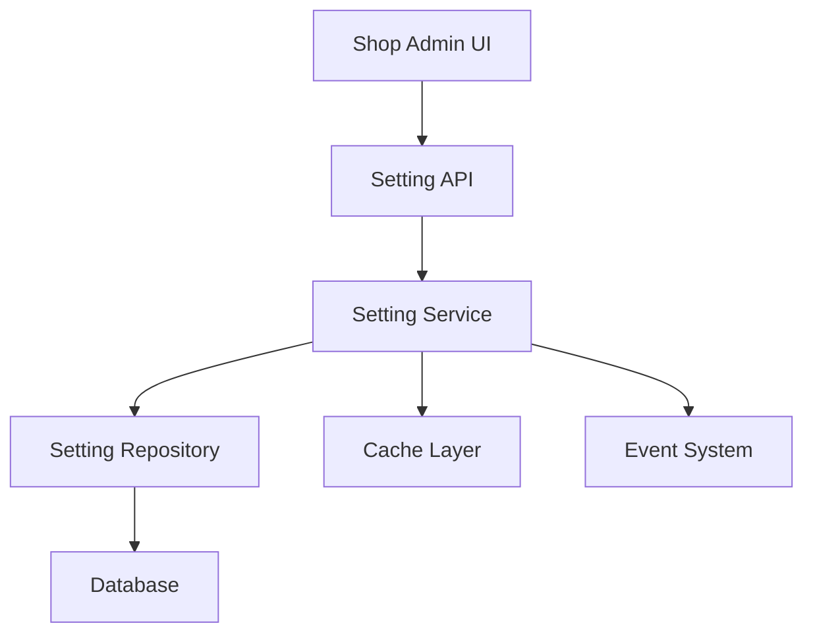

# 外卖状态切换 设计文档

> 本文档定义 外卖状态切换 的技术设计和实现方案。

## 📋 概述

外卖状态切换功能允许商户管理员通过管理后台开启或关闭外卖功能。当外卖功能关闭时，用户无法下单外卖商品，但不影响其他业务功能。该功能主要涉及后端状态管理、前端状态显示和状态切换控制。

---

## 🎯 规范对齐

### Go Main 规范 (go-main.mdc)

[说明设计如何遵循 Go Main 开发规范]

- Service 只依赖其他 Service 接口
- Repository 只持有 db 实例
- URL 使用 snake_case
- data 字段必须是对象
- 不使用 panic，返回 error

### Go BMP 规范 (go-bmp.mdc)

[如涉及微服务，说明如何遵循 GoFrame 规范]

- 禁止修改 dao/entity/do/ 目录
- gRPC 服务注册到 Nacos
- 遵循 GoFrame 项目结构

### API 设计规范 (api.mdc)

[说明 API 设计如何遵循规范]

- URL 使用 snake_case
- 响应格式统一
- data 不能为 null 或数组

### 数据库规范 (database.mdc)

[说明数据库设计如何遵循规范]

- 必需字段完整
- 时间字段使用 int
- 金额字段使用 decimal

---

## 🔄 代码复用分析

[分析将复用、扩展或集成的现有代码]

### 可复用的现有组件

- **Setting 模块**: `main/app/modules/setting/` - 可复用设置管理功能
- **Takeout 模块**: `main/app/modules/takeout/` - 现有外卖相关功能
- **缓存机制**: `pkg/cache/` - Redis 缓存实现
- **数据库管理**: `pkg/database/` - DBManager 使用

### 集成点

- **Setting API**: 复用现有的设置管理接口
- **数据库表**: 可能复用或扩展现有设置表
- **缓存策略**: 复用现有的缓存机制

---

## 🏗️ 架构设计

[描述整体架构和使用的设计模式]

### 分层设计原则

**Go Main 三层架构**:

```
API 层 (Controller/API)
  ↓ 依赖
业务层 (Service)
  ↓ 依赖
数据层 (Repository)
```

**依赖规则**:

- ✅ 上层可依赖下层
- ❌ 禁止下层依赖上层
- ❌ 禁止跨层调用
- ❌ Service 不能依赖 Repository
- ✅ Service 可以依赖其他 Service 接口

### 架构图



### 模块划分

#### Go Main 模块

- **API 层**: `main/app/api/` - 路由处理、参数校验
- **Service 层**: `main/app/service/` - 业务逻辑、事务管理
- **Repository 层**: `main/app/repository/` - 数据访问、数据库操作
- **Model 层**: `main/app/model/` - 数据模型
- **DTO 层**: `main/app/dto/` - 数据传输对象
  - `req/` - 请求参数
  - `resp/` - 响应数据

#### Vue 前端模块

- **Pages**: `admin/views/shop/pages/` - 页面
- **Components**: `admin/views/shop/components/` - 组件
- **API**: `admin/views/shop/api/` - API 封装
- **Store**: `admin/views/shop/store/` - 状态管理

---

## 🗄️ 数据库设计

### 数据表设计

#### 表 1: ttpos_takeout

```sql
CREATE TABLE IF NOT EXISTS `ttpos_takeout` (
    `id` bigint unsigned NOT NULL AUTO_INCREMENT COMMENT '主键ID',
    `uuid` bigint unsigned NOT NULL DEFAULT 0 COMMENT '唯一标识',
    `company_uuid` bigint unsigned NOT NULL DEFAULT 0 COMMENT '公司标识',
    `platform` varchar(50) NOT NULL DEFAULT '' COMMENT '外卖平台(grab/lineman等)',
    `enabled` tinyint NOT NULL DEFAULT 1 COMMENT '是否开启(1:开启 0:关闭)',
    `menu` json COMMENT '平台菜单数据(JSON格式)',
    `create_time` int NOT NULL DEFAULT 0 COMMENT '创建时间',
    `update_time` int NOT NULL DEFAULT 0 COMMENT '更新时间',
    `delete_time` int NOT NULL DEFAULT 0 COMMENT '删除时间',
    PRIMARY KEY (`id`),
    UNIQUE KEY `uk_uuid` (`uuid`),
    UNIQUE KEY `uk_company_platform` (`company_uuid`, `platform`, `delete_time`),
    KEY `idx_company_uuid` (`company_uuid`),
    KEY `idx_platform` (`platform`),
    KEY `idx_enabled` (`enabled`),
    KEY `idx_delete_time` (`delete_time`)
) ENGINE=InnoDB DEFAULT CHARSET=utf8mb4 COMMENT='外卖平台状态表';
```

**字段说明**:
| 字段 | 类型 | 说明 | 约束 |
|------|------|------|------|
| id | bigint unsigned | 主键 ID | AUTO_INCREMENT |
| uuid | bigint unsigned | 唯一标识 | DEFAULT 0, UNIQUE |
| company_uuid | bigint unsigned | 公司标识 | NOT NULL |
| platform | varchar(50) | 外卖平台 | NOT NULL |
| enabled | tinyint | 是否开启 | DEFAULT 1 |
| menu | json | 平台菜单数据 | JSON格式 |
| create_time | int | 创建时间 | DEFAULT 0 |
| update_time | int | 更新时间 | DEFAULT 0 |
| delete_time | int | 删除时间 | DEFAULT 0 |

**索引设计**:

- 主键索引: `PRIMARY KEY (id)`
- 唯一索引: `UNIQUE KEY uk_uuid (uuid)`
- 复合唯一索引: `UNIQUE KEY uk_company_platform (company_uuid, platform, delete_time)`
- 普通索引: `KEY idx_company_uuid (company_uuid)`
- 普通索引: `KEY idx_platform (platform)`
- 普通索引: `KEY idx_enabled (enabled)`
- 普通索引: `KEY idx_delete_time (delete_time)`

**迁移文件**: `admin/database/migrations/{YYYYMMDDHHMMSS}_create_ttpos_takeout_table.php`

---

## 🗄️ 数据模型

### Go Model

```go
// main/app/modules/takeout/domain/model/takeout.go
type Takeout struct {
    Id          uint64      `gorm:"column:id;primaryKey" json:"id"`
    Uuid        uint64      `gorm:"column:uuid;uniqueIndex" json:"uuid"`
    CompanyUuid uint64      `gorm:"column:company_uuid" json:"company_uuid"`
    Platform    string      `gorm:"column:platform" json:"platform"`
    Enabled     bool        `gorm:"column:enabled" json:"enabled"`
    Menu        interface{} `gorm:"column:menu;type:json" json:"menu"` // JSON 数据
    CreateTime  int64       `gorm:"column:create_time" json:"create_time"`
    UpdateTime  int64       `gorm:"column:update_time" json:"update_time"`
    DeleteTime  int64       `gorm:"column:delete_time;index" json:"delete_time"`
}

func (*Takeout) TableName() string {
    return "ttpos_takeout"
}
```

---

## 🔌 API 设计

### RESTful API

#### API 1: 获取指定平台外卖状态

**请求**:

- **URL**: `/api/v1/takeout/status/{platform}`
- **Method**: `GET`
- **Path Parameters**:
  - `platform`: 外卖平台 (grab/lineman)
- **Headers**:
  ```json
  {
    "Authorization": "Bearer {token}",
    "Content-Type": "application/json"
  }
  ```

**响应**:

```json
{
  "code": 1,
  "message": "success",
  "data": {
    "platform": "grab",
    "enabled": true,
    "menu": {...},
    "updated_at": 1734268800
  }
}
```

#### API 2: 切换指定平台外卖状态

**请求**:

- **URL**: `/api/v1/takeout/status/{platform}`
- **Method**: `PUT`
- **Path Parameters**:
  - `platform`: 外卖平台 (grab/lineman)
- **Headers**:
  ```json
  {
    "Authorization": "Bearer {token}",
    "Content-Type": "application/json"
  }
  ```
- **Body**:
  ```json
  {
    "enabled": false,
    "menu": {...} // 可选，用于更新菜单数据
  }
  ```

**响应**:

```json
{
  "code": 1,
  "message": "success",
  "data": {
    "platform": "grab",
    "enabled": false,
    "menu": {...},
    "updated_at": 1734268800
  }
}
```

#### API 3: 获取所有平台外卖状态

**请求**:

- **URL**: `/api/v1/takeout/status`
- **Method**: `GET`
- **Headers**:
  ```json
  {
    "Authorization": "Bearer {token}",
    "Content-Type": "application/json"
  }
  ```

**响应**:

```json
{
  "code": 1,
  "message": "success",
  "data": {
    "list": [
      {
        "platform": "grab",
        "enabled": true,
        "menu": {...},
        "updated_at": 1734268800
      },
      {
        "platform": "lineman",
        "enabled": false,
        "menu": null,
        "updated_at": 1734268800
      }
    ]
  }
}
```

---

## 🧩 组件和接口

### Service 层

#### Service 接口

```go
// main/app/modules/takeout/application/i_takeout_status_app_service.go
type ITakeoutStatusAppService interface {
    GetTakeoutStatus(ctx context.Context, platform string) (*response.TakeoutStatusResponse, error)
    GetAllTakeoutStatus(ctx context.Context) (*response.TakeoutStatusListResponse, error)
    ToggleTakeoutStatus(ctx context.Context, platform string, req request.ToggleTakeoutStatusRequest) (*response.TakeoutStatusResponse, error)
    UpdateTakeoutMenu(ctx context.Context, platform string, menu interface{}) error
}
```

#### Service 实现

```go
// main/app/modules/takeout/application/takeout_status_app_service.go
type takeoutStatusAppService struct {
    takeoutDomainService domain.ITakeoutDomainService
    cache                cache.Cache
}

func (s *takeoutStatusAppService) GetTakeoutStatus(ctx context.Context, platform string) (*response.TakeoutStatusResponse, error) {
    // 实现逻辑：获取指定平台状态，支持缓存
    // 1. 尝试从缓存获取
    // 2. 缓存未命中，从数据库获取
    // 3. 更新缓存
}

func (s *takeoutStatusAppService) GetAllTakeoutStatus(ctx context.Context) (*response.TakeoutStatusListResponse, error) {
    // 实现逻辑：获取所有平台状态，支持缓存
    // 1. 尝试从缓存获取
    // 2. 缓存未命中，从数据库获取
    // 3. 更新缓存
}

func (s *takeoutStatusAppService) ToggleTakeoutStatus(ctx context.Context, platform string, req request.ToggleTakeoutStatusRequest) (*response.TakeoutStatusResponse, error) {
    // 实现逻辑：切换指定平台状态，更新缓存
    // 1. 验证平台是否存在
    // 2. 更新数据库状态
    // 3. 清理相关缓存
    // 4. 发布状态变更事件
}

func (s *takeoutStatusAppService) UpdateTakeoutMenu(ctx context.Context, platform string, menu interface{}) error {
    // 实现逻辑：更新指定平台的菜单数据
    // 1. 验证平台是否存在
    // 2. 更新数据库菜单数据
    // 3. 清理相关缓存
}
```

### API 层

```go
// main/app/api/v1/shop/takeout_status_api.go
type TakeoutStatusAPI struct {
    takeoutStatusAppService application.ITakeoutStatusAppService
}

func (api *TakeoutStatusAPI) GetTakeoutStatus(c *gin.Context) {
    platform := c.Param("platform")
    // 获取指定平台状态
    status, err := api.takeoutStatusAppService.GetTakeoutStatus(c, platform)
    if err != nil {
        helper.ErrorWithDetail(c, constant.CodeFail, err)
        return
    }
    helper.Success(c, gin.H{"data": status})
}

func (api *TakeoutStatusAPI) GetAllTakeoutStatus(c *gin.Context) {
    // 获取所有平台状态
    statusList, err := api.takeoutStatusAppService.GetAllTakeoutStatus(c)
    if err != nil {
        helper.ErrorWithDetail(c, constant.CodeFail, err)
        return
    }
    helper.Success(c, gin.H{"data": statusList})
}

func (api *TakeoutStatusAPI) ToggleTakeoutStatus(c *gin.Context) {
    platform := c.Param("platform")
    var req request.ToggleTakeoutStatusRequest
    if err := c.ShouldBindJSON(&req); err != nil {
        helper.ErrorWithDetail(c, constant.CodeInvalidParam, err)
        return
    }

    // 切换指定平台状态
    status, err := api.takeoutStatusAppService.ToggleTakeoutStatus(c, platform, &req)
    if err != nil {
        helper.ErrorWithDetail(c, constant.CodeFail, err)
        return
    }
    helper.Success(c, gin.H{"data": status})
}
```

---

## ⚡ 缓存设计

### Redis 缓存

**缓存策略**:

- **单个平台缓存**: `ttpos:takeout:status:{company_uuid}:{platform}`
- **全部平台缓存**: `ttpos:takeout:status:{company_uuid}:all`
- **过期时间**: 5 分钟
- **更新策略**: Cache-Aside Pattern

**缓存键定义**:
```go
const (
    TakeoutStatusCacheKey     = "ttpos:takeout:status:%s"     // platform
    TakeoutStatusAllCacheKey  = "ttpos:takeout:status:all"
)
```

**缓存数据结构**:
```json
{
  "platform": "grab",
  "enabled": true,
  "menu": {...},
  "updated_at": 1734268800
}
```

---

## 🚨 错误处理

### 错误场景

#### 场景 1: 状态切换失败

- **处理方式**: 记录错误日志，返回业务错误
- **用户影响**: 显示"操作失败，请重试"
- **代码示例**:
  ```go
  if err != nil {
      logger.Logger.Error("切换外卖状态失败", zap.Error(err))
      return nil, errors.WithMessage(err, "切换外卖状态失败")
  }
  ```

#### 场景 2: 缓存更新失败

- **处理方式**: 不影响主流程，异步重试
- **用户影响**: 缓存延迟更新，不影响功能
- **代码示例**:
  ```go
  // 异步更新缓存
  go func() {
      if err := cache.Set(key, data, 5*time.Minute); err != nil {
          logger.Logger.Warn("缓存更新失败", zap.Error(err))
      }
  }()
  ```

---

## 🔒 安全设计

### 身份验证

- **JWT Token**: 所有 API 需要 Token 验证
- **Token 刷新**: 自动刷新机制

### 权限控制

- **RBAC**: 基于角色的访问控制
- **API 权限**: 每个 API 检查用户权限

### 数据安全

- **敏感数据加密**: 密码、支付信息等加密存储
- **SQL 注入防护**: 使用参数化查询
- **XSS 防护**: 前端输入校验

---

## 🧪 测试策略

### 单元测试

**目标覆盖率**:

- main/app/service: 70%+
- main/app/repository: 80%+
- **Payment/Order 相关: 100%**（高风险）

**测试内容**:

- Service 业务逻辑
- Repository 数据访问
- DTO 数据转换

**示例**:

```go
// main/app/modules/setting/application/setting_app_service_test.go
func TestSettingAppService_ToggleTakeoutStatus(t *testing.T) {
    // 测试实现
}
```

### API 测试

**测试内容**:

- API 接口调用
- 参数验证
- 响应格式
- 错误处理

---

## 📈 性能优化

### 优化策略

1. **数据库优化**:

   - 使用索引优化查询
   - 减少数据库查询次数

2. **缓存优化**:

   - Redis 缓存热点数据
   - 缓存预热
   - 缓存穿透防护

3. **并发控制**:

   - 使用 UUID 锁防止并发冲突
   - 事务隔离级别

### 性能指标

- 本地响应时间: < 200ms
- 数据库查询: < 50ms
- 缓存命中率: > 80%
- 并发能力: 1000+ QPS

---

## 🌐 浏览器兼容性

### 前端兼容性（Vue）

- Chrome 90+
- Safari 14+
- Firefox 88+
- Edge 90+

### 响应式设计

- 桌面端: 1920x1080
- 平板端: 1024x768
- 移动端: 375x667

---

## 📚 实现清单

### Phase 1: 数据库和模型

- [ ] 创建 ttpos_takeout 表迁移文件
- [ ] 执行数据库迁移
- [ ] 创建 Takeout Go Model

### Phase 2: 核心实现（Takeout 模块）

- [ ] 创建 Takeout Domain Service (接口和实现)
- [ ] 创建 Takeout Repository (接口和实现)
- [ ] 编写 Repository 单元测试
- [ ] 创建 Takeout Status App Service (接口和实现)
- [ ] 编写 App Service 单元测试
- [ ] 创建 Takeout Status API 接口
- [ ] 注册路由
- [ ] 编写 API 集成测试

### Phase 3: 测试和优化

- [ ] 端到端集成测试
- [ ] 缓存性能优化
- [ ] 更新 API 文档

**详细任务**: 参见 `tasks.md`

---

## Graphiti & 活动日志

- Related Episode: `[待补充]`
- 模板：`docs/agent/templates/graphiti-episode.md`
- 活动日志：`docs/team/activities/{YYYY-MM}/{YYYY-MM-DD}.md`
- 在技术方案评审、关键架构决策或踩坑总结后，立即补充 Episode 并在设计文档尾部互链。

---

**版本**: v1.0.0
**创建日期**: 2025-12-13
**作者**: weifashi
**审核者**: {审核者}
