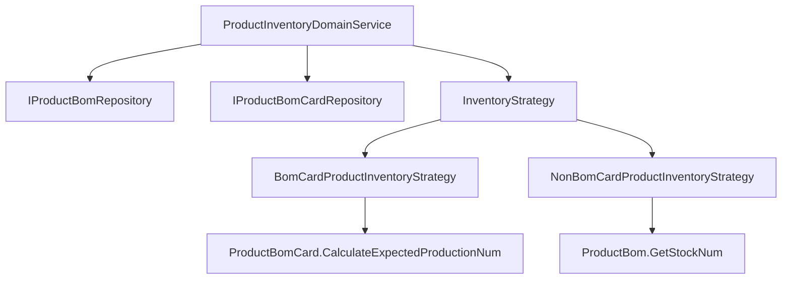

# 仓库模块商品库存查询功能 设计文档

> 本文档定义 仓库模块商品库存查询功能 的技术设计和实现方案。

## 📋 概述

本功能在库存模块（`main/app/modules/inventory/`）中新增商品库存查询领域服务，使用 DDD 设计原则和策略模式，统一处理有成本卡和无成本卡商品的库存计算逻辑。

**核心设计**：
- **领域服务**: `ProductInventoryDomainService` - 统一库存查询入口
- **策略模式**: `BomCardProductInventoryStrategy` / `NonBomCardProductInventoryStrategy` - 区分商品类型
- **复用现有逻辑**: 利用 `ProductBomCard.CalculateExpectedProductionNum()` 计算成本卡库存

---

## 🎯 规范对齐

### Go Main 规范 (go-main.mdc)

- ✅ **DDD 分层**: 在 `domain/service/` 下创建领域服务
- ✅ **接口命名**: 接口以 `I` 开头，实现以 `Impl` 结尾
- ✅ **依赖管理**: Service 只依赖 Repository 接口，不依赖 Infrastructure
- ✅ **错误处理**: 不使用 panic，返回 error，使用 `errors.WithMessage` 包装
- ✅ **Context 使用**: 使用自定义 `pkg/context.Context`，不使用标准库 `context.Context`

### Go Modules 规范 (go-modules.mdc)

- ✅ **Context 约束**: 所有方法使用 `pkg/context.Context`
- ✅ **Repository 接口**: 在 `domain/repository/` 定义
- ✅ **领域服务**: 在 `domain/service/` 实现

### API 设计规范 (api.mdc)

- ⚠️ **暂不提供 HTTP API**: 本功能先实现领域服务，后续可按需提供 API
- ✅ **如后续提供 API**: URL 使用 snake_case，data 字段必须是对象

### 数据库规范 (database.mdc)

- ✅ **不涉及新增表**: 使用现有表结构
- ✅ **使用现有字段**: `ttpos_product_bom` 表的 `use_bom_card_stock`, `is_sold_out`, `sellable_quantity`, `product_bom_card_uuid`

---

## 🔄 代码复用分析

### 可复用的现有组件

- **ProductBomCard.CalculateExpectedProductionNum()**: `main/app/model/product.go:902` - 成本卡材料用量计算逻辑
- **RelatedMaterial.GetExpectedProductionNum()**: `main/app/model/product.go:638` - 单个材料预计可生产数量
- **ProductBom.HasProductBomCard()**: `main/app/model/product.go:579` - 判断是否有成本卡
- **ProductBom.GetStockNum()**: `main/app/model/product.go:583` - 现有库存计算逻辑（需扩展）
- **常量定义**: `main/app/constant/product.go` - `ProductBomInfiniteStock = 999999`

### 集成点

- **ProductBom 模型**: 查询商品 BOM 信息
- **ProductBomCard 模型**: 查询成本卡信息
- **RelatedMaterial 模型**: 查询成本卡关联的材料
- **Material 模型**: 查询材料库存（通过 `Material.GetStockNum()`）

---

## 🏗️ 架构设计

### 分层设计原则

**DDD 四层架构**:

```
Application Layer (应用层)
  ↓ 依赖
Domain Layer (领域层)
  ├── Entity (实体)
  ├── ValueObject (值对象)
  ├── Repository (仓储接口)
  └── Service (领域服务) ← 本功能在此层
  ↓ 依赖
Infrastructure Layer (基础设施层)
  └── Repository Implementation (仓储实现)
```

**依赖规则**:
- ✅ 领域服务只依赖 Repository 接口
- ✅ 领域服务不依赖 Infrastructure
- ✅ 使用策略模式封装不同商品类型的库存计算逻辑

### 架构图



### 模块划分

#### Domain Layer（领域层）

- **领域服务**: `main/app/modules/inventory/domain/service/product_inventory_domain_service.go`
- **策略接口**: `main/app/modules/inventory/domain/service/inventory_strategy.go`
- **策略实现**: 
  - `main/app/modules/inventory/domain/service/bom_card_product_inventory_strategy.go`
  - `main/app/modules/inventory/domain/service/non_bom_card_product_inventory_strategy.go`
- **Repository 接口**: `main/app/modules/inventory/domain/repository/product_bom_repository.go`（新增）

---

## 🗄️ 数据库设计

### 数据表设计

**不涉及新增表，使用现有表结构**：

#### 表 1: ttpos_product_bom（商品 BOM 表）

**使用字段**：
| 字段 | 类型 | 说明 | 用途 |
|------|------|------|------|
| uuid | bigint unsigned | 商品 BOM UUID | 查询商品 |
| product_bom_card_uuid | bigint unsigned | 成本卡ID | 判断是否有成本卡 |
| use_bom_card_stock | tinyint(1) | 是否使用成本卡库存 | 判断成本卡控制开关 |
| is_sold_out | tinyint(1) | 是否沽清 | 判断售罄状态 |
| sellable_quantity | decimal(22,4) | 可售数量 | 返回可售量 |
| stock_num | decimal(12,4) | 库存数量 | 无成本卡商品库存 |

#### 表 2: ttpos_product_bom_card（成本卡表）

**使用字段**：
| 字段 | 类型 | 说明 | 用途 |
|------|------|------|------|
| uuid | bigint unsigned | 成本卡UUID | 查询成本卡 |
| related_materials | 关联表 | 关联材料 | 计算材料用量 |

#### 表 3: ttpos_related_material（关联材料表）

**使用字段**：
| 字段 | 类型 | 说明 | 用途 |
|------|------|------|------|
| related_uuid | bigint unsigned | 成本卡ID | 查询成本卡关联的材料 |
| material_uuid | bigint unsigned | 材料ID | 查询材料库存 |
| num | decimal(12,4) | 材料用量 | 计算可用库存 |
| base_unit_conversion_rate | decimal(12,4) | 基准单位转换率 | 计算基准单位用量 |

---

## 📊 数据模型

### Domain Repository 接口

```go
// main/app/modules/inventory/domain/repository/product_bom_repository.go
package repository

import (
    "ttpos-server-go/app/modules/inventory/domain/entity"
    "ttpos-server-go/pkg/context"
)

// IProductBomRepository 商品BOM仓储接口
type IProductBomRepository interface {
    // FindByUuid 根据UUID查找商品BOM
    FindByUuid(ctx context.Context, uuid uint64) (*entity.ProductBom, error)
    
    // FindByProductPackageUuid 根据商品包UUID查找BOM列表
    FindByProductPackageUuid(ctx context.Context, productPackageUuid uint64) ([]*entity.ProductBom, error)
}
```

**注意**: 由于现有代码使用 Model 层（`main/app/model/product.go`），我们需要：
1. 创建 Repository 接口（领域层）
2. 在 Infrastructure 层实现，适配现有 Model
3. 或者直接使用现有 Model，通过 Adapter 模式适配

**推荐方案**: 创建 Repository 接口，在 Infrastructure 层实现时直接使用现有 Model，避免重复定义 Entity。

### Domain Service 接口

```go
// main/app/modules/inventory/domain/service/product_inventory_domain_service.go
package service

import (
    "ttpos-server-go/pkg/context"
)

// IProductInventoryDomainService 商品库存领域服务接口
type IProductInventoryDomainService interface {
    // GetProductInventory 获取商品库存
    // productBomUuid: 商品BOM的UUID
    // 返回: 库存数量（float64），无限库存返回 999999
    GetProductInventory(ctx context.Context, productBomUuid uint64) (float64, error)
}
```

### Strategy 接口

```go
// main/app/modules/inventory/domain/service/inventory_strategy.go
package service

import (
    "ttpos-server-go/pkg/context"
)

// IInventoryStrategy 库存计算策略接口
type IInventoryStrategy interface {
    // CalculateInventory 计算库存
    // productBom: 商品BOM（使用现有 Model）
    // 返回: 库存数量（float64），无限库存返回 999999
    CalculateInventory(ctx context.Context, productBom interface{}) (float64, error)
}
```

---

## 🔌 API 设计

### 暂不提供 HTTP API

本功能先实现领域服务，供其他模块内部调用。后续如需提供 HTTP API，可按以下设计：

#### API 1: 查询商品库存

**请求**:
- **URL**: `/api/v1/product/inventory`
- **Method**: `POST`
- **Body**:
  ```json
  {
    "product_bom_uuid": 123456
  }
  ```

**响应**:
```json
{
  "code": 1,
  "message": "success",
  "data": {
    "inventory": 100.0
  }
}
```

**错误响应**:
```json
{
  "code": 0,
  "message": "商品不存在",
  "data": {}
}
```

---

## 🧩 组件和接口

### Domain Service 层

#### Service 接口

```go
// main/app/modules/inventory/domain/service/product_inventory_domain_service.go
package service

import (
    "ttpos-server-go/app/errors"
    "ttpos-server-go/app/modules/inventory/domain/repository"
    "ttpos-server-go/pkg/context"
)

// IProductInventoryDomainService 商品库存领域服务接口
type IProductInventoryDomainService interface {
    // GetProductInventory 获取商品库存
    GetProductInventory(ctx context.Context, productBomUuid uint64) (float64, error)
}

// productInventoryDomainService 商品库存领域服务实现
type productInventoryDomainService struct {
    productBomRepo repository.IProductBomRepository
    strategies     map[string]IInventoryStrategy
}

// NewProductInventoryDomainService 创建商品库存领域服务
func NewProductInventoryDomainService(
    productBomRepo repository.IProductBomRepository,
) IProductInventoryDomainService {
    strategies := make(map[string]IInventoryStrategy)
    strategies["bom_card"] = NewBomCardProductInventoryStrategy(productBomRepo)
    strategies["non_bom_card"] = NewNonBomCardProductInventoryStrategy()
    
    return &productInventoryDomainService{
        productBomRepo: productBomRepo,
        strategies:     strategies,
    }
}

// GetProductInventory 获取商品库存
func (s *productInventoryDomainService) GetProductInventory(
    ctx context.Context,
    productBomUuid uint64,
) (float64, error) {
    // 1. 查询商品BOM
    productBom, err := s.productBomRepo.FindByUuid(ctx, productBomUuid)
    if err != nil {
        return 0, errors.WithMessage(err, "查询商品BOM失败")
    }
    if productBom == nil {
        return 0, errors.New("商品不存在")
    }
    
    // 2. 判断商品类型，选择策略
    var strategy IInventoryStrategy
    if productBom.HasProductBomCard() {
        strategy = s.strategies["bom_card"]
    } else {
        strategy = s.strategies["non_bom_card"]
    }
    
    // 3. 计算库存
    inventory, err := strategy.CalculateInventory(ctx, productBom)
    if err != nil {
        return 0, errors.WithMessage(err, "计算库存失败")
    }
    
    return inventory, nil
}
```

#### Strategy 实现

```go
// main/app/modules/inventory/domain/service/bom_card_product_inventory_strategy.go
package service

import (
    "math"
    "ttpos-server-go/app/constant"
    "ttpos-server-go/app/modules/inventory/domain/repository"
    "ttpos-server-go/pkg/context"
)

// bomCardProductInventoryStrategy 有成本卡商品库存计算策略
type bomCardProductInventoryStrategy struct {
    productBomRepo repository.IProductBomRepository
}

// NewBomCardProductInventoryStrategy 创建有成本卡商品库存计算策略
func NewBomCardProductInventoryStrategy(
    productBomRepo repository.IProductBomRepository,
) IInventoryStrategy {
    return &bomCardProductInventoryStrategy{
        productBomRepo: productBomRepo,
    }
}

// CalculateInventory 计算有成本卡商品的库存
func (s *bomCardProductInventoryStrategy) CalculateInventory(
    ctx context.Context,
    productBom interface{},
) (float64, error) {
    // 类型断言（使用现有 Model）
    bom := productBom.(*model.ProductBom)
    
    // 1. 判断是否开启成本卡控制
    if bom.UseBomCardStock == constant.Yes {
        // 2. 根据成本卡计算材料用量得到库存
        if bom.ProductBomCard == nil {
            return 0, errors.New("成本卡不存在")
        }
        
        // 使用现有的 CalculateExpectedProductionNum 方法
        inventory := bom.ProductBomCard.CalculateExpectedProductionNum()
        return math.Max(0, inventory), nil
    }
    
    // 3. 成本卡控制未开启，执行无成本卡商品的逻辑
    return s.calculateNonBomCardInventory(bom)
}

// calculateNonBomCardInventory 计算无成本卡商品的库存（内部方法）
func (s *bomCardProductInventoryStrategy) calculateNonBomCardInventory(
    bom *model.ProductBom,
) (float64, error) {
    // 判断是否标记售罄
    if bom.IsSoldOut == constant.ProductStatusSaleOut {
        return 0, nil
    }
    
    // 判断是否设置可售量
    if bom.SellableQuantity > 0 {
        return bom.SellableQuantity, nil
    }
    
    // 返回无限库存
    return constant.ProductBomInfiniteStock, nil
}
```

```go
// main/app/modules/inventory/domain/service/non_bom_card_product_inventory_strategy.go
package service

import (
    "ttpos-server-go/app/constant"
    "ttpos-server-go/pkg/context"
)

// nonBomCardProductInventoryStrategy 无成本卡商品库存计算策略
type nonBomCardProductInventoryStrategy struct{}

// NewNonBomCardProductInventoryStrategy 创建无成本卡商品库存计算策略
func NewNonBomCardProductInventoryStrategy() IInventoryStrategy {
    return &nonBomCardProductInventoryStrategy{}
}

// CalculateInventory 计算无成本卡商品的库存
func (s *nonBomCardProductInventoryStrategy) CalculateInventory(
    ctx context.Context,
    productBom interface{},
) (float64, error) {
    // 类型断言（使用现有 Model）
    bom := productBom.(*model.ProductBom)
    
    // 1. 判断是否标记售罄
    if bom.IsSoldOut == constant.ProductStatusSaleOut {
        return 0, nil
    }
    
    // 2. 判断是否设置可售量
    if bom.SellableQuantity > 0 {
        return bom.SellableQuantity, nil
    }
    
    // 3. 返回无限库存
    return constant.ProductBomInfiniteStock, nil
}
```

### Repository 层（Infrastructure）

由于现有代码使用 Model 层，Repository 实现需要适配现有 Model：

```go
// main/app/modules/inventory/infrastructure/persistence/product_bom_repository_impl.go
package persistence

import (
    "ttpos-server-go/app/model"
    "ttpos-server-go/app/modules/inventory/domain/repository"
    "ttpos-server-go/pkg/context"
    "gorm.io/gorm"
)

// productBomRepositoryImpl 商品BOM仓储实现
type productBomRepositoryImpl struct {
    db *gorm.DB
}

// NewProductBomRepository 创建商品BOM仓储
func NewProductBomRepository(db *gorm.DB) repository.IProductBomRepository {
    return &productBomRepositoryImpl{db: db}
}

// FindByUuid 根据UUID查找商品BOM
func (r *productBomRepositoryImpl) FindByUuid(
    ctx context.Context,
    uuid uint64,
) (*model.ProductBom, error) {
    var bom model.ProductBom
    
    db := ctx.GetDB()
    err := db.Where("uuid = ? AND delete_time = 0", uuid).
        Preload("ProductBomCard.RelatedMaterials.Material").
        First(&bom).Error
    
    if err == gorm.ErrRecordNotFound {
        return nil, nil
    }
    if err != nil {
        return nil, err
    }
    
    return &bom, nil
}
```

---

## ⚡ 缓存设计

### Redis 缓存

**缓存策略**:
- **Key 命名**: `ttpos:inventory:product:{product_bom_uuid}`
- **过期时间**: 5 分钟（库存数据变化频繁）
- **更新策略**: Cache-Aside Pattern

**示例**:
```go
// 缓存读取
key := fmt.Sprintf("ttpos:inventory:product:%d", productBomUuid)
cached, err := redis.Get(ctx, key)
if err == nil {
    var inventory float64
    if err := json.Unmarshal([]byte(cached), &inventory); err == nil {
        return inventory, nil
    }
}

// 缓存未命中，查询数据库
inventory, err := s.domainService.GetProductInventory(ctx, productBomUuid)
if err != nil {
    return 0, err
}

// 写入缓存
inventoryBytes, _ := json.Marshal(inventory)
redis.Set(ctx, key, string(inventoryBytes), 5*time.Minute)
return inventory, nil
```

---

## 🚨 错误处理

### 错误场景

#### 场景 1: 商品不存在

- **处理方式**: 返回明确的错误信息
- **用户影响**: 返回错误提示"商品不存在"
- **代码示例**:
  ```go
  if productBom == nil {
      return 0, errors.New("商品不存在")
  }
  ```

#### 场景 2: 成本卡不存在（有成本卡商品但成本卡被删除）

- **处理方式**: 返回错误，记录日志
- **用户影响**: 返回错误提示"成本卡不存在"
- **代码示例**:
  ```go
  if bom.ProductBomCard == nil {
      logger.Logger.Error("成本卡不存在", zap.Uint64("product_bom_uuid", productBomUuid))
      return 0, errors.New("成本卡不存在")
  }
  ```

#### 场景 3: 材料库存查询失败

- **处理方式**: 返回错误，记录日志
- **用户影响**: 返回错误提示"查询材料库存失败"
- **代码示例**:
  ```go
  if err != nil {
      logger.Logger.Error("查询材料库存失败", zap.Error(err))
      return 0, errors.WithMessage(err, "查询材料库存失败")
  }
  ```

---

## 🔒 安全设计

### 身份验证

- ⚠️ **领域服务层**: 不涉及身份验证（由调用方处理）
- ✅ **如提供 HTTP API**: 需要 JWT Token 验证

### 数据安全

- ✅ **参数校验**: 商品UUID必须为正整数
- ✅ **SQL 注入防护**: 使用参数化查询（GORM）
- ✅ **数据权限**: 由调用方控制（如：只能查询本店铺的商品）

---

## 🧪 测试策略

### 单元测试

**目标覆盖率**:
- Domain Service: 90%+
- Strategy: 100%（核心业务逻辑）

**测试内容**:
- 有成本卡商品：成本卡控制开启/未开启的各种场景
- 无成本卡商品：售罄/可售量/无限库存场景
- 边界情况：商品不存在、成本卡不存在、材料库存为0

**示例**:
```go
// main/app/modules/inventory/domain/service/product_inventory_domain_service_test.go
func TestProductInventoryDomainService_GetProductInventory_WithBomCard_Enabled(t *testing.T) {
    // 测试有成本卡商品，成本卡控制开启的场景
}

func TestProductInventoryDomainService_GetProductInventory_WithBomCard_Disabled(t *testing.T) {
    // 测试有成本卡商品，成本卡控制未开启的场景
}

func TestProductInventoryDomainService_GetProductInventory_WithoutBomCard(t *testing.T) {
    // 测试无成本卡商品的场景
}
```

### 集成测试

**测试流程**:
- 端到端库存查询流程
- 数据库事务一致性
- 缓存一致性

---

## 📈 性能优化

### 优化策略

1. **数据库优化**:
   - 使用 Preload 预加载关联数据（成本卡、材料）
   - 添加索引：`product_bom_card_uuid`, `uuid`

2. **缓存优化**:
   - Redis 缓存库存计算结果
   - 缓存过期时间：5 分钟
   - 缓存穿透防护：缓存空值

3. **并发控制**:
   - 使用 UUID 锁防止并发冲突（如需要）

### 性能指标

- 本地响应时间: < 200ms
- 数据库查询: < 50ms
- 缓存命中率: > 80%

---

## 📚 实现清单

### Phase 1: Domain Layer（领域层）

- [ ] 创建 Repository 接口
- [ ] 创建 Domain Service 接口
- [ ] 创建 Strategy 接口
- [ ] 实现 BomCardProductInventoryStrategy
- [ ] 实现 NonBomCardProductInventoryStrategy
- [ ] 实现 ProductInventoryDomainService

### Phase 2: Infrastructure Layer（基础设施层）

- [ ] 实现 ProductBomRepository（适配现有 Model）

### Phase 3: 测试

- [ ] Domain Service 单元测试
- [ ] Strategy 单元测试（100%覆盖率）
- [ ] 集成测试

### Phase 4: 优化

- [ ] 实现 Redis 缓存
- [ ] 性能优化
- [ ] 文档更新

**详细任务**: 参见 `tasks.md`

---

## Graphiti & 活动日志

- Related Episode: `[待补充]`
- 模板：`docs/agent/templates/graphiti-episode.md`
- 活动日志：`docs/team/activities/{YYYY-MM}/{YYYY-MM-DD}.md`
- 在技术方案评审、关键架构决策或踩坑总结后，立即补充 Episode 并在设计文档尾部互链。

---

**版本**: v1.0.0  
**创建日期**: 2025-12-10  
**作者**: xiezhihuan  
**审核者**: {审核者}

