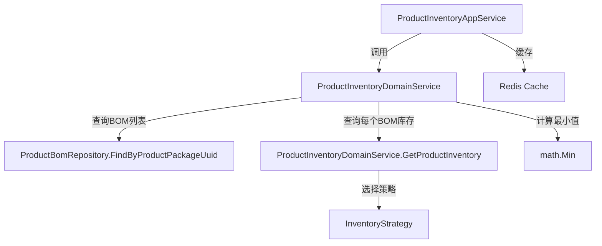

# 仓库模块商品包库存查询功能 设计文档

> 本文档定义 仓库模块商品包库存查询功能 的技术设计和实现方案。

## 📋 概述

本功能在现有的商品BOM库存查询功能基础上，扩展商品包库存查询能力。商品包库存等于该商品包下所有商品BOM库存中的最小值。

**核心设计**：
- **扩展领域服务**: 在 `ProductInventoryDomainService` 中新增 `GetProductPackageInventory` 方法
- **扩展应用服务**: 在 `ProductInventoryAppService` 中新增带缓存的商品包库存查询方法
- **复用现有逻辑**: 通过 `FindByProductPackageUuid` 查询BOM列表，调用现有的 `GetProductInventory` 方法
- **最小值计算**: 遍历所有BOM库存，返回最小值

---

## 🎯 规范对齐

### Go Main 规范 (go-main.mdc)

- ✅ **DDD 分层**: 在 `domain/service/` 和 `application/` 下扩展服务
- ✅ **接口命名**: 接口以 `I` 开头，实现以 `Impl` 结尾
- ✅ **依赖管理**: Service 只依赖 Repository 接口，不依赖 Infrastructure
- ✅ **错误处理**: 不使用 panic，返回 error，使用 `errors.WithMessage` 包装
- ✅ **Context 使用**: 使用自定义 `pkg/context.Context`，不使用标准库 `context.Context`

### Go Modules 规范 (go-modules.mdc)

- ✅ **Context 约束**: 所有方法使用 `pkg/context.Context`
- ✅ **Repository 接口**: 复用现有的 `domain/repository/IProductBomRepository`
- ✅ **领域服务**: 在 `domain/service/` 扩展
- ✅ **应用服务**: 在 `application/` 扩展

### API 设计规范 (api.mdc)

- ⚠️ **暂不提供 HTTP API**: 本功能先实现领域服务和应用服务，供其他模块内部调用
- ✅ **如后续提供 API**: URL 使用 snake_case，data 字段必须是对象

### 数据库规范 (database.mdc)

- ✅ **不涉及新增表**: 使用现有表结构
- ✅ **使用现有字段**: 
  - `ttpos_product_package.uuid` - 商品包UUID
  - `ttpos_product_bom.product_package_uuid` - 商品BOM关联的商品包UUID
  - `ttpos_product_bom.uuid` - 商品BOM UUID

---

## 🔄 代码复用分析

### 可复用的现有组件

- **ProductInventoryDomainService.GetProductInventory()**: `main/app/modules/inventory/domain/service/product_inventory_domain_service.go` - 商品BOM库存查询方法（已实现）
- **ProductInventoryAppService.GetProductInventory()**: `main/app/modules/inventory/application/product_inventory_app_service.go` - 带缓存的商品BOM库存查询方法（已实现）
- **ProductBomRepository.FindByProductPackageUuid()**: `main/app/modules/inventory/infrastructure/persistence/product_bom_repository_impl.go` - 根据商品包UUID查询BOM列表（已实现）
- **ProductBomRepository.FindByUuid()**: `main/app/modules/inventory/infrastructure/persistence/product_bom_repository_impl.go` - 根据UUID查询BOM（已实现）
- **ProductPackage 模型**: `main/app/model/product.go` - 商品包模型
- **ProductBom 模型**: `main/app/model/product.go` - 商品BOM模型

### 集成点

- **ProductInventoryDomainService**: 扩展领域服务接口，新增商品包库存查询方法
- **ProductInventoryAppService**: 扩展应用服务，新增带缓存的商品包库存查询方法
- **ProductBomRepository**: 复用现有的 `FindByProductPackageUuid` 方法查询商品包下所有BOM

---

## 🏗️ 架构设计

### 分层设计原则

**DDD 四层架构**:

```
Application Layer (应用层)
  ├── ProductInventoryAppService.GetProductPackageInventory() ← 新增
  └── ProductInventoryAppService.InvalidateProductPackageInventoryCache() ← 新增
  ↓ 依赖
Domain Layer (领域层)
  └── ProductInventoryDomainService.GetProductPackageInventory() ← 新增
  ↓ 依赖
Infrastructure Layer (基础设施层)
  └── ProductBomRepository.FindByProductPackageUuid() ← 已存在
```

**依赖规则**:
- ✅ 应用服务依赖领域服务接口
- ✅ 领域服务只依赖 Repository 接口
- ✅ 复用现有的商品BOM库存查询逻辑

### 架构图



### 模块划分

#### Domain Layer（领域层）

- **领域服务扩展**: `main/app/modules/inventory/domain/service/product_inventory_domain_service.go`
  - 新增 `GetProductPackageInventory` 方法

#### Application Layer（应用层）

- **应用服务扩展**: `main/app/modules/inventory/application/product_inventory_app_service.go`
  - 新增 `GetProductPackageInventory` 方法（带缓存）
  - 新增 `InvalidateProductPackageInventoryCache` 方法

#### Infrastructure Layer（基础设施层）

- **Repository**: `main/app/modules/inventory/infrastructure/persistence/product_bom_repository_impl.go`
  - 复用现有的 `FindByProductPackageUuid` 方法

---

## 🗄️ 数据库设计

### 数据表设计

**不涉及新增表，使用现有表结构**：

#### 表 1: ttpos_product_package（商品包表）

**使用字段**：
| 字段 | 类型 | 说明 | 用途 |
|------|------|------|------|
| uuid | bigint unsigned | 商品包UUID | 查询商品包 |

#### 表 2: ttpos_product_bom（商品 BOM 表）

**使用字段**：
| 字段 | 类型 | 说明 | 用途 |
|------|------|------|------|
| uuid | bigint unsigned | 商品 BOM UUID | 查询商品BOM |
| product_package_uuid | bigint unsigned | 商品包UUID | 关联商品包 |

**索引**：
- `idx_product_package_uuid` - 用于快速查询商品包下的所有BOM

---

## 📊 数据模型

### Domain Service 接口扩展

```go
// main/app/modules/inventory/domain/service/product_inventory_domain_service.go
package service

import (
    "ttpos-server-go/pkg/context"
)

// IProductInventoryDomainService 商品库存领域服务接口
type IProductInventoryDomainService interface {
    // GetProductInventory 获取商品库存
    GetProductInventory(ctx context.Context, productBomUuid uint64) (float64, error)
    
    // GetProductPackageInventory 获取商品包库存
    // productPackageUuid: 商品包UUID
    // 返回: 库存数量（float64），等于该商品包下所有BOM库存的最小值
    GetProductPackageInventory(ctx context.Context, productPackageUuid uint64) (float64, error)
}
```

### Application Service 接口扩展

```go
// main/app/modules/inventory/application/product_inventory_app_service.go
package inventory

import (
    "ttpos-server-go/pkg/context"
)

// ProductInventoryAppService 商品库存应用服务（带缓存）
type ProductInventoryAppService struct {
    domainService domainService.IProductInventoryDomainService
    cache         cache.Cache
    dbm           *database.DBManager
}

// GetProductPackageInventory 获取商品包库存（带缓存）
func (s *ProductInventoryAppService) GetProductPackageInventory(
    ctx context.Context,
    productPackageUuid uint64,
) (float64, error) {
    // 1. 尝试从缓存获取
    // 2. 缓存未命中，调用领域服务计算
    // 3. 写入缓存
    // 4. 返回结果
}

// InvalidateProductPackageInventoryCache 使商品包库存缓存失效
func (s *ProductInventoryAppService) InvalidateProductPackageInventoryCache(
    ctx context.Context,
    productPackageUuid uint64,
) error {
    // 删除缓存
}
```

---

## 🔌 API 设计

### 暂不提供 HTTP API

本功能先实现领域服务和应用服务，供其他模块内部调用。后续如需提供 HTTP API，可按以下设计：

#### API 1: 查询商品包库存

**请求**:
- **URL**: `/api/v1/product_package/inventory`
- **Method**: `POST`
- **Body**:
  ```json
  {
    "product_package_uuid": 123456
  }
  ```

**响应**:
```json
{
  "code": 1,
  "message": "success",
  "data": {
    "inventory": 50.0
  }
}
```

**错误响应**:
```json
{
  "code": 0,
  "message": "商品包不存在",
  "data": {}
}
```

---

## 🧩 组件和接口

### Domain Service 层扩展

#### Service 实现

```go
// main/app/modules/inventory/domain/service/product_inventory_domain_service.go
package service

import (
    "math"
    "ttpos-server-go/app/errors"
    "ttpos-server-go/app/modules/inventory/domain/repository"
    "ttpos-server-go/pkg/context"
)

// GetProductPackageInventory 获取商品包库存
func (s *productInventoryDomainService) GetProductPackageInventory(
    ctx context.Context,
    productPackageUuid uint64,
) (float64, error) {
    // 1. 查询商品包下所有BOM
    productBomInterfaces, err := s.productBomRepo.FindByProductPackageUuid(ctx, productPackageUuid)
    if err != nil {
        return 0, errors.WithMessage(err, "查询商品包BOM列表失败")
    }
    
    if len(productBomInterfaces) == 0 {
        return 0, errors.New("商品包下没有BOM")
    }
    
    // 2. 遍历每个BOM，计算库存
    var minInventory float64 = math.MaxFloat64
    var hasValidInventory bool
    
    for _, bomInterface := range productBomInterfaces {
        productBom, ok := bomInterface.(*model.ProductBom)
        if !ok {
            // 记录错误但继续处理其他BOM
            continue
        }
        
        inventory, err := s.GetProductInventory(ctx, productBom.Uuid)
        if err != nil {
            // 记录错误但继续处理其他BOM
            continue
        }
        
        if inventory < minInventory {
            minInventory = inventory
            hasValidInventory = true
        }
    }
    
    // 3. 如果没有有效的库存，返回错误
    if !hasValidInventory {
        return 0, errors.New("无法计算商品包库存：所有BOM库存查询失败")
    }
    
    return minInventory, nil
}
```

### Application Service 层扩展

#### Service 实现

```go
// main/app/modules/inventory/application/product_inventory_app_service.go
package inventory

import (
    "encoding/json"
    "fmt"
    "time"
    domainService "ttpos-server-go/app/modules/inventory/domain/service"
    "ttpos-server-go/pkg/cache"
    "ttpos-server-go/pkg/context"
    "ttpos-server-go/pkg/database"
)

const (
    // ProductPackageInventoryCacheKeyPrefix 商品包库存缓存键前缀
    ProductPackageInventoryCacheKeyPrefix = "product_package_inventory:%d:%d" // company_uuid:product_package_uuid
    // ProductPackageInventoryCacheTTL 商品包库存缓存过期时间（5分钟）
    ProductPackageInventoryCacheTTL = 5 * time.Minute
)

// GetProductPackageInventory 获取商品包库存（带缓存）
func (s *ProductInventoryAppService) GetProductPackageInventory(
    ctx context.Context,
    productPackageUuid uint64,
) (float64, error) {
    companyUuid := ctx.GetCompanyUuid()
    cacheKey := fmt.Sprintf(ProductPackageInventoryCacheKeyPrefix, companyUuid, productPackageUuid)
    
    // 1. 尝试从缓存获取
    if cached, exists := s.cache.Get(cacheKey); exists {
        if cachedStr, ok := cached.(string); ok {
            var inventory float64
            if err := json.Unmarshal([]byte(cachedStr), &inventory); err == nil {
                return inventory, nil
            }
        }
    }
    
    // 2. 从领域服务获取
    inventory, err := s.domainService.GetProductPackageInventory(ctx, productPackageUuid)
    if err != nil {
        return 0, err
    }
    
    // 3. 写入缓存
    inventoryBytes, _ := json.Marshal(inventory)
    s.cache.Set(cacheKey, string(inventoryBytes), ProductPackageInventoryCacheTTL)
    
    return inventory, nil
}

// InvalidateProductPackageInventoryCache 使商品包库存缓存失效
func (s *ProductInventoryAppService) InvalidateProductPackageInventoryCache(
    ctx context.Context,
    productPackageUuid uint64,
) error {
    companyUuid := ctx.GetCompanyUuid()
    cacheKey := fmt.Sprintf(ProductPackageInventoryCacheKeyPrefix, companyUuid, productPackageUuid)
    s.cache.Del(cacheKey)
    return nil
}
```

---

## ⚡ 缓存设计

### Redis 缓存

**缓存策略**:

- **Key 命名**: `product_package_inventory:{company_uuid}:{product_package_uuid}`
- **过期时间**: 5分钟（与BOM库存缓存保持一致）
- **更新策略**: Cache-Aside Pattern
- **失效策略**: 在BOM库存更新时，同步失效对应商品包的缓存

**缓存流程**:

1. **读取**: 优先从缓存读取，缓存未命中时调用领域服务计算
2. **写入**: 计算完成后写入缓存
3. **失效**: 在BOM库存更新时，调用 `InvalidateProductPackageInventoryCache` 失效缓存

---

## 🚨 错误处理

### 错误场景

#### 场景 1: 商品包不存在

- **处理方式**: 返回明确的错误信息
- **用户影响**: 提示"商品包不存在"
- **代码示例**:
  ```go
  if productPackage == nil {
      return 0, errors.New("商品包不存在")
  }
  ```

#### 场景 2: 商品包下没有BOM

- **处理方式**: 返回0或抛出错误（需明确业务规则）
- **用户影响**: 提示"商品包下没有BOM"
- **代码示例**:
  ```go
  if len(productBoms) == 0 {
      return 0, errors.New("商品包下没有BOM")
  }
  ```

#### 场景 3: 部分BOM库存查询失败

- **处理方式**: 记录错误日志，继续计算其他BOM的库存
- **用户影响**: 如果所有BOM查询失败，返回错误；否则返回有效BOM的最小值
- **代码示例**:
  ```go
  inventory, err := s.GetProductInventory(ctx, productBom.Uuid)
  if err != nil {
      // 记录错误但继续处理其他BOM
      logger.Logger.Warn("查询BOM库存失败", zap.Uint64("bom_uuid", productBom.Uuid), zap.Error(err))
      continue
  }
  ```

#### 场景 4: 所有BOM库存查询失败

- **处理方式**: 返回错误
- **用户影响**: 提示"无法计算商品包库存：所有BOM库存查询失败"
- **代码示例**:
  ```go
  if !hasValidInventory {
      return 0, errors.New("无法计算商品包库存：所有BOM库存查询失败")
  }
  ```

---

## 🔒 安全设计

### 身份验证

- **Context 验证**: 使用 `ctx.GetCompanyUuid()` 获取公司UUID，确保多租户隔离
- **缓存隔离**: 缓存键包含公司UUID，确保不同公司的数据隔离

### 数据安全

- **参数校验**: 商品包UUID必须为正整数
- **SQL 注入防护**: 使用参数化查询（GORM 自动处理）

---

## 🧪 测试策略

### 单元测试

**目标覆盖率**:

- Domain Service: 90%+
- Application Service: 80%+
- **商品包库存计算逻辑: 100%**（高风险业务逻辑）

**测试内容**:

- 商品包下多个BOM的库存计算
- 商品包下单个BOM的库存计算
- 商品包下没有BOM的边界情况
- 部分BOM查询失败的场景
- 所有BOM查询失败的场景
- 缓存机制测试

**示例**:

```go
// main/app/modules/inventory/domain/service/product_inventory_domain_service_test.go
func TestProductInventoryDomainService_GetProductPackageInventory(t *testing.T) {
    // 测试多个BOM的最小值计算
    // 测试单个BOM的库存计算
    // 测试没有BOM的边界情况
    // 测试部分BOM查询失败
}
```

### 集成测试

**测试流程**:

- 端到端业务流程
- 缓存读写和失效
- 并发查询场景

---

## 📈 性能优化

### 优化策略

1. **批量查询优化**:
   - 使用 `FindByProductPackageUuid` 批量查询BOM，减少数据库查询次数
   - 使用索引 `idx_product_package_uuid` 优化查询性能

2. **缓存优化**:
   - Redis 缓存商品包库存计算结果，减少重复计算
   - 缓存过期时间：5分钟
   - 缓存失效：在BOM库存更新时，同步失效对应商品包的缓存

3. **并发控制**:
   - 使用 UUID 锁防止并发冲突（如需要）

### 性能指标

- 本地响应时间: < 200ms
- 数据库查询: < 50ms（批量查询BOM）
- 缓存命中率: > 80%
- 并发能力: 1000+ QPS

---

## 📚 实现清单

### Phase 1: Domain Layer（领域层）

- [ ] 扩展 `IProductInventoryDomainService` 接口，新增 `GetProductPackageInventory` 方法
- [ ] 实现 `GetProductPackageInventory` 方法，实现最小值计算逻辑

### Phase 2: Application Layer（应用层）

- [ ] 扩展 `ProductInventoryAppService`，新增 `GetProductPackageInventory` 方法（带缓存）
- [ ] 实现 `InvalidateProductPackageInventoryCache` 方法

### Phase 3: 测试

- [ ] 编写 Domain Service 单元测试
- [ ] 编写 Application Service 单元测试
- [ ] 编写集成测试

### Phase 4: 优化

- [ ] 性能优化
- [ ] 缓存优化
- [ ] 错误处理优化

**详细任务**: 参见 `tasks.md`

---

## Graphiti & 活动日志

- Related Episode: `[待补充]`
- 模板：`docs/agent/templates/graphiti-episode.md`
- 活动日志：`docs/team/activities/{YYYY-MM}/{YYYY-MM-DD}.md`
- 在技术方案评审、关键架构决策或踩坑总结后，立即补充 Episode 并在设计文档尾部互链。

---

**版本**: v1.0.0  
**创建日期**: 2025-12-11  
**作者**: xiezhihuan  
**审核者**: {审核者}

