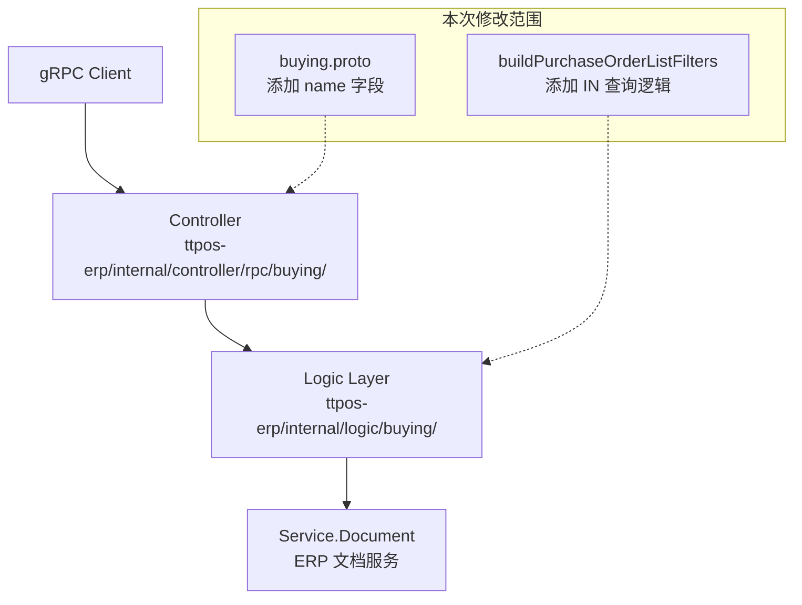

# task-all-purchase-order-multi-name-query 技术设计

## 📋 概述

| 项目 | 内容 |
|------|------|
| Spec ID | task-all-purchase-order-multi-name-query |
| 设计人 | rikugun |
| 设计日期 | 2026-01-29 |
| 总 SP | 1 |

## 🔄 代码复用分析

### 可复用代码

| 文件 | 说明 | 复用方式 |
|------|------|---------|
| `ttpos-bmp/app/ttpos-erp/internal/logic/buying/buying.go` | 现有 `buildPurchaseOrderListFilters` 过滤模式 | 扩展 |

### 需要修改

| 文件 | 说明 |
|------|------|
| `ttpos-bmp/app/ttpos-erp/manifest/protobuf/buying/buying.proto` | 添加 `name` 字段到 `GetPurchaseOrderListReq` |
| `ttpos-bmp/app/ttpos-erp/internal/logic/buying/buying.go` | 添加 name IN 查询过滤逻辑 |

### 自动生成（无需手动修改）

| 文件 | 说明 |
|------|------|
| `ttpos-bmp/app/ttpos-erp/api/buying/buying.pb.go` | protobuf 生成的 Go 代码 |
| `ttpos-bmp/app/ttpos-erp/api/buying/buying_grpc.pb.go` | gRPC 服务代码 |

## 🏗️ 架构设计

### 架构图



### 分层说明

- **Proto Layer**: `ttpos-bmp/app/ttpos-erp/manifest/protobuf/buying/` - 接口定义
- **Controller Layer**: `ttpos-bmp/app/ttpos-erp/internal/controller/rpc/buying/` - gRPC Handler
- **Logic Layer**: `ttpos-bmp/app/ttpos-erp/internal/logic/buying/` - 业务逻辑
- **Service Layer**: 调用 `service.Document()` 进行 ERP 文档查询

## 🧩 组件和接口

### Proto 修改: GetPurchaseOrderListReq

**位置**: `ttpos-bmp/app/ttpos-erp/manifest/protobuf/buying/buying.proto`

**变更内容**:
```protobuf
message GetPurchaseOrderListReq {
  string supplier = 1;
  string company_abbr = 2;
  string from_date = 3;
  string to_date = 4;
  int32 page_no = 5;
  int32 page_size = 6;
  string name = 7; // 新增：采购订单名称过滤，支持逗号分隔多个值进行 IN 查询
}
```

### Logic 修改: buildPurchaseOrderListFilters

**位置**: `ttpos-bmp/app/ttpos-erp/internal/logic/buying/buying.go`

**变更内容**:
```go
func (s *sBuying) buildPurchaseOrderListFilters(ctx context.Context, req *buying.GetPurchaseOrderListReq) [][]string {
    filters := make([][]string, 0, 8)

    // 新增：按名称过滤（支持 IN 查询）
    if len(req.Name) > 0 {
        if strings.Contains(req.Name, ",") {
            // 多个值使用 IN 查询
            filters = append(filters, g.ArrayStr{"name", "in", req.Name})
        } else {
            // 单个值使用等值查询
            filters = append(filters, g.ArrayStr{"name", "=", req.Name})
        }
    }

    // ... 现有过滤逻辑保持不变
}
```

## 📊 数据模型

无数据库模型变更。

## 🔌 API 设计

### GetPurchaseOrderList

| 项目 | 内容 |
|------|------|
| Method | gRPC |
| Service | BuyingService |
| RPC | GetPurchaseOrderList |
| 请求 | buying.GetPurchaseOrderListReq |
| 响应 | buying.GetPurchaseOrderListResp |

**新增请求字段**:

| 字段 | 类型 | 说明 |
|------|------|------|
| name | string | 采购订单名称过滤，支持逗号分隔多个值（如 `"PO-001,PO-002,PO-003"`） |

## ⚠️ 风险识别

| 风险 | 影响 | 缓解措施 |
|------|------|---------|
| IN 查询值过多 | 低 | 建议前端限制传入值数量（≤50） |
| 前后端参数格式不一致 | 中 | 文档明确：使用逗号分隔的字符串 |

## 🧪 测试策略

**测试重点**:
1. 单个 name 查询行为不变
2. 多个 name（逗号分隔）正确使用 IN 查询
3. 空 name 不应用过滤条件

**测试命令**:
```bash
cd ttpos-bmp/app/ttpos-erp && go test -v ./internal/logic/buying/...
```

---

**版本**: v1.0.0
**设计日期**: 2026-01-29
