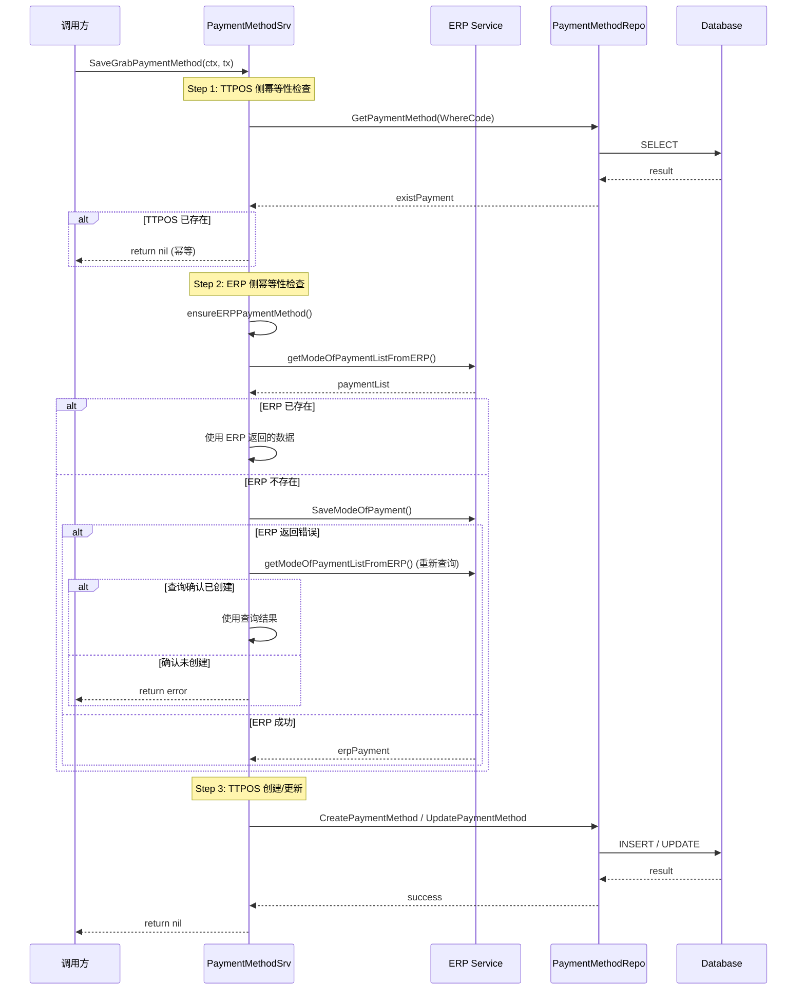

# task-backend-grab-lineman-payment-idempotent 技术设计

## 📋 概述

| 项目 | 内容 |
|------|------|
| Spec ID | task-backend-grab-lineman-payment-idempotent |
| 设计人 | 王昱 |
| 设计日期 | 2026-02-27 |
| 总 SP | 3 |

## 🎯 设计目标

解决 Grab/LINE MAN 支付方式保存时 ERP 和 TTPOS 数据不一致的问题，通过幂等性设计确保：
1. 保存前先查询 ERP 是否已存在，已存在则复用
2. ERP 返回错误时重新查询确认实际状态
3. TTPOS 侧保证不重复创建

## 🔄 代码复用分析

### 可复用代码

| 文件 | 说明 | 复用方式 |
|------|------|---------|
| `main/app/service/payment_method.go` | 现有 PaymentMethodSrv | 扩展现有方法 |
| `main/app/service/rpc/erp/selling.go` | ERP RPC 客户端 | 直接调用 |
| `selling.GetModeOfPayment` | **ERP 已有的单条查询接口** | 直接调用（按 Name 或 PaymentId 查询） |
| `erpService.SaveModeOfPayment` | ERP 创建/更新支付方式 | 直接调用 |
| `paymentMethodRepo` | Repository 数据操作 | 直接调用 |

### ERP 已有接口

```protobuf
// GetModeOfPaymentReq 查询单个支付方式请求
message GetModeOfPaymentReq {
    optional string name = 1;        // 支付方式名称（精确匹配），与 payment_id 二选一
    optional string payment_id = 2;  // 支付方式唯一标识，与 name 二选一
}

// GetModeOfPaymentResp 查询单个支付方式响应
message GetModeOfPaymentResp {
    ModeOfPayment mode_of_payment = 1;  // 支付方式信息
}
```

### 需要新增

| 文件 | 方法 | 说明 |
|------|------|------|
| `main/app/service/rpc/erp/selling.go` | `GetModeOfPaymentByName` | 从 ERP 按名称精确查询支付方式（RPC 层） |
| `main/app/service/rpc/erp/erp.go` | `IErpSrv` 接口 | 添加 `GetModeOfPaymentByName` 方法签名 |
| `main/app/service/payment_method.go` | `buildERPPaymentName` | 构造 ERP 支付方式名称 |
| `main/app/service/payment_method.go` | `getERPPaymentByName` | 封装调用 erpService（Service 层） |
| `main/app/service/payment_method.go` | `ensureERPPaymentMethod` | 确保 ERP 支付方式存在（幂等性封装） |

## 🏗️ 架构设计

### 架构图



### 分层说明

- **Service Layer**: `main/app/service/payment_method.go` - 业务逻辑
- **RPC Layer**: `main/app/service/rpc/erp/` - ERP 远程调用
- **Repository Layer**: `main/app/repository/payment_method.go` - 数据访问
- **Model Layer**: `main/app/model/payment_method.go` - 数据模型

## 🧩 组件和接口

### 新增方法: buildERPPaymentName

**位置**: `main/app/service/payment_method.go`

**功能**: 构造 ERP 支付方式名称

```go
// buildERPPaymentName 构造 ERP 支付方式名称
// 格式：{PayType}-0000-{company_abbr}（系统默认支付方式序号固定为 0000）
func (s *paymentMethodSrv) buildERPPaymentName(payType string, companyAbbr string) string {
    return fmt.Sprintf("%s-0000-%s", payType, companyAbbr)
}
```

### 新增方法: getERPPaymentByName

**位置**: `main/app/service/payment_method.go`

**功能**: 从 ERP 按名称精确查询单个支付方式（调用已有的 `GetModeOfPayment` RPC）

```go
// getERPPaymentByName 从 ERP 按名称精确查询支付方式
// 返回 nil 表示不存在，error 表示查询失败
func (s *paymentMethodSrv) getERPPaymentByName(
    ctx context.Context,
    companySetting *model.CompanySetting,
    paymentName string,
) (*selling.ModeOfPayment, error)
```

### 新增方法: ensureERPPaymentMethod

**位置**: `main/app/service/payment_method.go`

**功能**: 确保 ERP 支付方式存在，实现幂等性

```go
// ensureERPPaymentMethod 确保 ERP 支付方式存在（幂等性封装）
// 如果已存在则返回现有数据，不存在则创建
// 创建失败时重新查询确认状态
func (s *paymentMethodSrv) ensureERPPaymentMethod(
    ctx context.Context,
    payType string,
    source int,
) (*selling.SaveModeOfPaymentResp, error) {
    companySetting := ctx.GetCompanySetting()

    // 1. 构造 ERP 支付方式名称
    erpPaymentName := s.buildERPPaymentName(payType, companySetting.ErpnextCompanyAbbr)

    // 2. 先查询 ERP 是否已存在
    erpPayment, err := s.getERPPaymentByName(ctx, &companySetting, erpPaymentName)
    if err != nil {
        return nil, err
    }

    // 3. 如果已存在，直接返回
    if erpPayment != nil {
        return &selling.SaveModeOfPaymentResp{
            Name:      erpPayment.GetName(),
            PaymentId: erpPayment.GetPaymentId(),
        }, nil
    }

    // 3. 不存在则创建
    erpSrv := erpService.NewIErpSrv(s.dbm)
    channel := erpService.GetChannelBySource(source)
    addedBy := s.getAddedBy(source)

    saveResp, err := erpSrv.SaveModeOfPayment(ctx, req.SaveModeOfPaymentReq{
        CompanyUuid: ctx.GetCompanyUuid(),
        Channel:     channel,
        PayType:     paymentName,
        AddedBy:     &addedBy,
    })

    // 4. 如果创建失败，重新查询确认状态
    if err != nil {
        erpPayment, queryErr := s.getERPPaymentByPayType(ctx, &companySetting, paymentName)
        if queryErr == nil && erpPayment != nil {
            // ERP 实际已创建，返回查询结果
            return &resp.SaveModeOfPaymentResp{
                Name:      erpPayment.Name,
                PaymentId: erpPayment.PaymentId,
            }, nil
        }
        // 确认未创建，返回原始错误
        return nil, err
    }

    return saveResp, nil
}
```

### 修改方法: SaveGrabPaymentMethod

**位置**: `main/app/service/payment_method.go:1182-1263`

**修改点**:
1. ERP 调用前先查询是否已存在
2. 使用 `ensureERPPaymentMethod` 替代直接调用 `SaveModeOfPayment`

### 修改方法: SaveLineManPaymentMethod

**位置**: `main/app/service/payment_method.go:1265-1347`

**修改点**: 同 SaveGrabPaymentMethod

### 修改方法: createPaymentFromERP

**位置**: `main/app/service/payment_method.go:1129-1178`

**修改点**:
1. 创建前检查 TTPOS 是否已存在同名支付方式
2. 已存在时更新而非创建

## 📊 数据模型

### 现有模型: PaymentMethod

**位置**: `main/app/model/payment_method.go`

无需修改数据模型，现有字段足以支持幂等性设计：
- `Code` - 支付方式代码（唯一标识）
- `ErpnextPayment` - ERP 支付方式名称
- `ErpnextPaymentId` - ERP 支付方式 ID

## ⚠️ 风险识别

| 风险 | 影响 | 缓解措施 |
|------|------|---------|
| ERP 查询接口性能 | 中 | getModeOfPaymentListFromERP 已有缓存机制；单次查询列表后过滤 |
| 并发创建竞态条件 | 中 | 现有事务机制 + TTPOS code 唯一约束已处理；ERP 侧需确认幂等性 |
| ERP 查询结果为空但实际已创建 | 低 | 重试机制 + 日志记录便于排查 |

## 🧪 测试策略

### 测试场景

| 场景 | 描述 | 预期结果 |
|------|------|---------|
| ERP 已存在、TTPOS 不存在 | ERP 查询返回已有数据 | 复用 ERP 数据，TTPOS 创建 |
| ERP 已存在、TTPOS 已存在 | 两侧都存在 | 直接返回成功（幂等） |
| ERP 不存在、TTPOS 不存在 | 首次创建 | ERP 创建 → TTPOS 创建 |
| ERP 创建返回错误但实际已创建 | 网络超时等 | 重新查询确认，同步到 TTPOS |
| 并发调用 | 多次同时调用 | 只创建一条记录（幂等） |

### 目标覆盖率

- `main/app/service/payment_method.go`: 80%+

### 测试命令

```bash
cd main && go test -v -run "TestPaymentMethodSrv_(SaveGrab|createPaymentFromERP)" ./app/service/...
cd main && go test -coverprofile=coverage.out ./app/service/...
cd main && go tool cover -html=coverage.out
```

---

**版本**: v1.1.0
**创建日期**: 2026-02-27
**更新日期**: 2026-02-28
