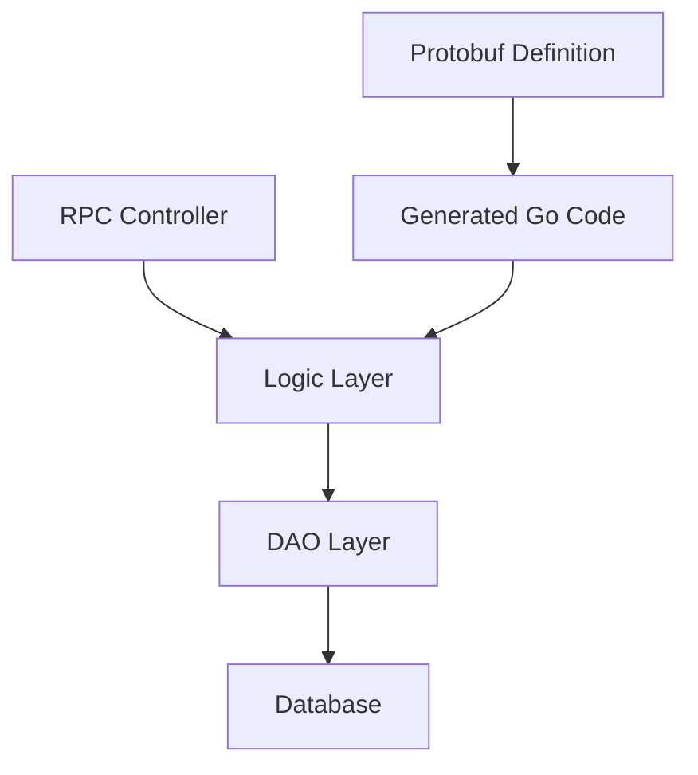

# 调整 GetMenuSnapshotResp.content 为 GetMenuSnapshotResp.menu_data 设计文档

> 本文档定义调整菜单快照响应字段命名的技术设计和实现方案。

## 📋 概述

将 `GetMenuSnapshotResp.content` 字段重命名为 `GetMenuSnapshotResp.menu_data`，使其与 `SaveMenuSnapshotReq.menu_data` 保持一致。这是一个纯字段重命名任务，不涉及业务逻辑变更，主要影响 Protobuf 定义和生成的 Go 代码。

---

## 🎯 规范对齐

### Go BMP 规范 (go-bmp.mdc)

- ✅ 禁止修改 dao/entity/do/ 目录（自动生成）
- ✅ gRPC 服务注册到 Nacos（无需修改）
- ✅ 遵循 GoFrame 项目结构
- ✅ 遵循 Protobuf 开发规范

### Protobuf 规范 (proto-rules.mdc)

- ✅ 字段命名使用 snake_case（`menu_data`）
- ✅ 字段编号保持连续（field number = 2）
- ✅ 字段类型保持不变（string）
- ✅ 注释清晰说明字段用途

### API 设计规范 (api.mdc)

- ✅ 字段命名一致性
- ✅ 响应格式保持不变

---

## 🔄 代码复用分析

### 可复用的现有组件

- **Protobuf 代码生成工具**: 使用项目现有的 protobuf 代码生成流程
- **GoFrame DAO**: 使用现有的 DAO 层访问数据库（无需修改）

### 集成点

- **gRPC 服务**: `MenuService.GetMenuSnapshot` 接口保持不变，仅字段名变更
- **数据库表**: `channel_menu_snapshot` 表结构不变，仅响应字段名变更

---

## 🏗️ 架构设计

### 分层设计原则

**Go BMP 三层架构**:

```
RPC Controller 层 (controller/rpc/)
  ↓ 依赖
Logic 层 (logic/)
  ↓ 依赖
DAO 层 (dao/) - 自动生成，禁止修改
```

### 架构图



### 模块划分

#### Go BMP 模块

- **Protobuf 定义**: `ttpos-bmp/app/ttpos-takeout/manifest/protobuf/menu/menu.proto`
- **生成的 API**: `ttpos-bmp/app/ttpos-takeout/api/menu/menu.pb.go`（自动生成）
- **Logic 层**: `ttpos-bmp/app/ttpos-takeout/internal/logic/channel_menu/channel_menu.go`
- **RPC Controller**: `ttpos-bmp/app/ttpos-takeout/internal/controller/rpc/takeout/takeout.go`

---

## 🗄️ 数据库设计

**无需数据库变更**

本任务仅涉及 Protobuf 字段重命名，不涉及数据库表结构变更。数据库表 `channel_menu_snapshot` 保持不变。

---

## 📊 数据模型

### Protobuf 消息定义

#### 修改前

```protobuf
message GetMenuSnapshotResp {
  string content = 2;          // Provider 侧原始菜单 JSON
  int64 updated_at = 3;        // 快照更新时间
  string sync_state = 4;       // 同步状态  QUEUED/PROCESSING/SUCCESS/FAIL
}
```

#### 修改后

```protobuf
message GetMenuSnapshotResp {
  string menu_data = 2;        // Provider 侧原始菜单 JSON
  int64 updated_at = 3;        // 快照更新时间
  string sync_state = 4;       // 同步状态  QUEUED/PROCESSING/SUCCESS/FAIL
}
```

### 生成的 Go 代码

#### 修改前

```go
type GetMenuSnapshotResp struct {
    Content   string `protobuf:"bytes,2,opt,name=content,json=content,proto3" json:"content,omitempty"`
    UpdatedAt int64  `protobuf:"varint,3,opt,name=updated_at,json=updatedAt,proto3" json:"updated_at,omitempty"`
    SyncState string `protobuf:"bytes,4,opt,name=sync_state,json=syncState,proto3" json:"sync_state,omitempty"`
}

func (x *GetMenuSnapshotResp) GetContent() string {
    if x != nil {
        return x.Content
    }
    return ""
}
```

#### 修改后

```go
type GetMenuSnapshotResp struct {
    MenuData  string `protobuf:"bytes,2,opt,name=menu_data,json=menuData,proto3" json:"menu_data,omitempty"`
    UpdatedAt int64  `protobuf:"varint,3,opt,name=updated_at,json=updatedAt,proto3" json:"updated_at,omitempty"`
    SyncState string `protobuf:"bytes,4,opt,name=sync_state,json=syncState,proto3" json:"sync_state,omitempty"`
}

func (x *GetMenuSnapshotResp) GetMenuData() string {
    if x != nil {
        return x.MenuData
    }
    return ""
}
```

---

## 🔌 API 设计

### gRPC API

#### Protobuf 定义

```protobuf
// ttpos-bmp/app/ttpos-takeout/manifest/protobuf/menu/menu.proto
syntax = "proto3";
package menu;
import "takeout_api.proto";
option go_package = "ttpos-bmp/app/ttpos-takeout/api/menu";

message GetMenuSnapshotReq {
  string provider_name = 1; // 渠道名称: grab,lineman
  string shop_uuid = 2;     // 店铺 UUID
  string request_id = 3;    // 请求 ID,可选
}

message GetMenuSnapshotResp {
  string menu_data = 2;     // Provider 侧原始菜单 JSON（修改后）
  int64 updated_at = 3;     // 快照更新时间
  string sync_state = 4;    // 同步状态  QUEUED/PROCESSING/SUCCESS/FAIL
}

service MenuService {
    rpc GetMenuSnapshot (GetMenuSnapshotReq) returns (takeout.ApiResponse) {}
    rpc SaveMenuSnapshot (SaveMenuSnapshotReq) returns (takeout.ApiResponse) {}
}
```

**生成代码**:

```bash
cd ttpos-bmp/app/ttpos-takeout
make dao  # 或根据项目规范执行 protobuf 代码生成命令
```

**参考**: `ttpos-bmp/.cursor/rules/proto-rules.mdc`

---

## 🧩 组件和接口

### Logic 层

#### 修改前

```go
// ttpos-bmp/app/ttpos-takeout/internal/logic/channel_menu/channel_menu.go
func (s *sChannelMenu) GetMenuSnapshot(ctx context.Context, req *api.GetMenuSnapshotReq) (*api.GetMenuSnapshotResp, error) {
    // ... 查询逻辑 ...
    
    content := record[dao.ChannelMenuSnapshot.Columns().TtposMenuData].String()
    
    resp := &api.GetMenuSnapshotResp{
        Content:   content,  // 使用 Content 字段
        UpdatedAt: updatedAt,
        SyncState: syncState,
    }
    
    return resp, nil
}
```

#### 修改后

```go
// ttpos-bmp/app/ttpos-takeout/internal/logic/channel_menu/channel_menu.go
func (s *sChannelMenu) GetMenuSnapshot(ctx context.Context, req *api.GetMenuSnapshotReq) (*api.GetMenuSnapshotResp, error) {
    // ... 查询逻辑 ...
    
    menuData := record[dao.ChannelMenuSnapshot.Columns().TtposMenuData].String()
    
    resp := &api.GetMenuSnapshotResp{
        MenuData:  menuData,  // 使用 MenuData 字段
        UpdatedAt: updatedAt,
        SyncState: syncState,
    }
    
    return resp, nil
}
```

---

## ⚡ 缓存设计

**无需缓存变更**

本任务不涉及缓存逻辑变更。

---

## 🚨 错误处理

### 错误场景

#### 场景 1: Protobuf 代码生成失败

- **处理方式**: 检查 protobuf 工具版本和配置，确保代码生成命令正确
- **用户影响**: 开发阶段错误，不影响生产环境
- **代码示例**:
  ```bash
  # 验证代码生成
  cd ttpos-bmp/app/ttpos-takeout
  make dao
  # 检查生成的 menu.pb.go 文件
  ```

#### 场景 2: 编译错误（字段引用未更新）

- **处理方式**: 使用 `grep` 搜索所有 `Content` 字段引用，确保全部更新
- **用户影响**: 编译失败，开发阶段即可发现
- **代码示例**:
  ```bash
  # 搜索所有 Content 字段引用
  grep -r "\.Content\|GetContent" ttpos-bmp/app/ttpos-takeout
  ```

---

## 🔒 安全设计

**无需安全变更**

本任务仅涉及字段重命名，不涉及安全逻辑变更。

---

## 🧪 测试策略

### 单元测试

**目标覆盖率**:

- Logic 层: 70%+（如已有测试）

**测试内容**:

- `GetMenuSnapshot` 方法返回正确的 `MenuData` 字段
- 字段值正确从数据库读取

**示例**:

```go
// ttpos-bmp/app/ttpos-takeout/internal/logic/channel_menu/channel_menu_test.go
func TestChannelMenu_GetMenuSnapshot(t *testing.T) {
    // 测试实现
    // 验证响应中的 MenuData 字段正确
}
```

### API 测试

**测试内容**:

- gRPC 接口调用正常
- 响应字段为 `menu_data` 而非 `content`
- 字段值正确

### 集成测试

**测试流程**:

- 端到端调用 `GetMenuSnapshot` 接口
- 验证响应格式和字段名

---

## 📈 性能优化

**无需性能优化**

本任务仅涉及字段重命名，不涉及性能变更。

---

## 🌐 浏览器兼容性

**不适用**

本任务为后端 gRPC 接口变更，不涉及前端。

---

## 📚 实现清单

### Phase 1: Protobuf 定义修改

- [x] 修改 `menu.proto` 文件中的字段定义
- [x] 将 `string content = 2;` 改为 `string menu_data = 2;`
- [x] 更新字段注释（如需要）

### Phase 2: 代码生成和验证

- [x] 执行 protobuf 代码生成命令
- [x] 验证生成的 `menu.pb.go` 文件
- [x] 确认字段名和方法名正确更新

### Phase 3: 业务代码更新

- [x] 更新 `channel_menu.go` 中的字段引用
- [x] 将 `resp.Content = content` 改为 `resp.MenuData = menuData`
- [x] 检查是否有其他文件引用了该字段

### Phase 4: 测试

- [x] 编译项目，确保无编译错误
- [x] 运行单元测试（如有）
- [x] 手动测试验证接口调用正常

**详细任务**: 参见 `tasks.md`

---

## Graphiti & 活动日志

- Related Episode: `[待补充]`
- 模板：`docs/agent/templates/graphiti-episode.md`
- 活动日志：`docs/team/activities/{YYYY-MM}/{YYYY-MM-DD}.md`
- 在技术方案评审、关键架构决策或踩坑总结后，立即补充 Episode 并在设计文档尾部互链。

---

**版本**: v1.0.0  
**创建日期**: 2025-12-15  
**作者**: rikugun  
**审核者**: {审核者}
