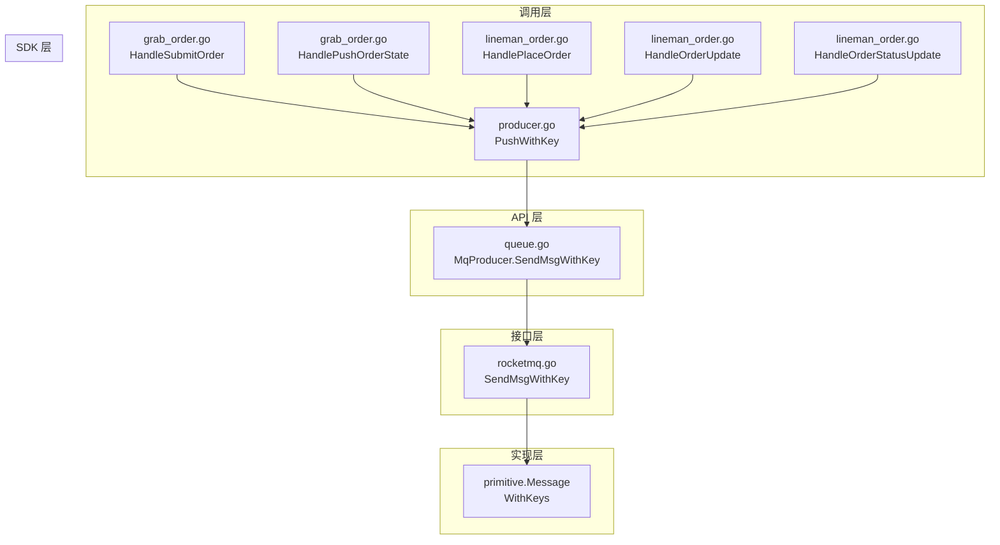

# task-bmp-queue-message-key 技术设计

## 📋 概述

| 项目 | 内容 |
|------|------|
| Spec ID | task-bmp-queue-message-key |
| 设计人 | rikugun |
| 设计日期 | 2026-01-30 |
| 总 SP | 2 |

## 🔄 代码复用分析

### 可复用代码

| 文件 | 说明 | 复用方式 |
|------|------|---------|
| `ttpos-bmp/internal/pkg/queue/queue.go` | MqProducer 接口定义 | 扩展接口 |
| `ttpos-bmp/internal/pkg/queue/rocketmq.go` | RocketMQ 实现 | 扩展方法 |
| `ttpos-bmp/internal/pkg/queue/producer.go` | 高层 API 封装 | 扩展方法 |
| `ttpos-bmp/internal/pkg/queue/logger.go` | 日志工具 | 直接调用 |

### 需要新建

| 文件 | 说明 |
|------|------|
| 无 | 所有功能在现有文件中扩展 |

## 🏗️ 架构设计

### 架构图



### 分层说明

| 层级 | 文件 | 职责 |
|------|------|------|
| **调用层** | `grab_order.go`, `lineman_order.go` | 业务逻辑，调用队列 API |
| **API 层** | `producer.go` | 高层封装，序列化消息体 |
| **接口层** | `queue.go` | 定义 `MqProducer` 接口规范 |
| **实现层** | `rocketmq.go` | RocketMQ 具体实现 |
| **SDK 层** | `primitive.Message` | RocketMQ Go SDK |

## 🧩 组件和接口

### 接口扩展: MqProducer

**位置**: `ttpos-bmp/internal/pkg/queue/queue.go`

**新增方法**:
```go
// MqProducer 消息生产者接口
type MqProducer interface {
    // ... 现有方法保持不变

    // SendMsgWithKey 发送带 key 的字符串消息
    // key 用于消息追踪和顺序消费（相同 key 路由到同一队列）
    SendMsgWithKey(ctx context.Context, topic, key, body string) (mqMsg MqMsg, err error)
}
```

### 实现扩展: RocketMq

**位置**: `ttpos-bmp/internal/pkg/queue/rocketmq.go`

**新增方法**:
```go
// SendMsgWithKey 发送带 key 的字符串消息
func (r *RocketMq) SendMsgWithKey(ctx context.Context, topic, key, body string) (mqMsg MqMsg, err error) {
    // 参数验证
    if r.producerIns == nil {
        return mqMsg, gerror.New("RocketMQ生产者未初始化")
    }
    if topic == "" {
        return mqMsg, gerror.New("主题名称不能为空")
    }
    if len(body) == 0 {
        return mqMsg, gerror.New("消息内容不能为空")
    }

    // 自动创建主题
    if err = r.createTopicIfNotExists(topic); err != nil {
        return mqMsg, gerror.Wrapf(err, "创建主题失败 [%s]", topic)
    }

    // 创建消息并设置 key
    msg := primitive.NewMessage(topic, []byte(body))
    if key != "" {
        msg.WithKeys([]string{key})
    }

    // 发送消息
    startTime := time.Now()
    result, err := r.producerIns.SendSync(ctx, msg)
    duration := time.Since(startTime)

    if err != nil {
        return mqMsg, gerror.Wrapf(err, "RocketMQ发送消息失败 [%s]", topic)
    }
    if result.Status != primitive.SendOK {
        return mqMsg, gerror.Newf("RocketMQ发送消息状态异常 [%s]: %v", topic, result.Status)
    }

    // 构建返回消息
    mqMsg = MqMsg{
        RunType:   MsgTypeSend,
        Topic:     topic,
        MsgId:     result.MsgID,
        Body:      []byte(body),
        Timestamp: time.Now(),
    }

    // 记录性能监控
    if duration > 500*time.Millisecond {
        Logger().Warningf(ctx, "RocketMQ发送消息耗时 [%s] key=%s - 消息ID: %s, 耗时: %v",
            topic, key, result.MsgID, duration)
    }

    return mqMsg, nil
}
```

### API 扩展: producer.go

**位置**: `ttpos-bmp/internal/pkg/queue/producer.go`

**新增方法**:
```go
// PushWithKey 使用指定 Context 和 Key 推送队列消息
// key 用于消息追踪和顺序消费（相同 key 路由到同一队列）
func PushWithKey(ctx context.Context, topic, key string, data interface{}) error {
    // 参数验证
    if topic == "" {
        return gerror.New("主题名称不能为空")
    }
    if data == nil {
        return gerror.New("消息内容不能为空")
    }

    // 初始化生产者
    producer, err := InstanceProducer()
    if err != nil {
        return gerror.Wrap(err, "初始化消息生产者失败")
    }

    // 序列化消息内容
    body, err := gjson.EncodeString(data)
    if err != nil {
        return gerror.Wrap(err, "消息体序列化失败")
    }

    // 发送消息（带 key）
    mqMsg, err := producer.SendMsgWithKey(ctx, topic, key, body)
    // 记录日志（包含 key）
    ProducerLogWithKey(ctx, topic, key, mqMsg, err)
    return err
}
```

### 日志扩展: logger.go

**位置**: `ttpos-bmp/internal/pkg/queue/logger.go`

**新增方法**:
```go
// ProducerLogWithKey 记录带 key 的生产者日志
func ProducerLogWithKey(ctx context.Context, topic, key string, mqMsg MqMsg, err error) {
    if err != nil {
        Logger().Errorf(ctx, "[MQ] 发送失败 topic=%s key=%s error=%v", topic, key, err)
        return
    }
    Logger().Infof(ctx, "[MQ] 发送成功 topic=%s key=%s msgId=%s", topic, key, mqMsg.MsgId)
}
```

## 🔌 调用点修改

### Grab 订单处理

**文件**: `ttpos-bmp/app/ttpos-takeout/internal/logic/grab/grab_order.go`

```go
// HandleSubmitOrder 中修改
// Before:
if err := queue.PushWithContext(ctx, TopicGrabOrder, event); err != nil {
    // ...
}

// After:
if err := queue.PushWithKey(ctx, TopicGrabOrder, req.GetOrderID(), event); err != nil {
    // ...
}

// HandlePushOrderState 中修改
// Before:
if err := queue.PushWithContext(ctx, TopicGrabOrder, event); err != nil {
    // ...
}

// After:
if err := queue.PushWithKey(ctx, TopicGrabOrder, req.GetOrderID(), event); err != nil {
    // ...
}
```

### Lineman 订单处理

**文件**: `ttpos-bmp/app/ttpos-takeout/internal/logic/lineman/lineman_order.go`

```go
// HandlePlaceOrder 中修改
if err := queue.PushWithKey(ctx, TopicLinemanOrder, req.OrderId, event); err != nil {
    // ...
}

// HandleOrderUpdate 中修改
if err := queue.PushWithKey(ctx, TopicLinemanOrder, req.OrderId, event); err != nil {
    // ...
}

// HandleOrderStatusUpdate 中修改
if err := queue.PushWithKey(ctx, TopicLinemanOrder, req.OrderId, event); err != nil {
    // ...
}
```

## ⚠️ 风险识别

| 风险 | 影响 | 缓解措施 |
|------|------|---------|
| Redis 驱动不支持 key | 中 | Redis 实现中 `SendMsgWithKey` 忽略 key 参数，保持兼容 |
| 接口变更影响其他调用方 | 低 | 新增方法，不修改现有接口签名 |

## 🧪 测试策略

**目标覆盖率**:
- `ttpos-bmp/internal/pkg/queue`: 80%+

**测试用例**:
1. `TestPushWithKey_Success`: 正常发送带 key 消息
2. `TestPushWithKey_EmptyKey`: key 为空时正常发送
3. `TestPushWithKey_EmptyTopic`: topic 为空时返回错误
4. `TestPushWithKey_NilData`: data 为 nil 时返回错误

**测试命令**:
```bash
cd ttpos-bmp && go test -v ./internal/pkg/queue/...
```

---

**版本**: v1.0.0
**创建日期**: 2026-01-30
