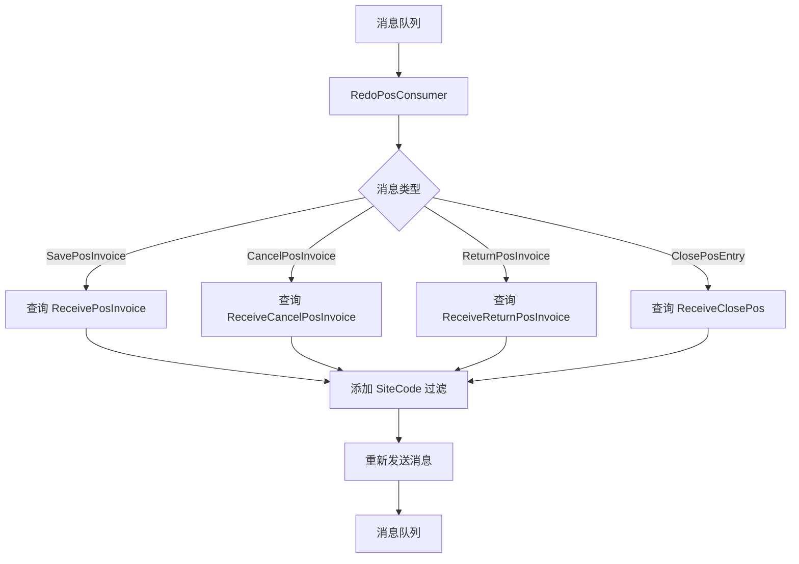

# 优化 RedoPosConsumer 增加 SiteCode 过滤 设计文档

> 本文档定义优化 RedoPosConsumer 增加 SiteCode 过滤的技术设计和实现方案。

## 📋 概述

在多站点环境下，`RedoPosConsumer` 需要增加 `SiteCode` 过滤条件，确保只查询当前站点的未处理订单，避免跨站点数据污染。本设计基于 GoFrame 2.x 框架，在现有 Consumer 架构基础上进行优化。

---

## 🎯 规范对齐

### Go BMP 规范 (go-bmp.mdc)

- ✅ 禁止修改 dao/entity/do/ 目录（自动生成）
- ✅ 遵循 GoFrame 项目结构
- ✅ 不使用 panic，返回 error
- ✅ 使用 g.Log() 记录日志
- ✅ 使用 gerror.Wrap() 包装错误

### 数据库规范 (database.mdc)

- ✅ 使用现有字段：`site_code`、`open_pos_entry_name`、`pos_open_entry_name`、`docstatus`
- ✅ 不涉及数据库结构变更
- ✅ 确保 `site_code` 字段有索引（如无则需添加）

---

## 🔄 代码复用分析

### 可复用的现有组件

- **SavePosInvoiceConsumer**: `ttpos-bmp/app/ttpos-erp/internal/consumer/selling/selling_consumer.go:24-90` - 已实现 SiteCode 过滤，可作为参考
- **ReturnPosInvoiceConsumer**: `ttpos-bmp/app/ttpos-erp/internal/consumer/selling/selling_consumer.go:92-188` - 已实现 SiteCode 过滤，可作为参考
- **CancelPosInvoice**: `ttpos-bmp/app/ttpos-erp/internal/consumer/selling/selling_consumer.go:190-285` - 已实现 SiteCode 过滤，可作为参考
- **ClosePosEntryConsumer**: `ttpos-bmp/app/ttpos-erp/internal/consumer/selling/selling_consumer.go:287-363` - 已实现 SiteCode 过滤，可作为参考
- **AsyncSellingMsg**: `ttpos-bmp/app/ttpos-erp/internal/model/mq/async_selling.go` - 消息结构已包含 SiteCode 字段

### 集成点

- **消息队列**: 使用现有的 Redis MQ 或 RocketMQ
- **数据库表**: 查询 `receive_pos_invoice`、`receive_cancel_pos_invoice`、`receive_return_pos_invoice`、`receive_close_pos` 表
- **DAO 层**: 使用 GoFrame 自动生成的 DAO（dao.ReceivePosInvoice、dao.ReceiveCancelPosInvoice 等）

---

## 🏗️ 架构设计

### 分层设计原则

**Go BMP Consumer 架构**:

```
Consumer Layer (RedoPosConsumer)
  ↓ 依赖
DAO Layer (dao.ReceivePosInvoice, dao.ReceiveCancelPosInvoice, ...)
  ↓ 依赖
Database (MySQL)
```

**依赖规则**:

- ✅ Consumer 依赖 DAO 层
- ✅ Consumer 依赖 Model 层（do、entity）
- ✅ Consumer 依赖消息队列（queue.Push）
- ❌ Consumer 不依赖 Service 层（本 Consumer 直接操作数据库）

### 架构图



### 模块划分

#### Go BMP 模块

- **Consumer 层**: `ttpos-bmp/app/ttpos-erp/internal/consumer/selling/selling_consumer.go` - RedoPosConsumer 实现
- **DAO 层**: `ttpos-bmp/app/ttpos-erp/internal/dao/` - 数据访问层（自动生成）
- **Model 层**: `ttpos-bmp/app/ttpos-erp/internal/model/`
  - `mq/` - 消息结构（AsyncSellingMsg）
  - `do/` - 数据对象（自动生成）
  - `entity/` - 数据实体（自动生成）

---

## 🗄️ 数据库设计

### 数据表设计

不涉及数据库结构变更，使用现有表：

#### 表 1: receive_pos_invoice

**查询字段**:
- `open_pos_entry_name` - POS 开单名称
- `docstatus` - 单据状态
- `site_code` - 站点编码（新增过滤条件）

**索引设计**:
- 确保 `site_code` 字段有索引（如无则需添加）
- 复合索引建议：`(site_code, open_pos_entry_name, docstatus)`

#### 表 2: receive_cancel_pos_invoice

**查询字段**:
- `open_pos_entry_name` - POS 开单名称
- `docstatus` - 单据状态
- `site_code` - 站点编码（新增过滤条件）

#### 表 3: receive_return_pos_invoice

**查询字段**:
- `open_pos_entry_name` - POS 开单名称
- `docstatus` - 单据状态
- `site_code` - 站点编码（新增过滤条件）

#### 表 4: receive_close_pos

**查询字段**:
- `pos_open_entry_name` - POS 开单名称
- `docstatus` - 单据状态
- `site_code` - 站点编码（新增过滤条件）

---

## 📊 数据模型

### Go Model

使用现有的 Model（自动生成，无需修改）：

- `entity.ReceivePosInvoice`
- `entity.ReceiveCancelPosInvoice`
- `entity.ReceiveReturnPosInvoice`
- `entity.ReceiveClosePos`

### DO 对象

使用现有的 DO（自动生成，无需修改）：

- `do.ReceivePosInvoice`
- `do.ReceiveCancelPosInvoice`
- `do.ReceiveReturnPosInvoice`
- `do.ReceiveClosePos`

### 消息结构

```go
// ttpos-bmp/app/ttpos-erp/internal/model/mq/async_selling.go
type AsyncSellingMsg struct {
	RecordId         int64  `json:"record_id,omitempty"`           //记录ID
	MsgType          MsgTyp `json:"msg_type"`                      //消息类型
	PosOpenEntryName string `json:"pos_open_entry_name,omitempty"` //开单名称
	SiteCode         string `json:"site_code,omitempty"`           //站点编码（已存在）
}
```

---

## 🔌 API 设计

不涉及 API 接口变更，这是内部消息队列 Consumer 的优化。

---

## 🧩 组件和接口

### Consumer 层

#### RedoPosConsumer 实现

```go
// ttpos-bmp/app/ttpos-erp/internal/consumer/selling/selling_consumer.go
type RedoPosConsumer struct {
}

func (*RedoPosConsumer) GetTopic() string {
	return string(consts.TopicRedoPos)
}

func (*RedoPosConsumer) GetConcurrency() int {
	return 10
}

// Handle 重做未处理的订单
// 消息参考: {"msg_type":"save-pos-invoice","pos_open_entry_name":"POS-OPE-2025-00238","site_code":"SITE001"}
func (*RedoPosConsumer) Handle(ctx context.Context, mqMsg queue.MqMsg) (err error) {
	g.Log().Info(ctx, "收到重做消息：", string(mqMsg.Body))
	j, err := gjson.DecodeToJson(mqMsg.Body)
	if err != nil {
		return gerror.Wrap(err, "解析JSON数据失败")
	}
	msg := &mq.AsyncSellingMsg{}
	if err = j.Scan(msg); err != nil {
		return gerror.Wrap(err, "扫描JSON数据失败")
	}
	if msg.PosOpenEntryName == "" {
		g.Log().Infof(ctx, "重做开单名称不能为空：%s", msg.PosOpenEntryName)
		return nil
	}
	
	// 验证 SiteCode（向后兼容）
	if msg.SiteCode == "" {
		g.Log().Warningf(ctx, "重做消息缺少 SiteCode，可能存在跨站点风险：%s", string(mqMsg.Body))
	}
	
	//重发所有未处理的商品发票
	switch msg.MsgType {
	case mq.MsgTypeSavePosInvoice:
		posInvoiceDao := dao.ReceivePosInvoice.Ctx(ctx)
		//查询所有未处理的商品发票
		posInvoiceList := make([]*entity.ReceivePosInvoice, 0)
		whereCondition := do.ReceivePosInvoice{
			OpenPosEntryName: msg.PosOpenEntryName,
			Docstatus:        erp.DocstatusDraft,
		}
		// 添加 SiteCode 过滤（当 SiteCode 不为空时）
		if msg.SiteCode != "" {
			whereCondition.SiteCode = msg.SiteCode
		}
		err = posInvoiceDao.Where(whereCondition).Scan(&posInvoiceList)
		if err != nil {
			return gerror.Wrapf(err, "查询商品发票失败")
		}
		//重发所有未处理的商品发票
		for _, posInvoice := range posInvoiceList {
			//发送消息
			if err = queue.Push(string(consts.TopicSavePosInvoice), &mq.AsyncSellingMsg{
				RecordId: posInvoice.Id,
				MsgType:  mq.MsgTypeSavePosInvoice,
			}); err != nil {
				g.Log().Errorf(ctx, "保存发票失败，发送异步消息失败: %v", err)
				return gerror.Wrapf(err, "保存发票失败，发送异步消息失败: %v", posInvoice.Id)
			}
		}
	case mq.MsgTypeCancelPosInvoice:
		cancelDao := dao.ReceiveCancelPosInvoice.Ctx(ctx)
		//查询所有未处理的取消发票
		cancelList := make([]*entity.ReceiveCancelPosInvoice, 0)
		whereCondition := do.ReceiveCancelPosInvoice{
			OpenPosEntryName: msg.PosOpenEntryName,
			Docstatus:        erp.DocstatusDraft,
		}
		// 添加 SiteCode 过滤（当 SiteCode 不为空时）
		if msg.SiteCode != "" {
			whereCondition.SiteCode = msg.SiteCode
		}
		err = cancelDao.Where(whereCondition).Scan(&cancelList)
		if err != nil {
			return gerror.Wrapf(err, "查询取消发票失败")
		}
		//重发所有未处理的取消发票
		for _, cancel := range cancelList {
			//发送消息
			if err = queue.Push(string(consts.TopicCancelPosInvoice), &mq.AsyncSellingMsg{
				RecordId: cancel.Id,
				MsgType:  mq.MsgTypeCancelPosInvoice,
			}); err != nil {
				g.Log().Errorf(ctx, "取消发票失败，发送异步消息失败: %v", err)
				return gerror.Wrapf(err, "取消发票失败，发送异步消息失败: %v", cancel.Id)
			}
		}
	case mq.MsgTypeReturnPosInvoice:
		returnDao := dao.ReceiveReturnPosInvoice.Ctx(ctx)
		//查询所有未处理的退货发票
		returnList := make([]*entity.ReceiveReturnPosInvoice, 0)
		whereCondition := do.ReceiveReturnPosInvoice{
			OpenPosEntryName: msg.PosOpenEntryName,
			Docstatus:        erp.DocstatusDraft,
		}
		// 添加 SiteCode 过滤（当 SiteCode 不为空时）
		if msg.SiteCode != "" {
			whereCondition.SiteCode = msg.SiteCode
		}
		err = returnDao.Where(whereCondition).Scan(&returnList)
		if err != nil {
			return gerror.Wrapf(err, "查询退货发票失败")
		}
		//重发所有未处理的退货发票
		for _, returnInvoice := range returnList {
			//发送消息
			if err = queue.Push(string(consts.TopicReturnPosInvoice), &mq.AsyncSellingMsg{
				RecordId: returnInvoice.Id,
				MsgType:  mq.MsgTypeReturnPosInvoice,
			}); err != nil {
				g.Log().Errorf(ctx, "退货发票失败，发送异步消息失败: %v", err)
				return gerror.Wrapf(err, "退货发票失败，发送异步消息失败: %v", returnInvoice.Id)
			}
		}
	case mq.MsgTypeClosePosEntry:
		closePosDao := dao.ReceiveClosePos.Ctx(ctx)
		//查询所有未处理的关账记录
		closePosList := make([]*entity.ReceiveClosePos, 0)
		whereCondition := do.ReceiveClosePos{
			PosOpenEntryName: msg.PosOpenEntryName,
			Docstatus:        erp.DocstatusDraft,
		}
		// 添加 SiteCode 过滤（当 SiteCode 不为空时）
		if msg.SiteCode != "" {
			whereCondition.SiteCode = msg.SiteCode
		}
		err = closePosDao.Where(whereCondition).Scan(&closePosList)
		if err != nil {
			return gerror.Wrapf(err, "查询关账记录失败")
		}
		//重发所有未处理的关账记录
		for _, closePos := range closePosList {
			//发送消息
			if err = queue.Push(string(consts.TopicClosePosEntry), &mq.AsyncSellingMsg{
				RecordId: closePos.Id,
				MsgType:  mq.MsgTypeClosePosEntry,
			}); err != nil {
				g.Log().Errorf(ctx, "关帐失败，发送异步消息失败: %v", err)
				return gerror.Wrapf(err, "关帐失败，发送异步消息失败: %v", closePos.Id)
			}
		}
	default:
		g.Log().Infof(ctx, "重做消息类型[%s]未处理", msg.MsgType)
		return nil
	}

	return nil
}
```

---

## ⚡ 缓存设计

不涉及缓存设计。

---

## 🚨 错误处理

### 错误场景

#### 场景 1: SiteCode 为空（向后兼容）

- **处理方式**: 记录警告日志，但不中断处理流程，跳过 SiteCode 过滤
- **用户影响**: 无影响，保持原有行为
- **代码示例**:
  ```go
  if msg.SiteCode == "" {
      g.Log().Warningf(ctx, "重做消息缺少 SiteCode，可能存在跨站点风险：%s", string(mqMsg.Body))
  }
  ```

#### 场景 2: 查询失败

- **处理方式**: 记录错误日志并返回错误
- **用户影响**: 消息处理失败，会重试
- **代码示例**:
  ```go
  if err != nil {
      return gerror.Wrapf(err, "查询商品发票失败")
  }
  ```

#### 场景 3: 消息发送失败

- **处理方式**: 记录错误日志并返回错误
- **用户影响**: 消息处理失败，会重试
- **代码示例**:
  ```go
  if err = queue.Push(...); err != nil {
      g.Log().Errorf(ctx, "发送异步消息失败: %v", err)
      return gerror.Wrapf(err, "发送异步消息失败: %v", recordId)
  }
  ```

---

## 🔒 安全设计

### 数据安全

- **跨站点防护**: 通过 `SiteCode` 过滤确保只查询当前站点的数据
- **SQL 注入防护**: 使用 GoFrame DAO 的参数化查询，自动防护 SQL 注入
- **数据验证**: 验证 `SiteCode` 字段的有效性

---

## 🧪 测试策略

### 单元测试

**目标覆盖率**:

- Consumer 层: 70%+

**测试内容**:

- 测试所有消息类型（`MsgTypeSavePosInvoice`、`MsgTypeCancelPosInvoice`、`MsgTypeReturnPosInvoice`、`MsgTypeClosePosEntry`）
- 测试 SiteCode 过滤功能
- 测试向后兼容性（SiteCode 为空的情况）
- 测试错误处理

**示例**:

```go
// ttpos-bmp/app/ttpos-erp/internal/consumer/selling/selling_consumer_test.go
func TestRedoPosConsumer_Handle_WithSiteCode(t *testing.T) {
    // 测试实现
}

func TestRedoPosConsumer_Handle_WithoutSiteCode(t *testing.T) {
    // 测试向后兼容性
}
```

### 集成测试

**测试流程**:

- 端到端消息处理流程
- 多站点数据隔离
- 消息重发功能

---

## 📈 性能优化

### 优化策略

1. **数据库优化**:
   - 确保 `site_code` 字段有索引
   - 复合索引建议：`(site_code, open_pos_entry_name, docstatus)`

2. **查询优化**:
   - 使用现有索引
   - 避免全表扫描

### 性能指标

- 本地响应时间: < 200ms
- 数据库查询: < 50ms

---

## 📚 实现清单

### Phase 1: 代码修改

- [x] 修改 `RedoPosConsumer.Handle` 方法
- [x] 为所有查询操作添加 `SiteCode` 过滤
- [x] 添加 SiteCode 验证和警告日志

### Phase 2: 测试

- [ ] 编写单元测试
- [ ] 编写集成测试
- [ ] 测试向后兼容性

**详细任务**: 参见 `tasks.md`

---

## Graphiti & 活动日志

- Related Episode: `[待补充]`
- 模板：`docs/agent/templates/graphiti-episode.md`
- 活动日志：`docs/team/activities/{YYYY-MM}/{YYYY-MM-DD}.md`
- 在技术方案评审、关键架构决策或踩坑总结后，立即补充 Episode 并在设计文档尾部互链。

---

**版本**: v1.0.0  
**创建日期**: 2025-12-01  
**作者**: rikugun  
**审核者**: {审核者}

