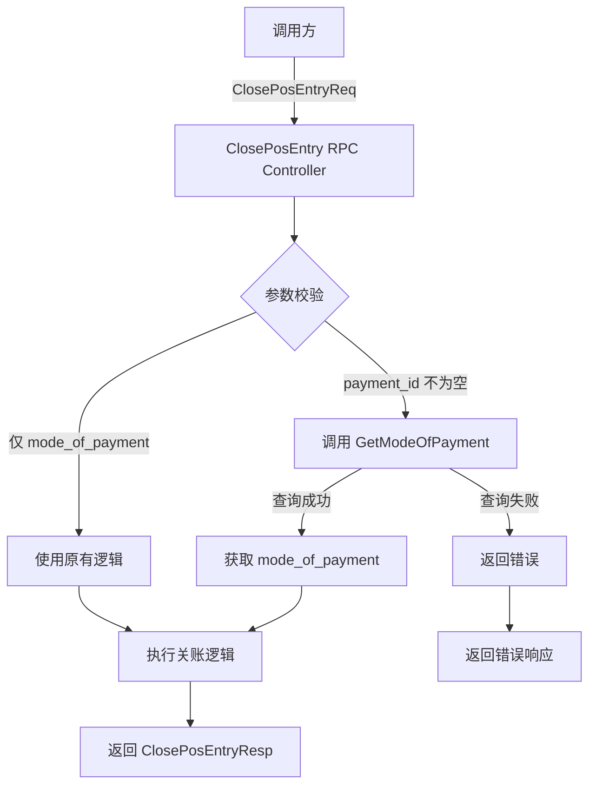

# 关账接口支持 PaymentID 设计文档

> 本文档定义关账接口支持 PaymentID 的技术设计和实现方案。

## 📋 概述

本功能为 `ClosePosEntry` gRPC 接口的 `ClosePosEntryDetail` 消息增加 `payment_id` 可选参数支持，使调用方可以直接使用 PaymentID 而无需提前查询 `mode_of_payment`。系统在收到 `payment_id` 后自动调用 `GetModeOfPayment` 服务查询对应的支付方式名称，简化调用流程并与其他接口保持设计一致。

**关键特性**：
- 向后兼容：保持原有 `mode_of_payment` 字段可用
- 自动查询：`payment_id` 不为空时自动查询对应的 `mode_of_payment`
- 参数校验：两个字段不能同时为空
- 错误处理：查询失败返回明确的错误信息

---

## 🎯 规范对齐

### Go BMP 规范 (go-bmp.mdc)

本功能严格遵循 GoFrame 开发规范：

- **禁止修改自动生成代码**：`dao/`、`entity/`、`do/` 目录的代码由 `gf gen dao` 自动生成，不手动修改
- **Protobuf 规范**：遵循 `ttpos-bmp/.cursor/rules/proto-rules.mdc`，字段命名使用 snake_case，消息命名以 Req/Resp 结尾
- **Logic 层设计**：
  - 只实现业务逻辑，不返回 `erp.ResponseInfo` 类型
  - 使用 `gerror` 包处理错误
  - 通过 Service 接口调用其他服务
- **Controller 层设计**：
  - 负责将业务数据包装为 `erp.ResponseInfo`
  - 处理 gRPC 请求和响应

### Protobuf 规范 (proto-rules.mdc)

- **字段命名**：使用 snake_case（如：`payment_id`、`mode_of_payment`）
- **字段类型**：使用 `optional string` 表示可选字段
- **字段编号**：新增字段使用递增编号（避免与现有字段冲突）
- **注释规范**：使用中文注释说明字段用途和约束

### API 设计规范 (api.mdc)

- **gRPC 响应格式**：通过 `erp.ResponseInfo` 统一包装
- **错误信息**：使用中文，便于运维和调试
- **参数验证**：在 Logic 层进行业务参数验证

---

## 🔄 代码复用分析

### 可复用的现有组件

1. **GetModeOfPayment 服务**
   - 路径：`ttpos-bmp/app/ttpos-erp/internal/logic/selling/selling.go`
   - 方法：`GetModeOfPayment(ctx context.Context, req *selling.GetModeOfPaymentReq) (*selling.GetModeOfPaymentResp, error)`
   - 用途：通过 `payment_id` 查询支付方式信息
   - 复用方式：在 `ClosePosEntry` Logic 中直接调用

2. **ClosePosEntry 现有逻辑**
   - 路径：`ttpos-bmp/app/ttpos-erp/internal/logic/selling/selling.go`
   - 方法：`ClosePosEntry(ctx context.Context, req *selling.ClosePosEntryReq) (*selling.ClosePosEntryResp, error)`
   - 复用方式：在现有逻辑基础上增加参数校验和自动查询

3. **错误处理**
   - 使用：`github.com/gogf/gf/v2/errors/gerror`
   - 方法：`gerror.New()`, `gerror.Wrapf()`

### 集成点

- **现有 API**：扩展 `ClosePosEntry` 接口，不新增接口
- **内部服务**：集成 `GetModeOfPayment` 服务进行支付方式查询
- **数据流**：`payment_id` → `GetModeOfPayment` → `mode_of_payment` → 原有关账逻辑

---

## 🏗️ 架构设计

### 分层设计原则

**Go BMP 微服务架构**：

```
gRPC Controller 层
  ↓ 调用
Logic 层（业务逻辑）
  ↓ 调用（如需要）
DAO 层（数据访问）
  ↓
Database
```

**本功能的层次调用**：

```
ClosePosEntry gRPC Controller
  ↓
ClosePosEntry Logic
  ↓ (if payment_id not empty)
GetModeOfPayment Service
  ↓
原有关账逻辑
```

### 架构图



### 模块划分

#### Protobuf 定义

- **文件**：`ttpos-bmp/app/ttpos-erp/manifest/protobuf/selling/selling.proto`
- **修改内容**：
  - `ClosePosEntryDetail.mode_of_payment` 改为 `optional string`
  - 新增 `ClosePosEntryDetail.payment_id` 字段

#### Logic 层

- **文件**：`ttpos-bmp/app/ttpos-erp/internal/logic/selling/selling.go`
- **修改方法**：`ClosePosEntry`
- **新增逻辑**：
  - 参数校验（payment_id 和 mode_of_payment 不能同时为空）
  - 自动查询 mode_of_payment（当 payment_id 不为空时）
  - 错误处理

#### Controller 层

- **文件**：`ttpos-bmp/app/ttpos-erp/internal/controller/rpc/selling/selling.go`
- **影响**：无需修改（Logic 层返回类型不变）

---

## 🗄️ 数据库设计

本功能不涉及数据库表结构变更，复用现有的 `Mode of Payment` 相关表。

---

## 📊 数据模型

### Protobuf 消息定义

#### 修改前（现有）

```protobuf
message ClosePosEntryDetail {
  string mode_of_payment = 1; // 支付方式,必填
  double opening_amount = 2; // 开帐金额,必填
  double closing_amount = 3; // 关帐金额,必填
}
```

#### 修改后（目标）

```protobuf
message ClosePosEntryDetail {
  optional string mode_of_payment = 1; // 支付方式，与 payment_id 二选一
  double opening_amount = 2; // 开帐金额,必填
  double closing_amount = 3; // 关帐金额,必填
  optional string payment_id = 4; // 支付方式唯一标识（PaymentID），与 mode_of_payment 二选一
  // 注意：当 payment_id 不为空时，系统自动调用 GetModeOfPayment 查询 mode_of_payment 值
}
```

### DTO 定义

不需要新增 DTO，复用现有的 Protobuf 生成的结构体。

---

## 🔌 API 设计

### gRPC API

#### 接口定义（无变化）

```protobuf
service SellingService {
  // Pos 关帐
  rpc ClosePosEntry (ClosePosEntryReq) returns (erp.ResponseInfo);
}
```

#### 请求消息（变化）

```protobuf
message ClosePosEntryReq {
  string pos_open_entry_name = 1; // 开帐名称,必填
  int64 period_end_date = 2; // 结账时间,必填
  repeated ClosePosEntryDetail close_pos_entry_detail = 3; // 关帐详情,必填
  int64 invoice_count = 4; // 发票数量
}

message ClosePosEntryDetail {
  optional string mode_of_payment = 1; // 支付方式，与 payment_id 二选一
  double opening_amount = 2; // 开帐金额,必填
  double closing_amount = 3; // 关帐金额,必填
  optional string payment_id = 4; // 支付方式唯一标识（PaymentID），与 mode_of_payment 二选一
}
```

#### 响应消息（无变化）

```protobuf
message ClosePosEntryResp {
  ClosePosEntryInfo close_pos_entry_info = 1;
  string async_record_id = 2; // 异步记录ID
}
```

#### 调用示例

**场景 1：使用 payment_id**

```json
{
  "pos_open_entry_name": "POS-OPENING-20251224-001",
  "period_end_date": 1703404800,
  "close_pos_entry_detail": [
    {
      "payment_id": "PID1234567890123456",  // 使用 PaymentID
      "opening_amount": 1000.00,
      "closing_amount": 1500.00
    }
  ],
  "invoice_count": 10
}
```

**场景 2：使用 mode_of_payment（向后兼容）**

```json
{
  "pos_open_entry_name": "POS-OPENING-20251224-001",
  "period_end_date": 1703404800,
  "close_pos_entry_detail": [
    {
      "mode_of_payment": "Cash - ACME",  // 直接使用支付方式名称
      "opening_amount": 1000.00,
      "closing_amount": 1500.00
    }
  ],
  "invoice_count": 10
}
```

---

## 🧩 组件和接口

### Logic 层实现

#### 核心逻辑伪代码

```go
func (s *sSelling) ClosePosEntry(ctx context.Context, req *selling.ClosePosEntryReq) (*selling.ClosePosEntryResp, error) {
    // 1. 处理 ClosePosEntryDetail 列表
    for i, detail := range req.ClosePosEntryDetail {
        // 1.1 参数校验
        if detail.PaymentId == nil && detail.ModeOfPayment == nil {
            return nil, gerror.Newf("close_pos_entry_detail[%d]: payment_id 和 mode_of_payment 不能同时为空", i)
        }
        
        modeOfPayment := ""
        
        // 1.2 如果提供了 payment_id，自动查询 mode_of_payment
        if detail.PaymentId != nil && *detail.PaymentId != "" {
            // 调用 GetModeOfPayment 服务
            getModeResp, err := service.Selling().GetModeOfPayment(ctx, &selling.GetModeOfPaymentReq{
                PaymentId: detail.PaymentId,
            })
            if err != nil {
                return nil, gerror.Wrapf(err, "查询支付方式失败，payment_id: %s", *detail.PaymentId)
            }
            
            // 提取 mode_of_payment
            if getModeResp.ModeOfPayment == nil || getModeResp.ModeOfPayment.Name == "" {
                return nil, gerror.Newf("支付方式不存在或未启用，payment_id: %s", *detail.PaymentId)
            }
            
            modeOfPayment = getModeResp.ModeOfPayment.Name
            
            // 记录日志
            g.Log().Infof(ctx, "关账详情[%d]: 通过 payment_id (%s) 查询到 mode_of_payment: %s",
                i, *detail.PaymentId, modeOfPayment)
        } else {
            // 1.3 直接使用 mode_of_payment（向后兼容）
            modeOfPayment = *detail.ModeOfPayment
        }
        
        // 1.4 使用 modeOfPayment 进行后续关账处理
        // ... 原有关账逻辑 ...
    }
    
    // 2. 执行关账操作
    // ... 原有关账逻辑 ...
    
    return resp, nil
}
```

#### 关键实现细节

1. **参数校验**
   - 遍历 `close_pos_entry_detail` 列表
   - 检查每个 detail 的 `payment_id` 和 `mode_of_payment`
   - 如果两者都为空，返回错误

2. **自动查询**
   - 检查 `payment_id` 是否不为空
   - 调用 `service.Selling().GetModeOfPayment()`
   - 提取 `resp.ModeOfPayment.Name`
   - 记录日志便于排查

3. **错误处理**
   - 使用 `gerror.Wrapf()` 包装错误，保留上下文
   - 错误信息包含 `payment_id` 值
   - 使用中文错误信息

4. **向后兼容**
   - 当 `payment_id` 为空时，直接使用 `mode_of_payment`
   - 不修改原有逻辑的执行流程

---

## 🚨 错误处理

### 错误场景

#### 场景 1：参数校验失败

- **触发条件**：`payment_id` 和 `mode_of_payment` 同时为空
- **错误信息**：`close_pos_entry_detail[{index}]: payment_id 和 mode_of_payment 不能同时为空`
- **HTTP 状态码**：gRPC Code: `InvalidArgument`
- **用户影响**：请求被拒绝，需要调用方修正参数

**代码示例**：

```go
if detail.PaymentId == nil && detail.ModeOfPayment == nil {
    return nil, gerror.Newf("close_pos_entry_detail[%d]: payment_id 和 mode_of_payment 不能同时为空", i)
}
```

#### 场景 2：PaymentID 查询失败

- **触发条件**：`payment_id` 不存在或服务调用失败
- **错误信息**：`查询支付方式失败，payment_id: {payment_id}`
- **HTTP 状态码**：gRPC Code: `NotFound` 或 `Internal`
- **用户影响**：关账失败，需要检查 `payment_id` 是否正确

**代码示例**：

```go
getModeResp, err := service.Selling().GetModeOfPayment(ctx, &selling.GetModeOfPaymentReq{
    PaymentId: detail.PaymentId,
})
if err != nil {
    g.Log().Error(ctx, "查询支付方式失败", zap.String("payment_id", *detail.PaymentId), zap.Error(err))
    return nil, gerror.Wrapf(err, "查询支付方式失败，payment_id: %s", *detail.PaymentId)
}
```

#### 场景 3：支付方式未启用

- **触发条件**：`payment_id` 存在但对应的支付方式已禁用
- **错误信息**：`支付方式不存在或未启用，payment_id: {payment_id}`
- **HTTP 状态码**：gRPC Code: `FailedPrecondition`
- **用户影响**：关账失败，需要启用支付方式或使用其他支付方式

**代码示例**：

```go
if getModeResp.ModeOfPayment == nil || getModeResp.ModeOfPayment.Name == "" {
    return nil, gerror.Newf("支付方式不存在或未启用，payment_id: %s", *detail.PaymentId)
}
```

---

## 🔒 安全设计

### 身份验证

- **gRPC Interceptor**：所有 gRPC 请求需要通过身份验证拦截器
- **Token 验证**：验证调用方的 JWT Token

### 权限控制

- **RBAC**：基于角色的访问控制（已有机制）
- **API 权限**：关账操作需要相应的权限

### 数据安全

- **参数验证**：防止无效输入导致的错误
- **错误信息**：不泄露敏感数据（如数据库结构）
- **日志记录**：记录关键操作便于审计

---

## 🧪 测试策略

### 单元测试

**目标覆盖率**：Logic 层 ≥ 80%

**测试内容**：

1. **参数校验测试**
   - 测试 `payment_id` 和 `mode_of_payment` 同时为空
   - 测试仅提供 `payment_id`
   - 测试仅提供 `mode_of_payment`
   - 测试同时提供两个参数

2. **自动查询测试**
   - Mock `GetModeOfPayment` 服务
   - 测试查询成功的情况
   - 测试查询失败的情况
   - 测试支付方式未启用的情况

3. **向后兼容测试**
   - 测试使用原有 `mode_of_payment` 的调用方式

**测试文件**：`ttpos-bmp/app/ttpos-erp/internal/logic/selling/selling_test.go`

**示例**：

```go
func Test_ClosePosEntry_WithPaymentId(t *testing.T) {
    // 测试使用 payment_id 的场景
}

func Test_ClosePosEntry_WithModeOfPayment(t *testing.T) {
    // 测试使用 mode_of_payment 的场景（向后兼容）
}

func Test_ClosePosEntry_BothEmpty(t *testing.T) {
    // 测试两个参数都为空的错误场景
}

func Test_ClosePosEntry_PaymentIdNotFound(t *testing.T) {
    // 测试 payment_id 查询失败的场景
}
```

### 集成测试

**测试流程**：

1. 创建测试数据（支付方式）
2. 调用 `ClosePosEntry` 接口（使用 `payment_id`）
3. 验证关账成功
4. 验证日志记录正确

### 手动测试

**测试工具**：gRPC 客户端（如：grpcurl, BloomRPC）

**测试场景**：
- 使用真实的 `payment_id` 进行关账
- 使用不存在的 `payment_id` 验证错误处理
- 使用原有的 `mode_of_payment` 验证向后兼容性

---

## 📈 性能优化

### 优化策略

1. **查询优化**
   - `GetModeOfPayment` 内部已有缓存机制
   - 避免重复查询相同的 `payment_id`

2. **错误处理**
   - 快速失败（fail-fast），参数校验在前
   - 避免不必要的服务调用

3. **日志优化**
   - 使用结构化日志（zap）
   - 只在必要时记录详细信息

### 性能指标

- **GetModeOfPayment 查询时间**：< 100ms（利用缓存）
- **整体接口响应时间增加**：< 50ms（仅增加一次查询）
- **缓存命中率**：> 90%（相同 payment_id 重复调用）

---

## 🌐 向后兼容性

### 兼容性保证

1. **Protobuf 字段变更**
   - `mode_of_payment` 从 `string` 改为 `optional string`
   - Protobuf 3 中，optional 字段的序列化与原 required 字段兼容
   - 现有调用方不传 `payment_id` 字段不影响

2. **逻辑兼容**
   - 当 `payment_id` 为空时，完全使用原有逻辑
   - 不修改现有使用 `mode_of_payment` 的代码路径

3. **API 版本**
   - 不引入新的 API 版本
   - 在现有接口上扩展功能

### 迁移建议

**对于调用方**：
- **不需要立即升级**：继续使用 `mode_of_payment` 即可
- **推荐升级**：使用 `payment_id` 可以简化代码
- **升级步骤**：
  1. 更新 Protobuf 定义
  2. 重新生成客户端代码
  3. 将 `mode_of_payment` 改为 `payment_id`

---

## 📚 实现清单

### Phase 1: Protobuf 定义调整

- [x] 修改 `selling.proto`
- [x] 执行 `gf gen pb` 生成代码
- [ ] 提交代码审查

### Phase 2: Logic 层实现

- [ ] 添加参数校验逻辑
- [ ] 实现自动查询 `GetModeOfPayment`
- [ ] 添加错误处理和日志
- [ ] 添加注释说明

### Phase 3: 测试

- [ ] 编写单元测试
- [ ] 执行集成测试
- [ ] 手动测试各种场景

### Phase 4: 文档

- [ ] 更新 API 文档
- [ ] 更新 CHANGELOG
- [ ] 提供迁移指南（如需要）

**详细任务**: 参见 `tasks.md`

---

## Graphiti & 活动日志

- Related Episode: `[待补充]`
- 模板：`docs/agent/templates/graphiti-episode.md`
- 活动日志：`docs/team/activities/{YYYY-MM}/{YYYY-MM-DD}.md`
- 在技术方案评审、关键架构决策或踩坑总结后，立即补充 Episode 并在设计文档尾部互链。

---

**版本**: v1.0.0  
**创建日期**: 2025-12-24  
**作者**: rikugun  
**审核者**: -

