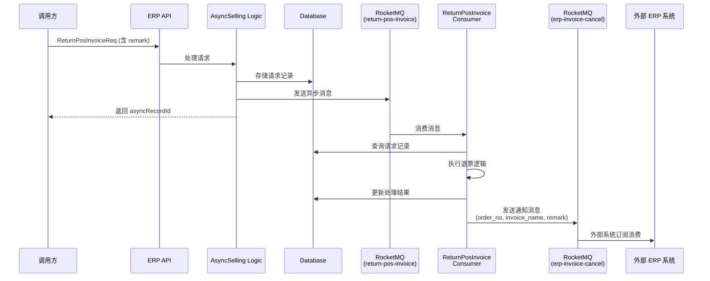

# task-erp-invoice-cancel-notification 技术设计

## 📋 概述

| 项目 | 内容 |
|------|------|
| Spec ID | task-erp-invoice-cancel-notification |
| 设计人 | rikugun |
| 设计日期 | 2026-01-29 |
| 总 SP | 2 |

---

## 🔄 代码复用分析

### 可复用代码

| 文件 | 说明 | 复用方式 |
|------|------|---------|
| `ttpos-bmp/internal/pkg/queue/producer.go` | MQ 消息发送工具 | 直接调用 `queue.Push()` |
| `ttpos-bmp/app/ttpos-erp/internal/consts/topic.go` | Topic 常量定义 | 参考模式新增常量 |
| `ttpos-bmp/app/ttpos-erp/internal/consumer/selling/selling_consumer.go` | 消费者处理逻辑 | 扩展现有消费者 |

### 需要新建/修改

| 文件 | 说明 | 操作 |
|------|------|------|
| `ttpos-bmp/app/ttpos-erp/manifest/protobuf/selling/selling.proto` | ReturnPosInvoiceReq 定义 | 修改：增加 remark 字段 |
| `ttpos-bmp/app/ttpos-erp/internal/consts/topic.go` | Topic 常量 | 修改：新增 `TopicErpInvoiceCancel` |
| `ttpos-bmp/app/ttpos-erp/internal/model/mq/invoice_cancel_notify.go` | 通知消息结构 | 新建 |
| `ttpos-bmp/app/ttpos-erp/internal/consumer/selling/selling_consumer.go` | 消费者处理逻辑 | 修改：处理完成后发送通知 |

---

## 🏗️ 架构设计

### 架构图



### 数据流说明

1. **请求阶段**：调用方发送 `ReturnPosInvoiceReq`（含新增的 remark 字段）
2. **存储阶段**：Logic 层将请求序列化后存入 `receive_return_pos_invoice` 表
3. **异步处理**：发送消息到 `return-pos-invoice` topic
4. **消费处理**：Consumer 消费消息，执行退票逻辑
5. **通知发送**：处理完成后，发送通知到 `erp-invoice-cancel` topic
6. **外部订阅**：外部 ERP 系统订阅 `erp-invoice-cancel` 获取通知

---

## 🧩 组件和接口

### Protobuf: ReturnPosInvoiceReq 扩展

**位置**: `ttpos-bmp/app/ttpos-erp/manifest/protobuf/selling/selling.proto`

**变更**:
```protobuf
message ReturnPosInvoiceReq {
  string order_no = 1;                      // 退款订单号,必填
  string open_pos_entry_name = 2;           // POS开帐名称,必填
  int64 posting_datetime = 3;               // 过账日期时间
  string company_abbr = 4;                  // 公司缩写,必填
  string invoice_name = 5;                  // 销售发票
  repeated PosInvoiceItem items = 6;        // 商品项目列表
  repeated PosInvoiceTax taxes = 7;         // 税费列表
  repeated PosInvoicePayment payments = 8;  // 付款列表
  int64 invoice_type = 9;                   // 发票类型
  string remark = 10;                       // [NEW] 附注/备注，可选
}
```

### Topic 常量

**位置**: `ttpos-bmp/app/ttpos-erp/internal/consts/topic.go`

**新增**:
```go
const (
    // ... 现有常量 ...
    TopicErpInvoiceCancel = Topic("erp-invoice-cancel")  // 发票取消通知
)
```

### 通知消息结构

**位置**: `ttpos-bmp/app/ttpos-erp/internal/model/mq/invoice_cancel_notify.go`

**新建**:
```go
package mq

// InvoiceCancelNotifyMsg 发票取消通知消息
type InvoiceCancelNotifyMsg struct {
    OrderNo     string `json:"order_no"`      // 订单号
    InvoiceName string `json:"invoice_name"`  // 发票名称
    Remark      string `json:"remark"`        // 附注信息
}
```

### Consumer 扩展

**位置**: `ttpos-bmp/app/ttpos-erp/internal/consumer/selling/selling_consumer.go`

**修改点**: 在 `ReturnPosInvoiceConsumer` 处理完成后，增加通知发送逻辑

```go
// 处理完成后发送通知
func (c *SellingConsumer) sendInvoiceCancelNotify(ctx context.Context, req *selling.ReturnPosInvoiceReq) error {
    notifyMsg := &mq.InvoiceCancelNotifyMsg{
        OrderNo:     req.OrderNo,
        InvoiceName: req.InvoiceName,
        Remark:      req.Remark,
    }

    if err := queue.PushWithContext(ctx, string(consts.TopicErpInvoiceCancel), notifyMsg); err != nil {
        g.Log().Errorf(ctx, "发送发票取消通知失败: %v", err)
        return err  // 仅记录日志，不阻塞主流程
    }

    g.Log().Infof(ctx, "发票取消通知已发送: order_no=%s, invoice_name=%s", req.OrderNo, req.InvoiceName)
    return nil
}
```

---

## 📊 数据模型

### 无需新建数据库表

本次改动不涉及数据库表结构变更。remark 字段通过 protobuf 传递，序列化后存入现有的 `ReqMessage` 字段。

---

## 🔌 API 设计

### 无新增 API

本次改动不涉及新增 API 端点。仅扩展现有 `ReturnPosInvoiceReq` 的 remark 字段。

**现有 API 变更说明**:

| 项目 | 内容 |
|------|------|
| 接口 | ReturnPosInvoice (gRPC) |
| 变更 | 请求新增可选字段 remark |
| 向后兼容 | 是（remark 为可选字段） |

---

## ⚠️ 风险识别

| 风险 | 影响 | 缓解措施 |
|------|------|---------|
| MQ 消息发送失败 | 中 | 异步发送，失败仅记录日志，不阻塞退票主流程 |
| 外部系统未订阅 topic | 中 | 提供接入文档，说明 topic 名称和消息格式 |
| protobuf 字段变更兼容性 | 低 | remark 为可选字段，向后兼容 |

---

## 🧪 测试策略

### 测试范围

| 测试类型 | 范围 | 目标覆盖率 |
|----------|------|-----------|
| 单元测试 | Consumer 通知发送逻辑 | 80%+ |
| 集成测试 | 完整退票流程 + MQ 通知 | - |

### 测试用例

1. **正常流程**: 传入 remark → 退票成功 → 通知发送成功
2. **remark 为空**: 不传 remark → 退票成功 → 通知发送（remark 为空）
3. **MQ 发送失败**: 模拟 MQ 故障 → 退票成功 → 通知失败但不阻塞

### 测试命令

```bash
cd ttpos-bmp/app/ttpos-erp && go test ./internal/consumer/... -v
```

---

## 📝 实现注意事项

### GoFrame 规范

- 使用 `gerror` 处理错误，不用标准库 errors
- 日志使用 `g.Log()` 并包含上下文
- MQ 发送使用 `queue.PushWithContext()` 传递 ctx

### Protobuf 变更流程

1. 修改 `.proto` 文件
2. 执行 `make pb` 生成 Go 代码
3. 验证生成的代码无误

### 代码生成命令

```bash
cd ttpos-bmp/app/ttpos-erp && make pb
```

---

**版本**: v1.0.0
**设计日期**: 2026-01-29
