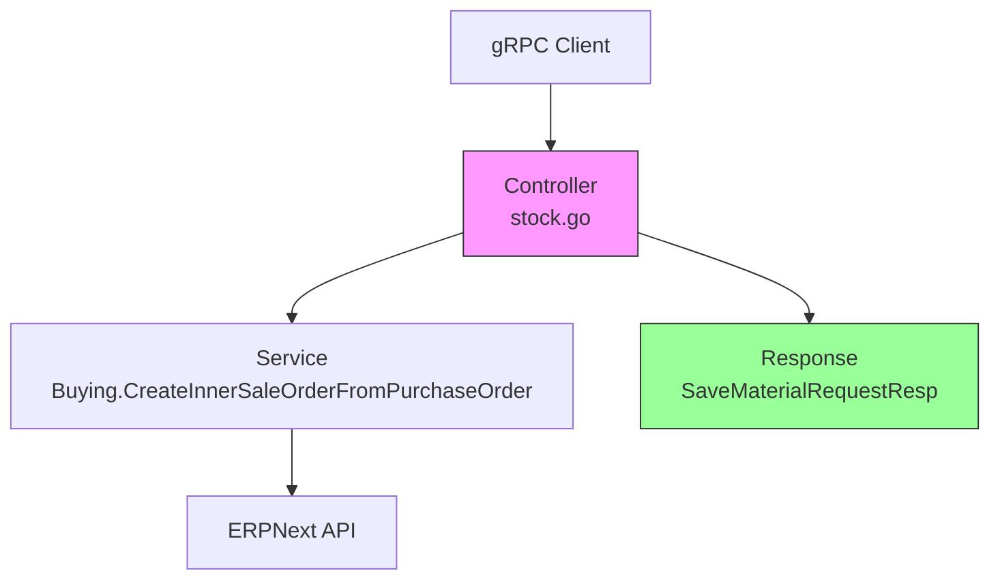

# task-erp-material-request-sales-order 技术设计

## 📋 概述

| 项目 | 内容 |
|------|------|
| Spec ID | task-erp-material-request-sales-order |
| 设计人 | rikugun |
| 设计日期 | 2026-01-26 |
| 总 SP | 1 |

---

## 🔄 代码复用分析

### 可复用代码

| 文件 | 说明 | 复用方式 |
|------|------|---------|
| `ttpos-bmp/app/ttpos-erp/internal/service/buying.go` | `CreateInnerSaleOrderFromPurchaseOrder` 方法已返回 `*erp.SaleOrder` | 直接使用返回值 |

### 需要修改

| 文件 | 说明 |
|------|------|
| `ttpos-bmp/app/ttpos-erp/manifest/protobuf/stock/stock.proto` | 在 `SaveMaterialRequestResp` 中新增 `sales_order` 字段 |
| `ttpos-bmp/app/ttpos-erp/internal/controller/rpc/stock/stock.go` | 接收 `CreateInnerSaleOrderFromPurchaseOrder` 返回值并赋给 `resp.SalesOrder` |

### 自动生成（make pb 后）

| 文件 | 说明 |
|------|------|
| `ttpos-bmp/app/ttpos-erp/api/stock/stock.pb.go` | Protobuf 生成的 Go 代码，包含 `SalesOrder` 字段 |

---

## 🏗️ 架构设计

### 架构图



### 变更范围

本次修改仅涉及 **Controller 层**，不影响 Service 和 Model 层：

- **Controller**: 修改 `SaveMaterialRequest` 方法，接收 `CreateInnerSaleOrderFromPurchaseOrder` 的返回值
- **Protobuf**: 新增响应字段 `sales_order`

---

## 🧩 组件和接口

### Controller: stock.Controller

**位置**: `ttpos-bmp/app/ttpos-erp/internal/controller/rpc/stock/stock.go`

**当前代码**（第 76-86 行）:
```go
// saleOrder := &erp.SaleOrder{}
if _, err = service.Buying().CreateInnerSaleOrderFromPurchaseOrder(ctx, &dto.CreateInnerSaleOrderFromPurchaseOrderReq{
    SourceName:      purchaseOrder.Name,
    DeliveryDate:    requiredBy,
    SourceWarehouse: req.SourceWarehouse,
}); err != nil {
    // 错误处理...
}
```

**修改后代码**:
```go
saleOrder, err := service.Buying().CreateInnerSaleOrderFromPurchaseOrder(ctx, &dto.CreateInnerSaleOrderFromPurchaseOrderReq{
    SourceName:      purchaseOrder.Name,
    DeliveryDate:    requiredBy,
    SourceWarehouse: req.SourceWarehouse,
})
if err != nil {
    // 错误处理（保持不变）...
}
resp.SalesOrder = saleOrder.Name
```

---

## 📊 数据模型

### Protobuf: SaveMaterialRequestResp

**位置**: `ttpos-bmp/app/ttpos-erp/manifest/protobuf/stock/stock.proto`

**当前定义**:
```protobuf
message SaveMaterialRequestResp {
  string material_request_name = 1;      // 物品申请单名称
  string purchase_order = 2;             // 采购订单号
}
```

**修改后定义**:
```protobuf
message SaveMaterialRequestResp {
  string material_request_name = 1;      // 物品申请单名称
  string purchase_order = 2;             // 采购订单号
  string sales_order = 3;                // 内部销售订单号
}
```

---

## 🔌 API 设计

### SaveMaterialRequest

| 项目 | 内容 |
|------|------|
| 类型 | gRPC |
| Service | StockService |
| Method | SaveMaterialRequest |
| 请求 | stock.SaveMaterialRequestReq |
| 响应 | api.ResponseInfo (包含 SaveMaterialRequestResp) |

**响应变更**:

| 字段 | 类型 | 说明 | 变更 |
|------|------|------|------|
| material_request_name | string | 物品申请单名称 | 无变更 |
| purchase_order | string | 采购订单号 | 无变更 |
| sales_order | string | 内部销售订单号 | **新增** |

---

## ⚠️ 风险识别

| 风险 | 影响 | 缓解措施 |
|------|------|---------|
| 现有调用方未处理新字段 | 低 | Protobuf 新增字段向后兼容，旧客户端自动忽略 |
| make pb 生成失败 | 低 | 确保 protoc 工具链完整，遵循现有生成流程 |

---

## 🧪 测试策略

### 验证方式

1. **编译验证**: `make pb` 成功生成代码
2. **接口测试**: 调用 SaveMaterialRequest，验证响应包含 `sales_order` 字段

### 测试命令

```bash
cd ttpos-bmp/app/ttpos-erp
make pb      # 生成 Protobuf 代码
make build   # 编译验证
make run     # 启动服务验证
```

---

**版本**: v1.0.0
**设计日期**: 2026-01-26
