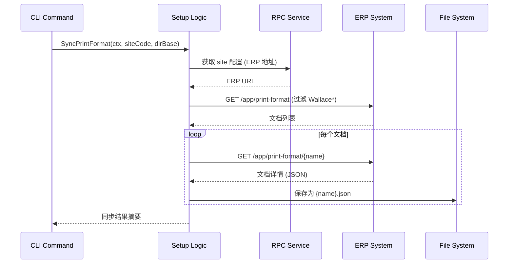

# task-erp-sync-print-format 技术设计

## 📋 概述

| 项目 | 内容 |
|------|------|
| Spec ID | task-erp-sync-print-format |
| 设计人 | rikugun |
| 设计日期 | 2026-01-15 |
| 总 SP | 2 |

---

## 🔄 代码复用分析

### 可复用代码

| 文件 | 说明 | 复用方式 |
|------|------|---------|
| [cmd.go](ttpos-bmp/app/ttpos-erp/internal/cmd/cmd.go) | ErpMigrate 指令模式 | 参考：参数解析、siteCode 传递、退出处理 |
| [setup.go](ttpos-bmp/app/ttpos-erp/internal/logic/setup/setup.go) | 文件处理模式 | 参考：错误处理、日志输出格式 |
| service.Rpc() | ERP API 调用 | 直接调用：获取打印格式列表 |
| service.Document() | ERP 文档操作 | 直接调用：获取单个文档详情 |

### 需要新建

| 文件 | 说明 |
|------|------|
| cmd.go 新增 `ErpSyncPrintFormat` | CLI 指令定义 |
| setup.go 新增 `SyncPrintFormat()` | 业务逻辑实现 |
| service/setup.go 新增接口方法 | Service 接口声明 |

---

## 🏗️ 架构设计

### 调用流程图



### 分层说明

- **CLI Layer**: `internal/cmd/cmd.go` - 参数解析、指令入口
- **Logic Layer**: `internal/logic/setup/setup.go` - 核心业务逻辑
- **Service Layer**: `internal/service/setup.go` - 接口定义
- **RPC Layer**: 复用现有 `service.Rpc()` 和 `service.Document()`

---

## 🧩 组件和接口

### Service Interface 扩展

**位置**: `ttpos-bmp/app/ttpos-erp/internal/service/setup.go`

```go
type ISetup interface {
    // ... 现有方法 ...

    // SyncPrintFormat 从 ERP 同步打印格式到本地
    // 参数:
    //   - ctx: 上下文对象，包含 siteCode
    //   - dirBase: 输出目录，默认 ./manifest/printformat/html/
    // 返回:
    //   - result: 同步结果统计
    //   - err: 错误信息
    SyncPrintFormat(ctx context.Context, dirBase string) (*SyncPrintFormatResult, error)
}
```

### Logic 实现

**位置**: `ttpos-bmp/app/ttpos-erp/internal/logic/setup/setup.go`

```go
// SyncPrintFormatResult 同步结果
type SyncPrintFormatResult struct {
    Total   int      // 总数量
    Success int      // 成功数量
    Failed  int      // 失败数量
    Errors  []string // 失败详情
}

// SyncPrintFormat 从 ERP 同步 Wallace 打印格式
func (s *sSetup) SyncPrintFormat(ctx context.Context, dirBase string) (*SyncPrintFormatResult, error) {
    // 1. 获取 ERP 地址（通过 siteCode）
    // 2. 调用 ERP API 获取 Print Format 列表
    // 3. 过滤 "Wallace" 开头的文档
    // 4. 遍历获取每个文档详情
    // 5. 保存为 JSON 文件
    // 6. 返回统计结果
}
```

### CLI Command

**位置**: `ttpos-bmp/app/ttpos-erp/internal/cmd/cmd.go`

```go
var ErpSyncPrintFormat = &gcmd.Command{
    Name:  "sync-print-format",
    Usage: "sync-print-format --siteCode 1 [--dirBase ./manifest/printformat/html/]",
    Brief: "从 ERP 同步 Wallace 打印格式到本地",
    Func: func(ctx context.Context, parser *gcmd.Parser) (err error) {
        // 1. 解析参数
        siteCode := parser.GetOpt("siteCode", "").String()
        dirBase := parser.GetOpt("dirBase", "./manifest/printformat/html/").String()

        // 2. 参数校验
        if siteCode == "" {
            return gerror.New("siteCode 参数必填")
        }

        // 3. 设置 context
        ctx = grpcx.Ctx.NewIncoming(ctx, g.Map{
            consts.ContextSiteCode: siteCode,
        })

        // 4. 调用 service
        result, err := service.Setup().SyncPrintFormat(ctx, dirBase)

        // 5. 输出结果
        // 6. 退出
    },
}
```

---

## 🔌 API 设计

### ERP API 调用

| 操作 | 方法 | 说明 |
|------|------|------|
| 获取打印格式列表 | `service.Doctype().List()` | DocType: "Print Format", 过滤 name LIKE "Wallace%" |
| 获取文档详情 | `service.Document().Get()` | 获取完整 JSON 内容 |

### 文件输出格式

```
manifest/printformat/html/
├── Wallace Invoice.json
├── Wallace Receipt.json
├── Wallace Report.json
└── ...
```

每个 JSON 文件包含 ERP Print Format 文档的完整内容。

---

## ⚠️ 风险识别

| 风险 | 影响 | 缓解措施 |
|------|------|---------|
| ERP API 返回格式变化 | 中 | 增加响应校验，异常时输出明确错误 |
| 网络请求失败 | 低 | 单文档失败不影响其他，最终汇总失败列表 |
| 文件写入权限 | 低 | 启动时检查目录可写性 |

---

## 🧪 测试策略

**目标覆盖率**:
- logic/setup: 80%+

**测试场景**:
1. 正常同步：多个 Wallace 文档成功保存
2. 空列表：无 Wallace 文档时正常退出
3. 部分失败：单文档获取失败不影响其他
4. 参数校验：siteCode 缺失时报错

**测试命令**:
```bash
cd ttpos-bmp && go test -coverprofile=coverage.out ./app/ttpos-erp/internal/logic/setup/...
cd ttpos-bmp && go tool cover -html=coverage.out
```

---

**版本**: v1.0.0
**设计日期**: 2026-01-15
