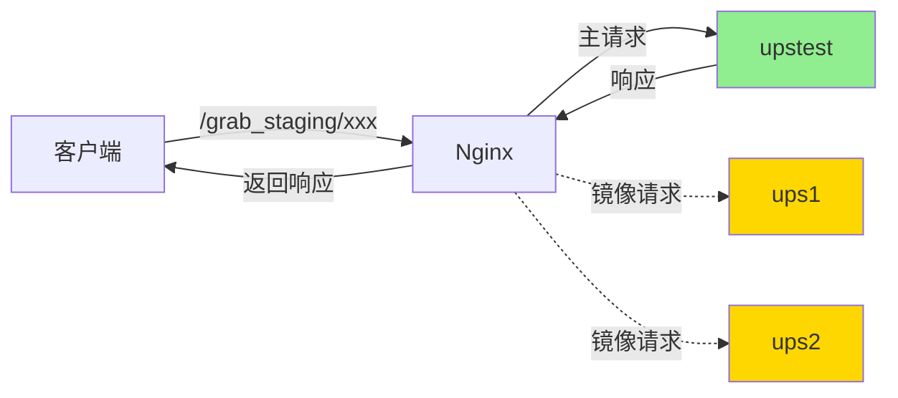

# Nginx Grab Staging 多播配置 设计文档

> 本文档定义 Nginx Grab Staging 多播配置的技术设计和实现方案。

## 📋 概述

新增 `grab_staging.conf` Nginx 配置文件，使用 Nginx mirror 模块实现请求多播功能。当客户端访问 `/grab_staging/*` 路径时，Nginx 会将请求同时转发到 3 个不同的上游环境（ups1、ups2、upstest），主请求返回 upstest 的响应，镜像请求异步发送到 ups1 和 ups2，用于多环境对比测试和版本验证。

---

## 🎯 规范对齐

### Nginx 配置规范

本设计遵循以下 Nginx 最佳实践：

- 使用 upstream 模块定义上游服务器组
- 使用 mirror 模块实现请求复制
- 使用 rewrite 指令实现路径重写
- 使用 proxy_* 指令配置 HTTPS 代理
- 配置文件符合 Nginx 语法规范

### Docker 容器环境

- 配置文件挂载到容器内 `/etc/nginx/conf.d/`
- 支持热重载，不中断服务
- 日志输出到标准输出（stdout）

---

## 🔄 代码复用分析

### 可复用的现有配置

- **ttpos-bmp.conf**: `docker/nginx/conf.d/ttpos-bmp.conf` - 参考现有的反向代理配置
  - upstream 定义方式
  - proxy_* 指令配置
  - 请求头设置

### 集成点

- **Nginx 容器**: 配置文件将被挂载到 Nginx 容器内
- **Docker Compose**: 配置文件挂载在 `docker-compose.yml` 中定义
- **访问日志**: 日志输出到 Nginx 容器的标准输出

---

## 🏗️ 架构设计

### 总体架构



### 请求流程

#### 主请求流程（同步）

```
1. 客户端请求: GET /grab_staging/api/order/list
2. Nginx 接收请求
3. 执行 mirror 指令（异步）
4. 执行 rewrite: /api/order/list
5. proxy_pass 到 upstest
6. upstest 处理请求并返回响应
7. Nginx 返回响应给客户端
```

#### 镜像请求流程（异步）

```
1. Nginx mirror 模块复制请求
2. 转发到内部 location: /grab_staging_mirror_ups1
3. 执行 rewrite: /api/order/list
4. proxy_pass 到 ups1
5. ups1 处理请求（不等待响应）

并行执行：
1. Nginx mirror 模块复制请求
2. 转发到内部 location: /grab_staging_mirror_ups2
3. 执行 rewrite: /api/order/list
4. proxy_pass 到 ups2
5. ups2 处理请求（不等待响应）
```

### 模块划分

#### Upstream 定义模块

- **ups1**: `https://14031--main--ttpos-go--weifashi.coder.hitosea.com:443`
- **ups2**: `https://14031--main--rikugun--rikugun.coder.hitosea.com:443`
- **upstest**: `https://ttpos-test1.ttpos.com:443`

#### Location 模块

1. **主 location**: `/grab_staging`
   - 配置 mirror 指令
   - 路径重写
   - 主请求代理到 upstest

2. **镜像 location 1**: `/grab_staging_mirror_ups1`
   - internal 指令（只能内部访问）
   - 路径重写
   - 镜像请求代理到 ups1

3. **镜像 location 2**: `/grab_staging_mirror_ups2`
   - internal 指令（只能内部访问）
   - 路径重写
   - 镜像请求代理到 ups2

---

## 📐 配置设计

### 完整配置文件

```nginx
# docker/nginx/conf.d/grab_staging.conf

# 定义上游服务器
upstream ups1 {
    server 14031--main--ttpos-go--weifashi.coder.hitosea.com:443;
}

upstream ups2 {
    server 14031--main--rikugun--rikugun.coder.hitosea.com:443;
}

upstream upstest {
    server ttpos-test1.ttpos.com:443;
}

# Grab Staging 主请求（返回响应给客户端）
location /grab_staging {
    # 镜像请求到 ups1
    mirror /grab_staging_mirror_ups1;
    # 镜像请求到 ups2
    mirror /grab_staging_mirror_ups2;
    # 镜像请求异步处理，不等待响应
    mirror_request_body on;
    
    # 移除 /grab_staging 前缀
    rewrite ^/grab_staging(.*)$ $1 break;
    
    # 代理配置（主请求到 upstest）
    proxy_http_version 1.1;
    proxy_ssl_server_name on;
    proxy_ssl_protocols TLSv1.2 TLSv1.3;
    proxy_set_header Host $proxy_host;
    proxy_set_header X-Real-IP $remote_addr;
    proxy_set_header X-Forwarded-For $proxy_add_x_forwarded_for;
    proxy_set_header X-Forwarded-Proto $scheme;
    
    # 主请求到 upstest
    proxy_pass https://upstest;
}

# 镜像请求到 ups1（内部 location）
location = /grab_staging_mirror_ups1 {
    internal;
    
    # 移除 /grab_staging 前缀
    rewrite ^/grab_staging(.*)$ $1 break;
    
    # 代理配置
    proxy_http_version 1.1;
    proxy_ssl_server_name on;
    proxy_ssl_protocols TLSv1.2 TLSv1.3;
    proxy_set_header Host $proxy_host;
    proxy_set_header X-Real-IP $remote_addr;
    proxy_set_header X-Forwarded-For $proxy_add_x_forwarded_for;
    proxy_set_header X-Forwarded-Proto $scheme;
    
    # 转发到 ups1
    proxy_pass https://ups1$request_uri;
}

# 镜像请求到 ups2（内部 location）
location = /grab_staging_mirror_ups2 {
    internal;
    
    # 移除 /grab_staging 前缀
    rewrite ^/grab_staging(.*)$ $1 break;
    
    # 代理配置
    proxy_http_version 1.1;
    proxy_ssl_server_name on;
    proxy_ssl_protocols TLSv1.2 TLSv1.3;
    proxy_set_header Host $proxy_host;
    proxy_set_header X-Real-IP $remote_addr;
    proxy_set_header X-Forwarded-For $proxy_add_x_forwarded_for;
    proxy_set_header X-Forwarded-Proto $scheme;
    
    # 转发到 ups2
    proxy_pass https://ups2$request_uri;
}
```

### 配置说明

#### Upstream 配置

```nginx
upstream ups1 {
    server 14031--main--ttpos-go--weifashi.coder.hitosea.com:443;
}
```

- **用途**: 定义上游服务器
- **参数**: `server` 指令指定服务器地址和端口
- **协议**: HTTPS（端口 443）

#### Mirror 指令

```nginx
mirror /grab_staging_mirror_ups1;
mirror /grab_staging_mirror_ups2;
mirror_request_body on;
```

- **mirror**: 指定镜像请求的目标 location
- **mirror_request_body**: 启用请求体复制（对于 POST/PUT 请求）
- **特性**: 镜像请求异步处理，不阻塞主请求

#### Rewrite 指令

```nginx
rewrite ^/grab_staging(.*)$ $1 break;
```

- **用途**: 移除 `/grab_staging` 前缀
- **语法**: `^/grab_staging(.*)$` 匹配整个路径，`$1` 是捕获组（去除前缀后的路径）
- **break**: 停止处理后续 rewrite 规则

#### Proxy 指令

```nginx
proxy_http_version 1.1;
proxy_ssl_server_name on;
proxy_ssl_protocols TLSv1.2 TLSv1.3;
proxy_set_header Host $proxy_host;
proxy_set_header X-Real-IP $remote_addr;
proxy_set_header X-Forwarded-For $proxy_add_x_forwarded_for;
proxy_set_header X-Forwarded-Proto $scheme;
proxy_pass https://upstest;
```

- **proxy_http_version**: 使用 HTTP/1.1 协议
- **proxy_ssl_server_name**: 启用 SNI（Server Name Indication）
- **proxy_ssl_protocols**: 限制 TLS 版本为 1.2 和 1.3
- **proxy_set_header**: 设置转发的请求头
  - `Host`: 上游服务器的域名
  - `X-Real-IP`: 客户端真实 IP
  - `X-Forwarded-For`: 代理链
  - `X-Forwarded-Proto`: 原始协议（http/https）
- **proxy_pass**: 转发到上游服务器

---

## 🔌 请求示例

### 示例 1: GET 请求

**客户端请求**:

```http
GET /grab_staging/api/order/list?page=1 HTTP/1.1
Host: ttpos-api.example.com
Authorization: Bearer token123
```

**Nginx 处理**:

1. **主请求到 upstest**:

```http
GET /api/order/list?page=1 HTTP/1.1
Host: ttpos-test1.ttpos.com
X-Real-IP: 192.168.1.100
X-Forwarded-For: 192.168.1.100
X-Forwarded-Proto: https
Authorization: Bearer token123
```

2. **镜像请求到 ups1**:

```http
GET /api/order/list?page=1 HTTP/1.1
Host: 14031--main--ttpos-go--weifashi.coder.hitosea.com
X-Real-IP: 192.168.1.100
X-Forwarded-For: 192.168.1.100
X-Forwarded-Proto: https
Authorization: Bearer token123
```

3. **镜像请求到 ups2**:

```http
GET /api/order/list?page=1 HTTP/1.1
Host: 14031--main--rikugun--rikugun.coder.hitosea.com
X-Real-IP: 192.168.1.100
X-Forwarded-For: 192.168.1.100
X-Forwarded-Proto: https
Authorization: Bearer token123
```

**客户端响应**:

```json
{
  "code": 1,
  "message": "success",
  "data": {
    "list": [...]
  }
}
```

（仅返回 upstest 的响应）

### 示例 2: POST 请求

**客户端请求**:

```http
POST /grab_staging/api/order/create HTTP/1.1
Host: ttpos-api.example.com
Authorization: Bearer token123
Content-Type: application/json

{
  "product_id": 123,
  "quantity": 2
}
```

**⚠️ 警告**: POST 请求会在 3 个环境同时创建订单，可能导致数据污染！

**建议**: 只对查询类 API（GET 请求）使用此功能。

---

## 📊 日志设计

### 日志格式

使用 Nginx 默认日志格式（combined）：

```
log_format combined '$remote_addr - $remote_user [$time_local] '
                    '"$request" $status $body_bytes_sent '
                    '"$http_referer" "$http_user_agent"';
```

### 日志输出

**主请求日志**:

```
192.168.1.100 - - [04/Jan/2026:15:30:00 +0800] "GET /grab_staging/api/order/list?page=1 HTTP/1.1" 200 1234 "-" "Mozilla/5.0"
```

**镜像请求日志**:

```
192.168.1.100 - - [04/Jan/2026:15:30:00 +0800] "GET /grab_staging_mirror_ups1?page=1 HTTP/1.1" 200 1234 "-" "Mozilla/5.0"
192.168.1.100 - - [04/Jan/2026:15:30:00 +0800] "GET /grab_staging_mirror_ups2?page=1 HTTP/1.1" 200 1234 "-" "Mozilla/5.0"
```

### 日志分析

可以通过以下命令分析不同上游的响应时间和状态码：

```bash
# 查看所有 grab_staging 请求
docker logs nginx 2>&1 | grep "grab_staging"

# 统计各上游的响应状态码
docker logs nginx 2>&1 | grep "grab_staging_mirror_ups1" | awk '{print $9}' | sort | uniq -c
docker logs nginx 2>&1 | grep "grab_staging_mirror_ups2" | awk '{print $9}' | sort | uniq -c

# 对比不同上游的响应时间（需要配置 $request_time）
docker logs nginx 2>&1 | grep "grab_staging" | awk '{print $NF}' | sort -n
```

---

## 🚨 错误处理

### 错误场景

#### 场景 1: 上游服务器不可用

- **表现**: 主请求返回 502/503/504 错误
- **处理方式**: 
  - 主请求失败时，客户端收到错误响应
  - 镜像请求失败不影响主请求
- **用户影响**: 
  - 如果 upstest 不可用，用户看到错误
  - 如果 ups1/ups2 不可用，用户无感知
- **缓解措施**: 确保 upstest 高可用

#### 场景 2: SSL 证书验证失败

- **表现**: 502 Bad Gateway
- **处理方式**: 
  - 检查上游服务器证书是否有效
  - 确认 `proxy_ssl_server_name on` 配置正确
- **用户影响**: 用户看到 502 错误
- **缓解措施**: 先在测试环境验证证书

#### 场景 3: 请求超时

- **表现**: 504 Gateway Timeout
- **处理方式**: 
  - 可配置 `proxy_read_timeout` 调整超时时间
  - 默认 60 秒
- **用户影响**: 用户等待超时后看到 504 错误
- **缓解措施**: 根据实际情况调整超时时间

#### 场景 4: 配置语法错误

- **表现**: Nginx 启动失败或重载失败
- **处理方式**: 
  - 使用 `nginx -t` 验证配置
  - 查看错误日志定位问题
- **用户影响**: 服务不可用
- **缓解措施**: 部署前先验证配置

---

## 🔒 安全设计

### 网络访问控制（可选）

如果只允许内部网络访问，可以添加：

```nginx
location /grab_staging {
    # 只允许内部网络访问
    allow 192.168.0.0/16;
    allow 10.0.0.0/8;
    deny all;
    
    # ... 其他配置
}
```

### HTTPS 安全

- **TLS 版本**: 限制为 TLS 1.2 和 1.3
- **证书验证**: 默认验证上游服务器证书
- **SNI**: 启用 SNI 支持多域名

### 日志安全

- **不记录敏感信息**: Token、密码等敏感信息会在请求头中传递，但不会单独记录
- **日志访问控制**: 确保只有授权人员可以访问 Nginx 日志

---

## 🧪 测试策略

### 配置验证测试

**测试内容**:

- Nginx 配置语法验证
- 配置文件格式检查

**测试命令**:

```bash
# 验证配置语法
docker exec nginx nginx -t

# 重载配置
docker exec nginx nginx -s reload
```

**预期结果**: 配置验证通过，重载成功

### 功能测试

**测试内容**:

- 请求多播功能
- 路径重写功能
- HTTPS 代理功能

**测试步骤**:

1. 发送测试请求到 `/grab_staging/api/health`
2. 检查日志，确认 3 个请求都已发送
3. 检查响应，确认来自 upstest
4. 检查响应时间，确认镜像请求不阻塞主请求

**测试脚本**:

```bash
# 发送测试请求
curl -X GET "https://ttpos-api.example.com/grab_staging/api/health" \
  -H "Authorization: Bearer test_token"

# 查看日志
docker logs nginx 2>&1 | grep "grab_staging" | tail -3
```

**预期结果**:
- 客户端收到 200 响应
- 日志中记录 3 个请求
- 响应时间 < 200ms

### 性能测试

**测试内容**:

- 并发请求测试
- 响应时间测试
- 资源使用测试

**测试工具**: wrk / ab

**测试命令**:

```bash
# 使用 wrk 进行压力测试
wrk -t4 -c100 -d30s -H "Authorization: Bearer test_token" \
  https://ttpos-api.example.com/grab_staging/api/health

# 使用 ab 进行压力测试
ab -n 1000 -c 100 -H "Authorization: Bearer test_token" \
  https://ttpos-api.example.com/grab_staging/api/health
```

**性能指标**:
- 支持 100 QPS 并发请求
- 平均响应时间 < 200ms
- Nginx CPU 使用率增加 < 20%
- Nginx 内存使用率增加 < 50MB

### 故障测试

**测试内容**:

- 单个上游故障
- 多个上游故障
- 网络超时

**测试步骤**:

1. 停止 ups1 服务
2. 发送测试请求
3. 检查主请求是否正常
4. 检查日志中 ups1 的状态

**预期结果**:
- 主请求正常返回
- ups1 镜像请求失败不影响主请求
- 日志中记录 ups1 的错误

---

## 📈 性能优化

### 优化策略

1. **连接复用**:
   - 使用 `proxy_http_version 1.1`
   - 支持 HTTP Keep-Alive

2. **DNS 缓存**:
   - Nginx 自动缓存 DNS 解析结果
   - 减少 DNS 查询开销

3. **异步处理**:
   - 镜像请求异步处理
   - 不阻塞主请求

4. **资源限制**:
   - 可配置 `worker_connections` 限制连接数
   - 可配置 `worker_processes` 限制进程数

### 性能监控

**监控指标**:

- Nginx 连接数: `active connections`
- Nginx 请求速率: `requests per second`
- Nginx CPU 使用率: `htop` / `top`
- Nginx 内存使用率: `docker stats`

**监控命令**:

```bash
# 查看 Nginx 状态
docker exec nginx nginx -V

# 查看容器资源使用
docker stats nginx

# 查看活动连接数
docker exec nginx cat /var/run/nginx.pid | xargs ps -o nlwp
```

---

## 🌐 部署和运维

### 配置部署

**文件位置**: `docker/nginx/conf.d/grab_staging.conf`

**部署步骤**:

1. 创建配置文件
2. 验证配置语法
3. 重载 Nginx 配置

**部署命令**:

```bash
# 1. 创建配置文件（手动创建或使用模板）
vim docker/nginx/conf.d/grab_staging.conf

# 2. 验证配置语法
docker exec nginx nginx -t

# 3. 重载配置
docker exec nginx nginx -s reload
```

### 启用/禁用控制

**方法 1: 注释 mirror 指令**

```nginx
location /grab_staging {
    # 禁用镜像：注释下面两行
    # mirror /grab_staging_mirror_ups1;
    # mirror /grab_staging_mirror_ups2;
    
    # ... 其他配置
}
```

**方法 2: 使用 if 条件（不推荐）**

```nginx
location /grab_staging {
    # 通过请求头控制
    set $enable_mirror 0;
    if ($http_x_enable_mirror = "true") {
        set $enable_mirror 1;
    }
    
    # ... 其他配置
}
```

**推荐**: 使用方法 1，简单可靠

### 故障排查

**常见问题**:

1. **502 Bad Gateway**
   - 检查上游服务器是否可访问
   - 检查 SSL 证书是否有效
   - 检查防火墙规则

2. **504 Gateway Timeout**
   - 增加 `proxy_read_timeout`
   - 检查上游服务器响应时间

3. **配置不生效**
   - 检查配置文件语法
   - 确认已重载配置
   - 检查日志中的错误信息

**排查命令**:

```bash
# 查看 Nginx 错误日志
docker logs nginx 2>&1 | grep "error"

# 验证配置
docker exec nginx nginx -t

# 查看活动连接
docker exec nginx ss -antp | grep nginx

# 测试上游连接
docker exec nginx curl -I https://ttpos-test1.ttpos.com
```

---

## 📚 实现清单

### Phase 1: 配置文件创建

- [ ] 创建 `grab_staging.conf`
- [ ] 定义 3 个 upstream
- [ ] 配置主 location
- [ ] 配置镜像 location（ups1）
- [ ] 配置镜像 location（ups2）

### Phase 2: 测试验证

- [ ] 配置语法验证
- [ ] 功能测试
- [ ] 性能测试
- [ ] 故障测试

### Phase 3: 文档编写

- [ ] 编写使用文档
- [ ] 编写注意事项
- [ ] 编写故障排查指南

**详细任务**: 参见 `tasks.md`

---

## Graphiti & 活动日志

- Related Episode: `[待补充]`
- 模板：`docs/agent/templates/graphiti-episode.md`
- 活动日志：`docs/team/activities/rikugun/2026-01/2026-01-04.md`
- 在技术方案评审、关键架构决策或踩坑总结后，立即补充 Episode 并在设计文档尾部互链。

---

**版本**: v1.0.0  
**创建日期**: 2026-01-04  
**作者**: rikugun  
**审核者**: -

