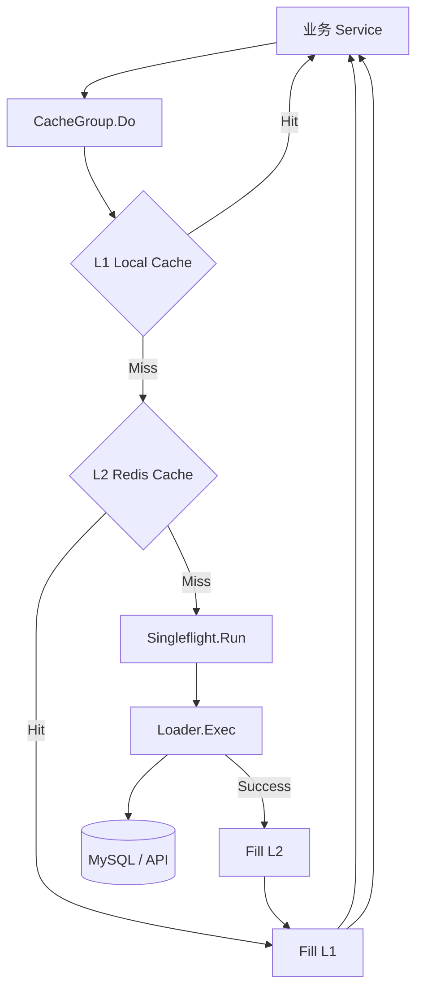

# 高并发 POS 系统缓存框架 设计文档

> 本文档定义 高并发缓存框架 的技术设计和实现方案。

## 📋 概述

本框架旨在为 TTPOS 提供一套统一的、高性能的缓存访问层。通过集成 Singleflight (请求合并) 模式与多级缓存（L1 本地内存 + L2 Redis），确保在高并发环境下，核心资源的访问是幂等的且对底层基础设施（MySQL/外部API）是友好的。

框架位于 `main/pkg/cache`，作为 Go Main 项目的基础设施组件。

---

## 🎯 规范对齐

### Go Main 规范 (go-main.mdc)

- **泛型支持**: 使用 Go 泛型确保框架可处理任何类型的业务数据。
- **错误处理**: 统一返回 `error`，使用 `errors.WithMessage` 包装业务执行中的错误。
- **依赖管理**: 仅依赖 `golang.org/x/sync/singleflight` 和核心 Redis 包。

---

## 🔄 代码复用分析

### 集成点

- **Redis Client**: 复用 `main/pkg/database/redis.go` 中的全局 Redis 客户端。
- **Logger**: 使用 `main/pkg/logger` 记录 Singleflight 合并命中情况和缓存穿透保护日志。

---

## 🏗️ 架构设计

### 分层设计原则

框架通过 `CacheGroup` 结构体封装所有逻辑，外部调用方只需关心 `Do` 方法。



### 模块划分

#### Go Main 模块

- **pkg/cache/cache_group.go**: 核心逻辑实现。
- **pkg/cache/types.go**: 定义 `Task` 接口和配置结构体。
- **pkg/cache/local_cache.go**: 实现简单的内存 L1 缓存。

---

## 📊 数据模型

### 核心接口

```go
// Task 定义一个可合并且可缓存的任务
type Task[T any] interface {
    Hash() string              // 返回任务的唯一标识
    Exec() (T, error)          // 实际的业务执行逻辑
    TTL() time.Duration        // 缓存过期时间
}

// ICacheGroup 定义缓存组接口
type ICacheGroup[T any] interface {
    Do(ctx context.Context, task Task[T]) (T, error)
}
```

---

## 🧪 测试策略

### 单元测试

- **并发测试**: 使用 1000 个协程模拟针对同一个 Hash 的请求，验证 `Exec` 是否仅触发 1 次。
- **过期测试**: 验证 L1 过期后是否能正确回退到 L2，L2 过期后是否回退到 `Exec`。
- **错误广播**: 验证 `Exec` 返回错误时，所有并发请求是否都能接收到相同的错误。

---

## 📈 性能优化

### 优化策略

1. **零分配**: 在 Singleflight 合并阶段尽量减少对象分配。
2. **负缓存**: 针对 `Exec` 返回的“数据不存在”错误，也进行短时间的缓存（1-5秒），防止恶意穿透攻击。
3. **异步回填**: L2 命中后，可以异步更新 L1，减少响应延迟。

---

## 📚 实现清单

### Phase 1: 核心引擎实现
- [ ] 定义 `Task` 和 `ICacheGroup` 接口
- [ ] 实现基础 Singleflight 包装器

### Phase 2: 缓存层封装
- [ ] 实现内存级 L1 缓存（支持 LRU）
- [ ] 集成 Redis 级 L2 缓存
- [ ] 实现 Read-Through 闭环逻辑

### Phase 3: 测试与优化
- [ ] 编写并发压力测试脚本
- [ ] 增加 Prometheus 指标埋点（命中率监控）

---

**版本**: v1.0.0  
**创建日期**: 2025-12-20  
**作者**: xiezhihuan  
**审核者**: {审核者}
