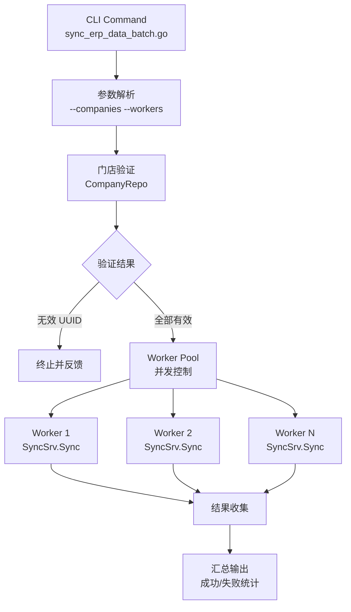

# task-main-multi-shop-sync 技术设计

## 📋 概述

| 项目       | 内容                      |
| ---------- | ------------------------- |
| Spec ID    | task-main-multi-shop-sync |
| 设计人     | 王昱                      |
| 设计日期   | 2026-02-03                |
| 总 SP      | 3                         |

---

## 🔄 代码复用分析

### 可复用代码

| 文件                              | 说明                         | 复用方式 |
| --------------------------------- | ---------------------------- | -------- |
| `main/command/sync_erp_data.go`   | 单门店同步命令实现           | 参考     |
| `main/app/service/sync.go`        | SyncSrv.Sync() 核心同步方法  | 直接调用 |
| `main/pkg/context/context.go`     | ttposContext 上下文设置      | 直接调用 |
| `main/app/repository/company.go`  | CompanyRepo 获取公司信息     | 直接调用 |

### 需要新建

| 文件                                    | 说明                           |
| --------------------------------------- | ------------------------------ |
| `main/command/sync_erp_data_batch.go`   | 批量同步命令入口               |

---

## 🏗️ 架构设计

### 架构图



### 执行流程

```
1. 解析命令行参数（--companies, --workers）
2. 初始化配置、缓存、日志、数据库管理器
3. 验证所有 company_uuid 有效性
   - 无效则终止，输出无效列表
4. 初始化服务依赖链（SyncSrv 及其依赖）
5. 创建 Worker Pool（默认 5 个 worker）
6. 分发同步任务到 workers
7. 收集执行结果，实时显示进度
8. 汇总输出成功/失败统计
```

---

## 🧩 组件设计

### CLI 命令结构

```go
// main/command/sync_erp_data_batch.go

var syncErpDataBatchCmd = &cobra.Command{
    Use:   "sync-erp-data-batch",
    Short: "批量同步多门店 ERP 数据",
    Long:  `批量同步多门店 ERP 数据，支持并发控制`,
    // ...
}

// 命令行参数
var (
    companies   []uint64  // --companies 1234,5678,9012
    workers     int       // --workers 5
)
```

### 参数设计

| 参数          | 短参数 | 类型     | 默认值 | 说明                           |
| ------------- | ------ | -------- | ------ | ------------------------------ |
| `--companies` | `-c`   | []uint64 | 必填   | 门店 UUID 列表，逗号分隔       |
| `--workers`   | `-w`   | int      | 5      | 最大并发数                     |

### 使用示例

```bash
# 同步 3 个门店，默认并发数 5
./main sync-erp-data-batch --companies 1234567890,2345678901,3456789012

# 同步多门店，指定并发数为 3
./main sync-erp-data-batch -c 1234567890,2345678901,3456789012 -w 3
```

---

## 🔧 核心实现

### Worker Pool 设计

```go
type SyncResult struct {
    CompanyUuid uint64
    CompanyName string
    Success     bool
    Error       error
    Duration    time.Duration
}

type BatchSyncer struct {
    workers   int
    syncSrv   service.ISyncSrv
    dbm       *database.DBManager
    // ... 其他依赖
}

func (b *BatchSyncer) Run(ctx context.Context, companies []uint64) []SyncResult {
    jobs := make(chan uint64, len(companies))
    results := make(chan SyncResult, len(companies))

    // 启动 workers
    var wg sync.WaitGroup
    for i := 0; i < b.workers; i++ {
        wg.Add(1)
        utils.Go(func() {
            defer wg.Done()
            for companyUuid := range jobs {
                result := b.syncOne(companyUuid)
                results <- result
            }
        })
    }

    // 分发任务
    for _, uuid := range companies {
        jobs <- uuid
    }
    close(jobs)

    // 等待完成
    wg.Wait()
    close(results)

    // 收集结果
    var allResults []SyncResult
    for r := range results {
        allResults = append(allResults, r)
    }
    return allResults
}
```

### 单门店同步（复用现有逻辑）

```go
func (b *BatchSyncer) syncOne(companyUuid uint64) SyncResult {
    start := time.Now()
    result := SyncResult{CompanyUuid: companyUuid}

    // 1. 连接门店数据库
    companyDB, err := database.NewMySQLConnection(
        config.Database,
        fmt.Sprintf("%s%d", constant.DBNamePrefix, companyUuid),
    )
    if err != nil {
        result.Error = err
        return result
    }

    // 2. 获取公司信息
    companyRepo := repository.NewCompanyRepo(companyDB)
    company, err := companyRepo.GetCompanyInfoByUuid(companyUuid)
    if err != nil {
        result.Error = err
        return result
    }
    result.CompanyName = company.Name

    // 3. 检查 ERP 开启状态
    if !company.IsOpenErp() {
        result.Error = fmt.Errorf("公司未开启 ERP")
        return result
    }

    // 4. 设置上下文
    ctx := ttposContext.NewContext()
    ctx.SetDB(companyDB)
    ctx.SetCompanyUuid(companyUuid)
    ctx.SetCompany(*company)
    ctx.SetCompanySetting(*company.CompanySetting)
    ctx.SetLanguage("zh")

    // 5. 执行同步（复用 SyncSrv）
    _, err = b.syncSrv.Sync(ctx, req.SyncReq{IsSyncExecute: true})
    if err != nil {
        result.Error = err
        return result
    }

    result.Success = true
    result.Duration = time.Since(start)
    return result
}
```

### 进度显示与结果汇总

```go
func printProgress(completed, total int, current SyncResult) {
    status := "✅"
    if !current.Success {
        status = "❌"
    }
    fmt.Printf("[%d/%d] %s %d (%s) %s\n",
        completed, total, status,
        current.CompanyUuid, current.CompanyName,
        current.Duration,
    )
}

func printSummary(results []SyncResult) {
    var success, failed int
    var failedList []SyncResult

    for _, r := range results {
        if r.Success {
            success++
        } else {
            failed++
            failedList = append(failedList, r)
        }
    }

    fmt.Printf("\n========== 同步完成 ==========\n")
    fmt.Printf("总数: %d, 成功: %d, 失败: %d\n", len(results), success, failed)

    if failed > 0 {
        fmt.Printf("\n失败门店列表:\n")
        for _, r := range failedList {
            fmt.Printf("  - %d (%s): %v\n", r.CompanyUuid, r.CompanyName, r.Error)
        }
    }
}
```

---

## ⚠️ 风险识别

| 风险                   | 影响 | 缓解措施                                         |
| ---------------------- | ---- | ------------------------------------------------ |
| 并发过高导致数据库过载 | 中   | 默认 workers=5，文档说明生产环境推荐配置         |
| 单门店同步耗时过长     | 低   | 各门店独立执行，不影响其他门店                   |
| 内存占用（大量门店）   | 低   | 使用 channel 控制任务分发，避免一次性加载        |

---

## 🧪 测试策略

### 单元测试

| 测试项             | 文件                                   | 覆盖内容                   |
| ------------------ | -------------------------------------- | -------------------------- |
| Worker Pool 逻辑   | `main/command/sync_erp_data_batch_test.go` | 并发控制、任务分发         |
| 参数解析           | `main/command/sync_erp_data_batch_test.go` | companies 解析、workers 默认值 |
| 结果汇总           | `main/command/sync_erp_data_batch_test.go` | 成功/失败统计              |

### 测试命令

```bash
cd main && go test -v ./command/... -run TestSyncErpDataBatch
cd main && go test -coverprofile=coverage.out ./command/...
```

---

## 📖 使用文档

### 命令格式

```bash
./main sync-erp-data-batch [flags]
```

### 参数说明

| 参数          | 短参数 | 类型   | 必填 | 默认值 | 说明                               |
| ------------- | ------ | ------ | ---- | ------ | ---------------------------------- |
| `--companies` | `-c`   | string | 是   | -      | 门店 UUID 列表，逗号分隔           |
| `--workers`   | `-w`   | int    | 否   | 5      | 最大并发数                         |
| `--verbose`   | `-v`   | bool   | 否   | false  | 输出详细日志到控制台               |

### 使用示例

```bash
# 1. 查看帮助信息
./main sync-erp-data-batch --help

# 2. 同步单个门店
./main sync-erp-data-batch -c 7821525520384000

# 3. 同步多个门店（默认并发数 5）
./main sync-erp-data-batch -c 7821525520384000,2368934514688000,6199432974336000

# 4. 指定并发数为 2
./main sync-erp-data-batch -c 7821525520384000,2368934514688000 -w 2

# 5. 启用详细日志输出（用于调试）
./main sync-erp-data-batch -c 7821525520384000 -v

# 6. 完整参数示例
./main sync-erp-data-batch --companies 7821525520384000,2368934514688000 --workers 3 --verbose
```

### 输出示例

**正常执行输出：**
```
========== 批量同步 ERP 数据 ==========
门店数量: 3, 并发数: 2
门店列表: [7821525520384000 2368934514688000 6199432974336000]

[1/3] 验证门店有效性...
✓ 所有门店验证通过

[2/3] 初始化服务...
✓ 服务初始化完成

[3/3] 开始同步...
[1/3] ✓ 7821525520384000 (门店A) 12.34s
[2/3] ✓ 2368934514688000 (门店B) 15.67s
[3/3] ✓ 6199432974336000 (门店C) 10.23s

========== 同步完成 ==========
总数: 3, 成功: 3, 失败: 0
平均耗时: 12.75s
```

**存在无效 UUID 时的输出：**
```
========== 批量同步 ERP 数据 ==========
门店数量: 2, 并发数: 5
门店列表: [9999999999 7821525520384000]

[1/3] 验证门店有效性...
错误: 发现无效的 company_uuid，终止执行
无效列表:
  - 9999999999: 数据库连接失败: Error 1049: Unknown database 'shop9999999999'
```

**部分失败时的输出：**
```
========== 同步完成 ==========
总数: 3, 成功: 2, 失败: 1

失败门店列表:
  - 1234567890 (门店X): 同步执行失败: ERP 连接超时

提示: 可将失败的 UUID 重新执行同步
```

### 并发数建议

| 场景           | 建议并发数 | 说明                                 |
| -------------- | ---------- | ------------------------------------ |
| 开发/测试环境  | 1-2        | 避免影响其他开发任务                 |
| 生产环境小批量 | 3-5        | 默认值，平衡效率和系统负载           |
| 生产环境大批量 | 5-10       | 在系统资源充足时可适当提高           |

### 日志文件

- 默认情况下，详细日志写入日志文件而非控制台
- 使用 `-v` 参数可将详细日志同时输出到控制台
- 日志文件位置取决于配置文件中的日志设置

### 常见问题

**Q: 如何获取门店的 company_uuid？**
A: 可以从商户管理后台获取，或通过数据库查询 `ttpos_company` 表。

**Q: 同步失败的门店如何重试？**
A: 将失败门店的 UUID 重新组成参数执行即可，例如：
```bash
./main sync-erp-data-batch -c 1234567890,2345678901
```

**Q: 同步过程中可以中断吗？**
A: 可以使用 `Ctrl+C` 中断，但已开始的同步任务会继续完成。

---

**版本**: v1.0.0
**创建日期**: 2026-02-03
