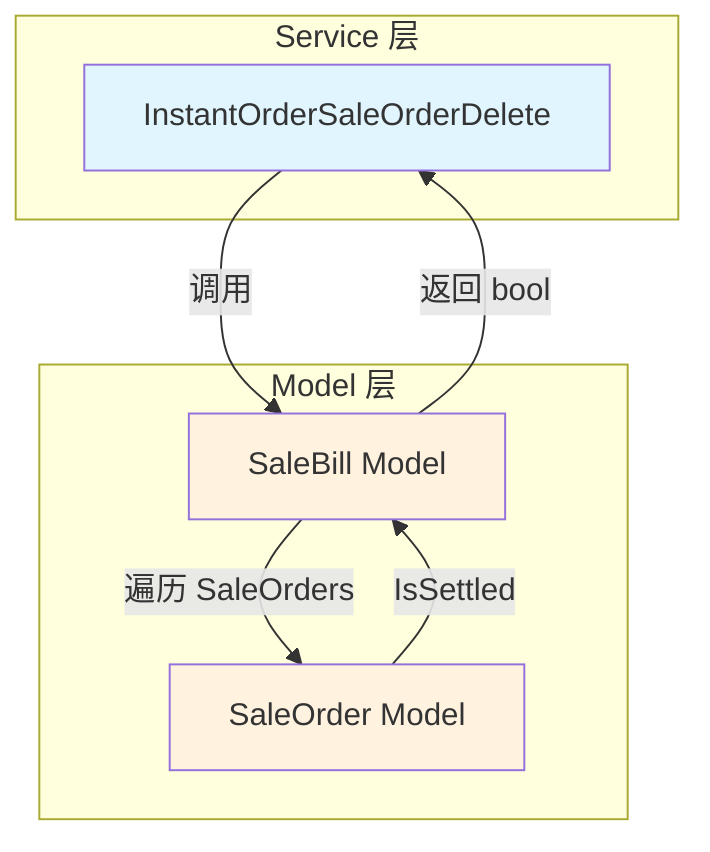

# 优化删除拆单时的账单完成判断逻辑 设计文档

> 本文档定义优化删除拆单时账单完成判断逻辑的技术设计和实现方案。

## 📋 概述

本优化任务旨在改进 `InstantOrderSaleOrderDelete` 方法的账单完成判断逻辑，将判断依据从"硬编码订单数量"改为"剩余订单结账状态"。通过在 `SaleBill` model 中新增状态判断方法，实现更通用、更符合业务逻辑的判断机制。

**核心改进**：
- 在 Model 层新增 `ShouldFinishBillAfterDelete` 方法
- Service 层调用 Model 方法替代硬编码判断
- 遵循分层架构和设计原则

---

## 🎯 规范对齐

### Go Main 规范 (go-main.mdc)

本设计完全遵循 Go Main 开发规范：

- ✅ **分层设计**: Model 层负责状态判断，Service 层负责业务流程
- ✅ **单一职责**: `ShouldFinishBillAfterDelete` 方法只负责状态判断
- ✅ **不使用 panic**: 所有错误通过 error 返回
- ✅ **命名规范**: 方法名使用大驼峰，参数名使用小驼峰
- ✅ **注释规范**: 详细的方法注释说明参数和返回值

### 设计原则对齐

本设计遵循以下设计原则：

- ✅ **单一职责原则（SRP）**: 状态判断是 Model 的职责
- ✅ **开闭原则（OCP）**: 对扩展开放（可添加更多判断方法），对修改关闭
- ✅ **依赖倒置原则（DIP）**: Service 依赖 Model 的抽象接口
- ✅ **高内聚低耦合**: 相关逻辑聚合在 Model 层

---

## 🔄 代码复用分析

### 可复用的现有组件

- **SaleBill Model**: `main/app/model/sale_bill.go` - 在此 Model 中新增方法
- **SaleOrder Model**: `main/app/model/sale_order.go` - 使用 `IsSettled()` 方法判断结账状态
- **orderSrv Service**: `main/app/service/order_base.go` - 在 `InstantOrderSaleOrderDelete` 方法中调用新方法

### 集成点

- **现有方法**: `InstantOrderSaleOrderDelete` - 替换判断逻辑，保持其他逻辑不变
- **现有方法**: `SaleOrder.IsSettled()` - 用于判断订单是否已结账
- **现有方法**: `FinishSaleBill` - 用于完成销售账单

---

## 🏗️ 架构设计

### 分层设计原则

**优化前的问题**:
```
Service 层包含状态判断逻辑
  ↓
硬编码订单数量检查
  ↓
违反单一职责原则
```

**优化后的设计**:
```
API 层 (Controller)
  ↓ 调用
Service 层 (orderSrv)
  ↓ 调用
Model 层 (SaleBill)
  ↓ 调用
Model 层 (SaleOrder)
```

**依赖关系**:
- Service 层调用 Model 层的 `ShouldFinishBillAfterDelete` 方法
- Model 层 `SaleBill` 遍历 `SaleOrders`，调用 `SaleOrder.IsSettled()` 方法
- 保持现有的并发控制（分布式锁）和事务管理

### 设计模式

**模板方法模式的应用**：
- `ShouldFinishBillAfterDelete` 定义了状态检查的骨架
- 具体的结账状态判断委托给 `SaleOrder.IsSettled()`
- 可扩展：未来可添加更多状态检查方法

**策略模式的应用**：
- 将判断逻辑从 Service 层提取到 Model 层
- Service 层通过调用不同的 Model 方法实现不同的判断策略
- 易于测试和维护

### 架构图



---

## 📊 数据模型设计

### Model 层新增方法

**文件**: `main/app/model/sale_bill.go`

**方法签名**:
```go
// ShouldFinishBillAfterDelete 判断删除指定订单后，剩余订单是否全部已结账
// 参数：deleteOrderUuid - 要删除的订单UUID
// 返回：true - 剩余订单全部已结账，应该完成账单；false - 仍有未结账订单
func (sb *SaleBill) ShouldFinishBillAfterDelete(deleteOrderUuid uint64) bool {
    for _, order := range sb.SaleOrders {
        if order.Uuid == deleteOrderUuid {
            continue // 跳过要删除的订单
        }
        if !order.IsSettled() {
            return false // 存在未结账订单
        }
    }
    return true // 所有剩余订单都已结账
}
```

**方法特点**：
- ✅ 纯函数：无副作用，不修改状态
- ✅ 时间复杂度：O(n)，n 为订单数量
- ✅ 空间复杂度：O(1)
- ✅ 可测试性：易于编写单元测试

### 依赖的现有方法

**SaleOrder.IsSettled()** - 判断订单是否已结账
```go
func (so *SaleOrder) IsSettled() bool {
    return so.SettleTime > 0
}
```

---

## 🔧 核心实现

### Model 层实现

**位置**: `main/app/model/sale_bill.go`

**实现说明**：
1. 遍历 `SaleOrders` 切片
2. 跳过要删除的订单（通过 UUID 匹配）
3. 检查每个剩余订单的结账状态
4. 如果有任何订单未结账，返回 `false`
5. 如果所有剩余订单都已结账，返回 `true`

**边界条件处理**：
- 空订单列表：返回 `true`（逻辑上合理，无剩余订单即可完成）
- 单个订单：如果该订单是要删除的，返回 `true`
- 所有订单都是要删除的：返回 `true`

### Service 层重构

**位置**: `main/app/service/order_base.go`

**方法**: `InstantOrderSaleOrderDelete`（行号: 924-1085）

**修改位置**: 约 979-1008 行（场景3的处理逻辑）

**改进前**：
```go
// 场景3: 订单1已结账 + 待删除订单无商品 + 总订单数=2（979-1008行）
if firstSaleOrder.IsSettled() && len(moveProductList) == 0 && len(saleBill.SaleOrders) == 2 {
    // 如果销售订单中没有商品，则直接删除订单
    saleOrderFrom.SetDelete()
    if err := repository.CommonRepo.Transaction(db, func(tx *gorm.DB) error {
        if err := repository.NewSaleOrderRepo(tx).UpdateSaleOrderSoftDeleteByUuid(saleOrderFrom.Uuid); err != nil {
            ctx.Log().Error("删除订单失败", zap.Error(err))
            return errors.New("删除订单失败")
        }

        // 获取门店业务设置
        businessSetting, err := s.settingSrv.GetBusinessSetting(ctx)
        if err != nil {
            return errors.WithMessage(err)
        }

        // 更新销售账单. 如果可以结束销售账单的话
        if err := s.FinishSaleBill(ctx, saleBill, businessSetting, tx); err != nil {
            return errors.WithMessage(err)
        }
        return nil
    }); err != nil {
        return nil, errors.WithMessage(err)
    }
    var err error
    shopCart, err = s.GetOrderCartInfo(ctx, request.SaleBillUuid, repository.FilterEndStatus())
    if err != nil {
        ctx.Log().Error("获取购物车信息失败", zap.Error(err))
        return nil, errors.WithMessage(err, "获取购物车信息失败")
    }
}
```

**改进后**：
```go
// 优化后：检查删除后剩余订单是否全部已结账
if len(moveProductList) == 0 && saleBill.ShouldFinishBillAfterDelete(saleOrderFrom.Uuid) {
    // 如果销售订单中没有商品，且删除后剩余订单全部已结账，则删除订单并完成账单
    saleOrderFrom.SetDelete()
    if err := repository.CommonRepo.Transaction(db, func(tx *gorm.DB) error {
        if err := repository.NewSaleOrderRepo(tx).UpdateSaleOrderSoftDeleteByUuid(saleOrderFrom.Uuid); err != nil {
            ctx.Log().Error("删除订单失败", zap.Error(err))
            return errors.New("删除订单失败")
        }

        // 获取门店业务设置
        businessSetting, err := s.settingSrv.GetBusinessSetting(ctx)
        if err != nil {
            return errors.WithMessage(err)
        }

        // 更新销售账单. 如果可以结束销售账单的话
        if err := s.FinishSaleBill(ctx, saleBill, businessSetting, tx); err != nil {
            return errors.WithMessage(err)
        }
        return nil
    }); err != nil {
        return nil, errors.WithMessage(err)
    }
    var err error
    shopCart, err = s.GetOrderCartInfo(ctx, request.SaleBillUuid, repository.FilterEndStatus())
    if err != nil {
        ctx.Log().Error("获取购物车信息失败", zap.Error(err))
        return nil, errors.WithMessage(err, "获取购物车信息失败")
    }
}
```

**修改点**：
1. ❌ 删除：`firstSaleOrder.IsSettled() &&`（不再需要单独检查订单1）
2. ❌ 删除：`len(saleBill.SaleOrders) == 2`（不再硬编码订单数量）
3. ✅ 新增：`saleBill.ShouldFinishBillAfterDelete(saleOrderFrom.Uuid)`（调用 Model 方法）

**向后兼容性**：
- ✅ 场景1-2: 保持原有行为（直接删除订单，不完成账单）
- ✅ 场景3: 扩展支持多订单场景
- ✅ 场景4-5: 保持原有行为（移动商品或直接删除）

---

## 🧪 测试策略

### Model 层单元测试

**文件**: `main/app/model/sale_bill_test.go`

**测试用例**：

| 用例 | 订单配置 | deleteOrderUuid | 预期返回 | 说明 |
|-----|---------|----------------|---------|------|
| TC1 | 订单1(已结账) + 订单2(已结账) + 订单3(已结账) | 订单2 | true | 全部已结账场景 |
| TC2 | 订单1(已结账) + 订单2(已结账) + 订单3(未结账) | 订单2 | false | 存在未结账场景 |
| TC3 | 订单1(已结账) + 订单2(已结账) | 订单2 | true | 只剩一个订单场景 |
| TC4 | 空订单列表 | 任意 | true | 空订单列表场景 |

**测试实现模板**：
```go
func TestShouldFinishBillAfterDelete_AllSettled(t *testing.T) {
    // Arrange
    saleBill := &SaleBill{
        SaleOrders: []*SaleOrder{
            {Uuid: 1, SettleTime: 1000},
            {Uuid: 2, SettleTime: 2000},
            {Uuid: 3, SettleTime: 3000},
        },
    }
    
    // Act
    result := saleBill.ShouldFinishBillAfterDelete(2)
    
    // Assert
    assert.True(t, result, "删除订单2后，剩余订单全部已结账，应返回 true")
}
```

### Service 层集成测试

**文件**: `main/app/service/order_base_test.go`

**测试场景**：

| 场景 | 订单配置 | 操作 | 预期结果 |
|-----|---------|------|---------|
| IT1 | 订单1(已结账) + 订单2(空) | 删除订单2 | 完成账单 ✅ |
| IT2 | 订单1(已结账) + 订单2(空) + 订单3(已结账) | 删除订单2 | 完成账单 ✅ |
| IT3 | 订单1(已结账) + 订单2(空) + 订单3(未结账) | 删除订单2 | 不完成账单 ✅ |
| IT4 | 订单1(已结账) + 订单2(空) + 订单3(已结账) + 订单4(已结账) | 删除订单2 | 完成账单 ✅ |
| IT5 | 订单1(已结账) + 订单2(有商品) | 删除订单2 | 返回错误 ✅ |
| IT6 | 订单1(任意) + 订单2(任意) | 删除订单1 | 返回错误 ✅ |

### 测试覆盖率要求

- ✅ Model 层测试覆盖率 ≥ 80%
- ✅ Service 层测试覆盖率 ≥ 80%
- ✅ 核心业务逻辑测试覆盖率 100%

---

## ⚡ 性能分析

### 时间复杂度分析

**ShouldFinishBillAfterDelete 方法**：
- **时间复杂度**: O(n)，n 为订单数量
- **最坏情况**: 遍历所有订单
- **最好情况**: 第一个订单未结账，立即返回
- **平均情况**: 遍历一半订单

**实际影响**：
- 拆单订单数量通常 ≤ 10
- O(n) 复杂度在此规模下几乎无影响
- 方法执行时间 < 1ms

### 空间复杂度分析

**ShouldFinishBillAfterDelete 方法**：
- **空间复杂度**: O(1)
- **无额外内存分配**
- **只使用局部变量**

### 对比分析

| 指标 | 优化前 | 优化后 | 说明 |
|-----|-------|-------|------|
| 时间复杂度 | O(1) | O(n) | n ≤ 10，实际影响可忽略 |
| 空间复杂度 | O(1) | O(1) | 无变化 |
| 数据库查询 | 0次新增 | 0次新增 | 无变化 |
| 代码行数 | 1行判断 | 10行方法 | 提高可维护性 |
| 可测试性 | 低 | 高 | Model 层易测试 |

---

## 🔒 安全考虑

### 并发安全

**现有机制保持不变**：
- ✅ 分布式锁保护 `SaleBillUuid`
- ✅ 事务保证数据一致性
- ✅ Model 层方法是纯函数，无并发问题

### 数据一致性

**事务边界**：
- ✅ 删除订单和完成账单在同一事务中
- ✅ 失败自动回滚
- ✅ 不会出现数据不一致

---

## 📈 可扩展性

### 未来扩展方向

1. **新增更多状态判断方法**：
   ```go
   // 判断是否可以拆单
   func (sb *SaleBill) CanSplitOrder() bool
   
   // 判断是否可以合并订单
   func (sb *SaleBill) CanMergeOrders() bool
   ```

2. **支持更复杂的判断逻辑**：
   ```go
   // 判断删除订单后是否需要触发其他操作
   func (sb *SaleBill) GetActionsAfterDelete(deleteOrderUuid uint64) []Action
   ```

3. **支持自定义判断规则**：
   ```go
   // 使用策略模式支持自定义判断规则
   type FinishBillStrategy interface {
       ShouldFinish(sb *SaleBill, deleteOrderUuid uint64) bool
   }
   ```

---

## 📝 实施计划

### Phase 1: Model 层开发（0.5 小时）
1. 在 `sale_bill.go` 中新增 `ShouldFinishBillAfterDelete` 方法
2. 编写详细的方法注释
3. 自测方法逻辑

### Phase 2: Service 层重构（0.5 小时）
1. 定位 `InstantOrderSaleOrderDelete` 方法的判断逻辑
2. 替换为调用 Model 方法
3. 确保其他逻辑保持不变

### Phase 3: 单元测试（1 小时）
1. 编写 Model 层单元测试（4 个用例）
2. 编写 Service 层集成测试（6 个用例）
3. 确保测试覆盖率达标

### Phase 4: 代码审查和优化（1 小时）
1. 团队 Code Review
2. 性能检查
3. 安全检查
4. 文档更新

---

## 🔗 相关文档

- **需求文档**: `requirements.md`
- **任务分解**: `tasks.md`
- **分析文档**: `docs/human/guides/order-instant-order-sale-order-delete-analysis.md`
- **提案文档**: `docs/team/proposals/2025-11/optimize-delete-order-finish-bill-logic.md`

---

**版本**: v1.0.0  
**创建日期**: 2025-11-26  
**作者**: xiezhihuan  
**审核者**: 待审核

